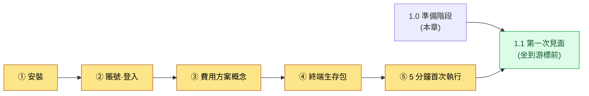
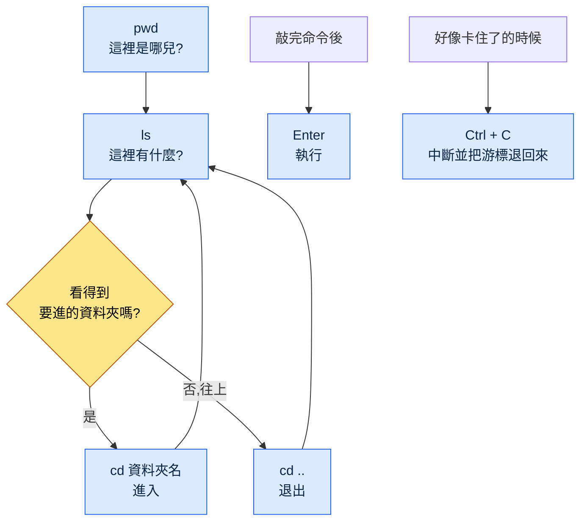

# 1.0 開始之前 —— 安裝·賬號·費用·終端生存包

1.1 是"第一次見面"。是坐在閃爍的游標前、敲點什麼試試的環節。但要坐到那個位置上,先得準備好一些東西。工具已經裝好,登入已經完成,大致知道費用是怎麼產生的,在黑屏前會敲上幾個字。本章比 1.1 還要靠前一步。

很多入門書會跳過這一步。只寫一行"開啟終端"就略過去了。可入門者恰恰就卡在那一行。終端在哪裡、要裝什麼、裝的過程中冒出紅字該怎麼辦——在第一行就停下的人,根本到不了 1.1。本章的目標只有一個,就是讓你不要卡在第一行。

本章分為五個部分。安裝、賬號·登入、費用方案的概念、終端生存包,以及"5 分鐘首次執行"清單。按順序跟下來,坐到 1.1 那個位置上的準備就完成了。



---

## 1.0.1 安裝 —— 各作業系統一行命令

安裝的原則是遵循官方指引。工具經常變化,通過非官方渠道下載的安裝檔案有風險。所以本書不附下載連結,而是教你如何找到官方渠道。在搜尋框裡輸入"Claude Code 官方文件"或"Claude Code install",Anthropic 的官方文件頁面會排在最前面。安裝命令直接照搬那個頁面上的,是最安全的做法。

大方向最好先了解一下。Claude Code(本書統一用英文寫法)是一個在終端裡執行的工具,通常用一行命令安裝。各作業系統的流程略有不同。

| 作業系統 | 準備物 | 安裝流程(概念) |
|---|---|---|
| Windows | PowerShell(系統自帶) | 把官方文件裡的安裝命令一行貼上到 PowerShell |
| macOS | 終端(系統自帶) | 把官方文件裡的安裝命令一行貼上到終端 |
| Linux | 終端 | 把官方文件裡的安裝命令一行貼上到終端 |

三個作業系統的流程都一樣。"開啟終端 → 貼上官方文件裡的那一行 → 回車"。命令不需要背。從官方文件裡複製貼上才是正道。

安裝過程中即便冒出紅字(報錯)也不必慌張。入門者遇到的安裝錯誤大多是兩種之一。要麼是許可權問題,要麼是缺少前置工具(例如 Node.js 這類執行時)。如果出現了紅字,把整句話原樣複製去搜索或者問 AI,十有八九能解決。報錯資訊不是敵人,而是線索。

> 確認是否安裝成功的方法:在終端裡敲 `claude --version` 並回車。如果出現一行版本號,就是安裝成功了。如果出現"找不到命令"之類的提示,說明要麼還沒裝好,要麼需要重新開啟終端。把終端徹底關掉再重新開啟,然後再確認一次吧。

---

## 1.0.2 賬號·登入

裝完不等於馬上就能用。Claude Code 是一個借用 Anthropic 的 AI 模型來工作的工具,所以需要一個確認"是誰在用"的登入環節。

流程很簡單。在終端裡第一次執行 `claude`,就會出現登入指引。通常網頁瀏覽器會自動開啟,在那裡用 Anthropic 賬號登入即可(如果沒有賬號,可以在那個介面新建)。登入完成後,瀏覽器會顯示"現在可以回到終端了"之類的提示,終端那邊也會出現完成標誌。

入門者在這裡經常卡住的地方有兩處。

第一,瀏覽器沒有自動開啟的情況。這時終端裡會顯示一行很長的網址(URL)。把那個網址複製到瀏覽器位址列裡開啟就行。這不是卡住了,只是要手動多做一步而已。

第二,弄不清賬號型別的情況。在網頁聊天(Claude.ai)裡用的賬號,和 Claude Code 的賬號·費用是怎麼關聯的,這一點的政策可能因時期而異。遵循登入介面的指引和官方文件是最準確的。按照首次執行介面的提示一步步走,大多都能順利登入。

登入一次之後,在那臺 PC 上就會一直保持。不需要每次都重新登入。

---

## 1.0.3 費用方案概念 —— 包月訂閱 vs API 按量

入門者最不安的部分就是"會花多少錢?"。總有一種模糊的擔憂:是不是每敲一個字就會產生費用。先把大方向搞清楚,這種不安就會減輕。費用方式大致分兩條路。

| 方式 | 計費形態 | 類比 | 適合誰 |
|---|---|---|---|
| 包月訂閱 | 每月固定金額 | 通訊包月套餐 | 入門者·日常使用 |
| API 按量 | 用多少算多少(按 token) | 電錶 | 大量·自動化·開發整合 |

**包月訂閱**是按月支付一筆固定金額、在額度內隨意使用的方式。和手機包月套餐類似。每月花費相同,容易預測,不需要在意"每敲一行多少錢"。所以入門者通常以包月訂閱起步,心裡會更踏實(作者推測——具體的方案構成與額度因時期而變,請在官方費用頁面確認)。超過額度後,要麼等到下個週期,要麼升到更高的方案。

**API 按量**是按實際使用量(token)成比例計費的方式。像電錶一樣,用多少就計費多少。適合大量處理、自動化流水線,或者與其他程式整合的情況。用得精細就高效,但在入門階段,在對用量沒有感覺之前,成本可能難以預測。

token 是什麼、為什麼用它來計費,會在 1.2(AI 模型·token·驅動框架)裡詳細講。這裡只需記住一點。**入門者通常以包月訂閱起步。**因為每月金額固定,可以在沒有"用著用著會不會被天價賬單砸中"這種擔憂的情況下練習。方案名稱·價格·額度經常變化,所以本書不附具體數字。本書內容以 2026 年中為基準撰寫,費用方案·模型·功能在那之後仍會持續變化。當前的數值,在官方費用頁面確認最準確。

> 一句話總結:對"是不是每用一次就要花錢"的擔憂 → 包月訂閱就是每月固定。入門以包月起步,心裡會踏實。

---

## 1.0.4 終端生存包 —— 減少對黑屏的恐懼

現在來到最大的那堵牆,黑屏。1.1 之所以以"在閃爍的游標前遲疑"開場,原因就在這裡。對一雙用 GUI 工作了 24 年的手來說,終端是陌生的。但要做到不卡在第一行,需要的命令並不多。下面這六個就夠了。

| 命令 | 讀法 | 作用 | 類比 |
|---|---|---|---|
| `pwd` | pee-double-u-dee | 顯示我現在在哪個資料夾 | "這裡是哪兒?" |
| `ls` | el-es | 列出當前資料夾裡有什麼 | 開啟資料夾視窗看看 |
| `cd 資料夾名` | cee-dee | 進入那個資料夾 | 雙擊資料夾 |
| `cd ..` | cee-dee 點點 | 退回上一級資料夾 | 後退 |
| `Enter` | 回車 | 執行敲下的命令 | 確認按鈕 |
| `Ctrl + C` | control-cee | 中斷正在執行的東西 | 停止按鈕 |

(Windows PowerShell 裡 `ls`·`cd`·`pwd` 也照樣能用。macOS·Linux 也一樣。所以這六個不挑作業系統。)

用這六個命令做的事,畫成圖就是這樣。在終端裡的移動歸根結底就是在資料夾內外進進出出,和在 GUI 裡雙擊資料夾或者後退是一樣的動作。



黑屏可怕的真正原因,是"敲錯了好像會弄壞什麼"的那種感覺。但上面這六個裡沒有哪個命令會弄壞東西。`pwd`·`ls`·`cd` 只是檢視或移動,不會刪除或修改檔案。`Enter` 只是執行,`Ctrl + C` 只是中斷。所以這六個命令隨時都可以放心敲。

有時螢幕看起來像是卡住了。敲了命令卻半天沒反應,或者游標在另一行閃爍、好像在等什麼的時候。這種時候按一下 `Ctrl + C`,大多就會回到原來的游標。光是知道有這個"停止按鈕",黑屏就會變得沒那麼可怕。卡住了就用 `Ctrl + C` 退出來,重新開始就行。

最後,當敲過的字堆了一大堆、看著亂糟糟的時候,可以把螢幕清空。Windows PowerShell·macOS·Linux 都用 `clear` 命令清屏。清空了也不會讓做過的事消失,只是把看得到的字整理一下而已。

---

## 1.0.5 "5 分鐘首次執行"清單

走到這裡,準備就完成了。如果能在 5 分鐘內通過下面這五格,就有資格坐到 1.1 那個位置上了。哪怕只卡在一格,回到對應的那一節(1.0.1\~1.0.4)就行。


- [ ] ① 能開啟終端(Windows:PowerShell / macOS:終端)
- [ ] ② 敲 `claude --version` 會出現一行版本號(確認安裝)
- [ ] ③ 執行 `claude` 時已經處於登入狀態(或按指引完成登入)
- [ ] ④ 能用 `pwd` 看當前位置、用 `ls` 看資料夾內容
- [ ] ⑤ 卡住時能用 `Ctrl + C` 退出來

五格都填滿了的話,黑屏就不再是一堵未知的牆了。工具裝好了,登入完成了,知道了費用方式的大方向,也會在螢幕裡移動和停下。1.1 就在這個準備之上開始。坐到閃爍的游標前,第一次敲下"幫我總結一下這個資料夾裡有什麼",到那個位置上就行了。

---

## 1.0.6 Python·pip —— 要執行工具的話(只在需要時)

本書前半部分(第 1·2 部分)只用自然語言提示詞就能跟下來。不過第 4 部分之後的部分章節會直接執行小的 Python 指令碼(例如 `pip install pyyaml`、`pip install pyvis`)。即使第一次接觸 Python 也沒關係。有兩條路。

第一,**自己安裝的路。**Python 從 python.org 下載安裝(安裝介面裡一定要勾選"Add to PATH"),在終端裡用 `python --version` 確認。`pip` 是隨 Python 一起裝上的包安裝工具,像 `pip install pyyaml` 這樣,一行就能裝上需要的包。

第二,**交給 AI 的路(推薦)。**更簡單的路是把環境搭建本身交給 AI。在終端裡這樣請求就行。

```
確認一下是否裝了 Python,如果沒有,告訴我適合我作業系統的安裝方法。
然後給我一行命令,用來安裝本章需要的 pyyaml 包。
```

AI 會檢查你的環境並幫你生成安裝命令。卡住了就當場把報錯資訊原樣貼上,問"這個錯誤怎麼解決?"就行。每個要執行工具的章節,有這一個模式就夠了。在 Python·pip 讓你覺得有負擔的環節,那一章的「單人精簡版」會給出不寫程式碼、走得更輕鬆的路。

---

### 下一章預告
- 1.1 遊戲策劃與 Claude Code 的第一次見面 —— 坐到游標前,挺過頭 30 分鐘

---

## 動手試試

**setup**
1. 開啟你正在用的作業系統的終端(Windows:PowerShell,macOS:終端)。
2. 搜尋"Claude Code 官方文件",把官方安裝指引頁面開啟放著。
3. 把計時器設為 5 分鐘——目標是通過 1.0.5 清單的五格。

**prompt**(一行一行,按順序敲敲看。這是命令,不是自然語言提問)
```
① claude --version      # 出現版本就是安裝成功
② pwd                   # 現在我在哪個資料夾
③ ls                    # 這個資料夾裡有什麼
④ cd ..                 # 退回上一級(然後再 ls 一次)
⑤ claude                # 執行 Claude Code(出現登入指引就跟著走)
```

**verify**
- 在 ① 出現一行版本號,就說明安裝完成了。如果出現"找不到命令",關掉終端再重新開啟,然後再試一次。
- 用 ②·③·④ 檢視和移動資料夾的過程中,親自確認一下什麼都不會被弄壞。這三個是隻檢視·只移動的安全命令。
- ⑤ 執行過程中好像卡住了,就用 `Ctrl + C` 退出來。能退出來,就說明你已經親身確認了"有個停止按鈕"。

### 單人精簡版

如果你是既沒有團隊也沒有公司資料夾的個人,那就先把安裝(①)和用 `Ctrl + C` 退出來這兩件事學會。用 `claude --version` 確認"工具裝好了",用 `Ctrl + C` 確認"卡住了也能退出來",對黑屏的恐懼有一半,一個人也能在 5 分鐘內整理清楚。費用先以包月訂閱起步,就能不用擔心成本、盡情練習。
