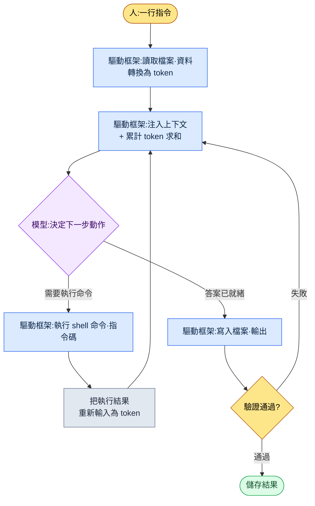

# 1.2 模型·token·驅動框架 —— 一次任務中 token 流動的路徑

這是某次做完一件任務、檢視用量時的事。這周的五份會議記錄堆在資料夾裡,我得在週一上午站會之前把"已確定的內容"整理成一頁。我在 Claude Code 窗口裡敲下一行字:"從這個資料夾的會議記錄裡,只把決策事項挑出來做成表格。"按下回車後約 0.4 秒,畫面下方閃出一行小小的灰色字。

```
Reading meeting-2026-05-25.md ... (1,840 tokens)
Reading meeting-2026-05-27.md ... (2,310 tokens)
```

這行灰色字就是本章的主題。你丟擲一句中文,工具就把它切成 token,把檔案讀成 token 餵給模型,再接收模型的回答寫進檔案。這一來一回每轉一圈,就計一次費,資料也在模型的"視野"裡不斷累積。本章用遊戲策劃的語言,拆解這行灰色字背後發生的事。模型·token·上下文·驅動框架,這四個詞就夠了。

> **術語備註**
> - 模型(model):生成答案的大腦。有 Opus·Sonnet·Haiku 這樣大小和性格各異的種類。
> - token:把文字切碎後的片段。計費·速度·視野都以這個單位來數。
> - 上下文視窗(context window):模型一次能裝進腦中的 token 最大量。
> - 驅動框架(harness):讓模型幹活的車體。Claude Code 就是一例。

---

## 1.2.1 驅動框架迴圈 —— 灰色字的真面目

上面那行灰色字不是隨機日誌,而是一個固定迴圈中的一格。驅動框架(harness)所做的事歸根結底就是快速地轉同一個圈:把檔案讀出來餵給模型,模型說"執行這條命令"就去執行,再把結果重新餵給模型。這個圈一直轉到任務結束為止。



在這張圖裡,人動手的格子只有最上面(指令)和最下面(確認驗證結果)兩處,中間的圈由驅動框架自主運轉。讀五份會議記錄時灰色字閃了五次,就是把 `Read → Inject` 這格轉了五圈。換成網頁聊天,你得親自開啟五個檔案複製·貼上。驅動框架替你幹掉這份勞動——這正是把聊天機器人和 CLI 型驅動框架分成兩種不同工具的決定性差別。

迴圈每轉一圈,就在 `Inject` 格里把累計 token 求和。所以不先理解 token,這個迴圈的成本和上限都看不見。先從 token 看起。

---

## 1.2.2 token —— 一次任務花掉的真實貨幣

token 不是字,而是模型把文字切開後的片段。按經驗法則,英文大約 4 個字元算 1 個 token,中文(及韓文)大約 2 個字元接近 1 個 token(這不是官方換算,而是運營用的粗估——實際值由模型的分詞器決定,且因句而異)。含空格 20 個字元,大致就是 10 個 token 上下。

把那次會議記錄任務用 token 跟一遍(下面的數字是同一任務的單次測量。會隨會議記錄篇幅·摘要長度變化,所以請把它當作量級和比例來讀,而非絕對值)。

| 步驟 | 做什麼 | token(輸入) | token(輸出) |
|---|---|---|---|
| 指令 | "只挑決策事項做成表格"一行 | \~25 | — |
| 讀會議記錄 ×5 | 5 個 md 檔案正文 | \~10,400 | — |
| 注入分類規則 | 會議類別 atom 1 條(JIT) | \~480 | — |
| 模型推理·製表 | 把 12 條決策做成表 | — | \~1,600 |
| 驗證再輸入 | 對 Linter 揪出的 1 處遺漏再追問 | \~320 | \~210 |
| **累計** | | **\~11,225** | **\~1,810** |

有兩點扎眼。第一,我敲的指令是 25 個 token,而整個任務光輸入就超過 1 萬 1 千 token。成本幾乎全部不來自我的句子,而來自工具讀進來的資料。第二,輸出(1,810)大約是輸入(11,225)的六分之一。大多數策劃自動化都是這樣讀得多、寫得少。所以要降本,與其打磨輸出,不如治理輸入資料的量,後者效果大得多。

任務結束後敲 `/context`,就能看到這個會話佔了多少上下文。不留意 token 時,它就像列印紙一樣無意識地流走;一旦視覺化,姿態就變了。這份視覺化正是節約的起點。

治理 token 的工具不是抽象的節約精神,而是把輸入資料細緻處理的具體技法。

1. **JIT 注入** —— 不預先把全部資料都裝上,只在需要時用關鍵詞匹配拉取。上表的"注入分類規則 480 token"就是一例。進來的不是會議分類規則的整篇文件(數千 token),而僅是匹配到的一條 atom。
2. **摘要快取** —— 長文件在供人看的原件之外,另備一份供 AI 看的摘要本。AI 讀摘要本。
3. **atom 拆分** —— 一個檔案只裝一條決策(2.2 詳述),就能精確拉取所需片段,從而節約 token。
4. **整理上下文** —— 會話變長就壓縮。Claude Code 支援自動壓縮。
5. **模型選擇** —— 簡單轉換若用大模型,同樣的 token 成本也會更貴。這是下一節的主題。

其中第 1 項 JIT 注入,是本書工作環境裡實際運轉的裝置。一旦輸入一行字,`inject_memory.py` 鉤子就按分數高低匹配記憶體 atom,只挑出排名前幾條來注入,即便失敗也不阻斷工作流(實現細節在 1.3 詳述)。"只取需要的資料、只取前幾條、即便失敗也安靜"這條 token 節約原則,原樣寫進了一個程式碼檔案裡。

---

## 1.2.3 模型 —— 同一車體,不同引擎

模型就像汽車引擎,可以在 Claude Code 這同一車體上換裝 Opus·Sonnet·Haiku 這些不同的引擎。換了引擎,任務的性格就變了。

<svg viewBox="0 0 640 230" xmlns="http://www.w3.org/2000/svg" font-family="sans-serif" font-size="13">
  <rect x="0" y="0" width="640" height="230" fill="#fafafa" stroke="#ddd"/>
  <text x="20" y="28" font-size="15" font-weight="bold">模型匹配 —— 深度 vs 速度·成本</text>
  <!-- axes -->
  <line x1="80" y1="190" x2="600" y2="190" stroke="#888" stroke-width="1.5"/>
  <line x1="80" y1="190" x2="80" y2="55" stroke="#888" stroke-width="1.5"/>
  <text x="600" y="224" text-anchor="end" fill="#555">→ 速度·低成本</text>
  <text x="76" y="50" text-anchor="end" fill="#555">推理深度 ↑</text>
  <!-- Opus -->
  <circle cx="150" cy="80" r="34" fill="#7b4fbf" opacity="0.85"/>
  <text x="150" y="78" text-anchor="middle" fill="#fff" font-weight="bold">Opus</text>
  <text x="150" y="94" text-anchor="middle" fill="#fff" font-size="11">大型引擎</text>
  <text x="150" y="138" text-anchor="middle" fill="#444" font-size="11">設計評審·GDD 合成</text>
  <!-- Sonnet -->
  <circle cx="330" cy="120" r="34" fill="#3a86c8" opacity="0.85"/>
  <text x="330" y="118" text-anchor="middle" fill="#fff" font-weight="bold">Sonnet</text>
  <text x="330" y="134" text-anchor="middle" fill="#fff" font-size="11">中型引擎</text>
  <text x="330" y="170" text-anchor="middle" fill="#444" font-size="11">會議記錄·日常 80%</text>
  <!-- Haiku -->
  <circle cx="510" cy="155" r="34" fill="#2a9d6f" opacity="0.85"/>
  <text x="510" y="153" text-anchor="middle" fill="#fff" font-weight="bold">Haiku</text>
  <text x="510" y="169" text-anchor="middle" fill="#fff" font-size="11">緊湊型</text>
  <text x="510" y="205" text-anchor="middle" fill="#444" font-size="11">配置表簡單轉換</text>
</svg>

對照策劃工作來看,大致這樣劃分。像系統設計評審、整合多份資料合成 GDD(Game Design Document,遊戲設計文件,即詳細規格書)初稿這類需要深度推理和一致性的活,交給 Opus;像會議記錄決策抽取、每日摘要這類大多數日常工作,交給 Sonnet;像資料表的簡單格式轉換這類幾乎不需要判斷的活,交給 Haiku。前一節的會議記錄任務跑在 Sonnet 上,也是按這個標準——挑出決策搬進表格,比起深度推理,更講究均衡與速度。

引入初期人人都會掉進一個陷阱:想把所有任務都跑在最好的引擎,也就是 Opus 上的衝動。順著這股衝動走,成本·速度的負擔很快會轉成運營負擔,而"讓模型去匹配任務"的手感也立不起來。運營真正的本事不是每次都在腦子裡挑模型,而是在模式成型後用自動化把它固化下來。

- 寫每日覆盤 → 自動用 Sonnet
- 系統設計評審 → 自動用 Opus
- 資料表一致性檢查 → 自動用 Haiku

這類固化,就把模型明確寫進 settings.json 或斜槓命令裡(1.3 詳述)。一旦固化,每次挑選的工夫就沒了。

模型大約每半年出一個新版本,即便名字相同,4.5 和 4.6 也不一樣。新版本出來時,只拿工作流中最核心的五項任務、用同樣的輸入做對比。要全部測試會累垮。光看這五項的結果差異,就足以判斷要不要切換。

---

## 1.2.4 上下文視窗 —— 迴圈逐漸填滿的上限

前面說過,迴圈每轉一圈,就在 `Inject` 格里累積 token。那份累積撞上的天花板就是上下文視窗,也就是模型一次能處理的 token 最大量。拿人來比,就是工作記憶(working memory)。

- Claude 4 系列:標準 200K token,擴充套件 1M token 選項
- 200K token ≈ 以中文計約 300 頁、以韓文計約 A4 400 頁篇幅

前面那個會議記錄任務,累計輸入是 1 萬 1 千 token 級,相對 200K 天花板只佔 6% 出頭,很寬裕。但若不切換任務、在同一窗口裡把會話拖得很長,就會逼近天花板。一旦裝滿,舊內容就被截掉,模型開始丟失前半部分的"記憶",自動壓縮隨之觸發,先前的對話被替換成摘要本。

治理這個天花板的習慣有四條。

| 模式 | 何時 |
|---|---|
| 會話分離 | 轉向別的主題時,新開一個會話 |
| 顯式壓縮 | 一件任務結束後,只留核心再壓縮 |
| 記憶體外接 | 常用資料拆成 atom,用 JIT 隨時注入 |
| 上下文視覺化 | 用 `/context` 用眼睛確認當前用量 |

遊戲策劃常碰到的吃重場景,是會議資料·策劃案·資料表同時需要的任務,這時 1M 選項就有用。不過 1M 伴隨成本·速度負擔,所以平時 200K 就夠,只有資料包真的很大時才動用。

---

## 1.2.5 驅動框架真正過濾虛假之處 —— 驗證格

回到迴圈圖最下面的 `驗證通過?` 格。沒有這一格,模型那套煞有介事的謊話就會原樣存進檔案。模型有時會自信滿滿地把錯誤答案當成正確答案丟擲來(幻覺,hallucination),這種頻率隨代際上升而下降,但不會歸零。所以把驗證設為常設的一格。

策劃中危險的幻覺很具體:引用一個根本不存在的資料表列,用錯誤的公式算數值,或者把會議上沒敲定的事當成已確定的來摘要。會議記錄任務裡最可怕的是第三種——"只討論、暫時擱置的事項"悄悄爬上了決策表。

驗證有五種模式。

1. **原文對照** —— 把 AI 輸出與原始資料再比一遍("幫我確認這個是不是真在那份資料裡")。
2. **雙向轉換** —— A→B 轉換後,再把 B→A 反向轉換,看是否一致。
3. **抽樣評審** —— 從輸出裡隨機挑 3\~5 條由人親自確認。
4. **Linter 自動化** —— 自動檢查輸出是否違反既定的格式·範圍·規則。
5. **兩模型交叉驗證** —— 讓 Opus 評審 Sonnet 的輸出。

不必每次五個全做,而是按任務的風險度挑 1\~3 個。會議記錄任務裡,把第 4 項 Linter("決策是否齊全包含主體·內容·期限")和第 3 項抽樣評審做一次捆在一起。前面 token 表最後一行"驗證再輸入 320 token",正是 Linter 揪出遺漏、向模型回問的那一來一回,換成迴圈圖就是 `驗證失敗 → Inject` 又多轉了一圈。

每次都靠人全檢,引入效果就減半,所以驗證本身也是自動化物件。會議記錄決策抽取由 Linter 檢查格式遺漏,資料錶轉換檢查行數·合計·外部索引鍵一致性,GDD 自動生成檢查核心章節遺漏。通過的人就不用看,只看沒通過的。這就像在塞滿櫃子的檔案裡,只把貼了紅標的資料夾拿到手中的畫面。讓人的視線只落在危險的地方——這正是驗證自動化的目的。

---

## 1.2.6 四個詞被串進一次任務的所在

現在把那次會議記錄任務從頭到尾捋一遍,看四個詞如何被串進一行。

| 格 | 幹什麼 | 對應哪個概念 |
|---|---|---|
| 1 | 在會議記錄資料夾裡執行 Claude Code | 驅動框架 |
| 2 | 任務是分析會議記錄,故選 Sonnet | 模型 |
| 3 | 合計約 11K token,在 200K 視窗內 —— OK | token·上下文 |
| 4 | 把會議分類規則 atom 用 JIT 自動注入 | token(節約) |
| 5 | 模型把 12 條決策輸出為表 | 模型·驅動框架迴圈 |
| 6 | Linter 查出 1 處格式遺漏 → 回問補全 | 驗證(迴圈多 1 次) |
| 7 | 以 `weekly-decisions-2026-W21.md` 儲存·提交 | 驅動框架 |

如果用手做,開啟五份會議記錄讀一遍、只挑出決策搬抄、再對齊格式,要花 30 分鐘。一旦自動化就縮到 5 分鐘,而這 5 分鐘里人手只做掃一遍驗證抽樣這一件事。人的時間只落在真正需要的地方(看擱置事項有沒有被錯當成決策爬上去)。關鍵不是省下的 25 分鐘,而是那道視線落點變了。

---

## 1.2.7 常見誤解

"Opus 總是更好"最常見。若無視成本·速度確實如此,但對簡單任務而言 Opus 是浪費。按任務匹配才是答案。

"1M 上下文總是必需的"也常出現。大多數 200K 就夠,1M 伴隨負擔,所以只用在資料包真的很大時。

"驗證是人來做的"只對一半。可自動驗證的部分佔多數,人則專注剩下的。

"token 不用操心"在個人工作裡某種程度上行得通,但多人一起用時,累計成本會迅速變大。從一開始就把視覺化·節約模式固定下來更穩妥。

"驅動框架沒有差別"也意外地多。即便是同一個模型,是聊天機器人還是 CLI,也會分成不同的工具。前面看到的有沒有複製·貼上勞動,就是那個差別。

---

## 1.2.8 動手試試

用一件小任務,親手把本章的四個詞跑一遍。

**setup**

- 在已安裝 Claude Code 的狀態下,準備一個裝有 2\~3 份文本筆記(會議記錄·備忘)的資料夾。
- 在那個資料夾裡開啟 Claude Code。

**prompt**

```
從這個資料夾的筆記裡,只挑出"已確定的內容",
做成主體·內容·期限 3 列的表格。
擱置·討論中的事項剔除,併為表中每一行
標上它來自哪個檔案的檔名。
```

**verify**

- 任務結束後敲 `/context`,看看這個會話用了多少 token(你會發現輸入比想象中大)。
- 挑表裡一兩行,開啟所標的檔名,與原文對照確認它是否真以"決策"寫明(原文對照驗證)。
- 掃一遍看擱置的事項有沒有被錯放進表裡(抽樣評審)。

**單人精簡版**

如果你剛開始用工具,上面只需抓住兩件事。第一,把筆記整個資料夾交出去,別親自複製·貼上(交給驅動框架迴圈)。第二,輸出表一律連同檔名一起拿到,只對可疑的行開啟原文看。模型選擇或 token 視覺化,等熟練了再加也不遲。不用手搬資料、把輸出與原文對照,光這兩個習慣,引入就立穩了一半。

---

### 本章要點
- 驅動框架自主運轉讀取→執行→再輸入的迴圈,人只在指令和驗證兩格動手
- 一次任務的成本幾乎全部不來自我敲的指令,而來自工具讀進來的資料
- 模型按任務換裝,上下文天花板和驗證則用自動化來治理

### 下一章預告
- 第 3 章. 記憶體·許可權·配置基礎設施 —— 一次配好便永久幹活的根基
