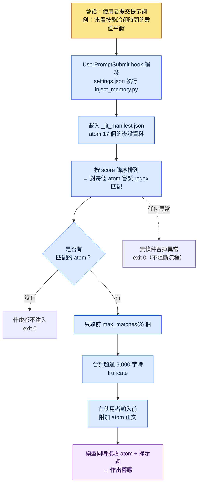

# 1.3 記憶·許可權·配置基礎設施

我開啟一個新會話，輸入"來看一下技能冷卻時間的數值平衡吧"。在按下回車之前，螢幕下方有一行灰色小字一閃而過：`[memory injected: 2 atoms, 1,842 chars]`。我並沒有開啟任何檔案，這意味著上週固化下來的冷卻時間規則文件，已經被附加到了模型輸入的前面。這就是搭好基礎設施的工作環境發出的第一個訊號。開啟工具的那一刻，工具已經記得我。

要讓這個畫面成立，需要三樣東西提前各就各位。AI 記住什麼（記憶）、AI 在沒有人工批准的情況下能做什麼（許可權），以及開關這兩者的中央開關（settings.json）。第一次安裝最多花一個小時，而這一個小時會化作此後 6 個月裡每天省下的時間回到你身邊。這是一筆幾乎能全額收回的投資。

本章是一段實地走查（walkthrough）：依次展開作者在個人 PC 上實際執行的那一行 `settings.json`、它所呼叫的 `inject_memory.py`，以及那個檔案讀取的 `_jit_manifest.json`，一步步跟著走。讀到最後，你就能親手指出"記憶被自動注入"這句話，到底發生在哪個檔案的哪一行。

---

## 1.3.1 settings.json —— 一切的起點，只有一行

先從結論看起。在作者的個人 PC 上，開啟記憶自動注入的，就是 `settings.json` 裡僅有的一個程式碼塊。

```json
{
  "hooks": {
    "UserPromptSubmit": [
      {
        "hooks": [
          {
            "type": "command",
            "command": "python ~/.claude/hooks/inject_memory.py"
          }
        ]
      }
    ]
  }
}
```

把這個程式碼塊說的話翻譯成大白話就是："每當使用者提交提示詞的事件（`UserPromptSubmit`）發生時，就執行一次名為 `inject_memory.py` 的 Python 指令碼。"就這麼簡單。不是 AI 聰明到會自動記住，而是每當有輸入進來時，人事先登記好的指令碼就插進來執行一次的結構。

`settings.json` 是控制 Claude Code 所有行為的中央檔案，分為兩層。

- `~/.claude/settings.json` —— 全域性。對所有會話生效。可與團隊共享的配置。
- `~/.claude/settings.local.json` —— 本地。僅在這臺 PC 上生效。個人 PC 的特殊配置。

兩者會合並後生效。所以作者把團隊需要共享的 hook、許可權放在 `settings.json`，把僅在這臺家用 PC 上使用的絕對路徑或個人工具路徑分開放在 `settings.local.json`。這樣的分離既能在協作時避免 git 衝突，也能防止個人配置洩漏到團隊倉庫裡。

除了 hook 之外，還有幾個經常會用到的條目。

- `effortLevel` —— 模型的推理深度。low / medium / high。像策劃案設計這種需要深度判斷的工作，就設為 high。
- `permissions` —— AI 在沒有批准的情況下可以執行的命令範圍（1.3.4 詳述）。
- `enabledPlugins` —— 已啟用的外掛列表。

這裡有一個最重要的運營習慣。`settings.json` 哪怕只有一個小小的筆誤，都會讓工具本身起不來。JSON 裡少一個逗號，解析就會崩。所以修改前備份是必須的。作者的 PC 上實際就留有這樣的備份檔案。

```
settings.json.bak_2026-05
settings.local.json.bak_2026-05
```

用日期字尾備一份，回滾只要 1 秒。用 git 管理就更好了。就像抽屜裡的一把舊鑰匙，平時用不上，但在鎖著的門前，總會有非用一次不可的那一刻。

---

## 1.3.2 inject_memory.py —— hook 內部實際發生的事

現在進入 `settings.json` 呼叫的指令碼內部。這是走查的脊柱。程式碼只有一百來行，但核心是五個動作。



把這五個動作展開來說就是這樣。

**1）讀取 manifest。** 指令碼首先開啟 `~/.claude/projects/C--Users-user/memory/_jit_manifest.json`。這個檔案裡整理著 atom 的後設資料（名稱·路徑·匹配 regex·分數）。作者的個人 PC 上目前登記了 17 個 atom。

**2）按 score 降序排列。** 每個 atom 都有一個 `score` 值。分數越高的 atom，越先被嘗試匹配。當同一個關鍵詞命中多個 atom 時，這個分數決定誰擁有優先權。

**3）用 regex 匹配。** 把使用者輸入的字串與每個 atom 的 `regex` 模式逐一比對。輸入裡只要有"冷卻時間"，帶有 `쿨다운|cooldown|GCD` 模式的 atom 就會被命中。比對時不區分大小寫。

**4）最多隻擷取 3 個。** 無論匹配出多少，只要超過 `max_matches`（作者環境是 3）就只保留前 3 個。如果被選中的 atom 正文合計長度超過 6,000 字，就 truncate。用雙重上限來防止輸入膨脹，是一道安全裝置。

**5）無論出什麼異常，都以 exit 0 結束。** 這是設計的核心。無論 manifest 損壞、檔案消失，還是 regex 寫錯，指令碼都會悄悄吞掉異常，以退出碼 0 結束。因為 hook 一旦以非 0 的碼退出，使用者的提示詞本身可能就被阻斷。"哪怕記憶注入失敗，也絕不阻斷使用者的工作流程"這條原則，被記錄在程式碼最外層的 try/except 裡。

重心落在第 4 條和第 5 條上。第 4 條（上限）防止記憶把 token 撐爆，第 5 條（吞掉異常）防止基礎設施妨礙工作。兩者都是同一套哲學的兩副面孔——"自動化不讓人覺得礙手礙腳"。

---

## 1.3.3 _jit_manifest.json —— 喚醒 atom 的關鍵詞字典

1.2 裡承諾過"只取需要的資料、只取前幾個、失敗也悄悄略過"這條節省 token 的原則，並把實現細節留到了本章。那個細節就住在 `inject_memory.py` 讀取的 manifest 裡。它是 JIT（Just-In-Time，僅在需要時才載入資料的方式）的心臟，一個 atom 的條目長這個樣子。

```json
{
  "atoms": [
    {
      "name": "combat_cooldown_rule_v2",
      "path": "atoms/combat/combat_cooldown_rule_v2.md",
      "regex": "쿨다운|cooldown|GCD",
      "score": 80
    },
    {
      "name": "user_health",
      "path": "memory/user_health.md",
      "regex": "건강|복약|컨디션|약물",
      "score": 95
    }
  ],
  "config": {
    "max_matches": 3,
    "case_insensitive": true
  }
}
```

四個欄位定義一個 atom。

- `name` —— atom 的唯一名稱。
- `path` —— 一旦匹配就去讀取正文的檔案路徑。
- `regex` —— 定義哪些關鍵詞出現在輸入裡時會喚醒這個 atom 的模式。
- `score` —— 排序優先順序。越高就越先被匹配、越先佔到位置。

`config` 塊裡的 `max_matches: 3`，就是 1.3.2 中看到的"最多 3 個"上限的出處。用手改 manifest，行為立刻就變。

這裡點一下規模感。作者的**個人 PC** 用 17 個 atom、一份 manifest 就輕量地跑起來了。相比之下，公司實務環境（專案A）截至 2026 年 5 月的備份裡，登記著團隊 atom 304 個、skill 48 個。有一個 hot atom 的 score 高達 356.53（屬於處理檔名規則的 `view_html_filename_convention` 系列），它並非一開始就高，而是在反覆呼叫·驗證中累積下來的痕跡。

個人 PC 的 17 個與公司的 304 個之間的差距說明：哪怕是同一套 JIT 機制，資料堆積的速度和規模也與專案密度成正比。沒必要一開始就造出 304 個。從 5 個核心 atom 起步，每週固化一兩個，不知不覺 manifest 就厚起來了。

> 作者推測（未經驗證）：關於 score 隨匹配·驗證次數累積的說法，是基於運營模式的一種解讀。分數的計算公式本身會隨各環境的 manifest 設計而不同，因此上面 356.53 這樣的絕對值只是作者環境的實測快照，並非通用標準。

記憶分兩層來放的原則，這裡再點一遍。

| 區分 | 位置 | 何時載入 | 用途 |
|---|---|---|---|
| 全域性 | `~/.claude/memory/` | 所有會話 | 本人身份·協作規則·語言設定 |
| 專案 | `~/.claude/projects/<專案>/memory/` | 對應專案的會話 | 各專案的 atom·規則·資料 |

全域性保持輕量更安全。一旦全域性變重，那份重量就會以 token 成本累積到每一個會話上。拿辦公室打比方，全域性就是桌上的名片夾（越輕每天越好用），專案記憶則是旁邊櫃子裡的資料夾（按專案單位變厚也不會增加平時的負擔）。所以自動載入的全局裡只放核心，豐富的資料堆到專案記憶裡，再用 JIT 在需要時喚醒。

---

## 1.3.4 許可權 —— 沉澱工作痕跡的白名單

接下來是基礎設施的第三根支柱，許可權。Claude Code 可以刪檔案、執行命令、呼叫外部 API。強大與危險結伴而來。許可權系統管理著這份危險。

許可權分兩類。無需人工批准就自動執行的，和每次都要拿到批准的。哪一類放什麼，由 `settings.json` 的 `permissions` 塊定義。

```json
{
  "permissions": {
    "allow": [
      "Bash(ls:*)",
      "Bash(git status:*)",
      "Bash(git diff:*)",
      "Read(*)",
      "Grep(*)"
    ],
    "deny": [
      "Bash(rm -rf:*)",
      "Bash(git push --force:*)"
    ]
  }
}
```

這裡需要一次視角的轉換。這份 `allow` 列表不是單純的配置值，而是**工作痕跡的沉澱**。一開始只把讀取·檢索這類放進自動允許，幾乎是空的。可是同樣的工作反覆做上一兩個月，就會冒出"這個命令每次都要按批准好煩"這樣的模式，於是把它們一個個挪進 `allow`。變長的列表，正是"我用這個工具反覆做了什麼"的指紋。

作者的公司環境（專案A）有大約 80 個自動允許的模式。從 20 個起步，歷經 6 個月又加上了 60 個，把那 60 個倒著讀，過去半年反覆做了哪些工作便一目瞭然。資料表提取、關係圖生成、模式（schema）文件化——常用的工具，正是常常被允許的許可權。

許可權運營中會沉澱下四種模式。

- **從白名單（Whitelist）起步** —— 自動允許以最小集合出發，只在需要時才追加。不是先大開再收窄，而是先緊閉再開啟的方向。
- **危險命令明示阻斷** —— 像 `rm -rf`、`git push --force` 這種一次事故就致命的命令，寫進 `deny`。哪怕自動允許越擴越廣，這兩個也絕不去碰。
- **定期清理** —— 每個季度重新審視 `allow`，把已經不用的許可權去掉。痕跡只堆不清，就成了噪聲。
- **按領域分離** —— 把全域性許可權和專案許可權分開。就像家用 PC 和公司 PC 有不同的策略，每個環境的允許範圍都不一樣。

每次都彈出批准彈窗，人會累。也有減輕疲勞的裝置。可以用 `fewer-permission-prompts` 之類的斜槓命令把頻繁出現的模式批次登記，或在一個會話內給出臨時允許，或僅在個人工作中使用全權自動允許模式。不過最後這個選項，在團隊環境裡不推薦。

疲勞感與安全之間的平衡，由本人來調。太嚴格工作轉不動，太寬鬆會出事故。哪怕寬鬆地起步，只要備好季度清理的週期，平衡自然會找到位置。

---

## 1.3.5 會話開始時 —— 記憶與許可權一同載入的全景

到目前為止看到的三根支柱（settings·記憶·許可權）在一個會話裡如何同時運作，以一行輸入為基準展開來看。下面是輸入"來看技能冷卻時間的數值平衡"時實際發生之事的一個剖面。

<svg viewBox="0 0 720 400" xmlns="http://www.w3.org/2000/svg" font-family="sans-serif" font-size="13">
  <rect x="0" y="0" width="720" height="400" fill="#fafafa"/>
  <!-- 세로 레인 -->
  <rect x="20" y="20" width="200" height="360" fill="#eef3fb" stroke="#9bb8e0"/>
  <rect x="260" y="20" width="200" height="360" fill="#eef9f0" stroke="#9bd0a8"/>
  <rect x="500" y="20" width="200" height="360" fill="#fdf3ec" stroke="#e0b893"/>
  <text x="120" y="42" text-anchor="middle" font-weight="bold">settings.json</text>
  <text x="360" y="42" text-anchor="middle" font-weight="bold">記憶 (JIT)</text>
  <text x="600" y="42" text-anchor="middle" font-weight="bold">許可權 (permissions)</text>
  <!-- settings 레인 박스 -->
  <rect x="35" y="60" width="170" height="46" rx="5" fill="#ffffff" stroke="#7aa0d0"/>
  <text x="120" y="80" text-anchor="middle">UserPromptSubmit</text>
  <text x="120" y="97" text-anchor="middle">hook 觸發</text>
  <rect x="35" y="130" width="170" height="46" rx="5" fill="#ffffff" stroke="#7aa0d0"/>
  <text x="120" y="150" text-anchor="middle">inject_memory.py</text>
  <text x="120" y="167" text-anchor="middle">執行（保證 exit 0）</text>
  <!-- 메모리 레인 박스 -->
  <rect x="275" y="130" width="170" height="46" rx="5" fill="#ffffff" stroke="#5fae7e"/>
  <text x="360" y="150" text-anchor="middle">manifest 17 atom</text>
  <text x="360" y="167" text-anchor="middle">score 排序·regex</text>
  <rect x="275" y="200" width="170" height="46" rx="5" fill="#ffffff" stroke="#5fae7e"/>
  <text x="360" y="220" text-anchor="middle">前 3 個·6000 字</text>
  <text x="360" y="237" text-anchor="middle">應用上限</text>
  <rect x="275" y="270" width="170" height="46" rx="5" fill="#ffffff" stroke="#5fae7e"/>
  <text x="360" y="290" text-anchor="middle">cooldown atom</text>
  <text x="360" y="307" text-anchor="middle">附加到輸入前</text>
  <!-- 권한 레인 박스 -->
  <rect x="515" y="270" width="170" height="46" rx="5" fill="#ffffff" stroke="#cf9560"/>
  <text x="600" y="290" text-anchor="middle">allow / deny</text>
  <text x="600" y="307" text-anchor="middle">每次工具呼叫檢查</text>
  <rect x="515" y="340" width="170" height="34" rx="5" fill="#ffffff" stroke="#cf9560"/>
  <text x="600" y="361" text-anchor="middle">讀取自動 · 刪除需批准</text>
  <!-- 화살표 -->
  <line x1="120" y1="106" x2="120" y2="130" stroke="#555" stroke-width="1.5" marker-end="url(#a)"/>
  <line x1="205" y1="153" x2="275" y2="153" stroke="#555" stroke-width="1.5" marker-end="url(#a)"/>
  <line x1="360" y1="176" x2="360" y2="200" stroke="#555" stroke-width="1.5" marker-end="url(#a)"/>
  <line x1="360" y1="246" x2="360" y2="270" stroke="#555" stroke-width="1.5" marker-end="url(#a)"/>
  <line x1="445" y1="293" x2="515" y2="293" stroke="#555" stroke-width="1.5" marker-end="url(#a)"/>
  <defs>
    <marker id="a" markerWidth="8" markerHeight="8" refX="6" refY="3" orient="auto">
      <path d="M0,0 L6,3 L0,6 Z" fill="#555"/>
    </marker>
  </defs>
</svg>

三條泳道在同一次輸入上交會。settings.json 喚醒 hook，hook 挑出記憶附到輸入上，由此生成的響應在呼叫工具時，許可權作為最後一道關卡發揮作用。使用者明明只敲了"來看冷卻時間"這一行，三套基礎設施卻在看不見的地方依次幹活。這就是工具讓人感覺成了"我的工具"那一刻的內部結構。

---

## 1.3.6 首次配置指南 —— 一小時內進入可運營狀態

理論看過了，就動手。第一次裝好 Claude Code 之後，一個小時就能把上面那整張圖鋪到你自己的 PC 上。分成五個區間。

**0\~10 分鐘，確認安裝·執行。** 安裝後在終端裡啟動 Claude Code。在某個資料夾裡問一句"這個資料夾裡有什麼？"，確認能得到響應。先看工具是不是活著。

**10\~25 分鐘，寫好三個全域性記憶。** 自動載入的全域性，三個檔案就夠了。

- `MEMORY.md`（5 行）—— 本人身份一行 + 通向其他檔案的指標。
- `user-profile.md`（20\~30 行）—— 姓名·角色·專長領域·聯絡方式。
- `feedback-collaboration-style.md`（20\~30 行）—— 語言·語氣·執行優先·說明簡潔這類協作規則。

照著作者的樣例原樣抄來起步也好。在運營中慢慢打磨即可。

**25\~40 分鐘，settings.json 基本配置。** 把 `effortLevel` 設為 high，放入許可權起始集（讀取·檢索自動，寫入·刪除需批准），再備一份備份（`settings.json.bak_<日期>`）。備份是這一區間裡最重要的一行。

**40\~55 分鐘，第一批專案 atom 五個。** 把本人每次都會忘的決定、經常要查的資訊挑五個做成 atom。資料夾是 `~/.claude/projects/<專案>/memory/`。格式參考第 5 章。有這五個，即便暫時不做 JIT manifest，僅靠全域性自動載入也能見效。

**55\~60 分鐘，測試一次。** 開啟一個新會話，丟擲一個本人領域的問題。確認全域性記憶有沒有自動載入，響應的語氣是否遵循本人的協作規則。

到這裡就是一個小時。JIT manifest 與 hook，等 atom 超過 50 個、自動載入開始變重的時候再引入也不遲。到那個時候，把 1.3.2 的 `inject_memory.py` 鋪上去就行。

---

## 1.3.7 常見錯誤與規避法

引入初期反覆出現的錯誤歸為五類，而每一類都站在同一個事故成因之上。

| 錯誤 | 事故成因 | 規避法 |
|---|---|---|
| 往全域性塞太多 | 所有會話都變重、浪費 token | 全域性控制在 5KB 以內，細節轉移到專案記憶 |
| 把所有許可權設為自動允許 | 便利遮蔽了危險的第一現場 | 只把讀取·檢索設為自動，寫入·刪除需批准（含季度清理） |
| 不備份就改 settings | 損壞的 settings 讓工具本身起不來 | 改動前自動儲存 `settings.json.bak_<日期>` |
| 把 atom 無限堆進記憶資料夾 | 自動載入逼近 token 上限 | 約從 50 個起引入 JIT manifest |
| 團隊·個人配置混在一個檔案裡 | git 衝突·個人配置洩漏 | 團隊用 `settings.json`，本人用 `settings.local.json` |

這五條沒必要從第一天起就全部規避。全域性膨脹和漏備份，最好在頭一個小時內就把規避模式立住；其餘三條，則在運營一個月左右、於本人最可能出事故的位置上裝上規避裝置，會更自然。

---

## 1.3.8 第 1 部分收尾

1.1 是縮短面對工具時那份距離感的場，1.2 是抓住該工具最小運作機制的場，1.3 則是用記憶·許可權·settings 鋪好第一套基礎設施的場。這三章構成本書的匯入部分。到這裡收住，讓工具不間斷運營的基本骨架就立住了。

關鍵在於：這套骨架不是靜態的配置。manifest 的 atom 每週都在增，`allow` 列表沿著工作痕跡變長，score 經過驗證不斷累積。基礎設施不是鋪下去那一刻就完成，而是在鋪好的地基之上與使用者一同生長。個人 PC 的 17 個拉開到公司 304 個的差距，正是這份生長的距離。

從 Part 2 開始，正式進入資訊架構。第 4 章 YAML 前置資料（frontmatter）、第 5 章 Atom、第 6 章 Layer、第 7 章本體論（ontology），依次鋪開。在 1.3 裡只作為 manifest 的一個條目出現過的 atom，到 2.2 會成為一整章的主角。脊柱立住之後，各分領域的章節才能在同一套座標上找到自己的位置。

---

### 本章要點
- 記憶自動注入，是 settings.json 裡一行 hook 喚醒 inject_memory.py 的結構
- 許可權 allow 列表不是配置，而是工作痕跡的沉澱，每個季度清理一次
- 基礎設施不是鋪好就結束，而是 atom·許可權·score 一同生長的活骨架

### 下一章預告
- Part 2 開始：第 4 章。YAML 前置資料（frontmatter）—— 把所有文件變成資料

---

## 動手試試

**setup**
1. 開啟 `~/.claude/settings.json`，在改動前以 `settings.json.bak_<今天日期>` 備份一份。
2. 在 `permissions.allow` 裡放入 `Read(*)`、`Grep(*)`、`Bash(ls:*)`、`Bash(git status:*)`，在 `permissions.deny` 裡寫入 `Bash(rm -rf:*)`、`Bash(git push --force:*)`。
3. （atom 在 50 個以上時）在 `hooks.UserPromptSubmit` 裡登記 `python ~/.claude/hooks/inject_memory.py`，並在 `_jit_manifest.json` 裡寫好 atom 條目（name·path·regex·score）和 `config.max_matches: 3`。

**prompt**
- 在新會話裡，丟擲一個有意包含 manifest 中某個 atom 關鍵詞的問題。例如："以冷卻時間規則為基準，來看技能數值平衡吧"。

**verify**
- 確認輸入之後是否出現 `[memory injected: N atoms]` 之類的訊號。
- 看看預期的 atom 有沒有反映到響應裡。
- 故意往 manifest 裡塞一段損壞的 JSON 試試，確認提示詞是否依舊不被阻斷、照常運作（保證 exit 0），然後再還原回去。

**單人精簡版**
- 不要 hook，也不要 manifest，就這麼起步。在全域性 `MEMORY.md` 一個檔案裡只寫身份 3 行 + 協作規則 3 行，許可權只把 `Read(*)`·`Grep(*)` 設為自動允許。等 atom 用順手、接近 50 個的時候，再把 1.3.2 的 hook 疊上去。基礎設施是從小起步、沿著痕跡養大的，而不是一開始就備齊 304 個。
