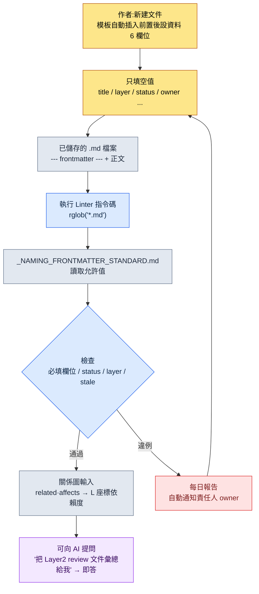

# 2.1 YAML 前置後設資料 —— 讓所有文件成為資料

里程碑構建前一天的晚上,系統策劃團隊成員 A 通過即時通訊工具問我:"這周改過獎勵曲線的文件有幾個?評審到哪一步了?"我答不上來。文件散落在某個資料夾裡,誰最後改過它、它屬於哪個里程碑,這些資訊分散在各自的記憶和檔名約定裡。那天晚上我們做的事,就是定下一條約定——在文件第一行寫上六行字。正是那六行字,讓從下一個里程碑起,團隊成員 A 的問題不必有人開啟資料夾就能回答。

文件最上方 `---` 之間寫的幾行 YAML,就叫前置後設資料(frontmatter)。這條約定讓人和機器無需讀正文一個字,就同時知道"這份文件是什麼"。本章會用一段真實執行的指令碼,跟蹤這一行字如何成為整個資訊架構的入口座標。

先只交代一個術語。本書把策劃文件分成五個 **Layer**(第 6 章正式展開):L0=世界觀·概念,L1=系統規則,L2=內容,L3=資料,L4=實現座標。自上而下依賴是正常方向。下文出現的 `layer: 2`,就是"這份文件屬於內容 Layer"的座標宣告。

---

## 2.1.1 為什麼不是"文件"而是"作為資料的文件"

傳統的策劃文件一直活在 Word、PPT、Google Docs 上。正文是為人閱讀而最佳化的。可是文件的型別、責任、狀態、位置這類元資訊,要麼融在正文裡,要麼依賴資料夾結構和檔名約定。於是要知道"這份文件屬於哪個里程碑、誰是責任人、上次評審是什麼時候",就得開啟正文看。

這裡疊加了兩重侷限。第一,文件不會自己說明身份。身份藏在人的記憶和資料夾約定裡,而那套約定隨時間腐化。第二,AI 沒有線索去推斷上下文。你對 Claude Code 說"幫我評審這份文件",它會把正文從頭讀到尾、浪費 token,也不知道責任邊界到哪裡。

YAML 前置後設資料一次解決這兩點。在文件第一行明確地寫入後設資料,人和機器都不必開啟正文就能識別文件。這就像櫃子抽屜正面貼了標籤,不拉開抽屜也知道里面裝什麼。而且這枚標籤不止是分類工具。後文會看到,僅 `layer` 這一個欄位,就成了程式化生成與自動驗收的入口座標。

---

## 2.1.2 真實的前置後設資料 —— 一份文件的頭 14 行

不用抽象示例,我們直接看專案A的獎勵曲線文件頭上實際頂著的前置後設資料(僅對 ID·實名做化名處理,結構與線上運營完全一致)。

```yaml
---
title: "主線任務第12章獎勵曲線"
layer: 2
status: review
owner: teammate_a
created: 2026-04-15
updated: 2026-05-20
related:
  - quest_main_chapter12
  - reward_curve_milestone_2
affects:
  - L3_BalanceSheet_v2
ip_check: passed
---

# 主線任務第12章獎勵曲線

(正文開始)
```

關鍵是 `---` 上方與下方的分離。上方是解析器讀取的資料,下方是人閱讀的正文。Markdown 渲染器通常會隱藏前置後設資料,閱讀時不受干擾。一個檔案同時承載資料(frontmatter)和內容(正文),成為單一真實來源。

要特別留意 `layer: 2` 和 `affects: [L3_BalanceSheet_v2]` 這兩行。它宣告的是"這份內容(L2)文件會影響資料 Layer(L3)的配置表"。僅憑這一點,工具就能不讀正文、把 L2→L3 的依賴關係畫成圖。反過來,如果一份 L3 資料文件用 `depends_on` 去引用 L1 系統規則(自下而上的反向依賴),那就是設計上的壞味道。工具會自動檢出這種反向引用。

YAML 比 JSON 更易於手寫,原因很簡單:用縮排表達結構,幾乎不需要引號,還能寫 `#` 註釋。適合策劃親自填寫。

---

## 2.1.3 標準住在哪裡 —— `_NAMING_FRONTMATTER_STANDARD`

欄位可以無限增加。越加,撰寫負擔越重,標準越容易崩。所以專案A分兩層來運營:所有文件共通的最小核心欄位,以及按領域分的擴充套件欄位。

共通的最小核心欄位有六個。

| 欄位 | 格式 | 用途 |
|------|------|------|
| `title` | 字串 | 人可讀標題。可與檔名不同 |
| `layer` | 0\~4 | 第 6 章 Layer 座標 |
| `status` | draft / review / approved / archived | 文件狀態 |
| `owner` | 使用者名稱 | 責任人(1 人) |
| `created` | YYYY-MM-DD | 建立日 |
| `updated` | YYYY-MM-DD | 最後修改日 |

僅這六個,就能即刻知道文件的新鮮度、責任與位置。頭一個月要忍住繼續新增的衝動。運營一陣後,哪個欄位真正必要,會自然浮現。

按領域的擴充套件欄位因領域而異。系統策劃愛用 `depends_on`·`affects`,戰鬥策劃愛用 `combat_phase`·`anim_target`,敘事愛用 `world_region`·`chapter`,數值策劃愛用 `data_sheet`·`formula_id`。這些擴充套件欄位不能各自隨意發散,所以由唯一一份標準文件釘死它們的正式名稱、允許值與示例。那份文件就是 `_NAMING_FRONTMATTER_STANDARD.md`。要新增欄位,必須經過這份文件。而且這份標準文件本身被註冊為 atom,與那條強制在文件名前加 Layer 編號的規則(`docs_layer_numeric_prefix_naming` atom)歸在同一序列裡管理。

這裡發生了一個重要的轉變。如果標準只是一份給人讀的文件,人就會違反它。而把標準做成**機器讀取的資料**,機器就會強制執行它。下一節就是這一轉變的真實程式碼。

---

## 2.1.4 實操記錄(worked transcript)—— 用程式碼強制標準,以及一個 datetime bug 帶來的教訓

> **實操記錄(worked transcript):完整保留的真實操作過程記錄。**

現在我讓 Claude Code 做一個"檢查專案A所有 Markdown 文件是否遵守前置後設資料標準的 Linter"。核心要求有兩點:抓出檢查項(必填欄位缺失、status 非標準值、layer 0\~4 違例、狀態為 review 卻 90 天以上沒動過的文件),並且**不要把允許值硬編碼進程式碼,而要從標準文件裡讀取**。這一分離是關鍵。改了標準,不改程式碼,檢查基準也隨之改變。(指令碼全文與直接執行步驟放在本章末尾的「動手試試」。)

這裡出過一件事。Claude 最初給出的程式碼在 STALE 檢查裡用 `today - fm["updated"]` 計算日期差,並在註釋裡寫道"像 `updated: 2026-05-20` 這樣寫的話,PyYAML 會自動解析為 `datetime.date`"。這話只對了一半。在真實文件上一跑,部分檔案丟擲了 traceback。

```
TypeError: unsupported operand type(s) for -: 'datetime.date' and 'str'
```

原因出在人手上。有的作者寫 `updated: 2026-05-20`(被解析為 date),有的作者寫 `updated: "2026-05-20"`、加了引號(被解析為字串)。在標準沒有釘死日期格式的地方,人手出現了分歧,而 Claude 只假設了其中一種。我拒絕了這段程式碼,重新要求"把兩種寫法都安全地規範化為 date,`updated` 缺失的情況也要過濾出來"。Claude 插入了一個檢查輸入型別、把兩者都規範化為 `datetime.date` 的輔助函式(修正後的程式碼塊也見「動手試試」)。

真正的教訓不是程式碼 bug。而是**標準沒有釘死日期寫法的地方,人手出現了分歧**。於是我在 `_NAMING_FRONTMATTER_STANDARD.md` 里加了一行 `updated: YYYY-MM-DD (不加引號)`。Linter 在檢查程式碼的過程中,反倒暴露了檢查物件——標準本身——的漏洞。

修正後腳本的第一次輸出並不乾淨。下面把真實跑出來的髒結果原樣保留。

```
[NO-FM]   manuscript/legacy/old_combat_notes.md
[MISSING] manuscript/system/quest_flag_table.md: layer
[STATUS]  manuscript/content/town_intro.md: WIP
[LAYER]   manuscript/balance/dps_v2.md: None
[STALE]   manuscript/system/inventory_rules.md: 134d
```

這五行就是匯入初期團隊的真實狀態。舊文件壓根沒有前置後設資料(`NO-FM`),某份文件漏了 `layer`,有人寫了 `status: WIP` 這樣的非標準值,某份數值文件把 `layer` 留空成了 `None`,某份系統規則文件已經在 `review` 狀態裡睡了 134 天。標準從一開始就不會被遵守。Linter 只是每天早晨把這個事實擺出來而已。

---

## 2.1.5 從 frontmatter 到指令碼 —— 流程

把上面的實操記錄壓縮成一張流程圖,就是下面這樣。它展示了人寫下的一行字,如何一路流向機器的檢查關卡。



關鍵有兩點。第一,標準(E)與指令碼(D)是分離的。改了標準,不改程式碼,檢查基準也隨之改變。第二,違例(H)不是死路,而是回到撰寫階段(B)的迴圈。這不是責怪人,而是把本人文件退回去讓本人自己改。

---

## 2.1.6 運營案例 —— 某中等規模團隊的 6 個月

作者作為總監運營的專案A,約在 6 個月前把前置後設資料引入了整個策劃團隊(4\~5 人)。引入不是一蹴而就,而是經過了四個節點。

引入第 1 周最大的牴觸是"這玩意兒每次都要手寫?"。每份新文件都要揹著寫六行,確實麻煩。解法是模板自動插入。VSCode 程式碼片段、Obsidian 模板、策劃門戶的"新建文件"按鈕,會自動塞進一個空的 YAML 塊。作者只填空值。牴觸在一週內消失了。

第 1 個月爆發了標準衝突。多人各自隨意新增欄位,`owner`·`responsible`·`author` 同時出現。明明是同一個概念,卻有三種寫法,搜尋和自動化都崩了。解法是用 `_NAMING_FRONTMATTER_STANDARD.md` 一份文件整理所有欄位的正式名稱、允許值與示例,並把新欄位的新增規則化為必經此文件。標準在一個月內穩定下來。

第 3 個月,2.1.4 裡那個 Linter 進來了。哪怕有標準,人也會違反。所以讓每天早晨自動生成一份一致性報告,落到團隊即時通訊工具的公共頻道里。責任人只看自己的文件就行。自動化之後,標準違例明顯減少(作者估測,非精確測量值——體感大致降到一半以下)。

第 6 個月,與 AI 的結合大放異彩。標準穩定後,下面這類提問都能即答返回。

- "把最近兩週更新過的 Layer 2 文件裡 status 為 review 的全彙總給我"
- "給我畫一條我作為 owner 的所有文件的狀態變化時間線"
- "把這個變更請求會影響到的其他文件列出來"——沿著 `related`·`affects` 圖自動生成

最終,前置後設資料成了人與 AI 之間的公共詞彙。人寫,AI 理解;AI 寫,人驗證。兩邊看同一批 key。只不過第 1 周的牴觸、第 1 個月的衝突、第 3 個月的 Linter、第 6 個月的結合——這是累積 6 個月才形成的結果,不是一蹴而就的。

---

## 2.1.7 常見錯誤與規避法

匯入初期反覆出現的錯誤,可歸為五類。它們都站在同一個根上——"把標準只交給人的意志的那個地方"。

| 錯誤 | 事故原因 | 規避法 |
|---|---|---|
| 一開始就定義太多欄位 | 作者填空值填到累,質量下降 | 從核心 6 個起步,1\~2 個月後只補常用的 |
| 欄位名不停改(`tag`→`tags`→`category`) | 舊名殘留在累積文件裡,搜尋·自動化崩壞 | 改名時同步遷移指令碼。發現舊名時自動轉換或告警 |
| 每次都人手寫 | 拼寫錯誤·欄位缺失·日期寫法分歧(2.1.4 那個 bug)成了家常便飯 | 優先模板·程式碼片段·"新建文件"自動化。人手只用在有意義的值上 |
| 隻立標準、不驗證就放任 | 哪怕有標準也不知道誰違反了,自然腐化 | 用 Linter + 每日自動報告,讓違規者本人去改 |
| 忘了 `layer` 欄位 | 沒有 Layer 座標,跨領域可見性與驗收關卡都建不起來 | 把 `layer` 強制為必填欄位。Linter 檢出缺失 |

五個錯誤不必從第一天就全堵上。第 1·3 項在匯入第 1 周就把規避模式立好,第 2·4·5 項則邊運營、邊從本團隊最常撞上的地方開始依次嵌入,這樣更自然。

---

## 2.1.8 小處起步 —— 在 3 周內落地

前置後設資料的匯入,意外地是項輕活。3 周就能在一個團隊裡站穩。

第一週定義核心六欄位、做好模板,只對新文件應用,把撰寫負擔降到最低。第二週對常看的前 20 份文件手動應用,在真實使用中檢查哪些欄位不夠用。第三週啟動 Linter 和每日報告,從那時起,標準就不再靠人的意志、而是靠工具之力來維持。

不要把現有文件全部一次性遷移。從常看的開始,從新文件開始。過了 6 個月左右,幾乎所有文件都會帶上前置後設資料。但 100% 並不是目標。為了把一次都沒開啟過的舊文件也遷移而花時間,是浪費。

---

## 動手試試

以最小單位,親手跑一遍完整的一個迴圈。

**setup**
- 在工作資料夾裡放 2\~3 份待檢查的 `.md` 文件。其中一部分故意去掉 `layer`,或填入 `status: WIP` 這樣的非標準值。
- 在同一資料夾放一份標準文件,寫上幾行。
  ```
  status: allowed = ["draft", "review", "approved", "archived"]
  updated: YYYY-MM-DD (不加引號)
  ```

**prompt**(輸入給 Claude Code)
> 給我寫一個 Python 指令碼,檢查這個資料夾下所有 .md 的 YAML 前置後設資料。抓出必填欄位 title·layer·status·owner 缺失、status 違反允許值(從標準文件裡讀取)、layer 非 0\~4 整數、status 為 review 但 updated 超過 90 天。`updated` 無論以字串還是 date 形式傳入,都要安全處理,並按檔案逐個輸出違例。

**verify**
- 跑一遍指令碼,確認故意埋的違例是否全被抓到。
- 在標準文件的 `allowed` 列表里加上 `WIP` 後再跑一遍,確認在沒改一行程式碼的情況下,`status: WIP` 是否變成通過。這就是標準與程式碼已分離的證據。
- 把加引號的文件和不加引號的文件都放進去,確認不會出現 2.1.4 裡看到的 `TypeError`。

**參考:Linter 指令碼全文**

這是 2.1.4 裡 Claude 最初給出的程式碼。STALE 檢查那一行(`age = (today - fm["updated"]).days`)裡原封不動地帶著 datetime bug。

```python
import sys, datetime, pathlib, re
import yaml  # PyYAML

ROOT = pathlib.Path("manuscript")
STANDARD = pathlib.Path("_NAMING_FRONTMATTER_STANDARD.md")
REQUIRED = ["title", "layer", "status", "owner"]

def load_allowed_status(standard_path):
    # 從標準文件中提取 `status` 的允許值
    text = standard_path.read_text(encoding="utf-8")
    m = re.search(r"status:\s*allowed\s*=\s*\[(.*?)\]", text)
    if not m:
        return ["draft", "review", "approved", "archived"]
    return [s.strip().strip('"').strip("'") for s in m.group(1).split(",")]

def parse_frontmatter(md_path):
    text = md_path.read_text(encoding="utf-8")
    if not text.startswith("---"):
        return None
    end = text.find("---", 3)
    block = text[3:end]
    return yaml.safe_load(block)

def main():
    allowed = load_allowed_status(STANDARD)
    today = datetime.date.today()
    violations = 0
    for md in ROOT.rglob("*.md"):
        fm = parse_frontmatter(md)
        if fm is None:
            print(f"[NO-FM]   {md}")
            violations += 1
            continue
        for field in REQUIRED:
            if field not in fm:
                print(f"[MISSING] {md}: {field}")
                violations += 1
        if fm.get("status") not in allowed:
            print(f"[STATUS]  {md}: {fm.get('status')}")
            violations += 1
        if not isinstance(fm.get("layer"), int) or not (0 <= fm.get("layer") <= 4):
            print(f"[LAYER]   {md}: {fm.get('layer')}")
            violations += 1
        if fm.get("status") == "review":
            age = (today - fm["updated"]).days   # ← 這裡會崩
            if age > 90:
                print(f"[STALE]   {md}: {age}d")
                violations += 1
    sys.exit(violations)
```

重新要求後修正過來的核心程式碼塊。`updated` 無論以字串還是 date 形式傳入,都安全地規範化。

```python
def as_date(v):
    if isinstance(v, datetime.date):
        return v
    if isinstance(v, str):
        return datetime.date.fromisoformat(v.strip())
    return None

# main() 中 STALE 檢查的替換部分
if fm.get("status") == "review":
    upd = as_date(fm.get("updated"))
    if upd is None:
        print(f"[MISSING] {md}: updated")
        violations += 1
    elif (today - upd).days > 90:
        print(f"[STALE]   {md}: {(today - upd).days}d")
        violations += 1
```

### 單人精簡版

沒有團隊也行。在自己用的筆記資料夾裡,把核心欄位縮到 `title`·`status`·`updated` 三個,Linter 只抓"status 為 review 但 updated 超過 30 天的文件"。僅憑這一點,"我評審到一半就忘掉的文件"每週就會浮上水面一次。標準-模板-檢查的三角形,在單人規模下也照樣運轉。

---

### 本章要點
- 前置後設資料的一行字,是無需讀正文就能識別文件的最小資料磚塊
- 把標準從程式碼裡分離、作為文件來放,就能不改程式碼也改變檢查基準
- 僅 `layer` 一個欄位,就成了程式化生成與自動驗收的入口座標
