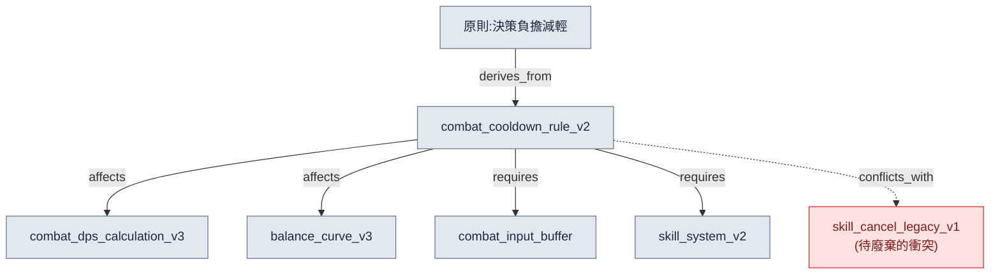
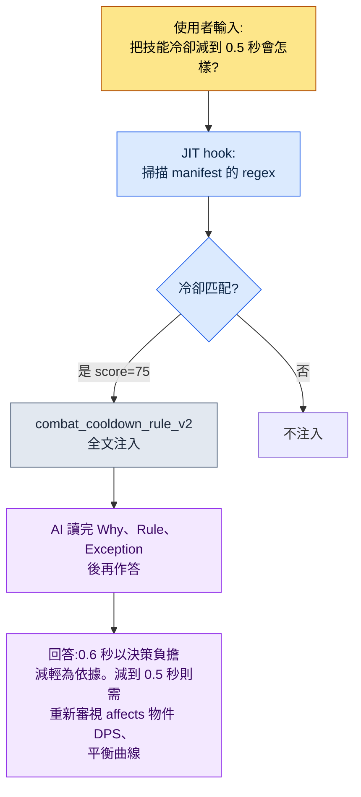

# 2.2 按頁 Atom —— 單文件單決策的解剖

新人入職的第一週,他在聊天裡問我:"戰鬥冷卻時間是 0.6 秒,對嗎?寫在哪份文件裡?"我答:"在技能系統 GDD(Game Design Document,詳細規格文件)裡。"他又問:"那 GDD 的哪一節?從職業設計到傷害曲線,再到 UI 顯示方式,一共 220 行。"我開啟檔案,親自幫他找。在第 137 行。他最後問:"可為什麼是 0.6 秒?0.5 不行嗎?"這個答案任何文件裡都沒有。我記得是六個月前的一次會議上定的,但理由埋在某份會議記錄的某個角落裡。

這場五分鐘的對話裡,包含了 220 行整合文件的全部三種失敗:找不到位置(檢索失敗)、沒有理由(脈絡丟失)、每次都得有人居中轉述(無法自動化)。把同樣的問題拋給 AI,情況更糟。AI 會把 220 行全部讀完,然後連和冷卻無關的傷害曲線也一併摻進答案裡。

本章的處方很簡單。**一份文件只裝一個決策。**按這個原則切得很細的決策單元文件,就叫 atom。把 220 行的 GDD 拆開,"冷卻時間是 0.6 秒"就成了一個 atom,而這個 atom 裡,位置、內容、理由、例外、關係都匯聚在一處。本章不講抽象理論,而是把一個真實的 atom 從頭解剖到尾:它如何命名、寫入哪些 frontmatter、如何標明關係,以及最終 AI 如何只精準地拎出這一個 atom。

---

## 2.2.1 取一份檢材 —— `combat_cooldown_rule_v2`

要解剖的檢材,是專案A中實際執行的一個 atom。它的名字是 `combat_cooldown_rule_v2`。檔案全文如下。不長,因為只裝了一個決策。

```markdown
---
name: combat_cooldown_rule_v2
title: "戰鬥冷卻規則 —— v2"
type: rule
layer: 1
status: approved
owner: 李旼洙
created: 2026-03-10
updated: 2026-05-12
applies_to: [skill_system, item_system]
---

# 戰鬥冷卻規則 v2

Why(為什麼):限制可同時使用的技能數量,以減輕瞬時決策負擔,
並保留連招輸入的意義。

Rule(規則):所有主動技能都具有全域性冷卻 0.6 秒 + 單獨
冷卻(各技能自定義)。全域性冷卻進行期間,任何
主動技能都無法施法。

How to apply(適用):
- 定義新技能時必須明確標註單獨冷卻
- L3_SkillSheet 的 cooldown 列若為 0,則違反本規則
- 構建階段的一致性檢查會自動檢出違規

Exceptions(例外):
- 被動技能不適用本規則
- 終極技能採用單獨的能量條系統(See: [[ultimate_gauge_system]])

Relations(關係):
- affects: [[combat_dps_calculation_v3]], [[balance_curve_v3]]
- derives_from: [[principle_decision_load_reduction]]
- conflicts_with: [[skill_cancel_rule_legacy_v1]]
- requires: [[combat_input_buffer_system]], [[skill_system_v2]]
- is_a: rule
- part_of: combat_system_master
```

把這一頁檔案分成五個部位來看:命名、frontmatter、單一決策、關係、可追溯性。五個部位都齊備,AI 才會把這個 atom 讀作"獨自也說得通的單元"。

---

## 2.2.2 部位 ① 命名 —— 名字本身就是座標

檔名是 `combat_cooldown_rule_v2`。這不是隨手起的名字,而是有三段式結構。

```
combat_         cooldown_rule          _v2
└ prefix        └ 決策正文            └ 版本
  (哪個領域)     (關於什麼的決策)       (第幾次修訂)
```

prefix `combat_` 是"這是戰鬥領域的決策"這一座標。專案A的規則 atom 以 prefix 區分領域:`quest_`(任務)、`data_`(資料運營)、`docs_`(文件運營)、`meeting_`(會議記錄)、`portal_`(策劃檢視器)。光看 prefix,就能抓住這個決策屬於誰的責任範圍、會從哪裡受到影響。

命名一旦動搖,一切都跟著動搖。同一個決策若以 `skill-cooldown.md` 和 `cooldown_skill_v2.md` 兩次出現,檢索會崩,後文要講的 JIT 匹配也會崩。所以專案A先把命名規則本身固化成了一個 atom。那就是 `atom_naming_convention_v1`,它強制要求 snake_case、必帶 prefix、版本 suffix。而且這條規則不靠人的自覺,而是由 Linter 來守。沒有 prefix 的檔名一旦被提交,就會在構建階段被攔下。

命名背後,埋著貫穿全書的更大設計。frontmatter 裡的 `layer: 1` 就是第二個座標。如果說 prefix 指明"哪個領域",那麼 Layer 指明"哪個抽象層級"。兩個座標結合,atom 的位置才被確定為平面上的一個點。這裡 Layer 只是座標(0\~4 層級定義的細節見 2.3)。冷卻規則是"控制生成的輸入規則",所以坐落於 Layer 1。把這個 Layer 座標以數字 prefix 強制寫在文件名前的規則也另有一條 —— `docs_layer_numeric_prefix_naming`。一個名字裡,等於明示了兩條座標軸。

這套設計的本質不是整理癖。我對團隊反覆說過一句話。**"當初分 Layer,就是為了做程式化生成。"**只要每個 atom 都明示了領域座標(prefix)與層級座標(Layer),日後 AI 就能做到"把 Layer 1 的全部 combat 規則作為輸入,自動生成 Layer 2 的內容"。名字,就是那套自動化的定址體系。

---

## 2.2.3 部位 ② frontmatter —— 機器讀取的標籤

正文上方 `---` 之間的 YAML 塊,就是 frontmatter。它是把 2.1 講過的標準原樣應用到 atom 上,是給機器(構建指令碼、JIT hook、關係圖生成器)而非給人讀的標籤。

| 欄位 | 值 | 機器用它來做的事 |
|---|---|---|
| `name` | combat_cooldown_rule_v2 | 成為其他 atom link 目標的唯一 ID |
| `type` | rule | 按類別統計、篩選(rule / concept / decision ……) |
| `layer` | 1 | 按 Layer 著色、排序,反向引用檢出的基準軸 |
| `status` | approved | draft、approved、archived 中只有 approved 進入構建 |
| `applies_to` | [skill_system, item_system] | 影響範圍 —— 這條規則觸及的系統 |
| `created`/`updated` | 2026-03-10 / 2026-05-12 | 變更追蹤,陳舊 atom 排查的基準日 |

這些標籤寫好了,自動檢查就成為可能。例如,被宣告為 `layer: 1` 的系統規則,若在正文裡直接引用 `[[L3_SkillSheet_row_0042]]` 這樣的資料 atom(Layer 3),那就是上層被綁死在下層具體值上的**反向引用(L3→L1)**。專案A在構建階段自動檢出這種模式。因為規則應該引用資料的格式,而不是資料的某一行。frontmatter 裡沒有 `layer` 這一行,這項檢查本身就無從成立。

`status: archived` 的處理也是 frontmatter 的活兒。決策變了,atom 不被刪除,而是獲得 `status: archived` + `archived_at` 日期。構建與 JIT 會排除 archived 的 atom。記錄留下,但退出現役。在專案A六個月的運營中,廢棄率約為 15%(作者實測)。如果這個比例接近 0%,就讀作廢棄工作流沒有運轉的訊號。

---

## 2.2.4 部位 ③ 單一決策 —— 能否用一句話概括

atom 解剖的核心,是確認正文是否只裝了一個決策。檢查法很簡單。**試著把這個 atom 的決策用一句話概括。**

> "所有主動技能都具有全域性冷卻 0.6 秒。"

一句話就結束了。合格。如果概括變成"冷卻是 0.6 秒,連招中縮短 50%"這樣的兩句,那就是兩個決策。要拆成 `combat_cooldown_rule_v2`(基礎冷卻)和 `combat_combo_cooldown_reduction_v1`(連招縮短)。

判斷單一性還有兩個輔助檢查。

**獨立廢棄檢查。**只廢棄這一個 atom,系統會不會垮?廢棄冷卻規則,戰鬥平衡會動搖,但系統照轉。單元是對的。反過來,如果廢棄它會連帶另外五個一起垮,那這五個其實是一個決策的五塊碎片。該合併成更大的 atom。

**單一引用檢查。**別處只掛 `[[combat_cooldown_rule_v2]]` 這一個 link,意思是否通?通,單元就對。如果為了引用這一行,得把正文好幾處都讀一遍,那就是還沒拆夠。

通過這些檢查的正文,自然會對齊成五個小節 —— Why、Rule、How、Exceptions、Relations。尤其是**別刪掉 Why。**前面引子裡,新人最後問的"為什麼是 0.6 秒?",答案就在這兒 —— "為減輕瞬時決策負擔、保留連招輸入的意義。"六個月後,有誰提議"減到 0.5 秒"時,這一行就成了討論的起點。失去 Why 的 atom,會變成誰也不敢動的化石。

---

## 2.2.5 部位 ④ 關係 —— 箭頭製造出影響分析

atom 最下方的 Relations 小節,把這份檢材從一張孤立的便籤,變成圖中的一個節點。關鍵不在於只寫"相關文件",而在於**明示關係的種類**。



六種關係各自做著不同的事。

- `derives_from`:這個決策派生自哪條上層原則。冷卻 0.6 秒,是"決策負擔減輕"這條原則的具體化。
- `affects`:這個 atom 一旦改動,什麼會受影響。把 0.6 秒改成 0.5 秒,DPS 計算和平衡曲線就會動搖。**改動前就能自動拉出影響範圍。**
- `requires`:這個決策要成立,什麼必須先存在。沒有輸入緩衝系統,全域性冷卻就會把輸入吃掉。
- `conflicts_with`:與什麼矛盾。它與舊版技能取消規則衝突,這條 link 就是"兩者必須廢其一"的訊號。
- `is_a` / `part_of`:分類(rule)與歸屬(combat_system_master)。圖的骨架。

若只是簡單的 "Related: [文件A]、[文件B]" 連結,就得人去逐一推敲。關係型別一旦以 enum 寫入,機器就能推敲。"把改動這個 atom 會受影響的全部列出來",就成了沿 `affects` 追溯的自動查詢;"找出現在互相矛盾的所有規則",就成了掃描 `conflicts_with` 的自動檢查。這六個 enum 正式的本體論(ontology)設計放在 2.4 講,2.2 只點明:atom 標準是預先套用了那套 enum 的形態。

關係箭頭同時也是關係圖生成工具的輸入。專案A的 `gen_relation_map.py` 會讀取所有 atom 的 frontmatter `layer` 與 Relations 小節,自動繪出按 Layer 著色的互動式關係圖 HTML。正因為每一個 atom 都帶著座標(Layer)與箭頭(Relations),這才成為可能。

---

## 2.2.6 部位 ⑤ 可追溯性 —— 一個 atom 擋下的 30 分鐘

五個部位都齊備的 atom,是可追溯的。誰、何時、為何作出這個決策,把什麼判為違規,全都在一處。可追溯性的價值,在用真實擋下的事件來呈現時,才最為鮮明,而不是靠統計。

專案A的 `meeting_image_caption_standard` atom,是一條規則:會議記錄裡附的圖片,必須以圖註明確標註"是哪個畫面、為什麼附上、是什麼決策"。沒有這個 atom 的年代,一張截圖沒帶圖注就貼進了某份會議記錄,一週後看到它的同事為了向作者確認"這是什麼畫面?",花了 30 分鐘。有了這個 atom 之後,同樣的遺漏再次發生時,構建階段的 Linter 自動逮住了沒圖注的圖片。改到完成只用 5 分鐘。30 分鐘變成了 5 分鐘。

另一份檢材 `skill_listing_budget_wrapper_only_policy`,是這樣一條規則:把全域性斜槓命令槽位限制為 12 個,本體技能另置於單獨目錄,但在全域性只暴露 12 個 wrapper。固化之前,全域性斜槓命令一度膨脹到將近 40 個,每次會話開始都在啃食 token 預算。定義了這個 atom 之後,自動整理工具會在每次會話開始時清理超額部分。規則靠工具來執行,而不是靠人的記憶。

這樣的 atom,在專案A裡累積了約 304 個(作者實測,六個月運營時點)。只看分佈的大類:防止復發的規則(rule)佔比最大,其次是一次性決策的固化(decision)、領域概念(concept)、協作校正(feedback)。一個 atom 擋下的時間以分鐘計,但 304 個累積起來,節省的總量就跨進了以天計。這就是把 atom 稱作"資產"而非"整理"的理由。

---

## 2.2.7 把解剖變成自動注入 —— JIT 的實際運作

至此,我們對一個 atom 作了靜態解剖。現在來看它活動起來的瞬間。1.3 的 JIT(Just-In-Time)hook,只挑出與輸入關鍵詞匹配的 atom,當場注入上下文。JIT manifest 是一份把匹配關鍵詞與分數對映到各 atom 的 JSON。

```json
{
  "name": "combat_cooldown_rule_v2",
  "path": "atoms/combat/combat_cooldown_rule_v2.md",
  "regex": "쿨다운|cooldown|글로벌 쿨다운|GCD",
  "score": 75
}
```

實際注入是這樣流轉的。



關鍵在最後一格。AI 不會只答"曾經是 0.6 秒"。它讀了 atom 的 Why,就給得出依據;讀了 Relations 的 `affects`,就連改動時會動搖的物件(DPS 計算、平衡曲線)也提前點到。切細、寫明理由、標註關係的五個部位,全都在回答裡活了起來。

到這裡,單一決策原則是自動化前提這一點就顯露了。假如這個 atom 是 220 行的整合 GDD,"冷卻"一詞被匹配的那一刻,職業設計、傷害曲線、UI 就會被整塊注入,token 預算被削減,AI 也會在五個決策中迷失該答哪一個的焦點。**atom 越小越清晰,JIT 準確度越高。切得細,不是整理的美德,而是自動注入的前提條件。**

score 是守住上下文預算的裝置。一次輸入匹配到多個 atom 時,只注入 score 排名前 N 個(預設 3 個)。打分標準在運營中定。

- 安全、保密、健康相關的 atom = 95\~99(絕對禁止遺漏)
- 核心資訊、理念類 atom = 90\~94
- 領域核心規則 = 75\~89(冷卻規則在此,75)
- 參考、歷史類 atom = 30\~50

---

## 2.2.8 個人 atom 與團隊共享 atom —— 兩層的分離

解剖過的檢材 `combat_cooldown_rule_v2`,是拿到 `status: approved` 的團隊共享 atom。並非所有 atom 一開始就坐到這個位置。專案A把 atom 分為兩層。

- **個人 atom** —— 未定假設、個人備忘、時點固化。只有本人看。標準較松。
- **團隊共享 atom** —— 經過驗證的規則。全體團隊成員都看。須通過命名、結構、審批流程。

分層的理由是心理上的。個人 atom 自由,才能毫無負擔地寫下驗證前的假設,並在一週後廢棄。如果一開始就對團隊公開,就會因"這要是錯了怎麼辦"而乾脆不寫。反過來,團隊共享 atom 嚴格,全員才會信任並引用。

`combat_cooldown_rule_v2` 起初恐怕也只是個人 atom 裡"冷卻 0.6 秒,試試看吧"的一行備忘。在 Alpha 版本中驗證過後,以變更請求的形式晉升為團隊共享,再經另一位策劃評審,成了 `approved`。這套個人→團隊的晉升流程本身,就是 atom 系統隨時間變聰明的 self-improving 迴圈的一條主軸。

---

## 2.2.9 五種常見錯誤

atom 運營初期反覆出現的錯誤,可歸納為五種。它們都出自同一個根:"把 atom 當作一次性備忘,而非資產。"

| 錯誤 | 什麼被破壞 | 規避法 |
|---|---|---|
| 頭一週造太多 | 未驗證的 atom 堆積,運營垮掉 | 從驗證過的一兩個起步,交給自然增長 |
| 不做廢棄 | 陳舊 atom 持續被 JIT 匹配,生成錯誤答案 | 季度排查,`status: archived` + `archived_at` |
| 太抽象/太具體 | "做出好設計"無法驗證,一行雜感毫無意義 | 做到"攻擊距離只有 0.5/1.5/3.0/5.0"的程度 |
| 命名不一致 | 檢索、JIT 匹配整塊崩壞 | 先做命名規則 atom,再用 Linter 強制 |
| 不寫 Why | 時間一久,變成誰也不敢碰的化石 | 強制 Why、Rule、How、Exception、Relations 五個小節 |

不必從第一個月就完美避開這五種。第 1 和第 4 種,用一個命名規則 atom 就一起解決了;第 2、3、5 種,在運營第三個月時跑一次季度排查,自然就會對齊。

---

## 2.2.10 通往下一章

本章把一個 atom 分成五個部位看了一遍:名字(座標)、frontmatter(機器標籤)、單一決策(一句話檢查)、關係(影響分析)、可追溯性(擋下的 30 分鐘)。並確認了這五個部位在 JIT 自動注入中如何整塊活起來。

名字裡明示的兩條座標,其中之一 `layer: 1`,2.2 只是一帶而過。2.3 會正面處理那個 Layer。只要給每個 atom 賦予 Layer 座標,即便分屬不同領域,也開始看得見彼此的產出物坐落在哪裡。而 2.4 會把本章只借用了 enum 名字的六種關係(affects、derives_from、conflicts_with、requires、is_a、part_of)正式形式化為本體論。在 YAML(2.1)→ Atom(2.2)→ Layer(2.3)→ Ontology(2.4)一路延伸的資訊架構骨架中,本章是其第二個關節。

---

### 本章要點
- 一個 atom 是名字、frontmatter、單一決策、關係、可追溯性五個部位之和
- 單一決策原則不是整理癖,而是 JIT 自動注入的前提條件
- 名字裡明示的領域、Layer 兩條座標,成為程式化生成的定址體系

---

## 動手試試 —— 造一個 atom 並用 JIT 注入

**setup.** 在工作資料夾裡建一個 `atoms/` 目錄,最先寫命名規則 atom(`atom_naming_convention_v1`)。哪怕只寫 snake_case、必帶 prefix、版本 suffix 三行也行。如果用 JIT,就放一個 `_jit_manifest.json` 空陣列。

**prompt.** 挑一個你每次都忘的決策,用下面的提示詞拿到 atom 初稿。

> "把下面這個決策做成 atom 標準格式。決策:'主動技能具有全域性冷卻 0.6 秒。'小節為 Why、Rule、How to apply、Exceptions、Relations 五個。frontmatter 裡放 name(snake_case+prefix)、type、layer、status: draft、owner、created。最後再確認決策能否用一句話概括。"

**verify.** 用三點檢查拿到的 atom。① 決策能否用一句話概括(不能就拆開)。② Why 是否非空。③ 在 manifest 里加上 `{"name", "path", "regex", "score"}` 一行,把那個 regex 關鍵詞作為真實輸入丟擲去,atom 是否被注入。三點都通過,第一個 atom 就完成了。

---

## 單人精簡版

如果你是沒有團隊、沒有 Linter、沒有構建流水線的單人開發者,可以把本章整章壓縮成一個筆記應用的資料夾。

- **命名**:檔名統一為 `domain_decision_v1` 這一條規則。Linter 由你自己的眼睛來代替。
- **單一決策**:一張筆記一個決策。標題寫不成一句話,就拆成兩張。
- **Why 必填**:在筆記最上方寫一行"為什麼這樣定"。這一行,會救六個月後的你。
- **關係**:不用正式 enum,只用 `→ 影響:`、`↑ 依據:`、`✕ 衝突:` 三個標記,影響追溯的九成就保住了。
- **JIT 替代**:不用 manifest,開工前手動開啟相關的 1\~2 條、2\~3 條筆記,貼給 AI。這就是手動 JIT。

核心不是工具,而是五個部位的習慣。最初的 10 條筆記最難,熬過那個坎,接下來的 100 條,手會自己造出來。
