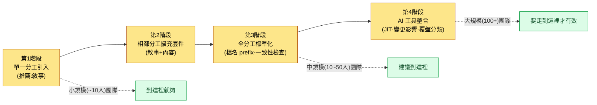

# 2.3 Layer 設計 —— 遊戲系統抽象化

那是分工從三個增長到八個的時段。戰鬥策劃把技能攻擊距離定為 8m。同一周,關卡設計師把副本通道寬度鎖定為 6m。兩者在各自分工內都是完全合理的決定。問題在三週後的版本里暴露出來。範圍技能穿過通道牆壁打出去,敵人在玩家根本看不見的地方被打死。這不是任何人的失誤。只是兩個人沒有一扇窗戶能看見彼此的決定而已。

本章講的就是造出這扇窗戶的故事。讓每個分工保留自己的房間,同時只憑一個座標就能知道隔壁房間裡在發生什麼。這個座標系,就叫作 Layer。

---

## 2.3.1 孤島化 —— 每次都會再次遭遇的敵人

遊戲策劃的分工被切得很細。系統、戰鬥、敘事、內容、關卡、數值、UX、QA。每個分工都有自己的工具、產出物、會議。規模越大,各自越是深入自己的領域,陷入不知道別的分工在做什麼的狀態。這就叫作孤島(silo)化。

孤島化的代價要等時間過去才會顯現。

- 戰鬥策劃定下的技能攻擊距離,與關卡設計的通道寬度對不上。
- 敘事設計的 NPC 動機,與內容策劃的任務獎勵結構相沖突。
- 數值策劃擬定的經濟迴圈,與運營(LiveOps)的登入獎勵排期相錯位。

原因不是能力不足。各自在自己的分工裡做了合理的決定,只是沒有一條通道能讓人察覺別的分工的決定而已。用會議來填補,會議就會暴增;用群聊來填補,訊號就會被噪聲淹沒。這並不是說會議和群聊毫無價值,關鍵在於把"能填補的部分"和"不能填補的部分"之間的邊界劃清楚。

解決辦法是:既不收窄各自的領域(保持分工分化),又能讓彼此看見對方的流程(統一可見性)。這兩個看似衝突的訴求,只要對齊到同一個座標系上,就能同時達成。那個座標系就是 Layer。拿辦公室來打比方,就相當於每個人都有自己的桌子,同時看著同一面掛鐘和日曆。

---

## 2.3.2 Layer 的定義 —— 5 層抽象

本書使用的 Layer 是 0\~4 的 5 層抽象。越往上越抽象、越少變更;越往下越具體、變更越頻繁。

<svg viewBox="0 0 760 300" xmlns="http://www.w3.org/2000/svg" font-family="sans-serif" role="img" aria-label="Layer 0到4的5層抽象結構以及各層的程式化生成角色">
  <defs>
    <marker id="arrowDown" markerWidth="8" markerHeight="8" refX="4" refY="7" orient="auto">
      <path d="M0,0 L8,0 L4,8 z" fill="#555"/>
    </marker>
  </defs>
  <text x="20" y="24" font-size="13" fill="#888">抽象 · 不變</text>
  <text x="640" y="24" font-size="13" fill="#888">具體 · 變動</text>

  <rect x="20" y="36" width="720" height="42" rx="6" fill="#c0392b" opacity="0.9"/>
  <text x="34" y="55" font-size="14" fill="#fff" font-weight="bold">L0 願景·核心價值</text>
  <text x="34" y="72" font-size="12" fill="#fff">程式化生成角色:上下文錨點 —— 不變,每次呼叫都注入的基準點</text>

  <rect x="20" y="86" width="720" height="42" rx="6" fill="#e67e22" opacity="0.9"/>
  <text x="34" y="105" font-size="14" fill="#fff" font-weight="bold">L1 系統·世界骨架</text>
  <text x="34" y="122" font-size="12" fill="#fff">程式化生成角色:生成輸入規則 —— 規則手冊·關係·標籤(生成器遵循的約束)</text>

  <rect x="20" y="136" width="720" height="42" rx="6" fill="#f1c40f" opacity="0.95"/>
  <text x="34" y="155" font-size="14" fill="#333" font-weight="bold">L2 內容·流程</text>
  <text x="34" y="172" font-size="12" fill="#333">程式化生成角色:生成正文堆積的地方 —— 任務·進度·關卡曲線</text>

  <rect x="20" y="186" width="720" height="42" rx="6" fill="#27ae60" opacity="0.9"/>
  <text x="34" y="205" font-size="14" fill="#fff" font-weight="bold">L3 實現·配置表</text>
  <text x="34" y="222" font-size="12" fill="#fff">程式化生成角色:數值·ID·關係 —— 模擬的輸入值</text>

  <rect x="20" y="236" width="720" height="42" rx="6" fill="#2980b9" opacity="0.9"/>
  <text x="34" y="255" font-size="14" fill="#fff" font-weight="bold">L4 版本·QA 產出物</text>
  <text x="34" y="272" font-size="12" fill="#fff">程式化生成角色:驗證關卡 —— 版本結果·缺陷·試玩捕獲</text>

  <line x1="10" y1="40" x2="10" y2="274" stroke="#555" stroke-width="1.5" marker-end="url(#arrowDown)"/>
</svg>

五個層各自在程式化生成·自動化管線中所承擔的角色,寫在上圖右側的標籤裡。這個對映是本章的脊柱。如果只把 Layer 看成"整理得很好的資料夾",那隻看到了一半。每個層都精確對應生成管線的某一個階段(錨點 → 規則 → 正文 → 數值 → 關卡)。

| Layer | 裝什麼 | 變更頻率 |
|-------|---------------|-----------|
| Layer 0 | 遊戲想給玩家的核心體驗。可壓縮為一句話 | 極低(貫穿專案整個生命週期) |
| Layer 1 | 遊戲系統的大結構與世界觀骨架 | 低(以里程碑為單位) |
| Layer 2 | 遊玩流程、任務線、進度階段、關卡曲線 | 中(以衝刺為單位) |
| Layer 3 | 實際資料值、引數、公式、變數 | 高(以日為單位) |
| Layer 4 | 在版本中確認到的結果、缺陷報告、試玩影片 | 極高(即時) |

這 5 層並非遊戲專用概念。可以把同一條脊柱原樣搬到一般 IT 產品開發上。沒有做過遊戲的讀者,請用下面的職務翻譯表把每一層對應到自己的產出物上(左邊是遊戲策劃的 Layer,右邊是 SaaS·App·內部系統等中放在相同位置上的產出物)。

| Layer | 遊戲策劃 | 一般 IT 產品 | 相同的問題 |
|-------|-----------|--------------|-----------|
| L0 核心體驗 | 想給玩家的核心體驗(一句話) | 產品願景 —— 為誰、解決什麼問題、怎麼解決 | "為什麼要做這個" |
| L1 系統規則 | 系統結構·世界觀骨架 | 業務·功能規則 —— 領域規則、許可權模型、核心工作流 | "什麼應該如何運作" |
| L2 內容 | 任務線·進度階段·關卡曲線 | 釋出·路線圖 —— 功能打包、上線順序、里程碑 | "在什麼時候放出什麼" |
| L3 資料 | 資料值·引數·公式 | 規格表 —— API 規格、欄位定義、配置值、閾值 | "準確的值和定義是什麼" |
| L4 版本·QA | 版本結果·缺陷·試玩影片 | 部署·QA —— 部署產出物、缺陷報告、監控日誌 | "實際放出去的東西跑得對不對" |

讀法和遊戲完全一樣。越往上變更越少(產品願景每季度變一次),越往下越頻繁(配置值每天都變)。前面看到的孤島事故 —— 攻擊距離和通道寬度衝突的那一幕 —— 與一般 IT 中"後端欄位定義(L3)和前端畫面規則(L1)對不上,在上線前夕爆掉"的事,是完全相同的結構。只是分工的名字不同,脊柱是同一條。

這 5 層並非絕對。根據規模和領域,4 層可能就夠,也可能需要 6 層。關鍵不在於數字是不是 5,而在於"明確定義層級"這一行為本身。

一個產出物也可能橫跨兩個 Layer。"技能系統 GDD(Game Design Document,詳細規格書)"同時裝著系統設計(Layer 1)和具體資料(Layer 3)。這時要麼把文件拆開,要麼把主 Layer 定為 1、把資料部分分離成單獨的表格,但無論哪種方式,都要明確標出每個部分住在哪個 Layer。

---

## 2.3.3 元原則 —— 同時實現分化與整合

分工橫向鋪開,Layer 縱向堆疊。一個分工的工作橫跨多個 Layer。下面的矩陣用單元格的顏色深淺,表現 11 個分工(橫軸)× Layer 0\~4(縱軸)的分佈重心。深色格就是那個分工的重心 Layer。

<svg viewBox="0 0 820 320" xmlns="http://www.w3.org/2000/svg" font-family="sans-serif" font-size="11" role="img" aria-label="11個分工橫軸與Layer 0到4縱軸的分化整合矩陣">
  <!-- column headers (분야) -->
  <g fill="#333">
    <text x="120" y="30" transform="rotate(-35 120 30)">系統</text>
    <text x="180" y="30" transform="rotate(-35 180 30)">戰鬥</text>
    <text x="240" y="30" transform="rotate(-35 240 30)">敘事</text>
    <text x="300" y="30" transform="rotate(-35 300 30)">內容</text>
    <text x="360" y="30" transform="rotate(-35 360 30)">關卡</text>
    <text x="420" y="30" transform="rotate(-35 420 30)">數值</text>
    <text x="480" y="30" transform="rotate(-35 480 30)">UX/UI</text>
    <text x="540" y="30" transform="rotate(-35 540 30)">QA</text>
    <text x="600" y="30" transform="rotate(-35 600 30)">角色</text>
    <text x="660" y="30" transform="rotate(-35 660 30)">美術</text>
    <text x="720" y="30" transform="rotate(-35 720 30)">運營</text>
  </g>
  <!-- row labels (Layer) -->
  <g fill="#333" text-anchor="end">
    <text x="95" y="74">L0 願景</text>
    <text x="95" y="124">L1 系統</text>
    <text x="95" y="174">L2 內容</text>
    <text x="95" y="224">L3 資料</text>
    <text x="95" y="274">L4 版本·QA</text>
  </g>
  <!-- grid cells: x columns at 110,170,...,710 ; y rows at 60,110,160,210,260 ; cell 50x40 -->
  <!-- color helper: dark=#2c3e50 mid=#7f8c9b light=#dfe4ea -->
  <!-- L0 row (y=60) -->
  <g>
    <rect x="110" y="60" width="50" height="40" fill="#dfe4ea" stroke="#fff"/>
    <rect x="170" y="60" width="50" height="40" fill="#dfe4ea" stroke="#fff"/>
    <rect x="230" y="60" width="50" height="40" fill="#2c3e50" stroke="#fff"/>
    <rect x="290" y="60" width="50" height="40" fill="#dfe4ea" stroke="#fff"/>
    <rect x="350" y="60" width="50" height="40" fill="#dfe4ea" stroke="#fff"/>
    <rect x="410" y="60" width="50" height="40" fill="#dfe4ea" stroke="#fff"/>
    <rect x="470" y="60" width="50" height="40" fill="#dfe4ea" stroke="#fff"/>
    <rect x="530" y="60" width="50" height="40" fill="#7f8c9b" stroke="#fff"/>
    <rect x="590" y="60" width="50" height="40" fill="#dfe4ea" stroke="#fff"/>
    <rect x="650" y="60" width="50" height="40" fill="#2c3e50" stroke="#fff"/>
    <rect x="710" y="60" width="50" height="40" fill="#dfe4ea" stroke="#fff"/>
  </g>
  <!-- L1 row (y=110) -->
  <g>
    <rect x="110" y="110" width="50" height="40" fill="#2c3e50" stroke="#fff"/>
    <rect x="170" y="110" width="50" height="40" fill="#2c3e50" stroke="#fff"/>
    <rect x="230" y="110" width="50" height="40" fill="#7f8c9b" stroke="#fff"/>
    <rect x="290" y="110" width="50" height="40" fill="#dfe4ea" stroke="#fff"/>
    <rect x="350" y="110" width="50" height="40" fill="#7f8c9b" stroke="#fff"/>
    <rect x="410" y="110" width="50" height="40" fill="#dfe4ea" stroke="#fff"/>
    <rect x="470" y="110" width="50" height="40" fill="#2c3e50" stroke="#fff"/>
    <rect x="530" y="110" width="50" height="40" fill="#7f8c9b" stroke="#fff"/>
    <rect x="590" y="110" width="50" height="40" fill="#2c3e50" stroke="#fff"/>
    <rect x="650" y="110" width="50" height="40" fill="#7f8c9b" stroke="#fff"/>
    <rect x="710" y="110" width="50" height="40" fill="#dfe4ea" stroke="#fff"/>
  </g>
  <!-- L2 row (y=160) -->
  <g>
    <rect x="110" y="160" width="50" height="40" fill="#7f8c9b" stroke="#fff"/>
    <rect x="170" y="160" width="50" height="40" fill="#7f8c9b" stroke="#fff"/>
    <rect x="230" y="160" width="50" height="40" fill="#2c3e50" stroke="#fff"/>
    <rect x="290" y="160" width="50" height="40" fill="#2c3e50" stroke="#fff"/>
    <rect x="350" y="160" width="50" height="40" fill="#2c3e50" stroke="#fff"/>
    <rect x="410" y="160" width="50" height="40" fill="#dfe4ea" stroke="#fff"/>
    <rect x="470" y="160" width="50" height="40" fill="#7f8c9b" stroke="#fff"/>
    <rect x="530" y="160" width="50" height="40" fill="#dfe4ea" stroke="#fff"/>
    <rect x="590" y="160" width="50" height="40" fill="#7f8c9b" stroke="#fff"/>
    <rect x="650" y="160" width="50" height="40" fill="#dfe4ea" stroke="#fff"/>
    <rect x="710" y="160" width="50" height="40" fill="#2c3e50" stroke="#fff"/>
  </g>
  <!-- L3 row (y=210) -->
  <g>
    <rect x="110" y="210" width="50" height="40" fill="#2c3e50" stroke="#fff"/>
    <rect x="170" y="210" width="50" height="40" fill="#2c3e50" stroke="#fff"/>
    <rect x="230" y="210" width="50" height="40" fill="#7f8c9b" stroke="#fff"/>
    <rect x="290" y="210" width="50" height="40" fill="#7f8c9b" stroke="#fff"/>
    <rect x="350" y="210" width="50" height="40" fill="#2c3e50" stroke="#fff"/>
    <rect x="410" y="210" width="50" height="40" fill="#2c3e50" stroke="#fff"/>
    <rect x="470" y="210" width="50" height="40" fill="#7f8c9b" stroke="#fff"/>
    <rect x="530" y="210" width="50" height="40" fill="#7f8c9b" stroke="#fff"/>
    <rect x="590" y="210" width="50" height="40" fill="#2c3e50" stroke="#fff"/>
    <rect x="650" y="210" width="50" height="40" fill="#dfe4ea" stroke="#fff"/>
    <rect x="710" y="210" width="50" height="40" fill="#7f8c9b" stroke="#fff"/>
  </g>
  <!-- L4 row (y=260) -->
  <g>
    <rect x="110" y="260" width="50" height="40" fill="#dfe4ea" stroke="#fff"/>
    <rect x="170" y="260" width="50" height="40" fill="#7f8c9b" stroke="#fff"/>
    <rect x="230" y="260" width="50" height="40" fill="#7f8c9b" stroke="#fff"/>
    <rect x="290" y="260" width="50" height="40" fill="#dfe4ea" stroke="#fff"/>
    <rect x="350" y="260" width="50" height="40" fill="#dfe4ea" stroke="#fff"/>
    <rect x="410" y="260" width="50" height="40" fill="#7f8c9b" stroke="#fff"/>
    <rect x="470" y="260" width="50" height="40" fill="#dfe4ea" stroke="#fff"/>
    <rect x="530" y="260" width="50" height="40" fill="#2c3e50" stroke="#fff"/>
    <rect x="590" y="260" width="50" height="40" fill="#dfe4ea" stroke="#fff"/>
    <rect x="650" y="260" width="50" height="40" fill="#7f8c9b" stroke="#fff"/>
    <rect x="710" y="260" width="50" height="40" fill="#2c3e50" stroke="#fff"/>
  </g>
  <!-- legend -->
  <g>
    <rect x="110" y="305" width="14" height="12" fill="#2c3e50"/>
    <text x="128" y="315" fill="#333">重心</text>
    <rect x="220" y="305" width="14" height="12" fill="#7f8c9b"/>
    <text x="238" y="315" fill="#333">次要分佈</text>
    <rect x="320" y="305" width="14" height="12" fill="#dfe4ea"/>
    <text x="338" y="315" fill="#333">微弱·無</text>
  </g>
</svg>

縱向讀,能看出一個分工橫跨哪些 Layer;橫向讀,能看出一個 Layer 聚集了哪些分工。L0(願景)這一行,敘事和美術指導最深 —— 這是離願景最近的兩個分工。L3(資料)這一行,系統·戰鬥·關卡·數值·角色聚得很深 —— 這是它們在配置表裡彼此碰撞的訊號。

只要明確地擁有這份分佈,別的分工就能立刻知道"得去看戰鬥的 Layer 2"的位置。這不是孤島的牆被推倒,而是在牆上鑿出了一扇窗。

把整個矩陣壓成一句話就是這樣:縱軸 Layer 是為了把生成自動化而分,橫軸分工是為了發揮專業性而分。兩者在網格的某一格里相遇。

---

## 2.3.4 運營案例 —— 某 MMORPG 專案的實測

筆者作為設計總監運營的 MMORPG 專案A,與策劃團隊(4\~5 人)一起把 Layer 系統運營了約 6 個月(整個開發團隊屬於中等規模,10\~50 人)。看看具體案例。

先看敘事 5 層。敘事策劃資料夾本身就按 Layer 做了分割。

<svg viewBox="0 0 640 230" xmlns="http://www.w3.org/2000/svg" font-family="sans-serif" font-size="13" role="img" aria-label="敘事資料夾的Layer 0到4分割結構">
  <text x="20" y="26" font-weight="bold" fill="#333">NarrativeDocs/</text>
  <g>
    <rect x="40" y="40" width="240" height="30" rx="4" fill="#c0392b" opacity="0.9"/>
    <text x="52" y="60" fill="#fff">Layer0_Vision/</text>
    <text x="300" y="60" fill="#555">世界的核心資訊,1.1~1.2</text>
  </g>
  <g>
    <rect x="40" y="76" width="240" height="30" rx="4" fill="#e67e22" opacity="0.9"/>
    <text x="52" y="96" fill="#fff">Layer1_World/</text>
    <text x="300" y="96" fill="#555">地區·勢力·時代設定</text>
  </g>
  <g>
    <rect x="40" y="112" width="240" height="30" rx="4" fill="#f1c40f" opacity="0.95"/>
    <text x="52" y="132" fill="#333">Layer2_StoryLine/</text>
    <text x="300" y="132" fill="#555">主線任務流程</text>
  </g>
  <g>
    <rect x="40" y="148" width="240" height="30" rx="4" fill="#27ae60" opacity="0.9"/>
    <text x="52" y="168" fill="#fff">Layer3_DialogueSheet/</text>
    <text x="300" y="168" fill="#555">實際臺詞·名稱資料</text>
  </g>
  <g>
    <rect x="40" y="184" width="240" height="30" rx="4" fill="#2980b9" opacity="0.9"/>
    <text x="52" y="204" fill="#fff">Layer4_BuildVO/</text>
    <text x="300" y="204" fill="#555">已進入版本的配音</text>
  </g>
</svg>

敘事作者在 Layer 2 改動主線故事的一個分支,就會影響到 Layer 3 的臺詞表,對已經錄好的 Layer 4 配音則可能產生不可逆的影響。正因為明確標了 Layer,才能立刻追溯影響範圍。

關係圖自動生成工具 `gen_relation_map.py` 也一併在運營。它分析配置表之間的外部索引鍵關係,生成互動式 HTML 關係圖,並用節點顏色表現 Layer(紅=L1 系統,黃=L2 內容,綠=L3 資料)。從哪個 Layer 向哪個 Layer 流動依賴,一目瞭然。如果依賴倒著流 —— L3 朝 L1 射出箭頭 —— 幾乎總是設計缺陷。

程式化關卡生成的主文件,把 Layer 座標明確寫在 frontmatter 裡。

```yaml
---
title: 程式化關卡設計主文件 v0.1
layer_inputs: [L1.World, L2.StoryLine]
layer_outputs: [L3.LevelData, L4.PlayCapture]
---
```

這兩行就聲明瞭"這條管線以 Layer 1·2 為輸入,生成 Layer 3·4",並且在變更時影響範圍的計算被自動化。L0 願景即使不寫也始終是輸入 —— 因為任何生成,願景錨點每次都會跟著。

還有一條強制在文件名里加 Layer prefix 的 atom 規則。團隊共享的 atom 之一是這樣:

> **`docs_layer_numeric_prefix_naming`**:配置表文件名必須帶 Layer 編號 prefix(`L1_`、`L2_`、`L3_`)。沒有 prefix 的表會在一致性檢查中告警。

規則越簡單越強大。只要按名稱排序就會按 Layer 聚到一起,AI 工具也僅憑檔名就知道 Layer。人忘了,一致性檢查也會抓住。

---

## 2.3.5 反向引用檢出 —— 實操記錄

前一節(2.3.4)說過"L3 朝 L1 射出箭頭幾乎總是設計缺陷"。如果把這種檢出交給 AI 而不是人眼,會怎麼樣。把實際跑過的一段過程不加修飾地原樣照搬過來(僅對公司可識別資訊做匿名化)。

**[提示詞全文]**

```
看一下附上的兩個 frontmatter,Layer 依賴方向正不正常。
引用只有從高編號→低編號流動才算正常。倒過來就告警。

--- 文件 A (L1_combat_system.md) ---
title: 戰鬥系統骨架
layer: L1
refs: [L3_skill_damage_sheet, L2_combat_flow]

--- 文件 B (L3_skill_damage_sheet.md) ---
title: 技能傷害表
layer: L3
refs: [L1_combat_system]
```

**[Claude 原始輸出 —— 不加摘要,原樣照搬]**

```
我檢查了兩個文件。

文件 B (L3_skill_damage_sheet, L3):
  refs → [L1_combat_system]
  方向:L3 → L1 (具體 → 抽象)
  判定:正常。配置表引用自己所遵循的系統骨架,
        是自然的方向。

文件 A (L1_combat_system, L1):
  refs → [L3_skill_damage_sheet, L2_combat_flow]
  - L1 → L2 :正常 (設計指向下層流程)
  - L1 → L3 :⚠ 反方向告警
        L1 系統骨架直接引用了 L3 配置表。
        這意味著"設計文件從屬於特定的資料值",
        會造成資料每次變更都得動設計文件的
        耦合。

建議:從文件 A 的 refs 中移除 L3_skill_damage_sheet。
      如果系統骨架確實需要知道具體數值,就把那個數值
      作為抽象規則上移到 L1(例如:"基礎傷害為
      職業係數 × 等級"),或經由 L2 流程文件中轉。

摘要:檢出反向引用 1 處 (A: L1 → L3)。
```

**[人工驗證 / 否決]**

AI 的判定是對的。只是"經由 L2 流程文件中轉"的建議在這個案例裡過頭了。L1 需要知道的是傷害公式的*形態*,而不是表裡的某個特定單元格。所以只採納了第二條建議(上移為抽象規則),否決了中轉的提議。

**[再次請求]**

```
去掉中轉的提議,只按"把傷害公式的形態作為抽象規則
上移到 L1"這個方向,給出 L1_combat_system.md 的修改 diff。
也把 refs 整理一下。
```

這一個迴圈就是反向引用檢出的大本營。AI 抓住方向違規(自動),人削掉建議的適當尺度(評審),只把收窄後的工作再交回去(再次請求)。在專案A中,`gen_relation_map.py` 以圖為單位、`portal_layer_change_impact_check` atom 在變更被檢測到的時點觸發,強制做影響範圍檢查。

如果這種比對由人來親自做,光是開啟兩個文件對齊 refs、判定方向就要花好幾分鐘。當文件增加到數百個,實際上就不可能了。反向引用總是一兩個一兩個地悄悄混進來,過了很久才在版本里爆掉。

---

## 2.3.6 Layer 分解 = 程式化生成·自動化的前提

Layer 整合的表面目的是消解孤島、統一協作語言(2.3.1\~2.3.5)。本質目的還要再深一層。當 Layer 分解紮下根來,程式化生成·自動化的前提條件就齊備了。

前兩節的運營案例,處於人來決定、AI 協助驗證·注入的階段。再下一步,就進入到分工本身的量產由 AI 生成候選、由人採納的階段。這一步的前提之所以是 Layer 分解,有三個理由。① AI 生成候選,必須能明確"要生成哪個 Layer 的什麼"。② 自動一致性檢查,要在 Layer 間依賴方向標準化之後才能運作(2.3.5 的反向引用檢出)。③ 變更影響的自動計算,要有"變更發生在哪個 Layer"的座標才有可能。三者都匯聚到"沒有 Layer 分解,自動化本身就被堵死"。把座標分開的那雙手的盡頭,從一開始就擺著程式化生成。

在還沒看到各分工部分的階段無需深入,所以只把應用的兩個階段勾出輪廓。**保守應用**是人來決定,AI 自動協助一致性檢查·變更影響計算·JIT 注入 —— 2.3.4·2.3.5 的運營案例就在這裡。工具成本小,累積效果到運營第 6 個月左右才顯現,大多數中等規模(10\~50 人)團隊都能達到。**進取應用**則更進一步,分工的量產本身由 AI 生成候選(敘事 Persona、PCG 規則手冊、程式化關卡、數值變更候選、美術資產等),人只決定"採納哪個候選"。各分工的具體形態和工具成熟度,在相應分工的部分裡展開。

進取應用各分工共通需要的 3 要素是:① Layer 分離·標註基礎設施(frontmatter·atom·檔名 prefix),② 候選生成·評估迴圈(AI 候選 N 個 → 自動評估 → 排名·依據報告),③ 人工評審關卡(只有被採納的結果才進入下一個 Layer)。不過,在任何時點,確定性核心(模擬·物理·法律約束)都由人·確定性程式碼負責,所有評審都在進入不可逆階段(錄音·選角·上線曝光等)之前的可逆階段就了結 —— 這條可逆/不可逆的邊界是各分工共通的原則。

最後說一個時點。保守應用在 2010 年代也部分可行,但進取應用被三個限制卡著:AI 候選生成的表現力、自動評估的自然語言解讀、人工評審負擔。LLM 發展之後,三者都進入實用領域,進取應用從紙面上的願景下降到了實務階段。AI 的發展抬高了程式化生成·自動化的可實現性 —— 貫穿本書全書的這條元資訊,就在這裡。

---

## 2.3.7 分工座標 —— 本書各分工部分所住的地方

本書的各分工部分,會在匯入處明確各分工主要分佈在哪個 Layer,在章節內部也頻繁使用 Layer 座標。先整理在此(這是把 2.3.3 矩陣的重心搬成了表格)。

| 分工 | 主 Layer | 備註 |
|------|----------|------|
| 系統策劃 | L1\~L3 | 從設計骨架到配置表,涵蓋面廣 |
| 戰鬥策劃 | L1\~L3,L4 一部分 | 連招骨架\~傷害表,版本測量 |
| 敘事策劃 | L0\~L4 | 用資料夾運營 5 層結構 |
| 內容策劃 | 以 L2 為中心 | 進度流程·任務線 |
| 關卡設計 | L2\~L3 | 含程式化生成管線 |
| 數值策劃 | 以 L3 為中心,L4 測量 | 資料值·曲線·驗證測量 |
| UX/UI 設計 | L1\~L3 | 互動骨架\~畫面資料 |
| QA 設計 | 以 L4 為中心,L0\~L3 驗證 | 驗證所有 Layer 是否都反映進版本 |
| 角色·寵物·坐騎 | L1\~L3 | 系統·世界·資料 |
| 美術指導 | L0\~L1 + L4 產出物 | 願景·世界指南 + 版本評審 |
| 運營 | L2\~L4 | 運營迴圈·即時資料 |

每個分工也會觸及別的 Layer,但只要知道重心,協作通道就看得見。數值(L3)和運營(L2\~L4)在 L3 相遇,所以始終要緊密協作;離願景(L0)最近的兩個分工是敘事和美術指導。這些相鄰關係在座標系上自然地顯現出來。

---

## 2.3.8 從小處開始,往大處培養

要想一開始就完美地引入 Layer 系統,就連開始都做不到。漸進地引入才是正解。



- **第 1 階段(單一分工)**:只挑一個分工(推薦:敘事),把資料夾按 Layer 分割。其他分工先放著,運營一兩個月,逐步打磨 Layer 的定義。
- **第 2 階段(相鄰分工擴充套件)**:對分化曲線相近的兩個分工(例:敘事+內容)同時應用,觀察 Layer 咬合的模式,用 atom 做 1\~2 條一致性規則。
- **第 3 階段(全分工標準化)**:給全分工賦予 Layer 座標,引入檔名規則(`L1_`·`L2_`·`L3_` prefix),把關係圖·一致性檢查自動化。
- **第 4 階段(AI 工具整合)**:在 JIT hook 中利用 Layer 後設資料,自動計算變更影響範圍,在覆盤系統中加上 Layer 分類。

每個階段至少一個月,長則以季度為單位。硬推,人就會累。把運營負擔控制在不超過引入價值的範圍內、調節速度,這是總監的工作。

小規模(\~10 人)走 1\~2 階段,中規模(10\~50 人)走第 3 階段,大規模(100+)要走到第 4 階段才會出效果。這並不是說小團隊用不了。只是深度不同,核心價值在第 1 階段就已經開始了。

---

## 2.3.9 結論 —— 全書的脊柱

Layer 不是單純的資料夾整理技巧。它是把分化的遊戲策劃捆進一個座標系、讓 AI 能夠推理的元原則,進而是各分工程式化生成·自動化的共通前提條件。

- 分化要保留 —— 每個分工的專業性和工具原樣留著。
- 整合要疊加 —— 所有產出物對齊到同一個座標系上。
- AI 理解這個座標系,執行自動注入·一致性檢查·變更傳播(保守應用)。
- 在同一個座標系上,各分工的進取應用分階段地生長起來。

本書其餘所有部分都以本章為前提。各分工部分會在匯入處明確各分工在 Layer 中佔據的座標,流程部分講橫跨 Layer 的運營系統,運營部分講 Layer 系統本身的 self-improving 迴圈。

下一章(遊戲本體論與知識圖譜)在 Layer 之上疊加語義關係。如果說 Layer 是座標,那麼本體論就是座標之上的語義箭頭。兩者合在一起,AI 才終於能自主推理"這個文件會影響那個文件"。

有一點要說清楚。本章的任何自動化都沒有代替決定。在反向引用檢出中,機器只是把違規候選鋪開,選擇接受什麼、接受到哪一步的,是人的手。Layer 是幫助人更快做出更好決定的座標系,不是把決定甩出去的裝置。

---

### 本章要點

- Layer 是既保留分工分化、又疊加統一可見性的座標系,也是全書的脊柱。
- 5 層各自對應程式化生成的一個角色(錨點·規則·正文·數值·關卡)。
- 像反向引用(L3→L1)檢出那樣,AI 抓、人削,才是自動化的正確形態。

### 本章核心 atom(參考)

- `layer_unified_design_philosophy` —— 本章的母體 atom
- `docs_layer_numeric_prefix_naming` —— 檔名 prefix 強制規則
- `dead_table_5layer_cleanup` —— 5 層之外的表清理規則
- `portal_layer_change_impact_check` —— 變更影響自動檢查

### 下一章預告

- 第 7 章. 遊戲本體論與知識圖譜 —— 在 Layer 座標之上疊加語義箭頭
- 第 8 章. Wikilink 系統 —— 從運營經驗中提取的引用模式

---

## 動手試試

**setup** —— 挑一個分工(推薦:敘事)的資料夾,把下級資料夾從 `Layer0_Vision/` 到 `Layer4_BuildVO/` 分成 5 個。把現有檔案移動到對應的 Layer。名字含糊的檔案,以"這個文件變化的頻率"為標準來安放(變得越勤就放越下面的 Layer)。

**prompt** —— 挑兩個配置表的 frontmatter,把 2.3.5 的提示詞全文原樣粘進去,讓它判定 Layer 依賴方向。只要準確給出一條核心規則就行。"引用只能從具體→抽象(高編號→低編號)流動才算正常。"

**verify** —— AI 抓出反方向引用時,不要原樣接受它的建議,要親自削掉適當尺度(2.3.5 的"人工驗證/否決")。只把採納的方向作為 diff 再次請求。按名稱排序時,如果 Layer 看上去從上到下聚在一起,就說明 prefix 規則站穩了。

## 單人精簡版

一個人作業,Layer 也照樣起作用。沒有團隊,就沒有"分工之間的孤島",但有"時點之間的孤島"。三週前的我和今天的我會忘記彼此的決定。只要把資料夾僅按 Layer 0\~4 分開 —— 願景一張,系統骨架幾張,進度流程,配置表,版本備忘 —— 就能立刻找到過去的我把什麼放在了哪一格。只要對 AI 加一行"現在在做 L2 工作",它就不會拽來無關 Layer 的資料。減到 4 層·3 層也行。核心不是數字,而是"明確標出層級"這一行為。
