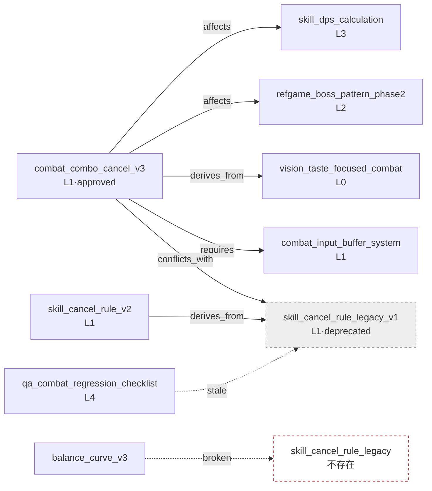

# 2.4 本體與 wikilink 圖譜 —— 驗證語義箭頭

週一上午,一條變更請求被提了上來。戰鬥團隊的成員 A 在團隊即時通訊工具裡寫下一行字:"我想把全域性冷卻從 0.5 秒改成 0.3 秒。有誰受影響嗎?"換作平時,從這裡開始就是一場半小時的會議。負責傷害計算公式的人舉手,負責連招取消規則的人插話,還有人問"Boss 的招式會不會也受影響"。沒有人把整張圖都裝在腦子裡,於是會議被翻找記憶這件事填滿。

可這一次不一樣。請求提上來 1 秒後,機器人自動加了一條評論:"修改這個 atom 會影響 4 個 atom。`skill_dps_calculation`、`combat_combo_cancel_v3`、`refgame_boss_pattern_phase2`、`balance_curve_v3`。負責人:成員 B、成員 A、成員 C。"會議沒有召開。4 個人各自只確認了自己的 atom 就結束了。(這個機器人我們會在後面親手做出來 —— 見 2.4.3。)

這條評論不是魔法。在 2.3 裡我們給所有 atom 賦予了 Layer 座標,在此之上,本章又加上了**語義箭頭** —— 哪個決策影響哪個決策。座標只說到"這裡有什麼"。"這個影響那個""那個必須先存在才成立""這兩個不能同時開啟"之類的關係,是畫在座標之上的箭頭。本章講的就是如何標註這些箭頭,以及如何自動揪出斷掉的箭頭。

> **術語備註**
> - 本體(ontology):把概念及其之間的關係明確定義出來的體系。本書採用簡化為 6\~12 種關係的輕量版本。
> - wikilink:`[[atom_name]]` 形式的文件間連結。借用了 Obsidian、Roam 等工具中使用的寫法。
> - 反向引用(backlink):"指向這個 atom 的那些 atom"的列表。正向引用的反方向。
> - 孤立節點(orphan):任何地方都沒有引用的 atom。廢棄候選的訊號。
> - 斷鏈(broken link):指向不存在的 atom 的 wikilink。錯別字、改名留下的痕跡。

---

## 2.4.1 關係就是箭頭 —— 僅憑 wikilink 為何不夠

在 2.1 裡,我們用 YAML 前言(frontmatter)附上了後設資料,又在 atom 正文裡撒下了 wikilink。僅憑這些,文件就已經像網一樣連線起來了。問題在於,這些連線**沒有寫明它意味著什麼**。

```markdown
這個決策成立於 [[skill_cooldown_rule_v2]] 之上。
```

這一行只說到"提及了 skill_cooldown_rule_v2"。為什麼提及?是這個決策**需要**那條規則(requires),是從那條規則**派生**而來(derives_from),還是與那條規則**衝突**(conflicts_with)?人讀句子就明白,機器卻不知道。就算問 AI"開啟這個決策會不會有什麼東西被破壞",僅憑沒有語義的連結也答不出來。

所以要給 wikilink 套上**關係型別**。遊戲策劃中實際用到的關係,出乎意料地少。下面這六種就覆蓋了 90% 以上。

<svg viewBox="0 0 720 250" xmlns="http://www.w3.org/2000/svg" font-family="sans-serif" font-size="13">
  <rect x="0" y="0" width="720" height="250" fill="#fbfbfd" stroke="#ddd"/>
  <!-- affects -->
  <rect x="20" y="20" width="120" height="44" rx="6" fill="#fff" stroke="#222"/>
  <text x="80" y="40" text-anchor="middle" font-weight="bold">affects</text>
  <text x="80" y="56" text-anchor="middle" fill="#666">施加影響</text>
  <!-- derives_from -->
  <rect x="160" y="20" width="120" height="44" rx="6" fill="#fff" stroke="#1a66cc"/>
  <text x="220" y="40" text-anchor="middle" font-weight="bold" fill="#1a66cc">derives_from</text>
  <text x="220" y="56" text-anchor="middle" fill="#666">派生自~</text>
  <!-- requires -->
  <rect x="300" y="20" width="120" height="44" rx="6" fill="#fff" stroke="#e08a00"/>
  <text x="360" y="40" text-anchor="middle" font-weight="bold" fill="#e08a00">requires</text>
  <text x="360" y="56" text-anchor="middle" fill="#666">須先存在</text>
  <!-- conflicts_with -->
  <rect x="440" y="20" width="130" height="44" rx="6" fill="#fff" stroke="#cc2222"/>
  <text x="505" y="40" text-anchor="middle" font-weight="bold" fill="#cc2222">conflicts_with</text>
  <text x="505" y="56" text-anchor="middle" fill="#666">不可同時啟用</text>
  <!-- is_a -->
  <rect x="590" y="20" width="110" height="44" rx="6" fill="#fff" stroke="#888"/>
  <text x="645" y="40" text-anchor="middle" font-weight="bold" fill="#888">is_a</text>
  <text x="645" y="56" text-anchor="middle" fill="#666">特例</text>
  <!-- part_of -->
  <rect x="300" y="90" width="120" height="44" rx="6" fill="#fff" stroke="#bbb"/>
  <text x="360" y="110" text-anchor="middle" font-weight="bold" fill="#999">part_of</text>
  <text x="360" y="126" text-anchor="middle" fill="#666">~的一部分</text>
  <!-- example wiring -->
  <text x="360" y="175" text-anchor="middle" fill="#333" font-size="14">例:combat_combo_cancel_v3 —[affects]→ skill_dps_calculation</text>
  <text x="360" y="200" text-anchor="middle" fill="#333" font-size="14">combat_combo_cancel_v3 —[derives_from]→ vision_taste_focused_combat</text>
  <text x="360" y="225" text-anchor="middle" fill="#333" font-size="14">combat_combo_cancel_v3 —[requires]→ combat_input_buffer_system</text>
</svg>

把這六種用 enum 固定下來的 atom 就是 `ontology_relation_enum_v1`。要新增關係型別,必須經過變更請求評審。即便增加,10\~12 個也是適當的上限,起步時只用 affects、derives_from、requires 三個也足夠。寫關係的位置是 atom 的 YAML 前言。

```yaml
---
name: combat_combo_cancel_v3
layer: 1
affects: [skill_dps_calculation, refgame_boss_pattern_phase2]
derives_from: [vision_taste_focused_combat]
requires: [combat_input_buffer_system, skill_cooldown_rule_v2]
conflicts_with: [skill_cancel_rule_legacy_v1]
---
```

人只寫正向的那一行。反向("誰在 affects 我")由工具掃描全部來計算。如果在兩邊都寫 affects,同步負擔就會翻倍,而一旦只改一邊、忘了另一邊,圖譜就開始說謊。**一個方向靠人手,反方向靠工具**,這是貫穿本章始終的原則。

---

## 2.4.2 實操記錄(worked transcript) —— 一次性驗證 wikilink 反向引用與圖譜完整性

從這裡開始,我把實際發生的一次會話整段照搬過來。"實操記錄"是本書的專有詞,指完整保留的真實操作過程記錄。情形是這樣的:把連招取消規則從 v2 推翻重做為 v3 時,決定廢棄 `skill_cancel_rule_legacy_v1`。但在廢棄之前,必須確認**有沒有別的 atom 指向這個 atom**(反向引用),以及**廢棄之後會不會留下斷鏈或衝突**(圖譜完整性)。靠手動 grep 會漏掉。交給 Claude。

### 提示詞(全文)

```
我附上的 atom 資料夾(decisions/)裡有 atom,前言裡應該寫著關係
(affects/derives_from/requires/conflicts_with/is_a/part_of)。
正文裡也有 wikilink。現在我想廢棄 skill_cancel_rule_legacy_v1,
廢棄前請幫我檢查 3 項:1) 反向引用 2) 斷鏈 3) 衝突。
不要猜測,實際讀取檔案再回答。找不到就說找不到。
// 反向引用=YAML 關係+正文 wikilink 兩邊 / 斷鏈=因廢棄而 stale、變為不存在的連結
// 衝突=conflicts_with 物件中是否還有 status: approved 存活
```

### Claude 的輸出(原始 —— 不做摘要、不做整理)

> 我讀取了 decisions/ 資料夾中的 47 個檔案。以下是針對 `skill_cancel_rule_legacy_v1` 的 3 項檢查結果。
>
> **1. 反向引用(指向這個 atom 的 atom)**
>
> 通過 YAML 關係指向的 atom:
> - `combat_combo_cancel_v3` —— `conflicts_with: [skill_cancel_rule_legacy_v1]`
> - `skill_cancel_rule_v2` —— `derives_from: [skill_cancel_rule_legacy_v1]`
>
> 通過正文 wikilink 指向的 atom:
> - `combat_combo_cancel_v3` 正文:"解決了舊版 `[[skill_cancel_rule_legacy_v1]]` 的輸入緩衝問題"
> - `qa_combat_regression_checklist` 正文:"迴歸項第 3 條是按 `[[skill_cancel_rule_legacy_v1]]` 編寫的"
>
> 也就是說**有 4 個 atom 引用這個 atom**。(YAML 2 個 + 正文 wikilink 2 個,但 combat_combo_cancel_v3 兩邊都有,所以實際 atom 數為 3 個)
>
> **2. 斷鏈(廢棄時會斷掉的地方)**
>
> 僅靠廢棄本身,wikilink 並不會"斷掉" —— 檔案仍然保留,只是 status 變成 deprecated。不過:
> - `qa_combat_regression_checklist` 是以這個被廢棄的 atom 為基準定義迴歸項的,因此**內容上失效**。這不算斷鏈,但屬於 stale link。需要複查。
> - 如果你連檔案都**刪除**,那麼上述 4 處引用就全部變成斷鏈。
>
> ⚠️ 有一處含糊的地方:`balance_curve_v3` 正文裡有一個 `[[skill_cancel_rule_legacy]]`(末尾沒有 `_v1`)的連結。它是錯別字、本想指向 `_v1`,還是有意指向另一個 atom,僅憑檔案無法確定。名為 `skill_cancel_rule_legacy` 的檔案在資料夾裡**不存在**。也就是說,這很可能已經是一條斷鏈。需要確認。
>
> **3. 衝突殘留(conflicts_with 物件是否存活)**
>
> 與 `skill_cancel_rule_legacy_v1` 以 `conflicts_with` 繫結的 atom:只有 `combat_combo_cancel_v3` 一個。
> - `combat_combo_cancel_v3` 的 status:**approved**(存活)
>
> → 與廢棄物件衝突的新規則處於正常批准狀態。這是正常的。這是廢棄舊版、新版存活下來的自然替換。**不是衝突殘留警告。**
>
> ---
> **總結**:廢棄是安全的,但請先處理兩件事。
> (a) `qa_combat_regression_checklist` 的 stale link —— 更新迴歸項第 3 條。
> (b) `balance_curve_v3` 的 `[[skill_cancel_rule_legacy]]` —— 疑似錯別字。可能已經是斷鏈。

### 人的驗證與否決

在這裡,我沒有照單全收這份輸出。(a)是對的 —— 迴歸檢查清單得由我來更新。但我在(b)處停了下來。Claude 說 `balance_curve_v3` 的 `[[skill_cancel_rule_legacy]]` "疑似錯別字",可它究竟是不是斷鏈,我得親自去看資料夾。AI 說"無法確定",這是誠實的訊號,不是結論。

開啟資料夾一看,名為 `skill_cancel_rule_legacy` 的檔案確實不存在。可檢視 git log 才發現,6 個月前有一次把 `skill_cancel_rule_legacy` **只改了名**為 `skill_cancel_rule_legacy_v1` 的提交。那時 `balance_curve_v3` 的正文連結沒能更新就被放過去了。也就是說,這不是錯別字,而是**改名後變成孤兒的斷鏈**。Claude 的"疑似錯別字"這一猜測只對了一半。原因不是錯別字,而是 rename 遺漏。這點區別如果我沒抓住,就會只改回歸檢查清單,斷鏈則被原樣埋掉。

### 重新請求(反映已確認的事實)

```
確認過了。[[skill_cancel_rule_legacy]] 不是錯別字,而是 6 個月前
rename(_legacy → _legacy_v1)時沒能改正文連結而留下的斷鏈。

那就趁這個機會,把整個資料夾裡"指向不存在的 atom 的 wikilink"
全部找出來。以正文 wikilink 為準,凡是目標檔案不在資料夾裡的,全部列出。
用表格列出檔名和其中的斷鏈。
```

> 我收集了 47 個檔案中所有 `[[...]]` 正文 wikilink,並與資料夾的檔案清單做了比對。目標檔案不存在的斷鏈共 **3 條**。
>
> | 含連結的檔案 | 斷掉的 wikilink | 推測原因 |
> |---|---|---|
> | `balance_curve_v3` | `[[skill_cancel_rule_legacy]]` | rename 遺漏(→ `_v1`) |
> | `quest_reward_table_v2` | `[[concept_reward_currency]]` | 目標 atom 未編寫(只有計劃,沒有檔案) |
> | `refgame_boss_pattern_phase2` | `[[skill_global_cooldown]]` | rename 遺漏(→ `skill_global_cooldown_rule`) |
>
> 3 條中有 2 條(rename 遺漏)只要把目標 atom 名改成 `_v1` / `_rule` 即可。1 條(`concept_reward_currency`)由於所指向的 atom 本身不存在,需要你去編寫,或刪除該連結。我沒有自動修改 —— 請在確認你想要哪一種後再進行。

三條全都屬實。如果靠手動 grep,`quest_reward_table_v2` 的斷鏈幾乎肯定會被漏掉。那條連結是"預先指向一個尚未建立的 atom"的、有意為之的未來引用,可 6 個月裡沒人去建立那個 atom,它實際上已經成了一句作廢的承諾。

這次會話所展現的事很簡單。**反向引用檢出與斷鏈檢出,AI 擅長讀取並比對整個資料夾;而原因判定與意圖確認,則由人來做。** AI 做到"這裡斷了"為止,人則做到"為什麼斷、怎麼修"為止。

---

## 2.4.3 畫成圖譜才看得見的東西 —— 把驗證搬到視覺上

前一節的檢查也可以每次都用提示詞來跑,但把同樣的檢查用程式碼固化下來,就能在圖譜上一目瞭然。專案A 裡有一個由 2.3 中介紹的 `gen_relation_map.py` 擴充套件而來的圖譜工具在做 R&D。核心是讀取資料夾裡的 atom,用 `networkx` 構建有向圖之後,再疊上四個檢查函式。

```python
import networkx as nx

# build_graph(folder): 讀取 atom 資料夾,以節點(=atom)和
#   YAML 關係邊構建 DiGraph。(全文見「動手試試」)

def find_cycles(G):                      # 迴圈依賴
    return list(nx.simple_cycles(G))

def find_orphans(G):                     # 入度為 0 = 孤立候選
    return [n for n in G.nodes if G.in_degree(n) == 0]
```

核心就是兩行。`simple_cycles` 抓出迴圈依賴(A requires B requires C requires A),`in_degree(n) == 0` 抓出孤立節點 —— 不需要親手寫 DFS。其餘兩個函式也是同等分量的一行式。`find_broken_wikilinks` 用正則收集正文 `[[...]]`,挑出不在節點清單裡的;反向引用則把圖譜倒著遍歷一遍就出來(全文見「動手試試」)。視覺化時把節點顏色按 Layer 塗,邊的顏色按關係型別塗,被引用很多的節點(入邊多的節點)畫大一些,讓樞紐顯露出來。就像在檔案櫃上貼好彩色標籤、整理過的資料夾那樣,模式會先在視野中浮現。

下面是把 2.4.2 會話中涉及的那些 atom 的實際關係搬過來畫成的圖譜。箭頭方向意味著"起點 atom 朝著終點 atom 建立關係"。



用虛線畫出的兩條邊,正是 2.4.2 裡靠人工驗證抓到的問題。`qa → legacy` 是以廢棄 atom 為基準的 stale link,`balance_curve_v3 → skill_cancel_rule_legacy` 是指向不存在節點的斷鏈。畫成圖譜後,這兩條虛線就在實線之間凸顯出來。要是隻用文本來運營,它們就會埋沒在 47 個檔案的某處,永遠看不見。

在驗證關卡(verification gate,由人或檢查器把關驗證的環節,類似質量門禁 quality gate)(Layer 4)上自動執行的規則有四條。

- **迴圈依賴**:`requires` 鏈條若繞回自己,就告警。用 `simple_cycles` 檢出。
- **衝突啟用**:以 `conflicts_with` 繫結的兩個 atom 若都是 `status: approved`,就告警。(2.4.2 的案例因一方為 deprecated 而通過。)
- **孤立節點**:入度為 0 且沒有父節點的 atom,作為廢棄候選按季度排查。atom `graph_orphan_detection_quarterly` 明確規定了這個週期。
- **Layer 逆行**:L1 → L3 affects 是正常的(上層決策影響下層資料),L3 → L1 affects 則可疑。與 2.3 的反向引用檢出是同一原理。由於 atom `docs_layer_numeric_prefix_naming` 強制在檔名上加 Layer 編號字首,逆行只看檔名就能先做一輪篩除。

這四條規則一旦用程式碼固化,就不必像 2.4.2 那樣每次都編寫提示詞。變更請求一提上來,機器人就重新構建圖譜,把受影響的 atom 清單與斷鏈、迴圈、衝突自動寫成評論。章首那條"有 4 個 atom 受影響"的評論,正是這個 —— 這個機器人就是前面預告過的那個機器人。

---

## 2.4.4 為什麼是 Layer —— 為了程式化生成而劃分的座標

這裡得說清楚 2.3 與 2.4 為什麼是一個整體。Layer 座標與關係箭頭不是分頭引入的,而是同一目的的兩個面。

表面上,Layer 統一了協作語言 —— 叫它"這是 L1 系統決策""那是 L3 資料",哪怕領域不同也共享同一套座標。但本質目的在別處。**Layer 是為了程式化生成而劃分的座標。**

L0 願景是上下文錨點 —— 它不變,且每次都注入給 AI。L1 系統是生成的輸入規則 —— 規則手冊、關係、標籤都住在這裡。L2 內容是生成出來的正文堆積的地方,L3 資料以數值、ID、關係充當模擬的輸入,L4 構建·QA 是驗證關卡。關係箭頭在這套座標之上作為**生成的約束條件**運轉。AI 生成新內容時,`requires` 箭頭成為"這個必須先存在"的前提,`conflicts_with` 箭頭成為"這個不能一起開啟"的禁令。

領域會分化(戰鬥、任務、經濟各自擁有專長),但所有產出物都帶有 Layer 座標,因而彼此認知。分化與整合在同一套座標系上同時成立。等這張圖譜長得足夠大,AI 在生成候選時就會把關係箭頭當作自動約束來讀,人只需在評審關卡上確認有沒有違反即可。2.4.2 的實操記錄就是它的縮小版 —— AI 讀取圖譜、找出約束違反(斷鏈、衝突),人在關卡上判定。

---

## 2.4.5 領域概念也是節點 —— 一部小型詞彙詞典

成為關係箭頭起點、終點的節點,不只有決策 atom。把"技能""任務""獎勵"這類領域概念定義出來的 atom,同樣是圖譜的一等公民。`concept_skill_definition_v1` 長這樣。

```markdown
# 技能 (Skill)
Definition: 角色在戰鬥中發動的單位動作。包含輸入、冷卻時間、資源、效果。
Required Properties: input / cooldown / cost / effects
Subtypes: active_skill (is_a) / passive_skill (is_a) / ultimate_skill (is_a)
Not a skill: 自動攻擊 [[concept_auto_attack]] / 變身 [[concept_transformation]]
```

只要寫上 `boss_skill is_a skill`,上位概念的規則就會自動繼承。專案A 裡這類概念定義 atom 大約有 19 個,所有決策 atom 都引用它們。詞彙一旦統一為一本詞典,會議、文件、程式碼之間的翻譯負擔就消失了。等於是不在每張桌子上各放一本不同的詞典,而是共享同一本詞典。前面實操記錄中被當作斷鏈抓到的 `concept_reward_currency`,正是"約好要收進詞典、卻還沒建立的空條目"。

---

## 2.4.6 保持輕量 —— 學術本體的陷阱

讀到這裡,會有人問"這不就是 OWL/RDF 那樣的正式本體嗎"。不是。而且我是故意讓它不是的。

學術本體(OWL、RDF、SKOS)很強大,但關係型別有幾十到幾百種,需要專用推理引擎,要運營就得有本體專家駐場。在搜尋引擎、醫療、法律這類精密推理生死攸關的領域,它是必需的。可遊戲策劃中實際需要的推理只有"變更影響範圍""先決依賴""衝突檢出"三種,而且全都用沿圖譜逐格遍歷的簡單搜尋(BFS、DFS)就夠了。前一節用 `networkx` 一行抓出迴圈就是證據。正式推理引擎是過剩配置。

標準只有一條。**策劃能否靠手動運營。** YAML 6 個 enum、`networkx` 處理、用 pyvis 或 D3.js 視覺化。一旦越過這條線,工具就不再是工具,而成了又一份負擔。輕量不是妥協,而是設計意圖。

要避開這個陷阱,有五個反覆出現的錯誤。它們都從"把本體當成強制標準來對待"這同一個根上長出來。

| 錯誤 | 規避法 |
|---|---|
| 一開始就定義太多關係型別 | 從三個(affects、derives_from、requires)起步,只在需要時再加 |
| 強制每個決策都帶關係 | 沒有關係的 atom 也認作正常 —— 空關係會弄髒圖譜 |
| 把 affects 寫成雙向 | 隻手寫一個方向,反方向靠工具自動計算 |
| 執著於 OWL、RDF | 停留在可運營的水平(YAML + enum) |
| 沒有視覺化、只用文本運營 | 哪怕是簡單的 HTML 檢視也從一開始就提供 —— 就像 2.4.3 的虛線,看不見就不會去修 |

第 1、2、3 個在引入後 1 個月內就能摸到規律,第 4、5 個在第 3 個月的覆盤中排查,自然就會對齊。

---

## 2.4.7 小處起步與下一章

頭一個月是虧本的。只是關係書寫的負擔在累積,看得見的效果卻沒有。所以要從小處起步。第一週只用 affects、derives_from、requires 三種關係,第 2\~4 周對 20 個核心 atom 應用,看著圖譜長起來。在第 1 個月做一個前一節那種水平的 HTML 圖譜檢視,從第二個月起視覺化就開始體現價值,到第三個月,自動驗證(迴圈、衝突、孤立、斷鏈)就直接縮短了會議時間。能否熬過這虧本的一個月,是引入成敗的分水嶺。

下一個第 8 章 Wikilink 會從運營層面深挖本章用箭頭處理過的 `[[...]]` 寫法 —— 反向引用面板每天怎麼用,改名時如何一次性更新連結(從源頭杜絕 2.4.2 的 rename 遺漏),如何把 Obsidian 這類工具的圖譜檢視融入實務。YAML(第 4 章)→ Atom(第 5 章)→ Layer(第 6 章)→ Ontology(第 7 章)→ Wikilink(第 8 章)就是資訊架構完整的五邊形。

---

## 動手試試

**setup.** 定下一個彙集 atom 的資料夾(例如 `decisions/`),為每個 atom 的 YAML 做好寫關係鍵的準備。一開始只用 `affects`、`derives_from`、`requires` 三個。正文連結統一為 `[[atom_name]]` 形式。

**prompt.** 在廢棄、改名之前丟擲下面這段。

```
讀取這個資料夾裡的 Markdown atom,我想廢棄/變更 [目標_atom],請檢查:
(1) 反向引用:用 YAML 關係和正文 wikilink 指向這個 atom 的全部 atom
(2) 斷鏈:變更/刪除時會斷掉或變 stale 的連結
(3) 衝突殘留:conflicts_with 物件中 status: approved 的那些
不要猜測,實際讀取檔案,找不到就說找不到。
```

**verify.** AI 標註"疑似錯別字""無法確定"的地方,要由人親自開啟。斷鏈的**原因**(是錯別字、rename 遺漏還是未編寫)由人藉助 git log 和資料夾實物來判定。不要讓它自動修改,確認意圖後親手修。

### 圖譜工具全文(2.4.3 節選)

正文(2.4.3)中只展示了核心的兩個函式。把整個資料夾構建成圖譜並掛上四項檢查的全文如下。

```python
import networkx as nx
import re, yaml, glob, os

REL_TYPES = ["affects", "derives_from", "requires",
             "conflicts_with", "is_a", "part_of"]
WIKILINK = re.compile(r"\[\[([a-zA-Z0-9_]+)\]\]")

def build_graph(folder):
    G = nx.DiGraph()
    files = {}
    for path in glob.glob(os.path.join(folder, "*.md")):
        name = os.path.splitext(os.path.basename(path))[0]
        text = open(path, encoding="utf-8").read()
        fm = yaml.safe_load(text.split("---")[1]) or {}
        files[name] = fm
        G.add_node(name, layer=fm.get("layer"), status=fm.get("status"))
    # YAML 關係邊
    for name, fm in files.items():
        for rel in REL_TYPES:
            for tgt in (fm.get(rel) or []):
                G.add_edge(name, tgt, type=rel)
    return G, files

def find_broken_wikilinks(folder, known_nodes):
    broken = []
    for path in glob.glob(os.path.join(folder, "*.md")):
        text = open(path, encoding="utf-8").read()
        for m in WIKILINK.findall(text):
            if m not in known_nodes:
                broken.append((os.path.basename(path), m))
    return broken

def find_orphans(G):
    # 入度為 0 且沒有 part_of/is_a 父節點的節點
    return [n for n in G.nodes if G.in_degree(n) == 0]

def find_cycles(G):
    return list(nx.simple_cycles(G))
```

### 單人精簡版

沒有工具也行。一個 atom 資料夾、一個 Claude 就夠了。寫新決策時只在 YAML 里加 `requires`、`affects` 兩行,每當發生廢棄、改名時就把上面的 prompt 跑一遍。圖譜視覺化是以後的事 —— 在變更前把斷鏈和衝突過一遍的習慣,這一次,就擋住了單人運營中最大的虧損。

---

### 本章要點
- 在座標之上套上語義箭頭,"什麼影響什麼"才能被自動推斷
- 反向引用、斷鏈檢出由 AI 來做,原因判定與意圖確認由人來做
- 輕量不是妥協,而是設計意圖 —— 手動運營不了,工具就成了負擔
