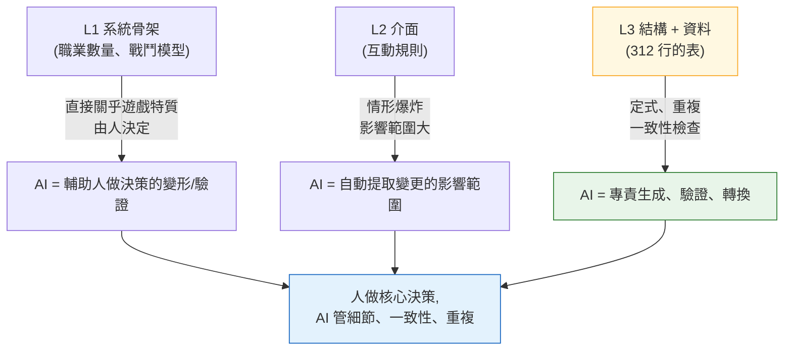

# 3.1 系統策劃的日常與 Layer 座標

週四下午 4 點 50 分。數值策劃填好的技能表剛剛上傳。技能 312 個。每個技能都要在 `effect_id` 這一欄裡填上效果編號,而那個編號指向另一張效果表裡的某一行。兩者對上了,遊戲才能跑起來。對不上,客戶端就會呼叫一個空效果,或者悄無聲息地崩潰。

從前的我是用手一行行核對的。技能表點一格,跳到效果表,確認編號,再跳回來。312 遍。再快也要兩個小時。在眼睛發花的最後 50 個裡,總會漏掉一兩個,而正是這一兩個,在 QA 版本里炸了。

本章要講的,是那兩個小時去了哪裡,以及那道一致性檢查在系統策劃的工作地圖上究竟落在哪個座標。座標不先定好,你就只能憑感覺去判斷該把 AI 嵌在哪裡,而且永遠只能憑感覺。

---

## 3.1.1 系統策劃要做四樣東西

系統策劃是在抽象度與具體度之間遊走範圍最廣的人。他接過名為願景的那團霧,一直把它拽到資料表最後一格那個堅硬的數字為止。在這段旅程中產出的成果,共有四類。

**(1) 把願景翻譯成結構。** 當總監說"打擊感十足的動作戰鬥"時,系統策劃就把它轉化成技能、連招、取消、頓幀這套骨架。"成長的自主決定權"就變成職業、技能樹、裝備系統。這是霧凝結成構築物的第一瞬間。

**(2) 為系統之間的介面編寫規格。** 戰鬥、移動、背包、商店、任務、公會同時在跑。戰鬥中開啟背包會不會附加無敵?強化途中收到 PvP 申請怎麼辦?這些情形的答案匯聚起來,造就了所謂"做得好"的那種手感。每一處缺了答案的地方,玩家都會感到煩躁。

**(3) 對資料表及其結構(schema)負責。** 312 個技能的係數,數百件道具的效果,數十種怪物的行為。數值要麼自己填,要麼交給數值策劃或內容策劃。但表的**列定義(結構,schema)**這一塊,得攥在系統策劃手裡。這是替別人做好一隻只貼了標籤的抽屜的活兒。抽屜做得潦草,每個人填法就各不相同,一致性也就破了。

**(4) 設計行為邏輯。** 角色、怪物的 AI 會以狀態機(FSM,Finite State Machine,有限狀態機)、行為樹(Behavior Tree,以下簡稱 BT)、決策表、程式化規則等形態產出。這些資料交到程式設計師手中,變成程式碼。

四樣東西全都匯到同一個人的桌上,這一點是關鍵。所以"今天把時間花在什麼上"就成了系統策劃最大的運營決策。

---

## 3.1.2 系統產出有它的 Layer 座標

在 2.3 裡,我們把整個遊戲製作物從 L0(願景)到 L4(版本)放上了一根座標軸。現在,就把 3.1.1 的四樣產出原樣標在那根軸上。像系統策劃這樣,一個領域的產出物橫跨多個 Layer、鋪得這麼開的情形,是很罕見的。

下面這張圖,把產出物落在 Layer 上的哪個位置、又在每個座標上與誰相遇,都畫在了一張紙上。

<svg viewBox="0 0 720 360" xmlns="http://www.w3.org/2000/svg" font-family="sans-serif" font-size="13">
  <!-- Layer bands -->
  <rect x="20" y="20" width="680" height="60" fill="#eceff1" stroke="#b0bec5"/>
  <rect x="20" y="80" width="680" height="60" fill="#e3f2fd" stroke="#90caf9"/>
  <rect x="20" y="140" width="680" height="60" fill="#e8f5e9" stroke="#a5d6a7"/>
  <rect x="20" y="200" width="680" height="60" fill="#fff8e1" stroke="#ffe082"/>
  <rect x="20" y="260" width="680" height="60" fill="#eceff1" stroke="#b0bec5"/>
  <!-- Layer labels -->
  <text x="34" y="55" font-weight="bold">L0</text>
  <text x="34" y="115" font-weight="bold" fill="#1565c0">L1</text>
  <text x="34" y="175" font-weight="bold" fill="#2e7d32">L2</text>
  <text x="34" y="235" font-weight="bold" fill="#f9a825">L3</text>
  <text x="34" y="295" font-weight="bold">L4</text>
  <!-- Layer descriptions -->
  <text x="80" y="55" fill="#607d8b">願景 —— 系統策劃只負責接收</text>
  <text x="80" y="108" fill="#0d47a1">系統骨架:職業、戰鬥、背包、公會的定義</text>
  <text x="80" y="168" fill="#1b5e20">介面:系統間互動規則、優先順序</text>
  <text x="80" y="228" fill="#e65100">結構 + 資料:表的列定義,部分數值</text>
  <text x="80" y="295" fill="#607d8b">版本 —— QA 驗證意圖是否落地</text>
  <!-- Collaborator column -->
  <line x1="500" y1="20" x2="500" y2="320" stroke="#90a4ae" stroke-dasharray="4 3"/>
  <text x="512" y="55" fill="#607d8b" font-size="12">↔ 總監、敘事</text>
  <text x="512" y="115" fill="#1565c0" font-size="12">↔ 美術指導</text>
  <text x="512" y="175" fill="#2e7d32" font-size="12">↔ 其他系統策劃</text>
  <text x="512" y="235" fill="#f9a825" font-size="12">↔ 數值、內容</text>
  <text x="512" y="295" fill="#607d8b" font-size="12">↔ QA</text>
  <!-- responsibility arrow -->
  <line x1="62" y1="90" x2="62" y2="250" stroke="#c62828" stroke-width="2.5" marker-end="url(#ah)"/>
  <defs>
    <marker id="ah" markerWidth="8" markerHeight="8" refX="4" refY="4" orient="auto">
      <path d="M0,0 L8,4 L0,8 Z" fill="#c62828"/>
    </marker>
  </defs>
  <text x="335" y="338" fill="#c62828" font-size="12" font-weight="bold">系統策劃親手製作的區段(L1→L3)</text>
</svg>

這張圖說明的有兩點。第一,系統策劃負責的是從 L0**接過來**、一直**送達**到 L4 的這段長路。第二,親手製作的區段是 L1\~L3,而這三格里每一格協作物件都不一樣。每換一格,協作語言就變,所以不把座標放在心上,會議就會一次次空轉。

不過這並不是說一個人要把 L1\~L3 全都包了。團隊大,L1\~L2 負責人和 L3 負責人就會分開;團隊小,一個人全看。座標是分工的地圖,不是把活兒全推給一個人的命令。

---

## 3.1.3 座標定下來,就能看清把 AI 嵌在哪裡

圖畫好了,現在該上色了。哪個座標引入 AI 的效果大?不是悶頭"全部自動化",而是看座標的性質來挑。



關鍵在於**座標越往下走,AI 專責的比重越大**。L1 的"職業要做幾個"關乎遊戲特質,得攥在人手裡。反過來,L3 的"312 行外部索引鍵是不是都對得上"是定式、重複,該整個交給 AI。L2 在中間——決策由人來做,但"改了這條規則會牽連到哪裡"這樣的影響範圍提取,由 AI 來託著。

這張圖解釋了為什麼 3.1.4 之後的所有實操都從 L3 附近起步:因為那是效果最大、風險最小的位置。結構工具就算出故障也不會闖禍,關係圖只是畫畫圖而已,一致性檢查則可以由人否決。

---

## 3.1.4 實操記錄(worked transcript):在座標 L3 上把一致性檢查交給 AI

理論到此為止。現在回到 3.1 開頭的那個週四。技能表裡 312 個 `effect_id` 是否與效果表對得上,讓 AI 來試一試。不做刪減,把實際往來原樣照搬。(實操記錄,worked transcript:完整保留的真實操作過程記錄。)

資料錄入遵循 `schema-first` 原則。也就是說,人先定義**說明書表**,從那裡產出 Enum 和 `.proto`(由 VBA(Excel 巨集語言) Export),最後才填入 csv 資料。所以驗證提示詞也以"先讀結構"開頭。要釘死一點:正本不是結構文件,而是**實際 export 出來的 JSON**(`json_over_schema_doc_as_source_of_truth`)。因為文件會撒謊,export 出來的 JSON 撒不了謊。

### 提示詞(全文)

> 你是我們專案的資料一致性檢查器。
> 輸入是兩個 export JSON。
> 1) `skill.json` —— 每個技能物件都有 `skill_id`、`name`、`effect_id` 欄位。
> 2) `effect.json` —— 每個效果物件都有 `effect_id`、`effect_type`。
>
> 請檢查以下各項。
> (A) `skill.json` 裡所有 `effect_id` 是否都存在於 `effect.json` 中(外部索引鍵一致性)。
> (B) 存在於 `effect.json`、卻沒有任何技能引用的孤立(orphan)效果。
> (C) `skill.json` 中 `effect_id` 為空或為 0 的行。
>
> 規則:不要猜測。JSON 中沒有的欄位,就報告"欄位缺失"。
> 輸出分為 (A)(B)(C) 三個小節,每條違規用一行寫出 `skill_id`(或 effect_id)和原因。
> 若沒有違規,就在對應小節裡只寫"無違規"。

### Claude 的原始輸出(未加工、未美化)

> 沒有收到兩個輸入 JSON。當前訊息中沒有附帶檔案內容。
> 請用以下任意一種方式重新發來。
> - `skill.json` 和 `effect.json` 的實際內容(貼上或附件)
> - 或者兩個檔案的路徑
>
> 收到內容後,我會按 (A)(B)(C) 的順序檢查。沒有檔案,我不會編造結果。

在這裡停下,反倒是值得信賴的訊號。如果輸入是空的,卻回來一份像模像樣的報告,那份乾淨利落本身才是危險訊號。不憑空造出檢查結果,而是反問"先把檔案給我"的那一方,才靠得住。我把兩個 JSON 實際粘了進去,重新發起請求(因篇幅所限,正文中只摘錄一部分)。

```json
// skill.json (摘錄)
[
  {"skill_id": 1001, "name": "強擊",     "effect_id": 5001},
  {"skill_id": 1002, "name": "迴旋斬", "effect_id": 5002},
  {"skill_id": 1003, "name": "舉盾","effect_id": 0},
  {"skill_id": 1004, "name": "塗毒", "effect_id": 5099}
]
```

```json
// effect.json (摘錄)
[
  {"effect_id": 5001, "effect_type": "DAMAGE"},
  {"effect_id": 5002, "effect_type": "DAMAGE"},
  {"effect_id": 5003, "effect_type": "BUFF"}
]
```

### Claude 的第二次輸出(基於實際資料)

> **(A) 外部索引鍵一致性 —— 違規 1 件**
> - `skill_id: 1004` → `effect_id: 5099` 在 `effect.json` 中不存在(dangling reference)
>
> **(B) 孤立效果 —— 違規 1 件**
> - `effect_id: 5003` (BUFF) → 沒有任何技能引用
>
> **(C) 空/0 effect_id —— 違規 1 件**
> - `skill_id: 1003` → `effect_id: 0`。可能是有意為之的"無效果",請在結構中確認 0 是否為有效值。

### 人的驗證與否決

三件裡有兩件是明擺著的 bug。`5099` 是數值策劃還沒在效果表裡加上那一行,就先把它填進技能裡了——典型的工序錯位的情形。抓到了。

而 (C) 我**否決**了。在我們專案裡,`effect_id: 0` 表示"被動槽位,無效果",是個有效的約定值。AI 不知道這一點,於是把它當作"請確認"提了上來——這個判斷沒錯,但不該算成違規。於是我轉向下一步——把這個約定固化成 atom,讓下一次檢查起,AI 就把 0 認作有效值。

### 再次請求(注入領域知識)

> 追加規則:`effect_id == 0` 表示"被動,無效果",是我們專案的有效約定值。
> 因此在 (C) 中,`effect_id == 0` 不算違規。只把空字串、null、負數作為 (C) 違規報告。

> **(C) 空/0 effect_id —— 無違規**
> (`effect_id: 0` 按有效約定值處理。無空值/null/負數。)

這一行約定,正是領域知識的累積。系統策劃的決策相對長久,一旦固化下來,一年後同樣的檢查也會按同樣的標準來跑。櫃子裡又疊上了一張決策卡。

在這段記錄裡,人做的事**只有三件**——(1) 指定"先讀結構"的輸入順序,(2) 確認 `5099` 是真 bug,(3) 知道 `0` 是有效值,從而否決並糾正 AI 的判斷。其餘 312 行那種一格一格跳著看的兩個小時,消失了。被自動化掉的是"跳轉加比對"這種勞動,而剩下的那三行判斷,才是核心。

---

## 3.1.5 不斷累積的資產:把座標固化為程式碼

上面那段記錄裡的檢查,固然可以每次都用手去讓它跑,但 L3 上反覆出現的活兒,用工具固化下來才是系統策劃的正道。這裡引用筆者在用的兩樣東西——不是抽象的"專案A的工具",而是真真切切在桌上跑著的東西。

`gen_relation_map.py` 會分析表的列名、數值,自動檢測外部索引鍵關係,並生成可互動的 HTML 關係圖。如果說 3.1.4 裡 `skill.effect_id → effect.effect_id` 這道箭頭是人在腦子裡畫出來的,那麼這個指令碼就把那道箭頭對整張表畫成了圖。依賴逆行的地方(L3 資料反過來引用 L1 骨架的風險),在圖裡會立刻跳出來。

`schema-doc` 技能會解析 xlsm 的 **$結構表**,自動生成 Markdown 結構文件。3.1.4 (C) 裡冒出的那個"請在結構中確認 0 是否為有效值"的疑問,問的就是這份結構——它讓人不必翻別的檔案,就能直接讀到最新的結構。表一變,文件跟著變,文件與實際資料對不上的那個老毛病也就少了。

把這兩樣工具的位置再用座標說一遍,就是這樣。`schema-doc` 守的是 L3 的**列定義**,`gen_relation_map.py` 守的是 L2\~L3 之間的**關係**。AI 輔助提示詞(像 3.1.4 那樣的驗證)則在它們之上運轉。三者不是各跑各的,而是分管同一根座標軸的不同高度。

這些工具的實際用法,會在 3.2、3.3、3.4 裡動手照著做。3.1 是定下"嵌在哪裡"的地圖,接下來三章是動手嵌進去的活兒。

---

## 3.1.6 漸進引入:從風險小的座標開始

三樣工具一次性全開,運營負擔會比效果先到。按筆者的經驗,安全的順序是從風險小的座標(下面那頭)開始。

| 時點(建議) | 引入 | 座標 | 出錯時會發生什麼 |
|---|---|---|---|
| 1 個月 | 結構優先(3.2) | L3 | 不過是文件少更新了一次 |
| 2\~3 個月 | 關係圖視覺化(3.3) | L2\~L3 | 不過是圖不準確 |
| 3\~6 個月 | AI 輔助提示詞(3.4) | L1\~L3 | 要經過驗證,人可以否決 |

時間不是絕對標準。視團隊規模、既有基礎設施而定,可能要花兩倍,也可能減半就完事(筆者推測,未經驗證)。不變的是**順序**。把風險大的決策輔助放在最後,等前兩樣工具已讓團隊養成驗證習慣之後,再去碰最敏感的那個位置。

---

## 3.1.7 測量 —— 誠實地

不美化數字,如實記下。下面是筆者作為總監運營的 MMORPG 專案(以下簡稱"專案A")的策劃團隊(4\~5 人,整個開發團隊為中等規模 10\~50 人,運營約 6 個月)裡觀察到的情況。這不是精確的自動計量,而是基於工作日誌和覆盤記錄的**筆者的觀察**,建議只當作方向和大致的比例來讀。

- **一致性檢查**:312 行的技能↔效果外部索引鍵比對,用手最快也要兩個小時(開頭那個週四)。用 AI 驗證,除去準備輸入,幾分鐘內就出來違規清單。減掉的是跳轉、比對的勞動,不是判斷。
- **新策劃入職培訓**:有一張關係圖 HTML,過去要用嘴解釋系統依賴結構的會議,就能省下好幾次。具體省幾次因人而異,不下定論(筆者觀察)。
- **變更影響討論**:過去要靠開會去摸"改了這條規則哪裡會動",改成了先讓 AI 出一份影響範圍初稿、再由人審閱的方式。會議沒有消失,而是會議變成了**審閱**。

關鍵在於:省下來的時間,不是不做遊戲的時間。那段時間會迴流到像 L1 骨架那樣、沒法交給 AI 的深層決策上。減掉勞動,用在判斷上——這就是本章想給的一句話。

---

## 動手試試:在座標 L3 上做一次一致性檢查

**setup.** 把兩張表(例如技能、效果)export 成 csv。手頭方便的話,轉成 JSON 備著(正本是 export 結果而非文件的原則)。在兩張表之間挑一對外部索引鍵(例如 `skill.effect_id → effect.effect_id`)。

**prompt.** 把 3.1.4 的提示詞全文原樣用上。三句核心別落下——(1)"先讀結構/構造",(2)"不要猜測,沒有的就報告沒有",(3)"沒違規就只寫無違規"。

**verify.** AI 提上來的違規清單,由人一行行看。真 bug 就修,因為領域約定值(例如 `0 = 無效果`)產生的誤報就**否決**,並把那個約定加進提示詞(或 atom)。下次檢查起同樣的誤報消失了,就是又疊上了一張資產。

### 單人精簡版

如果你是沒團隊也沒表的單人開發者,谷歌表格開兩個標籤頁就夠了。一個標籤頁是"技能",另一個是"效果"。用 `effect_id` 這一列把兩者連起來。把標籤頁下載成 csv,粘進 3.1.4 的提示詞,那麼哪怕不是 312 行、而是 30 行的表,同樣能抓出 dangling reference 和孤立效果。只是規模不同,座標是一樣的。從 L3 起步,上手之後再用關係圖和影響範圍一格一格往上爬就行。

---

### 本章要點
- 系統產出的四樣東西,從 L1 骨架到 L3 表格都各有座標,而座標就是協作物件
- 座標越往下(L3)走,AI 專責的比重越大,風險越小
- 被自動化的是跳轉、比對的勞動,而確認 bug、否決誤報這類判斷,歸人來做
