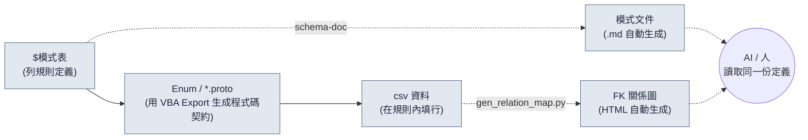

# 3.2 模式優先 —— $模式比資料更先行

週一上午，新來的策劃填好了技能表的 120 行，用 csv 構建後，客戶端日誌裡跳出了 28 條紅色報錯。`class_id` 引用了 47 號，但職業表裡根本沒有 47 號。`element` 列裡，有人寫成了 `Fire`，又有人寫成了 `fire`，還有一行用韓文寫著 `화염`。為了逐行手動排查這 28 條紅線，半個下午就這麼沒了。

這次事故的原因，並不是資料填錯了。而是**在生成資料之前，沒有把這些資料必須遵循的規則寫明白**。規則只留在腦子裡，人一換，規則也跟著變。本章講的就是把規則——模式（schema）——比資料更先建立起來的工作流。而且，讓這套規則不靠人的手、而靠工具以文件的形式強制執行。

---

> **術語備註**
> - 模式（schema）：資料表的列定義。名稱、型別、範圍、外部索引鍵、說明。
> - `$模式`：放在 Excel 資料表（xlsm）內、專門用於列定義的工作表。它裝的不是資料行，而只是列的規則。
> - FK（外部索引鍵）：引用其他表 PK（主鍵）的列。比如 `class_id` 指向 Class 表的某一行。
> - proto：Protocol Buffers 定義（`.proto`）。客戶端與伺服器共享的資料結構、Enum 契約。
> - 單一事實來源（single source of truth）：同一資訊只在一處管理，讓所有人都看向那一處的運營原則。

---

## 3.2.1 輸入順序本身就是模式

如果把模式優先只理解為"提前定義好列"，那隻抓住了一半。核心在於**先輸入什麼的順序**。填資料的手按什麼順序移動，決定了一致性是被守住還是被打破。

本書推薦的輸入順序，是一條四格的管線。



從左向右流動的實線就是**強制的輸入順序**。先定義 `$模式`，再從那裡用 VBA（Excel 巨集語言）Export 抽出 Enum 與 proto，然後只在那份契約之內填 csv 資料。虛線是從這份輸入中自動派生出來的產物——模式文件（`schema-doc`）與 FK 關係圖（`gen_relation_map.py`）——人和 AI 通過這些派生物看到同一份定義。

只要這個順序被強制執行，本章開頭看到的那 28 條紅線，大部分都會**在填資料之前**就被關掉。如果 `element` 只能是 `fire/ice/lightning/none` 四者之一這件事，被 proto 的 Enum 固定下來，那麼 `Fire` 也好、`화염` 也好，都會在輸入階段被攔下。如果 `class_id` 引用 Class 表 PK 這件事，被寫明在 `$模式` 裡，那麼 47 號的缺失，就不是在構建時、而是在檢查時更早被抓住。

一旦把順序顛倒——先填資料、再回過頭來整理模式——模式就變成了事後打掃。在已經堆了 1000 行的地方去修列規則，規則就會反過來跟著資料走，那一刻，事實來源就立反了。

---

## 3.2.2 實操記錄（worked transcript，完整保留的真實操作過程記錄）—— 從 `$模式` 到 csv 一次走通

與其用嘴解釋，不如真的把一張表從頭到尾走一遍。假設要新建一張技能表。下面是帶著 AI 輔助進行的全程記錄。不做刪減，把出錯的地方和人否決的地方原樣留下。

### 第 1 步 —— 人先用手寫 `$模式`

工具和 AI 都還不叫。列規則由人親自定義。唯獨這一步不外包。

```
# Skill 表 $模式 (由人編寫)
列              型別       範圍/約束              FK                  說明
skill_id       int        1000~9999            (PK)                技能唯一 ID
name           string     1~30字                -                  顯示名稱
class_id       int(FK)    -                    Class.class_id      可用職業
cooldown       float      0.0~120.0            -                   冷卻時間(秒)
damage_coef    float      0.0~10.0             -                   攻擊力乘數係數
element        enum       fire/ice/lightning/none  -              屬性
is_passive     bool       true/false           -                  是否被動
```

### 第 2 步 —— 讓 AI 起草 proto Enum（提示詞全文）

把 `$模式` 的 `element` enum 和 FK 結構搬進 proto 契約。這是格式轉換，是可以交給 AI 的活兒。

> **提示詞（全文）：**
> 下面是一張遊戲資料表的列規格。請把這份規格轉換成 Protocol Buffers（proto3）的 message 和 Enum。規則：(1) enum 型別的列要單獨定義為 enum，首個值必須以 `_UNSPECIFIED = 0` 開頭。(2) FK 列把引用物件寫進註釋。(3) 範圍約束在 proto 裡無法表達，只寫進註釋。規格里沒有的列不要新增。
> ```
> skill_id int PK / name string / class_id int FK→Class.class_id /
> cooldown float 0~120 / damage_coef float 0~10 /
> element enum{fire,ice,lightning,none} / is_passive bool
> ```

### 第 3 步 —— Claude 的原始輸出（原樣，未作改動）

```proto
syntax = "proto3";

// Skill 表資料契約
// 注意: 範圍約束(cooldown 0~120, damage_coef 0~10)
//       proto 無法強制。請在 Linter 中檢查。

enum SkillElement {
  SKILL_ELEMENT_UNSPECIFIED = 0;
  SKILL_ELEMENT_FIRE = 1;
  SKILL_ELEMENT_ICE = 2;
  SKILL_ELEMENT_LIGHTNING = 3;
  SKILL_ELEMENT_NONE = 4;   // ← 人工評審標記
}

message Skill {
  int32 skill_id = 1;       // PK
  string name = 2;
  int32 class_id = 3;       // FK → Class.class_id
  float cooldown = 4;
  float damage_coef = 5;
  SkillElement element = 6;
  bool is_passive = 7;
}
```

### 第 4 步 —— 人的驗證與否決

到這裡，人否決了一處。AI 把 `none` 放成了 `SKILL_ELEMENT_NONE = 4`，置於 enum 的**末尾**，可在 `$模式` 裡，`none` 是"無屬性"這一預設狀態。爭議點在 proto 的 0 號值。在 proto3 中，enum 的 0 號是"當值沒被填時自動落入的位置"，所以 0 號到底是空著留給 `_UNSPECIFIED`（未填值），還是用 `none`（有意為之的無屬性）這類語義值填上，就會分道揚鑣。一旦把兩者合在同一個位置，**把列留空的行（失誤）**和**特意選了無屬性的行（有意）**就都以 0 落進來，從此再也分不清。AI 雖然把 `_UNSPECIFIED = 0` 與 `none` 分開放了，卻把 `none` 挪到了 4 號末位，讓最常見的預設狀態在檢索、除錯時離得更遠了。

人做出的決定：
- `_UNSPECIFIED = 0` 保留（用於檢出缺失）。
- `none` 照舊保留，但在 csv 編寫規則裡追加一條："無屬性必須顯式寫 `none`，禁止留空"。空白=0=UNSPECIFIED 一律視為輸入錯誤。
- 把這個決定在 `$模式` 的 `element` 行說明裡追加一行："無屬性也要顯式寫明（none）。空白即錯誤。"

沒有照搬 AI 的輸出。格式接受了，語義的邊界由人來劃。

### 第 5 步 —— 用 VBA Export 按鈕從表裡抽出 Enum/proto

驗證過的 proto 定義，由 Excel 的 Export 宏（`$模式` 表上的按鈕）一致地輸出。人不在 IDE 裡重新打字。表才是事實來源，所以 proto 由表裡產出。這個順序，是 3.3 將要講的"輸出即正本"（`json_over_schema_doc_as_source_of_truth`）原則的延伸——不是文件去解釋程式碼，而是表去產出程式碼。

### 第 6 步 —— 這才開始填 csv 資料（AI 輔助，含再請求）

> **提示詞（全文）：**
> 請生成 5 個滿足上述 Skill proto 與 $模式 的 csv 行。約束：class_id 取 [1,2,3] 之一（當前 Class 表中存在的 PK），damage_coef 在被動（is_passive=true）時為 0.0，element 原樣寫 fire/ice/lightning/none 字串，禁止留空。

Claude 的首次輸出裡，有一行出了岔。

```
skill_id,name,class_id,cooldown,damage_coef,element,is_passive
1001,烈焰斬,1,3.5,2.4,fire,false
1002,冰封之手,2,8.0,3.1,ice,false
1003,生命恢復,1,0.0,1.2,none,true     ← 否決: 明明是被動 damage_coef 卻≠0
1004,雷槍,3,5.0,2.8,lightning,false
1005,防禦姿態,2,0.0,0.0,none,true
```

第 1003 行違反了規則（`is_passive=true` 時 `damage_coef` 應為 `0.0`）。人否決並再次請求。

> **再請求（全文）：** 第 1003 行違反規則。is_passive=true，但 damage_coef 是 1.2。被動應為 0.0。只改第 1003 行重新給我。

> **Claude 再輸出：** `1003,生命恢復,1,0.0,0.0,none,true`

AI 第一次沒能全部答對，不是缺陷，而就是會發生的事。要緊的是，正因為鋪好了模式，那一行出岔的資料才能**用眼睛點出來、用一行就退回去**。要是沒有模式，第 1003 行就會在構建後、於遊戲裡以"被動技能卻造成傷害"的 bug 形式被發現。

這整段記錄的教訓很簡單。只要輸入順序被固定為 `$模式 → proto → csv`，AI 就能快速把格式填好，人只檢查語義和違規。一旦順序崩了，人就得從格式到語義全部一肩扛起。

---

## 3.2.3 schema-doc —— 不讓人去謄抄模式

把 `$模式` 放在 Excel 裡，對策劃來說方便，但對 AI、git 和外部工具而言，那是一處封閉的位置。所以我們運營一個把 `$模式` 自動轉換成 Markdown 的工具。斜槓技能 `schema-doc` 做的就是這件事。

它的動作分四步。

1. 解析 Excel（xlsm）的 `$模式` 表（python-calamine，Rust 加速）
2. 抽取列定義的 5 要素
3. 轉換為 Markdown 表
4. 在同一資料夾生成 `<表名>_schema.md`

核心是**人不把模式寫兩遍**。在 Excel 裡定義一次，Markdown 就由工具來生成。兩者不可能對不上。3.3 將要講的"把模式文件當正本，就會與實際輸出對不上"這一陷阱，在這裡被翻轉成"Excel 是正本，文件是派生"來規避。

`schema-doc` 生成的結果（以前面記錄中的 Skill 表為準）：

```markdown
# Skill 表模式  (自動生成 —— 禁止直接修改)

| 列 | 型別 | 範圍/約束 | FK | 說明 |
|---|---|---|---|---|
| skill_id | int | 1000~9999 | (PK) | 技能唯一 ID |
| name | string | 1~30字 | - | 顯示名稱 |
| class_id | int(FK) | - | Class.class_id | 可用職業 |
| cooldown | float | 0.0~120.0 | - | 冷卻時間(秒) |
| damage_coef | float | 0.0~10.0 | - | 攻擊力乘數係數 |
| element | enum | fire/ice/lightning/none | - | 屬性。無屬性也要顯式寫明(none)，空白即錯誤 |
| is_passive | bool | true/false | - | 是否被動。為 true 則 damage_coef=0 |

_source: Skill.xlsm / generated by schema-doc_
```

請看 `element` 與 `is_passive` 說明列裡，3.2.2 第 4、6 步中人劃下的邊界原樣跟了進來。人在 `$模式` 裡寫了一行，文件、proto、驗證就都共享了同一條規則。這就是單一事實來源真正運轉起來的樣子。

落到 Markdown 上的模式，會立刻被三處直接用上。

- **AI 生成資料**：生成行之前先讀這張表，只生成遵守了所定義的 7 個列、各項約束、FK 的行。
- **新策劃入職**：這一張表比開三次會還快。
- **Linter**：自動比對每一行 csv 是否違反了這張表。

---

## 3.2.4 gen_relation_map.py —— FK 是否還活著，用圖來看

如果說模式是表**內部**的規則，那麼 FK 就是表與表**之間**的規則。`class_id` 引用 Class 表這一定義寫在 `$模式` 裡，但這條引用此時此刻是否真的還活著，需要另作檢查。

`gen_relation_map.py` 自動偵測各資料表的 FK 關係，繪製成互動式 HTML 關係圖。當 Skill 的 `class_id`→Class、Item 的 `set_id`→ItemSet 這樣的箭頭匯聚到一個畫面上，"引用物件已消失的 FK"就會以斷開的箭頭顯眼地呈現。本章開頭那種 47 號缺失的事故，便不是以構建日誌裡的紅線、而是以關係圖裡斷掉的線，**在填資料的途中**就被看見。

這個工具的實操使用與視覺化，將在 3.3 正式展開。本章要記住的只有一點。`$模式` 若不寫明 FK，關係圖也好、一致性檢查也好，都沒有可畫的圖。**寫明 FK 不是可選項，而是模式優先的前提。**

---

## 3.2.5 模式優先五步工作流

把 3.2.2 的記錄一般化，就成了五個步驟。把每一步的主體與產出分開來看，什麼由人攥著、什麼交給工具，就一目瞭然了。

<svg xmlns="http://www.w3.org/2000/svg" width="720" height="300" font-family="sans-serif" font-size="13">
  <rect x="0" y="0" width="720" height="300" fill="#fbfbfb" stroke="#ddd"/>
  <text x="20" y="28" font-size="15" font-weight="bold">模式優先五步 —— 主體 × 產出</text>
  <!-- columns header -->
  <text x="40" y="62" font-weight="bold">步驟</text>
  <text x="230" y="62" font-weight="bold">主體</text>
  <text x="430" y="62" font-weight="bold">產出</text>
  <line x1="20" y1="72" x2="700" y2="72" stroke="#bbb"/>
  <!-- rows -->
  <text x="40" y="100">1. 模式設計</text>
  <rect x="220" y="86" width="120" height="22" fill="#e8f0fe" stroke="#9bb"/>
  <text x="232" y="102">人</text>
  <text x="430" y="100">$模式 5 要素·FK 定義</text>
  <text x="40" y="138">2. 自動文件化</text>
  <rect x="220" y="124" width="120" height="22" fill="#e6f4ea" stroke="#9c9"/>
  <text x="232" y="140">schema-doc</text>
  <text x="430" y="138">模式 .md</text>
  <text x="40" y="176">3. 契約抽取</text>
  <rect x="220" y="162" width="120" height="22" fill="#e6f4ea" stroke="#9c9"/>
  <text x="232" y="178">VBA Export</text>
  <text x="430" y="176">Enum / *.proto</text>
  <text x="40" y="214">4. 資料初稿</text>
  <rect x="220" y="200" width="120" height="22" fill="#fef7e0" stroke="#dca"/>
  <text x="232" y="216">AI + 人</text>
  <text x="430" y="214">csv 行 (違規否決·再請求)</text>
  <text x="40" y="252">5. 一致性·影響</text>
  <rect x="220" y="238" width="120" height="22" fill="#e6f4ea" stroke="#9c9"/>
  <text x="232" y="254">Linter / 關係圖</text>
  <text x="430" y="252">違規報告·FK 圖</text>
  <line x1="20" y1="270" x2="700" y2="270" stroke="#bbb"/>
  <text x="40" y="290" font-size="11" fill="#666">藍=人的決定 / 綠=工具自動 / 黃=AI 初稿+人工評審</text>
</svg>

五個步驟不必在頭一個月就全部備齊。哪怕只跑第 1、2 步（模式設計 + 自動文件化），也能抓住一半的價值。第 3\~5 步等運營熟練之後再逐步接上。一開始就強推五步，編寫者的負擔會在落地之前就把運營拖停。

---

## 3.2.6 在專案A中測到的東西

筆者作為總監運營的某 MMORPG 專案（以下稱"專案A"）裡，把這套工作流跑了約 6 個月。下面的數字中，資料表列一致性、新表初稿時間是從工具日誌和工作記錄裡彙總的實測，FK 斷裂頻次則是從構建失敗的 issue 反推得來的**筆者估算（未驗證）**。

| 專案 | 引入前 | 引入後 | 依據 |
|---|---|---|---|
| 列名一致性 | 約 60% | 約 95% | schema-doc 比對實測 |
| FK 斷裂頻次 | 每週 2\~3 起 | 每月 1 起以下 | 構建 issue 反推（筆者估算） |
| 新表初稿時間 | 4\~8 小時 | 1\~2 小時 | 工作記錄實測 |
| 新策劃理解表 | 開會 3 次 | 文件 1 次 + 開會 1 次 | 入職案例（僅方向） |

引入成本是工具初期開發約 3 天 + 運營落地約 1 個月。引入成本相對 6 個月的累計效果而言很小，這是運營得出的結論。不過上述比例只是一個團隊、一個專案的單一案例，並不保證能原樣搬到別的團隊。

---

## 3.2.7 AI 與模式的協同，以及邊界

鋪好模式，AI 的資料生成可靠度會飛躍式上升。原因在於，模式會預先把那種成為幻覺溫床的模糊輸入範圍關掉。面對"給我做 20 個技能"這樣的請求，若沒有模式，AI 就會發明出貌似合理的列，填進與本表不相容的值。有了模式，同樣的請求就會以遵守了所定義的 7 個列、各項約束、FK 的行返回。即便像 3.2.2 第 1003 行那樣冒出違規，點出一行再請求一次就完事。

代價是，邊界很分明。**數值不交給 AI。**`damage_coef` 若讓 AI"隨手"定，就會與遊戲的意圖衝突。把格式正確的候選快速鋪出來，到這裡為止是 AI 的份內事，而"這個技能的係數取 2.4 對不對"，由人來回答。話雖如此，並不是說 AI 對數值毫無用處——曲線是否平滑、離群值、範圍統計，AI 能迅速抓出來。測量數字交給工具，而那個數字對不對則由人來甄別。

---

## 3.2.8 常見錯誤與規避

| 錯誤 | 規避 |
|---|---|
| 堆了 1000 行模式之後才引入 | 新表一律先寫 `$模式` |
| `$模式` 與 csv 的同步崩了 | 用 schema-doc 自動化把兩者綁到同一來源 |
| 不寫明 FK | 不寫明 FK 則關係圖、一致性檢查都無意義 |
| proto Enum 的 0 號用了語義值 | 0 是 `_UNSPECIFIED`（檢出缺失），語義值從 1 起 |
| 模式文件只有人在讀 | 用 Markdown 表 + 元資訊統一，讓 AI 也能讀 |

---

## 動手試試

**setup**
1. 選一張你所在領域裡最核心的表（技能、道具、怪物中選一個）。
2. 在那個 Excel 檔案裡追加一張名為 `$模式` 的表，給每一列寫上 5 要素（名稱、型別、範圍、FK、說明）各一行。這一步由人親自來做。

**prompt**（只在 proto/csv 初稿上用 AI）
> 請把下面的 $模式 轉換成 proto3 的 message 與 Enum。enum 首個值為 `_UNSPECIFIED = 0`。FK 把引用物件寫進註釋。範圍約束只寫進註釋。規格里沒有的列禁止新增。
> （把你自己的 $模式 粘到這裡）

接著：
> 請生成 5 個滿足上述 proto 與 $模式 的 csv 行。不要生成違反約束的行。is_passive=true 則 damage_coef=0。

**verify**
1. 把 AI 給的 5 行逐行與模式比對。若有違規行，就以"第 N 行違規，只改那一行給我"再請求（否決與再請求是正常過程）。
2. 用 `schema-doc`（或同級的簡單 Python 指令碼）把 `$模式` 抽成 `.md`，確認 Excel 定義與文件是否一致。
3. 若有 FK，就把引用物件的 PK 是否真實存在比對一遍。

---

## 單人精簡版

如果沒有工具也沒有團隊，一個人起步，那麼一個 Excel 檔案、一個文本編輯器就夠了。

1. 在表的第一個標籤頁建 `$模式`，把列規則按 5 要素寫好（15 分鐘）。
2. 把那份規格原樣複製，向 AI 請求"proto Enum + csv 5 行"（10 分鐘）。
3. 把拿到的 csv 與模式用眼睛比對，把違規的一行用再請求改好（10 分鐘）。
4. 把 `$模式` 文本以 `skill_schema.md` 存進記事本。這就是你自己的第一個單一事實來源。

轉到下一張表時，重複同樣的 4 步。當一個季度內有 5\~10 張核心表按同樣的順序排齊，那時才真正值得接上 schema-doc 這類自動化。

---

### 本章要點
- 把輸入順序強制為 `$模式→Enum/proto→csv`，違規就會在填資料之前被關掉
- Excel 是正本、文件是派生，schema-doc 把兩者綁成一個來源，讓人與 AI 看到同一份定義
- 數值由人來決定，AI 只負責格式候選與離群值測量

### 下一章預告
- 3.3. 關係圖視覺化 —— 用 gen_relation_map.py 把 FK 依賴用眼睛看到
