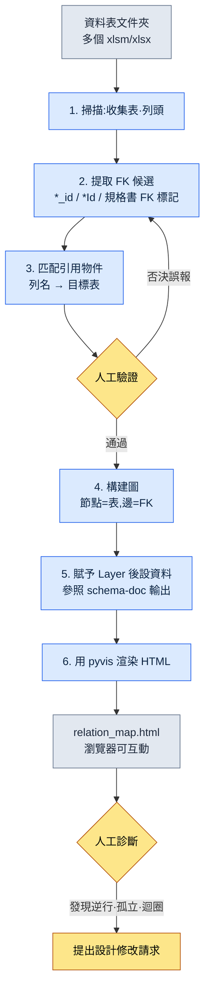

# 3.3 關係圖視覺化 —— 用眼睛看清依賴關係

一位新來的策劃入職第一週走到我的座位前。"我想改一下任務獎勵表,可這東西一動,會把哪裡弄崩呢?"我正要指著顯示器作答,卻停了下來。我腦子裡有一幅圖。`RewardTable` 咬著 `ItemTable`,`ItemTable` 咬著 `ItemEffectTable`,在它們之上 `QuestTable` 又引用著獎勵……可一旦把那幅圖用話說出口,聽者腦中的形體就崩塌了。我在白板上畫了七個方框。箭頭開始纏成一團。30 分鐘後,他點點頭回到了座位,第二天又帶著同一個問題回來了。

正是這一幕讓我寫下了這一章。系統策劃的腦子裡有一張依賴關係圖。問題在於,它只存在於腦子裡。人一換,圖也就消失了。我需要一件把這幅圖外化出來的工具,於是做出了 `gen_relation_map.py`。

資料表只有 5\~10 張時,靠腦子就夠了。一旦超過 30 張,人的工作記憶就應付不來了。一個專案的表格資料夾,通常很早就越過了那條線。把哪裡依賴哪裡用文字寫成的表,即便讀了也畫不出圖來。這一章會從頭到尾跟著走一遍:把外部索引鍵關係自動生成為可互動的 HTML 關係圖的完整操作過程(worked transcript,完整保留的真實操作過程記錄)。

---

## 3.3.1 關係圖能解決的四個問題

在做工具之前,先理清沒有關係圖時實際上會卡在哪裡。有四個場景反覆出現。

**新策劃入職引導。** 新策劃為了熟悉系統結構而約了會。就是上面那一幕。用話傳達的依賴關係,在聽者腦中撐不了幾天。如果一起點開一張關係圖,第一次會議就能畫出一半以上。它與白板上的手繪圖有一個決定性的不同:圖不會被擦掉,而是留在原處。

**變更影響範圍討論。** 系統變更請求提了上來。"這個會影響到哪裡?"約了會,討論了半天,還是漏掉了一兩個區域。如果有關係圖,只要點選要變更的節點、沿著入邊(inbound edge)追下去,影響範圍就一目瞭然。討論只需確定"這個影響是不是真的成立"以及優先順序即可。

**檢出依賴逆行。** L3 資料表引用 L1 系統文件是正常的。反方向(上層 Layer 直接引用下層資料表)則幾乎總是設計缺陷。在用文字羅列的 FK 清單裡,人是抓不住這種逆行的。在圖裡,它會立刻以一根 Layer 顏色錯亂的箭頭顯現出來。

**發現孤立的表。** 偶爾會發現一張哪裡都沒有引用的表。要麼是舊策劃留下的殘跡,要麼是決定廢棄卻只剩檔案沒刪的情況。這就像辦公室角落裡滾著一個沒貼標籤的箱子。要有圖,才能發現那座孤島。

這四個問題的共同點是:都屬於"必須用眼睛看清結構才能解決"的範疇。靠文字和表格是行不通的。

---

## 3.3.2 實操記錄:從資料表到關係圖

現在真正跟著走一遍。輸入是一個裝著資料表的資料夾,輸出是在瀏覽器中開啟的一張可互動 HTML。我會把這中間 AI 做了什麼、人在哪裡做了驗證/否決,毫無遺漏地記下來。

### 3.3.2.1 整體流程



核心是第 3 步和第 5 步之間的人工驗證迴路。FK 候選提取由機器鋪好初稿,人在其中剔除誤報。一旦省掉這個迴路,關係圖看上去煞有介事,卻是一幅錯的圖。

### 3.3.2.2 FK 從哪裡來 —— 輸入順序

這件工具的準確度,取決於你從哪裡把輸入拉過來。3.2 中定下的 schema-first 原則原樣適用。FK 資訊的正本順序如下。

1. **`$스키마` 표** —— 每張資料表的第一份正本。按列明確標註了型別、Enum、FK 目標。這裡若寫明瞭 FK,那它就是第一優先。
2. **`*.proto` / Enum 定義** —— 由 VBA(Excel 巨集語言)Export 匯出的 schema。當規格書為空時,用它補全型別。
3. **實際 `csv` 輸出** —— 表格匯出的實際資料。規格書裡沒有的關係,也會在資料中以模式顯現(例如:若 `npc_id` 列的值全部落在 `NPCTable` 的鍵範圍之內,那它實際上就是 FK)。

這裡要明確一條原則。**正本不是 schema 文件,而是實際的 JSON/csv 輸出。** 即便規格書裡寫著 `reward_id` 是 FK,只要實際資料中該列為空或指向了無關的值,那就是規格書錯了。工具在兩者不一致時信任資料這一側,並把不一致本身記進報告。這就是不把 schema-doc 當正本的理由。

### 3.3.2.3 第 1 步 —— 資料夾掃描與 FK 候選提取

工具的第一個動作,是開啟資料夾內所有 xlsm/xlsx,收集表與列頭。這一步本身是機械的,沒什麼意思。有意思的是提取 FK 候選的規則。一開始很簡單:列名若以 `*_id` 或 `*Id` 結尾,就視為 FK 候選。可單憑這一條規則,誤報和漏報都出現了。

這裡我接入了 AI。把整份列頭清單丟過去,讓它推斷 FK 目標表。下面是我實際丟擲的提示詞全文與原始輸出。

> **提示詞:**
> 下面是若干遊戲資料表的表名與列頭清單。請推斷每一列是否為外部索引鍵(FK),若為 FK,則它引用了哪張表的哪一列。列名規則通常為 `<目標表單數形式>_id`。但若沒有把握,請標為"不確定"並寫明理由。不要憑猜測填充。
>
> ```
> QuestTable: quest_id, title, npc_id, reward_id, prev_quest_id, region_id
> NPCTable: npc_id, name, region_id, faction_id
> RewardTable: reward_id, item_id, count, currency_id
> ItemTable: item_id, name, item_effect_id, grade
> ItemEffectTable: item_effect_id, effect_type, value
> RegionTable: region_id, name, parent_region_id
> ```

> **Claude 原始輸出(PK 行省略,僅摘錄 FK 判斷):**
>
> **QuestTable**
> - `npc_id` → NPCTable.npc_id(推測為釋出任務的 NPC)
> - `reward_id` → RewardTable.reward_id
> - `prev_quest_id` → QuestTable.quest_id(前置任務,**自引用**)
> - `region_id` → RegionTable.region_id
>
> **NPCTable**
> - `region_id` → RegionTable.region_id
> - `faction_id` → **不確定**:輸入清單中沒有 FactionTable。按列名規則看,應引用 FactionTable.faction_id,但由於未提供該表,無法確定目標。
>
> **RewardTable**
> - `item_id` → ItemTable.item_id
> - `currency_id` → **不確定**:清單中沒有 CurrencyTable。貨幣種類也有可能以 Enum 管理,因此可能並非 FK。需要核對規格書。
>
> **ItemTable**
> - `item_effect_id` → ItemEffectTable.item_effect_id
> - `grade` → 非 FK(推測為 Enum:等級值)
>
> **ItemEffectTable**
> - `effect_type` → 非 FK(推測為 Enum)
>
> **RegionTable**
> - `parent_region_id` → RegionTable.region_id(**自引用**,地區層級結構)
>
> 注意:以上推斷基於列名規則,並未核對實際資料值。特別是 `count`、`value` 這類不以 `_id` 結尾的列,我已從 FK 檢查範圍中排除;若存在隱藏引用,則會被漏掉。

在這份輸出上,人做的事有三件。

- **否決 1:** `faction_id` →AI 因為沒有 FactionTable 而做了不確定處理。這是對的。不過實際上 `faction_id` 是 Enum。陣營固定為 6 種,所以不另建表,直接用 Enum 管理。多虧 AI 沒有捏造一張不存在的表、而是停住了判斷,人才能照著規格書把它確定為 Enum。**從 FK 中排除。**
- **否決 2:** `currency_id` →AI 把兩種可能性都留著。一看實際資料,`CurrencyTable` 是存在的(是我在輸入清單裡漏掉了)。**確定為 FK。** 這怪不得 AI,是人的輸入遺漏。
- **採納:** `prev_quest_id` 與 `parent_region_id` 的自引用檢出。這一點若是單純的正則規則,本會漏掉。AI 還附上了"前置任務""地區層級"這樣的語義,讓驗證更快了。

這裡得到的教訓很明確。AI 最有用的地方,不是快速推斷,而是**把不知道的位置留作"不確定"的那份剋制**。要是它硬把空格填滿,`faction_id` 就會被連到無關的表上,而那個誤報會作為一根假箭頭留在關係圖裡,把新策劃引向歧途。

### 3.3.2.4 第 2 步 —— 構建圖與賦予 Layer

得到經過驗證的 FK 清單後,`gen_relation_map.py` 就來構建圖。表是節點,FK 是有向邊。數它的入邊數(有多少張別的表引用了我),據此決定節點大小。被引用得越多,節點越大,也就是系統的樞紐。

Layer 後設資料從 `schema-doc` 技能生成的 Markdown schema 文件里拉取。3.1 中定義的 Layer 座標(L0\~L4)以標籤的形式附在每張表上,工具讀取它來給節點上色。這個銜接很重要。關係圖若不知道 Layer,就只是一堆方框和箭頭;只有知道 Layer,才能用顏色來診斷"逆行"。

把工具內部結構以程式碼骨架的形式呈現,大致如下(僅摘錄核心流程)。

```python
# gen_relation_map.py (僅摘錄核心流程)
from pyvis.network import Network

LAYER_COLORS = {          # Layer 調色盤 —— 用 1 個 atom 標準化
    "L0": "#2c3e50",      # 元/公用
    "L1": "#2980b9",      # 系統
    "L2": "#27ae60",      # 內容
    "L3": "#f39c12",      # 資料例項
    "L4": "#c0392b",      # 派生/快取
}

def build_graph(fk_list, layer_map):
    net = Network(directed=True, height="900px")
    inbound = count_inbound(fk_list)          # 入邊統計
    for sheet in all_sheets(fk_list):
        layer = layer_map.get(sheet, "L0")
        size = 10 + inbound[sheet] * 3        # 越是樞紐節點越大
        net.add_node(sheet, color=LAYER_COLORS[layer],
                     size=size, title=sheet_tooltip(sheet))
    for src, dst, col in fk_list:
        # Layer 逆行檢測:上層 Layer 引用下層時用警示色
        edge_color = "#e74c3c" if is_reverse(src, dst, layer_map) else "#888"
        net.add_edge(src, dst, title=col, color=edge_color)
    return net
```

`is_reverse` 是這件工具的小核心。若一條邊的出發表比到達表處於更上層(例如 L1 → L3),就判為逆行並把邊塗成紅色。當人開啟圖、看到紅色箭頭時,那幾乎總是該動手處理的地方。

### 3.3.2.5 第 3 步 —— HTML 渲染與結果結構

最後一步是 pyvis 吐出可互動 HTML。點選節點時,該表的列、Layer、入邊數會以工具提示(tooltip)彈出,還能在搜尋框裡按表名過濾。之所以必須是 HTML 而非靜態 PNG,原因就在這裡 —— 一旦節點數超過幾十個,靜態圖裡箭頭就會纏成一團,什麼都看不見。要用滑鼠拖開鋪展,再點選把關注區域收窄,才抓得住模式。

把用上述示例資料生成的關係圖結構轉成 SVG,大致如下。顏色代表 Layer,紅色箭頭表示(本例中沒有)逆行的位置。

<svg viewBox="0 0 720 360" xmlns="http://www.w3.org/2000/svg" font-family="sans-serif" font-size="13">
  <defs>
    <marker id="arrow" markerWidth="10" markerHeight="10" refX="9" refY="3" orient="auto" markerUnits="strokeWidth">
      <path d="M0,0 L9,3 L0,6 Z" fill="#888"/>
    </marker>
  </defs>
  <!-- nodes -->
  <rect x="40" y="30" width="130" height="40" rx="6" fill="#2980b9"/>
  <text x="105" y="55" fill="#fff" text-anchor="middle">RegionTable (L1)</text>
  <rect x="300" y="30" width="130" height="40" rx="6" fill="#27ae60"/>
  <text x="365" y="55" fill="#fff" text-anchor="middle">QuestTable (L2)</text>
  <rect x="560" y="30" width="130" height="40" rx="6" fill="#27ae60"/>
  <text x="625" y="55" fill="#fff" text-anchor="middle">NPCTable (L2)</text>
  <rect x="300" y="150" width="130" height="40" rx="6" fill="#f39c12"/>
  <text x="365" y="175" fill="#fff" text-anchor="middle">RewardTable (L3)</text>
  <rect x="560" y="150" width="130" height="40" rx="6" fill="#f39c12"/>
  <text x="625" y="175" fill="#fff" text-anchor="middle">ItemTable (L3)</text>
  <rect x="560" y="270" width="150" height="40" rx="6" fill="#f39c12"/>
  <text x="635" y="295" fill="#fff" text-anchor="middle">ItemEffectTable (L3)</text>
  <!-- edges -->
  <line x1="300" y1="50" x2="172" y2="50" stroke="#888" stroke-width="2" marker-end="url(#arrow)"/>
  <line x1="560" y1="50" x2="432" y2="50" stroke="#888" stroke-width="2" marker-end="url(#arrow)"/>
  <line x1="625" y1="70" x2="380" y2="150" stroke="#888" stroke-width="2" marker-end="url(#arrow)"/>
  <line x1="365" y1="70" x2="365" y2="150" stroke="#888" stroke-width="2" marker-end="url(#arrow)"/>
  <line x1="560" y1="170" x2="432" y2="170" stroke="#888" stroke-width="2" marker-end="url(#arrow)"/>
  <line x1="625" y1="190" x2="625" y2="270" stroke="#888" stroke-width="2" marker-end="url(#arrow)"/>
  <!-- self-ref -->
  <path d="M170,40 q40,-30 0,-10" fill="none" stroke="#888" stroke-width="2" marker-end="url(#arrow)"/>
  <text x="200" y="20" fill="#666" font-size="11">parent_region_id (自引用)</text>
</svg>

看節點大小就知道,`RegionTable` 被引用得最多(Quest·NPC 都指向它)。這就是樞紐。`ItemEffectTable` 是葉子節點,所以小。新策劃問"要理解這個系統該從哪兒看起",答案已按節點大小的順序寫在圖裡了。

---

## 3.3.3 圖造就的診斷 —— 與 Layer 結合

3.1 中定義了 Layer 座標。當這一章的關係圖把那套座標提升到視覺層面時,用文字或表格無法實現的四種診斷,就能在同一屏內完成。

- **Layer 逆行** —— Layer 顏色逆向流動的箭頭(紅色)。這是資料表反過來影響系統設計的不自然結構。
- **孤立節點** —— 與任何邊都不相連的孤島。是廢棄的候選。
- **樞紐過載** —— 入邊異常多的巨大節點。這是一張表背負了過多責任的訊號,應考慮拆分。
- **迴圈依賴** —— 箭頭繞成一圈的地方。幾乎總是設計缺陷,並會牽連出資料載入順序問題。

不過這並不意味著圖能抓住所有問題。圖抓的是**結構性缺陷**。這個 FK 在語義上是否真的是對的關係(例如 `npc_id` 究竟是"釋出任務的 NPC"還是"任務中出現的 NPC"),圖是解不開的。那是人的領域判斷之責。工具只不過是為人的判斷鋪好施展的舞臺。

---

## 3.3.4 沒有自動更新就會腐爛

關係圖不是做一次就完事的。表每週都在新增、變更。交給手動更新的關係圖,一兩個月就會與實際結構錯位,而錯位的地圖會指錯路,那還不如沒有。被一張錯圖坑過的團隊成員,從此就不再看圖了 —— 這是最昂貴的失敗。

所以,把更新掛到自動觸發上。

- **Git pre-push hook** —— 在推送資料表之前重新生成關係圖。始終保證最新狀態。
- **變更請求時點** —— 資料表變更請求一提上來,就把變更前後的關係圖做成 diff 比較,附在評論裡。新增的邊為綠色,消失的邊為紅色。評審者用圖看清影響範圍。
- **夜間批處理** —— 每天晚上生成新的關係圖,並留下與前一天的 diff。
- **手動命令** —— 用 `/relation-map` 斜槓命令即時生成。會議中臨時要展示時用。

生成的 HTML 會自動部署到內部靜態託管(策劃門戶)上。無需另裝工具,只要有瀏覽器,人人都能看到同一張地圖。這就像桌邊總是攤開著的那張地圖。無論誰來問,都指著同一幅圖一起作答。

---

## 3.3.5 常見錯誤與規避法

| 錯誤 | 為何發生 | 規避法 |
|---|---|---|
| 節點超過 100 個、圖纏成一團 | 把所有領域硬塞進一屏 | 按領域過濾、按分組拆分檢視 |
| Layer 顏色每件工具都不同 | 調色盤在每段程式碼裡重新定義 | 用 1 個 atom 把調色盤標準化(`LAYER_COLORS`) |
| FK 檢出只抓 `*_id`,導致漏報·誤報 | 依賴一行正則 | 規格書 FK 標註 + 實際資料值驗證並行 |
| 圖是做了,可沒人看 | 沒接入工作流 | 強制在變更請求·會議中附上圖 |
| 做了卻不更新而腐爛 | 依賴手動更新 | 必須自動觸發,手動一個月就失效 |

在 `gen_relation_map.py` 的運營裡,最常被坑的是第三行。只信 `*_id` 規則,就會漏掉 `count` 或 `value` 這類隱藏引用(3.3.2.3 中的 AI 也自行警示了這一侷限),並把 Enum 的 `grade` 誤判為 FK。規格書和實際資料兩者都看的驗證迴路,才是這一行的答案。

---

## 3.3.6 先用單人精簡版試一試

想一口氣處理整個公司的資料表,既沉重,又會在展示出價值之前就把人累垮。從自己分管的一個資料夾起步,小規模開始。

### 動手試試

**setup.**
1. 選一個裝著你自己負責的 5\~10 張資料表的資料夾。
2. 用 `pip install pyvis openpyxl` 裝好依賴(讀 Excel 用 `excel-reader` 技能或 openpyxl)。
3. 先確認各表的 `$스키마` 表裡是否標註了 FK。沒有的話,就只收集列頭。

**prompt.** 把列頭清單彙總起來,原樣丟擲 3.3.2.3 的提示詞。關鍵在最後一行 —— "若沒有把握就標為不確定,不要憑猜測填充"。這句話擋住了假箭頭。

**verify.**
1. 把 AI 丟擲的 FK 候選一行一行地看。對標為"不確定"的行,用規格書/實際資料來確定。
2. 疑似 Enum 的列(像 `grade`、`effect_type` 這種沒有 `_id` 卻看著像 FK 的)要從 FK 中剔除。
3. 確認自引用(`prev_*_id`、`parent_*_id`)是否抓對了。
4. 用驗證過的清單畫圖,在瀏覽器中開啟,用眼睛找出紅色箭頭(逆行)和孤島(孤立)。

### 單人精簡版

如果沒時間做工具,第一週用一張手繪的 mermaid 起步也行。把 5 張表的 FK 按 3.3.2.3 的格式直接寫進 mermaid。帶著這一張去開會,展示"這就是我們系統的依賴關係",價值就在那一刻當場得到證明。價值一旦顯現,自動化工具自然會隨後跟上。"必須一開始就拿出能跑的工具"這份負擔,你大可放下。

擴充套件會按這個順序自然流動 —— 第 1 周自己表格的 mermaid 手繪圖 → 第 2 周加上 Layer 顏色和點選 → 1 個月自動更新(git hook 或夜間批處理)→ 3 個月部署到內部門戶 → 6 個月全部表格的整合關係圖。

---

## 3.3.7 與下一章的銜接

3.2 講了表的內側(schema),3.3 講了表的外側(關係)。3.4 會在這之上疊加 AI 輔助提示詞模式。在 schema 與關係都已就位的系統之上,AI 如何輔助一致性檢查與影響範圍提取,接下來會以一系列實用模式展開。

---

### 本章要點
- 把腦中的依賴關係圖外化出來,即便人換了,同一幅圖也會留在原處。
- FK 提取的準確度,來自人在 AI 鋪好的初稿上剔除誤報的驗證迴路。
- 沒有自動更新的關係圖,一兩個月就會腐爛、失去信任。

### 下一章預告
- 3.4. AI 輔助系統設計提示詞模式
