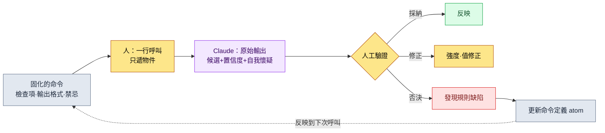
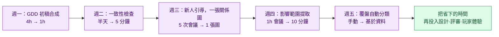

# 3.4 AI 輔助系統設計的提示詞模式

那是 Alpha 版本即將到來的一週。我在技能表裡新增了一個職業的一行並儲存。可那一行所引用的 buff ID，其實是前一天有人刪掉的那一行——這一點我直到第二天早上構建崩了之後才發現。為了順著崩掉的構建回溯找出原因，花了我兩個小時。要是在刪掉那一行之前能先問一句"這個刪了沒關係嗎？"，這兩個小時本可以不必花。

本章講的就是如何讓 AI 替你問出那個問題。重點不在於把提示詞寫得多漂亮，而在於把同一個問題固化下來，不必每次都從 0 重寫一遍。在 3.2 裡鋪好了模式（schema），在 3.3 裡鋪好了關係圖。兩者都是資料的骨架。本章要在這副骨架之上，把人拋給 AI 的問題本身固化為資產。

先釘死一點。AI 造出來的不是答案，而是候選。本章出現的所有模式裡，最終拍板的那隻手始終留在人這一側。

---

## 3.4.1 即興提示詞漏在兩處

剛開始用 AI 時，每次都用自然語言即興敲。大致是這樣：

```
幫我看下技能表。確認有沒有外部索引鍵斷掉的，
有奇怪的就告訴我。哦對，還有冷卻時間為負的。
```

這條提示詞在兩處漏掉東西。

第一，檢查項每次都不一樣。今天想起了"冷卻時間為負"，明天就忘了。昨天篩過一次的"重複 PK（Primary Key，主鍵）"，今天的提示詞裡沒了。依賴人記憶的檢查，會隨人的狀態而漏。

第二，結果格式每次都不一樣。同一個意圖，寫成"幫我確認""檢查下""掃一遍"這些不同說法，AI 有些天用表格回，有些天用大段文字回。格式參差不齊，結果就沒法再拿去自動處理。

解法是把提示詞從手上拿下來，放進抽屜。把每次手寫的便條，換成貼了標籤的卡片，從同一個抽屜裡取。那張卡片就是本書所說的斜槓命令（skill）和 atom。

---

## 3.4.2 固化的三種形態與取捨標準

固化有三種容器。把什麼裝進哪一個，取決於呼叫頻率與穩定性。

<svg viewBox="0 0 720 300" xmlns="http://www.w3.org/2000/svg" font-family="sans-serif" font-size="13">
  <rect x="0" y="0" width="720" height="300" fill="#fbfbfd"/>
  <line x1="120" y1="40" x2="120" y2="280" stroke="#bbb" stroke-width="1"/>
  <line x1="120" y1="160" x2="700" y2="160" stroke="#bbb" stroke-width="1"/>
  <text x="60" y="35" text-anchor="middle" font-weight="bold">呼叫頻率</text>
  <text x="60" y="55" text-anchor="middle" fill="#888" font-size="11">高 ↑</text>
  <text x="60" y="270" text-anchor="middle" fill="#888" font-size="11">低 ↓</text>
  <text x="410" y="298" text-anchor="middle" font-weight="bold">定義穩定性 →</text>

  <rect x="150" y="70" width="200" height="70" rx="8" fill="#e8f0fe" stroke="#4285f4"/>
  <text x="250" y="98" text-anchor="middle" font-weight="bold">斜槓命令（skill）</text>
  <text x="250" y="118" text-anchor="middle" font-size="11" fill="#555">高頻·穩定 → /check-sheet</text>
  <text x="250" y="133" text-anchor="middle" font-size="11" fill="#555">一詞呼叫，結果格式固定</text>

  <rect x="400" y="70" width="270" height="70" rx="8" fill="#fef7e0" stroke="#f9ab00"/>
  <text x="535" y="98" text-anchor="middle" font-weight="bold">atom 自動注入（JIT）</text>
  <text x="535" y="118" text-anchor="middle" font-size="11" fill="#555">高頻·核心約束 → 關鍵詞觸發</text>
  <text x="535" y="133" text-anchor="middle" font-size="11" fill="#555">無需記憶，嵌入自然語言中</text>

  <rect x="150" y="190" width="200" height="70" rx="8" fill="#e6f4ea" stroke="#34a853"/>
  <text x="250" y="218" text-anchor="middle" font-weight="bold">模板檔案（.md）</text>
  <text x="250" y="238" text-anchor="middle" font-size="11" fill="#555">偶爾·大型作業 → 呼叫檔案</text>
  <text x="250" y="253" text-anchor="middle" font-size="11" fill="#555">用眼看、易於修改</text>

  <rect x="400" y="190" width="270" height="70" rx="8" fill="#f1f3f4" stroke="#9aa0a6"/>
  <text x="535" y="225" text-anchor="middle" font-size="12" fill="#777">偶爾·定義不穩定 →</text>
  <text x="535" y="243" text-anchor="middle" font-size="12" fill="#777">先別固化（保持即興）</text>
</svg>

高頻且定義已定型的作業用斜槓命令。高頻但"不能忘的約束"用 atom JIT 自動注入。偶爾做但分量大的作業用模板檔案。而定義仍在搖擺的作業，先不固化，留作即興。三者不必一開始就備齊。從一兩個斜槓命令起步，看到價值再增加。

---

## 3.4.3 模式 ① 一致性檢查 —— 實操記錄（worked transcript）

與其用嘴解釋，不如把一個模式從頭到尾走一遍。這是一個在刪掉一個空行之前，自動先問一句"這個刪了沒關係嗎？"的模式。它的名字叫 `/check-sheet`。裡面固化著檢查項與輸出格式。

作為依據的資產，藏在本書各處嵌入的實測作業記錄裡。資料錄入遵循 schema-first 原則（atom `data_entry_schema_first`）。錄入順序是 `$스키마` 表 → `Enum/*.proto`（VBA（Excel 巨集語言）Export）→ csv。而正本不是模式文件，而是實際的 JSON 輸出（atom `json_over_schema_doc_as_source_of_truth`）。一致性檢查就是把這兩條原則原樣搬成檢查規則。

### setup —— 固化命令的內部

展開 `/check-sheet`，裡面裝著這樣一段提示詞正文。這就是不必每次手敲的那部分。

```
角色：你是遊戲資料表的一致性檢查器。

要檢查的表：{{sheet_name}}
可參考的模式：$스키마 表（各列的型別·範圍·FK 物件）
可參考的正本：同一張表的 export JSON（優先於模式文件）

檢查項（按此順序）：
1. 外部索引鍵有效性 —— FK 列的值是否實際存在於被引用的表中
2. 範圍越界 —— 超出 $스키마 中定義的 min/max 的值
3. 必填列缺失 —— required=true 的列為空的行
4. 重複 PK —— 同一 PK 出現兩次以上

輸出格式（務必照此表）：
| # | 行 | 列 | 違規型別 | 當前值 | 修正候選 | 置信度 |

規則：
- 修正候選只提建議。絕不直接改表。
- 置信度為高/中/低三者之一。若屬猜測則為低。
- 沒有違規時，只輸出"違規 0 件"並結束。
```

這段正文裡要緊的是最後三行規則。"不直接改"、"標註置信度"、"猜測要坦白為低"。這三行把 AI 拴在推候選的位子上，而不是給答案的位子上。

### prompt —— 人實際敲的一行

```
/check-sheet skill_table
```

結束了。只遞一個表名。四個檢查項也好、輸出表格式也好，都不再重寫。這就是固化的價值。

### Claude 的原始輸出

下面是實際跑了一次後返回的輸出。不做摘要，把含糊之處與 AI 猶豫的地方都原樣附上。

```
skill_table 一致性檢查結果如下。共發現 4 件違規。

| # | 行  | 列          | 違規型別     | 當前值 | 修正候選                | 置信度 |
|---|-----|------------|------------|--------|----------------------|------|
| 1 | 142 | buff_id    | 外部索引鍵違規     | 9007   | 9070（疑似筆誤，差 1 位） | 中   |
| 2 | 142 | buff_id    | 外部索引鍵違規     | 9007   | 9012（名稱"猛毒"相近）   | 低   |
| 3 | 88  | cooldown   | 範圍越界     | -1     | 0（不可為負）           | 高   |
| 4 | 215 | combo_next | 必填缺失     | （空白） | 暫不判斷               | 低   |

補充幾點注意事項。

- 第 1 條與第 2 條是針對同一行（142）同一列的兩個不同候選。
  9007 這個 ID 在 buff 表中並不存在。9070 與之只差一位數字，
  有可能是筆誤；9012 的名稱"猛毒"相近，因此也列為候選。
  兩者置信度都低。需要由人來選。

- 第 4 條（215 行 combo_next 空白）很含糊。$스키마 中標為 required=true，
  但檢視 export JSON 後發現，此列為空的行還有 12 個。
  可能是說明書未更新，也可能存在"連招收招技能的 combo_next 留空"這條
  規則，只是說明書未予反映。我無法斷定，
  因此置為"暫不判斷"。

- 若想在 cooldown 之外再跑更多範圍檢查，需要確認 $스키마 其他列的
  min/max，但我所收到的資訊中 range_check 列有一部分為空，
  因此 cast_time 列未能檢查。
```

這份輸出之所以是好輸出，不在於它乾淨，而在於它誠實。它沒有把第 4 條斷定為"既然必填就填上"，而是流露出"說明書可能未更新"的自我懷疑。它也坦白了沒能看到 cast_time 這一限制。倘若 AI 自信滿滿地說第 4 條"請填 0"，那很可能是會毀掉連招收招技能的錯答。

### verify —— 人的驗證與否決

接著由人逐行裁定。驗證自動伴隨，意味著這張表會自動生成，並不意味著人不看。

- **第 3 條（cooldown -1 → 0）**：採納。置信度高，負數冷卻時間是明顯的錄入失誤。立即改正。
- **第 1·2 條（buff_id 9007）**：擱置。兩者置信度都低。決定直接開啟 buff 表，確認"猛毒"系 buff 的實際 ID。AI 的兩個候選都不採納。
- **第 4 條（combo_next 空白）**：**否決**。AI 的懷疑是對的。這個技能是連招收招技能，combo_next 留空才是正常的。不是違規。否決，而且這是說明書一側的問題。

最後第 4 條是關鍵。在原樣相信 AI 輸出就會毀掉完好資料的位置上，人的否決起了作用。同時，第 4 條也暴露了檢查規則本身的缺陷。說明書的 `required=true` 是錯的。

### 再請求 —— 否決會修正規則

到這裡並不收手。否決是讓下一次檢查更聰明的輸入。人接著敲：

```
第 4 條不是違規。combo_finisher=true 的技能，combo_next 留空
才正常。把這條例外規則加進檢查項裡，今後 finisher 行的
combo_next 空白不要再當違規抓。還有，說明書的 required 定義
看起來錯了的項，單獨拆到"說明書疑點"小節裡告訴我。
```

```
明白了。我會把例外反映進 /check-sheet 的檢查規則。

新增規則：
- 進行 combo_next 必填檢查時，先確認同一行的 combo_finisher 值。
  若 combo_finisher=true，則 combo_next 空白按正常處理（排除違規）。

新設小節：
- "說明書疑點" —— 當 export JSON 的實際分佈與 $스키마 定義相悖時，
  把需要改的物件分離為說明書（而非資料）候選並報告。
  （依據"正本為 JSON"的原則，若多數資料違背說明書，
   則懷疑說明書一側。）

要把這條變更記錄到 /check-sheet 命令定義的 atom 裡嗎？
```

最後那一行才是這個模式的完成。一次否決沒有止於一次性的修改，而是被記錄進命令定義的 atom，傳播給下一個人、下一次檢查。這就是固化的複利。同一個失誤不會被篩第二次。

---

## 3.4.4 模式 ② 變更影響範圍提取 —— 實操記錄（worked transcript）

第二個模式，是要消掉開頭那個場景裡的那兩個小時。在改一行、改一個決定之前，先問"這會波及到哪裡"。它的名字叫 `/impact`。3.3 裡做的關係圖（`gen_relation_map.py` 輸出的 FK 關係 HTML）就是這個模式的燃料。

### setup —— 固化的探查路徑

`/impact` 裡固化著"該翻查哪裡才能不遺漏地找全影響"，分四條線。

```
角色：你是變更影響範圍提取器。

變更物件：{{target}}  （表名·列·atom_id·系統決定，四者之一）

探查路徑（四條都要走）：
1. 關係圖入站 —— 在 gen_relation_map.py 輸出中，以 FK 引用
   {{target}} 的那些表（指向這張表的箭頭）
2. 正文提及 —— 在 sources/manuscript 中，{{target}} 的 ID·名稱
   直接出現的文件
3. atom affects 關係 —— 與 {{target}} 經 affects 相連的 atom
4. 反向引用 —— 以 [[wikilink]] 指向 {{target}} 的筆記

輸出格式：
| 型別 | 名稱 | 關聯依據 | 影響強度 | 負責人 |

規則：
- 影響強度為直接/間接/弱三者。直接 FK 為"直接"，正文提及為"間接"，推定為"弱"。
- 若擔心遺漏，哪怕標為弱也要列上。漏掉比列上更糟。
- 不做優先順序或工作指派。只生成清單。
```

### prompt

```
/impact buff_id=9012
```

用一行問出"想把猛毒 buff（9012）換成別的效果，哪裡會動搖？"。

### Claude 的原始輸出

```
buff_id=9012（猛毒）的變更影響範圍如下。已探查全部 4 條路徑。

| 型別    | 名稱                | 關聯依據              | 影響強度 | 負責人    |
|--------|--------------------|----------------------|---------|----------|
| 表      | skill_table         | buff_id FK 直接引用    | 直接     | teammate_a |
| 表      | monster_drop        | reward_buff FK 引用    | 直接     | teammate_b |
| 表      | set_item_effect     | proc_buff FK 引用      | 直接     | teammate_a |
| 文件    | 독계열_밸런스_노트.md  | 正文直接提及"9012"     | 間接     | （作者）   |
| atom    | poison_stack_rule   | affects: 9012          | 間接     | （作者）   |
| 筆記    | 상태이상_설계.md       | [[맹독]] 反向引用       | 弱       | （作者）   |

補充幾點。

- skill_table 中引用 9012 的行有 3 個（刺客職業技能）。
  替換後這 3 個技能的實際效果會變。這是最強的影響。

- monster_drop 的 reward_buff，我把握得稍弱。列名雖是
  reward_buff，但部分行裡似乎混進了指向 item 而非 buff 的
  值。建議這張表你直接開啟確認一次。

- "독계열_밸런스_노트.md"只是以文本提及 9012，並非 FK，
  因此置為間接。不過它是寫有平衡意圖的文件，實際影響可能
  很強。請留意：強度（間接）與重要度可能並不一致。

- set_item_effect 中有 4 種套裝道具以 proc_buff 使用 9012。
  抽掉猛毒，這些套裝的概念就會變。
```

### verify —— 人的驗證與否決

- **skill_table（直接，隊員 A）**：確認。刺客的 3 個技能直接受影響。需要共享給隊員 A。採納。
- **monster_drop（直接）**：AI 自己存疑的項。直接開啟表確認。結果：reward_buff 列裡確實混進了 item ID，而引用 9012 的行實際只有 1 個。AI 的"把握較弱"坦白是準確的。把強度由直接**下調修正**為間接。
- **set_item_effect（直接，隊員 A）**：確認。4 種套裝受影響。採納。
- **상태이상_설계.md（弱）**：單純的反向引用，正文無影響。清單裡保留，但排除出作業物件。

這裡 AI 的誠實同樣幫了驗證。要是把 monster_drop 斷定為直接，就會誇大影響、約出一場不必要的協調會。多虧 AI 說"建議你確認一下"、把球交回給人，強度才得以糾正。

### 再請求 —— 從提取到共享

清單一經驗證，下一步的手就是把它傳達給人。

```
按直接受影響的負責人分組，給 teammate_a / teammate_b 各擬一份
要發的簡短共享備忘草稿。格式為"正在考慮把 9012 猛毒換成 X，
你的表裡有 N 行受影響"。決定還沒定，所以用徵求意見的語氣、
而非通知的語氣。
```

```
按負責人分的共享備忘草稿如下。用的是徵求意見而非通知的語氣。

[致 teammate_a]
正在考慮把猛毒 buff（9012）換成別的效果的方案。尚未確定，
想先聽聽意見。影響範圍：
- skill_table：刺客技能有 3 行引用 9012（直接影響）
- set_item_effect：4 種套裝道具以 proc_buff 使用 9012
替換後這些技能·套裝的概念會變。若有反對或補充意見，請在
本週內告知。

[致 teammate_b]
想請你確認 monster_drop 的 reward_buff。正在考慮替換猛毒
buff（9012），看上去受影響的行只有 1 個（reward_buff 列裡
混進了 item ID，最初看上去更多）。能否幫我確認實際只有這 1 行
是對的嗎？

兩份備忘都置為"正在考慮·徵求意見"，未放入確定通知的措辭。
傳送前，你需要先填上替換候選效果（X 處）。
```

開頭那兩個小時在這裡消失了。在變更之前先問影響、提前共享給負責人，於是在第二天構建崩掉之前，協調就已結束。而 AI 造出來的始終只是備忘草稿，按下發送的手指是人的。

---

## 3.4.5 兩個模式共有的骨架

上面兩份記錄遵循同一副骨架。其餘所有模式也都搭在這副骨架上。



關鍵是右下角的虛線。否決不是終點，而是作為修正命令本身的輸入折返回來。一致性檢查裡被否決的第 4 條成了 finisher 例外規則，那條規則被記錄進 atom，傳播給下一次檢查。沒有這個反饋，同一個錯答每週都會被重新篩一遍。

三處留著人的手。呼叫（選物件）、驗證（採納·修正·否決）、規則改進（否決的迴流）。AI 只在這之間做推候選的活兒。

---

## 3.4.6 其餘模式 —— 同一骨架的變奏

把同一副骨架搬到別的作業上，模式就會增多。不附記錄，只點位置。它們都原樣遵循 3.4.5 的骨架，因此製作時關鍵在於不漏掉"固化的檢查項"與"人工驗證位"。

| 模式 | 一行呼叫 | AI 推的候選 | 人握的決定 |
|---|---|---|---|
| GDD 初稿合成 | `/gdd-new <系統>` | 標準 9 小節初稿，未定處標 [TBD] | 願景·優先順序·刪減 |
| 狀態機/BT 轉換 | `/diagram-state` | 自然語言 → mermaid + 可達性驗證 | 狀態定義·轉移條件 |
| 介面衝突檢查 | `/check-interface <GDD>` | 輸入輸出·時間視窗衝突用例 | 優先順序規則 |
| 數值計算 | `/balance-calc <表> <公式atom>` | 曲線計算值 + 與現有的 diff | 公式·遊戲意圖 |
| 覆盤作業分類 | `/retro-classify <週期>` | Layer×領域分佈 + 異常訊號 | 分類校正·解讀 |

數值計算裡只釘死一點。曲線在數值上即便平滑地下落，那份平滑是否契合遊戲的意圖，是另一回事。本想把 Boss 前的區段故意留得陡峭，AI 卻以"離群值"為由把它削平的事是有的。所以數值計算即便自動附帶了曲線驗證，最後一行也要在人將其與意圖對照之後才閉合。

---

## 3.4.7 運營的五項原則與收斂點

模式一多，就需要運營紀律。下面五項原則不是要背的規則，而是要嵌進工具本身的設計原則。

| 原則 | 為什麼 |
|---|---|
| 一命令 = 一作業 | 越小越易於複用·除錯。不把檢查·修改·共享都塞進 `/check` |
| 命令自動伴隨驗證 | 在輸出表本身加上置信度·依據列，減輕人工驗證的負擔 |
| 命令定義化為 atom | 像 3.4.3 的否決→規則迴流那樣，把緣由·示例·變更歷史留在 atom 裡 |
| 度量使用頻率 | 月呼叫不足 1 次的命令是淘汰候選。用資料來砍 |
| 人的手只在決定上 | 命令只到生成候選為止。禁止自動決定 |

最後一個收斂點。在作者運營過的某個 MMORPG 專案裡，能在系統策劃中穩定留存的斜槓命令，隨時間推移收斂到 12 個上下。這不是公開標準，而是一個專案的觀察值（作者經驗，未經驗證）。但方向是明確的。命令不是無限地增，而是每月加減 1～2 個，停在腦子裡裝得下的數目上。貼了 100 個標籤的抽屜，和沒貼標籤的抽屜一樣。

引入不必一次到位。第一個月，把每週重複的一件作業固化為斜槓命令就夠了。那一件顯出價值，下個月自然就蔓延到兩件、三件。

---

## 3.4.8 Part 3 收尾

在 3.1 鋪好系統策劃的 Layer 座標，在 3.2 鋪好模式，在 3.3 鋪好關係圖，再在 3.4 於其上疊加 AI 輔助提示詞。走過四章的系統策劃，一週會這樣改變。



雜活時間減少，那些時間又回到深入的設計與對玩家體驗的思考上。不把省下的時間重新填滿雜活——這才是引入工具的真正理由。

下一個 Part 4 是戰鬥策劃。它是系統策劃最近的兄弟，3.1～3.4 的工具與模式可原樣過渡過去。

---

## 本章要點

- 把即興提示詞固化為斜槓命令·atom·模板的迴圈，是 AI 輔助回收價值最大的地方。
- 所有模式都遵循一行呼叫 → 原始輸出 → 人工驗證·否決 → 規則迴流這同一副骨架。
- AI 推候選，而採納·修正·否決的最後一隻手始終留在人這一側。

---

## 動手試試

**setup.** 挑一件每週重複的檢查作業（例如表的一致性）。把該作業的 4 個檢查項與輸出表格式寫下來，固化為一個斜槓命令。務必把三行規則（"不直接改 / 標註置信度 / 猜測要坦白"）放進命令正文。

**prompt.** 只把物件用一行遞過去來呼叫。

```
/check-sheet skill_table
```

**verify.** 把返回的表逐行以採納·修正·否決裁定。一旦出現否決，那不是運氣，而是規則的缺陷。把那條例外追加進命令定義的那一行再發一次，讓下一次呼叫不會把同一個失誤篩第二次。

### 單人精簡版

如果既沒有團隊也沒有 atom 系統，就用備忘錄應用裡的一個文本塊代替斜槓命令。標題寫"表檢查提示詞"。內容是上面 setup 的 4 個檢查項 + 3 行規則。每次檢查時複製這個文本塊，只改表名再粘給 AI。一旦碰上要否決的事，就在那個備忘塊裡直接加一行例外。工具無論是斜槓命令還是一張備忘，迴圈（固化 → 呼叫 → 驗證·否決 → 規則更新）都照樣轉。
