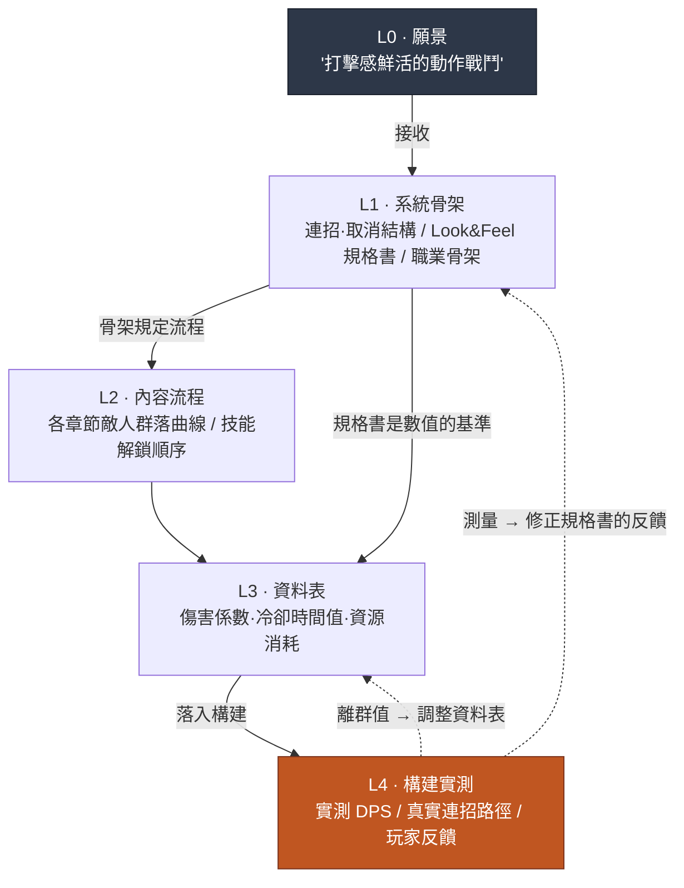

# 4.1 戰鬥策劃與 Layer —— 打擊感落在哪一格

> **本章學習目標**（難度 🟡 實務 · 前置:四則運算·表格計算):學會把"打擊感"這類抽象形容詞拆解為可測量的訊號,並用座標指定戰鬥策劃的五項產出各自落在 Layer 的哪一格。

構建評審會議室。程式設計師把剛接入的新技能投到顯示器上。角色揮劍,敵人被向後擊退。五個人在看。有人開口。

"嗯……總覺得打擊感有點弱。"

旁邊的人點頭。"對,有點平。"

程式設計師問:"該改哪裡、怎麼改呢?"

沉默。會議室裡的五個人沒有一個能用數字回答這個問題。"打擊感弱"是五個人都感受到的,但沒有人能說出"把頓幀從 3 幀改到 5 幀"。會議花了 40 分鐘來回拋"再厚重一點""衝擊力不夠"之類的形容詞,最後以"先放到下個構建裡再看吧"收場。

這一幕濃縮了戰鬥策劃的全部問題。這是玩家最直接感受到的領域,可一旦要把這種感受落成語言,剩下的就只有形容詞。形容詞無法測量,無法測量就無法調整。戰鬥策劃的第一項工作,就是把這些形容詞拉下來變成數字。

本章要定的,是這些數字落在哪一格。戰鬥策劃做的五項產出各自落在 Layer 的何處,以及這套座標為何成為自動化的前提條件。4.2、4.3、4.4 的實戰工具都在這套座標之上運轉。

> **給非本專業讀者的一句話。** 在本部分,你不必記住戰鬥數值或幀單位。你只需帶走這一條 —— **"以形容詞來回傳遞的請求,既測不了也調不了。"** 把"再厚重一點"拉成"把什麼改成幾"的那一刻,協作才能轉起來 —— 這個思路對遊戲之外任何崗位的模糊反饋都同樣適用。4.1.1 的五項產出可以輕輕掃過,你只把這一條握在手裡再往下走也行。

---

## 4.1.1 戰鬥策劃桌上的五樣東西

把戰鬥策劃負責的產出用一句話概括,就是"玩家的輸入被轉換為螢幕上動作的全過程"。把它切成五塊。

**第一,戰鬥 Look & Feel 規格書。** 把打擊感、反饋性、重量感這類抽象,翻譯成可測量數值的文件。這是本領域最難的產出,同時也是評判其餘四樣的基準。

Look & Feel 又可拆為四個訊號。

- **命中時序** —— 從按下輸入按鈕的時點,到視覺·聽覺反饋出現在螢幕上,經過了多少 ms
- **頓幀(hitstop)** —— 攻擊命中的瞬間,畫面停頓多少幀(通常 1\~6 幀)
- **鏡頭震動** —— 振幅·持續時間·衰減曲線
- **特效同步** —— VFX·SFX·UI 反饋是否在同一幀觸發

沒有這份規格書,會議室那一幕就會重演。有了規格書,就能給出"頓幀 3→5 幀,鏡頭震動振幅 +20%"這樣的調整指令。

**第二,技能·連招·取消系統。** 這是輸入被轉換為動作的規則。

- 技能釋放流程:輸入 → 施法 → 觸發 → 後搖
- 連招規則:某個技能後面能接哪個技能、其加成是什麼
- 取消規則:某個動作進行中能取消進入哪個動作
- 輸入佇列:動作進行中接收下一個輸入的視窗(ms)有多長

**第三,角色·怪物 AI。** NPC 行為邏輯 —— 行為樹(Behavior Tree,以下簡稱 BT)、狀態機(FSM(Finite State Machine,有限狀態機)/HFSM)、決策表。怪物行為模式、Boss 階段切換、同伴 NPC 協同、叢集模擬都歸在這裡。

**第四,傷害·資源·冷卻時間公式。** 這是玩家的選擇被轉換為結果的數學。傷害係數·防禦減免·暴擊·屬性修正,資源(MP/氣力/耐力)的消耗·恢復曲線,冷卻時間分佈。

**第五,動畫控制規格書。** 這是規定策劃意圖在實際構建中如何呈現的圖紙 —— 動畫圖(graph)·BT·IK 連線。這通常是與程式設計師·動畫師的協作,但如果策劃不提供意圖的規格書,意圖就會在構建裡走樣。只丟材料不給圖紙,蓋出來的會是另一棟房子。

這裡的關鍵是:**五樣東西在同一張桌子上相遇**。連招規則(第二)一變,傷害公式(第四)的 DPS 就變,那又反過來改變 Look & Feel(第一)的體感重量。哪樣產出是哪樣產出的輸入,如果沒有寫明,一次改動就會牽動五處。所以需要座標。

---

## 4.1.2 五項產出落在 Layer 的哪一格

在 2.3 立下的 L0\~L4 座標之上,把五項戰鬥產出擺上去。這套對映是本章的脊椎。



用表格再整理一遍是這樣。

| Layer | 戰鬥策劃的產出 | 變更頻率 |
|---|---|---|
| L0 | (接收 —— 願景:"打擊感鮮活的動作戰鬥") | 幾乎固定 |
| L1 | 連招·取消結構 / Look & Feel 規格書 / 職業骨架 | 慢 |
| L2 | 各章節敵人群落推進曲線 / 技能解鎖流程 | 中等 |
| L3 | 技能傷害係數表、冷卻時間值、資源消耗 | 快 |
| L4 | 構建實測 DPS、真實可行連招路徑、玩家反饋 | 每個構建 |

戰鬥策劃的特點是:**L4 的比重比其他領域都大**。劇情策劃的 L1 規格書幾乎就等於最終成品,而戰鬥不同。"打擊感好"屬於必須在構建裡親手打、看著畫面才能知道的領域。規格書裡寫了"頓幀 5 幀",它實際是否體感厚重,只能在 L4 裡確認。所以模擬與自動測量工具在本領域創造的價值最大(4.4)。

不過,L4 大並不意味著 L1 不重要。看那些虛線箭頭。L4 的測量值會反饋回 L1 規格書。沒有規格書,測量值就失去了"比對的基準"。要有 5 幀的規格書,才會得出"實測 4 幀,少了 1 幀"這樣的診斷。規格書 → 構建 → 測量 → 修正規格書的迴圈,貫穿全部五個 Layer。戰鬥策劃把手按在整個迴圈上,是同一張桌子上同時轉動著最多 Layer 的位置。

---

## 4.1.3 把形容詞變成數字 —— 一段真實工作的脊椎

抽象論到此為止。現在回到會議室那一幕,用實操記錄(worked transcript,完整保留的真實操作過程記錄)來看"打擊感弱"實際被拉成數字的過程。工具只有一個 LLM。輸出不加修飾,連人否決掉的部分也原樣保留。

筆者作為總監運營的某 MMORPG 專案(以下稱"專案A")的戰鬥 TF 中,將某個新近戰技能的 Look & Feel 規格化的真實流程,在此還原。

### 提示詞(全文)

```
把這個技能的 Look & Feel 不要用形容詞,改成 ms·幀數值。
命中時序、頓幀、鏡頭震動、特效同步、後搖,共五項。
沒把握的就寫"需在本遊戲中驗證"。

技能:大劍縱劈 (heavy_overhead_slash)
意圖:"沉重地劈下,敵人踉蹌的感覺"
幀率:60fps
```

### Claude 原始輸出(不做摘要·整理)

> 大劍縱劈的"沉重感"主要由**頓幀與後搖的長度**,以及**鏡頭震動的衰減**塑造。按專案逐條給出。
>
> **1) 命中時序。** 武器越重,從輸入到觸發的前搖越長,重量感才立得起來。從輸入到第一次視覺反饋(角色開始舉劍)建議 **50\~80ms**(3\~5 幀)。不過,第一次*視覺*反饋和第一次*命中*反饋是兩回事。命中落實取決於動作長度,這裡無法斷言 —— **需在本遊戲的動作長度下驗證**。
>
> **2) 頓幀。** 是厚重一擊的核心變數。如果輕攻擊是 1\~2 幀,那麼大劍縱劈建議 **4\~6 幀**(約 67\~100ms)。超過 6 幀,"厚重"就會滑向"卡頓",反饋性變差。
>
> **3) 鏡頭震動。** 振幅約為螢幕高度的 1\~2%,持續 0.2\~0.3 秒,衰減比起線性更應該是 **ease-out(快速減弱)**。厚重一擊適合首次振動強、隨後快速平息的曲線。
>
> **4) 特效同步。** VFX(命中特效)·SFX(命中音)·頓幀**必須在命中幀上完全一致地**觸發。哪怕只錯開 1\~2 幀,也會被體感為"發平"。UI 反饋(傷害數字)晚 1\~2 幀無妨。
>
> **5) 後搖。** 厚重的代價是後搖長。命中後到可被擊中狀態的恢復建議 **20\~30 幀**(333\~500ms)。但這個值會隨遊戲整體戰鬥節奏(快節奏動作 vs 沉穩的魂類)而大幅變化 —— **需在本遊戲的基準節奏下驗證**。
>
> 綜合來看,"厚重感 = 長前搖 + 4\~6 幀頓幀 + ease-out 震動 + 同幀 VFX/SFX/頓幀 + 長後搖"。不過以上數字是一般建議範圍,**真正的重量感必須在構建裡親手打、再調整才能定下來。**

### 人的驗證·否決·重新請求

到這裡,策劃不會整份照單全收。他在兩處停下。

**否決 1 —— 鏡頭震動振幅"螢幕高度 1\~2%"。** 這款遊戲移動優先。在小螢幕上 1\~2% 幾乎看不見。還有移動端暈動問題。策劃否決了這個建議值,改用"移動端不靠震動,而以強化頓幀來表現重量"這一自有原則。LLM 只給了一般論,它並不知道這款遊戲的平臺約束。

**保留 2 —— 頓幀"4\~6 幀"。** 這不是否決而是保留。範圍上是對的,但確切的值要在構建裡靠手感定。規格書裡寫"以 4 幀為預設值放進構建,並做出 5、6 幀的變體,把三者親手比較"。

重新請求是這樣發出的。

```
這是移動優先專案。把鏡頭震動最小化,把重量感
改用頓幀·後搖·SFX 來表現的方向,重寫規格書。
頓幀把 4/5/6 幀三種變體做成構建比較用的表格。
```

在這第二次輸出裡,LLM 做出了反映移動端約束的規格表。那張表進了構建,在下一次構建會議上,策劃不再用形容詞,而是說"4 幀變體太輕,採用 5 幀"。40 分鐘的會議縮短為 5 分鐘的決定。

### 這段實操記錄展示了什麼

三點。第一,LLM **很擅長把形容詞拉成數字範圍的初稿** —— 這能打破會議室裡的沉默。第二,LLM **不知道這款遊戲的約束(移動端·節奏·動作長度)** —— 所以它只能給一般建議值,否決·調整是人的份內事。第三,LLM 自己兩次咬定"必須在構建裡親手打才能定下來" —— 重量感的最終判斷在 L4 的人手上,這一點連工具都知道。

---

## 4.1.4 AI 收回引入價值的四個位置

上面那段實操記錄只展示了一個位置(規格化)。在整個戰鬥策劃中,AI 創造價值的位置有四處。

**1) 模擬 —— 價值最大。** 把 DPS(Damage Per Second,每秒傷害)曲線·連招路徑·資源消耗,在不出構建的情況下預先計算。比做出構建再親手測量要快得多。4.4 會用 `simulate_dps` 模擬器直接處理。

**2) 狀態機·BT 自動生成。** 把"這個 Boss 在血量 50% 以下狂暴化,狂暴期間使用三連擊模式"這樣的自然語言描述,轉換為 BT/FSM 圖。準確度高 —— 規則結構是 LLM 擅長處理的領域。把腦中的邏輯移到圖上的時間被省下來。

**3) 構建捕獲自動分析。** 從遊戲畫面中自動提取命中時序·連招成功率·傷害分佈。不過,這是**實現難度最高的位置**(下面會誠實地掂量)。

**4) 數值調整候選建議。** 分析資料表的每一行,檢出離群值·曲線不平滑,提出調整候選。人只做選擇。

這四個位置裡,構建捕獲自動分析(3)在"做得到"和"輕鬆做到"之間的距離最遠。書裡常寫"AI 從影片裡自動全提取出來",可實際上沒那麼簡單。影片畫素級的計算機視覺、現成的視覺 API、遊戲內 telemetry 日誌 —— 這三種捕獲方法在準確度·實現負擔上的比較,**以 4.4 為正本,請參照那邊**。這裡只點出結論。

最現實的路是**遊戲內 telemetry 日誌**。讓引擎直接打出"第 1204 幀 skill_overhead 命中,傷害 340,連招計數 3"這樣的事件。這是源資料,所以準確,而且插入一次日誌程式碼即告完成。LLM 則用來讀這些日誌,摘要成自然語言報告("到 3 連為止資源效率不錯,但從 4 連開始驟降")。影片則留作輔助,只讓人用眼確認可疑的個例。

也就是說,"AI 自動分析影片"這一願景的現實形態是 **telemetry 日誌 + LLM 摘要**,而非畫素視覺。這一誠實的區分,是 4.4 工具選擇的出發點。

而四個位置裡都不變的一件事是:**"打擊感好"的最終判斷,AI 做不了。** 那屬於玩家情感的領域,對那份情感的責任由人扛起。AI 只是快速地為那份情感判斷做出**依據材料**。模擬數值、BT 圖、telemetry 報告 —— 全是供人憑手感做決定的素材。

---

## 4.1.5 劃分座標的真正理由 —— 自動化的前提條件

到這裡為止,都是"把產出按 Layer 劃分,協作時話能說通"這種表面理由。把連招規則放在 L1、傷害表放在 L3,解釋過是因為變更頻率不同。這話沒錯,但不是全部。

劃分座標的本質理由是:**自動化只在它之上才運作**。Layer 分解是程式化生成·自動化的前提,這一一般命題在 2.3 已經講過,這裡只聚焦於這個前提在戰鬥領域的三種自動化裡如何分流。

**第一,模擬要"分清什麼是輸入、什麼可改"才轉得起來。** 確定性核心(物理·攻擊判定框 —— L1 骨架)與可變更的規格(傷害值·冷卻時間 —— L3 資料表)如果混在一起,模擬器就無法定義"可變更候選空間"。核心固定、資料表可變 —— 有了這一分離,`simulate_dps` 才能做"把傷害係數從 280 到 340 每次加 20、畫出 DPS 曲線"這樣的搜尋。

**第二,構建捕獲自動分析要動作 atom 已被標註才有意義。** 在規格層標註了"這一幀區間是 `skill_overhead` 的 hit 階段"這樣的 atom,才能把 telemetry 日誌中提取的訊號與規格自動比對。沒有標註,日誌就是"第 1204 幀某物命中"這種無意義點位的羅列。

**第三,LLM 連招序列生成要取消規則·輸入佇列被分離為外部文件才能運作。** "在這個角色的 7 對可取消組合和輸入佇列 200ms 之內,提出 10 條 5 連招序列"這樣的限定請求,只有在取消規則沒有固化在程式碼裡、而是落成文件時才可能。

這三點說的是同一句話。**確定性核心與規格混在一起,自動化就被堵死;分離開,自動化就被開啟。** Layer 分解,表面目的是統一協作語言,本質目的是為自動模擬·捕獲分析·LLM 序列搜尋鋪好前提條件。

### 從保守應用到進階應用

鋪好這個前提後,戰鬥運營會分兩步進化。

**保守應用 —— 人來設計,自動來驗證。** 當下大多數動作·MMORPG 的戰鬥運營都在這裡。人親手寫連招·取消規格,自動則模擬 DPS·資源、用 telemetry 捕獲,產出"規格 vs 測量"的比較報告。人解讀其中的差異,決定修正規格,再回到寫規格,迴圈轉動。設計是人,模擬·捕獲·比較是自動。

**進階應用 —— AI 發起候選,人只做採納。** 這是下一步。AI 在可取消組合和輸入佇列之內自動列舉 10\~30 條序列,自動並行模擬每條序列的 DPS·資源,LLM 給出"資源效率第 1,輸入難度中"這樣的排名·解讀。留在人手上的決定只有"候選中採納哪條序列作為標誌性"這一個,以及總監對構建落地·動作捕獲的決定。從零做出序列,與從 30 條中挑一條,工作負擔是兩個量級。

進階應用要立住,得具備三樣。(1) 不出構建、在 1 秒內算出 DPS·資源·生存時間的確定性模擬基礎設施,(2) 連招·取消·輸入佇列被分離為外部文件並標註的動作 atom,(3) 基於 telemetry 的捕獲自動分析。三樣都是上面說的 Layer 分解的直接產物。

### 動作捕獲是不可逆步驟 —— 決策門

最後是可逆性。戰鬥策劃的驗收迴圈裡,混著可回退和不可回退的步驟,知道這道邊界很重要。

<svg viewBox="0 0 720 230" xmlns="http://www.w3.org/2000/svg" font-family="sans-serif">
  <rect x="0" y="0" width="720" height="230" fill="#fbfbfb"/>
  <text x="20" y="30" font-size="15" font-weight="bold" fill="#1a202c">可逆 ──────────────────▶ 決策門 ──────▶ 不可逆</text>

  <!-- 可逆 단계 박스들 -->
  <rect x="20" y="55" width="150" height="44" rx="6" fill="#c6f6d5" stroke="#2f855a"/>
  <text x="95" y="78" font-size="12" text-anchor="middle" fill="#22543d">連招·取消</text>
  <text x="95" y="93" font-size="12" text-anchor="middle" fill="#22543d">規格修正</text>

  <rect x="20" y="110" width="150" height="44" rx="6" fill="#c6f6d5" stroke="#2f855a"/>
  <text x="95" y="133" font-size="12" text-anchor="middle" fill="#22543d">模擬執行·報告</text>
  <text x="95" y="148" font-size="11" text-anchor="middle" fill="#22543d">(結果可自由丟棄)</text>

  <rect x="20" y="165" width="150" height="44" rx="6" fill="#c6f6d5" stroke="#2f855a"/>
  <text x="95" y="188" font-size="12" text-anchor="middle" fill="#22543d">資料表</text>
  <text x="95" y="203" font-size="12" text-anchor="middle" fill="#22543d">數值調整</text>

  <!-- 부분 가역 -->
  <rect x="220" y="110" width="160" height="44" rx="6" fill="#feebc8" stroke="#c05621"/>
  <text x="300" y="133" font-size="12" text-anchor="middle" fill="#7b341e">落入構建 (開發)</text>
  <text x="300" y="148" font-size="11" text-anchor="middle" fill="#7b341e">部分可逆</text>

  <!-- 게이트 -->
  <line x1="430" y1="40" x2="430" y2="215" stroke="#e53e3e" stroke-width="2.5" stroke-dasharray="6 4"/>
  <text x="430" y="225" font-size="12" text-anchor="middle" fill="#e53e3e" font-weight="bold">決策門</text>

  <!-- 비가역 -->
  <rect x="480" y="80" width="210" height="48" rx="6" fill="#fed7d7" stroke="#c53030"/>
  <text x="585" y="103" font-size="12" text-anchor="middle" fill="#742a2a">動作捕獲 (標誌性動作)</text>
  <text x="585" y="119" font-size="11" text-anchor="middle" fill="#742a2a">捕獲工作室·演員·重拍成本</text>

  <rect x="480" y="140" width="210" height="48" rx="6" fill="#fed7d7" stroke="#c53030"/>
  <text x="585" y="163" font-size="12" text-anchor="middle" fill="#742a2a">落入構建 (線上)</text>
  <text x="585" y="179" font-size="11" text-anchor="middle" fill="#742a2a">熱修復成本·使用者認知變化</text>
</svg>

動作捕獲是戰鬥中最厚的不可逆步驟。捕獲工作室的檔期、演員的邀約、重拍成本都很大。所以標誌性動作的動作捕獲,只在**模擬·捕獲自動分析充分運轉、序列已定下來之後**才進行。無論保守還是進階,都把動作捕獲和線上構建之前設為決策門。戰鬥策劃的所有驗收,都要在這道門左側的可逆步驟內結束,才安全。

---

## 4.1.6 公司裡的景象 —— 減少了什麼

這是專案A的戰鬥 TF 把上述座標與工具運營 6 個月所測得的變化。下表數字取自 TF 運營記錄裡的大致平均值,並非精密測量值,把它當作**體感變化的方向**來讀才準確。

| 專案 | 引入前 | 引入後 |
|---|---|---|
| Look & Feel 會議時間 | 平均 2 小時(主觀討論) | 平均 30 分鐘(以測量值為準) |
| 連招圖繪製 | 1\~2 小時/技能組 | 10 分鐘/技能組 |
| DPS 曲線驗證 | 出構建後手動測量(≈1 天) | 模擬(≈10 分鐘) |
| 新技能數值調整 | 3\~4 輪構建週期 | 1\~2 輪構建週期 |

比數字本身更關鍵的是方向。四個專案全都從"主觀討論·手動測量·構建反覆"挪向了"測量值·模擬·圖自動化"。會議室裡形容詞少了,數字多了。這就是本章想說的那一句話 —— 戰鬥策劃的工作,是在主觀(打擊感·趣味)與客觀(數值·模擬)之間架一座橋,而 AI 是快速鋪起那座橋的工具。橋的盡頭,決定"厚重"的那隻手,依舊是人的。

---

## 本章要點

- 戰鬥策劃是從 L1 規格書,到 L3 資料表,再到 L4 構建實測,在同一張桌子上同時轉動著最多 Layer 的位置。
- Layer 分解,統一協作語言只是表面,本質是模擬·捕獲·LLM 搜尋這一自動化的前提條件。
- "打擊感好"的最終判斷歸人,AI 則快速做出那份判斷的依據材料。

---

## 動手試試 —— 把形容詞拉成數字

**setup.** 有一個 LLM 就夠。挑出手邊一個技能(新的舊的都行)。用一行形容詞寫下這個技能的意圖 —— "厚重地""輕捷地""沉鈍地"之類。

**prompt.** 在下面的骨架裡填進技能資訊。

```
你是戰鬥策劃助手。把下面技能的 Look & Feel 轉換為"可測量的
數值規格"。不要形容詞,要 ms·幀·% 單位。
沒把握的專案明確寫"需在本遊戲中驗證"。

技能:[名稱]
意圖:"[一行形容詞]"
幀率:[如 60fps]
專案:1)命中時序 2)頓幀 3)鏡頭震動 4)特效同步 5)後搖
```

**verify.** 對輸出裡的每一個數字丟擲兩個問題。(1) 在這款遊戲的約束(平臺·節奏·動作長度)下,這個值對嗎?→ 不對就把約束告知它並重新請求。(2) 這個值需要在構建裡靠手定嗎?→ 若是,就別寫單一值,把 2\~3 個變體寫進規格,在構建裡比較。LLM 咬定"需驗證"的專案,絕不要原樣照單全收。

## 4.1.7 單人精簡版

如果是獨自做的遊戲,五項產出·五個 Layer 不必全備。最少做兩樣。**一,Look & Feel 規格書一頁** —— 對核心動作 3\~5 個,只把頓幀·後搖·同步用數字寫下來。用形容詞寫的備註,半年後連你自己都認不出。**二,把連招·取消從程式碼裡分離成一個檔案** —— 把可取消組合抽成資料,日後就能讓 LLM"用這些組合提出 5 條連招"。這兩樣,是獨自開發也能為自動化敞開門的最小座標。
