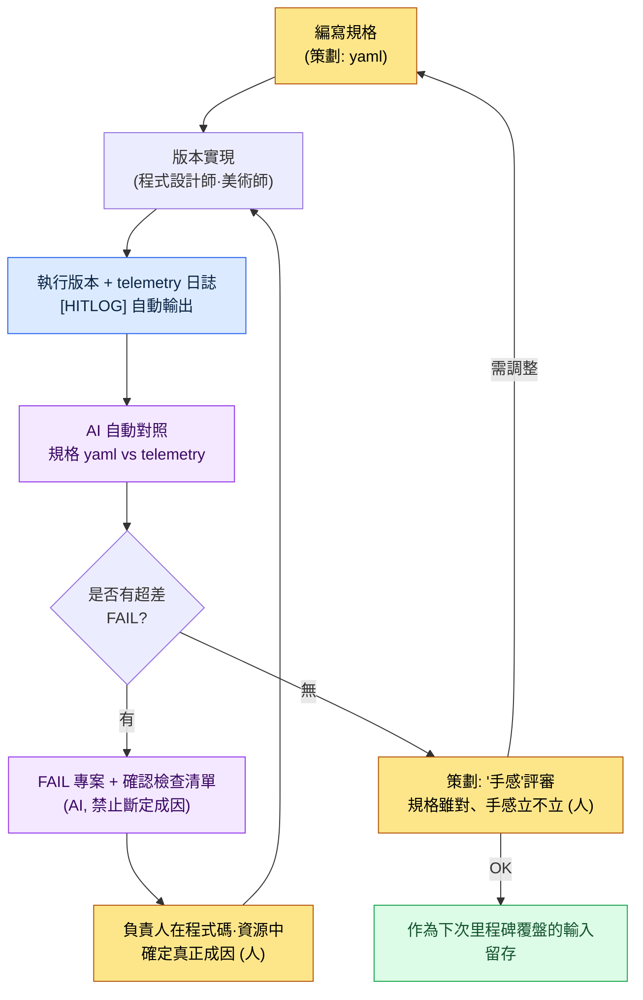

# 4.2 戰鬥 Look & Feel —— 把手感轉化為數值的環節

會議室的顯示器前圍著五個人。同一個版本、同一個技能、同一段 30 秒的影片正在螢幕上第三次迴圈播放。客戶端程式設計師先開口:"我覺得還行。"美術抱著胳膊說:"太弱了。感覺缺了點什麼。"旁邊的策劃插話:"特效是不錯,可就是不'跟手'。"總監盯著看了好一會兒,做出決定:"嗯……再稍微做得'厚重'一點吧。"

然後會議就結束了。"再稍微厚重一點"到底是多少 ms、多少幀,沒有一個人記下來。下一個版本里,程式設計師實現的是他自己理解的"厚重",美術疊加的是他自己理解的"厚重"。然後下一週,在同一個會議室裡看著同一段影片,同樣的對話又重複一遍。

打擊感、手感、Look & Feel。這是戰鬥策劃中用得最頻繁、卻又最缺乏定義的詞。所有人都自以為懂,可腦子裡的定義各不相同,於是討論結束後什麼也沒留下。本章要做的,就是把那種"感覺"分解成可測量的數值。這是把手感從抽象拉回資料的環節。

---

## 4.2.1 戰鬥 = Look & Feel,系統 = 行為

先把邊界劃清楚。戰鬥策劃大致分為兩條線。

- **戰鬥系統**:它如何運作。傷害公式、冷卻時間、層數累積、狀態異常規則。這是下一章(4.3 連招·取消、4.4 AI 模擬)的範疇。
- **戰鬥 Look & Feel**:它給人什麼感覺。按下按鈕之後畫面何時響應、命中瞬間畫面停頓多久、特效與聲音與震動是否在同一瞬間爆發。

本章只講後者。傷害是 100 還是 120,與手感沒有直接關係。那 100 點傷害"打進去的那一瞬間"玩家如何體感,才是手感。即便是同一個傷害公式,只要命中時機與頓幀不同,就會讓人感覺像是完全不同的遊戲。

先得老實指出一點:打擊感不是僅憑三個數值就能完成的。攻擊動作(動畫)的加速·減速曲線、被擊方的反應(受擊反饋·硬直)、80—90 年代日本動作遊戲慣用的誇張變形(deformation,即命中瞬間把角色拉伸、壓扁的殘影·糊化表現),這些全湊齊了,"打中了"這一整塊的感覺才立得起來。**本章集中、並能拉回到可測量數值的**,是其中的三條軸。動作·受擊反應·誇張變形是動畫師·美術師著手更多的領域,留到後面幾章和美術部分講;這裡把重心放在策劃可以用規格固定、並能在版本中驗證的三條軸上。這三條軸可以這樣拆分。

<svg viewBox="0 0 720 250" xmlns="http://www.w3.org/2000/svg" font-family="sans-serif">
  <rect x="0" y="0" width="720" height="250" fill="#fafafa" stroke="#ddd"/>
  <text x="360" y="32" text-anchor="middle" font-size="17" font-weight="bold" fill="#222">可測量的三條軸(並非手感的全部)</text>
  <!-- axis 1 -->
  <rect x="40" y="70" width="190" height="140" rx="8" fill="#e8f0fe" stroke="#4a76d4" stroke-width="2"/>
  <text x="135" y="100" text-anchor="middle" font-size="15" font-weight="bold" fill="#2a4a9a">命中時機</text>
  <text x="135" y="128" text-anchor="middle" font-size="12" fill="#444">輸入 → 反應</text>
  <text x="135" y="148" text-anchor="middle" font-size="12" fill="#444">何時響應</text>
  <text x="135" y="178" text-anchor="middle" font-size="13" font-weight="bold" fill="#2a4a9a">單位: ms</text>
  <text x="135" y="198" text-anchor="middle" font-size="11" fill="#777">"反應快不快"</text>
  <!-- axis 2 -->
  <rect x="265" y="70" width="190" height="140" rx="8" fill="#fde8e8" stroke="#d44a4a" stroke-width="2"/>
  <text x="360" y="100" text-anchor="middle" font-size="15" font-weight="bold" fill="#9a2a2a">頓幀</text>
  <text x="360" y="128" text-anchor="middle" font-size="12" fill="#444">命中瞬間</text>
  <text x="360" y="148" text-anchor="middle" font-size="12" fill="#444">讓時間停頓的長度</text>
  <text x="360" y="178" text-anchor="middle" font-size="13" font-weight="bold" fill="#9a2a2a">單位: frame</text>
  <text x="360" y="198" text-anchor="middle" font-size="11" fill="#777">"厚重不厚重"</text>
  <!-- axis 3 -->
  <rect x="490" y="70" width="190" height="140" rx="8" fill="#e8f6ec" stroke="#3a9a5a" stroke-width="2"/>
  <text x="585" y="100" text-anchor="middle" font-size="15" font-weight="bold" fill="#1a6a3a">特效同步</text>
  <text x="585" y="128" text-anchor="middle" font-size="12" fill="#444">VFX·SFX·UI·</text>
  <text x="585" y="148" text-anchor="middle" font-size="12" fill="#444">攝像機·震動</text>
  <text x="585" y="178" text-anchor="middle" font-size="13" font-weight="bold" fill="#1a6a3a">單位: frame offset</text>
  <text x="585" y="198" text-anchor="middle" font-size="11" fill="#777">"是否像一個事件那樣爆發"</text>
  <!-- plus signs -->
  <text x="247" y="148" text-anchor="middle" font-size="26" fill="#999">+</text>
  <text x="472" y="148" text-anchor="middle" font-size="26" fill="#999">+</text>
  <text x="360" y="240" text-anchor="middle" font-size="12" fill="#666">這三者是測量物件 —— 動作·受擊反應·誇張變形屬美術·動畫領域(另述)</text>
</svg>

當會議室裡有人說"弱"時,那種弱來自三者之一。是反應慢(時機)?是沒有命中感(頓幀)?還是各自為政(同步)?用這三條軸分解去追問,"弱"才終於變成一句可以修正的話。

不過"弱"的成因並不總是隻在這三條軸上。把構成手感的要素一個不漏地列出來,劃清本章負責到哪裡。

| Look & Feel 構成要素 | 是什麼 | 本章中 |
|---|---|---|
| **命中時機** | 輸入 → 首次反應的 ms。最先被懷疑的要素 | 測量·規格(軸 1) |
| **頓幀** | 命中瞬間讓時間停頓、賦予重量的長度 | 測量·規格(軸 2) |
| **攝像機抖動** | 配合打擊、畫面晃動的反饋 | 測量·規格(含於軸 3) |
| **VFX·SFX 時機** | 特效與聲音是否同步到命中幀 | 測量·規格(含於軸 3) |
| 攻擊動作(動畫) | 揮擊的加速·減速,預備動作與後續動作的曲線 | 提及(美術·動畫領域) |
| 受擊反應·硬直 | 被擊方一震並陷入硬直的反應 | 提及(下一章·美術部分) |
| 誇張變形 | 命中瞬間拉伸、壓扁的誇張(殘影·糊化) | 提及(美術部分) |
| 手柄震動 | 傳到手上的物理反饋 | 測量·規格(含於軸 3) |

上面四項歸入本章的三條軸,成為測量·規格的物件;中間三項(動作·反應·誇張變形)不可或缺,但屬於策劃一人難以用數值收口的美術·動畫領域,因此只明確"它們存在"這一點。要是動作僵硬、或者被擊方穩穩站著不動,那麼三條軸全對了打擊感也立不起來。

---

## 4.2.2 命中時機 —— 從輸入到反應

三條軸裡最先講時機是有原因的。玩家懷疑手感時,最先卡住的是"反應慢"這種感覺;別的東西再華麗,只要輸入遲鈍,那一瞬間一切都會垮掉。所以從時機抓起。

手感的第一條軸是時間。從按下按鈕的那一瞬間(0ms)到畫面首次反應的瞬間,要花多少 ms。人對這種延遲敏感得驚人。60ms 和 120ms 的差別,"嘴上說不清楚,手卻知道"。

一次攻擊不是單純的一個點,而是鋪展在時間上的多個事件。把一次普攻放到時間軸上看,長這個樣子。

<svg viewBox="0 0 720 270" xmlns="http://www.w3.org/2000/svg" font-family="sans-serif">
  <rect x="0" y="0" width="720" height="270" fill="#fafafa" stroke="#ddd"/>
  <text x="360" y="28" text-anchor="middle" font-size="16" font-weight="bold" fill="#222">普攻第 1 段 —— 時間軸 (warrior / skill_id 1001)</text>
  <!-- timeline axis -->
  <line x1="60" y1="220" x2="680" y2="220" stroke="#333" stroke-width="2"/>
  <!-- ticks: 0,100,150,250,350 ms mapped 60..680 over 0..380ms => scale (680-60)/380=1.63px/ms -->
  <g font-size="11" fill="#555">
    <line x1="60" y1="215" x2="60" y2="225" stroke="#333"/><text x="60" y="245" text-anchor="middle">0ms</text>
    <line x1="223" y1="215" x2="223" y2="225" stroke="#333"/><text x="223" y="245" text-anchor="middle">100</text>
    <line x1="305" y1="215" x2="305" y2="225" stroke="#333"/><text x="305" y="245" text-anchor="middle">150</text>
    <line x1="468" y1="215" x2="468" y2="225" stroke="#333"/><text x="468" y="245" text-anchor="middle">250</text>
    <line x1="631" y1="215" x2="631" y2="225" stroke="#333"/><text x="631" y="245" text-anchor="middle">350</text>
  </g>
  <!-- input -->
  <line x1="60" y1="60" x2="60" y2="220" stroke="#4a76d4" stroke-width="2" stroke-dasharray="4 3"/>
  <text x="62" y="55" font-size="11" fill="#2a4a9a">輸入(0)</text>
  <!-- casting motion bar 0..100 -->
  <rect x="60" y="70" width="163" height="20" rx="4" fill="#c9d8f5" stroke="#4a76d4"/>
  <text x="141" y="84" text-anchor="middle" font-size="11" fill="#2a4a9a">施法動作 0~100</text>
  <!-- hitbox 100..150 -->
  <rect x="223" y="98" width="82" height="20" rx="4" fill="#f5d6c9" stroke="#d4764a"/>
  <text x="264" y="112" text-anchor="middle" font-size="10" fill="#9a4a2a">攻擊判定框 100~150</text>
  <!-- vfx 100..250 -->
  <rect x="223" y="126" width="245" height="20" rx="4" fill="#d6e8d9" stroke="#3a9a5a"/>
  <text x="345" y="140" text-anchor="middle" font-size="11" fill="#1a6a3a">視覺特效 100~250 (延遲 50ms 後淡出)</text>
  <!-- damage at 110 -->
  <line x1="76" y1="154" x2="76" y2="172" stroke="#d44a4a" stroke-width="0"/>
  <circle cx="239" cy="164" r="6" fill="#d44a4a"/>
  <text x="248" y="168" font-size="10" fill="#9a2a2a">傷害結算 110 (比視覺晚 10ms → 實際上同時被感知)</text>
  <!-- afterdelay 150..350 -->
  <rect x="305" y="182" width="326" height="18" rx="4" fill="#eee" stroke="#aaa"/>
  <text x="468" y="195" text-anchor="middle" font-size="10" fill="#777">後搖 150~350 (直到可接收下一次輸入)</text>
</svg>

這張圖裡最重要的數字是"攻擊判定框首次開啟的 100ms"。意思是按下按鈕 100ms 之後,攻擊判定開始。這個值決定了手感的體感速度。

推薦區間因型別·角色而異,但大致的基準線是有的。

| 種類 | 推薦 輸入→反應 | 備註 |
|---|---|---|
| 即時反應(輕攻擊) | 60\~120ms | "跟手"感的核心區間 |
| 厚重反應(大型技能) | 200\~400ms | 為厚重感而刻意設定的前搖 |
| 蓄力(長時間充能) | 500\~2000ms | 刻意的等待,另行處理 |

這個區間不是絕對標準。這是**作者估算(未經驗證)**:休閒手遊往輸入寬鬆的一側浮動約 ±50ms,格鬥主機端則傾向於收得更嚴。比數字本身更關鍵的,是讓全隊共享一條基準線——"我們遊戲的輕攻擊約定為 90ms"。有了基準線,才能看著版本說出"對/錯"。

但這裡有一個陷阱。人眼分不清 90ms 和 110ms。在 60fps 下 1 幀約為 16.67ms,而這 20ms 的差距不過一幀出頭。會議室裡"好像有點慢?"這句話到底對不對,光靠眼睛終究判不出來。所以才需要測量。

---

## 4.2.3 如何從版本中提取時機 —— 誠實的對照

規格里寫了"攻擊判定框 100ms"。如何確認版本中實際是在 100ms 開啟的?自動化的路分三條(影片分析·現成 vision 工具·遊戲內 telemetry),三種方式的精度·難度對比在 4.4 中作正式論述。這裡只點出結論。實務中最先要鋪設的是**遊戲內 telemetry**。原因很簡單。與其從影片裡推斷 VFX"出現在畫面上的那一幀",不如在程式碼觸發 `OnHit` 事件的那一幀直接打一行 `[HITLOG]`,後者準確得多、也便宜得多,完全不在一個量級。影片分析只用於沒有輸入疊層的外部影片(例如競品分析),我們自己的版本則從 telemetry 鋪起。

telemetry 日誌長這個樣子。

```
[HITLOG] frame=6  t_ms=100  evt=hitbox_on    skill=1001 char=warrior
[HITLOG] frame=6  t_ms=100  evt=vfx_trigger  skill=1001
[HITLOG] frame=6  t_ms=100  evt=sfx_trigger  skill=1001
[HITLOG] frame=7  t_ms=117  evt=damage_apply skill=1001 dmg=124
[HITLOG] frame=7  t_ms=117  evt=ui_dmgnum    skill=1001
[HITLOG] frame=6  t_ms=100  evt=cam_shake    skill=1001 amp=0.4
```

策劃要做的,是把這份日誌與規格逐行比對。其中大多是數值換算與機械對照,人靠眼睛反覆做會疲憊、會出錯,而 LLM 不會疲憊。下一節實際讓它做一遍。

---

## 4.2.4 實操記錄 (worked transcript) —— 讓 AI 把 telemetry 日誌與規格對照

把規格 yaml 和版本 telemetry 日誌兩份都貼進去,讓 AI 對照兩者、找出對不上的地方。下面是提示詞全文、Claude 的原始輸出,以及人工驗證的全過程。不做摘要,原樣照搬。(實操記錄指完整保留的真實操作過程記錄。)

### 第 1 次提示詞

```
下面是一個戰鬥技能的"命中時機規格",以及從實際版本中提取的
telemetry 日誌。請把版本相對規格對不上的專案整理成表。

[規格]
character: warrior
skill_id: 1001
fps: 60
events:
  hitbox_on:    {expect_ms: 100, tol_frame: 0}
  vfx_trigger:  {expect_ms: 100, tol_frame: 0}
  sfx_trigger:  {expect_ms: 100, tol_frame: 1}
  damage_apply: {expect_ms: 110, tol_frame: 1}
  ui_dmgnum:    {expect_ms: 100, tol_frame: 2}
  cam_shake:    {expect_ms: 100, tol_frame: 1}

[telemetry 日誌]
[HITLOG] frame=6  t_ms=100  evt=hitbox_on    skill=1001
[HITLOG] frame=6  t_ms=100  evt=vfx_trigger  skill=1001
[HITLOG] frame=8  t_ms=133  evt=sfx_trigger  skill=1001
[HITLOG] frame=7  t_ms=117  evt=damage_apply skill=1001
[HITLOG] frame=9  t_ms=150  evt=ui_dmgnum    skill=1001
[HITLOG] frame=6  t_ms=100  evt=cam_shake    skill=1001

60fps(1 幀=16.67ms)。請把 expect_ms 換算為幀,與日誌的 frame
比對,差值超過 tol_frame 的標記為 FAIL。
```

### Claude 原始輸出(原樣)

> 先把規格的 expect_ms 換算為幀。在 60fps 下,frame = round(ms / 16.67)。
>
> - hitbox_on: 100 / 16.67 ≈ 6.0 → frame 6
> - vfx_trigger: 100 → frame 6
> - sfx_trigger: 100 → frame 6
> - damage_apply: 110 / 16.67 ≈ 6.6 → frame 7(四捨五入)
> - ui_dmgnum: 100 → frame 6
> - cam_shake: 100 → frame 6
>
> 與日誌中實際 frame 比對的結果如下。
>
> | 事件 | 期望 frame | 實際 frame | 差值(frame) | 容差 | 判定 |
> |---|---|---|---|---|---|
> | hitbox_on | 6 | 6 | 0 | 0 | PASS |
> | vfx_trigger | 6 | 6 | 0 | 0 | PASS |
> | sfx_trigger | 6 | 8 | +2 | 1 | **FAIL** |
> | damage_apply | 7 | 7 | 0 | 1 | PASS |
> | ui_dmgnum | 6 | 9 | +3 | 2 | **FAIL** |
> | cam_shake | 6 | 6 | 0 | 1 | PASS |
>
> 有兩個專案超出了容差。
> - **sfx_trigger**:聲音比視覺命中晚 2 幀(約 33ms)。超出容差 1 幀。玩家很可能感覺"聲音稍微有點對不上"。
> - **ui_dmgnum**:傷害數字晚 3 幀(約 50ms)顯示。超出容差 2 幀。可能導致"明明打中了,數字卻晚出"的彆扭感。
>
> damage_apply 為 frame 7,與規格上的 frame 7(110ms 換算)一致,因此正常。不過 damage_apply 比 hitbox_on(frame 6)晚 1 幀這一點,需要確認是否為有意設計。

### 人工驗證 —— 否決了一格

收到輸出後並沒有立刻全信。驗證點有兩個。

**驗證 1(四捨五入邊界 —— 通過)。** damage_apply 的 110ms 換算讓人起疑。110 / 16.67 = 6.598…。四捨五入得 7,沒錯。可如果規格本意是"6 幀 = 與 100ms 同一幀"呢?直接確認後發現,規格里確實寫著 `damage_apply: expect_ms 110`,刻意與 vfx(100)拉開 10ms 差距。所以 frame 7 的換算是準確的。AI 通過。

**驗證 2(最後一句 —— 否決)。** AI 在結尾補的那句"damage_apply 比 hitbox_on 晚 1 幀這一點,需要確認是否為有意設計"是噪聲。規格里已經用 expect_ms 110 明示了意圖,AI 卻把它當成"需要確認"反問回來。既然給了規格,就該在規格之內把答案收口,它卻製造了不必要的疑問。這句話沒有采納。

帶著否決理由重新發起請求。

### 第 2 次提示詞(重新請求)

```
damage_apply 在規格里已用 110 釘死意圖,所以去掉"需要確認"的註釋。
// 意思是:不要去反問規格之內已收口的專案
只保留兩條 FAIL(sfx、ui_dmgnum),不要斷定成因,
改成"待確認的程式碼/資源位置"檢查清單。
```

### Claude 第 2 次輸出(原樣)

> 針對兩條 FAIL 的確認檢查清單如下。不斷定成因,只整理確認點。
>
> **sfx_trigger(+2 幀延遲)**
> - [ ] 聲音觸發是繫結在與 `hitbox_on` 相同的事件上,還是掛在單獨的動畫通知(notify)上
> - [ ] 音訊資源本身是否有前導靜音(leading silence)——檔案開頭的空白段可能被當作延遲
> - [ ] 聲音播放呼叫是否在同一幀進入,卻因輸出延遲被推後(平臺音訊緩衝)
>
> **ui_dmgnum(+3 幀延遲)**
> - [ ] 傷害數字 UI 是否在 `damage_apply`(frame 7)之後於單獨的 tick 中重新整理
> - [ ] UI 重新整理是否被集中到下一幀末尾批次處理(延遲渲染佇列)
> - [ ] 數字彈出動畫的起始幀是否被加入了額外的延遲值
>
> 可以斷定的:兩個專案都超出了規格容差,且比視覺命中(frame 6)晚。無法斷定的:以上成因中究竟是哪一個,在確認程式碼/資源之前無從得知。

這第二次輸出原樣採納了。不去編造成因、而是改成"待確認之處",正是想要的形態。我把這份檢查清單原樣交給了聲音負責人和 UI 負責人。聲音那邊的元兇是音訊資源前導靜音 33ms(檢查清單第 2 項)。UI 那邊是下一幀重新整理的結構(第 1 項)。

到這裡,分工的界線就清晰了。**AI 機械地對照規格與日誌、抓出 FAIL;人則(a)否決 AI 製造出來的不必要反問,(b)在程式碼裡確定 FAIL 的真正成因。** 讓 AI 去斷定成因,它會編出聽起來煞有介事的假話,因此只讓它做到"待確認之處"為止才安全。

---

## 4.2.5 頓幀 —— 打擊的重量

第二條軸是停頓。命中那一瞬間把遊戲時間極短地停住、或放慢的效果。它決定了"打中了"這種感覺的強度。這是格鬥遊戲與動作 RPG 中最強力的手感工具。太長會悶,太短則沒有重量。

推薦區間(以 60fps 為準)如下。這些數值是動作遊戲中通行的大致慣例,絕對值因遊戲而異、需各自調整。

| 種類 | 推薦幀數 | 換算 |
|---|---|---|
| 輕擊中 | 1\~2 幀 | 16\~33ms |
| 中等擊中 | 3\~5 幀 | 50\~83ms |
| 重擊中(必殺技) | 6\~12 幀 | 100\~200ms |
| 暴擊·命中弱點 | 上述值 + 2\~3 幀 | —— |

要按角色·技能區別給值。要是全給一樣,重量差就出不來,最終所有攻擊都收斂到同一種調子。這一點連線到 4.2 三條核心訊息之一。

"由誰來停頓"也是一項設計選擇。

| 選項 | 效果 | 適合 |
|---|---|---|
| 只停攻擊方 | 攻擊方一側有重量感,被擊方繼續後退·倒地 | 動作 |
| 只停被擊方 | 被擊方暫時定住,攻擊方自由移動 | 連招友好 |
| 兩邊都停 | 最強的重量感 | 格鬥遊戲傳統 |

規格這樣輸入。

```yaml
character: warrior
skill_id: 1001
hit_stop:
  attacker: 2          # frames
  victim: 4
  critical_multiplier: 1.5   # 暴擊時 1.5 倍(四捨五入)
```

頓幀是僅憑規格數值無法對"對/錯"收口、手感驗證最棘手的一條軸。telemetry 能抓到"實際是否停了 4 幀",但"4 幀是否合適"必須由人親手摸版本來判定。AI 保證規格一致,人則看那個規格值本身是否合適。

---

## 4.2.6 特效同步 —— 是否所有東西都在同一幀爆發

第三條軸是同時性。VFX(視覺特效)·SFX(聲音)·UI(傷害數字)·攝像機(抖動)·震動(手柄)若在同一幀開始,玩家的大腦就會把它們捆成"一個事件"。哪怕只錯開 1\~2 幀,也會出現"彆扭"的反應;錯開 3\~5 幀,就會出現"像是 bug"的反應。前面實操記錄裡 sfx 晚 2 幀、ui 晚 3 幀而 FAIL,正是這條軸的問題。

同步物件共 5 種及其容差。

| 要素 | 觸發時點 | 容差 |
|---|---|---|
| VFX(視覺特效) | 命中幀 | ±0(必須同時) |
| SFX(聲音) | 命中幀 | ±1 幀(16ms) |
| UI 傷害數字 | 命中幀 | ±2 幀 |
| 攝像機抖動 | 命中幀 | ±1 幀 |
| 手柄震動 | 命中幀 | ±2 幀 |

關鍵在於這 5 種**全部**都要寫進規格。常見的錯誤是隻把 VFX 寫進規格,其餘四種當作"它們會自己對齊吧"放任不管。規格里沒有,版本驗證就沒有基準;就算 telemetry 抓到了,也沒有可比對的物件。5 種都進了規格,自動比對才能收口。

自動比對照搬上一節的實操記錄即可。只要 telemetry 日誌裡 5 種的觸發幀都打全了,AI 就會與規格對照、只報告超差的專案。人不必每個版本都用眼睛去確認 100 個技能。不過,AI 抓出規格對不上,與人去抓"規格全對、可手感還是不立"的領域,這兩件事仍然是分開的。

---

## 4.2.7 從規格到下一個版本 —— 整個迴圈

把至此為止的碎片接成一條流程。這個迴圈一旦轉起來,會議室裡的"再稍微厚重一點"就被翻譯成"頓幀 victim 4→6 幀"。



在這個迴圈裡,AI 負責的格(D、F)和人負責的格(A、G、H)清晰地分開。AI 擅長機械對照與生成檢查清單,人擅長設定基準線·確定成因·最終手感判定。自動化不是要把人剔出去,而是讓人從每次都要花半天的"用眼睛數幀"中解脫出來,只專注於"手感"。

迴圈的最後一格(I)很重要。這些測量資料不是用一次就丟,而是再次作為下次里程碑覆盤的輸入進來。一旦"上個季度的手感 FAIL 集中在 sfx 同步上"這類規律以資料留存,下個季度就先動音訊流水線。

---

## 4.2.8 測量減少了討論的環節 —— 運營觀察

在作者以總監身份參與的某個手遊 MMORPG 專案(以下稱"專案A")中,把上面的迴圈跑了約 6 個月,觀察到的變化如下。下面的數值不是精密計量,而是基於會議記錄的時間戳與版本驗證記錄的**作者運營觀察(含估算)**,請按方向與比例來讀。不要把絕對值當作可引用的基準來用。

| 專案 | 引入前 | 引入後 | 性質 |
|---|---|---|---|
| 單次 Look & Feel 會議耗時 | 拖得很長 | 縮短到一半以下 | 以會議記錄為準,體感 |
| 版本驗證(多個技能) | 幾乎一整天 | 大幅縮短 | telemetry 自動對照的效果 |
| "打擊感弱"反饋的消解 | 多個版本週期 | 1\~2 個週期 | 樣本少,只看方向 |
| 規格 vs 版本 一致率 | 一半上下 | 大多一致 | 引入 telemetry 後變得可測量 |

比數字本身更本質的是定性變化。會議室裡一冒出"好弱啊",馬上就會反問"哪條軸?時機?頓幀?同步?";答不上來就一起把 telemetry 調出來。**可測量的客觀為討論造出了終點**,這是 6 個月裡最大的變化。"再厚重一點"走出會議室之外的情況變少了。

---

## 4.2.9 常見錯誤與規避

| 錯誤 | 規避 |
|---|---|
| 沒有規格就先驗證版本 | 規格優先。沒有基準,"對/錯"就無從談起 |
| 想先鋪影片分析 | 我們自己的版本從 telemetry 起。影片分析只用於外部影片 |
| 讓 AI 斷定 FAIL 成因 | 只做到"待確認之處"檢查清單。成因由人在程式碼裡確定 |
| 只寫 VFX 規格,漏掉其餘 4 種 | 5 種(VFX·SFX·UI·攝像機·震動)全部寫進規格 |
| 把一個角色的規格複製給全部角色 | 按角色·技能差異化。相同則手感收斂為一種調子 |
| 在所有擊中上濫用頓幀 | 只用在有意義的擊中上。濫用則發悶 |
| 原樣接受 AI 輸出的反問 | 對規格之內已收口的專案,其"需要確認"註釋予以否決 |

---

## 動手試試

在自己的專案裡以最小規模鋪一遍這個迴圈的步驟。

**setup**
1. 選 1 個要驗證的技能(推薦普攻)。
2. 在程式碼的 6 處觸發點(hitbox_on、vfx、sfx、damage_apply、ui_dmgnum、cam_shake)各埋一行日誌:`[HITLOG] frame=X t_ms=Y evt=... skill=...`。
3. 編寫規格 yaml(在 events 塊裡寫 expect_ms + tol_frame)。把本章的第 1 次提示詞示例當模板用。

**prompt**
4. 把版本跑一遍,收集 telemetry 日誌。
5. 把規格 yaml + telemetry 日誌一起貼給 AI,這樣吩咐:"把版本相對規格對不上的專案,按 60fps 幀換算來對照,只把 FAIL 給成表。不要斷定成因,改成'待確認之處'檢查清單。"(本章第 2 次提示詞的形態)

**verify**
6. 親手抽驗一格 AI 輸出的幀換算(ms / 16.67 四捨五入)。哪怕只有一格錯,就要懷疑全部。
7. 如果 AI 去反問規格之內已收口的專案、或斷定成因,就予以否決並重新請求。
8. 把 FAIL 檢查清單交給負責人,在程式碼·資源裡確定真正的成因。

### 單人精簡版

如果是既沒團隊也沒 telemetry 基礎設施的單人開發者,就這樣精簡。把版本以 60fps 錄屏,並開啟按鍵疊層讓輸入瞬間可見。錄下要驗證的技能一次之後,在影片編輯器裡親手數"按下按鈕的幀"和"畫面首次變化的幀"。把這兩個幀號和規格期望值給 AI,吩咐"按 60fps 換算為 ms 與規格比較",即便沒有 telemetry,也能驗證核心的一條軸(命中時機)。要做到 5 種同步是難的,但哪怕只抓住"輸入→反應"這一條軸,手感討論的一半也已經搬到客觀這邊來了。

---

下一章從一次擊中轉入擊中的連續。連招·取消·輸入佇列——講那些讓一次擊中自然銜接到下一次擊中的規則。

---

### 本章要點
- 手感是命中時機·頓幀·特效同步三條軸之和,只動其中一條,其餘就會跟著晃。
- 比起影片分析,遊戲內 telemetry 日誌更準確、更便宜——我們自己的版本從 telemetry 起。
- AI 靠規格對照抓 FAIL,人則否決反問、並在程式碼裡確定成因。

### 下一章預告
- 4.3. 連招·取消·輸入佇列
