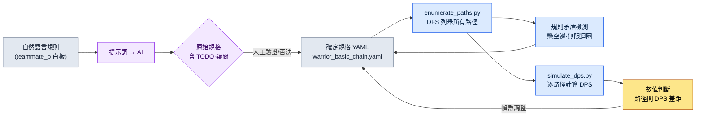

# 4.3 連招·取消·輸入佇列 —— 列舉路徑並加以驗證

戰鬥設計師組員 B 站在會議室白板前,用馬克筆畫著方框。基礎1、基礎2、基礎3,還有向旁邊岔出去的重擊分支。當箭頭增加到七條左右時,有人問道:"那麼重擊挑空之後用閃避取消,還能再回到基礎1嗎?"組員 B 停下了筆。白板上的圖裡並沒有畫出那條路徑。是能畫卻沒畫,還是規則上根本不可能,他自己也無法當場回答。

這就是連招設計真正的難題。連招在腦海裡看上去像"1-2-3 連起來再分支到重擊"這樣簡單的一條主幹。可一旦摻入取消和輸入佇列,主幹就變成了圖。在六個節點上只要再加幾條取消邊,實際能踩到的路徑就會膨脹到幾十條。人無法在腦海裡把這幾十條全部展開。於是,"這條路徑太強了"這樣的數值問題,往往要等它進了構建版本之後才被發現。

本章的目標只有一個:**建立一套不靠手畫、而是自動枚舉出全部連招路徑,並對每條路徑加以驗證的工作流**。把用自然語言寫下的規則轉成規格,從規格中列舉路徑,再把枚舉出的路徑送進模擬。在這個過程中,AI 能幫到哪一步、又會在哪裡撒謊,我會原原本本地展示出來。

---

## 4.3.1 連招不是表格,而是圖

把連招寫成表格,會是這樣:"基礎1 之後是基礎2,基礎2 之後是基礎3。"行與列一目瞭然。可這張表會撒謊。因為表格假定了一條直線。在真實戰鬥中,玩家會從基礎2 岔向重擊,把重擊用閃避取消,閃避剛結束又按下基礎1。這些分支和迴圈都藏在了表格的行與行之間。

所以連招真正的形態是**有向圖**。動作是節點,連線是邊。每條邊上掛著輸入視窗(何時接受輸入)和輸入鍵。節點上掛著持續幀數,部分節點上還掛著獎勵條件(必須經過特定節點才會附加傷害倍率)。

把戰士角色的一套基礎連招畫成圖,如下所示。六個節點,含取消分支。

<svg viewBox="0 0 720 300" xmlns="http://www.w3.org/2000/svg" font-family="sans-serif" font-size="13">
  <defs>
    <marker id="arrow" markerWidth="10" markerHeight="10" refX="8" refY="3" orient="auto" markerUnits="strokeWidth">
      <path d="M0,0 L8,3 L0,6 Z" fill="#444"/>
    </marker>
  </defs>
  <!-- main chain -->
  <rect x="20" y="40" width="110" height="40" rx="6" fill="#e8f0fe" stroke="#3367d6"/>
  <text x="75" y="65" text-anchor="middle">基礎1 (21f)</text>
  <rect x="200" y="40" width="110" height="40" rx="6" fill="#e8f0fe" stroke="#3367d6"/>
  <text x="255" y="65" text-anchor="middle">基礎2 (24f)</text>
  <rect x="380" y="40" width="110" height="40" rx="6" fill="#e8f0fe" stroke="#3367d6"/>
  <text x="435" y="65" text-anchor="middle">基礎3 (30f)</text>
  <rect x="560" y="40" width="140" height="40" rx="6" fill="#fce8e6" stroke="#c5221f"/>
  <text x="630" y="65" text-anchor="middle">終結技 ×1.5</text>
  <!-- branch -->
  <rect x="200" y="150" width="110" height="40" rx="6" fill="#fef7e0" stroke="#e8a000"/>
  <text x="255" y="175" text-anchor="middle">重擊 (33f)</text>
  <rect x="380" y="150" width="110" height="40" rx="6" fill="#fef7e0" stroke="#e8a000"/>
  <text x="435" y="175" text-anchor="middle">挑空 (28f)</text>
  <rect x="200" y="240" width="110" height="40" rx="6" fill="#e6f4ea" stroke="#137333"/>
  <text x="255" y="265" text-anchor="middle">閃避 (18f)</text>
  <!-- edges main -->
  <line x1="130" y1="60" x2="200" y2="60" stroke="#444" marker-end="url(#arrow)"/>
  <text x="165" y="52" text-anchor="middle" font-size="11">10~21f</text>
  <line x1="310" y1="60" x2="380" y2="60" stroke="#444" marker-end="url(#arrow)"/>
  <text x="345" y="52" text-anchor="middle" font-size="11">12~24f</text>
  <line x1="490" y1="60" x2="560" y2="60" stroke="#444" marker-end="url(#arrow)"/>
  <text x="525" y="52" text-anchor="middle" font-size="11">14~30f</text>
  <!-- branch edges -->
  <line x1="255" y1="80" x2="255" y2="150" stroke="#444" marker-end="url(#arrow)"/>
  <text x="300" y="118" text-anchor="middle" font-size="11">重擊 6~24f</text>
  <line x1="310" y1="170" x2="380" y2="170" stroke="#444" marker-end="url(#arrow)"/>
  <line x1="255" y1="190" x2="255" y2="240" stroke="#444" marker-end="url(#arrow)"/>
  <text x="300" y="218" text-anchor="middle" font-size="11">閃避取消</text>
  <!-- loop back -->
  <path d="M200,260 C90,260 75,140 75,80" fill="none" stroke="#137333" stroke-dasharray="5,4" marker-end="url(#arrow)"/>
  <text x="110" y="160" text-anchor="middle" font-size="11" fill="#137333">閃避後重新進入基礎1</text>
</svg>

與白板有兩處決定性的不同。第一,每條邊上都標明瞭輸入視窗的幀數範圍。"重擊 6\~24f"的意思是:從基礎2 開始之後的第 6 幀到第 24 幀之間接受重擊輸入。第二,有一條用虛線畫出的閃避→基礎1 重新進入的邊。這正是組員 B 在會議室裡無法當場回答的那條路徑。用圖明確標出後,"有/沒有"就一清二楚了。

這張圖若由人手畫,六個節點加七八條邊。如果有二十個角色、每個角色又有三四套連招,圖就會變成幾百張。手是跟不過來的。所以要把圖寫成**文本規格**,再從中自動生成圖示與驗證。

---

## 4.3.2 規格供人閱讀,也供機器解析

把上面的圖轉寫成 YAML 規格。核心是節點(`nodes`)、邊(`edges`)、獎勵(`bonuses`)三個塊。取消規則也視為邊的一種 —— 因為打斷後跳到另一個節點,歸根結底也是一條邊。

```yaml
# warrior_basic_chain.yaml
character: warrior
combo_id: basic_chain

nodes:
  - { id: basic_1,  name: 基礎1,   duration_frames: 21 }
  - { id: basic_2,  name: 基礎2,   duration_frames: 24 }
  - { id: basic_3,  name: 基礎3,   duration_frames: 30 }
  - { id: heavy,    name: 重擊,    duration_frames: 33 }
  - { id: launch,   name: 挑空,    duration_frames: 28 }
  - { id: dodge,    name: 閃避,    duration_frames: 18, cancels_recovery: true }

edges:
  - { from: basic_1, to: basic_2, input: light, window: [10, 21] }
  - { from: basic_2, to: basic_3, input: light, window: [12, 24] }
  - { from: basic_2, to: heavy,   input: heavy, window: [6, 24] }
  - { from: heavy,   to: launch,  input: heavy, window: [10, 33] }
  - { from: heavy,   to: dodge,   input: dodge, window: [0, 33], type: cancel }
  - { from: basic_3, to: dodge,   input: dodge, window: [0, 30], type: cancel }
  - { from: dodge,   to: basic_1, input: light, window: [8, 18] }   # 重新進入

bonuses:
  - { on: basic_3, requires_path: [basic_1, basic_2], damage_multiplier: 1.5 }
```

這份規格同時滿足兩類讀者。人讀到 `window: [6, 24]`,會明白"重擊是從基礎2 中段開始接受的";機器解析同一行,用於生成圖示和列舉路徑。一個來源同時產出人的理解和機器的驗證。

上面的幀數(`21`、`24`、`[6, 24]`)不是實測值,而是為了本章說明、由作者構造的示例值(未經驗證)。在真實專案中,這些值來自動畫師製作的蒙太奇(montage)長度和構建版本里的通知(notify)時機。第一次寫規格時填入設計師的意圖值,等構建版本出來後再捕獲、用實測值加以校正 —— 這條校正迴圈在 4.4 中講解。

---

## 4.3.3 實操記錄(worked transcript)—— 從自然語言到規格

把組員 B 畫在白板上的規則用自然語言交出去,讓 AI 轉成規格 YAML。這裡不做概括,而是把提示詞全文、Claude 的原始輸出、人的驗證/否決都原樣照搬。"實操記錄"指的是完整保留的真實操作過程記錄。

### 提示詞(全文)

```
下面是戰士角色的連招規則。把它轉成連招規格 YAML。

規則:
- 基礎攻擊連成 1、2、3 三段。用輕攻擊鍵。
- 在基礎2 進行途中按下重擊鍵,可以岔向重擊。
- 重擊之後再按一次重擊,會把敵人挑空(挑空)。
- 重擊隨時可以用閃避取消。
- 基礎3 也可以用閃避取消。
- 閃避剛結束後,可以用輕攻擊重新開始基礎1。
- 基礎3 只有在基礎1 和基礎2 都經過之後,傷害才是 1.5 倍。

規格格式:
- nodes(id, name, duration_frames)、edges(from, to, input, window, type)、
  bonuses(on, requires_path, damage_multiplier)
- 取消邊用 type: cancel 標記。
- 幀數值,我沒給的你不要自己定,留成 TODO 空著。
```

最後一行是關鍵。明確要求:沒給的幀數不準編造。這是在提示詞層面強制執行 v3 標準第 3 條(數值要誠實)。

### Claude 原始輸出(未經編輯)

````
已轉換為規格。幀數值未提供,故留為 TODO。

```yaml
character: warrior
combo_id: basic_chain
nodes:
  - { id: basic_1, name: 基礎1, duration_frames: TODO }
  - { id: basic_2, name: 基礎2, duration_frames: TODO }
  - { id: basic_3, name: 基礎3, duration_frames: TODO }
  - { id: heavy,   name: 重擊, duration_frames: TODO }
  - { id: launch,  name: 挑空, duration_frames: TODO }
  - { id: dodge,   name: 閃避,   duration_frames: TODO }
edges:
  - { from: basic_1, to: basic_2, input: light, window: TODO }
  - { from: basic_2, to: basic_3, input: light, window: TODO }
  - { from: basic_2, to: heavy,   input: heavy, window: TODO }
  - { from: heavy,   to: launch,  input: heavy, window: TODO }
  - { from: heavy,   to: dodge,   input: dodge, window: TODO, type: cancel }
  - { from: basic_3, to: dodge,   input: dodge, window: TODO, type: cancel }
  - { from: dodge,   to: basic_1, input: light, window: TODO }
bonuses:
  - { on: basic_3, requires_path: [basic_1, basic_2], damage_multiplier: 1.5 }
```

需要確認的地方:
1. "閃避剛結束後重新開始基礎1"我放進了 dodge -> basic_1 這條邊,但
   這究竟是在閃避的後搖期間接受輸入,還是在閃避完全結束之後,並不明確。
2. 規則裡沒有提到挑空(launch)之後是否銜接空中連招。
   需要確認挑空是否就是連招的終點。
3. 閃避到底放成節點,還是隻放成邊(取消動作),這點模糊。暫且放成了節點
   —— 我判斷閃避本身是一個具有持續時間的動作。
````

在這裡做評估。優點:沒有編造幀數,全部留成了 TODO。遵守了提示詞的約束。而且末尾僅有的三個問題,都是真正模糊的地方 —— 尤其是第 1 個(重新進入的輸入時機)正是組員 B 在會議室裡沒能當場回答的那個漏洞。AI 比人更早找到了漏洞。

模糊之處:第 3 個裡把閃避放成節點,這是見仁見智的判斷。閃避既是"取消動作",同時又是"具有持續時間的動作",兩邊都說得通。AI 選了一邊,又如實報告說它模糊,這是誠實的;但這屬於設計決策,得由人來定。

### 人的驗證/否決

回答三個問題,並否決其中一部分。

- **第 1 個(重新進入時機):** 在閃避後搖期間(8\~18f)接受輸入。不是看完整段閃避之後,而是用後搖取消重新進入基礎1。→ 採納,`window: [8, 18]`。
- **第 2 個(挑空之後):** 在本章範圍內,把挑空當作連招終點。空中連招另作一套分離出去。→ 採納 AI 的判斷。
- **第 3 個(閃避=節點):** 放成節點。但追加 `cancels_recovery: true` 屬性,以明示它是"打斷後搖的動作"。→ 部分採納 + 追加屬性。

另有一處要**否決**。AI 沒有給 `dodge → basic_1` 邊加 `type: cancel`,而這條邊是打斷閃避的後搖再進入的,具備取消性質,這點沒錯。但這裡把它視為"閃避後的正常進入",當作普通邊處理 —— 因為對這個角色而言,後搖取消與正常銜接在遊戲手感上沒有差別。這是人憑藉領域判斷覆蓋 AI 分類的一個例子。

### 再次請求

```
好。把下面這些反映進去,重新給出最終規格:
- 給 dodge 追加 cancels_recovery: true。
- dodge -> basic_1 邊的 window 取 [8, 18]。
- 其餘幀數我還是沒給,保持 TODO。不過上面那張圖的示例值
  (basic_1=21、basic_2=24、basic_3=30、heavy=33、launch=28、dodge=18)
  我會用,所以就用這些值填進去。要用註釋標明這是未經驗證的示例值。
```

這次再請求得出的結果,就是 4.3.2 的那份 YAML。它不是一次成形的。提示詞 → 原始輸出 → 驗證/否決 → 再請求。正是這個迴圈造就了規格的可信度。AI 標出模糊之處,人憑領域知識來決斷 —— 只靠其中一方都行不通。

---

## 4.3.4 自動列舉路徑

既然規格是圖,那麼連招路徑的列舉就變成了**圖搜尋**問題。從起點節點出發,尋找通往終點節點(或終結技)的所有路徑,採用深度優先搜尋(DFS)。人在腦海裡做不到,而程式碼瞬間就能完成。

作者團隊的隔離工作區 `95_BattleTF` 裡有一個負責這項列舉的小指令碼。它讀取規格 YAML,抽出所有路徑,並驗證每條路徑在規則上是否成立(邊是否存在)。只看核心邏輯的話,如下所示。

```python
# 95_BattleTF/enumerate_paths.py (節選)
import yaml

def load_graph(path):
    spec = yaml.safe_load(open(path, encoding="utf-8"))
    adj = {}
    for e in spec["edges"]:
        adj.setdefault(e["from"], []).append(e)
    return spec, adj

def enumerate_paths(adj, start, max_depth=8):
    results = []
    def dfs(node, path, edges):
        # 終點節點(無出邊)或達到深度上限則確定路徑
        outs = adj.get(node, [])
        if not outs or len(path) >= max_depth:
            results.append((list(path), list(edges)))
            return
        for e in outs:
            if e["to"] in path:        # 防止迴圈:一條路徑中同一節點只走 1 次
                results.append((list(path), list(edges)))
                continue
            dfs(e["to"], path + [e["to"]], edges + [e])
    dfs(start, [start], [])
    return results
```

從 `basic_1` 開始跑,會湧出一大批用手絕對展不全的路徑。只看其中一部分,如下所示。

| # | 路徑 | 備註 |
|---|---|---|
| 1 | 基礎1 → 基礎2 → 基礎3 | 標準三段,滿足終結技獎勵 |
| 2 | 基礎1 → 基礎2 → 重擊 → 挑空 | 分支連招 |
| 3 | 基礎1 → 基礎2 → 重擊 → 閃避 → 基礎1 → … | 迴圈進入 |
| 4 | 基礎1 → 基礎2 → 基礎3 → 閃避 → 基礎1 → … | 終結技後重置 |

第 3 和第 4 很重要。由於有閃避重新進入的邊,連招發生了**迴圈**。人在白板上沒看到的,正是這種迴圈路徑。如果不在 DFS 里加上防迴圈(同一節點一條路徑只走 1 次)的護欄,列舉就會陷入無限迴圈 —— 這是第一次跑程式碼時真的卡了一下才發現的陷阱。只要圖裡存在迴圈,列舉器就一定需要護欄。

列舉階段的產物有兩類。第一,規則上成立的所有路徑列表。第二,**規則矛盾檢測** —— 如果規格里有 `dodge → basic_1` 這條邊,而 `dodge` 節點的定義卻缺失,列舉器就會把它揪出來,標為"指向未定義節點的邊"。手寫規格時最常犯的錯誤,就是這種懸空(dangling)引用。

---

## 4.3.5 把枚舉出的路徑送進模擬

光有路徑列表,還不知道"哪條路徑太強"。得把每條路徑放進 DPS 模擬器。作者團隊的 `simulate_dps` 擔當這個角色 —— 它接收路徑(節點序列)、每個節點的傷害與幀數、獎勵規則,計算總傷害和總耗費幀數,再算出每秒傷害(DPS)。

```python
# 95_BattleTF/simulate_dps.py (節選,假定 60fps)
def simulate(path_nodes, node_dmg, node_frames, bonuses):
    total_dmg = 0
    total_frames = 0
    visited = []
    for nid in path_nodes:
        dmg = node_dmg.get(nid, 0)
        # 獎勵:若 requires_path 全部經過,則套用倍率
        for b in bonuses:
            if b["on"] == nid and all(r in visited for r in b["requires_path"]):
                dmg *= b["damage_multiplier"]
        total_dmg += dmg
        total_frames += node_frames[nid]
        visited.append(nid)
    seconds = total_frames / 60.0
    return {"dmg": total_dmg, "frames": total_frames,
            "dps": round(total_dmg / seconds, 1) if seconds else 0}
```

把 4.3.4 的列舉結果整批灌進來,每條路徑的 DPS 就會落成一張表。下面是把節點傷害用示例值(基礎打擊 100、重擊 180、挑空 140 —— 均為未經驗證的加工值)填入後跑出的結果。

| 路徑 | 總傷害 | 總幀數 | DPS |
|---|---|---|---|
| 基礎1→基礎2→基礎3 (終結技 ×1.5) | 100+100+150 = 350 | 75 | 280.0 |
| 基礎1→基礎2→重擊→挑空 | 100+100+180+140 = 520 | 106 | 294.3 |
| 基礎1→基礎2→基礎3→閃避→基礎1 | 350+0+100 = 450 | 144 | 187.5 |

這張表改變了討論。"重擊分支看上去比標準三段更強?"這樣的直覺,變成了"重擊路徑 DPS 294 對標準 280,領先 5%"這樣的數字。如果這 5% 的領先是有意為之,就通過;否則就拉長重擊幀數,把 DPS 壓下去。在構建版本出來**之前**,就在規格階段做出這個判斷。

把整條工作流壓成一張圖,如下所示。



規格(D)處在中心,列舉(E)·驗證(F)·模擬(G)從那裡岔出。一旦檢出矛盾或數值失衡,就回到規格去修。白板上沒有這條迴圈 —— 所以白板上的連招,要等進了構建版本之後才知道它錯了。

---

## 4.3.6 取消與輸入佇列 —— 拉長和收窄路徑的兩個旋鈕

到目前為止,我們看了連招圖和路徑列舉。取消和輸入佇列,是調節這張圖的兩個旋鈕,方向恰好相反。

**取消會拉長邊。** 每追加一條取消規則,圖上就多一條邊,枚舉出的路徑數會以乘法暴增。所以取消並不是"越寬鬆越好"。把取消放得越開,路徑就越爆炸,其中混入非預期的強力路徑(就像上一節那種迴圈路徑)的機率也隨之上升。格鬥遊戲傳統上把取消管得很嚴,動作 RPG 則放得很寬,原因正在這裡 —— 是型別(genre)決定了"允許多少條路徑"。並不存在絕對正確的視窗值。

處理取消時,務必分門別類地標明。如果籠統地放成"什麼都能取消",列舉器就會在所有節點之間造出取消邊,路徑將失控膨脹。

| 取消型別 | 規格表示 | 對路徑的影響 |
|---|---|---|
| 動作取消 | 特定節點 → 特定節點,type: cancel | 僅追加選擇性分支 |
| 閃避取消 | 多個節點 → dodge,window: [0, dur] | 幾乎在所有節點都有逃生口 |
| 防禦取消 | 多個節點 → guard | 進入防禦,通常限於後搖 |
| 不可取消 | 沒有出向的 cancel 邊 | 發動後一直到底(霸體) |

**輸入佇列不是收窄路徑,而是讓路徑真的踩得到。** 沒有佇列時,玩家必須以幀為單位精準對上每條邊的輸入視窗(例如 `[12, 24]`)。靠人的反應幾乎不可能。佇列會把在視窗之前按下的輸入存進緩衝區,等視窗開啟的那一刻自動發動。也就是說,佇列不改變圖的路徑,而是給圖上行走的人穿上鞋,讓人能在圖上走起來。

```yaml
input_queue:
  window_start_ratio: 0.5   # 從動作進度 50% 起緩衝下一個輸入
  expire_frames: 10         # 緩衝輸入的有效期
  priority: latest          # 同時多重輸入時以最後一個為優先
```

三個引數之間的平衡是關鍵。`window_start_ratio` 太小,連動作前段的輸入都會被緩衝,蹦出非預期的後續動作。`expire_frames` 太短,佇列就失去意義,又要回頭去要求精準;太長,則很久以前按下的輸入會姍姍發動,引發"怎麼突然動了"的事故。推薦的起始值是 `expire_frames` 5\~15、`window_start_ratio` 0.5 上下 —— 不過這只是要隨型別和角色分量去調整的起跑線,而非標準答案。

運營上還有一點。不要把輸入佇列引數給每個角色都設得各不相同。設一個全域性預設值,只對分量特別不同的角色(如巨型 Boss 型等)做 override。如果對二十個角色的佇列值各管各的,就分不清哪個是有意的差異、哪個是失誤。

最後還有一點要點明。到目前為止,我們只把邊當作"有/沒有"來處理,但即便邊存在,**在那個節點上究竟如何切換到下一個節點**,又是另一個決策。連招之間的連線方式有三個核心分支,雖然超出本書的深度、不用程式碼展開,但若不提及,規格就只畫了一半。

- **取消通知(cancel notify):** 從哪個時點起打斷當前動畫、接受下一個輸入。上面那條邊的視窗(`window: [10, 21]`)正是這個通知的表現。把通知提前,連招就變快(在這一擊結束之前就接下一擊);推後,則每一擊都更有分量。也就是說,視窗的起始值不是單純的數字,而是"這一擊要完整展示出來,還是快速切到下一招"這樣的手感決策。
- **動畫混合(anim blending):** 讓兩個節點之間平滑過渡。從重擊的收招姿勢到挑空的起手姿勢,在幾幀之內做插值。連線順滑自然,但混合區間裡容易出現打擊判定的空檔,"打斷的爽快感"也隨之消失。
- **跳幀(frame skip):** 不做混合,跳過當前動畫剩餘的幀,直接開始下一個節點。連線乾脆利落、反應迅速,但姿勢可能顯得一卡一卡。格鬥·動作遊戲的"取消感"大多偏這一類。

這三者面對同一條邊,卻能把遊戲手感做成截然相反。在規格階段只定邊的存在與視窗,連線方式(混合 vs 跳幀)通常留到構建版本時,與動畫師一起定。不過若在規格里預先留一行 `transition: blend` / `transition: skip` 這樣的欄位,就能在構建階段省去再問一遍"這條邊當初是定的怎麼切來著"。連線方式是連招圖裡那條隱藏的第三根軸。

---

## 4.3.7 構建版本驗證是另一回事(4.4 預告)

到這裡為止的所有驗證,都發生在**規格之上**。路徑列舉、DPS 模擬、矛盾檢測,統統以 YAML 為物件。可規格里的幀數值是設計師的意圖值,不是構建版本的實測值。動畫師做出的蒙太奇的實際長度、構建版本里通知實際觸發的幀、輸入佇列在引擎裡實際生效的視窗 —— 這些得捕獲構建版本來測量。

要從構建版本的影片裡自動抽取 5 個訊號(打擊發生幀、後搖、取消視窗、輸入佇列、頓幀)實現難度很高,現實中最可信的是遊戲內遙測(telemetry)—— 讓構建版本內部打出"這個動作在這一幀接受了這個輸入"這樣的日誌,再把日誌與規格對照(捕獲方法的比較參見 4.4)。這條對照迴圈就是 4.4 的主題。如果規格上是 `[12, 24]` 的視窗,在構建版本里被測成 `[14, 26]`,那就是用構建實測來校正規格。

---

## 4.3.8 常見錯誤與迴避法

| 錯誤 | 為何危險 | 迴避法 |
|---|---|---|
| 把連招寫成直線表格 | 分支·迴圈藏在行間被遺漏 | 用圖(節點+邊)做規格,不手畫 |
| 把取消籠統成"什麼都行" | 列舉路徑暴增,混入強力路徑 | 分別明示動作·閃避·防禦取消 |
| 列舉器沒有防迴圈護欄 | 閃避重新進入處陷入無限迴圈 | 每條路徑同一節點只走 1 次的護欄 |
| 誤把規格幀數當實測 | 意圖值與構建值不一致 | 標註意圖值,用構建捕獲校正(4.4) |
| 把輸入佇列按角色各管各的 | 無法區分有意的差異/失誤 | 全域性預設 + 僅對部分做 override |
| 原樣相信 AI 填的幀數 | 編造的數值被寫入規格 | 用"沒給的值留 TODO"提示詞強制 |

---

### 本章要點
- 連招不是直線而是圖,所以路徑要由程式碼而非由人來列舉。
- 取消是拉長路徑的旋鈕,輸入佇列是讓人能在路徑上走的鞋。
- 同一條邊,連線方式(取消通知·動畫混合·跳幀)也會把手感做成截然相反。
- 規格之上的驗證與構建之上的驗證是兩回事,後者用遙測更現實。

---

## 動手試試 —— 連招路徑列舉迷你流水線

這是一套能動手跟著跑的最小步驟。只要有 Python 和 `pyyaml` 就夠了。

**setup.** 建一個工作資料夾,在裡面放規格檔案和兩個指令碼。

```
combo-mini/
  warrior_basic_chain.yaml   # 4.3.2 的規格
  enumerate_paths.py         # 4.3.4 的 DFS 列舉器
  simulate_dps.py            # 4.3.5 的模擬器
```

執行 `pip install pyyaml` 後,把 4.3.2 的 YAML 原樣粘進規格檔案。

**prompt.** 把自然語言規則轉成規格這一步交給 AI。原樣使用 4.3.3 的提示詞,但務必包含最後那條約束。

```
幀數值,我沒給的你不要自己定,留成 TODO 空著。
取消邊用 type: cancel 標記,模糊的部分單獨提成問題。
```

這兩行能阻止 AI 編造數值和擅自判斷。在得出的規格里,由人來填 TODO 和問題清單。

**verify.** 規格完成後,做兩次驗證。

```bash
python enumerate_paths.py warrior_basic_chain.yaml   # 所有路徑 + 矛盾輸出
python simulate_dps.py    warrior_basic_chain.yaml   # 逐路徑 DPS 表
```

在列舉輸出裡確認:(1) 迴圈路徑是否沒有無限增長,(2) 是否沒有指向未定義節點的懸空邊。在 DPS 輸出裡看路徑間的差距是否在意圖範圍之內。差距大就改規格里的幀數/傷害,再跑一遍。

### 單人精簡版

如果沒時間另外造工具,就把規格編寫和路徑列舉放進一次 AI 對話裡收尾。給出自然語言規則,並裝進一條提示詞:"轉成連招規格 YAML 之後,從起點節點起,把所有可能路徑用深度優先全部列出,迴圈只走一次就掐斷。如果有指向未定義節點的邊,就標出來。"AI 會把規格化、列舉、矛盾檢測一次性做完。DPS 模擬則把節點傷害以表格一併給出,用"計算每條路徑的總傷害與幀數,做成表給我"這樣的後續請求來收。精度會差一些,但比白板看得遠多了。核心始終不變 —— 連招別在腦海裡展開,讓它枚舉出來看。
