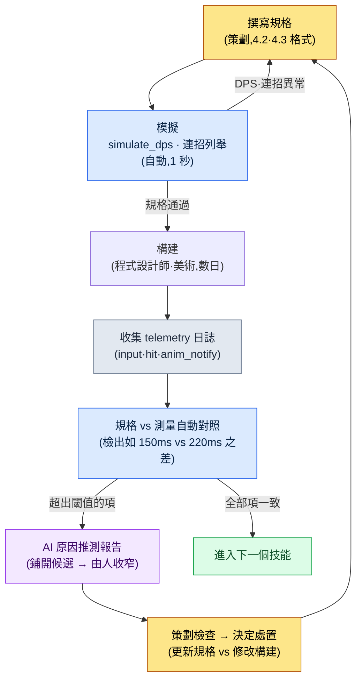

# 4.4 AI 輔助戰鬥模擬與驗證

戰鬥 TF 的構建 #234 剛剛提交。這是第一次接觸新技能 `skill_thunder` 的構建。規格書上寫著命中時機為 150ms。我輸入指令。指尖的感覺告訴我:慢了,分明慢了。我叫來鄰座的團隊成員 A:「這個是不是有點延遲?」成員 A 試著打了兩下:「嗯……好像確實有點。」兩個人都沒把握。規格說是 150,可手感卻咬定是 200 左右。誰對?指尖與紙面的較量。下一個構建裡,又會有人說「體感上還行吧」,而就因為這一句話,又一個構建悄悄流過去了。

本章的目標就是終結這場較量。如果指尖說是 200,那就用數字證明它到底是不是真的 200。而且,要在構建提交*之前*,光看規格就能預先知道「這個技能的 DPS 比目標高出 30%」。在帶領 200 人投入的 3A 級 MMORPG、從早期就開始打磨戰鬥的那段日子裡,感覺與數字相左時的那份無措感也是一模一樣的。改變的只有一點:如今手裡有了能用數字給這種偏差收尾的工具。

如果說 4.2、4.3 講的是如何*書寫*戰鬥的規格,那麼 4.4 講的就是這份規格是否*按意圖運作*。驗證有兩條軸線。一條是不依賴構建、僅靠計算來驗證的模擬,另一條是從實際構建的錄影中提取測量值的捕獲分析。當兩條軸線扣成一個迴圈,戰鬥策劃的迭代次數就會從以天計縮短到以小時計。

先把結論說在前面:本章的核心,就是*把規格書上寫的數字(150ms)和構建中測得的數字(220ms)並排放在一起,讀出兩者的差異*(4.4.5)。前面幾節(模擬器、連招列舉)可以讀作讓這種對照成為可能的準備步驟。

---

## 4.4.1 等待構建的代價

戰鬥策劃要驗證一個新技能,會發生什麼事?

策劃寫規格。程式設計師錄入資料,美術接上動作與特效,構建跑一遍,QA 過一輪,這才輪到策劃親手上手試。快則兩天,通常三四天。如果在迴圈*末尾*才發現「DPS 太高了」,這個發現就成了一道「回到起點重來」的命令。三四天再來一次。

模擬就是在這個迴圈的*第一步*給出答案的工具。僅憑規格就算一遍。答案不好就改規格,再算一遍。在進入「構建」這個昂貴的階段之前,規格本身先被過濾一次。這就像先把模型車放進風洞裡試一試。在把真車開上道路之前,可疑的設計在桌面上就被淘汰了。

當然,風洞並不能 100% 預測道路。所以才需要第二條軸線——捕獲分析。如果說模擬給出的是*理想的答案*,那麼捕獲給出的就是*構建裡實際發生的答案*。把兩者並排放在一起、讀出差異——這就是本章的全部。

---

## 4.4.2 simulate_dps —— 可執行的模擬器

抽象的虛擬碼什麼也驗證不了。所以從一開始就寫*能跑*的程式碼。下面是筆者在戰鬥 TF 中所用 `simulate_dps.py` 的核心骨架,為了載入本書而剝離了公司資料並加以重構。它不依賴任何外部庫,僅靠 Python 標準庫即可執行(完整檔案參見「動手試試」)。

輸入很簡單。一個技能是帶有 `damage`、`cast_sec`(施法佔用時間)、`cooldown_sec`、`resource_cost` 的 dataclass;一個角色則是帶有資源總量、每秒恢復量、技能列表、優先順序迴圈序列的 dataclass。執行在其上的主體,只有一條簡單的貪心(greedy)規則:「在每一刻可用的技能中,選優先順序最高的那個來釋放」。它既不比真實玩家聰明,也不比真實玩家笨,目的只是抓住一個*理想上限*。只摘出充當脊柱的那部分,就是這樣:

```python
# 以 0.05 秒為一個 tick 構建時間軸。若不在施法中,則按優先順序順序選取第一個可用技能釋放。
while t < duration_sec:
    resource = min(char.max_resource, resource + char.resource_regen * tick)
    for name in cooldowns:
        cooldowns[name] = max(0.0, cooldowns[name] - tick)
    if t >= busy_until:                     # 施法動作未結束則等待
        for name in char.rotation:          # 按優先順序順序
            s = skill_by_name[name]
            if cooldowns[name] <= 0 and resource >= s.resource_cost:
                total_damage += s.damage
                resource -= s.resource_cost
                cooldowns[name] = s.cooldown_sec
                busy_until = t + s.cast_sec  # 在此時刻之前無法使用下一個技能
                break
    t += tick
# …(dataclass 定義、warrior 輸入、輸出迴圈參見「動手試試」的完整程式碼)
```

把 `skill_thunder`(傷害 420、施法 0.9s、冷卻 6s)設為 warrior 的第一優先順序,`skill_dash`、`basic_1` 排在其後,跑 20 秒的結果(`python simulate_dps.py`):

```
平均 DPS: 261.0
  t=  0.0s  skill_thunder  資源=60
  t=  0.9s  skill_dash     資源=47
  t=  1.3s  basic_1        資源=50
  t=  1.6s  basic_1        資源=53
  t=  1.9s  basic_1        資源=55
  ...
```

這個值有什麼意義?意義在於,*不依賴構建*、在 1 秒之內,就知道了 warrior 的理想 DPS 上限約為 261 這一事實。如果目標 DPS 是 180,那麼這份規格就高出了 +45%,過頭了。無需等待構建,現在就可以去調 `damage` 或 `cooldown_sec`。

侷限也要誠實地寫明。這個模擬器不反映玩家的輸入失誤、因移動與閃避產生的空檔、敵人的干擾。所以測量值總是比實際構建偏高。這不是 bug,而是「上限線」這一模擬器定義本身。與實測之間的差距,在 4.4.5 中用捕獲來補上。

> **AI 運用筆記。** 上面的骨架是筆者親手寫的,但要接入新的資源模型(例如怒氣槽在受到傷害時累積的結構)時,要像「請給這個 simulate_dps 加一條受擊時怒氣 +5 的規則。在 tick 迴圈內,作為獨立於現有資源恢復的變數」這樣*引用現有程式碼*來提出請求。如果讓它從白紙生成整個模擬器,只會得到無法驗證的程式碼。脊柱由人來定,AI 來添枝。

---

## 4.4.3 連招路徑的自動列舉

僅憑 DPS 一個數字還不夠。要驗證「哪條連招是設計意圖中的主連招」,就得*把所有可能的路徑*展開來看。用手畫樹,到了七八個節點腦子就已經爆了。把路徑不重不漏地展開,這件事機器壓倒性地比人做得好——只是,得讓它以人能夠回溯檢查的形式來產出。

下面是一段接收連招圖、列舉所有路徑並按 DPS 排序的程式碼。`combo_graph` 用鄰接表記錄「某個動作之後可以取消接入哪個動作」,它直接從 4.3 的狀態機規格中提取而來。核心是遞迴展開直到死路盡頭的 `all_paths` 生成器。

```python
# enumerate_combos.py —— 展開連招圖的所有路徑並按 DPS 排序
combo_graph = {"start": ["A"], "A": ["B", "D"], "B": ["C", "E"], "D": ["C"], "C": [], "E": []}
action_stats = {  # (傷害, 耗時秒)
    "A": (300, 0.8), "B": (450, 1.0), "C": (450, 1.2), "D": (600, 1.4), "E": (200, 0.6),
}

def all_paths(node="start", path=None):
    path = (path or [])
    nexts = combo_graph.get(node, [])
    if not nexts:                       # 死路盡頭 = 完成的連招
        yield [n for n in path if n in action_stats]
        return
    for nxt in nexts:
        yield from all_paths(nxt, path + [nxt])

results = []
for p in all_paths():
    dmg = sum(action_stats[a][0] for a in p)
    dur = sum(action_stats[a][1] for a in p)
    results.append((p, dmg, round(dur, 1), round(dmg / dur, 1)))

for p, dmg, dur, dps in sorted(results, key=lambda r: -r[3]):
    print(f"{' → '.join(p):<18} {dmg:>5} dmg  {dur:>4}s  DPS {dps}")
```

執行結果:

```
A → D → C            1350    3.4s  DPS 397.1
A → B → C            1200    3.0s  DPS 400.0
A → B → E             950    2.4s  DPS 395.8
```

這裡策劃該讀出的訊號不是簡單的第一名。三條路徑的 DPS 在 396\~400 之間幾乎貼在一起——這是一個訊號:「無論用哪條連招效率都差不多,所以*主連招沒有自己的身份*」。如果意圖是「A→D→C 應當是高風險高回報的主連招」,那就該提升 D 的傷害或縮短其耗時,把 DPS 拉高一檔。該回到規格了。

在這種自動列舉替代手算的地方,即使連招節點增加到 20 個,人也只需讀那張排好序的表。

---

## 4.4.4 構建捕獲分析 —— 現實的方法是 telemetry

現在輪到第二條軸線。這是測量構建中實際發生了什麼的階段。人們常會聯想到「AI 看構建錄影自動分析」,但這裡要誠實地劃分支路。獲取測量值的路徑有三條,而三者的成本與精度差別很大。

<svg viewBox="0 0 720 250" xmlns="http://www.w3.org/2000/svg" font-family="sans-serif" font-size="13">
  <rect x="10" y="20" width="220" height="200" rx="8" fill="#fde8e8" stroke="#c0392b" stroke-width="1.5"/>
  <text x="120" y="45" text-anchor="middle" font-weight="bold" fill="#c0392b">A. 錄影直接分析</text>
  <text x="120" y="72" text-anchor="middle">從螢幕畫素中</text>
  <text x="120" y="92" text-anchor="middle">提取輸入·動作·VFX</text>
  <text x="120" y="124" text-anchor="middle" font-weight="bold">精度:低~中</text>
  <text x="120" y="148" text-anchor="middle">實現難度:非常高</text>
  <text x="120" y="172" text-anchor="middle">幀誤差 ±1~2</text>
  <text x="120" y="200" text-anchor="middle" fill="#777">研究·演示用</text>

  <rect x="250" y="20" width="220" height="200" rx="8" fill="#fef5e7" stroke="#d68910" stroke-width="1.5"/>
  <text x="360" y="45" text-anchor="middle" font-weight="bold" fill="#d68910">B. 現成視覺 API</text>
  <text x="360" y="72" text-anchor="middle">向外部 vision 服務</text>
  <text x="360" y="92" text-anchor="middle">傳送捕獲幀</text>
  <text x="360" y="124" text-anchor="middle" font-weight="bold">精度:中</text>
  <text x="360" y="148" text-anchor="middle">實現難度:中</text>
  <text x="360" y="172" text-anchor="middle">IP 洩露風險</text>
  <text x="360" y="200" text-anchor="middle" fill="#777">需檢查公司內部政策</text>

  <rect x="490" y="20" width="220" height="200" rx="8" fill="#e8f6ef" stroke="#1e8449" stroke-width="1.5"/>
  <text x="600" y="45" text-anchor="middle" font-weight="bold" fill="#1e8449">C. 遊戲內 telemetry</text>
  <text x="600" y="72" text-anchor="middle">引擎將事件</text>
  <text x="600" y="92" text-anchor="middle">連同時間戳一起記錄</text>
  <text x="600" y="124" text-anchor="middle" font-weight="bold">精度:高</text>
  <text x="600" y="148" text-anchor="middle">實現難度:低~中</text>
  <text x="600" y="172" text-anchor="middle">直接使用引擎時刻</text>
  <text x="600" y="200" text-anchor="middle" fill="#1e8449" font-weight="bold">現實的選擇</text>
</svg>

A 方案(錄影畫素分析)聽起來很有吸引力。從螢幕上自動提取輸入顯示、角色動作變化、特效首幀、聲音波形、傷害數字 UI——這五個訊號,這是它描繪的圖景。但實際做出來就會發現,由於幀壓縮噪點、UI 遮擋、動態模糊,±1\~2 幀的誤差是常態。在 60fps 下 1 幀約為 16.7ms。在以 ms 為單位計較命中時機的驗證裡,±33ms 的噪點是致命的。*實現難度非常高,而精度配不上這份努力。*

所以現實的答案是 C 方案,即**遊戲內 telemetry 日誌**。引擎其實早已*在內部精確知曉*輸入時刻、動畫通知(notify)的發生時刻、VFX 生成時刻、傷害應用時刻。與其從畫素中推斷這些時刻,不如讓它用一行日誌記下來即可。與其從畫素中*還原*出 100ms,不如*原樣接收並記下*引擎已知的那 100ms。

```cpp
// 在戰鬥動作處理程式碼中加一行(UE C++ 偽示例)
// 在輸入接收 / 傷害應用時點呼叫同一個 logger
CombatTelemetry::Log("input",  SkillName, GetWorld()->GetTimeSeconds());
CombatTelemetry::Log("hit",    SkillName, GetWorld()->GetTimeSeconds());
```

logger 以 JSON Lines 格式逐行輸出。

```
{"event":"input","skill":"skill_thunder","t":12.340}
{"event":"hit",  "skill":"skill_thunder","t":12.560}
{"event":"input","skill":"basic_3","t":14.100}
{"event":"hit",  "skill":"basic_3","t":14.166}
```

`input` 與 `hit` 的時刻差,就是測得的命中時機。12.560 − 12.340 = 0.220 秒 = **220ms**。這不是畫素分析的 ±33ms,而是引擎時刻原樣的值。把這份日誌取出來與規格對照,就是下一節的內容。

---

## 4.4.5 實操記錄:規格 150ms vs 測量 220ms

現在把兩條軸線匯到一處。規格承諾了 150ms,telemetry 測得了 220ms。+70ms。指尖是對的。把縮小這一差距*成因*的過程,與 AI 一起從頭跟到尾。不做概括,連 AI 一開始踩空、判斷失誤的場面也原樣載入。

### 提示詞

規格說命中時機是 150ms,但測量是 220ms。貼上下面的日誌,以人實際會打字的長度來提問。比起冗長的客套,意圖明確的簡短請求更好——讓它連驗證方法都寫出來的那一行,加上禁止武斷的那一行,就是這段提示詞的脊柱。

> skill_thunder 的命中時機規格為 150ms,但測量為 220ms,超出 +70ms。請用下面的 telemetry 劃分可能的原因,*並寫明各自用哪條日誌來確定/排除*。不要武斷,不確定就標「未確認」。  // 「連驗證方法都寫出來」「禁止武斷」這兩點是核心意圖。其餘客套省略也不影響結果。
>
> ```
> {"event":"input","skill":"skill_thunder","t":12.340}
> {"event":"anim_start","skill":"skill_thunder","clip":"cast_thunder","t":12.340}
> {"event":"anim_notify","skill":"skill_thunder","notify":"HitWindow","t":12.560}
> {"event":"hit","skill":"skill_thunder","t":12.560}
> ```
> 按規格,cast_thunder 的 HitWindow 通知應在 0.150s 位置。

### Claude 原始輸出(第一次 —— 驗證前,含踩空)

> 對於 +70ms 超出,我推測以下四種原因。
>
> 1. **網路延遲。** 輸入往返伺服器時可能多出了 70ms。如果是多人構建,請確認 RTT。
> 2. **幀率下降。** 如果構建以 30fps 執行,1 幀為 33ms,通知時機會被四捨五入到幀邊界,延遲隨之累積。
> 3. **施法動作時長變更。** cast_thunder 片段可能比規格變長,導致 HitWindow 通知被往後推。
> 4. **輸入緩衝延遲。** 輸入佇列可能晚一個 tick 才被處理。
>
> 可能性最高的原因是**第 1 項網路延遲**。70ms 是典型的 RTT 範圍。

### 人工驗證與駁回

在這裡停下,重新看日誌。AI 的第一推測(網路)*在這份日誌裡已被排除*。`input` 與 `anim_start` 恰好打在同一時刻 12.340。這意味著輸入進來的瞬間動作立即開始,沒有網路往返插足的餘地。第 1 項錯了。

第 2 項(幀率)也站不住腳。若是 30fps,本該看到 33ms 單位的參差不齊,可 input→hit 恰好是乾淨的 0.220。這不是幀邊界四捨五入,而是*片段內固定位置*的氣味。

決定性的線索另有所在。`anim_notify` 的時刻在 `anim_start` 基準上 +0.220。規格說 HitWindow 應在片段開始後 0.150,而實際片段裡卻固定在 0.220 位置。也就是說,*要麼片段本身就被做得與規格不同,要麼通知位置從 0.150 被挪到了 0.220*。原因既不是網路也不是幀率,而是**第 3 項,動作/通知資料**。AI 把正確答案的候選包括進了四項之內,但把名次排反了。

### 再次請求的提示詞

把排除依據由人手填好後再扔回去。無需長篇解釋,只把排除掉的和剩下的事實簡短地釘死。

> 排除網路、幀率。(依據:input=anim_start 時刻相同,故輸入→動作無延遲 / input→hit 為 0.220,無幀噪點且穩定。)剩下的事實:anim_notify 在 anim_start +0.220,規格為 +0.150。僅憑這一事實縮小原因,並以*行動為單位*寫明該向程式設計師、動畫師請求什麼。  // 核心是「以行動為單位」——不是推測,而是以「向誰請求什麼」收尾。

### Claude 原始輸出(第二次)

> 根據所給依據,原因可縮小為**動畫片段 cast_thunder 的 HitWindow 通知被放在了 0.220s 而非 0.150s**。剩下兩條分支。
>
> - **(甲)通知對準 0.150,但整個片段變慢了** —— 如果播放速度(play rate)低於規格或片段時長變長,那麼 0.150 位置就會被拉伸到即時的 0.220。
> - **(乙)通知位置本身被挪到了 0.220** —— 片段時長不變,只是標記移動了。
>
> 區分兩條分支的確認方法:
> 1. **向動畫師**:請求 cast_thunder 的 HitWindow 通知幀號、片段總幀數,以及與規格撰寫時點數值相比的變更記錄。如果標記被挪動,則為(乙)。
> 2. **向程式設計師**:確認 skill_thunder 的 montage play rate 是否為 1.0,角色攻擊速度屬性是否會乘到這個片段上。如果 play rate 為 0.68(=0.150/0.220),則為(甲)。
> 3. 在其他角色攻擊速度下再測一次 anim_start→anim_notify 的間隔。若間隔隨攻擊速度變化則為(甲),不變則為(乙)。
>
> 建議處置:若確認為(乙),把通知改回 0.150,或把規格更新為 0.220(取意圖所在的一邊)。若確認為(甲),檢查 play rate 應用邏輯。

這次的輸出值得采納。它沒有把推測當作定論,而是分成了(甲)/(乙)兩條分支,並把*用資料區分每條分支的方法*與*該向誰請求什麼*以行動為單位寫了出來。尤其是第 3 項確認(改變攻擊速度後重新測量)是人容易遺漏的決定性分歧點。把這份報告原樣帶進會議,會議就不再是爭論「原因是什麼」的場合,而成了「在 30 分鐘內確定是(甲)還是(乙)並選定處置」的場合。

這份實操記錄展現的核心,是 AI 並不會一開始就給出正確答案這一事實。第一次輸出是把網路列為首位的踩空。只有當*讀日誌、排除候選的人工驗證*介入,分析才終於收斂到正確答案。AI 把候選鋪得很寬,人來收窄。這一分工就是整個 4.4 的方法論。

---

## 4.4.6 把兩條軸線合成一個迴圈 —— 驗證迴圈

模擬(4.4.2\~4.4.3)與捕獲分析(4.4.4\~4.4.5)若各跑各的,只值一半。當合為一體時,就形成了下面的迴圈。



由於模擬在構建*之前*給出答案,進入構建的規格已經被過濾過一次。所以構建之後發現的問題,性質就從「規格錯了」收窄為「規格與實現相左」。4.4.5 的 +70ms 正是後者——規格 150 是合理的,只是實現偏成了 220。這一區分消除了會議上的責任歸屬之爭。

不過這個迴圈並不能覆蓋所有戰鬥內容。像主 Boss 的招牌演出這種*感覺即內容*的領域,無法被還原成 DPS 數字。模擬擅長基於數值的內容,而演出依然得靠人眼的錄影評審來定奪。迴圈在數值之河裡打轉,演出之河則另自流淌。

---

## 4.4.7 在六個月運營中看到的

這是筆者運營過的某款 MMORPG(以 refgame 系列操作手感為目標的專案A)戰鬥 TF 六個月的測量。下列數值是從 TF 內部記錄中摘出的*實測值*,並說明:構建數、時間是以迴圈為單位四捨五入後的值(不是精確到分鐘,而是以迴圈、半天為單位的測量)。

| 專案 | 引入前 | 引入後 |
|---|---|---|
| 新技能驗證迴圈 | 平均 3\~4 個構建 | 平均 1\~2 個構建 |
| 100 個技能的構建驗證 | 半天(手動) | 30 分鐘(telemetry 自動對照) |
| 數值會議 | 2 小時(主觀討論) | 30 分鐘(基於資料) |
| 構建前夕發現的缺陷 | 平均 5\~8 件/構建 | 平均 1\~2 件/構建 |

比數字更重要的變化,是會議的*性質*。引入前,會議有一半是「這個技能太強了」對「不,正合適」。指尖對指尖的較量。引入後,那個位置變成了「測量 DPS 比目標高 +12%,測量命中時機比規格高 +70ms。是縮短動作,還是把傷害降 10%?」從爭論*問題是什麼*的時間,轉變為決定*怎麼修*的時間。

這一轉變的代價也誠實地寫明。把 telemetry logger 植入戰鬥程式碼全域性的初期工作約 1\~2 周,把規格 schema 統一到全部角色與技能上又額外耗了一個季度。第一個季度裡,我認為模擬與 telemetry 兩者只要有一個跑起來就夠了。兩者扣成一個迴圈,是從第二個季度才開始的。

---

## 4.4.8 常見錯誤與規避

有五種反覆出現。

第一,絕對信任模擬值。simulate_dps 的 261 是*上限*,不是實測。不與 telemetry 比較的話,就總會高估。

第二,不做測量。只對規格做模擬、卻不用 telemetry 看構建,4.4.5 那樣的 +70ms 就會悄悄累積。telemetry 日誌記錄不是選項,而是戰鬥程式碼的基礎設施。

第三,不把報告帶進會議。即使自動報告已經擺在那兒,只要它不在會議議程上,就沒人會看。把「本次構建 telemetry 對照表」作為議程的固定項納入。

第四,不經驗證就採納 AI 的推測。正如 4.4.5 所見,AI 的第一次推測是踩空的。AI 是拓寬候選的工具,不是下結論的工具。絕不跳過「用日誌排除候選」這道由人來做的步驟。

第五,每個技能的規格結構都不一樣。如果某個技能把 `cast_sec` 寫成 `cast_time`、另一個寫成 `castMs`,那模擬器也好、對照指令碼也好,每次都會崩。把一份共同的規格 schema 強制到所有技能上——這是 4.4 整套工具得以運轉的前提。

第一個季度不必把五個全都搞定。哪怕隻立住一兩個,迴圈也會明顯變短。其餘的會在迴圈轉動中自然補上。

---

## 4.4.9 Part 4 收尾

4.1\~4.4 依次講了戰鬥策劃的座標、Look & Feel、連招、模擬。4.1 講戰鬥策劃把什麼視作可測量的物件,4.2 講如何測量與調整命中時機、頓幀、特效同步,4.3 講如何把連招、取消、輸入佇列寫成狀態機,而 4.4 講這一切規格是否按意圖運作、如何在不依賴構建/在構建中加以驗證。

讀完 Part 4 的戰鬥策劃,一週會這樣改變。週一,新技能規格上掛載 simulate_dps 自動驗證。週二,用連招路徑自動列舉檢查主連招的身份。週三,構建提交後 telemetry 對照表自動彈出。週四,基於資料的討論 30 分鐘。週五,修訂下個迴圈的規格。構建迴圈從 3\~4 次減到 1\~2 次,會議縮短到一半以下。打擊感這一抽象之物,轉移到了可測量的 220ms。

而構建 #234 的那一幕——對於「這個是不是有點延遲?」這個問題,如今由 telemetry 日誌替我們回答說「是 220ms」。指尖與紙面的較量,結束了。

下一個 Part 5 是敘事策劃。它將進入 2.3 中介紹的 NarrativeDocs Layer 0\~4 結構的正式應用案例。

---

## 動手試試

**setup.**
1. 請把下面的 `simulate_dps.py` 整段原樣寫出來。無依賴,用 `python simulate_dps.py` 即可立即執行,並復現 4.4.2 的「平均 DPS: 261.0」。

```python
# simulate_dps.py —— 不依賴構建、僅憑規格計算 DPS
from dataclasses import dataclass

@dataclass
class Skill:
    name: str
    damage: float          # 單次命中傷害
    cast_sec: float        # 施法(動作佔用)時間(秒)
    cooldown_sec: float    # 再次使用的冷卻時間(秒)
    resource_cost: float   # 資源消耗(MP/氣力)

@dataclass
class Character:
    name: str
    max_resource: float
    resource_regen: float  # 每秒資源恢復
    skills: list           # list[Skill]
    rotation: list         # 優先順序順序(技能名)

def simulate_dps(char: Character, duration_sec: float, tick=0.05):
    cooldowns = {s.name: 0.0 for s in char.skills}   # 剩餘冷卻
    skill_by_name = {s.name: s for s in char.skills}
    resource = char.max_resource
    total_damage = 0.0
    busy_until = 0.0          # 施法動作結束的時刻
    log = []
    t = 0.0
    while t < duration_sec:
        resource = min(char.max_resource, resource + char.resource_regen * tick)
        for name in cooldowns:
            cooldowns[name] = max(0.0, cooldowns[name] - tick)
        if t >= busy_until:   # 若不在施法中則選取下一個技能
            for name in char.rotation:          # 按優先順序順序
                s = skill_by_name[name]
                if cooldowns[name] <= 0 and resource >= s.resource_cost:
                    total_damage += s.damage
                    resource -= s.resource_cost
                    cooldowns[name] = s.cooldown_sec
                    busy_until = t + s.cast_sec
                    log.append((round(t, 2), name, resource))
                    break
        t += tick
    return total_damage / duration_sec, log

if __name__ == "__main__":
    warrior = Character(
        name="warrior", max_resource=100, resource_regen=8,
        skills=[
            Skill("skill_thunder", damage=420, cast_sec=0.9, cooldown_sec=6, resource_cost=40),
            Skill("skill_dash",    damage=180, cast_sec=0.4, cooldown_sec=3, resource_cost=20),
            Skill("basic_1",       damage=60,  cast_sec=0.3, cooldown_sec=0, resource_cost=0),
        ],
        rotation=["skill_thunder", "skill_dash", "basic_1"],
    )
    dps, log = simulate_dps(warrior, duration_sec=20)
    print(f"平均 DPS: {dps:.1f}")
    for t, name, res in log[:8]:
        print(f"  t={t:>5}s  {name:<14} 資源={res:.0f}")
```

2. 請在戰鬥引擎程式碼的輸入接收點、傷害應用點各加一行 telemetry 日誌(4.4.4)。把引擎時刻(`GetTimeSeconds` 等)原樣記下來是關鍵。

**prompt.** 請從構建 telemetry 中挑一個與規格相左的項,按 4.4.5 的格式向 AI 提問——貼上日誌摘錄,並務必包含「不要把推測當定論,要寫明各原因的驗證方法,不確定就標為未確認」。

**verify.** *不要原樣採納* AI 的第一次輸出。請親自讀日誌,用手抹掉可排除的候選(像 4.4.5 排除網路、幀率那樣),附上依據後再次請求。當最終報告以「原因推測 + 向誰請求什麼」的行動為單位收尾時,再把它帶進會議。

**單人精簡版。** 如果全域性安裝 telemetry logger 有負擔,就只在你要驗證的*那一個技能*上打 input、hit 兩行。simulate_dps 也只看那一個技能的 DPS。不要鋪開整套工具,先用最可疑的一個技能把迴圈轉一圈,再擴充套件。

---

### 本章要點
- 模擬在構建前計算規格的理想上限,把以天計的驗證縮短為以小時計
- 構建測量靠的不是錄影而是 telemetry 日誌更現實,把引擎時刻原樣記下來
- AI 是拓寬原因候選的工具,而用日誌收窄候選的驗證是人的職責
