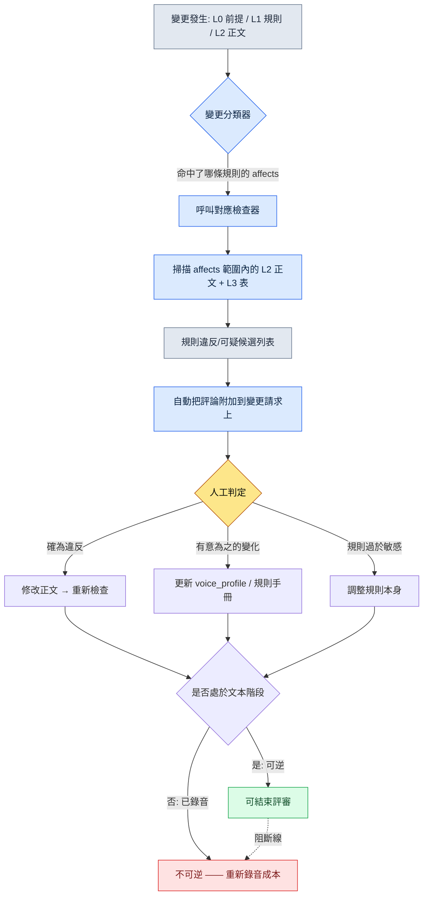

# 5.2 世界觀 → 角色 → 任務 的一致性驗證

臨近 Beta，QA 提交了一份 Bug 報告。標題是"國王說話不用敬語"。正文很短："在 3.4 的開場過場動畫裡，K_001（國王）對玩家說了'喂，等一下'。這個角色從 1.1 到 3.3 一直用的是'閣下'。"

我去問編劇，得到的答覆出乎意料。"那句臺詞不是我寫的。"追查之後才發現，是一位外包編劇在趕工填補一條過場動畫分支時隨手加進去的。我們的角色聖經（character bible）裡本來就有 voice_profile，但那位外包編劇從沒看過那份文件。規則在文件裡，臺詞卻從文件外進來了。

這就是一致性事故的本質。它不是因為沒有規則，而是因為規則沒能一路跟進到正文裡。而如果這一句話出現在過場動畫裡，那就更可怕了。過場動畫通常會配上配音錄製。如果只是文本，改一次就完事；可一旦錄完音才發現，就會帶來重新召集配音演員、重新錄音、重新混音這種不可逆的成本。一致性驗證真正的目的，是"在錄音之前"把問題揪出來。

本章講的就是如何用規則手冊和檢查器、而不是人眼，來揪出這類事故的工作流。我們會原樣看真實產出：lore_consistency_rule 規則手冊如何成為檢查器的輸入，voice_lint 如何把語氣波動挑成可疑候選，以及為什麼最終判定無論如何都要留在人的位置上。

---

## 5.2.1 一致性事故是從哪裡漏出去的

把上線 RPG·MMORPG 的使用者評論彙總起來看，敘事一致性事故會收斂成幾種固定模式。種類看似不同，原因卻幾乎只有一個。

- **世界觀矛盾**：1.1 裡"魔法被禁止了" → 1.3 裡 NPC 卻若無其事地使用魔法
- **語氣波動**：同一個 NPC 在不同章裡說話方式、敬稱發生變化（前面那個"國王不用敬語"的事故）
- **時間線衝突**：已經死掉的 NPC 在後半段又完好無損地重新登場（死亡標記同步缺失）
- **獎勵與敘事不一致**：敘事上是"國王御賜之劍"，資料上卻是隨處可見的雜貨道具
- **勢力關係矛盾**：剛剛宣佈與 A 勢力敵對，A 勢力的 NPC 就緊接著熱情地打起招呼

這五種看上去像是五種不同的事故，但追查下去，它們都從同一個地方漏出去。是 Layer 0（世界前提）或 Layer 1（規則）變了，而這個變更沒有傳播到 Layer 2（正文）和 Layer 3（資料表）。規則更新了，正文卻還停留在舊規則之上。

想靠人工評審來堵住它是不現實的。一個章節裡牽連著 50 名 NPC、2,000 行臺詞、30 個任務，當你改動一行規則時，要讓人去 100% 追蹤它的影響波及到哪裡，這是不可能的。漏掉的那一行在評審階段不會被抓到，會在上線後的評論區裡被抓到。

可話說回來，自動檢查也並不能保證 100%。關鍵在於職責分工。**自動檢查負責快速挑出可疑候選，判定由人來做。** 自動化的目的是減少人工評審的時間，而不是取消人。一旦這個前提被模糊掉，後面要講的所有失敗都會接踵而至。

---

## 5.2.2 lore_consistency_rule —— 餵給檢查器的規則手冊

專案A 的 L1 文件之一就是 `lore_consistency_rule.md`。這份文件既是供人閱讀的指南，同時也是檢查器解析的輸入。frontmatter 裡的 `atoms` 和 `affects` 把這兩個角色綁在了同一份文件上。

```markdown
---
title: 世界設定（lore）一致性規則
layer: L1
atoms:
  - lore_check_world_rule
  - lore_check_character_voice
  - lore_check_timeline
  - lore_check_faction_relation
related:
  derives_from: [world_premise, narrative_pillar]
  affects: [main_quest/*, character_bible/*, dialogue_id_table]
---

## 1. 世界規則（World Rule）
- 起始狀態下魔法被禁止 → 使用魔法時需註明（時點、使用者、正當理由）
- 神處於沉默狀態 → 禁止描寫其直接回應（允許夢境·幻象）

## 2. 角色語氣規則
- 強制參照每個角色的 voice_profile
- 撰寫新臺詞時須遵守 voice_profile 的 5 個專案（詞彙、句子長度、敬稱、情感表達、禁忌表達）

## 3. 時間線規則
- 所有 NPC 都要定義 status_timeline（存活 / 受傷 / 死亡 / 失蹤 / 位置變更）
- 在臺詞·登場時點自動核查 status_timeline

## 4. 勢力關係規則
- 記錄 faction_relation_matrix 的變更時點
- 變更之後的臺詞要反映新的關係
```

`affects` 這一行定義了檢查器的掃描範圍。一旦 world_premise 發生變化，檢查器就會把 `main_quest/*`、`character_bible/*`、`dialogue_id_table` 全部重新過一遍。過去要靠人在腦子裡追蹤"影響會波及到哪裡？"的工作，現在由寫在規則手冊裡的依賴關係圖來代替。

voice_profile 是這份規則手冊所引用的另一份 L2 資產。一個角色的畫像，其各個專案都以數值化·列舉型的方式錄入，以便檢查器拿來作為比較基準。

```yaml
# character_bible/K_001_voice_profile.yaml
character_id: K_001
display_name: 國王
voice_profile:
  vocabulary_register: 古風_正式         # 詞彙等級
  avg_sentence_len: 18                   # 平均句子長度（字）
  honorific: "閣下"                      # 第二人稱敬稱（固定）
  emotion_expression: 剋制               # 情感外露程度
  forbidden_terms: ["喂", "等一下", "哈"] # 禁忌表達
```

有了這份 yaml，"國王不用敬語"這件事才會從人的直覺變成機器可比較的專案。honorific 是"閣下"，臺詞裡卻出現了"喂"，那它就不是意見，而是規則違反的候選。

---

## 5.2.3 一致性驗證流程

變更發生的那一刻，檢查器就被觸發。流程如下。



最後那個分支才是本章隱藏的脊柱。所有一致性判定都**必須在文本階段、也就是可逆階段就結束**。一旦評審推到錄音·選角之後，修改就變成不可逆的了。所以 voice_lint·timeline_lint 這類檢查器，關鍵不在於跑得"快"，而在於跑得"早"。過場動畫臺詞在進入錄音佇列之前，至少要通過一次。

檢查器共有四種，各自與規則手冊的一個章節一一對應。

- `world_rule_lint.py` —— L1 世界規則 + 所有 L2 正文 → 魔法使用·神回應等違反候選
- `voice_lint.py` —— voice_profile + dialogue_id_table → 語氣波動的可疑臺詞
- `timeline_lint.py` —— npc status_timeline + 所有臺詞·登場時點 → 死亡 NPC 重新登場等衝突
- `faction_lint.py` —— faction_relation_matrix + dialogue tone → 關係矛盾的臺詞

四個檢查器都不是 100% 準確。所以輸出的名字不叫"違反"，而叫"可疑候選"。

---

## 5.2.4 實操記錄（worked transcript）：把 voice_lint 跑一遍

光說"有檢查器"這種抽象的話，沒什麼感覺。我們實際跑一遍。下面是復現前面"國王不用敬語"事故的輸入。

**setup** —— 從 dialogue_id_table 取出兩行待檢查臺詞。

```
dialogue_id_204  speaker=K_001  text="喂，等一下啊。你先說。"
dialogue_id_217  speaker=K_007  text="……該死，又失敗了。從頭再來。"
```

**prompt** —— 檢查器本體是基於規則跑的（正則·長度比較·禁忌詞匹配）。AI 只接在"為什麼可疑"這一處——用編劇能讀懂的自然語言來解釋。檢查階段的 LLM 提示詞全文如下。

```
這些是 voice_lint 挑出來的可疑候選。不要下判定，只針對每個候選，
用 1~2 句話說明它似乎違反了哪個 voice_profile 專案以及依據。
不要斷言"違反了/沒違反"，只說到"疑似……"為止。

[voice_profile]
K_001: honorific="閣下", avg_sentence_len=18, forbidden=["喂","等一下"]
K_007: forbidden=["該死"]

[可疑候選]
- dialogue_id_204 (K_001): "喂，等一下啊。你先說。"
- dialogue_id_217 (K_007): "……該死，又失敗了。從頭再來。"
```

**Claude 原始輸出**（不作概括·整理，原樣照錄）

```
[dialogue_id_204 / K_001]
這句臺詞疑似與 honorific 專案衝突。voice_profile 將第二人稱敬稱
固定為"閣下"，而本句使用了"你"，敬稱本身並未體現出來。此外，
forbidden_terms 中的"喂"和"等一下"都出現了，疑似偏離了詞彙等級
（古風_正式）。與平均句子長度 18 字這一基準看上去沒有直接牴觸，
但語氣本身變得隨意，這一點疑似是違反訊號。

[dialogue_id_217 / K_007]
forbidden_terms 中的"該死"被原樣使用，疑似違反禁忌表達專案。
不過由於 K_007（學者）的 emotion_expression 專案未給出，僅憑
現有資訊難以判斷這一表達是有意的情緒高漲還是單純的越界。
判定需要編劇來審查。
```

這段輸出裡有我們故意留下的兩處誠實。第一，在 204 上 AI 說"平均句子長度看上去沒有直接牴觸"，**沒有把不違反的專案硬說成違反**。第二，在 217 上 AI 承認"emotion_expression 專案未給出，難以判斷"，**承認資訊不足並把判定交給了人**。如果 AI 把所有可疑都強推成"確定違反"，那才是更危險的檢查器。

**verify** —— 編劇在變更請求裡原樣收到這條評論。判定由編劇來做。

- 204：確為違反。這是外包編劇沒看 voice_profile 就加進去的臺詞 → 修改正文，重新檢查
- 217：有意為之的違反。這是 K_007 在 3.4 崩潰時情緒高漲的臺詞 → 在 voice_profile 中加上 `emotion_peak_exception` 標記，把 217 登記為例外

兩個候選是同一個檢查器挑出來的，結局卻完全相反。一個是改正文，一個是改規則。機器無法自動完成這個分叉，正是下一節的要點。

---

## 5.2.5 為什麼判定是人的位置

檢查器只挑到可疑為止、把判定交出去，有三個理由。

第一，**存在有意為之的違反。** 在角色崩潰或轉變的章節裡，語氣會被有意地動搖。上面的 217 就是如此。自動拒絕型的檢查器會把編劇的演出意圖給擋掉。

第二，**規則本身在進化。** 如果同一類可疑總是被判定為"有意為之的變化"，那就是規則跟不上現實的訊號。檢查結果不只是讓人去改正文，也讓人去改規則手冊。

第三，**新角色·新勢力需要一個學習區間。** voice_profile 才填了兩三個專案的新 NPC，冒出很多可疑是正常的。在這個時期如果上了自動拒絕，編劇就會把檢查器當成敵人。

自動檢查和人工判定的邊界足夠清晰，檢查器才能活下來。要是做成自動拒絕型，一個月之內編劇們就會說"把這玩意兒關了吧"。這就像給公司大門裝一個太過靈敏的自動感應器，每次有人經過門就關上，最後總會有人把感應器拆掉。檢查器不該是關門的裝置，而該是"有人從這裡經過了"的提示裝置。

再補充一個註腳。評審必須在文本階段結束這條原則（前面流程圖裡的阻斷線），同樣適用於人工判定。編劇的"有意為之的違反"判定也得在錄音之前完成。錄音之後再翻案，問題就不再是檢查器的問題，而變成了工序成本的問題（可逆/不可逆邊界的全貌見 5.4.5）。

---

## 5.2.6 測量 —— 6 個月前後

在專案A 中，我們分階段引入了 4 種檢查器，並測量了 6 個月。下面是基於實測日誌，但用方向·比例代替絕對值來呈現的（公司內部測量，非作者推測）。

- **單個章節的評審時間**：引入前約 5 天 → 引入後約 2 天（不到一半）
- **上線後發現的一致性事故**：每章 3\~5 件 → 0\~1 件
- **每位編劇的單章產出速度**：4 周 → 2.5 周
- **規則手冊（L1）的更新頻率**：每季度 1\~2 次 → 每月 1\~2 次

最後一項最有意思。有了檢查器，規則就算頻繁修改也很安全。改一行規則，它的影響會被自動視覺化，於是變更的恐懼減少了，規則進化得更快了。一致性工具真正的效果，與其說是"減少了事故"，不如說更接近於"能夠無所畏懼地修改規則了"。

不過，上面這些數字是 4 種檢查器全部運轉時的數字。更重要的一點是，在引入初期，光是 voice_lint 一個就已經產生了可見的效果。沒必要一開始就把 4 種全都開啟。

---

## 5.2.7 把 AI 放在哪裡

自動檢查器的本體，基於規則更高效。同樣的輸入要得到同樣的結果，信任才會積累，而 LLM 是非確定性的，不適合放在那個位置。AI 放進另外四個位置。

- **規則違反候選的探測** → 規則（正則·關鍵詞·長度·結構檢查）。不用 LLM
- **可疑候選的依據說明** → LLM。就是上面實操記錄裡看到的"為什麼可疑"的自然語言說明
- **替代臺詞的初稿生成** → LLM。供編劇審查的初稿，定稿由編劇決定
- **voice_profile 自動更新候選的建議** → LLM。從數十章正文中提取模式，給出專案補強方案

規則快速且確定，LLM 擅長說明與生成。把這兩者的角色混在一起，兩邊都會壞掉。把檢查交給 LLM，就會出現同一句臺詞昨天通過、今天卻被攔下的情況；把說明交給正則，就只能得到"honorific 專案違反"這種機器語。

---

## 5.2.8 引入順序與常見失敗

一開始就把 4 種檢查器全做出來，負擔會先於效果到來。推薦的順序是從最便宜·效果最大的開始。

1. **voice_profile 5 專案標準化**（約 1 個月）—— 先把 character_bible 的格式落地。這件事比檢查器更優先
2. **voice_lint 最小版本**（約 1 周）—— 只做禁忌詞彙匹配。光是攔住一個詞，上線後的社交媒體事故就能每季度減少 1\~2 件
3. **timeline_lint**（1\~2 周）—— 死亡標記核查。哪怕只抓住死掉的 NPC 重新登場，體感也很大
4. **world_rule_lint + faction_lint**（1\~2 個月）—— 剩下的兩種
5. **LLM 輔助**（再加 1\~2 個月）—— 整合說明·初稿生成

要強調的一點是，光是第 2 步（voice_lint）效果就已經很大。前面那個"國王不用敬語"的事故，正是靠這一步就能抓住的型別。

引入過程中反覆出現的失敗也幾乎是固定的。

- **做成了自動拒絕型** → 退回到"可疑候選 + 人工判定"的結構
- **規則手冊與編劇脫節運營** → 規則手冊的變更必須經編劇達成共識，並讓編劇能夠提出修改規則手冊的請求
- **voice_profile 流於形式** → 先用 1 名角色把 5 個專案完整填滿，再擴充套件
- **不知道檢查結果在哪裡** → 強制把檢查結果自動附加到變更請求的評論裡
- **讓 LLM 去做檢查本身** → 檢查交給規則，只把說明交給 LLM
- **錄音之後才評審** → 評審在文本階段結束。不越過可逆區間

最後一項比前面所有專案都貴。別的失敗丟的是時間，這個失敗丟的是配音演員的檔期。

---

下一章（5.3）講的是不靠檢查器，而靠 AI 輔助來撰寫敘事正文的流程。我們會看到如何把 L0 語氣和 L1 規則作為上下文注入，讓 AI 給出的不是泛泛的答案，而是屬於我們這個世界的答案。

---

### 本章要點
- 一致性事故不是因為沒有規則，而是因為規則沒能傳播到正文裡才產生。
- 檢查器只挑到可疑為止，判定由人來做，檢查器才不會被廢棄。
- 所有一致性評審都必須在錄音前的文本（可逆）階段結束。

### 下一章預告
- 5.3. AI 輔助敘事寫作 —— 注入 L0 語氣·L1 規則上下文

---

## 動手試試

**setup** —— 從 character_bible 裡挑 1 名角色，用 yaml 把 voice_profile 的 5 個專案（詞彙等級·平均句子長度·敬稱·情感表達·禁忌表達）完整填滿。再從 dialogue_id_table 裡抽出這個角色已有的 10 行臺詞，彙集到一個檔案裡。

**prompt** —— 原樣使用上面實操記錄裡的檢查輔助提示詞。核心是兩條約束："不要下判定"和"只說到疑似……為止"。在輸入裡附上 voice_profile yaml 和那 10 行臺詞。

**verify** —— 把輸出的可疑候選逐行自己判定一遍。如果是真違反就改正文，如果是有意為之的變化就在 voice_profile 里加上例外標記。同時確認 AI 是否把"不違反的專案"也硬說成違反，是否承認"資訊不足"。如果 AI 把所有專案都斷言為違反，就強化提示詞裡"不要下判定"的約束。

### 單人精簡版

如果你是既沒有 4 種檢查器、也沒有規則手冊的單人開發者，不要檢查器本體，光靠一條提示詞也能達到同樣的效果。只需手動維護每個角色的 voice_profile yaml，每寫一條新臺詞，就把該角色的 yaml + 新臺詞附到上面那條輔助提示詞裡，去拿到"可疑候選"。雖然沒有自動化，但**判定靠人、AI 負責說明**這個核心結構照樣活著。只要守住一條就行——在交給錄音·語音合成之前，讓這道審查走一遍。不越過可逆階段這條原則，與團隊規模無關。
