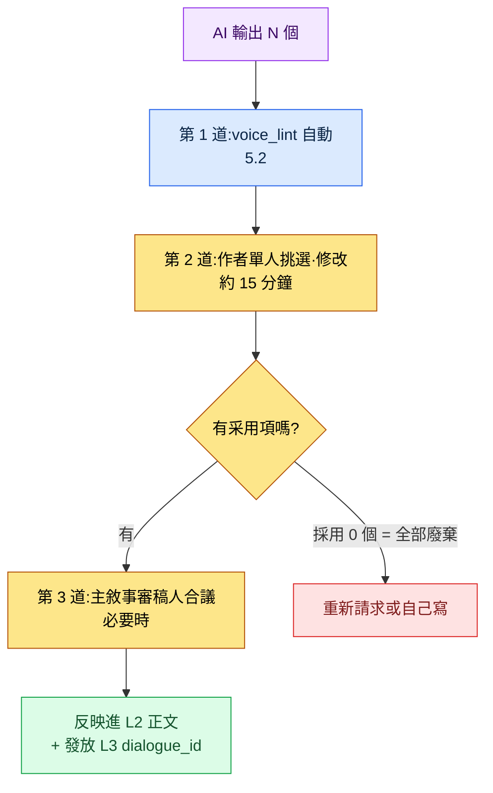
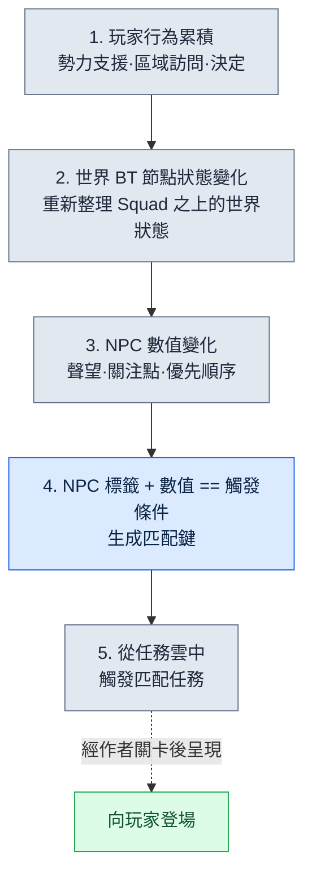

# 5.3 AI 輔助敘事寫作

那天我在為一個新的支線 NPC 草擬第一句臺詞。我在空白的聊天框裡敲下"幫我寫 5 句村莊鐵匠 NPC 的臺詞"。5 秒後,螢幕上跳出"勇士啊,把你的武器交給我吧"。那不是一種似曾相識,而是一種我幾乎能說出確切在哪兒見過的句子。把同樣的提示詞放進別的團隊的別的遊戲裡,也會得到一模一樣的回答。那一刻我意識到的並不是模型弱,而是我什麼都沒告訴模型——我沒讓它瞭解我們的遊戲。

AI 很會寫一般化的奇幻句子。可它寫不出我們這個世界的句子。差別只有一個,就是上下文注入。每次請求時把 L0 基調和 L1 規則一併送進去,AI 吐出的那一行就會從"似曾相識的句子"變成"這個遊戲的句子"。本章講的是把這種注入按四層來運營的實務,最後把同一原理拔高到世界模擬的規模,把更進取的應用(世界 BT(BehaviorTree,行為樹)+ 任務雲)作為研發最前沿來點明。

---

## 5.3.1 上下文為空時會發生什麼

在敘事領域,AI 輔助是匯入最快、也最快失去信任的環節。因為它的失敗模式幾乎一模一樣。

你扔一句"給我 5 句任務開場臺詞",回來的就是 5 種以"勇士啊,我們村子……"開頭的一般化奇幻句。你說一句"幫我改改這個角色的臺詞",聲音就被抹平,所有 NPC 都收斂成相似的語氣。你說一句"幫我寫第 1 章梗概",拿到的就是你見過的那些 RPG 梗概的平均值。

問題不在模型,而在上下文是空的。模型輸出的是訓練資料的平均值。不想要平均值,就得給它一個能遠離平均值的線索。本章的主題就是這個線索怎麼造、怎麼注入。

在筆者運營的 MMORPG 專案(以下稱專案A)裡,敘事 AI 輔助會按順序堆疊四層上下文。5.1 中把 NarrativeDocs 拆解為 Layer 0\~4 的那套結構,在這裡被原樣複用為注入單元。

<svg viewBox="0 0 720 300" xmlns="http://www.w3.org/2000/svg" font-family="sans-serif">
  <rect x="20" y="20" width="680" height="46" rx="6" fill="#1f2d3d"/>
  <text x="40" y="40" fill="#fff" font-size="14" font-weight="bold">Layer A · 系統提示詞</text>
  <text x="40" y="58" fill="#9fb3c8" font-size="11">作者人設 · 禁忌(幾乎不變,定義一次)</text>

  <rect x="20" y="78" width="680" height="46" rx="6" fill="#27496d"/>
  <text x="40" y="98" fill="#fff" font-size="14" font-weight="bold">Layer B · L0 願景</text>
  <text x="40" y="116" fill="#bcd4e6" font-size="11">world_premise · narrative_pillar · tone_manifesto (≈7,000 tok,快取)</text>

  <rect x="20" y="136" width="680" height="46" rx="6" fill="#2e6171"/>
  <text x="40" y="156" fill="#fff" font-size="14" font-weight="bold">Layer C · L1 規則(擇需注入)</text>
  <text x="40" y="174" fill="#cfe8df" font-size="11">只挑出與任務相關規則的 _summary 節(快取)</text>

  <rect x="20" y="194" width="680" height="46" rx="6" fill="#3e885b"/>
  <text x="40" y="214" fill="#fff" font-size="14" font-weight="bold">Layer D · L2 鄰近正文</text>
  <text x="40" y="232" fill="#e3f2e8" font-size="11">同一角色的上一句臺詞 · 同一章梗概(原樣不動,每次都變)</text>

  <rect x="180" y="254" width="360" height="36" rx="6" fill="#c0392b"/>
  <text x="200" y="277" fill="#fff" font-size="13" font-weight="bold">任務指令:"此時此刻 K_007 的臺詞 3 案"</text>

  <line x1="360" y1="66" x2="360" y2="78" stroke="#888" stroke-width="2"/>
  <line x1="360" y1="124" x2="360" y2="136" stroke="#888" stroke-width="2"/>
  <line x1="360" y1="182" x2="360" y2="194" stroke="#888" stroke-width="2"/>
  <line x1="360" y1="240" x2="360" y2="254" stroke="#888" stroke-width="2"/>
</svg>

四層並不是每次都全部塞進去。按任務型別只取出需要的層。如果是一個角色的下一句臺詞草稿,A + B(只要基調)+ D(那個角色最近的 10 行臺詞)就夠了。如果是新支線任務的梗概,就追加 C(quest 結構規則)。如果是分支結果 4 案,C(分支規則)+ D(分支前的整段正文)就會變重。這就好比從書桌上的檔案櫃裡,按任務大小挑出人設表、世界觀一行、規則手冊某頁、鄰近正文一沓,再發出去。

---

## 5.3.2 一段實操記錄(worked transcript)—— K_007 的第一句情感臺詞

> 實操記錄(worked transcript)= 完整保留的真實操作過程記錄。

與其用抽象去講,不如把一次真實請求從頭跟到尾。這次的任務是為同一個角色(學者型 NPC,公司內部 ID `K_007`)第一次需要流露情感的場景,草擬 3 案臺詞。先從提示詞全文開始。

**發出的提示詞(Layer A + B(基調)+ D + 任務指令 + 輸出格式):**

```
[系統]
你是專案A 的敘事作者。不要用"勇士""被選中者"這類 RPG 套話,
語氣照著下面這幾句上一段臺詞的基調走。不知道的設定別瞎編,
就回答"憑上下文無法判斷"。你只寫草稿,決定由我來做。

[L0 基調 —— tone_manifesto 摘錄]
這個世界的情緒基調是剋制。人物不會輕易把感情說出口。
情感不是爆發,而是以裂痕的方式顯露。多用省略與短句。

[參考 —— K_007 的上 5 句臺詞(按時間順序,原樣不動)]
1. "……這事我也是頭一回聽說。"
2. "有記錄嗎?沒有的話就得懷疑。"
3. "在確定之前,先別動。"
4. "我的意見就這些。"
5. "……抱歉。我是不是太冷淡了。"

[情境]
同伴 NPC 受傷歸來。學者第一次必須流露情感。

只要 3 案,每案不超過 25 字。每案末尾加(反應型別:憤怒/悲傷/否認)標籤,
說明和開場白都去掉。
```

**Claude 的原始輸出(未經摘要、未經改寫,原樣照錄):**

```
1. "……為什麼一個人全扛下來。傻不傻。"(反應型別:悲傷)
2. "我該去看記錄的。是我,是我漏掉了。"(反應型別:否認)
3. "沒事。都沒事。所以你別——"(反應型別:否認)
```

不在這裡停下才是關鍵。作者讀完三案並加以驗證。1 案基調對了。上一段第 5 句"……抱歉"所顯露的那道裂痕,被 1 案用"傻不傻"這一個詞接住了。是採用候選。2 案"是我,是我漏掉了"裡那種結巴,和學者的剋制略有出入。保留。3 案標籤錯了。反覆說"沒事"更接近迴避而不是否認,而我們的 voice_profile 裡並沒有學者用迴避來處理情感的模式。否決。

**重新請求(明確給出否決理由再發一次):**

```
3 案否決。反覆說"沒事"不是這個學者的模式。他處理情感
不是迴避,而是"對沒能核實事實的自責"。1 案我採用。
2、3 案的位置,給我兩案和 1 案不同調子的。不要結巴,不超過 25 字。
```

**Claude 的第二次輸出:**

```
2. "記錄不會說謊。是我沒去看。"(反應型別:自責)
3. "……坐下。先處理傷口。話以後再說。"(反應型別:悲傷)
```

這次兩案都通過了。2 案把"記錄"這個學者的核心詞彙(上一段第 2 句"有記錄嗎?")重新用作自責的媒介,3 案以剋制的祈使句展現了學者把情感壓成行動的模式。最終採用 1 案 + 2 案 + 3 案。這三行經過 5.2 的 `voice_lint` 自動驗收後被反映進 L2 正文,並在 L3 中獲發 `dialogue_id`。

這一段實操記錄裡裝著本章的全部。基調注入(L0)救活了 1 案,原樣不動的鄰近正文(L2)讓學者的詞彙"記錄"在重新請求時被再利用,輸出格式的強制堵住了閒話,作者否決關卡過濾掉了 3 案錯誤的標籤。AI 沒有最終決定哪怕一行。

---

## 5.3.3 Layer A —— 系統提示詞,一行就左右全域性

鋪在最上面的是人設定義。定一次,幾乎不再改。上面那段實操記錄裡的系統區塊就是它的實物。五行裡最後一行("寫草稿,決定由作者來做")最重要。這行一缺,AI 就會自信地端出裝作"最終版"的句子,而作者就從驗收變成了打分。其次重要的是第三行("不知道的設定別編,就回答無法判斷")。沒有這行,模型就會用貌似合理的謊言去填空。在敘事裡,貌似合理的謊言會在幾天後以世界設定衝突的形式回來。

---

## 5.3.4 Layer B —— L0 願景與快取的位置

L0 篇幅不大(按 5.1 的標準約 4.5 章篇幅)。幾乎每次都能整段注入。以韓文為準估算,`world_premise.md` 約 2,500 token,`narrative_pillar.md` 約 1,500 token,`tone_manifesto.md` 約 3,000 token,合計約 7,000 token。(這些數字是筆者的估算,未經驗證。隨分詞器與文件修訂而變。)

每次請求都重新發 7,000 token,成本會累積。所以掛上提示詞快取。這是 Anthropic 與 OpenAI 都支援的功能,快取命中時輸入 token 成本會大幅下降。關鍵是在訊息內部把會變的和不變的分開放。

```python
messages = [
    {"role": "system", "content": SYSTEM_PROMPT},
    {"role": "user", "content": [
        {"type": "text", "text": L0_FULL,      "cache_control": {"type": "ephemeral"}},
        {"type": "text", "text": L1_SELECTED,  "cache_control": {"type": "ephemeral"}},
        {"type": "text", "text": L2_ADJACENT},   # 每次都變 —— 不快取
        {"type": "text", "text": TASK_INSTRUCTION},  # 每次都變
    ]},
]
```

掛了 `cache_control` 的 L0 和 L1 是快取物件,而 L2 鄰近正文和任務指令每次都變,所以不快取。把快取塊始終聚攏在訊息前段,是命中率的關鍵。會變的塊一旦夾在前面,它後面的快取就全部失效。把這個順序搞錯,是開了快取卻省不下成本的最常見原因。

> 快取命中率與成本節省數值的細節,在第 22 部分(成本)章節裡講。這裡只要記住"把會變的趕到後面"這條原理就夠了。

---

## 5.3.5 Layer C —— 不把 L1 規則整個塞進去

L1 規則手冊篇幅大,全塞進去上下文會撐爆,更糟的是模型會抓不住要點。只挑與任務相關的規則,而且只挑 `_summary` 節。

抽取主線任務分支結果時,挑 `dialogue_branching_rule` 和 `faction_relation_matrix`。新 NPC 臺詞,就挑對應 NPC 的 `voice_profile` 和 `tone_manifesto`。世界設定詞典新條目,就挑 `lore_consistency_rule` 和 `world_premise`。支線任務骨架,就挑 `quest_template` 和 `reputation_model`。選擇由人親手做,或沿著 wikilink 圖(第 7 部分)自動抽取;自動抽取時,召回率優先於精確率。因為漏掉一條規則的損失,遠大於多放一條規則的損失。

不把規則手冊正文全塞進去,而是在規則手冊檔案開頭放一個 `_summary` 節,只注入它。

```markdown
---
title: 分支規則
layer: L1
---

## _summary
- 分支只在章節末尾發生
- 分支為 2~3 案。禁止 4 案及以上
- 分支選擇對聲望產生 +/-1 影響,結局分支為 +/-3
- 所有分支結果必須在 24 小時內呈現結果
- 分支不可撤銷(建議分離存檔,UI 提示)

## 1. 分支發生時點規則
(詳細說明,供運營者參考 —— 不注入 LLM)
...
```

`_summary` 的 5 行,比正文 50 行對 LLM 輸出質量更有效。模型更能遵守簡短而斬釘截鐵的規則。冗長的說明會分散模型的注意力,而被分散的注意力會以違反規則的形式回來。

---

## 5.3.6 Layer D —— 鄰近正文不做摘要

上一句臺詞、鄰近任務、同一章梗概。這是變動最大的上下文。同一角色的新臺詞,就按時間順序放那個角色的上 10 行臺詞;章節中段的任務,就放章節梗概和同一章任務的 1 行摘要;分支結果結局,就放分支前的整段正文和選項文本。放太多,LLM 就輸出平均值;放太少,就給出一般化的輸出。合適的區間在 1,500\~3,000 token 之間(以筆者觀察為準,未經驗證)。

一條核心規則:鄰近正文不加工、不摘要,原樣不動地放進去。上面那段實操記錄裡,學者的上 5 句臺詞原樣不動地放了進去,所以模型才能在重新請求階段精準地抓住"記錄"這個詞,把它再利用為自責的媒介。如果當初把那 5 句摘要成"學者謹慎而冷淡"再放進去,作者那些細微的選擇就會全部消失,模型也就重新回到平均值。摘要不是在減少資訊,而是在抹掉作者已經做出的決定。

---

## 5.3.7 作者驗收工作流 —— 把廢棄率當指標用

AI 輸出永遠是草稿。驗收要通過既定的關卡。



作者從 N 個裡挑出 0 個(全部廢棄)也是正常的。正如上面那段實操記錄裡 3 案被否決,否決不是失敗,而是關卡起了作用的證據。所以要按作者、按角色測量廢棄率,把它作為上下文注入質量的指標。

廢棄率在 0\~20% 是上下文充分的穩定運營,就照原樣放著。20\~50% 是一般運營區間,只做監控。升到 50\~80% 就重新檢查是不是漏選了 L1 規則。超過 80% 就不是個別規則的問題,而是系統提示詞、人設本身錯位了,於是要重寫 Layer A。廢棄率每週按作者彙總一次,在覆盤裡共享。

不過廢棄率不是絕對指標。變化快的角色(例如上面實操記錄裡的 K_007,處於第一次流露情感的轉折點)即使廢棄率高也正常。數字是對話的起點,不是判決。

---

## 5.3.8 安全 —— 如何阻止上下文洩露

L0\~L1 是遊戲的核心 IP。要是把它們原樣發給外部 LLM API 讓人放心不下,選項就出現分岔。把外部 API 在"不用於訓練"的合同下原樣使用最快,但需要法務審查。把公司名、專有名詞替換成 placeholder 再發,會增加額外處理成本,也會損傷自然度。自託管(開源模型)資料安全,但質量與運營負擔大。把 L0 留在內部、只把草稿送往外部的混合方案,運營複雜。

筆者的專案A 採用第一種方案(外部 API + 不用於訓練合同)。第二種方案試過後放棄了。因為 placeholder 替換會把正文抹平成"○○ 王國的 ○○ 學者就 ○○ 說了……"這種形態,把輸出質量整個搞垮。匿名化扼殺質量,是貫穿全書反覆出現的取捨(參見第 1 部分匿名化章節)。在敘事裡這種損傷尤其大。因為專有名詞本身就是基調。

---

## 5.3.9 常見失敗與對策

不給系統提示詞、只扔任務指令,出來的就是平均值。先鋪好人設與禁忌。每次都整段注入 L0 卻不用快取,成本就會漏。把快取塊聚到前面。把 L1 規則手冊整個塞進去,模型就抓不住要點。只抽 `_summary` 節。把鄰近正文摘要後放進去,作者的選擇就被抹掉。原樣引用。不定輸出格式,相當一部分回答就會以"這裡是 3 個候選:"開頭,甚至會跟來作者把那段開場白誤當正文的事故。明確標出數量、長度、標籤。把 AI 輸出當最終版用,驗收關卡就垮了。永遠讓它通過作者關卡。不測廢棄率,工具的健康度就依賴人的印象。按周彙總,在覆盤裡共享。

---

## 5.3.10 從保守的應用到進取的應用

到此為止都是保守的應用。作者用心地注入上下文,AI 只做一行一行的草稿。單位是"這個角色的下一句臺詞 3 案""這個任務的梗概"這類小活兒。穩定,但在量產規模和動態反應性上有侷限。

這裡先點明一件事。程式化生成、世界模擬、動態任務,是策劃們二三十年前就在紙上畫出的願景。基於確定性規則手冊的 PCG 處理過副本房間、武器屬性、刷怪分佈這類數值領域,卻碰不到自然語言正文、角色人設、敘事分支、NPC 對話。也就是說,策劃的相當一部分一直停留在紙上。2024\~2026 年 LLM 與影像模型的進步,把那片領域拉到了可實現的位置。AI 進步的核心意義不在於模型分數,而在於那些長久停留在紙上的策劃,其可實現性被打開了。只不過,可能性被開啟,和落地為可運營的系統,是兩回事。

### Layer 分解是程式化生成的前提

5.1 的 Layer 0\~4 分解不是單純的整理,而是程式化生成的前提。五個層級各自對應生成流水線的哪個階段(L0 錨點 → L1 規則手冊 → L2 正文 → L3 數值 → L4 關卡),在 §6.6 和 5.1.11 裡講過了。要點只有一個 —— 在一整塊文件上,生成器無法決定從哪裡讀、往哪裡寫,不知道 L0 在哪兒導致上下文模糊,L1、L2 在同一個檔案裡衝突,量產線就垮了。先有 Layer 分解,在它之上程式化生成才能運轉。這裡我們把這個前提應用到敘事 AI 輔助的量產階段。

### 進取應用的骨架 —— 任務雲

三個要素被捆在一起。第一,NPC Persona 被程式化生成。主線 NPC 靠作者親手,但支線 NPC 由 6.2\~6.3 的 generator、Squad 流水線來量產。每個 Persona 連同 `voice_profile` 一起附上標籤(職業·勢力·性向·角色)。第二,世界 BT 坐到 Squad 之上。如果說 Squad 把一個狩獵場 NPC 群組的行為捆在一起,那麼世界 BT 就在它之上,接收玩家行為的累積數值,重新整理整個世界的狀態。玩家幫了哪個勢力、常去哪個區域、做了哪些決定,會撼動世界 BT 節點狀態,被撼動的節點又反映進影響圈內 NPC 的數值(聲望·關注點·優先順序)。第三,任務是雲模型。除主線任務外,所有任務都被程式化生成,各自帶著標籤(誰·在哪·為何·何時)和觸發條件漂浮著。任何任務都不固定在特定 NPC 上。

觸發要經過五個階段。



打個比方,任務不是插在圖書館書架上,而是飄在空中的雲。NPC 一旦到達某個狀態,適合它的那朵雲就會降下來,落到手裡。在這個結構裡,AI 不是寫一行的助手,而是同時處理三件事:程式生成的 Persona、任務的自然語言正文(說明·臺詞),世界 BT 狀態反映進 NPC 時的詞彙變動(保持同一個 `voice_profile`,但話題隨世界狀態而變動),以及驗證階段的可疑分類器(這個任務可不可以在這個 NPC 身上觸發)。

### 不可逆邊界 —— 驗收必須在文本階段結束

進取應用裡,可逆/不可逆邊界(5.4.5)依然成立。雲中觸發的任務臺詞若未通過驗收就流向語音流水線,程式碼回滾也救不回來。所以把所有驗收關卡(`voice_lint`、可疑分類器、作者關卡)放在不可逆邊界之前,是進取應用的安全裝置。自動量產疊加得越多,這道關卡就要比保守應用更硬。

### 在哪裡停下,以及為何不停下

本書不涉及進取應用的完成形態。那要另寫一本書的篇幅,而且每家公司、每個專案的基礎設施前提都不同。只要記住兩點。首先,做不好保守應用的團隊,進取應用也做不了。保守應用裡驗收關卡轉不起來,進取應用裡雲就會失控。要讓運營存活,程式化生成基礎設施、世界 BT 節點定義與測試工具、觸發任務的自動可疑分類 + 作者關卡、觸發率·廢棄率·玩家滿意度的同步追蹤、誤觸發任務的自動回收與替換,這些必須一併具備。五者缺一,就會在一個季度內被廢棄。因為一致性事故暴增,人工驗收跟不上。

其次,進取應用不是增加量產的工具,而是增加動態反應性的工具。只盯著量產,雲裡就會塞滿一般 RPG 的平均值,玩家遇到的是一個"看上去更多樣、卻更空"的世界。話雖如此,這條路也並非只有風險。這片領域是遊戲策劃研發的最前沿。在程式化生成、模擬、LLM 相遇的地方,最有可能誕生真正全新的遊戲形態。即便眼下很少會在公司匯入,也值得把它當作未來 5\~10 年的方向之一來留意。

---

## 5.3.11 把一整章從頭到尾動手試試

下面是把本章的保守應用原樣再現的步驟。

**setup.** 把 L0 的三個檔案(`world_premise.md`·`narrative_pillar.md`·`tone_manifesto.md`)合成一段文本,裝進 `L0_FULL` 變數。系統提示詞照著上面實操記錄那五行原樣寫,但別漏掉最後一行("寫草稿,決定由作者來做")。把要抽臺詞的角色的上 10 行臺詞,原樣不動地收成文本。

**prompt.** 把訊息按 `[系統] → [L0 基調] → [參考:上一段臺詞原文] → [情境] → [輸出格式]` 的順序組裝。輸出格式裡務必明確寫出"恰好 N 案 / 每案最多字數 / 標籤 / 其餘一概禁止"。只對 L0 和 L1 掛 `cache_control`,把會變的塊趕到訊息後面。

**verify.** 把拿到的 N 案逐行驗證。基調與上一段臺詞是否連得上,標籤與實際反應是否相符,我們這個角色不用的模式(迴避·結巴等)有沒有混進來,逐一去看。要否決的案,明確寫出理由再重新請求。採用 0 個也正常,要以廢棄率記錄下來。只有通過的案才經過 `voice_lint` 反映進 L2,並在 L3 中獲發 `dialogue_id`。

**單人精簡版.** 即使沒有 API、快取、`voice_lint`,核心依舊不變。一個 ChatGPT/Claude 聊天框就夠了。每次把角色的上 5\~10 行臺詞複製貼上鋪在最前面,輸出格式 3 行始終附上,在拿到的回答裡要否決的寫明理由再重新請求。不用快取,只要保持同一個對話執行緒,前文上下文就會原樣留著。廢棄率在一張紙上像"本週採用 12 / 總計 30"這樣用手數著記就夠了。工具再小,四層注入與驗收關卡這套骨架,對單人作者也同樣有效。

---

### 本章要點
- 上下文四層(系統·L0·L1·鄰近正文)中只要缺一層,輸出就會收斂到平均值
- 快取活在"把不變的 L0·L1 趕到前面、把會變的正文挪到後面"這種分離上
- 驗收關卡與廢棄率運轉起來,進取應用(任務雲)才不會失控

### 下一章預告
- 5.4. 對話·聲音一致性 —— 用 AI 抽取·更新 `voice_profile`,並對聲音做驗收
