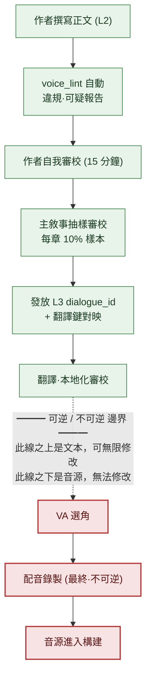

# 5.4 臺詞·語音一致性

錄音棚裡。導演戴著耳機，抬手給出提示。配音演員讀出學者 NPC 的臺詞。"哇，真是太厲害了。"導演的手停住了。這個角色在整整 5 個章節裡，一次都沒用過"哇"這樣的感嘆詞。他是個連髒話、連現代感嘆詞都不會掛在嘴邊、說話總是把話尾壓低的學者。可臺詞稿上卻原樣寫著這一句。

這裡同時產生了兩筆成本。第一，要改這一句，配音演員就得重讀。出場費和錄音棚的時間，鐘錶早已在轉動。第二，更可怕的是導演沒能抓住這一句、就這麼放過去的情形。錄音結束、音源進入構建之後，那位學者在遊戲裡就永遠那樣說話了。錄下來的音源不像文本那樣可以靠一行改動撤回。必須重新約同一位配音演員、同樣的狀態、同一個錄音棚。

本章討論的就是那個錄音棚門前的虛線。虛線之上是文本，可以無限次修改；虛線之下是音源，改不了。所有臺詞的審校都必須在虛線之上結束。要做到這一點，每個角色"這個人是這樣說話的"就必須不是記在腦子裡，而是記錄成檔案，並且每當有新臺詞上來，都要自動與那份檔案比對。那份檔案稱為 `voice_profile`，比對工具稱為 `voice_lint`。

---

## 5.4.1 語音容易動搖的地方

敘事一致性事故中，最常爆發的就是角色語音的動搖。往往要等到上線之後，才會收到"這個 NPC 怎麼突然語氣變了"的反饋。原因每次都幾乎相同。

作者換人，同一個 NPC 就變成了另一個人。即便作者不換，過了 6 個月，本人也會忘掉自己定下的語氣。寫新臺詞時若不翻開那個角色之前的臺詞，上下文就斷了。語音規則只在作者腦子裡、沒有落成文件，就傳不到下一個人手中。還有最近兩年裡增長最快的第五個原因——不帶任何角色資訊就把"幫我寫這個 NPC 的臺詞"丟給 LLM，AI 會返回一段平均而無可挑剔、因而不屬於任何人的臺詞。

第五個原因是引入 AI 帶來的副作用。上一章（5.3）的上下文注入是處方，但要是注入的上下文本身就單薄，那就沒什麼可注入的。那個上下文正是 `voice_profile`。本章要看的就是建立這份檔案、自動檢查、並在錄音棚門前收尾的一整個迴圈。

---

## 5.4.2 voice_profile —— 由五個專案固定下來的聲音

在專案A中，每個 NPC 都用五個專案持有一份 `voice_profile`。詞彙範圍（常用詞群／絕對不用的詞群）、句子長度（平均·最大字數）、敬稱體系（第一·第二人稱、敬語比例、稱呼）、情感表達（直接·間接·剋制中的哪一種方式）、禁忌表達（絕對不用的詞·句式）。五個專案全部都要附上具體示例。若只有"沉穩的學者"這類抽象描述，每個人讀出來都不一樣。下一位作者會按自己的方式去想象那個學者。

學者 NPC `K_007` 實際的 profile 格式如下。這份檔案就成了 `voice_lint` 的輸入。

```markdown
---
title: K_007 學者 voice_profile
layer: L1
character_id: K_007
atoms:
  - voice_profile_k_007
related:
  derives_from: [character_bible/k_007.md]
  affects: [dialogue_id_table (K_007 的所有臺詞)]
---

## 1. 詞彙範圍
- 常用："記錄"、"依據"、"情形"、"推斷"、"資料"、"案例"
- 絕對不用："感覺"、"直覺"、"命運"、"神的旨意"、"內心的聲音"

## 2. 句子長度
- 平均：18 字
- 最大：35 字（超過則拆成兩句）
- 常見短促停頓："……並非如此。""先看記錄。"

## 3. 敬稱體系
- 第一人稱："我"
- 第二人稱：職務優先（隊長、司令官）。只有在親近之後才稱名字。
- 敬語 100%（回憶場景除外）
- 幾乎沒有感嘆詞。有的話也只是"……啊。"

## 4. 情感表達
- 幾乎沒有直接表達（憤怒·喜悅）
- 以沉默·話尾含糊來表達（"……要是那樣的話。"）
- 悲傷：以轉移話題來回避（"……說點別的吧。"）

## 5. 禁忌表達
- 一切髒話
- 現代感嘆詞"哇"、"啊哈"、"厲害"
- 一句話裡出現兩個及以上三音節以上的漢字詞
- "命運"、"預言"等神秘主義詞彙
```

這種格式的核心在於，每一處抽象的位置都附著一行示例。不是"剋制情感"，而是附上 `"……要是那樣的話。"` 這樣一句實際臺詞。這樣下一位作者、譯者、`voice_lint` 才會看到同一套標準。
若用翻譯·本地化的眼光重新審視這五個專案，會分成兩類。**語言相關**屬性（詞彙範圍·句子長度·敬稱體系的表層形態）必須隨翻譯的每種語言重新設定；而**語言無關**屬性（是剋制情感還是直接表達、什麼話始終不說出口這樣的態度）則無論譯成哪種語言都必須照樣守住。把本地化工作交付出去時若一併把這個區分傳過去，就能避免譯者只改表層詞彙、卻連角色態度都動搖了的情況。

---

## 5.4.3 實操記錄（worked transcript，完整保留的真實操作過程記錄）：從正文裡把 profile 打撈出來

一開始就從空白開始寫 50 名 NPC × 5 專案 = 250 條，會流於抽象。正文一行都沒有就寫下"這個角色是個冷漠的學者"，那份冷漠到底是什麼，誰都不知道。所以把順序倒過來。只有主要 NPC 5～7 名從一開始就完整撰寫，其餘的等正文臺詞累積到 20～30 行之後，再從那些臺詞裡反向提取 profile。

下面是 `K_007` 的臺詞累積到 25 行之後，抽出 profile 初稿的真實實操記錄。不做概括，連 AI 出錯的地方也原樣保留。

**[作者丟擲的提示詞全文]**

```
以下是角色 K_007 的 25 行臺詞。

1. "先看記錄吧。"
2. "……情形對不上。"
3. "只是推斷而已。沒有依據。"
4. "那個案例我也知道。"
5. "……並非如此。資料不一樣。"
   （…… 第 6～23 條不作省略，全部引用 ……）
24. "……要是那樣的話，我就退出。"
25. "說點別的吧。"

請從中提取常用詞彙（只取實際出現過的）、平均句子長度、敬稱·稱呼模式、
情感表達方式、一次都沒用過的表達範圍，這五項。
每一項用編號引用 2～3 行作為依據的臺詞，"沉穩的"·"冷漠的"這類
主觀印象不要寫。
```

**[Claude 的原始輸出 —— 未經修飾]**

```
1. 常用詞彙
   - "記錄"（第1條）、"情形"（第2條）、"推斷/依據"（第3條）、
     "案例"（第4條）、"資料"（第5條）
   → 集中於事實·證據類名詞。

2. 平均句子長度
   - 25 行平均約 14.6 字。最長 21 字（第24條）。
   → 以短句為主。

3. 敬稱·稱呼
   - 第一人稱"我"（第3·24條）。結句詞尾為敬語。
   - 第二人稱稱呼在這 25 行裡未出現。
     → 僅憑此樣本無法斷定稱呼模式。（需作者確認）

4. 情感表達
   - 無直接情感詞。以"退出"（24）處理拒絕，
     以轉移話題"說點別的吧"（25）處理悲傷/迴避。
   → 剋制·間接型。

5. 一次都沒用過的範圍
   - 感嘆詞、髒話、神秘主義詞彙均未出現。
   ※ 但"未出現"不等於"禁忌"。
      樣本僅 25 行偏少，可能只是偶然未出現。
```

這裡有兩點需要點明。第一，AI 在第 3 項停住了。它自己劃出了"僅憑此樣本無法斷定"的界限。稱呼在這 25 行裡沒出現，所以它沒去推測——這才是誠實的輸出。要是 AI 填上"第二人稱推測為'隊長'"，那就是幻覺，進入 profile 就是汙染。第二，AI 在第 5 項自己加了免責。"未出現 ≠ 禁忌"是關鍵警告。感嘆詞在這 25 行裡沒出現，也可能是偶然。

**[作者的驗證·駁回]**

作者採納了第 1·2·4 項。第 3 項稱呼，作者翻開 character_bible，手動填上"隊長優先，親近後稱名字"——AI 留空的位置由人來補。第 5 項，作者照 AI 的警告，沒有把"未出現"直接升格為"禁忌"。而是作者對照角色設定，只把"現代感嘆詞·髒話·神秘主義"確定為禁忌，其餘未出現的詞彙作擱置處理。

**[作者的再次請求]**

```
"命運"、"預言"就定為禁忌。再幫我提取 10 個意思相近的神秘主義詞彙。
不過 K_007 作為學者，在反駁·批判的語境裡也可能引用，所以那種例外情形
也用一行一起標出來。
```

這最後一次再請求很重要。機械地擴大禁忌，連"學者在批判迷信時說'什麼命運之類的'"這種正當臺詞都會被擋住。所以讓它在定義禁忌的同時一併定義例外語境。AI 把候選範圍鋪開，作者來劃邊界。轉完這一圈之後，`voice_profile_k_007` 才確定下來、固定到 L1。

強制要求引用依據（"用編號引用"）、禁止主觀形容詞（"禁止寫沉穩的"），AI 的幻覺就會減少，也給作者留出了可供驗證的表層。profile 不是 AI 來寫的，而是 AI 鋪出初稿、作者來固定的。

---

## 5.4.4 voice_lint —— 每條新臺詞自動比對

只要 `voice_profile` 落成檔案，每當有新臺詞上來，就可以自動比對。五項檢查中，在實戰裡效果大的是禁忌詞彙匹配（詞彙是否落入禁忌列表）和詞彙範圍違規（是否進入絕對不用的詞群）這兩項。句子長度偏離·敬稱缺失·常用詞彙比例誤報（false positive）多，只作輔助使用。要是連一行回憶場景把平均長度帶偏都全抓出來，作者就會對警告變得麻木。

`voice_lint` 接收一章的新臺詞集合，給出這樣一份報告。

```
voice_lint 結果（ch04 新臺詞 32 行，profile=voice_profile_k_007）
─────────────────────────────────────────────
[違規] dialogue_id_412 — K_007
  內容："哇，真是太厲害了！"
  事由：禁忌詞彙"哇"、"厲害"（profile §5）
  → 需作者審閱

[可疑] dialogue_id_421 — K_007
  內容："那命運難以接受。"
  事由：禁忌詞彙範圍"命運"（profile §5）
        但'反駁·批判語境'可作例外 —— 由作者判定
  → 需作者審閱

[正常] 30 條臺詞
─────────────────────────────────────────────
小結：違規 1 / 可疑 1 / 正常 30
```

違規為紅色，可疑為黃色。兩者都必須經作者判定才能通過。這裡有一條絕對原則——`voice_lint` 不會自動駁回（5.2 原則的延續）。看上面的 `dialogue_id_421`。"命運"是禁忌，但若是學者反駁迷信的語境，就可能是正當的引用。那個判斷工具做不了。自動駁回型的 lint 會把這種微妙的位置全都擋死，還會從作者手裡奪走打磨語氣的機會。lint 是標示可疑之處的手電筒，不是鎖門的鎖。

---

## 5.4.5 審校關卡 —— 可逆與不可逆之間的虛線

本章的脊樑是這一張圖。一句臺詞從作者手中出發、走到配音演員口中的途中，審校關卡逐級鋪開。而在那條流程正中央，有一條粗虛線。



綠色是可逆階段，紅色是不可逆階段。虛線之上（綠色）全是文本。一句臺詞不滿意，用鍵盤改就行。成本是作者的幾分鐘。虛線之下（紅色）是音源。配音演員在錄音棚裡讀了那一句、音源進入構建的那一刻，那句臺詞就作為資產固定下來了。要改的話，必須重新約同一位配音演員、同樣的狀態、同一個錄音棚，出場費·錄音棚·導演時間會和第一次一模一樣地再花一遍。日程緊的話，同一位配音演員的追加場次本身可能都約不上。

所以只有一條規則統轄著所有工作流——**所有審校關卡都在虛線之上結束。**錄音不是審校階段。它是把審校全部完成的結果固定為資產的階段。若在虛線之下冒出"這句臺詞不太對勁"的疑問，那不是還要再審校的位置，而是上一級審校有遺漏的訊號。手電筒必須在虛線之上全部照完。錄音棚不是可以漆黑的地方，而是不可漆黑的地方。

圖正中央，主敘事抽樣審校定為"每章 10% 樣本"。這個比例是審校時間與準確度的平衡點（作者運營值，未驗證的估計）。降到 5% 以下事故會漏出，提到 20% 以上則單個主敘事會成為瓶頸。因為 lint 已經預先篩掉了違規·可疑，樣本就從 lint 通過的部分裡抽——人眼專注於工具抓不到的語境錯誤（例如：看似正當的"命運"引用其實是角色崩塌）。

---

## 5.4.6 角色會變化 —— profile 的版本管理

角色若從頭到尾一個樣地說話，劇情就停滯了。經歷了同伴之死的學者，若還用之前一模一樣的語氣說話，反倒是假的。若變化是有意為之，`voice_profile` 也要一起升版本。

```markdown
---
character_id: K_007
voice_profile_versions:
  - v1: ch01~ch05 (初期 —— 剋制情感、短句學者)
  - v2: ch06~ch10 (同伴死亡後 —— 情感表達頻率上升)
  - v3: ch11~ (覺醒後 —— 出現直接化的說話方式)
---
```

每個版本都有各自的 profile 檔案，`voice_lint` 看檢查物件臺詞的章節編號，挑出該用哪個版本。若拿 v1 的"剋制情感"規則去套 ch07 的臺詞，正常的變化臺詞就會全部被標為可疑。變化不是 bug，而是設計。

升版本的訊號有三種。作者有意動搖語氣時，就提議新版本並與主敘事達成一致。若 `voice_lint` 的可疑件數在某個角色身上越來越多，那就是作者在無意識中移動語氣的——版本該更新的訊號。若 character_bible 裡追加了變化事件（死亡·覺醒·背叛），就會彈出 profile 更新 alert。不過一個角色若每章都變，一致性就會崩塌，所以現實中的版本數為每個角色 2～4 個。

> **[方向標 —— 若以語音空間來看角色之間（眼下還為時尚早）]** 如果說 `voice_lint` 用規則守住的是'單個角色內部'的一致性，那麼把各角色實際的臺詞集合（一個角色說過的全部臺詞）嵌入（embedding）為一個點的'語音空間'，看的則是'角色之間'是否拉開了足夠距離——若那些點彼此越湊越攏，那就成了 §5.3.1·§5.4.1 所指出的語音趨同·收斂的直接測量值。但不要把距離閾值固定為絕對數值，只應把它讀作'正在湊攏'的方向標，它不是替代 `voice_lint` 的判定關卡（這個想法與 §8.2.7 的維度向量壓縮處在同一位置，概念直觀已在附錄 M 裡用一張地圖講清——它是方向標，不是處方）。

---

## 5.4.7 因多語言·VA 而成倍增加的一致性單位

臺詞被譯成多種語言、再配上配音演員的語音之後，管理單位會成倍增加。一行韓文分岔成英文·東南亞各語言，每一種又都承載著語氣。

翻譯一致性裡最常漏的地方，是同一個表達在每一章被翻得不一樣（用翻譯記憶一致性檢查來抓）。角色 `voice_profile` 未反映到翻譯裡（另附按角色的翻譯指南）、新詞彙未登記進術語集（術語集 lint）緊隨其後。翻譯指南從 `voice_profile` 自動生成——把"這個角色格式體 100%、無感嘆詞、神秘主義詞彙為禁忌"自動附在翻譯指示書的開頭。譯者把那位學者譯成英文時，看到的是同一道邊界。

VA（Voice Actor，配音演員）審校，是觸及虛線之下前、最後一道文本可逆階段的審校。語氣一致性（憤怒·悲傷表達的強度）由導演和敘事來看，發音準確性（專有名詞）由術語集負責人來看，氣息·停頓（profile 中"常見短促停頓"之類的指示）由導演來看。審校結果記錄在 `voice_review_log.md`（L4）裡，以通過·駁回標註，下次角色選角時參考。

駁回儘可能在選角·錄音之前結束。在錄音棚裡發現的臺詞稿錯誤，會把那天的整場錄製整個搞垮，連帶動搖下一場的日程。但靠推遲錄音來關掉審校並不是答案。如果審校頻頻卡在錄音棚前，那是上一級（作者·主敘事）工作流晚了，而不是錄音日程的問題。

---

## 5.4.8 六個月的測量與成本

在專案A中，對引入 `voice_profile` + `voice_lint` 前後追蹤了六個月。絕對件數是作者的估計（未驗證），只信方向·比例即可。

| 專案 | 引入前 | 引入後 | 方向 |
|---|---|---|---|
| 每章語音事故（上線後） | 5～8 件 | 1～2 件 | 約 1/4 |
| 新 NPC 語音定型 | 3 個章節 | 1 個章節 | 1/3 |
| 單個作者管理的 NPC 數 | 約 15 名 | 約 40 名 | 約 2.5 倍 |
| 翻譯一致性事故（每章） | 10～15 件 | 2～4 件 | 約 1/4 |
| 語音審校時間（每章） | 3 天 | 1 天 | 1/3 |

最有意義的一行是單個作者管理的 NPC 數。約 2.5 倍並不是說裁減了作者，而是說同一個作者能增加每章的 NPC 多樣性。世界更加熙攘。

看成本結構，運營成本遠小於引入成本。`voice_profile` 撰寫為主要 7 名、作者 2 周，`voice_lint` 工具為開發 1～2 周、維護每月 1 天。運營這邊為每章作者自我審校 15 分鐘、主敘事抽樣審校約 2 小時（10% 樣本）、變化章節的 profile 更新為每個角色 1～2 天。運營成本小，系統才能存活。運營沉重的工具會在一個季度內悄悄被廢棄。

---

## 5.4.9 常見的失敗

| 模式 | 處方 |
|---|---|
| profile 裡只有抽象描述（"沉穩的"） | 每個 5 專案強制附實際臺詞示例 |
| 一開始就想著完整寫滿 50 名 | 主要 7 名完整 + 其餘從正文累積反向提取 |
| voice_lint 自動駁回型 | 違規·可疑 + 作者判定。駁回只能由人 |
| 機械地擴大禁忌 | 在禁忌處一併寫明例外語境（"可作反駁引用"） |
| 角色變化時 profile 未更新 | 版本管理（v1·v2·v3），按章節編號套用 |
| 翻譯中未傳達 profile | 從 profile 自動生成翻譯指南 |
| 錄音後試圖修改臺詞 | 錄音不可逆。審校在虛線之上收尾 |
| 把審校壓縮排錄音日程 | 以改進上一級工作流來解決 |
| profile 只存在腦子裡 | 一律落成檔案。腦子裡的東西會隨作者換人而消失 |

---

## 動手試試 —— voice_lint 一個迴圈

新章節臺詞上來時，用一份 profile 轉一圈的最小流程。

**setup**
1. 開啟目標角色的 `voice_profile_<id>.md`。沒有的話，就先收集正文臺詞 20～30 行。
2. 把新臺詞整理成 `id / 角色 / 內容` 格式的純文本集合。

**prompt**

```
這是 K_007 的 voice_profile §5（禁忌表達）。
[貼上禁忌列表]

ch04 新臺詞 32 行。
[按 id / 內容 格式貼上]

請把每條臺詞分類為 [違規]（直接含禁忌詞彙）/ [可疑]（觸及禁忌範圍但
可能有例外語境）/ [正常]。[違規]·[可疑] 用表格列出 id·內容·事由。
判定由我來做，所以不要自動駁回。
```

**verify**
1. 先看 [違規]。明顯的就改文本（在虛線之上，免費）。
2. [可疑] 按語境判定。是正當引用就通過，否則修改。
3. 從通過的部分裡抽 10% 作樣本發給主敘事，再過一遍語境錯誤。
4. 所有判定都結束之後，才發放 dialogue_id 並交給錄音佇列。錄音棚門前不再做任何檢查。

**單人精簡版** —— 如果你是做不出工具的單人開發者，就給每個角色的 `voice_profile` 只寫 §5（禁忌表達）這一項。每次寫新臺詞時，把那份禁忌列表附在提示詞開頭，讓 AI"只標出落在這份列表裡的臺詞"。不用工具，靠一行提示詞就能拿到 lint 八成的效果。在交給錄音（或 TTS）之前，只要讓它過這一遍，錄音棚門前的虛線就守住了。

---

### 本章要點
- 語音動搖的五個原因中，AI 趨平增長得最快，處方不是單薄的上下文，而是附有示例的 voice_profile。
- voice_lint 只標示違規·可疑，駁回由人來做，並在禁忌處一併定義例外語境。
- 所有審校都在錄音棚門前的虛線之上收尾——虛線之下的音源不像文本那樣可以撤回。

### 下一章預告
- 6.1. 程式化內容生成與 AI —— 在哪裡相遇
