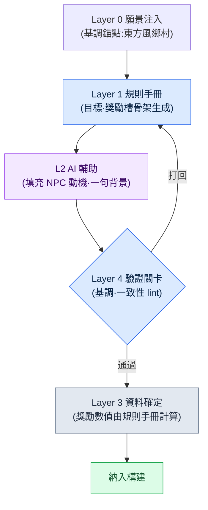

# 6.1 程式化內容生成與 AI —— 兩軸交叉的一格

週一早晨的策劃會議。白板上寫著一行字:"上線前要做 1,000 個支線任務。"有人按起了計算器。一名作者每個任務花一天,就是四年;哪怕五個人一起上,也接近一年。房間裡的空氣沉了下來。在這個房間裡坐了 24 年的我知道,面對這個數字,人們總是分成同樣的兩派:一派說"砍掉一些量",另一派說"用工具量產"。而幾乎每一次,結論都是兩者都要。

程式化內容生成(Procedural Content Generation,以下簡稱 PCG)正是"用工具量產"那一派的老答案。副本房間的佈局、武器詞條的組合、敵人重新整理池,早在 20 年前就靠規則手冊和機率表實現了自動化。新出現的並不是 PCG 本身,而是在自然語言、影像、敘事進入的位置上,換成了 LLM 與生成模型。

不過,本書想說的並不是"把 AI 接到 PCG 上"。那誰都會做。問題在於接在*哪裡*。面對一整塊內容,如果不把它落在自動化的哪一檔強度、結構的哪一層交匯的那"一格"上釘死,就會陷入有工具卻沒有位置的狀態。本章要看的,是如何把那"一格"畫成座標,以及在那一格之上,一塊內容如何真正地在流水線上跑完一圈。

---

## 6.1.1 PCG 一直止步的地方

傳統 PCG 擅長確定性。相同的輸入產生相同的輸出,並且可以驗證。副本房間圖、武器詞條的 prefix·suffix、敵人重新整理分佈因此很早就站穩了腳跟。"烈焰之劍 +5"在 20 年前就能自動生成。

問題總是出在緊接著的那個位置。房間佈置好了,但房間裡 NPC 的名字、外形、簡短背景仍留在作者手裡。"烈焰之劍 +5"能生成,可"國王遺失的最後一柄劍"這一句卻生成不出來。哪怕任務 generator 拼出了目標與獎勵的組合,"為什麼要做這個任務"仍要由人來寫。

在體量大的遊戲裡,這個位置一直是瓶頸。可量產的部分與需要人工的部分,比例大約是 4 比 6,而那需要人工的 6 成吃掉了排期的大半。哪怕量產線快速產出那 4 成,只要 6 成跟不上,整個週期就被拖到那個速度上。

LLM 和影像模型進入的位置恰好就在那裡。規則手冊處理不了的自然語言、敘事、視覺領域,也被納入可量產的範圍。但這並不意味著把這個位置整個交給 AI 就是答案。AI 每次給出的答案都略有不同,一旦上下文為空,就會吐出一般 RPG 的平均值。因此需要設計*結合點*。結合點由兩條座標軸來定義。

---

## 6.1.2 第一條軸:自動化強度(L0\~L3)

縱軸講的是,把人、規則手冊和 AI *按什麼比例混合*。在筆者所在的某家 MMORPG 開發公司(以下稱"專案A")裡,把它切成四檔來用。

**L0 —— 完全手工。** 所有文字與決定都出自人手。主線任務正文、標誌性角色臺詞、分支結局。一致性與敘事深度直接關係到遊戲身份認同的位置。

**L1 —— 規則手冊自動化。** 傳統 PCG 的位置。規則手冊、機率表、BSP 之類的確定性演算法負責產出,人只做評審。副本房間佈局、武器詞條組合、敵人重新整理是代表。

**L2 —— 規則手冊 + AI 輔助。** 規則手冊搭好骨架,AI 填充細節。支線任務梗概、普通 NPC 的名字與簡短背景、狩獵場介紹文。人只負責輸入的後設資料和最後的驗證關卡(verification gate,即由人或檢查器把關的驗證環節,類似質量門禁 quality gate)。

**L3 —— AI 優先 + 人工評審。** AI 負責生成正文,人只做評審。看著誘人,但非確定性、幻覺、一致性受損的風險都集中在這裡。

核心是 L2。它把 L1 的穩定性與 L3 的量產力合到一起,而兩邊的缺點則用驗證關卡擋住。L3 讓人很想盡快引入,但筆者多次見到它因評審負擔暴增而在一兩個季度內被廢棄的案例。100 個裡有 70 個被標為可疑項,那就比人從頭寫 100 個還要貴。

---

## 6.1.3 第二條軸:Layer 結構(L0\~L4)

只靠縱軸,量產線是轉不起來的。內容*本身*必須被拆解成層,自動化才有可進入的位置。這就是第 5 部分講過的 Layer 拆解,也是內容領域裡的橫軸。五個層各自對應程式化生成的一種角色(錨點·規則手冊·正文·數值·關卡)這一通用說明已在 §2.3.6 講過,這裡直接套用到內容量產線上。Layer 0 願景是基調與世界觀錨點(每次生成都注入),Layer 1 系統是生成規則手冊(規則·機率表·標籤體系),Layer 2 內容是生成結果堆積的正文位置(支線任務·NPC 背景·城市介紹文),Layer 3 資料是數值·ID·關係(獎勵·重新整理·曲線),Layer 4 構建·QA 是驗證關卡(lint·一致性檢查·作者評審)。

這兩條軸講的是不同的事。縱軸說的是"人插手多少",橫軸說的是"內容的哪個部位"。而兩者只有相乘才有意義。只有把一塊內容釘在兩軸的交點,也就是*一格*上,"這由誰、在哪裡、怎麼做"才算定下來。

---

## 6.1.4 兩軸合為一張 —— 自動化 × Layer 矩陣

把一路用文字講下來的兩條軸,疊成一張格子看看。橫向是內容的 Layer,縱向是自動化強度。每一格里的標籤,是專案A中實際佔據那一格的內容。顏色越深的格子,越接近量產線的重心。

<svg viewBox="0 0 760 440" xmlns="http://www.w3.org/2000/svg" font-family="sans-serif" font-size="12">
  <rect x="0" y="0" width="760" height="440" fill="#ffffff"/>
  <!-- 축 제목 -->
  <text x="380" y="22" text-anchor="middle" font-size="14" font-weight="bold">自動化強度(縱向) × Layer 結構(橫向)</text>
  <text x="380" y="416" text-anchor="middle" font-weight="bold">→ Layer 結構(內容的哪個部位)</text>
  <text x="18" y="220" text-anchor="middle" font-weight="bold" transform="rotate(-90 18 220)">↑ 自動化強度(人插手多少)</text>
  <!-- 열 헤더 -->
  <g text-anchor="middle" font-size="11" font-weight="bold">
    <text x="190" y="52">L0 願景</text>
    <text x="310" y="52">L1 系統(規則手冊)</text>
    <text x="430" y="52">L2 內容(正文)</text>
    <text x="550" y="52">L3 資料</text>
    <text x="670" y="52">L4 構建·QA</text>
  </g>
  <!-- 행 헤더 -->
  <g text-anchor="end" font-size="11" font-weight="bold">
    <text x="124" y="92">L0 手工</text>
    <text x="124" y="172">L1 規則手冊</text>
    <text x="124" y="252">L2 規則手冊+AI</text>
    <text x="124" y="332">L3 AI優先</text>
  </g>
  <!-- 격자 칸: x=130..730 (5열,120폭) y=60..380 (4행,80높이) -->
  <!-- 행 L0 수작업 -->
  <rect x="130" y="60" width="120" height="80" fill="#dfe7f3" stroke="#7a93c0"/>
  <text x="190" y="104" text-anchor="middle" font-size="10">親手寫一句基調</text>
  <rect x="250" y="60" width="120" height="80" fill="#f4f6fa" stroke="#c8c8c8"/>
  <rect x="370" y="60" width="120" height="80" fill="#eef1f6" stroke="#c8c8c8"/>
  <text x="430" y="98" text-anchor="middle" font-size="10">主線任務</text>
  <text x="430" y="112" text-anchor="middle" font-size="10">標誌性臺詞</text>
  <rect x="490" y="60" width="120" height="80" fill="#f4f6fa" stroke="#c8c8c8"/>
  <rect x="610" y="60" width="120" height="80" fill="#f4f6fa" stroke="#c8c8c8"/>
  <!-- 행 L1 룰북 -->
  <rect x="130" y="140" width="120" height="80" fill="#f4f6fa" stroke="#c8c8c8"/>
  <rect x="250" y="140" width="120" height="80" fill="#b9cae6" stroke="#5b78ad"/>
  <text x="310" y="178" text-anchor="middle" font-size="10">副本房間佈局</text>
  <text x="310" y="192" text-anchor="middle" font-size="10">詞條·重新整理機率表</text>
  <rect x="370" y="140" width="120" height="80" fill="#f4f6fa" stroke="#c8c8c8"/>
  <rect x="490" y="140" width="120" height="80" fill="#eef1f6" stroke="#c8c8c8"/>
  <text x="550" y="184" text-anchor="middle" font-size="10">獎勵曲線計算</text>
  <rect x="610" y="140" width="120" height="80" fill="#f4f6fa" stroke="#c8c8c8"/>
  <!-- 행 L2 룰북+AI (무게중심) -->
  <rect x="130" y="220" width="120" height="80" fill="#f4f6fa" stroke="#c8c8c8"/>
  <rect x="250" y="220" width="120" height="80" fill="#eef1f6" stroke="#c8c8c8"/>
  <text x="310" y="264" text-anchor="middle" font-size="10">定義生成規則手冊</text>
  <rect x="370" y="220" width="120" height="80" fill="#7fa0d4" stroke="#385583"/>
  <text x="430" y="258" text-anchor="middle" font-size="10" font-weight="bold" fill="#ffffff">支線任務骨架</text>
  <text x="430" y="274" text-anchor="middle" font-size="10" fill="#ffffff">NPC 簡短背景·介紹文</text>
  <text x="430" y="289" text-anchor="middle" font-size="9" fill="#ffffff">★ 重心</text>
  <rect x="490" y="220" width="120" height="80" fill="#f4f6fa" stroke="#c8c8c8"/>
  <rect x="610" y="220" width="120" height="80" fill="#eef1f6" stroke="#c8c8c8"/>
  <text x="670" y="264" text-anchor="middle" font-size="10">lint·一致性檢查</text>
  <!-- 행 L3 AI우선 -->
  <rect x="130" y="300" width="120" height="80" fill="#f4f6fa" stroke="#c8c8c8"/>
  <rect x="250" y="300" width="120" height="80" fill="#f4f6fa" stroke="#c8c8c8"/>
  <rect x="370" y="300" width="120" height="80" fill="#e6ddec" stroke="#a98ec0"/>
  <text x="430" y="344" text-anchor="middle" font-size="10">更新公告初稿</text>
  <rect x="490" y="300" width="120" height="80" fill="#f4f6fa" stroke="#c8c8c8"/>
  <rect x="610" y="300" width="120" height="80" fill="#eef1f6" stroke="#c8c8c8"/>
  <text x="670" y="344" text-anchor="middle" font-size="10">作者評審關卡</text>
</svg>

這張格子是本章的核心。原本散落在文字裡的"主線是 L0""支線是 L2""獎勵歸規則手冊"之類的判斷,匯聚到*一個座標*上。會議上有新內容進入議題時,只需問一句"這是哪一格"就夠了。格子一旦定下,那格的縱座標告訴你誰來插手,橫座標告訴你是哪個部位。

讀這張格子,有兩點會映入眼簾。第一,重心(深色格)在 L2 行 × Layer 2 列。支線任務骨架、NPC 背景就在那一格,是量產線的心臟。第二,一塊內容並不只待在一格里。支線任務的正文(Layer 2)在 L2 格,但它的獎勵數值(Layer 3)則下沉到 L1 格。同一個任務,*不同部位住在不同格子*。這正是把兩軸分開的理由。

---

## 6.1.5 在一格之上跑動的迷你流水線

在重心格 —— L2 行 × Layer 2 列,支線任務骨架 —— 之上,看一塊內容如何真正跑完一圈。流程如下。



我們用一份實操記錄(worked transcript,即完整保留的真實操作過程記錄)把這個流程走一遍。假設要做一個鄉村裡的雜活任務。

**第 1 步 —— Layer 1 規則手冊抽出骨架。** 規則手冊是確定性的,只把槽位填出來。

```
[任務骨架 —— 規則手冊輸出]
地區: 鄉村_3
委託人角色: 採藥人
目標型別: 採集(藥材 x6)
干擾要素: 狼群重新整理(夜間)
獎勵槽: { gold: ?, exp: ?, item: 採集鐮 }
```

**第 2 步 —— 向 AI 請求細節。** 提示詞全文如下。(先把 Layer 0 願景作為上下文輸入。)

> 你是一款以東方奇幻鄉村為舞臺的 MMORPG 的任務作者。基調錨點:"樸素,卻籠罩著迷信與恐懼的鄉野"。接收下面的骨架,寫出委託人的一句動機、NPC 名字,以及呈現給玩家的兩句委託文。絕對不要編造獎勵數值(由系統決定)。輸出為 JSON。
> 骨架: { 地區: 鄉村_3, 委託人: 採藥人, 目標: 採集 6 個藥材, 干擾: 夜間的狼, 獎勵物品: 採集鐮 }

**第 3 步 —— Claude 的原始輸出。**(不作概括,原樣照錄。)

```json
{
  "npc_name": "三月婆婆",
  "motive": "每到夜裡,狼嚎把藥圃糟蹋得不成樣子,她再也不敢去挖那最後的藥材。",
  "quest_text": "一到夜裡,狼群就把藥圃翻得亂七八糟。我怕得挪不動步子,勞您替我到山腳下挖六株藥材回來吧。",
  "reward": { "gold": 120, "exp": 300 }
}
```

這裡要停下來看一點。AI *在沒被要求的情況下*,還是造出並填進了 `reward` 欄位。這恰好說明了第一軸與第二軸為何必須分開。獎勵數值(Layer 3)是 L1 規則手冊的位置,不是 AI(L2)的位置。把它交給 AI,數字就會每次呼叫都晃動,獎勵曲線隨之崩掉。

**第 4 步 —— 人工驗證與拒絕。** 評審者做兩件事。(1)*刪除* `reward` 欄位 —— 這是規則手冊要填的格。(2)看基調。"三月婆婆"、一句動機、兩句委託文都合乎鄉村基調,通過。若 AI 塞進了"魔法師公會的委託"這類世界觀之外的詞,就在這裡打回,退回到骨架步驟。

**第 5 步 —— Layer 3 資料確定。** 被刪掉的獎勵槽由規則手冊重新填上。這是繫結地區等級與目標難度的確定性公式。`gold: 85, exp: 240`。不是 AI 隨口吐出的 120·300,而是符合曲線的值。

這一圈就是重心格的標準迴圈。規則手冊出骨架,AI 添血肉,人做關卡,規則手冊再出數值。1,000 個內容全都跑這個迴圈。格子既已定下,就不必每次再為"這由誰來做"爭論一遍。

---

## 6.1.6 定格子時要問的五個問題

要決定把新內容放進格子的哪一格,五個問題會有幫助。每當會議上出現量產議題時,把它們記下來一起作答,格子分配的一致性會在一個季度內穩定下來。

一、量產負擔有多大。上線前需要 N 個?N 一旦超過 100,L0 行幾乎不可能。

二、一致性要求有多高。若內容之間的一致性是體驗的核心,驗證關卡(Layer 4)就得夠強;若多樣性才是核心,就有往更上面的行走的餘地。

三、能否容忍非確定性。這是每次略有不同的結果會帶來豐富度的領域,還是相同結果才是信任核心的領域。

四、評審成本是多少。每塊內容是 5 分鐘還是 30 分鐘,決定了運作週期的長短。

五、出事時的成本是多少。是可以自由廢棄、重寫,還是一旦放出去就直接釀成使用者事故。

把這五問拋給支線任務,答案會朝一個方向匯聚。1,000 個以上(L0 不可能)、一致性低於主線、容許非確定、評審 5\~10 分鐘、事故成本低(可單獨廢棄)。五個答案一匯合,L2 行 × Layer 2 格便順理成章。把同樣的五問拋給主線任務,則朝相反方向匯聚。50 個、一致性與敘事深度最高、不容許非確定、評審成本大、事故成本極大 —— 就是 L0 格。

---

## 6.1.7 四個常見陷阱

即便畫好了格子,會掉進去的陷阱也大同小異,反覆出現的有四個。

第一,**從 L3 行起步。** 抱著"AI 自動搞定 100 個"的期待出發,評審就會暴增。先讓 L1 格落地,再往上升到 L2,L3 只在一部分內容上謹慎使用。上面那條迷你流水線裡,人刪掉獎勵欄位的那一個動作,小小地展示了 L3 行為何危險。

第二,**不要規則手冊,把整件事整個交給 AI。** "幫我做 100 個支線任務"招來的是一般 RPG 的平均值。必須先由 Layer 1 規則手冊搭好骨架,AI 在其上填血肉,才能產出屬於我們這款遊戲的內容。寫一本規則手冊,是 PCG 裡最費工、最無趣的活兒,但一旦跳過它,其上的所有量產都會塌回平均值。

第三,**驗證關卡(Layer 4)空缺。** AI 輸出自動進入構建,就會直接引發一致性事故。無論哪一格,人工關卡都是必需的。

第四,**只看成本就定工具。** LLM API 成本每個季度都在下降,但一致性事故的成本不會下降。定工具時,要在 API 成本之上,再加上一致性與評審時間的總和來看。

---

## 6.1.8 度量 —— 遷到重心格後的六個月

在專案A,把支線任務從 L0 格遷到 L2 格之後,筆者度量了六個月。下面這些數字裡,絕對值是筆者的估算(未經驗證),而變化的方向與比例才是實測中觀察到的部分。

| 專案 | L0 時期 | 轉為 L2 後 |
|---|---|---|
| 作者人均寫 1 個任務 | 約 4 小時 | 約 50 分鐘(後設資料 30 分鐘 + AI 5 分鐘 + 評審 8 分鐘) |
| 每週量產 | 5 個 | 30\~40 個 |
| 廢棄率 | 幾乎 0% | 約 20% |
| 一致性事故(每季度) | 3\~5 起 | 5\~8 起(加固後正常) |
| 作者滿意度(10 分) | 8 | 6 → 7(政策加固後) |

廢棄率升到了 20%,但量產速度是原來的 6\~8 倍,淨吞吐量因此增加了 4\~5 倍。一致性事故小幅升到每季度 5\~8 起,但通過驗證關卡與規則手冊的加固,在一個季度內回到了正常範圍。

最大的變化不是數字,而是人。起初作者們覺得自己成了"量產評審員",滿意度從 8 跌到 6。為了挽回這一點,我們插入了一項政策:在主線任務與標誌性支線任務(每座城市 1\~2 個)上,明確保障作者的時間。這是要釘死一點 —— 量產線不是要吸走作者的時間,而是要成為把那些時間送回主線的工具。六個月後,滿意度回到了 7。

從這次度量裡要帶走一點。遷格子的決定,必須讓吞吐量、作者時間的分配、滿意度一起跟上。只看吞吐量,量產是成功了,人卻走了。

---

## 6.1.9 先做 Layer 拆解,PCG 在其上

Layer 拆解是程式化生成的前提,這個通用命題在 §2.3.6。這裡只看它在 PCG 格子上如何顯現。橫軸(Layer 0\~4)模糊不清的團隊,任何一格都無法穩定運轉。不知道 Layer 0 願景在哪裡,每個 generator 的基調錨點就是空的,只會產出一般 RPG 的平均值;Layer 1 規則手冊與 Layer 2 正文混在一個檔案裡,改動一行規則時就得連帶觸碰正文裡的幾十處;Layer 3 資料被寫進正文裡,獎勵曲線調整一次,作者就要花上一週 —— 上面那條迷你流水線裡,把獎勵拆成獨立槽位單放,就是這個原因。

所以在引入 PCG 之前,要檢查的不是工具選擇,而是*橫軸是否已經拆解*。在五層齊備的團隊裡,接上一個 L1 generator 的成本,是一名作者一個季度。在五層混作一團的團隊裡,同樣的引入會在兩個季度內因一致性事故而被廢棄。

五層不必一開始就完美。分離要循序漸進,介面要窄。頭一個季度裡,哪怕只把 Layer 0 的一句基調和 Layer 1 的一本規則手冊拆出來,generator 可進入的位置也就打開了。但這並不意味著可以無限拖延。若 Layer 2 正文與 Layer 3 資料始終是一整塊,下一章的具體工具也站不住腳。

---

## 6.1.10 下一章預告

下一章會解剖一個佔據這張格子重心格的具體工具:量產各城市狩獵場的 `proj_city_hunting_generator`。看輸入後設資料、規則手冊骨架、AI 正文、驗證關卡如何被綁成一個迴圈,以及本章的迷你流水線在真實工具的規模上如何放大。

---

### 本章要點
- 自動化強度(縱向 L0\~L3)與 Layer 結構(橫向 0\~4)只有相乘才有意義。
- 量產線的重心是 L2 行 × Layer 2 格,即支線任務骨架。
- 橫軸拆解在先,PCG 只在其上的某一格里運轉。

---

## 動手試試 —— 把一塊內容放到一格上

**setup.** 選一種量產候選內容(例如支線任務)。把 Layer 0 的一句基調和 Layer 1 的規則手冊骨架(槽位定義)拆成單獨的檔案。獎勵數值槽在規則手冊一側留空。

**prompt.** 先把願景作為上下文輸入,再給出骨架,並明確寫上"不要編造獎勵數值,輸出為 JSON"。把上面第 2 步的提示詞直接改一改用就行。

**verify.** 看三點。(1)AI 若擅自加了獎勵欄位,就刪掉(L3 是規則手冊的位置)。(2)有世界觀之外的詞,就打回到骨架步驟。(3)只有通過的部分,才由規則手冊填上獎勵數值並納入構建。

**單人精簡版.** 沒有團隊也行。你自己用文本檔案做出一本規則手冊(5 個槽位)和一句基調就夠了。把 10 個任務用上面的迴圈跑一遍,數一數評審時打回了幾個。打回率若超過 30%,說明格子選錯了 —— 要麼把規則手冊骨架做得更細密,要麼下降一行(L1)重新看。打回率一旦穩定,那就是在你自身的規模上、這一格能運轉的訊號。
