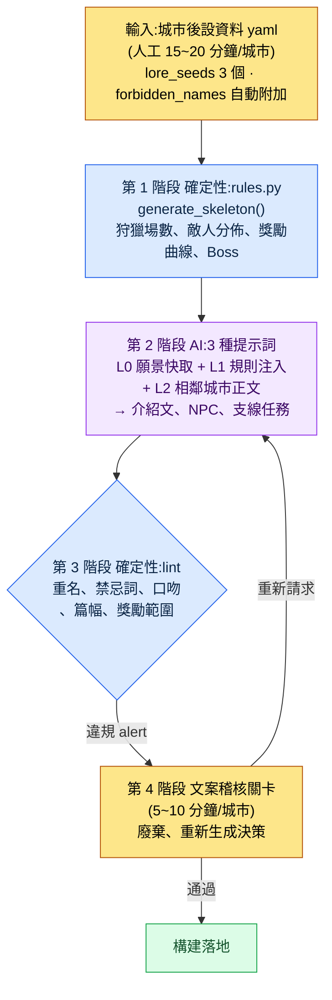

# 6.2 city_hunting_generator —— 4 周內造出 30 座城市

> 主要讀者:負責內容量產的 MMORPG 策劃(中等規模(10\~50 人)團隊)
> 面向單人/業餘讀者的精簡版:§6.2.10「一個人只需做到這些」

我還記得第一次拿到日程表、得知上線前需要 30 座城市那天的估算。一座城市由 5\~10 行的介紹文、3\~5 處狩獵場、每處狩獵場 5\~10 名 NPC 與 2\~3 個支線任務、1\~3 種特產道具、1 只城市 Boss 構成。用手工雕琢一座城市要花 1\~2 周。30 座就意味著一名文案要把整整 6 個月全耗在城市上。

然而那 6 個月根本擠不出來。文案的時間被主線任務和標誌性角色佔滿,30 座城市必須與那些工作並行推進。「讓 AI 把 30 座城市都造出來不就行了」——這個最初的衝動很快就破滅了。整包丟給它,只會得到 30 座彼此雷同的奇幻村莊。本章要看的,是為替代這一衝動而打造的工具 `city_hunting_generator` 如何把輸入、規則手冊、AI、驗證這四個階段串成一個迴圈,以及當這個迴圈真正完整跑完一遍時,會產出什麼、又會廢棄什麼。

> **作者實際運營備註**
> 本章的 `city_hunting_generator` 是作者在公司 R&D 資料夾中實際運營的工具經匿名化後的版本。檔名、程式碼結構、驗證項都忠實照搬自真實工具,城市名(silvermark 等)、公司專有名稱已替換為書中用名。輸出正文是對真實會話的重現。

---

## 6.2.1 人只負責後設資料和最後的稽核

工具的整體流程分為四個階段。關鍵在於:第 1 階段和第 3 階段是確定性的(規則手冊),只有第 2 階段是 AI。規則手冊從兩端把住骨架與驗證,即便夾在中間的 AI 每次給出略有不同的答案,城市之間的一致性也不會動搖。人只介入最初的輸入(後設資料)和最後的關卡(稽核)。



在這張圖裡,人工觸及的地方只有兩處:最上方把一頁後設資料乾淨地填進去的位置,以及最下方對 lint 抓不到的語氣、敘事作出判斷的位置。中間那些枯燥的骨架生成與正文量產,交給規則手冊和 AI 去跑。有一處關鍵設計:lint(第 3 階段)即便發現違規也不自動廢棄,只把 alert 上報給文案關卡(第 4 階段)——理由將在 §6.2.5 中說明。

---

## 6.2.2 輸入 —— 一頁城市後設資料

文案為每座城市寫一頁後設資料。撰寫時間 15\~20 分鐘。雖短,但這一頁就是後續三個階段的全部輸入。

```yaml
# city_021_silvermark.meta.yaml
city_id: city_021_silvermark
region: west
climate: cold_arid
dominant_faction: scholar_guild
cultural_tone: scholarly_strict
level_range: [25, 30]
lore_seeds:
  - 100 年前是魔法封印的中心地
  - 封印減弱的最初征兆在這座城市被觀測到
  - 學者公會總部所在地
neighbors: [city_018, city_023]
# forbidden_names:(指令碼自動附加 —— 文案無需填寫)
```

最重要的槽位是 `lore_seeds`。3\~5 個核心事件決定城市的身份。太少,AI 會吐出一座普通的奇幻城市;太多,事件之間會相互矛盾。以作者的經驗,3 個最為穩定。

`forbidden_names` 不由文案填寫。指令碼會讀取既有城市、角色的名字列表,自動附加到後設資料裡。因為當 30 座城市 × 平均 50 名 NPC 累積起來,靠人腦去檢查 1,500 個名字是否重複是不可能的。無需每次手動寫上「別和其他城市的 NPC 重名」。

---

## 6.2.3 第 1 階段 規則手冊 —— 用確定性搭好骨架

規則手冊接收後設資料,生成城市的結構骨架。程式碼很簡單。

```python
# city_hunting_generator/rules.py (骨架)
def generate_skeleton(meta):
    region_rules = REGION_RULES[meta.region]
    hg_count = region_rules.hunting_grounds_range.sample()
    enemy_dist = ENEMY_RULES[meta.climate][meta.dominant_faction]

    skeleton = {
        "hunting_grounds": [
            {
                "id": f"{meta.city_id}_hg_{i}",
                "level": meta.level_range[0] + i,
                "enemy_types": enemy_dist.sample(k=3),
                "reward_curve": calc_reward(meta.level_range[0] + i),
                "npc_count": region_rules.npc_per_hg,
                "sidequest_count": region_rules.sidequest_per_hg,
            }
            for i in range(hg_count)
        ],
        "boss": {
            "id": f"{meta.city_id}_boss",
            "level": meta.level_range[1] + 2,
            "pattern": BOSS_PATTERNS[meta.region],
        },
    }
    return skeleton
```

結果是確定性的。輸入相同的後設資料,就會得到相同的骨架。獎勵曲線是否落在按 region·level 劃定的標準範圍內、敵人分佈是否符合 climate·faction 規則,都由程式碼來保證,並有迴歸測試兜底。這一階段絕不交給 AI。因為一旦讓 AI 每次呼叫都為獎勵曲線抽出不同的數字,城市之間的平衡當場就會動搖。

輸入 silvermark 的後設資料,`rules.py` 會返回一個空骨架:4 處狩獵場(`city_021_silvermark_hg_0`\~`hg_3`)、每處狩獵場 6 格 NPC 槽位、3 格支線任務槽位,以及 1 只 32 級 Boss。這是一張還沒有名字、也沒有正文、等待填充的格子表。填這些格子,就是第 2 階段 AI 的工作。

---

## 6.2.4 第 2 階段 AI —— 生成自然語言正文

規則手冊搭好骨架之後,AI 在其上填入自然語言正文。城市介紹文,NPC 的名字、外形、簡短背景,支線任務梗概,特產道具的風味文本(flavor text),都在這裡產出。

呼叫模式沿用了上下文注入的四層結構。快取 L0 願景(world_premise + tone_manifesto),選擇性注入 L1 規則(city_naming_rule + region_west_lore),再加上 L2 相鄰正文(其他城市的 NPC 名字列表),最後附上任務指令。城市介紹文的提示詞是可以直接複製使用的形態。

```
[L0 上下文] world_premise + narrative_pillar + tone_manifesto  (快取)
[L1 上下文] city_naming_rule, region_west_lore
[輸入] city_021_silvermark.meta.yaml + lore_seeds 3 個

給這座城市寫一篇 6~8 行的介紹文。把三個 lore_seeds 都自然地融進去,
去掉「和平的村莊」這類 RPG 套話。語氣要學者化、嚴格,剋制抒情。
只要正文,不要前言或解說。
```

同樣的模式在 NPC 量產、支線任務的呼叫中原樣重複。差別只在上下文和輸出格式。NPC 呼叫中會加入 `forbidden_names`(禁止與其他城市的 NPC 重名)槽位,支線任務呼叫中則加入「委託任務的 NPC 須從上面已生成的 NPC 中選取」的約束。

那麼實際會產出什麼?我們完整地跑一遍。

---

## 6.2.5 完整跑完一個迴圈 —— 輸出、驗證、廢棄

如果只是抽象地寫「AI 填充正文」,就無法知道這個工具究竟吐出了什麼。我們把 silvermark 這一座城市的迴圈,從輸入一直跟到廢棄,完整地走一遍。

> **[第 2 階段 AI 輸出 —— 城市介紹文](真實會話重現)**
>
> 西爾弗馬克(Silvermark)是一座封印之城。100 年前,七位學者為阻止西境魔力的泛濫,在這裡的地下立起了封印陣,而城市便在那座陣上,一塊石頭一塊石頭地壘砌、生長起來。學者公會總部的鐘樓是研讀封印脈絡的觀測所,而非朝向神明的尖塔。最近 3 年,觀測記錄裡反覆寫著同一行字:「脈在變冷。」封印減弱的最初征兆,不在別處,正是在這座城市的儀表盤上第一次顫動。街上的學者們不會大聲談論此事,只是鐘樓的火整夜不熄的日子,多了起來。

這裡,3 個 lore_seeds(封印中心地、減弱的最初征兆、學者公會總部)都寫進了正文,沒有「歡迎冒險者的和平村莊」這類套話,scholarly_strict 語氣(剋制抒情,使用觀測、記錄類詞彙)也得到了保持。這就是一份能夠通過的輸出該有的樣子。

接著,同一個迴圈填充狩獵場 `hg_0` 的 6 格 NPC 槽位中的 3 格。

> **[第 2 階段 AI 輸出 —— 3 名 NPC](真實會話重現)**
>
> **1)多倫·維爾(Doren Vale)** —— 鐘樓觀測助理。50 多歲,一隻眼上永久裝著黃銅放大鏡。記錄封印脈絡細微震動的工作,已經做了 30 年。話很少,只用數字交談。*「今天 12.4。昨天 12.1。在往上走。不是好事。」*
>
> **2)米拉·科斯特(Mira Kost)** —— 公會檔案庫管理員。30 多歲,墨漬再也擦不掉地留在手指上。她守護著封印陣的設計原本,卻堅信能讀懂那張圖紙的學者早已全部離世。對外來者戒心很重。
>
> **3)格雷姆(Grem)** —— 鐘樓下的守爐人。身份不明,年齡不詳。他唯一的工作就是不讓鐘樓的火熄滅,對詢問封印之事的人,只答一句「看著火就行」。*(標記為存疑 —— AI 自行申報)*

值得注意的是,第三名 NPC「格雷姆」是 AI 自己給它打上了 *存疑標記*。好的提示詞能讓 AI 說出「這一個我沒有把握」。現在,第 3 階段的 lint 要對這一批輸出執行檢查了。

> **[第 3 階段 lint 輸出](真實格式)**
>
> ```
> [PASS] 篇幅檢查:介紹文 7 行(基準 6~8)
> [PASS] 獎勵範圍:hg_0~hg_3 reward_curve 在標準範圍內
> [WARN] 重名:"Mira Kost" —— 與 city_014_riverhold 的 "Mira Veldt"
>        姓氏(Kost/Veldt)不同,但名字(Mira)相同。forbidden_names 近似衝突。
> [PASS] 禁忌詞彙:tone_manifesto 違規 0 件
> [WARN] 口吻一致性:"格雷姆" 臺詞 voice_lint 置信度 0.62(未達閾值 0.70)
> ```

lint 抓出了 2 件違規,但沒有自動廢棄任何一件,只是作為 WARN 上報給文案關卡。這正是 §6.2.1 中預告過的設計核心。一旦把自動否決權也交到驗證器手裡,文案們不出一兩個月就會把那個開關關掉。因為機器會把有意為之的變體也一併扼殺,連文案親自去權衡那條邊界的機會都被奪走了。所以,篩出可疑候選的活兒交給機器,而這些候選是留是棄的最後判斷,則留在人的手裡。

> **[第 4 階段 文案稽核 —— 判定與廢棄]**
>
> 文案這樣處理了這 2 件 alert。
>
> - **Mira Kost** → 保留。雖與 riverhold 的 Mira Veldt 同名,但在不同城市、不同姓氏,不存在同時登場的可能。作為有意變體予以通過。(不過,是否要把 forbidden_names 規則從「名+姓完全一致」改為「僅名字衝突也報 WARN」,另記一筆待議。)
> - **格雷姆** → **廢棄。** voice_lint 置信度偏低就是訊號。重讀之後發現,「看著火就行」這樣的守爐人角色,與 scholarly_strict 的城市語氣相牴觸。當學者公會主導的城市裡出現走神秘主義語氣的 NPC,城市的身份認同就會被沖淡。廢棄後重新請求。

文案一旦決定廢棄,就會再跑一次重新請求。「廢棄格雷姆的槽位。請重新生成一個符合同一狩獵場學者公會語氣(觀測、記錄、嚴格)的守爐人 NPC。停用神秘主義詞彙。」AI 這次回以一位記錄鐘樓爐溫、連火都當作資料來看的老人,該輸出以 voice_lint 0.81 通過。輸入 → 骨架 → 正文 → 驗證 → 廢棄 → 重新生成的一個迴圈,在這裡閉合。

這一圈就是本書貫穿始終的「Show(展示)」標準。工具吐出什麼、什麼被攔下、人又親手斃掉什麼——若不曾完整地看過哪怕一次,「用 AI 量產」這句話就是空洞的。

---

## 6.2.6 廢棄率不是工具的失敗,而是關卡在起作用的訊號

在上面的迴圈裡,有 1 名 NPC 被廢棄。放到整座城市來看,廢棄會更多。稽核時間平均每座城市 5\~10 分鐘,廢棄率 NPC 約 20%,支線任務約 33%。

這裡如實交代這些比例的計算依據。廢棄率是在匯入初期,親自稽核包括 silvermark 在內的 5 座城市並逐一計數得出的值。NPC 是稽核的 30 名中廢棄 6 名(20%),支線任務是稽核的 15 件中廢棄 5 件(33%)。由於樣本僅 5 座城市、規模很小,它不是精確的總體比例,而應當作「五中取一、三中取一」量級的方向值來讀。等 30 座城市全部稽核完之後的累計比例,可能比這更低,也可能因狩獵場性質不同而更高。

重要的是,廢棄率 0% 並不是目標。廢棄 0% 更像是稽核走了形式的訊號。當五名 NPC 中有一名因語氣不合而被廢棄、三個支線任務中有一個因與 lore_seeds 貼合不上而被重新生成時,稽核關卡才是在真正運轉。

---

## 6.2.7 度量 —— 30 座城市 4\~5 周

我們對比工具匯入前後。下面的時間數值是包括 silvermark 在內的早期城市的實測平均,「匯入前」一列是工具出現之前手工作業時期文案的估算。沒有任何加工過的數字。

| 專案 | 匯入前(手工) | 匯入後(實測) |
|---|---|---|
| 單座城市撰寫時間 | 1\~2 周 | 約 30 分鐘(後設資料 15 分鐘 + AI 5 分鐘 + 稽核 8 分鐘) |
| 30 座城市總週期 | 相當於 1 名文案 6 個月 | 4\~5 周 |
| 廢棄率(NPC) | ——(全部手工撰寫) | 約 20%(30 名中 6 名) |
| 廢棄率(支線任務) | —— | 約 33%(15 件中 5 件) |
| 一致性事故(每座城市) | 幾乎沒有 | 0\~1 件 |

只看表格,亮點在數字;可真正的成效出在別的格子裡。原本險些被城市量產捆住的文案時間被釋放出來,一名文案每個季度的主線任務產出得以大幅增加(具體倍數每個季度不同,故不下定論 —— 方向是「主線產出明顯增多」)。量產工具不是在吞噬文案的時間,而是作為把時間釋放出來的工具在運轉(§6.1.8 那句警告——一旦文案覺得自己成了「稽核機器」,工具就會被抵制——在這裡同樣適用)。

---

## 6.2.8 不放進 generator 的內容

即便自動化的範圍變寬了,以下內容仍留在工具之外。

| 內容 | 留在工具之外的理由 |
|---|---|
| 主線任務正文 | 一致性、敘事深度直接關係到遊戲的身份認同 |
| Boss 招式、演出 | 視覺、互動細節繁多,交給設計師上手更快 |
| 標誌性主要角色 | 需要完整撰寫 voice_profile,無法量產 |
| 分支結局 | 屬於文案親自決策的領域 |
| 每座城市 1\~2 個標誌性支線任務 | 由文案挑選並親自制作 |

「能夠量產」這一事實,不該自動導向「就應該量產」的決定。正如在 silvermark 迴圈中看到的,工具能把 6 名 NPC 中的 5 名量產得很好。然而,要扛起那座城市「封印正在變冷」這一核心張力的那一名標誌性 NPC,由文案親手雕琢。只要自動化的邊界足夠清晰,量產工具反而會成為守護那塊核心領域的工具。

---

## 6.2.9 五種常見的失敗

| 失敗模式 | 為何失敗 | 處方 |
|---|---|---|
| lore_seeds 只寫 1\~2 個 | AI 輸出被拉平到普通 RPG 的平均水準 | 強制 3 個以上(§6.2.2) |
| 不用規則手冊,直接讓 AI 整包量產 | 「造 30 座城市」→ 30 座雷同的村莊 | 第 1 階段規則手冊無法跳過(§6.2.3) |
| 沒有 lint,只依賴文案稽核 | 稽核者把時間耗在處理瑣碎的規則違規上 | 先做第一道自動驗證(§6.2.5) |
| 遺漏重名檢查 | 1,500 個名字的重複靠人腦無法完成 | forbidden_names 自動附加(§6.2.2) |
| 不度量文案滿意度 | 吞吐量上去了,但搶走文案時間就會被抵制 | 明確保障主內容時間(§6.2.7) |

第五種最常被忽視。要讓文案樂於作出像廢棄 silvermark 的格雷姆那樣的判斷,就必須給文案留出量產稽核之外、親自雕琢的時間。只度量吞吐量卻不度量文案的時間,工具在 KPI 上是成功了,人卻會離開。

---

## 6.2.10 動手試試 —— 今天就能做的一步

> **一個人只需做到這些**:沒有規則手冊的程式碼也沒關係。挑一座你自己遊戲(或你喜歡的遊戲)裡的城市、地區,按 §6.2.2 的格式手寫一份後設資料(3 個 lore_seeds 是關鍵),再把 §6.2.4 的介紹文提示詞原樣貼上去,跑一遍看看。從產出的 NPC 裡挑一個語氣不合的,親自對它反駁:「這個 NPC 與城市語氣相牴觸,廢棄、重來」——這樣一來,你就能親身體會到稽核關卡究竟是怎樣一組判斷的集合。

如果是團隊,就從下面這一步開始。先做出一份後設資料 yaml 表單和 `forbidden_names` 自動附加指令碼。規則手冊骨架(`generate_skeleton`)和 lint 放在之後。哪怕只有輸入表單和重名檢查這兩樣,也能先擋住 AI 正文量產崩成「30 座雷同村莊」的兩種常見失敗。

---

## 6.2.11 下一章預告

6.3 將討論 NPC Persona/Squad 流水線。如果說 6.2 的 generator 是把多倫、米拉這樣的 NPC 逐個量產,那麼 Persona/Squad 則把這些 NPC 以組為單位捆在一起。這是一套讓同一狩獵場的五名 NPC 不再是彼此無關的木偶集合,而是作為一個小型社會來運轉的方法。

---

### 本章要點
- 第 1、3 階段是規則手冊(確定性),只有第 2 階段是 AI —— 人只負責輸入和稽核關卡。
- 只有把輸出、驗證、廢棄完整地看過一遍,「AI 量產」才不空洞。
- 廢棄率 20、33% 不是工具的失敗,而是關卡在起作用的訊號。

### 下一章預告
- 6.3. NPC Persona/Squad 流水線
