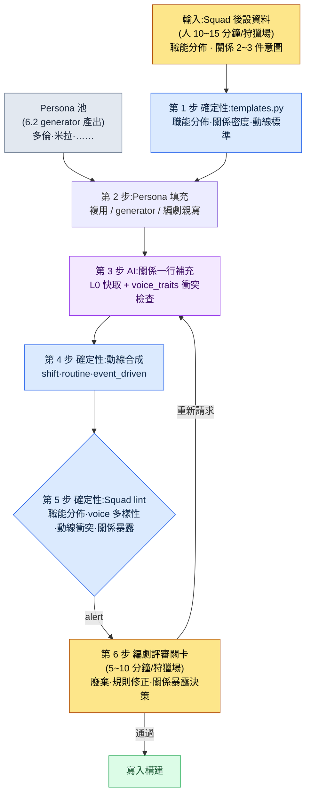

# 6.3 NPC Persona 與 Squad —— 從玩偶博物館到小社會

> 主要讀者:負責 NPC·狩獵場內容的 MMORPG 策劃(中等規模(10\~50 人)團隊)
> 面向單人/業餘讀者的精簡版:§6.3.10「一個人的話，做到這些就夠」

我記得那一天,我用 6.2 的 generator 在一個狩獵場裡量產了五名 NPC,把它們放進遊戲裡看了看。名字·外形·簡短的背景都填好了,只標了座標就擺了上去。可當我真正在那個狩獵場裡走一圈,卻感到一種說不出的死氣。五個人待在同一個空間裡,卻從未彼此提及一句。兩個人疊在同一塊岩石上。本來需要有人擔任商人,五個人卻全是學者。多倫也好、米拉也好,單獨看都是沒問題的 NPC,可一旦捆在一起,就成了一堆玩偶。

這就是玩偶博物館的狀態。單個 NPC 都做好了,作為群體卻沒有活起來。本章講的是把那五個人捆成一個小社會的流水線。核心拆解是 Persona 與 Squad。用辦公室來打比方,Persona 是員工的個人名片,Squad 是一個團隊的組織架構圖。名片摞了 50 張,卻沒有組織架構圖,公司就轉不起來。而本章的脊樑在最後一步——把捆好的群體是否"像彼此相識那樣說話和行動",與 AI 一起走完整整一個迴圈來驗證的那個環節。

> **作者實際運營備註**
> 本章的 Squad 流水線,是作者對自己在公司 R&D 資料夾中運營的 NPC Persona/Squad 工具做的匿名化處理。yaml 結構·驗證項·voice_lint 閾值都忠實照搬了實際工具,城市·NPC 名稱則與 6.2 一樣替換為書中用名。輸出正文是對真實會話的重現。

---

## 6.3.1 Persona 是名片,Squad 是組織架構圖

Persona 是單個 NPC 的身份。它承載名字·外形·voice_profile·職能。6.2 的 generator 造出來的就是 Persona。多倫·韋爾、米拉·科斯特各自都是一個 Persona。

Squad 是把這些 Persona 捆成群體的單位。它定義在一個狩獵場裡五個人以怎樣的職能分佈、彼此是什麼關係、如何移動。

| 單位 | 承載內容 | 建立主體 |
|---|---|---|
| Persona | 名字·外形·voice_profile·職能 | generator(6.2) |
| Squad | 職能分佈·關係·動線 | Squad 流水線(本章) |

不把這兩者分開,兩件事就會同時卡住。只量產 Persona 就成了玩偶博物館,想從 Squad 做起又沒有可填的 Persona。分開之後,每個單位的運營都變得簡單。不過,分離並不等於割裂。關鍵是在兩個單位之間鋪好複用·驗證的通路,這正是本章的正題。

這套 Persona→Squad 的拆解不只是簡單的歸整,它打開了走得更遠的一條路。只有當 NPC 群體以職能·關係·數值被規整化,日後世界狀態(玩家行為的累積)才能撼動 NPC 的數值,而這些數值又成為任務觸發條件,一路走到動態反應性。本章只點到那種進階應用的入口,正面處理的部分只到"由人評審的保守量產"為止。

---

## 6.3.2 輸入 —— 一頁 Squad 後設資料

Squad 骨架從每個狩獵場一頁後設資料開始。這與 6.2 的城市後設資料是同一套思路。人只定下職能分佈和關係意圖,填充的活兒交給規則手冊與 AI。

```yaml
# city_021_hg_3.squad.yaml
squad_id: city_021_hg_3_squad
hunting_ground: city_021_silvermark_hg_3
type: hunting_ground_residents
size: 5
roles:
  - role: quest_giver
    count: 1
    voice_traits: [authoritative, scholarly]
  - role: lore_keeper
    count: 1
    voice_traits: [scholarly, withdrawn]
  - role: merchant
    count: 1
    voice_traits: [practical, dry]
  - role: bystander
    count: 2
    voice_traits: [varied]
relationships:
  - between: [quest_giver, lore_keeper]
    type: mentor_and_former_student
  - between: [merchant, bystander_1]
    type: regular_customer
movement_pattern: stationary_with_shifts
```

最重要的槽位是 `relationships`。關係若為 0 件,五個人到最後仍是陌路。關係太多(5 人有 5 件以上)則玩家要記的東西太多,反而被淹沒。據筆者經驗,5 人 Squad 配 2\~3 件核心關係最為穩定。`voice_traits` 是讓五個人各自擁有不同嗓音的裝置。若五個人全填 `scholarly`,在驗證階段就會因 voice 趨同而被攔下。

---

## 6.3.3 第 1 步·第 2 步 —— 規則手冊骨架與 Persona 填充

規則手冊先定下 Squad 骨架的標準。按狩獵場的 region·type,尺寸·職能分佈·關係密度·動線模式的預設值都寫進了程式碼。

```python
# npc_squad/templates.py (節選)
SQUAD_TEMPLATES = {
    ("west", "hunting_ground_residents"): {
        "size_range": (4, 6),
        "role_distribution": {
            "quest_giver": 1,
            "merchant": 1,
            "lore_keeper": (0, 1),
            "bystander": (1, 3),
        },
        "relationship_density": 2,        # 建議關係數
        "movement_pattern": "stationary_with_shifts",
    },
    ("east", "outpost_squad"): {
        "size_range": (3, 4),
        "role_distribution": {
            "commander": 1,
            "scout": 1,
            "support": (1, 2),
        },
        "relationship_density": 1,
        "movement_pattern": "patrol_loop",
    },
}
```

這一步是確定性的。西部居民 Squad 裡出現五個全是 quest_giver 這種事故,在程式碼層面就不可能發生。職能分佈一旦越出規則,當場就會被攔住。

接下來給每個槽位填入 Persona。路子有三條。池子裡有合適的 Persona 就複用(出場權重 +1),沒有就用 6.2 的 generator 新造,若是主線任務的核心人物則由編劇親自撰寫。silvermark 的 hg_3 Squad 把 quest_giver·lore_keeper 用 6.2 已經量產好的米拉·多倫填上,另外新抽了 merchant 與 2 名 bystander。到這裡為止,與 6.2 的 generator 迴圈相同。本章真正的活兒在其後——驗證捆好的群體是否真的像一個群體那樣運轉的那個環節。

---

## 6.3.4 走完一個完整迴圈 —— 關係補充·動線·一致性驗證

如果只抽象地寫一句"AI 補充關係",就看不出這條流水線到底吐出什麼。下面把 silvermark hg_3 這一個 Squad 的後半段迴圈,從關係文本生成一直跟到廢棄·重新請求,完整走一遍。

### 第 3 步 —— AI 關係補充

Squad 骨架裡錄入的關係標籤(`mentor_and_former_student`)是抽象的,在遊戲裡看不見。把它變成一行描寫、埋進 NPC 臺詞·事件,就是第 3 步。提示詞是可以直接複製來用的形態。

```
[L0 上下文] world_premise + tone_manifesto  （快取）
[L1 上下文] city_021_silvermark.lore（學者公會主宰，scholarly_strict）
[Persona 1] quest_giver —— 米拉·科斯特，公會檔案庫管理員，30 多歲，墨跡斑斑
[Persona 2] lore_keeper —— 多倫·韋爾，鐘樓觀測助手，50 多歲，只用數字交流
[關係標籤] mentor_and_former_student

請把這兩人（師父–昔日弟子）的關係，寫成 1~2 行可用於遊戲臺詞的背景描寫。
多倫用數字、米拉用文書——讓兩種口吻不相沖突。語氣用嚴格的學者風，
去掉神秘主義或"老朋友"之類的套話。只要正文。
```

> **[第 3 步 AI 輸出 —— 關係一行]（真實會話重現）**
>
> 二十年前,多倫教過米拉封印陣觀測記錄的記法。如今立場顛倒,多倫測出的數值,由米拉謄抄進檔案庫的賬簿。兩人每週二都會為觀測值與賬簿對不上的某一格,短暫地爭執一番。

這段輸出不錯。`mentor_and_former_student` 被具體化了,多倫的"數字"與米拉的"文書"沒有衝突地被擰進同一個場景(把數值謄進賬簿),scholarly_strict 語氣也保持住了。同一套提示詞,也會在 merchant–bystander_1 的 `regular_customer` 關係上重複一遍。

### 第 4 步 —— 動線合成

NPC 若整天站在一個地方,就又成了玩偶。規則手冊來填動線模式。stationary 是固定一處(衛兵·Boss),stationary_with_shifts 是每 8 小時微調位置(普通),routine_loop 是基於時間表(居民),event_driven 是僅在觸發時移動(任務 NPC)。這一步是確定性的,不呼叫 AI。

### 第 5 步 —— Squad 一致性 lint(這條流水線的關卡)

現在來查捆好的五個人是否真的像一個群體那樣運轉。如果說 6.2 的 lint 看的是單個 NPC,那麼這個 lint 看的是群體一致性。

> **[第 5 步 Squad lint 輸出]（真實格式）**
>
> ```
> [PASS] 職能分佈：quest_giver 1 · lore_keeper 1 · merchant 1 · bystander 2（滿足規則）
> [PASS] 關係密度：2 件（建議 2，滿足）
> [WARN] voice 多樣性：scholarly 系 3/5 —— quest_giver·lore_keeper·bystander_2
>        的 voice_profile 餘弦相似度 0.83（超過閾值 0.80）。有趨同風險。
> [WARN] 動線衝突：14:00~16:00 區間 merchant·bystander_1 座標半徑 1.5m 重疊
> [FAIL] 關係暴露：定義了 2 件關係，但 5 人臺詞中任何地方都 0 次提及其他成員。
>        關係僅存在於資料中 —— 遊戲內可見性為 0。
> ```

lint 抓出了三件。三件都不自動廢棄,而是提交到關卡——可疑候選由機器挑出,但要殺還是要留由人來定,這與 §6.2.5 是同一套設計。

> **[第 6 步 編劇評審 —— 判定與廢棄]**
>
> 編劇這樣處理了這三件 alert。
>
> - **voice 趨同 (WARN)** → 廢棄 bystander_2。即便是學者之城,五個人都是學者口吻也會讓狩獵場單調。請求把 bystander_2 重新生成為 `practical, dry` 語氣的雜役工。(quest_giver·lore_keeper 兩人都是學者,是城市身份使然,予以保留。)
> - **動線衝突 (WARN)** → 修正規則。把 merchant 的 shift 起始偏移推後 +2 小時,化解 14:00 的重疊。不呼叫 AI,只調整動線引數。
> - **關係暴露 0 (FAIL)** → 最重要的一件。定義了整整兩件關係,卻在遊戲裡一次都不露面,那份資料就是死資料。編劇決定挑選一件核心關係(多倫–米拉),把它埋進臺詞。

三件裡有兩件靠規則·重新生成合上了,最後那個 FAIL 才是這條流水線的核心。編劇追加請求了多倫對話分支的一行。

```
請在多倫的臺詞裡，插入僅僅一行、像不經意間流露出與米拉關係的話。
不要說明腔，要像順帶一提。學者風語氣，只要一行臺詞。
```

> **[重新請求的輸出]**
>
> *"那張圖紙在檔案庫裡。去問米拉吧。……二十年前是我教那傢伙怎麼讀的，如今反過來了。"*

這一行加進去的一刻,兩個 NPC 的關係就從資料表搬到了遊戲畫面上。輸入(Squad 後設資料)→ 骨架 → Persona 填充 → 關係補充 → 動線 → 一致性驗證 → 廢棄·暴露決策,這一個迴圈在此合上。

這一圈就是本章的 Show 標準。"用 Squad 把 NPC 捆成社會"這句話,若沒有哪怕一次看到人把關係暴露 0 件的 FAIL 用一行臺詞合上的場景,就是空洞的。

---

## 6.3.5 Persona→Squad 全流程

把上面的迴圈用一張圖放在這裡。要點是:第 1·2·4·5 步是確定性的(規則手冊·lint),只有第 3 步是 AI;而且人的手只觸及最上面的輸入和最下面的關卡。



人的手觸及的地方只有兩處。最上面定下職能·關係意圖的環節,最下面判定 lint 抓不到的語氣·敘事的環節。中間的骨架·動線·驗證由規則手冊來跑,關係正文由 AI 來跑。

---

## 6.3.6 讓關係在遊戲中可見的三個裝置

第 5 步 lint 的 `關係暴露` 項最常出現 FAIL。因為關係只在資料裡活著。把關係從資料裡拽進遊戲的裝置有三個。

第一,**臺詞引用**。像 §6.3.4 裡多倫那句臺詞那樣,NPC 用一行提及其他成員。最便宜,效果也最大。

第二,**動線交叉**。每週二多倫與米拉一同待在檔案庫的場景,能在遊戲裡被觀察到。玩家偶然看到,就會察覺"那兩個人是不是有牽連"。只要第 4 步的動線與關係一致,它自然就會出現。

第三,**分支條件**。拒絕 quest_giver 的請求,lore_keeper 的好感度也會一起下降。這第三個裝置正是 §6.3.1 所說進階應用的入口——關係越過單純的描寫,開始對遊戲狀態產生影響的那個環節。

三個裝置不必都用。在 5 人 Squad 裡,哪怕只把 2\~3 件核心關係用第一·第二個裝置暴露出來,狩獵場的體感也會大不相同。過多的話,玩家要記的東西就多了。編劇在評審階段挑選要暴露的關係插進去,其餘的只留作資料。

---

## 6.3.7 度量 —— 誠實地

比較工具引入前後。不使用加工過的數字。時間·比例是親手評審 silvermark 等幾個早期狩獵場時數出來的值,"引入前"一列則是手工時期編劇的估算。

| 專案 | 引入前(手工·估算) | 引入後(實測) |
|---|---|---|
| 一個狩獵場的 Squad 捆綁 | 約 3\~4 小時 | 約 25 分鐘(後設資料 12 分鐘 + AI 5 分鐘 + 評審 8 分鐘) |
| 關係暴露(臺詞·動線)件數 | 每個狩獵場 0\~1 件 | 核心 2\~3 件中暴露 1\~2 件 |
| 動線衝突(同一座標 2 人以上) | 每個狩獵場 2\~3 件 | 用 lint 提前攔截,0\~1 件 |
| voice 趨同廢棄 | —(無檢查) | 5 人中 0\~1 人重新生成 |

樣本只有幾個狩獵場,數量小,所以不該當作精確的總體比例,而應讀作方向值。最大的變化不在表裡。因為 lint 的 `關係暴露` FAIL 會強行把"這個狩獵場,一件關係都看不見"擺到編劇面前,量產成果作為玩偶博物館上線的情況在結構上減少了。廢棄 0%·暴露 0 件並非目標(§6.2.6),這一點在這裡也一樣。Squad 吸收了捆綁工作的大部分,但像多倫最後那一行臺詞那樣的核心,必須給編劇留出親手雕琢的時間。

---

## 6.3.8 Persona 池 —— 同一個人物出現在多座城市時

Squad 穩定之後,自然隨之而來的運營就是 Persona 池。同一個 Persona 可以在多座城市出場。隸屬學者公會的 NPC 在三四座城市裡被遇見,反倒很自然。這不會讓世界顯得狹小,而是顯得彼此相連。

```yaml
persona_pool:
  - id: persona_doren_vale
    voice_traits: [terse, numeric]
    appearance_count: 3
    appearance_cities: [city_021, city_018, city_023]
    signature: false
  - id: persona_mira_kost
    voice_traits: [scholarly, withdrawn]
    appearance_count: 2
    signature: false
```

複用比例有一個健康區間。

| 複用比例 | 狀態 |
|---|---|
| 低於 20% | NPC 數量暴增,識別負擔 |
| 30\~50% | 健康的運營區間 |
| 70% 以上 | NPC 令人厭倦,多樣性受損 |

不過,讓一個 NPC 出現在太多城市,就會變成"這人怎麼又來了"。一個 Persona 最多出場城市定為 5 座作為上限。Boss 房間·標誌性人物禁止複用(`signature: true`)。同一個 Persona 從第二次出場起,強制施加視覺變化(燈光·道具)。這個 30\~50% 的區間不是精確數值,而是運營指南——要按團隊·遊戲規模來校準。

> **[方向標 —— 若把 Persona 池當作分佈來看(眼下還為時尚早)]** 如果是池子已長到數百 NPC 的團隊,還有一個更進一步的方向——它與 §8.2.7"維度向量"一節處在同一位置,是一塊方向標(不是處方——概念直覺見附錄 M)。§6.3.4 的 voice_lint 已經用兩個 Persona 的餘弦相似度(0.83 這樣的值)來看"接近程度"。把同一套嵌入(embedding)鋪到整個池子上,就能把令人厭倦不靠編劇的印象、而靠分佈密度來診斷——"學者口吻扎堆擠在一角"的狀態,會呈現為那片區域的點密度。這樣一來,與其在低密度區域裡再新畫一個"又一個相似的學者",不如在相近的兩個 Persona 之間填入插值出來的變體,把多樣性補上,這條路就打開了。不過,要一併放在心上的注意點有兩個。用插值抽出的 Persona 很容易變成把兩個 NPC 生硬混合的"死中間值",最終還得由人重新把 voice 救活。而且上面那個厭倦比例(30\~50%)不是精確值,而是運營指南,一旦把它換算成嵌入距離,鬆散就有可能裝成精確的樣子藏起來——距離值是幫助編劇判定的訊號,而不是判定本身。

---

## 6.3.9 六種常見的失敗

| 失敗模式 | 為何失敗 | 處方 |
|---|---|---|
| 只量產 Persona 而無視 Squad | NPC 50 名都齊了,狩獵場卻死氣沉沉 | 引入 Squad 骨架規則手冊 (§6.3.3) |
| 無職能分佈規則的自由生成 | 出現只有五個商人、0 個學者這類分佈事故 | 強制 role_distribution (§6.3.3) |
| 只放關係標籤而缺一行描寫 | 關係抽象,在遊戲裡看不見 | 第 3 步 AI 關係補充 (§6.3.4) |
| 無關係暴露檢查 | 定義了關係,卻在臺詞·動線上 0 件暴露 | 第 5 步 `關係暴露` lint (§6.3.4) |
| 缺動線衝突檢查 | 同一時間同一地點 2 人,上線後頻發 | 座標·時段自動檢查 (§6.3.4) |
| 複用比例 0% 或 70%+ | 0% 是量產暴增,70%+ 是令人厭倦 | 池運營 + 出場上限 (§6.3.8) |

第四種最常被漏掉。定義關係與讓關係在遊戲裡可見,是兩件不同的工作,沒有檢查,後者幾乎總是缺席。在 silvermark hg_3 裡,如果 lint 沒有把關係暴露 0 件作為 FAIL 擺出來,多倫和米拉就只會在資料表裡是師徒關係。

---

## 6.3.10 動手試試 —— 今天就能做的一步

> **一個人的話，做到這些就夠**:沒有規則手冊、沒有 lint 也行。從你自己的遊戲(或喜歡的遊戲)裡某一處的 NPC 中挑 3\~5 名,按 §6.3.2 的格式,用手寫下職能和 2 件關係。接著把 §6.3.4 的關係補充提示詞原樣貼上,拿到一行描寫,最後親自問一句——"這段關係,現在在遊戲臺詞的哪裡看得見?"一處都沒有的話,那就正是 lint 的 `關係暴露 0` FAIL。在一名 NPC 的臺詞裡插進其他成員的一行,親手把那個 FAIL 合上,你就會切身體會到 Squad 驗證抓的到底是什麼活兒。

如果是團隊,就從下面這一步開始。先做一張 Squad 後設資料 yaml 表單,以及第 5 步 lint 中的 **`關係暴露` 檢查這一行**(用 grep 查每個 NPC 臺詞文本里是否出現其他成員的名字·職能)。職能分佈檢查·動線衝突檢查放在其後。哪怕只有關係暴露這一項檢查,也能先擋住量產狩獵場作為玩偶博物館上線這一最常見的失敗。

用 setup → prompt → verify 概括就是——**setup**:在 Squad 後設資料 yaml 裡定義職能·關係,用 templates.py 定下骨架。**prompt**:按 §6.3.4 的格式拿到關係一行,同時強制禁止 voice_traits 衝突·禁止套話。**verify**:跑一遍第 5 步 lint 確認 `關係暴露` FAIL,把一件核心關係埋進臺詞,親手合上。

---

### 本章要點
- Persona 是名片,Squad 是組織架構圖——分開來,玩偶博物館才會變成社會。
- 關係補充·動線·一致性驗證要完整走一遍,"捆成社會"才不空洞。
- 由人用一行臺詞合上 `關係暴露 0` FAIL,才是這條流水線的心臟。

### 下一章預告
- 6.4 內容量產工作流 —— 把 Persona·Squad·城市生成捆成一週迴圈
