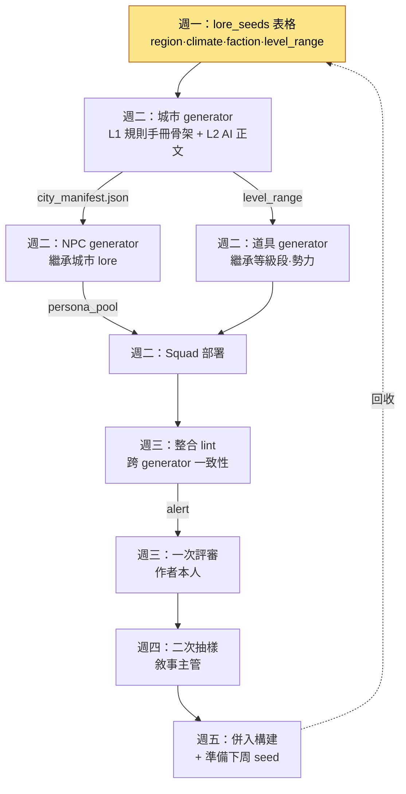

# 6.4 內容量產工作流 —— 把多個 generator 串成一條產線

三個工具各自完工的那一週，我一口氣跑了城市 generator、NPC generator 和道具 generator。三者各自都執行良好。城市生成了 7 座，NPC 生成了 110 名，武器生成了 60 件。可幾天後坐下來評審時，我才發現自己把同一個陷阱踩了三遍。

城市 `port_harman` 被生成成了“沒落的漁村”，可佈置到那座城市裡的 NPC 們，人設卻是“繁榮貿易港的富商”。原因在於城市 generator 和 NPC generator 看的是不同的 lore_seeds。武器 generator 則在這座推薦等級為 12\~18 的城市裡，把 40 級的傳說武器鋪進了商店。三個工具各自都沒錯，卻因為沒被串起來而錯了。

本章講的不是造一個工具的故事，而是把 6.2 的城市 generator、6.3 的 NPC Squad 以及道具 generator **串成一條生產線**來運轉的故事。工具有三個，陷阱卻不是三個——它們會在工具之間的縫隙裡重新冒出來。

---

## 6.4.1 生產線這一視角

如果把城市·NPC·道具 generator 各自單獨去跑，每個工具的輸出就會和另一個工具的輸入對不上。解法不是把工具做得更聰明，而是**在上游一次性固定好共享的後設資料，再讓各個工具在它下面排成一隊**。如果說 6.2 ch2 的城市 generator 是單個工具的範本，那麼本章要做的，就是把那個工具降格為產線上的一個工站。

整條產線是這樣流動的。



關鍵是 `city_manifest.json` 這條箭頭。城市 generator 在造出一座城市的同時，把這座城市的身份（是沒落的漁村，還是繁榮的貿易港）產出成一份 manifest，NPC generator 和道具 generator **把這份 manifest 當作輸入接收下來**。我當時踩的那個陷阱，正是因為缺了這條箭頭。所謂把工具串起來，就是在工具之間放進這一行契約。

---

## 6.4.2 把工具串起來的一行契約 —— manifest

城市 generator 每造出一座城市，都會一併吐出一份 `city_manifest.json`，它的實際形態如下。這個檔案會成為 NPC·道具 generator 的輸入。

```json
{
  "city_id": "port_harman",
  "display_name": "哈爾曼港",
  "lore_seeds": ["沒落的漁村", "舊日貿易的餘響", "缺鹽"],
  "region": "南部沿海",
  "dominant_faction": "漁民公會",
  "level_range": [12, 18],
  "tone": "衰落·堅韌",
  "forbidden_names": ["哈蘭", "哈爾門"],
  "neighbors": ["salt_marsh", "old_pier"]
}
```

NPC generator 繼承 `lore_seeds` 和 `tone`，造出“沒落漁村裡那群堅韌的人”。道具 generator 繼承 `level_range`，只鋪 12\~18 級的武器。`forbidden_names` 是鄰城已經用過的名字，兩邊都會避開。三個工具看的是同一份契約。

製作這份 manifest 時，我給 Claude 的提示詞如下。這是把量產產線上遊綁在一起的、最重要的一次呼叫，所以原樣照錄全文。

> 你是 MMORPG 城市 generator 的 manifest 生成器。接收下面的作者後設資料，生成 city_manifest.json。
>
> 作者輸入：
> - city_id: port_harman
> - lore_seeds: 沒落的漁村、舊日貿易的餘響、缺鹽
> - region: 南部沿海
> - level_range: 12-18
>
> 規則：
> 1. dominant_faction 從 lore_seeds 推斷，但不得與鄰城（salt_marsh、old_pier）的勢力重複。鄰城勢力為 [鹽田公會、走私團]。
> 2. forbidden_names 裡填入已在鄰近城市使用過的 NPC/地名。提供的列表：[哈蘭、哈爾門]。
> 3. tone 控制在兩個詞以內，且不與 lore_seeds 矛盾。
> 4. 區分標註推測的值和作者明確指定的值。

Claude 的原始輸出是這樣的。不作概括，原樣照錄。它在一個地方違反了規則。

> ```json
> {
>   "city_id": "port_harman",
>   "display_name": "哈爾曼港",
>   "lore_seeds": ["沒落的漁村", "舊日貿易的餘響", "缺鹽"],
>   "region": "南部沿海",
>   "dominant_faction": "走私團",   // ← 推斷：缺鹽 + 舊貿易 = 走私
>   "level_range": [12, 18],
>   "tone": "衰落·貪婪",
>   "forbidden_names": ["哈蘭", "哈爾門"],
>   "neighbors": ["salt_marsh", "old_pier"]
> }
> ```
> （推斷的值：dominant_faction、tone、display_name / 作者明確指定：其餘）
> 注意：我把 dominant_faction 選成了“走私團”，但規則 1 裡鄰城 old_pier 已經是“走私團”了。這違反了規則。作為替代候選，建議改用“漁民公會”。

這裡重要的是 AI 主動報告了自己的規則違反。從 lore_seeds（缺鹽·舊貿易）來看，“走私團”是個有吸引力的推斷，但**在產線層面上卻是衝突**。鄰城已經是走私團了。我採納了 AI 的建議，把 `dominant_faction` 改成“漁民公會”，`tone` 改成“衰落·堅韌”。“貪婪”是從走私團這個前提裡推出來的詞，和漁民公會並不相配。

這一次的驗證·否決·重新指定，守住了產線的上游。manifest 一旦錯了，它下面的 110 名 NPC 和 60 件武器就全都會建立在錯誤的前提之上。在上游花 5 分鐘，就能在下游省下 3 小時。

---

## 6.4.3 整合 lint —— 檢查工具之間的縫隙

單個 generator 的 lint 只看自己的輸出。城市 lint 看城市是否遵守了規則手冊，NPC lint 看人設是否保持了 voice 一致性。但我一開始踩的陷阱，**不在各個工具內部，而在工具之間**。所以產線在單個 lint 之上，還需要多一層——把城市·NPC·道具放在一起讀、做交叉驗證的整合 lint。

整合 lint 實際會抓到的專案如下。

| 檢查項 | 比較什麼 | 當時漏掉的 |
|---|---|---|
| lore 一致性 | city.lore_seeds ↔ npc.persona | 是漁村卻有富商 |
| 等級段一致性 | city.level_range ↔ item.required_level | 12\~18 的城市裡有 40 級武器 |
| 勢力衝突 | city.faction ↔ neighbor.faction | 兩座走私團城市相鄰 |
| 名稱重複 | 全部 city·npc·item 的名稱池 | forbidden_names 未收集 |

下面是跑這個整合 lint 時的部分真實輸出。它不做自動廢棄，只丟擲 alert，交由人來判定。

> ```
> [整合 lint] port_harman 產線檢查 —— 3 alert
>
> ALERT-1（lore 一致性）port_harman
>   city.lore_seeds = ["沒落的漁村", ...]
>   npc[merchant_04].persona = "繁榮貿易港的富商"
>   → 可能矛盾。需確認是否為有意變形。
>
> ALERT-2（等級段一致性）port_harman
>   city.level_range = [12,18]
>   item[blade_legend_07].required_level = 40
>   → 超出推薦等級段 28。請重新審視商店擺放。
>
> ALERT-3（名稱重複）—— 資訊
>   npc[fisher_02].name = "哈蘭"
>   city.forbidden_names = ["哈蘭", ...]
>   → 與 forbidden_names 衝突。建議重新生成 NPC 名稱。
> ```

看到 ALERT-1，我猶豫了一下。NPC 是“繁榮貿易港的富商”，這未必就一定是錯的。如果這座城市是**過去繁榮、如今沒落**的，那麼“曾經富有、如今潦倒的商人”反而是個好故事。於是我把 ALERT-1 判定為“有意的變形”而非廢棄，同時提出一行修改：把 NPC 人設改成“抓著昔日繁榮貿易港殘跡不放的老商人”。ALERT-2 是明顯的事故，我把武器刪掉了。ALERT-3 只重新生成了名字。

不是自動 lint 擋住了事故，而是自動 lint 把事故**擺到了人的眼前**，判定由人來做。這正是 6.1 裡說的 L2（規則手冊 + AI 輔助）的核心。AI 造出骨架和 alert，人做最後的判定。像 ALERT-1 那樣，把“看似錯誤、其實是好故事”的東西分辨出來，是規則手冊做不到的。

---

## 6.4.4 用一週週期來運轉產線

把工具串起來之後，就需要節奏。產線以一週為單位運轉最為穩定。一週，短到不會讓評審暴增，又長到不會讓回收變慢，正好卡在我桌上日曆的一格里。

| 星期 | 產線工站 | 作者時間 |
|---|---|---|
| 週一 | 編寫 lore_seeds 表格（manifest 上游） | 半天（5\~7 座城市 × 15\~20 分鐘） |
| 週二 | 城市→NPC→道具 generator 連鎖執行 | 無作者介入 |
| 週三 | 整合 lint + 一次評審（本人） | 1 小時（5\~10 分鐘/座） |
| 週四 | 二次抽樣評審（敘事主管） | 2\~3 分鐘/座 |
| 週五 | 併入構建 + 準備下周 seed | 很短 |

週二是產線的心臟。城市 generator 產出 manifest，NPC generator 就接住它，道具 generator 也接住它，Squad 一路做到部署。這條連鎖在沒有作者介入的情況下在後臺運轉。作者則在這段時間寫主線任務（L0 完全手工）。把工具串起來的真正回報就在這裡。工具各自為戰時，作者週二要動三次手；串起來後，一次都不用動。

一名作者一週量產 5\~7 座城市，連同附帶的 NPC·武器一起。4 周就是 20\~28 座城市。30 座的目標，6 周就達成了。

---

## 6.4.5 產線的健康度 —— 每週要看的四個指標

產線是否健康，不靠印象，而靠數字來看。這是每週自動彙總的四個指標。

| 指標 | 正常範圍 | 偏離時的訊號 |
|---|---|---|
| 整合 lint 通過率 | 80\~95% | 低於 60% 說明 manifest 上游壞了 |
| 跨 generator 衝突 | 每座城市 3\~5 件 | 10 件以上說明 generator 間的契約破裂 |
| 人工評審廢棄率 | 10\~20% | 30% 以上說明量產引數不對 |
| 單個作者的週期時間 | 5 天 | 7 天以上說明認知負擔過重 |

最有產線特徵的指標是第二個，**跨 generator 衝突數**。只用單個工具時，這個數字根本不存在。這個數字一旦突然超過 10 件，就不是某個工具壞了，而是**工具之間的契約（manifest）破裂了**。通常是改了城市 generator 的 manifest schema，而 NPC generator 還在讀舊 schema 時爆掉。沒有這個指標，那種事故要到上線才會被發現。

這四個指標每週錄入，匯入季度覆盤。趨勢一旦變差，就把下週的量產城市數從 5\~7 座減到 3\~5 座，去查原因。

---

## 6.4.6 讓產線崩塌的三種事故

把多個工具串起來後，會出現單個工具時沒有的事故。這裡記下我常見的三種。

**第一，契約不一致事故。** 城市 generator 的 manifest 里加了新欄位，NPC generator 卻不認識這個欄位。跨工具衝突指標隨之激增。工具各自獨立開發時，很容易只更新一邊。應對辦法是在 manifest schema 裡放一個 `version` 欄位，讓下游 generator 一旦發現版本不一致就立刻丟擲 alert。這不是去催逼人，而是強制契約。

**第二，上游汙染事故。** 一旦 manifest 建立在錯誤的前提上生成（比如 §6.4.2 裡的“走私團”），它下面的一切都會被汙染。人工評審廢棄率超過 30%，可翻看被廢棄的輸出，NPC 單個的質量都好好的。單個沒問題，錯的是前提。應對辦法是在 manifest 生成階段再加一道評審。與其評審下游的 110 個，不如評審上游的 1 個。

**第三，模型漂移事故。** LLM 自動更新，輸出特性隨之改變。城市·NPC·道具三個 generator 會同時晃動。這時要檢查最近一週的變更，分析 5 個廢棄樣本，再調整提示詞或上下文。監控一週後確認恢復。

三種事故的共同應對是一樣的。**不責怪人，而是強化契約。** 如果原因是作者只寫了一行 lore_seeds，那麼與其說“請寫三行”，不如在 manifest lint 里加一道強制檢查。但這並不意味著人的責任為 0。與系統強化並行，事故模式要在覆盤中共享。

---

## 6.4.7 作者的時間去了哪裡

把產線串起來的真正目的，不是取消作者，而是讓作者能專注於招牌內容。下面用一張圖畫出：工具各自為戰時作者的時間是怎麼散掉的，串起來之後又是怎麼聚攏的。

<svg viewBox="0 0 640 250" xmlns="http://www.w3.org/2000/svg" font-family="sans-serif" font-size="13">
  <text x="160" y="20" text-anchor="middle" font-weight="bold">引入前（工具分離）</text>
  <text x="480" y="20" text-anchor="middle" font-weight="bold">引入後（產線整合）</text>
  <!-- before bars -->
  <rect x="40" y="40" width="180" height="28" fill="#1d4ed8"/>
  <text x="50" y="59" fill="#fff">主線任務 30%</text>
  <rect x="40" y="72" width="120" height="28" fill="#2563eb"/>
  <text x="50" y="91" fill="#fff">招牌內容 20%</text>
  <rect x="40" y="104" width="180" height="28" fill="#9ca3af"/>
  <text x="50" y="123" fill="#fff">量產支線評審 30%</text>
  <rect x="40" y="136" width="90" height="28" fill="#9ca3af"/>
  <text x="50" y="155" fill="#fff">量產 NPC 15%</text>
  <rect x="40" y="168" width="30" height="28" fill="#d1d5db"/>
  <text x="76" y="187" fill="#374151">運營 5%</text>
  <!-- after bars -->
  <rect x="360" y="40" width="280" height="28" fill="#1d4ed8"/>
  <text x="370" y="59" fill="#fff">主線任務 50%</text>
  <rect x="360" y="72" width="170" height="28" fill="#2563eb"/>
  <text x="370" y="91" fill="#fff">招牌內容 30%</text>
  <rect x="360" y="104" width="85" height="28" fill="#9ca3af"/>
  <text x="370" y="123" fill="#fff">評審 15%</text>
  <rect x="360" y="136" width="30" height="28" fill="#9ca3af"/>
  <text x="396" y="155" fill="#374151">NPC 5%</text>
  <text x="360" y="187" fill="#374151" font-size="12">運營 0% —— 產線吸收</text>
  <text x="40" y="225" fill="#b45309" font-size="12">主線+招牌內容 50% →</text>
  <text x="360" y="225" fill="#b45309" font-size="12">主線+招牌內容 80%</text>
</svg>

主線和招牌內容上聚起了作者時間的 80%。但這個分配不會自動維持。引入產線後，作者時間往往會全流向評審。所以要每月測量時間分配，一旦主線跌破 50%，就減少量產城市數，把主線時間奪回來。時間分配得靠制度來守。

---

## 6.4.8 把產線擴充套件到其他內容

城市·NPC·道具產線穩定之後，就把同一套骨架擴充套件到副本·圖鑑·線上活動。核心是**不製造新的模式**。“副本和城市不一樣，得用別的結構”這種誘惑總會冒出來。但產線的骨架（共享 manifest → generator 連鎖 → 整合 lint → 人工評審）是完全一樣的。要替換的只有輸入後設資料的格式和領域規則手冊。

如果是副本，`dungeon_manifest.json` 裡會加上 `boss_pattern`·`encounter_flow` 這類欄位，Boss 走位之類的領域規則會給整合 lint 再添一行。骨架相同，只有規則不同。保持同一套骨架，作者就不必再學一個新工具，整合 lint 的基礎設施也能原樣複用。不過這並不是說可以忽視領域特殊性。副本里顯然需要城市所沒有的走位規則。

---

## 6.4.9 運轉六個月的結果

這是在我的專案裡，把這條整合產線運轉六個月的結果，與把城市·NPC·道具 generator 各自單獨去跑的時期作對比。下面的絕對數字並非精確統計，而是**作者推測（未經驗證）**，但方向和比例遵循實測趨勢。

| 指標 | 工具分離時期 | 產線整合之後 |
|---|---|---|
| 量產城市（6 周） | 18 座 | 28 座 |
| 週二作者介入次數 | 每座城市 3 次 | 0 次 |
| 跨 generator 衝突（上線後發現） | 每季度 8\~12 件 | 每季度 2\~4 件 |
| 單個作者每季度的主線任務 | 3 個 | 8 個 |
| 上游評審時間 / 下游評審時間 | 0 / 3 小時 | 5 分鐘 / 1 小時 |

最重要的變化在最後一行。工具分離時，上游評審是 0，下游評審是 3 小時。把產線串起來、在上游對 manifest 做評審之後，上游的 5 分鐘抹掉了下游的 2 小時。事故不再從工具之間的縫隙漏出去，上線後的一致性事故也從每季度 8\~12 件減到了 2\~4 件。

而且權衡（trade-off）變得明確了。以前每個季度都會繞著“量產很危險”這種抽象爭論打轉。現在則是在“衝突 -8 件 / 主線 +5 個”這樣的具體對比之上做決定。

---

## 6.4.10 七種常見的失敗

1）不把工具串起來、各自單獨去跑。陷阱不在工具內部，而在工具之間產生。

2）沒有 manifest 就把 generator 連起來。缺了共享契約，下游就會和上游對不上。

3）用單個 lint 代替整合 lint。單個 lint 看不到跨工具衝突。

4）把週期從 5 天壓縮到 3 天。5 天是評審的安全餘量。

5）不評審上游（manifest），卻去評審下游。與其看下游的 110 個，不如看上游的 1 個。

6）把事故只歸為人的責任。強化契約·自動化規則才是答案。

7）搭好產線之後卻“不用”。強制執行一週週期，和工具本身一樣重要。

---

## 動手試試

**setup.** 準備好城市 generator（6.2）和 NPC generator（6.3）。為兩者約定一份共享的 `city_manifest.json` schema。欄位至少要有 `lore_seeds·region·faction·level_range·forbidden_names·tone·version`。

**prompt.** 直接沿用上面正文裡的 manifest 生成器提示詞。核心是最後兩條規則：“不要與鄰城勢力重複”（防止跨工具衝突）和“區分標註推測的值和明確指定的值”（可評審性）。造出城市就產出 manifest，再把 NPC·道具 generator 連線成以這份 manifest 為輸入。

**verify.** 把整合 lint 跑一遍。它會交叉檢查 lore 一致性·等級段一致性·勢力衝突·名稱重複這四項。alert 一旦冒出來，不要自動廢棄，交由人來判定。分辨“看似錯誤、其實是好故事”（沒落貿易港裡的老商人），是人的職責。

**單人精簡版.** 就算工具只有城市·NPC 兩個，產線也能成立。在一張電子表格裡，按城市寫下各自的 lore_seeds·level_range·forbidden_names，只要把那一行整段貼進 NPC generator 的提示詞，就已經起到了 manifest 的作用。整合 lint 哪怕只有城市-NPC 的 lore 一致性這一行，也能擋住那個陷阱。沒有宏大的基礎設施，只要守住“在工具之間放進一行契約”這一條原則，產線就能開始運轉。

---

### 本章要點
- 陷阱不在工具內部，而在工具之間產生，用 manifest 把那道縫隙綁起來
- 整合 lint 不是廢棄裝置，而是把事故擺到人眼前的裝置
- 上游 5 分鐘的評審，抹掉下游 2 小時的評審——要在上面就攔住
