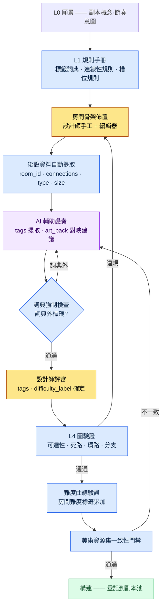

# 7.1 程式化關卡設計總綱

副本第47號房間的出口被堵死了。構建通過了,QA 也通過了。玩家在 Boss 房間前對著牆站著的截圖被髮到社群,是在上線第三天。那個房間是兩個季度前把手工製作的房間複製貼上過來的,複製的過程中,東側的一條通路沒有連線資訊,只留下了視覺外觀。沒有人驗證過它。當時也沒有能驗證它的工具。

本章講的是如何構建一種結構,讓這類事故在構建階段被自動攔截。關鍵不在於繪製空間的手上功夫,而在於用規則來運營附著於空間的資料的方式。

---

關卡設計的工作現場更接近製圖室。圖紙一張一張出自人手,但圖紙之間的一致性、複用與驗證,由圖紙櫃的運營規則決定。手工畫一個副本誰都會,而把100個副本用一致的難度曲線和沒有死路的圖運營起來,靠的不是手藝,而是系統的問題。

在筆者擔任策劃總監的專案A(面向國內 + 東南亞的 MMORPG,中等規模(10\~50人)團隊,移動端優先)中,這套系統的名字就是一份名為 `Procedural_Level_Design_Master` 的文件。本章講的是這份文件整合了什麼、AI 介入到哪一步、又在哪裡停手。筆者曾主導一款每一局都會重新生成副本的移動端 Roguelite RPG 的策劃,以規則運營程式化空間的這段經驗,構成了本章的底色。

## 7.1.1 兩條路 —— 是生成空間,還是運營空間的後設資料

關卡自動化分為兩個方向。一個是對空間本身進行程式化生成。BSP 分割(Binary Space Partitioning,把空間遞迴地二等分來佈置房間的經典手法)、wave function collapse、drunken walk 網格這類傳統 PCG(Procedural Content Generation,程式化內容生成)都屬於這一類。另一個是運營空間的後設資料 —— 房間標籤、連線性、難度標籤、事件槽位。

傳統 PCG 擅長第一種。在 Roguelike 或沙盒這類以"每局都是新地圖"為遊戲性核心的品類裡,第一種才是正解。但 MMORPG 不同。玩家會把同一個副本刷上幾十遍,刷到動線都背下來。所以副本必須是手工打磨的固定空間,而自動化能切入的位置不是空間本身,而是**讓這個空間可被運營的後設資料**。

後設資料為什麼是運營的脊柱,按產出物逐項來看就一目瞭然。

| 產出物 | 若沒有後設資料 |
|---|---|
| 數十個副本池 | 無法檢索哪個房間在哪裡,無法複用 |
| 難度曲線驗證 | 沒有各房間的難度標籤,無法繪製曲線 |
| 任務·Boss 位置自動佈置 | 沒有事件槽位後設資料,只能手動輸入座標 |
| 美術團隊同步 | 沒有房間型別 → 美術資源集的對映,視覺不一致 |
| 玩家動線·停留時間測量 | 無法進行基於房間 ID 的遙測 |

沒有後設資料的副本能構建出來,卻無法運營。就像藏書滿架卻沒有索引的圖書館。這正是本章聚焦於"空間後設資料運營"的原因。

## 7.1.2 總綱文件整合了什麼

`Procedural_Level_Design_Master` 把四項標準捆到一份文件裡:房間後設資料格式、房間標籤詞典、連線性規則、驗證檢查清單。先看看這四項散落各處時會發生什麼。五名設計師各自從不同檔案裡參照格式,`type` 欄位就有人寫 `combat`、有人寫 `Combat`、有人寫 `battle_room`。檢索壞掉,統計壞掉,最終自動化也壞掉。

把這四項標準按 Layer 歸位,各自的位置就很清晰。格式、詞典、規則位於支配生成的規則手冊(L1);生成出的房間正文位於內容層(L2);表格值位於資料層(L3);驗證位於構建·QA 門禁(L4)。

<svg viewBox="0 0 720 300" xmlns="http://www.w3.org/2000/svg" font-family="sans-serif" font-size="13">
  <rect x="20" y="20" width="680" height="44" rx="6" fill="#1e3a5f" stroke="#0f1f33"/>
  <text x="36" y="40" fill="#fff" font-weight="bold">L0 願景</text>
  <text x="120" y="40" fill="#cfe2ff">關卡概念·節奏意圖(不變錨點,每次生成·驗證都注入)</text>
  <text x="120" y="56" fill="#9fc0e8" font-size="11">—— art_pack 色調,難度意圖</text>

  <rect x="20" y="76" width="680" height="44" rx="6" fill="#2a5d3a" stroke="#173a22"/>
  <text x="36" y="96" fill="#fff" font-weight="bold">L1 系統</text>
  <text x="120" y="96" fill="#d6f5df">規則手冊 —— 房間後設資料格式 · 標籤詞典 · 連線性規則</text>
  <text x="120" y="112" fill="#a8dcb8" font-size="11">—— 總綱文件捆綁之處</text>

  <rect x="20" y="132" width="680" height="44" rx="6" fill="#5d4a2a" stroke="#3a2e17"/>
  <text x="36" y="152" fill="#fff" font-weight="bold">L2 內容</text>
  <text x="120" y="152" fill="#f5e6cf">附著了後設資料的房間正文(生成並打磨過的空間)</text>

  <rect x="20" y="188" width="680" height="44" rx="6" fill="#4a2a5d" stroke="#2e173a"/>
  <text x="36" y="208" fill="#fff" font-weight="bold">L3 資料</text>
  <text x="120" y="208" fill="#ead6f5">房間尺寸·連線表·事件槽位 ID·敵人資料</text>

  <rect x="20" y="244" width="680" height="44" rx="6" fill="#5d2a2a" stroke="#3a1717"/>
  <text x="36" y="264" fill="#fff" font-weight="bold">L4 構建·QA</text>
  <text x="120" y="264" fill="#f5d6d6">圖驗證 · 難度曲線驗證 · 美術資源集一致性門禁</text>
</svg>

所謂總綱文件整合四項標準,並不是"把正文全塞進一個檔案",而是"把規則匯聚到 L1 這個位置"。正因如此,後文將出現的自動化才能架設在 Layer 邊界之上(分離一旦崩塌會發生什麼,7.1.11 會講)。

## 7.1.3 房間後設資料格式 —— 自動化附著的輸入位

一個房間遵循以下格式。這份格式就是自動化的輸入介面。

```yaml
room_id: dungeon_021_room_07
dungeon: dungeon_021_silvermark_library
type: combat_room          # combat / puzzle / lore / safe / boss
size: medium               # small / medium / large
difficulty_label: hard_for_level_28
tags: [scholar_theme, vertical_layout, water_hazard]
connections:
  - target_room: dungeon_021_room_06
    type: door
    direction: south
  - target_room: dungeon_021_room_08
    type: passage
    direction: east
event_slots:
  - slot: enemy_spawn_1
    constraints: [scholar_enemy, level_28]
  - slot: lore_object_1
    constraints: [scholar_lore]
movement_complexity: 4     # 1~5
estimated_clear_time_sec: 90
art_pack: scholar_library_v2
```

每個欄位都有一個以上的自動化消費方。`type` 用於副本池統計和難度計算,`tags` 用於檢索·複用·美術資源集對映,`connections` 用於圖驗證(死路檢查),`event_slots` 用於任務·Boss 自動佈置。沒有消費方的欄位就不放進格式裡 —— 只會增加輸入成本,卻沒有價值。

## 7.1.4 房間標籤詞典 —— 小而正交

標籤是後設資料的檢索鍵。一旦無限增殖,檢索就會壞掉。抽屜上貼了200個標籤,就沒法找到什麼在哪裡。所以按5個類別 × 每個類別約6個 enum,合計約30個來運營。

| 類別 | enum 數 | 示例 |
|---|---|---|
| theme | 8 | scholar_theme, ruins_theme, forest_theme … |
| layout | 5 | vertical_layout, horizontal_corridor, open_arena … |
| hazard | 6 | water_hazard, fire_hazard, falling_hazard … |
| interaction | 4 | puzzle_required, lever_activation … |
| narrative | 7 | flashback_trigger, dialogue_zone … |

一個房間的標籤不超過5個,正常是3\~4個。要新增標籤,必須通過四道門禁:每季度至少是5個房間的使用候選;無法用現有標籤組合表達;檢索·美術資源集對映的用途明確;運營1個月後仍能維持5個房間。最後一條是關鍵。臨時造出來的標籤只用一次就被棄置,詞典就會被汙染。

## 7.1.5 程式化關卡管線 —— 從規則手冊到驗證

到目前為止的這些標準如何串成一條流程,這條連線線正是本章所支撐的骨架。它是一條從規則手冊出發、經過 AI 輔助變奏、以護欄驗證收尾的管線。



這條管線有三個特點值得點明。第一,規則手冊(L1)位於一切生成的上游。第二,AI 只在規則手冊所定義的詞典內變奏 —— F 門禁會把詞典外的輸出退回。第三,驗證(H·I·J)被固定為構建前的門禁,違規由程式碼攔截,而不依賴人的注意力。第47號房間的事故,正是因為沒有 H 門禁才發生的。

## 7.1.6 連線性規則 —— 用圖來驗證的護欄

房間後設資料的 `connections` 欄位把整個副本變成一張有向圖。一旦成為圖,驗證就是自動的。

| 檢查 | 違規時的處理 |
|---|---|
| 起始房間 → Boss 房間可達 | 以構建失敗攔截 |
| 死路(出口1個 + non-safe_room) | alert —— 設計師複核 |
| 雙向連線一致性(有 A→B 卻沒有 B→A) | 自動校正 |
| 環路長度 —— 2\~3個房間的短迴圈 | alert |
| 分支寬度 —— 同時4個以上的分支 | 設計師複核 |

測量指令碼是下面這個樣子。它是在標準圖演算法(最長路徑·平均出度·迴圈計數·最短路徑)之上,套了一層副本術語的薄封裝。

```python
# level_graph_metrics.py
def measure(dungeon):
    graph = build_graph(dungeon.rooms)
    return {
        "depth":            longest_path_length(graph),
        "branching_factor": avg_out_degree(graph),
        "loop_count":       count_loops(graph),
        "dead_ends":        count_dead_ends(graph),
        "boss_reachability": shortest_path(graph.start, graph.boss),
    }
```

五個指標會以可與其他副本比較的形式輸出,用作副本池的多樣性指標。不過指標多樣並不意味著副本有趣。指標是用來攔截事故的,不是用來保證趣味的。零死路並不能保證趣味。趣味來自設計師的洞察,而圖驗證只是托住底,別讓那份洞察被事故淹沒。

## 7.1.7 實操示例 —— 把 tags 提取交給 AI、拒絕、再請求

自動化裡,人最常想撒手不管的部分就是 `tags` 輸入。給100個房間打標籤很枯燥,只看房間截圖連人都會犯迷糊。這種重複且判定標準明確的活兒,恰恰是 AI 適合承接初稿的位置。本節把實際跑過的那套工作流 —— 提示詞、AI 被拒絕的輸出、人的再請求 —— 原樣鋪開,不加任何修飾。

**第一次提示詞:**

```
[輸入]
- 房間截圖:(附件)
- 房間面積:18m × 12m,天花板高9m(垂直2層結構)
- 佈置的敵人:scholar_phantom × 3, water_elemental × 1
- 相鄰房間 type:lore_room(西側), combat_room(東側)
- 房間內有淺水窪

從下面的詞典裡,只挑3~5個適合這個房間的標籤。不要造詞典外的標籤,
只用逗號分隔標籤 enum。

[標籤詞典 30個]
theme: scholar_theme, ruins_theme, forest_theme, cave_theme,
       crypt_theme, swamp_theme, mechanical_theme, celestial_theme
layout: vertical_layout, horizontal_corridor, open_arena,
        maze_layout, bridge_layout
hazard: water_hazard, fire_hazard, falling_hazard,
        poison_hazard, crush_hazard, dark_hazard
interaction: puzzle_required, lever_activation, key_gate, hidden_passage
narrative: flashback_trigger, dialogue_zone, lore_object_zone,
           ambush_setup, ritual_site, vista_point, rest_anchor
```

**Claude 第一次輸出(原始未加工):**

```
scholar_theme, vertical_layout, water_hazard, ambush_setup, two_story_layout
```

這裡直接暴露出兩個問題。一是 `two_story_layout` 是詞典裡沒有的標籤——模型被"垂直2層結構"這個輸入帶偏,造出了詞典外的詞。二是標籤已經觸到5個的上限,而 `vertical_layout` 和 `two_story_layout` 在語義上重疊,相當於在 layout 類別裡佔了兩格。

**人的拒絕判斷。** `two_story_layout` 違反了詞典強制,屬於自動拒絕物件(管線的 F 門禁)。`ambush_setup` 則兩可 —— 雖然佈置了3只敵人,但從截圖看,究竟是伏擊佈局還是單純的戰鬥房間,並不清楚。這有可能是模型過度解讀了。相鄰房間都是 lore/combat,敘事性伏擊觸發的依據很薄弱。拒絕。

**第二次再請求:**

```
two_story_layout 詞典裡沒有,而且和 vertical_layout 重疊。去掉。
ambush_setup 也去掉 —— 有敵人不等於就是伏擊。
// (意圖:narrative 標籤只在敘事意圖明確時使用,單純戰鬥已由 type 表達)
空位不必硬湊。3~4個才正常。重新打標籤。
```

**Claude 第二次輸出:**

```
scholar_theme, vertical_layout, water_hazard
```

這次減到了3個,全部在詞典之內,也沒有類別重複。人接受了這個結果。房間格式裡的 `tags: [scholar_theme, vertical_layout, water_hazard]` 就這樣定了下來。

這個實操示例的教訓有兩條。第一,AI 會對輸入裡的某個細節("2層")過擬合,從而衝出詞典之外 —— 詞典強制門禁必須在程式碼層面把它攔住。第二,AI 有填滿空位的傾向 —— 不明說"不必硬湊",它就會把5格全填滿。這兩種失敗都很常見,而兩條處方都不能靠提示詞,得由規則手冊(詞典 + 上限)來強制,才穩定。

## 7.1.8 後設資料量產 —— 誰來填,誰來評審

設計師手工填一個房間的後設資料要花5\~10分鐘。一個副本(20\~30個房間)就是2\~5小時,100個副本就是200\~500小時(筆者估算,未經驗證 —— 以每個房間的平均輸入時間 × 房間數換算出的上限值)。全部手工填,設計師就成了後設資料輸入的奴隸。

所以要按領域劃分填寫的主體。

| 領域 | 填寫主體 |
|---|---|
| room_id · dungeon · connections | 編輯器自動提取(L3) |
| type · size | 基於房間面積·連線數的自動分類 |
| tags | AI 輔助 + 設計師評審(7.1.7) |
| event_slots | 按房間 type 的規則手冊 |
| difficulty_label | 房間內敵人資料彙總的自動計算 |
| art_pack | 房間 type · 副本 theme 對映 |

設計師親手確定的,大概只有 `tags` 的評審和 `difficulty_label` 的最終審批。其餘由工具來填,人來評審。自動化的目的,是把設計師從輸入中解放出來,讓他回到節奏、標誌性房間、複用策略這些判斷上。

## 7.1.9 房間複用及其陷阱

總綱標準最大的效用是房間複用。有30個能用標籤檢索的房間,就能組合出5\~10個副本。但複用比例一高,副本就會變得乏味。所以複用要連帶配上護欄。

| 護欄 | 定義 |
|---|---|
| 一個房間最多出現在5個副本中 | 自動追蹤出現頻次 |
| 第二次出現時強制視覺變奏 | 更換燈光·道具 |
| Boss 房間·標誌性房間禁止複用 | 用 flag 強制 |
| 追蹤複用房間的負面反饋 | 玩家遙測 |

複用是降低成本的手段,不是目的。一旦把複用率本身當成 KPI,玩家體驗就會變得單調。0%(所有房間都是新的)會讓量產成本暴漲,超過70%則各個副本彼此難以區分。從經驗看,30\~40% 這個區間是成本與多樣性的平衡點(方向性觀察,精確閾值因專案而異)。

## 7.1.10 常見失敗與處方

| 模式 | 處方 |
|---|---|
| 後設資料格式被5個人解讀出5種 | 用總綱文件在 L1 統一 |
| 標籤增殖到50\~100個 | 30個詞典 + 四道門禁 |
| 不做死路檢查就構建 | 把圖驗證設為構建門禁 |
| 設計師手工處理所有後設資料 | 編輯器提取 + AI 輔助 |
| AI 生成詞典外標籤 | 用詞典強制門禁自動拒絕 |
| 複用0%或70%+ | 30\~40% 區間 + 變奏護欄 |

## 7.1.11 Layer 分解是程式化關卡生成的前提

到目前為止,以規則手冊·生成·驗證展開的 7.1.2\~7.1.6 的結構本身,就是 Layer 分解的產物。"Layer 分解是程式化生成·自動化的前提"這一一般命題(L0 錨點 → L1 規則手冊 → L2 正文 → L3 數值 → L4 門禁,揉成一團生成就會崩塌),已在 §6.6 講過。這裡把它應用到關卡後設資料運營上。

沒有這層分離,房間佈置·BSP·節奏·敘事觸發器就會混在一個檔案裡,每移動一個房間,節奏意圖·事件槽位·連線性圖就會同時壞掉。就像製圖室·材料倉庫·驗收室全堆在一張桌子上,抽走一張圖紙,材料送貨單和驗收單也跟著被帶出去。所以 7.1.7 的 AI 輔助能運作,也是靠 Layer。房間 ID·連線性在編輯器(L3 自動提取)填,標籤在 AI(L1 詞典強制)填,difficulty_label 在彙總(L3→L4)填。自動化是架設在 Layer 邊界之上;若架在一整團之上,第一個季度內事故就會暴增,工具本身隨之被廢棄。

不過,這並不意味著一開始就得把五格抽屜完美備齊。分離要漸進,介面要窄,這是原則。第一個季度裡,哪怕只分出 L1 規則手冊(標籤詞典 + 連線性規則)和 L3 表格(房間後設資料表),自動化也就有了切入的位置。L0 節奏意圖和 L4 驗證門禁,在後續季度裡逐步填。標準統一了,自動化才有切入的位置;自動化切入得越多,設計師就越是從一個房間的手工操作裡脫身,轉而專注於節奏、標誌性、複用的判斷。

---

### 本章要點

- 關卡自動化的新位置不在空間本身,而在空間後設資料的運營。
- 驗證必須固定為構建門禁,而不是靠人的注意力,事故才不會漏到線上。
- AI 變奏只在規則手冊定義的詞典內允許,詞典外的輸出由程式碼拒絕。

---

## 動手試試

**setup.** 選一個副本,為每個房間做一張只含 `room_id · type · connections · tags` 四個欄位的 YAML 表。標籤則先把5個類別、約30個 enum 的詞典固定在一張紙上。

**prompt.** 放入房間截圖 + 面積 + 敵人種類 + 相鄰房間 type,用"只從這個詞典裡挑3\~5個標籤,禁止詞典外標籤,不要硬湊空位"來請求(照搬 7.1.7 的提示詞)。

**verify.** (1) 如果 AI 輸出裡有詞典外標籤,就拒絕並再請求。(2) 用 `connections` 構建圖,檢查起始→Boss 的可達性和死路 —— 只要出現一處違規,就把那個房間標記為不可構建。

### 單人精簡版

如果你是沒有工具基礎設施的單人開發者,就把總綱文件從一頁 Markdown 開始。標籤詞典30行、連線性規則5行、驗證檢查清單5行,就夠了。圖驗證方面,房間在10個以下的話,在紙上畫箭頭、只用眼睛確認死路,也能拿到80%的效果。關鍵不是工具,而是"給房間附上資料,再用規則檢查這些資料"這個習慣本身。工具等到房間超過50個、手工檢查變得吃力時,再引入即可。

### 下一章預告

- 7.2 BehaviorTree 編輯器 —— 把關卡的相鄰領域 AI 行為樹,基於規則手冊·後設資料來運營
