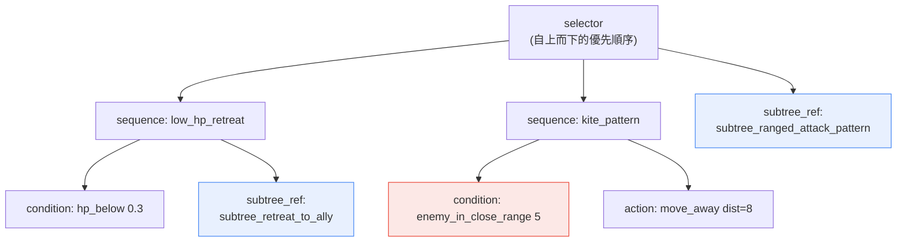
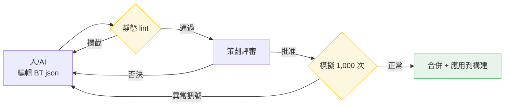

# 7.2 BehaviorTree 編輯器 —— 人與 AI 共同編輯並驗證 BT json 的實操記錄(worked transcript)

一隻見習法師貼著玩家揮刀砍殺。這是一個按遠端法術施法者設計的 NPC。它的 HP 薄如紙片,近戰中只要挨一下就會死,可它卻毫無拉開距離的打算。構建日誌裡沒有任何報錯。在編輯器裡重新開啟 BehaviorTree,節點也都好好地連著。盯著看了一個小時,才找到原因:後退分支的距離條件填的不是 `5`,而是 `0.5`。本該在敵人進入 5 米以內時就逃跑,可現在只有對方逼近到 0.5 米——也就是幾乎貼臉——後退分支才會觸發。

問題只是一個數字。在圖形化節點編輯器裡,這個數字要展開節點內部的面板才看得到,而且不會留在變更歷史裡。沒有辦法追溯是誰在什麼時候改了這個值。從那天起,筆者的專案A 就不再用圖形方式,而是改用 json 來處理 BehaviorTree。本章記錄的,正是人與 AI 共同編輯這份 json、再由機器自動驗證的一個完整週期。

---

## 7.2.1 BT(BehaviorTree,行為樹)從手中失控的地方

行為樹是定義敵方 NPC 戰鬥、移動、反應的事實標準結構。選擇器(selector)按優先順序依次嘗試各分支,序列(sequence)則把條件與動作按順序串起來。結構本身很簡單。問題在於規模。

在筆者的專案A 中,一個敵方 NPC 的 BT 大約由 50\~200 個節點構成,而需要運營的 NPC 超過了 100 個。相乘之後,BT 節點總量就達到數萬量級。在這個規模下,總會有那麼一刻——面對"改動這個後退模式會影響到哪些 NPC?"這樣的問題,人已經無法回答了。這就像桌上攤開著一百本筆記,改了第一本里的一行,卻要用眼睛去追剩下九十九本中哪裡會受到波及。

筆者從圖形化 BT 轉向 json 時,提出了四點要求。

<svg viewBox="0 0 720 250" xmlns="http://www.w3.org/2000/svg" font-family="sans-serif">
  <rect x="0" y="0" width="720" height="250" fill="#fafafa" stroke="#ddd"/>
  <rect x="30" y="30" width="300" height="80" rx="8" fill="#e8f0fe" stroke="#4285f4"/>
  <text x="180" y="58" text-anchor="middle" font-size="15" font-weight="bold" fill="#1a73e8">以文本形式儲存(json)</text>
  <text x="180" y="82" text-anchor="middle" font-size="12" fill="#444">用 git diff 追蹤到每一行改動</text>
  <text x="180" y="100" text-anchor="middle" font-size="12" fill="#444">"一個數字"的事故會留在歷史裡</text>

  <rect x="390" y="30" width="300" height="80" rx="8" fill="#e6f4ea" stroke="#34a853"/>
  <text x="540" y="58" text-anchor="middle" font-size="15" font-weight="bold" fill="#188038">節點後設資料標準化</text>
  <text x="540" y="82" text-anchor="middle" font-size="12" fill="#444">用 category、tags 檢索與複用</text>
  <text x="540" y="100" text-anchor="middle" font-size="12" fill="#444">"查詢相似 BT"變成一行查詢</text>

  <rect x="30" y="140" width="300" height="80" rx="8" fill="#fef7e0" stroke="#fbbc04"/>
  <text x="180" y="168" text-anchor="middle" font-size="15" font-weight="bold" fill="#b06000">subtree 引用(引用複用)</text>
  <text x="180" y="192" text-anchor="middle" font-size="12" fill="#444">一個公共模式由多個 BT 共享</text>
  <text x="180" y="210" text-anchor="middle" font-size="12" fill="#444">只改一處 → 批次應用,而非複製貼上</text>

  <rect x="390" y="140" width="300" height="80" rx="8" fill="#fce8e6" stroke="#ea4335"/>
  <text x="540" y="168" text-anchor="middle" font-size="15" font-weight="bold" fill="#c5221f">變更影響自動視覺化</text>
  <text x="540" y="192" text-anchor="middle" font-size="12" fill="#444">subtree 的修改會波及哪些 BT</text>
  <text x="540" y="210" text-anchor="middle" font-size="12" fill="#444">由指令碼算出,而非靠人推測</text>
</svg>

商用遊戲引擎自帶的 BT 編輯器整合方便,視覺化除錯能力強。只是它往往以二進位制(binary)資產的形式儲存,文本 diff 與變更影響追蹤較弱。筆者的專案A 面向的是運營 BT 超過 100 個的長期運營(LiveOps)遊戲,因此選擇了自行開發獨立的 json BT 格式與編輯器。有一點要講清楚:這並非所有團隊的正確答案。如果運營 BT 不足 50 個,直接沿用引擎自帶的編輯器幾乎總是更划算。自研的正當性,本章末尾會再談。

---

## 7.2.2 BT json —— 用文本描述一個敵人的行為

先看看成品的樣子。下面是學者公會遠端支援型 NPC 的一部分 BT。核心有兩點:一是所有行為都是文本,git 能逐行追蹤;二是用 `subtree_ref` 來引用公共模式。

```json
{
  "bt_id": "bt_scholar_archer_v3",
  "category": "ranged_combatant",
  "tags": ["scholar_faction", "ranged", "support"],
  "description": "學者公會遠端支援型。保持距離 + 後退優先。",
  "root": {
    "type": "selector",
    "children": [
      {
        "type": "sequence",
        "name": "low_hp_retreat",
        "children": [
          {"type": "condition", "fn": "hp_below", "param": 0.3},
          {"type": "subtree_ref", "id": "subtree_retreat_to_ally"}
        ]
      },
      {
        "type": "sequence",
        "name": "kite_pattern",
        "children": [
          {"type": "condition", "fn": "enemy_in_close_range", "param": 5},
          {"type": "action", "fn": "move_away", "param": {"distance": 8}}
        ]
      },
      {"type": "subtree_ref", "id": "subtree_ranged_attack_pattern"}
    ]
  }
}
```

把這棵樹畫成圖,就是選擇器自上而下嘗試三個分支的結構。請注意:開頭那個 bug——`enemy_in_close_range` 的 `param` 是 `5` 還是 `0.5`——在 json 裡變成了一眼就能看見的一行。



| 元素 | 作用 |
|---|---|
| `bt_id` | git diff、變更追蹤鍵 |
| `category`、`tags` | 檢索、複用單位 |
| `subtree_ref` | 引用公共模式(改一處 → 更新多個 BT) |
| `description` | 供策劃、劇情作者共享 |

標紅的 `enemy_in_close_range 5` 就是開頭那個讓人耗掉一個小時的節點。在 json 裡,一次程式碼評審就能揪出來。

---

## 7.2.3 subtree 庫 —— 用引用取代複製貼上

超過 100 個敵人的行為裡存在重複的模組。比如"退到盟友身後""退到掩體後""遠端攻擊模式"這類。如果把它們複製進每個 BT,那麼改一處後退邏輯時,就得手動找出一百個地方逐一修改。因此,公共模式被拆分成獨立的 subtree 檔案,只用 `subtree_ref` 來引用。

```
subtree_library/
├── retreat_patterns/
│   ├── subtree_retreat_to_ally.json
│   ├── subtree_retreat_to_cover.json
│   └── subtree_retreat_random.json
├── attack_patterns/
│   ├── subtree_ranged_attack_pattern.json
│   ├── subtree_melee_combo.json
│   └── subtree_aoe_attack.json
└── reaction_patterns/
    ├── subtree_react_to_ally_death.json
    └── subtree_react_to_player_taunt.json
```

這樣安排後,"改動這個 subtree 會影響到誰?"這個問題就不再是人的推測,而成為指令碼的輸出。影響追蹤器很簡單:開啟所有 BT,收集引用了該 subtree 的 BT 的 `bt_id`。

```python
# bt_impact_tracker.py
import json, glob

def has_subtree_ref(node, target_id):
    if isinstance(node, dict):
        if node.get("type") == "subtree_ref" and node.get("id") == target_id:
            return True
        for child in node.get("children", []):
            if has_subtree_ref(child, target_id):
                return True
    return False

def find_affected_bts(subtree_id):
    affected = []
    for bt_file in glob.glob("bts/*.json"):
        bt = json.load(open(bt_file, encoding="utf-8"))
        if has_subtree_ref(bt["root"], subtree_id):
            affected.append(bt["bt_id"])
    return affected

# 使用
affected = find_affected_bts("subtree_ranged_attack_pattern")
# → ["bt_scholar_archer_v3", "bt_ranger_v2", "bt_sniper_v1", ...]
```

在筆者的專案A 中,這個函式被繫結到了變更請求(Pull Request)階段。只要有人改動 subtree 檔案,受影響的 BT 列表就會自動作為評論附到 PR 上。評審者在合併前就能看到"只改了一行後退模式,卻讓 12 個遠端敵人全部發生了變化"這一事實。

---

## 7.2.4 實操記錄 —— AI 撰寫新 BT 初稿的一個週期

從這裡開始,是本章分量最重的部分。所謂實操記錄(worked transcript),就是完整保留的真實操作過程記錄:本節把新敵方 NPC"見習法師"的 BT 初稿交給 AI,再由人對其輸出進行驗證、否決、重新請求——這一整個週期不加修飾、原樣呈現。之所以不做順滑刪減,是有原因的:AI 在第一次輸出裡錯在哪裡、怎麼錯的,這種失敗的紋理正是本章想要傳達的全部。

### Step 1 —— 人給出的提示詞(全文)

```
[敵方 NPC 概念]
學者公會的見習法師。HP 低,法術傷害高。
優先規避近戰。退到盟友身後後再施放法術攻擊。

[category] ranged_combatant

[參考 BT] bt_scholar_archer_v3
(結構相似。只是把弓箭攻擊換成法術攻擊)

[已定義的函式 enum]
condition: hp_below, enemy_in_close_range, ally_nearby, mana_below
action: move_away, cast_spell, retreat, wait
subtree_ref id(可用列表):
- subtree_retreat_to_ally
- subtree_ranged_attack_pattern   # 基於弓箭。不用於法術
- subtree_magic_attack_pattern

請僅按這個概念編寫 BT root 節點的 json。儘量使用 subtree_ref,直接節點儘量少,
函式只能取自上面的 enum。不要新增概念中沒有的行為。不要說明,只要 json。
```

### Step 2 —— Claude 的第一次輸出(未加工,原樣呈現)

```json
{
  "bt_id": "bt_scholar_apprentice_v1",
  "category": "ranged_combatant",
  "tags": ["scholar_faction", "magic", "fragile"],
  "description": "學者公會見習法師。近戰規避 + 退到盟友身後 + 法術攻擊。",
  "root": {
    "type": "selector",
    "children": [
      {
        "type": "sequence",
        "name": "low_hp_retreat",
        "children": [
          {"type": "condition", "fn": "hp_below", "param": 0.4},
          {"type": "subtree_ref", "id": "subtree_retreat_to_ally"}
        ]
      },
      {
        "type": "sequence",
        "name": "avoid_melee",
        "children": [
          {"type": "condition", "fn": "enemy_in_close_range", "param": 6},
          {"type": "action", "fn": "move_away", "param": {"distance": 10}}
        ]
      },
      {
        "type": "sequence",
        "name": "mana_recover",
        "children": [
          {"type": "condition", "fn": "mana_below", "param": 0.2},
          {"type": "action", "fn": "wait", "param": {"frames": 120}}
        ]
      },
      {"type": "subtree_ref", "id": "subtree_ranged_attack_pattern"}
    ]
  }
}
```

### Step 3 —— 人的驗證與否決

拿到輸出後,先過一遍 lint(下一節會講),再用眼睛讀。有三處出了問題。

1. **最後一個分支錯了。** `subtree_ranged_attack_pattern` 是基於弓箭的攻擊模式。儘管 enum 註釋裡寫了"不用於法術",AI 還是拿來了名字相似的弓箭模式。見習法師應該用 `subtree_magic_attack_pattern`。—— **否決。**

2. **添加了概念中沒有的行為。** `mana_recover` 分支(`mana_below` → `wait 120frame`)是概念裡隻字未提的行為。儘管提示詞裡明確寫了"禁止新增未指定的行為",AI 似乎還是判斷"既然是法師,管理法力就很自然",於是把它塞了進來。看著合理,卻違反了規格說明。—— **否決。**

3. **後退閾值可疑。** `hp_below 0.4` 比參考 BT(`0.3`)更早開始後退。見習法師確實更脆弱,所以這可能是有意為之。但 AI 從未給出依據,因此這是該由策劃決定的事項。—— **保留,待策劃確認。**

### Step 4 —— 人的重新請求

```
只改這三處。最後一個分支 subtree_ranged_attack_pattern 是弓箭模式,
換成 subtree_magic_attack_pattern;mana_recover 分支概念裡沒有,整段刪除;
hp_below 0.4 改回參考 BT 的 0.3——如果有理由用 0.4,就在 description 裡寫一行。
其餘保持不變,只要 json。
```

### Step 5 —— Claude 的第二次輸出(修訂版)

```json
{
  "bt_id": "bt_scholar_apprentice_v1",
  "category": "ranged_combatant",
  "tags": ["scholar_faction", "magic", "fragile"],
  "description": "學者公會見習法師。近戰規避 + 退到盟友身後 + 法術攻擊。HP 低,後退閾值保持 0.3(與 archer 相同)。",
  "root": {
    "type": "selector",
    "children": [
      {
        "type": "sequence",
        "name": "low_hp_retreat",
        "children": [
          {"type": "condition", "fn": "hp_below", "param": 0.3},
          {"type": "subtree_ref", "id": "subtree_retreat_to_ally"}
        ]
      },
      {
        "type": "sequence",
        "name": "avoid_melee",
        "children": [
          {"type": "condition", "fn": "enemy_in_close_range", "param": 6},
          {"type": "action", "fn": "move_away", "param": {"distance": 10}}
        ]
      },
      {"type": "subtree_ref", "id": "subtree_magic_attack_pattern"}
    ]
  }
}
```

第二次輸出通過了 lint,策劃在檢查時把 `avoid_melee` 的距離 `6` 對齊 archer 下調一檔到 `5`,隨後交給了模擬驗證關卡。這裡能學到的東西很清楚:AI 能快速填出 BT 的骨架,但幾乎每次都會犯兩類錯誤——"拉來名字相似的錯誤 subtree"和"把貌似合理的額外行為在無規格依據的情況下塞進來"。這兩類錯誤只能靠人的眼睛和 lint 關卡攔下。因此 AI 的輸出是初稿,而非最終稿。

---

## 7.2.5 自動 lint —— 機器先一步抓住人會漏掉的東西

BT 直接關係到使用者體驗。如果敵人貼臉卻不逃跑的事故就這樣上線,最終會以評分的形式反噬回來。所以在合併前,先由機器檢查一遍。

| 檢查項 | 違反時 |
|---|---|
| 不可達節點 | alert(選擇器中永遠觸及不到的分支) |
| 無限迴圈風險 | 攔截(沒有退出條件的 sequence 迴圈) |
| `subtree_ref` 目標不存在 | 攔截 |
| 動作/條件函式在 enum 之外 | 攔截 |
| 節點數激增(>500) | alert(建議拆分 BT) |
| 同一 category 內 BT 響應時間偏差 | alert(疑似平衡迴歸) |

最後一項是這套 lint 的獨到之處。如果同屬 `ranged_combatant` 的五個 BT,在模擬中的平均響應時間明顯拉開,那就是有人不知不覺破壞了某一個的平衡的訊號。它是用統計手段去捕捉靜態檢查抓不到的"苗頭"的裝置。

靜態 lint 之後是模擬驗證。無需打出實際構建,直接在模擬器裡把 BT 跑 1,000 次,統計出各項資料。

| 測量項 | 正常範圍 |
|---|---|
| 平均生存時間(對標準玩家) | 按 category 的基準值 |
| 攻擊模式多樣性(熵) | 0.6 以上 |
| 後退/接近行為比例 | 按 category 的基準值 |
| 單次行為平均耗時 frame | 60 frame 以下 |

不用打包出實際構建,在 5\~10 分鐘內就能看出"這個 BT 是不是死得太快""是不是隻重複一種行為"。一旦出現異常訊號,就改 json、重跑模擬。這個週期從以天計縮短到以分鐘計,正是 json 化的實際收益。



---

## 7.2.6 度量 —— 什麼減少了

下面用表格列出筆者的專案A 引入前後的對比。絕對數值會隨團隊規模、遊戲型別而變化,因此屬於筆者的推測(未經驗證)。但方向與比例,是實際運營中觀察到的原樣結果。

| 專案 | 引入前(直接用引擎自帶 BT) | 引入後(json + 編輯器) |
|---|---|---|
| 編寫一個新敵人的 BT | 1\~2 天 | 2\~4 小時 |
| 掌握 BT 變更影響 | 依賴推測與經驗 | 自動(subtree 影響列表) |
| 變更後驗證 | 需要實際構建 | 模擬 5\~10 分鐘 |
| 運營 100 個敵方 NPC | 3 名策劃全職 | 1\~2 名策劃 |
| 上線後 BT 事故(異常行為) | 每季度 10\~15 起(筆者推測) | 每季度 2\~4 起(筆者推測) |

最有意義的是,最後兩行同時發生了變化。通常削減人手會導致質量下降。而這裡,策劃人數減少的同時,事故也減少了。因為原本由人手動追蹤的變更影響與驗證,被機器接管了。自動化的價值,與其說在於"變快",不如說在於這種"人減少的同時質量反而變好"。

---

## 7.2.7 自研,還是借用現成方案

讀完本章就下結論"我們也來做一個 json BT 編輯器吧",那可就麻煩了。筆者的專案A 之所以選擇自研,是因為特定條件恰好都湊齊了。

| 選項 | 優 / 劣 |
|---|---|
| 直接使用引擎自帶 BT | 整合容易 / json 轉換、diff 弱 |
| 借用外部 BT 庫 | 標準化優勢 / 學習曲線、定製受限 |
| 自研 json BT 編輯器 + 執行時 | 自由度、可追蹤性最高 / 開發成本大 |

專案A 選擇第 3 項的依據有四點。

- diff、git 追蹤是必需的——自帶 BT 是二進位制資產,無法追蹤開頭那個"一個數字"的事故。
- subtree 引用與自動影響追蹤是運營的核心——這在標準 BT 工具裡是薄弱功能。
- 需要在與構建分離的執行時裡跑模擬驗證。
- 以 AI 輔助編寫為前提——基於文本(json)對大語言模型(LLM, Large Language Model)有著壓倒性的親和力。

開發成本約 1\~2 個月。只有當運營 BT 達到 100\~300 個、且長期運營週期足夠長時,才收得回來。在 30\~50 個的規模下是回不了本的。也就是說,自研的投資回報(ROI, Return On Investment)只有在規模和運營週期兩者都有保障時才會出現。如果是小團隊,那就只從本章帶走這幾條原則——"用 json 儲存""用 subtree 引用""AI 輸出要通過 lint + 評審關卡"——而工具則應當搭在自帶編輯器或外部庫之上使用。

---

## 7.2.8 常見的失敗

| 模式 | 處方 |
|---|---|
| 只把 BT 當作二進位制資產來管理 | 儲存為 json,讓 git 追蹤重新可用 |
| 不用 subtree,在每個 BT 裡複製貼上相同模式 | 拆到 subtree 庫裡去引用 |
| 手工做 BT 影響追蹤 | 把影響分析指令碼繫結到 PR 上 |
| 不用模擬,只在實際構建裡驗證 | 執行一個與構建分離的模擬器 |
| 不經評審就使用 AI 輸出的 BT | 讓它通過 lint + 策劃 + 模擬三重關卡 |
| 不衡量自研 ROI | 只在 100 個以上、且長期運營時才自研 |

---

### 本章要點

- 只有把 BT 儲存為 json,"一個數字"的事故才會留在 git diff 裡、可被追蹤。
- subtree 引用與自動影響追蹤,能擋住 100 個規模運營中的複製貼上地獄。
- AI 能快速填出 BT 的骨架,但錯誤的引用和規格之外的行為要靠人來抓。

---

## 動手試試

這是小團隊今天就能嘗試的最小週期。

**setup** —— 把一個正在運營的敵方 NPC 的 BT 親手寫成 json(`bt_id`、`category`、`tags`、`root`)。把一塊公共的後退/攻擊模式拆到 `subtree_library/` 裡,用 `subtree_ref` 來引用。

**prompt** —— 把一個相似的新敵人交給 AI。直接套用上面實操記錄裡的提示詞骨架(概念 + category + 參考 BT + 可用函式 enum + "禁止新增未指定的行為" + "只要 json")即可。

**verify** —— 讓 AI 的輸出通過三道關卡後再合併:(1)過濾 enum 之外的函式與不存在的 subtree 的 lint,(2)人眼,(3)模擬或遊戲內的簡短驗證。務必確認 AI 是否塞進了"名字相似的錯誤 subtree"和"貌似合理卻在規格之外的行為"。

### 單人精簡版

如果沒有餘力去做編輯器,那麼工具只要文本編輯器加 git,再加一個 30 行的 `bt_impact_tracker.py` 就夠了。把用自帶編輯器寫好的 BT 匯出成 json 上傳到 git,只把 subtree 拆成獨立檔案來引用。再把影響追蹤指令碼掛到提交鉤子(commit hook)上,哪怕是一個人,也能把"改動這個後退模式會讓哪個敵人發生變化"從推測變成輸出。僅憑這一個習慣,開頭那個"一個數字耗掉一個小時",就縮短成了程式碼評審裡的一行。

---

### 下一章預告

- 7.3 副本·野外模式庫 —— 把房間後設資料與 subtree 模式結合,將關卡打包成運營單位。
