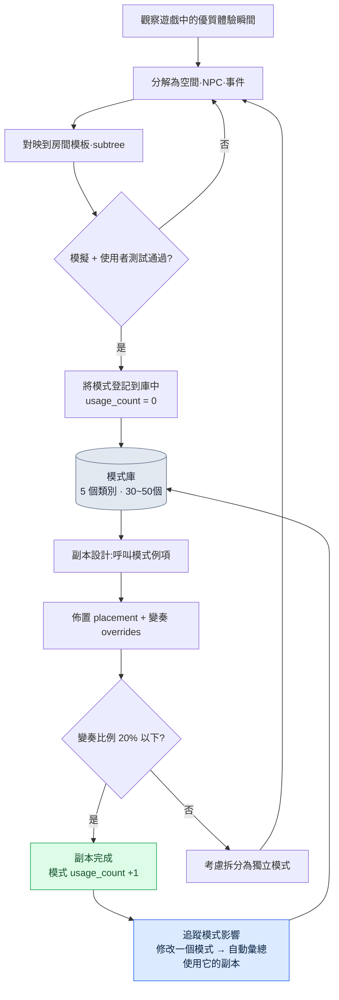

# 7.3 副本·野外模式庫

在一次副本評審會上,一位新人關卡設計師把自己做的一個副本投到了螢幕上。狹窄的走廊、從後方緊追的快速敵人、在岔路口的閃避抉擇。這是個做得不錯的副本。問題在於,它和我們此前已經在十一個不同副本里做過的東西有著微妙的差異。敵人的追擊速度、陷阱觸發的時機、岔路口出現的時點,沒有一處是相同的。這位新人相信自己做出的是名為"追擊副本"的同一種體驗,但使用者實際感受到的手感卻副本各異。

那天我們做的決定很簡單:把"走廊追擊"這種體驗精確地定義一次,然後把這個定義固化下來。下次無論誰做追擊副本,都不再從零開始搭建,而是取出這個固化好的定義來用。這就是模式庫的開端。

如果說房間是空間單元、BehaviorTree(行為樹)是行為單元,那麼模式就是把空間、行為與事件捆在一起的運營單元。一個模式被多個副本複用後,量產負擔會減輕;更重要的是,使用者獲得的體驗能在各副本之間保持一致。

---

## 7.3.1 作為運營單元的模式

拿菜譜裡的食譜來打比方就很準確。一份食譜上,食材、烹飪步驟、火候、成品照片一併列出。哪怕換了餐廳,只要照同一份食譜來做,味道就一樣。只不過每家餐廳允許略作變奏。模式也一樣:空間(房間)、行為(BT 子樹)、事件(event)、結果(獎勵·難度),再加上設計師的意圖說明,一併打包在內。

<svg viewBox="0 0 720 250" xmlns="http://www.w3.org/2000/svg" font-family="sans-serif" font-size="13">
  <rect x="10" y="10" width="700" height="230" fill="#fafafa" stroke="#ccc"/>
  <text x="360" y="35" text-anchor="middle" font-size="15" font-weight="bold">模式 = 五個要素的組合</text>
  <rect x="40" y="60" width="120" height="60" rx="6" fill="#e3f0ff" stroke="#5a8fd0"/>
  <text x="100" y="85" text-anchor="middle" font-weight="bold">空間</text>
  <text x="100" y="105" text-anchor="middle" font-size="11">房間後設資料 1~3個</text>
  <rect x="180" y="60" width="120" height="60" rx="6" fill="#e9f7e9" stroke="#6aa86a"/>
  <text x="240" y="85" text-anchor="middle" font-weight="bold">行為</text>
  <text x="240" y="105" text-anchor="middle" font-size="11">BT 子樹 1~2個</text>
  <rect x="320" y="60" width="120" height="60" rx="6" fill="#fdf3e0" stroke="#d0a05a"/>
  <text x="380" y="85" text-anchor="middle" font-weight="bold">事件</text>
  <text x="380" y="105" text-anchor="middle" font-size="11">event 槽</text>
  <rect x="460" y="60" width="120" height="60" rx="6" fill="#fde9ec" stroke="#d05a6e"/>
  <text x="520" y="85" text-anchor="middle" font-weight="bold">結果</text>
  <text x="520" y="105" text-anchor="middle" font-size="11">獎勵·難度規則</text>
  <rect x="600" y="60" width="90" height="60" rx="6" fill="#f0e9fd" stroke="#8a5ad0"/>
  <text x="645" y="85" text-anchor="middle" font-weight="bold">意圖</text>
  <text x="645" y="105" text-anchor="middle" font-size="11">說明</text>
  <text x="360" y="160" text-anchor="middle" font-size="13" font-style="italic">"走廊追擊模式" = 狹窄走廊 + 快速敵人 BT + 陷阱 event + 閃避獎勵</text>
  <line x1="100" y1="180" x2="620" y2="180" stroke="#999" stroke-width="1"/>
  <text x="360" y="210" text-anchor="middle" font-size="12">→ 一經驗證,即可在 5~10 個副本中再生產同一種體驗</text>
</svg>

一個模式一旦定義好,就能讓每個副本都穩定地產出同一種體驗——就像一份經過驗證的食譜能在多家餐廳做出同一種味道。只不過同一份食譜,每家餐廳仍會留一點變奏。如何管理這些變奏,佔了模式運營的一半分量。後文要講的 overrides 就是這一環。

---

## 7.3.2 模式的組合流程

模式庫的核心在於:先把模式固化為規則手冊,再把它們組合起來生成副本。設計師不是在空白螢幕上從頭搭建副本,而是挑選經過驗證的模式加以佈置,只對一部分作變奏。



這條流程的左半段(觀察→分解→對映→驗證→登記)是製造模式的過程,右半段(呼叫→佈置·變奏→完成→追蹤)是消費模式的過程。製造很少發生,消費則頻繁發生。庫運營得當時,這種不對稱就會轉化為量產效率。

---

## 7.3.3 五個基本類別

筆者的專案A屬於動作RPG一類,因此把模式分為五個類別。這套分類依賴於品類。若是恐怖遊戲,埋伏與敘事節拍的比重會不同;若是解謎遊戲,利用環境的戰鬥會成為核心。不要把分類本身當作絕對,應先確定自己遊戲的核心體驗是什麼,再來劃定類別。

| 類別 | 核心體驗 | 示例 |
|---|---|---|
| pursuit | 追擊·逃脫 | 走廊追擊、峽谷逃脫 |
| ambush | 埋伏·突襲 | 進入房間時埋伏、視野死角埋伏 |
| puzzle_combat | 利用環境的戰鬥 | 拉桿·陷阱 + 戰鬥 |
| boss_phase | Boss 階段 | Boss 階段 1\~3 模式 |
| narrative_beat | 敘事節拍 | 回憶觸發、同伴登場 |

在這五個類別裡,模式總數大致維持在三十到五十個之間。這個數字是有理由的。一旦模式超過一百個,設計師就無法把整個庫裝進腦子裡。那一刻起,庫就變成了檢索起來費時的倉庫,設計師寧可從頭去搭。庫一旦開始被冷落,一致性這個初衷就會崩塌。因此,有意識地管理模式數量的上限,和類別設計一樣重要。

---

## 7.3.4 固化模式的格式

一個模式由一份 YAML 檔案固化下來。下面是把專案A實際使用的格式做了匿名化處理的版本。公司專有的資產名和副本編號已被遮去,但欄位結構與運營方式保持原樣。

```yaml
---
pattern_id: pattern_corridor_pursuit_v2
category: pursuit
description: 快速敵人在狹窄走廊中從後方追擊,玩家在岔路口做出閃避抉擇
tags: [horizontal_corridor, scholar_theme_compatible]
rooms:
  - room_template: corridor_long
    size: medium
    connections_required: 2
  - room_template: junction_3way
    size: small
    connections_required: 3
npc_behaviors:
  - subtree_ref: subtree_aggressive_chase
    count: 2
  - subtree_ref: subtree_ranged_support
    count: 1
events:
  - type: trap_activation
    trigger: room_1_midpoint
  - type: enemy_spawn
    trigger: room_1_entry
difficulty_modifier: 1.2   # 相較普通房間的 1.2 倍壓力
reward_modifier: 1.3
clear_time_estimate_sec: 60
art_pack_compatible: [scholar_library, generic_dungeon]
narrative_slots:
  - slot: dialogue_during_chase
    constraints: [short_dialogue, fear_emotion]
usage_count: 12            # 在 12 個副本中使用
last_modified: 2026-05-18
deprecated: false
---
```

這一份檔案同時定義了十二個副本各自的一部分。`usage_count: 12` 這一行的分量正來自於此。修改這個模式,意味著十二個副本會同時受到影響,因此動一個模式檔案,與改一個房間是不同分量的事。

`subtree_aggressive_chase`、`subtree_ranged_support` 這樣的引用,直接指向 7.2 中在 BehaviorTree 編輯器裡定義的 subtree。關鍵在於:模式並不直接把 BT 收納進來,而只是引用它。改動 BT,所有引用了該 BT 的模式都會自動跟進。空間(房間模板)與行為(subtree)各自在自己的庫中管理,模式只承擔把這兩者編織起來的組合表角色。`clear_time_estimate_sec`、`difficulty_modifier` 這類數值只是筆者環境下的運營值,並非普適常數。你必須用自己遊戲的模擬與使用者測試親自測量後填入。

---

## 7.3.5 把模式例項化到副本中

設計副本時,不從頭搭建模式。而是從庫中呼叫,指定它放在哪裡,再用 overrides 覆蓋只在這個副本里需要不同的部分。

```yaml
---
dungeon_id: dungeon_021_silvermark_library
pattern_instances:
  - instance: corridor_pursuit_1
    pattern_id: pattern_corridor_pursuit_v2
    placement:
      - room_id: dungeon_021_room_03
        as: corridor_long
      - room_id: dungeon_021_room_04
        as: junction_3way
    overrides:
      - field: npc_behaviors.0.subtree_ref
        value: subtree_scholar_chase   # 學者主題變體
      - field: events.0.trigger
        value: room_1_2nd_third         # 觸發位置微調
---
```

這裡的副本 021 照原樣使用"走廊追擊"模式,只是把追擊的敵人從普通敵人換成學者主題變體,並把陷阱觸發的位置從走廊中段稍微往後挪了一點。模式的 80% 保持原樣,只對 20% 作了變奏。

這個比例有來自運營經驗的依據。變奏太少(接近 0%)時,各副本會像互相抄襲一樣令人厭倦。變奏太多(超過 50%)時,那就不再是同一個模式了——你以為呼叫的是同一個模式,實際體驗卻完全不同,又回到了新人當初拿來的那個副本一模一樣的處境。因此我們定下一條運營規則:當一個例項的 overrides 超過模式欄位的一半時,那就不是變奏,而是新模式的訊號,該把它拆分為獨立模式了。

---

## 7.3.6 改一行,會牽動哪裡

修改 `pattern_corridor_pursuit_v2`,會影響十二個副本。若靠人手工追蹤,必定會漏掉一兩個。因此我們準備一個自動梳理模式與副本關係的小工具。

```python
# pattern_impact.py
import json
from glob import glob

def find_dungeons_using(pattern_id):
    affected = []
    for d in glob("dungeons/*.json"):
        dungeon = json.load(open(d, encoding="utf-8"))
        for inst in dungeon.get("pattern_instances", []):
            if inst["pattern_id"] == pattern_id:
                affected.append({
                    "dungeon": dungeon["dungeon_id"],
                    "instance": inst["instance"],
                    "has_overrides": bool(inst.get("overrides")),
                })
    return affected
```

這個函式返回的列表裡,關鍵是 `has_overrides` 標誌。沒有 overrides 的副本原樣使用模式,因此自動更新也是安全的。有 overrides 的副本,其專屬變奏可能與模式修改發生衝突,因此需要人工的額外評審。

與其讓人一一去掂量修改的分量,不如讓工具在 5 分鐘內報告"本次修改影響 12 個副本,其中 4 個有變奏,需要親自檢視"。減輕改動模式時的恐懼,才是這個工具真正的價值。看不見影響範圍時,設計師就乾脆不去動模式,庫便成了一潭死水。

---

## 7.3.7 模式如何誕生,以及 AI 的位置

這裡正面回應一個最常被問到的問題:"模式的編寫不也可以交給 AI 嗎?"

答案很明確:不行。編寫一個模式,設計師的洞察是脊柱。什麼才是好的追擊體驗、岔路口為什麼必須在那裡、陷阱為什麼不在走廊中段而要在 2/3 處觸發才能讓緊張感立起來——這是親手打磨過遊戲、看過使用者反應的人才有的判斷。讓 AI 從頭去搭模式,所有模式都會收斂成四平八穩的平均形態。庫裡會塞滿"不出錯的模式",而"令人難忘的模式"卻消失了。

但這並不是說 AI 無事可做。在編寫模式的五個階段中,有兩處 AI 是強力的輔助。

| 階段 | 產出 | AI 的角色 |
|---|---|---|
| 1. 觀察遊戲中的優質體驗瞬間 | 筆記 | 設計師獨立完成 |
| 2. 把該瞬間分解為空間·NPC·事件 | 初稿 yaml | 設計師獨立完成 |
| 3. 對映到既有的房間模板·subtree | 候選對映 | AI 輔助(推薦候選) |
| 4. 模擬 + 使用者測試 | 驗證 | AI 輔助(執行模擬) |
| 5. 登記到庫 | usage_count = 0 | 設計師獨立完成 |

第 3 階段是 AI 輔助的核心。當設計師寫下"快速敵人在狹窄走廊中從後方追擊"這樣的初稿時,要人從已經積累到數十個的房間模板與 subtree 庫中一一翻找哪個符合這個意圖,是低效的。這裡讓 AI 來推薦對映候選。下面是把實際使用的提示詞做了匿名化處理的版本。

```
[輸入]
- 設計師的模式初稿 yaml(附於下方)
- 房間模板庫(名稱 + 標籤 + 尺寸清單)
- subtree 庫(名稱 + 行為摘要清單)

請從庫中挑選並推薦用來實現這個模式的房間模板和 subtree。
各推薦 2~3 個,附上適合度 1~5 分,以及基於標籤·尺寸的一行依據。
庫裡沒有的不要編造,只做推薦;若全部都在 3 分以下,請說明需要新建。
```

針對這個提示詞,Claude 實際返回的輸出如下。為了原樣呈現它在哪裡猶豫、在哪裡斷言,這裡一字未改地照錄。

```
房間模板候選:
1. corridor_long  (適合度 5)
   依據:標籤 horizontal_corridor 一致,size medium 契合"狹窄走廊"的意圖。
2. corridor_narrow_short  (適合度 3)
   依據:雖窄但長度較短,難以拉開追擊距離。佈置岔路口的空間不足。
3. hall_wide  (適合度 1)
   依據:寬闊的大廳與"狹窄走廊"的意圖完全相反。追擊壓迫感立不起來。

subtree 候選:
1. subtree_aggressive_chase  (適合度 5)
   依據:已定義從後方追擊的行為,帶有移動速度權重。
2. subtree_ranged_support  (適合度 3)
   依據:本身並非追擊,但可作為施壓輔助佈置 1 個。
3. subtree_patrol_basic  (適合度 2)
   依據:巡邏行為與追擊意圖不符。缺少觸發後轉入追擊的節點。

岔路口(junction)房間模板:
未能在庫中找到同時滿足 3way 分岔 + small 尺寸條件的項。
junction_3way 最為接近,但 size 標籤為空,
無法確定適合度。需要設計師確認。
```

最後一段是這份輸出中最有價值的部分。AI 對岔路口房間模板說了"不確定",沒有編造不存在的答案。設計師收到這份報告後,發現 `junction_3way` 的 size 標籤確實是空的,於是先從這條後設資料補起。如果 AI 無視空標籤、徑直給出適合度 5,設計師就會因錯誤的信任而照單採納。

這才是 AI 輔助的正確形態。AI 鋪開候選、標出不確定,選擇與責任則留給設計師。若對映結果的適合度全都偏低,那就產生了編寫新模板的另一項工作,而這項編寫又回到了人的手上。

> **[方向標 —— 如果把模式壓縮為"體驗向量"(眼下仍為時過早)]** 請把它當作研究動向而非處方來讀。§7.3.1 已經把模式稱作"食譜"。一個模式,近似於房間後設資料·行為 subtree·event·difficulty/reward_modifier·clear_time 打成一包的座標值。把這一包壓縮為"體驗向量",當適合度全都偏低、需要新建時,就不必逐一翻找上面那條流程,而可以把它鎖定為壓縮空間中的空白區域;§7.3.8 的 deprecated 判定,也可以用座標距離來強化對近鄰重複的識別。只是要附上三條限定。difficulty/reward_modifier 正如 §7.3.4 所說是筆者的運營值,各遊戲的軸尺度不同,壓縮空間無法原樣移植;插值只到給空位"標註"為止,而非模式的"生成";在那個標註之上真正去搭建模式,仍不越過本節的原則——設計師的洞察才是脊柱。這一構想與 §8.2.7 的維度向量壓縮處於同一位置,概念直觀見附錄 M——留作根基足夠紮實的團隊幾年後再去審視的領域。

---

## 7.3.8 收攏不再使用的模式

庫,填滿容易,清空卻難。運營大約一年後,那些建好卻幾乎無人使用的模式會堆積起來。放著不管,庫的檢索成本就會上升,設計師挑選模式時還得連那些已死的選項一併翻看。因此要定期收攏。

| 條件 | 處理 |
|---|---|
| 6 個月內 usage_count 零增長 | 歸為 deprecated 候選 |
| 在評審會上決定廢棄 | 標記 `deprecated: true` |
| 已在使用的副本 | 原樣保留(歷史性保留) |
| 新建副本 | 禁止使用該模式 |

關鍵在於,廢棄並不等於刪除。已經在使用該模式的副本照舊保留。因為動一個正在線上運營中執行的副本,比攔住一個新模式更危險。`deprecated: true` 只是"從現在起不要再新用"的標記,而非抹去過去的命令。

就像每個季度把書桌抽屜裡不用的工具拿出來整理一次那樣,庫也要排定每季度收攏一次的日程。沒有這份日程,庫就只會朝一個方向膨脹,某一刻便淪為被設計師冷落的倉庫。

---

## 7.3.9 誠實地衡量成效

這是筆者在專案A中運營模式庫一年所觀察到的變化。下表中的時間數值是筆者環境下的估計(未經驗證),只有方向和相對比例是真實觀察到的。

| 專案 | 引入前 | 引入後 | 備註 |
|---|---|---|---|
| 單個副本的設計時間 | 約 2 周 | 約 1 周 | 筆者估計,方向明確 |
| 副本間的體驗一致性 | 離散度大 | 穩定 | 基於使用者評價,定性 |
| 每個模式的平均使用副本數 | — | 約 8 個 | 量產效率的核心指標 |
| 新設計師上手 | 約 2 個月 | 約 3 周 | 筆者估計,體感最明顯 |
| 摸清模式改動的影響 | 手工 1\~2 天 | 自動 5 分鐘報告 | pattern_impact.py 的引入成效 |

最令人印象深刻的變化,是倒數第二行——新人上手。模式庫無意間充當了設計教科書的角色。新人只要讀一份模式檔案,就能理解"這款遊戲的追擊體驗是這樣做出來的",於是前輩守在旁邊講解的時間大幅減少。當初新人拿來的那個各不相同的副本問題,竟由庫本身化解了。

"每個模式的平均使用副本數約 8 個"這個數字,意味著同一個模式被複用了八次,這是量產效率的誠實度量。只不過 8 這個值依賴於筆者遊戲的副本規模與模式設計。在副本數量少、或每次都要求不同概念的遊戲裡,這個值會小得多。

---

## 7.3.10 不建庫的決定

最後,得講一個足以推翻整章的觀點才算誠實。模式庫並非萬能。確實存在一些環境,建庫與運營的成本收不回來。

| 條件 | 建議 |
|---|---|
| 副本少於 5 個 | 手工即可,無需建庫 |
| 只有 1 名設計師 | 腦子裡就是庫 |
| 只發行一次,無線上運營 | 複用機會本身就少 |
| 每次都是完全不同的概念 | 複用比例低,ROI 收不回 |

庫的 ROI(Return on Investment,投資回報率)只有在三個條件同時具備時才收得回:有線上運營、設計師在三人以上、副本超過二十個。長線運營的 MMORPG 之所以是典型的適用物件,原因就在這裡。如果自己的專案落在上表的某一行,那就該在動手建庫之前停下來重新考慮。工具只有在存在問題時才有價值,而對一個只有五個副本的專案來說,模式庫的成本大於它要解決的問題。

---

## 7.3.11 常見失敗與對策

| 症狀 | 對策 |
|---|---|
| 模式超過 100 個,設計師記不住 | 精簡到 30\~50 個,每季度用 deprecated 收攏 |
| 用人手追蹤模式影響(會有遺漏) | 使用 pattern_impact.py 之類的自動追蹤工具 |
| overrides 達 80% 以上(實質上不算複用) | 變奏過大 → 拆分為獨立模式 |
| 把模式編寫整個交給 AI | 編寫靠設計師洞察,AI 只輔助第 3·4 階段 |
| 不測量 usage_count | 自動彙總 + 在季度覆盤中審查 |
| 不向新人講解庫 | 在上手資料中加入庫的導覽 |

這張表的第二行和第四行最常絆住人。不把影響追蹤自動化,設計師就會懼怕修改模式,庫隨之僵化;把編寫交給 AI,庫則會收斂為平均。這兩種失敗都會扼殺庫的生命——也就是"經過驗證的體驗的複用"。

---

## 7.3.12 第 7 部分收尾

第 7 部分把關卡這一領域壘成了三個層次。7.1 確立了房間後設資料、標籤與連通性的標準(空間),7.2 講了基於 JSON 的 BehaviorTree 編輯器、subtree 與模擬(行為),而本章走到了把這兩者連同事件一起打包複用的模式庫(運營單元)。把空間與行為分開處理的運營中,同一處的決定每週以不同形態搖擺的那個問題,靠模式這一捆包固化下來加以解決——這正是整個第 7 部分的主幹。

這條脈絡與 Layer 整合設計嚴絲合縫地咬合在一起。遊戲整體空間基調這一願景在最上層,其下是關卡生成規則與 BT 規則這一系統層,房間、BT 與模式庫構成內容層,副本例項與模式使用統計沉澱為資料,lint、模擬與使用者遙測在構建·QA 環節對其加以驗證。模式庫既是這五層中內容層的脊柱,又是向上遵循系統規則、向下生成資料統計的連線環。

---

### 本章要點
- 模式是把空間·行為·事件捆在一起的運營單元;若把三者分開處理,同一種體驗就會每週以不同形態搖擺
- 80% 複用 + 20% 變奏是推薦比例;變奏一旦超過一半,那就是新模式的訊號
- 模式編寫是設計師洞察的位置,AI 只到推薦對映候選與輔助模擬為止

### 下一章預告
- 8.1 CombatBalance · CombatFormula 運營 —— 數值設計的兩份文件分離

---

## 動手試試 —— 固化一個追擊模式

### setup
1. 在工作目錄下建立 `patterns/` 和 `dungeons/` 兩個目錄。
2. 把房間模板的名稱清單和 subtree 的名稱清單,各準備成一份每行一個名稱的文本檔案。(沒有現成庫的話,各用 5 個虛構名稱起步也行。)
3. 把上文正文裡的 `pattern_impact.py` 原樣儲存下來。

### prompt
由設計師親自寫模式初稿 yaml(這部分是人的活兒)。然後只把對映交給 AI。照用正文裡的對映提示詞,只是在輸入中附上自己的初稿和兩份庫清單。別漏掉兩行關鍵約束。

```
- 不要編造庫裡沒有的新模板。只做推薦。
- 若適合度全都在 3 以下,請明確說明需要新建。
```

### verify
1. 逐行確認 AI 有沒有編造庫裡沒有的模板名稱。
2. 看適合度分數有沒有附上基於標籤·尺寸的依據。沒有依據的分數不要信。
3. 把模式例項化到 2 個以上的副本後,執行 `find_dungeons_using("pattern_...")`,確認這兩個副本被準確捕捉到。

### 單人精簡版
如果你一個人做小遊戲,庫這套系統就過頭了。你只需挑一段自己最中意的副本片段,把那份體驗寫成一份 yaml 就夠了。做下一個副本時,開啟那一份複製過來,只改 20%。模式庫的本質——經過驗證的體驗的複用——在一份檔案上同樣成立。等規模變大,那時再加上類別與追蹤工具即可。
