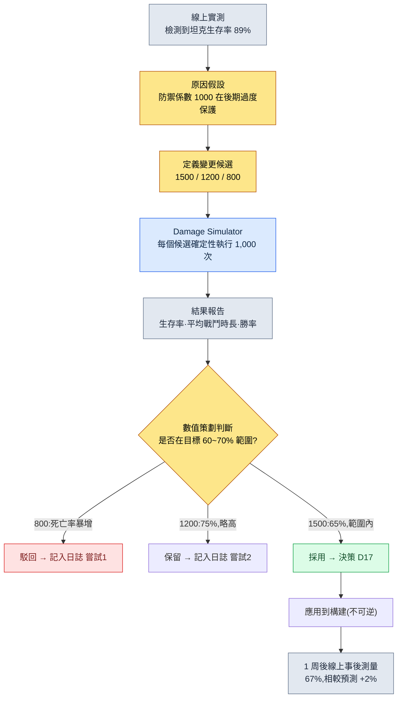

# 8.1 戰鬥平衡公式 —— 確定性這一規則手冊的位置

> **本章學習目標**(難度 🟡 實務 · 前置:四則運算·表格計算):把戰鬥平衡拆分為公式的位置與數值的位置,並以確定性·可追溯性這兩項性質為依據,區分哪些環節可以交給 AI、從哪裡開始必須由人用規則手冊鎖定。

凌晨兩點,一條告警彈了出來:線上伺服器的坦克職業生存率衝到了 89%。沒有一個坦克打不到 Boss 收尾,而不會死的坦克又太多了。為了找出是誰動過手腳的痕跡,我打開了資料表。一行防禦係數映入眼簾——`DEF / (DEF + 1000)`。這個 1000 究竟是在什麼時候、經誰的手、以什麼依據從 1200 降到了 1000,表裡哪兒都沒寫。於是一場追查開始了:翻聊天記錄、翻構建歷史,最後不得不追溯到三年前已經離職的那位數值策劃的記憶裡,才算到頭。

只要運營過戰鬥平衡的人,都會撞見這樣的場景一兩回。而這一幕的真正病根,並不在於那個 1000 是錯的。而在於:這個數字住在**公式**的位置上,可公式變更的**歷史**卻哪兒都找不到。戰鬥平衡公式是遊戲裡最應當具備確定性的領域,也是最應當可追溯的領域。這兩項性質為何會成為不該把 AI 放進這個位置的理由,正是本章的脊樑。

> **給非專業讀者的一句話。** 本部分的 z-score·模擬·曲線即便讓你感到陌生,也沒關係。你只需帶走這一條——**"對於同樣的輸入必須始終給出同樣輸出的規則(公式),不要把 AI 放進來。"** 區分哪裡需要確定性、哪裡需要探索的這一判斷,同樣適用於會計規定·結算邏輯·合同條款這類處理"不能出錯的規則"的所有崗位。公式本身,從 8.1.2 起再慢慢看也不遲。

---

## 8.1.1 公式就是規則手冊

做遊戲設計做久了,手裡會攥著兩類文件:經常變的,和幾乎不變的。在戰鬥平衡裡,幾乎不變的那一類就是公式。"傷害如何計算"一個季度改上一兩次,"這個角色的攻擊力是多少"一週就要改上五六次。把頻率不同的兩股流放進同一個檔案,經常翻動的手,就會把偶爾才翻的那張紙撕破。

在筆者運營的專案A裡,戰鬥平衡被拆成了兩個位置:公式的位置(這裡稱為 `CombatFormula`)和數值的位置(`CombatBalance`)。下面原樣引用住在公式位置上的一行。

```
final_damage = base_damage × dmg_multiplier × (1 − defense_factor) × variation

  base_damage    = skill_base × ATK × skill_coeff
  defense_factor = DEF / (DEF + 1000)
  variation      = uniform(0.95, 1.05)
```

這個公式就是規則手冊。你可以聯想桌遊的規則書。規則書只會寫"擲骰子,按擲出的點數移動",不會寫"這一局要是運氣好,可以多走幾步"。同樣的輸入,永遠給出同樣的輸出——這就是確定性(determinism)。代入攻擊力 180、防禦力 80、技能係數 2.1,無論何時何地、算多少遍,都必須得出同樣的傷害。假如同樣的輸入卻給出不同的輸出,那它就不是平衡工具,而是一臺賭博機器。

確定性這一項性質,正是不該把 AI 放進這個位置的第一個理由。稍後再細看。先來看看公式該如何長得像一本規則手冊。

戰鬥公式的核心區域,並不是一行傷害就能了結的。至少有三行是作為一組存在的。

```
# 傷害
final_damage = base_damage × dmg_multiplier × (1 − defense_factor) × variation

# 暴擊
crit_damage  = final_damage × crit_multiplier
crit_chance  = base_crit + (LUK × 0.1)            # 上限 50%

# 治療
heal         = base_heal × healing_power × (1 − sickness_factor)
```

把這三行寫成程式碼塊而不是自然語言,是有理由的。自然語言會留下解釋的餘地。"防禦力越高,傷害越低"這句話,並沒有說清楚是線性遞減,還是曲線遞減,又在哪裡停下。`DEF / (DEF + 1000)` 只能有一種讀法。規則手冊的本職,就是把解釋的餘地壓到 0。

---

## 8.1.2 曲線決定確定性

防禦係數 `DEF / (DEF + 1000)` 這一行裡,裝著這款遊戲整套平衡哲學。把這一行畫成圖,就能看出緣由。橫軸是防禦力,縱軸是所受傷害被削減的比例。

<svg viewBox="0 0 640 320" xmlns="http://www.w3.org/2000/svg" font-family="sans-serif">
  <rect x="0" y="0" width="640" height="320" fill="#ffffff"/>
  <!-- axes -->
  <line x1="70" y1="270" x2="610" y2="270" stroke="#333" stroke-width="1.5"/>
  <line x1="70" y1="270" x2="70" y2="30" stroke="#333" stroke-width="1.5"/>
  <!-- y gridlines -->
  <line x1="70" y1="150" x2="610" y2="150" stroke="#e0e0e0" stroke-width="1"/>
  <text x="40" y="275" font-size="12" fill="#666">0%</text>
  <text x="34" y="155" font-size="12" fill="#666">50%</text>
  <text x="34" y="55" font-size="12" fill="#666" >~91%</text>
  <text x="300" y="300" font-size="13" fill="#333">防禦力 DEF →</text>
  <!-- x ticks -->
  <text x="60" y="288" font-size="11" fill="#666">0</text>
  <text x="190" y="288" font-size="11" fill="#666">1000</text>
  <text x="320" y="288" font-size="11" fill="#666">2500</text>
  <text x="470" y="288" font-size="11" fill="#666">5000</text>
  <text x="585" y="288" font-size="11" fill="#666">10000</text>
  <!-- DEF/(DEF+1000) curve: x in [0,10000] mapped to [70,610]; y reduction in [0, ~0.909] mapped to [270, 50] -->
  <path d="M70,270 C 110,180 160,140 200,135 C 280,124 360,98 470,78 C 540,66 580,58 610,52"
        fill="none" stroke="#c0392b" stroke-width="2.5"/>
  <!-- diminishing-return marker at DEF=1000 (50%) -->
  <circle cx="200" cy="135" r="4" fill="#c0392b"/>
  <line x1="200" y1="135" x2="200" y2="270" stroke="#c0392b" stroke-width="1" stroke-dasharray="4 3"/>
  <text x="208" y="128" font-size="11" fill="#c0392b">DEF=1000 時傷害減少 50%</text>
  <!-- linear ghost for contrast -->
  <line x1="70" y1="270" x2="430" y2="50" stroke="#95a5a6" stroke-width="1.5" stroke-dasharray="5 4"/>
  <text x="430" y="48" font-size="11" fill="#95a5a6">(若為線性 —— 未採用)</text>
  <text x="120" y="240" font-size="11" fill="#c0392b">前期陡峭</text>
  <text x="470" y="100" font-size="11" fill="#c0392b">後期平緩(收益遞減)</text>
</svg>

這條曲線會緩緩貼向漸近線(asymptote)。它在防禦力 1000 處正好把傷害削去一半,再往後無論怎麼堆,都夠不到 100%。無敵之所以不可能,就藏在這一行裡。若像灰色虛線那樣是線性的,那麼防禦力到 1000 時傷害就被全部擋住,再往上就越過界,進入負數傷害(捱打反而回血)這種說不通的區域。所以線性沒有被採用。

這裡回到凌晨兩點的那場事故。假設有人把這個 1000 上調到 1200。整條曲線會向右平移。同樣的防禦力擋下的傷害變少了,於是全遊戲的坦克都被削弱,輸出職業的單位時間傷害則上升。**公式裡的一個常數,就撼動了整個遊戲。** 這跟改動一個數值(某個角色的攻擊力)相比,影響的量級截然不同。這一差別,正是必須把公式和數值放在不同位置的理由,也是公式變更必須附帶歷史的理由。

---

## 8.1.3 公式變更必附帶歷史

凌晨兩點的追查之所以是地獄,原因只有一個:沒有變更歷史。在專案A裡,改公式不是改一行程式碼,而是**記錄一件決策**。公式旁邊跟著一份名為 `CombatFormula_Decisions` 的獨立文件,裡面這樣寫著。

```markdown
## 決策 D17 (2026-04-22)
- 變更:將 defense_factor 由 DEF/(DEF+1000) → DEF/(DEF+1500)
- 事由:高等級區間(LV40+)坦克生存率 89%(線上實測)。是 Boss 戰被拖長的原因。
- 嘗試 1:以 800 模擬 → 坦克死亡率暴增,進 Boss 後 1 分鐘內團滅者眾多 → 回滾
- 嘗試 2:以 1200 模擬 → 生存率 75% → 尚可,但高於目標(60~70%)
- 嘗試 3:採用 1500 → 模擬生存率 65%(在目標範圍內)
- 影響 atom:combat_defense_formula, combat_tank_class_balance
- 事後測量(1 周):線上生存率 67%(相較模擬預測 65% 為 +2%,在範圍內)
```

這一件,回答了六個月後的那句"為什麼會變成這樣"。更重要的是,嘗試 1 和嘗試 2 都留了下來。只要記著 800 為何不行、1200 為何沒被採用,下一個人就不會重蹈同樣的覆轍。當新的數值策劃加入團隊時,這一組決策日誌就是最好的上手資料。

這裡有一點要老實點明。上面嘗試 1·2·3 的模擬數值(死亡率、生存率 75%、65%)是為了展示運營流程而給出的**筆者估算值(未經驗證)**。每款遊戲的曲線和目標範圍都不一樣。但"變更之後跟著嘗試,嘗試之後跟著模擬依據,採用之後跟著事後測量"這個**結構**,與真實運營別無二致。這個結構裡只要空掉一格,空掉的那一格就會以凌晨兩點的追查回到你身邊。

把公式、數值、歷史這三個位置放在一起看,就是下面這樣。

<svg viewBox="0 0 660 280" xmlns="http://www.w3.org/2000/svg" font-family="sans-serif">
  <rect x="0" y="0" width="660" height="280" fill="#ffffff"/>
  <!-- CombatFormula -->
  <rect x="30" y="40" width="180" height="120" rx="8" fill="#fdecea" stroke="#c0392b" stroke-width="1.5"/>
  <text x="120" y="66" font-size="14" text-anchor="middle" fill="#c0392b" font-weight="bold">CombatFormula</text>
  <text x="120" y="88" font-size="11" text-anchor="middle" fill="#333">公式(規則手冊)</text>
  <text x="120" y="110" font-size="11" text-anchor="middle" fill="#666">每季度改 1~2 次</text>
  <text x="120" y="130" font-size="11" text-anchor="middle" fill="#666">確定性 · 停用 AI</text>
  <text x="120" y="150" font-size="11" text-anchor="middle" fill="#666">影響:整個遊戲</text>
  <!-- CombatBalance -->
  <rect x="240" y="40" width="180" height="120" rx="8" fill="#eaf2fb" stroke="#2c6fbb" stroke-width="1.5"/>
  <text x="330" y="66" font-size="14" text-anchor="middle" fill="#2c6fbb" font-weight="bold">CombatBalance</text>
  <text x="330" y="88" font-size="11" text-anchor="middle" fill="#333">數值(表格)</text>
  <text x="330" y="110" font-size="11" text-anchor="middle" fill="#666">每週改 5~10 次</text>
  <text x="330" y="130" font-size="11" text-anchor="middle" fill="#666">通過模擬關卡</text>
  <text x="330" y="150" font-size="11" text-anchor="middle" fill="#666">影響:對應角色</text>
  <!-- Decisions -->
  <rect x="450" y="40" width="180" height="120" rx="8" fill="#eafaf1" stroke="#27865a" stroke-width="1.5"/>
  <text x="540" y="66" font-size="14" text-anchor="middle" fill="#27865a" font-weight="bold">_Decisions</text>
  <text x="540" y="88" font-size="11" text-anchor="middle" fill="#333">決策歷史(日誌)</text>
  <text x="540" y="110" font-size="11" text-anchor="middle" fill="#666">每次變更 1 件</text>
  <text x="540" y="130" font-size="11" text-anchor="middle" fill="#666">事由·嘗試·事後測量</text>
  <text x="540" y="150" font-size="11" text-anchor="middle" fill="#666">上手核心資料</text>
  <!-- arrows -->
  <line x1="210" y1="100" x2="240" y2="100" stroke="#888" stroke-width="1.5" marker-end="url(#ah)"/>
  <line x1="120" y1="160" x2="120" y2="200" stroke="#27865a" stroke-width="1.5" marker-end="url(#ah)"/>
  <line x1="540" y1="160" x2="540" y2="200" stroke="#27865a" stroke-width="1.5" stroke-dasharray="4 3"/>
  <path d="M120,205 L540,205" stroke="#27865a" stroke-width="1.5" fill="none"/>
  <path d="M540,205 L540,162" stroke="#27865a" stroke-width="1.5" fill="none" marker-end="url(#ah)"/>
  <text x="225" y="225" font-size="11" text-anchor="middle" fill="#27865a">一次公式變更 → 一件決策日誌(附事由·嘗試·事後測量)</text>
  <defs>
    <marker id="ah" markerWidth="8" markerHeight="8" refX="6" refY="3" orient="auto">
      <path d="M0,0 L6,3 L0,6 Z" fill="#888"/>
    </marker>
  </defs>
</svg>

---

## 8.1.4 一條公式變更的真實流程

現在從頭跟一遍 D17 是怎麼定下來的。這就是確定性規則手冊在實務中運轉的方式。



在這個流程裡,要準確看清模擬器的角色。`Damage Simulator` 會把三個候選各跑 1,000 遍。這裡的 1,000 遍,並不是把同樣的輸入重複 1,000 次。公式裡 `variation = uniform(0.95, 1.05)` 這個 ±5% 的隨機數,再加上暴擊機率這另一個隨機數,讓每一局的結果各不相同。跑上 1,000 局,是為了看**分佈**——看平均生存率、最壞情況,以及戰鬥時長的離散程度。

重要的是,這個模擬器本身必須是確定性的。只要給同一個隨機數種子,這 1,000 局就要一字不差地復現出來。唯有如此,"用 1500 得出 65%"這行 D17 的記錄,才能在六個月後同樣復現、得到驗證。如果模擬器每次都給出不同結果,決策日誌就成了謊言。

筆者第一次做這個傷害模擬器是在 2008 年。那時它是 Excel 宏,如今在專案A裡,它被封裝成了 `balance-sim` 技能。18 年間,工具的外殼換了又換,可裡頭裝的規則手冊,從來沒有一次是機率性的。這才是關鍵。

---

## 8.1.5 為什麼獎勵曲線和公式絕對停用 AI

現在來到本章最想說的一句。在 AI 幾乎進入遊戲設計每一個位置的今天,有唯一一個位置絕對不能放它進來——那就是戰鬥公式與獎勵曲線這一確定性的核心。

LLM 本質上是機率性的。對同一個問題,每次的回答都會略有不同。這正是它產出好文字和好點子的力量之源,但放到規則手冊的位置上卻是致命的。若讓 LLM 來回答"防禦力 80 的角色會受到多少傷害",今天它可能答 92,明天答 94。這就等於桌遊規則書每翻一頁,骰子點數的含義都在變。

獎勵曲線更危險。"從 30 級升到 31 級所需的經驗值"一旦定下,就同時規定了數十萬人的進度速度。哪怕只摻進 ±2% 的抖動,某些玩家做著同樣的刷怪,也會比旁邊的人升得慢。公平性就此崩塌。確定性,與公平是同義詞。所以獎勵曲線由人一手定下、錄入表格,再也不交給機率。

但這並不是說要把 AI 從整個平衡領域裡趕出去。邊界才是關鍵。

| 領域 | AI | 理由 |
|---|---|---|
| 傷害·治療公式計算 | 絕對禁止 | 確定性核心。同樣輸入 = 同樣輸出一旦被打破,就是賭博機器 |
| 獎勵·經驗值曲線 | 絕對禁止 | 同時規定數十萬人的進度。一旦抖動,公平性崩塌 |
| 模擬器內部運算 | 絕對禁止 | 無法復現時,決策日誌即成謊言 |
| 模擬結果異常模式檢測 | 可以 | 從 1,000 條結果中以 z-score 檢測"這個角色超出正常範圍" |
| 變更候選探索 | 可以 | 如"在 base_atk ±10% 範圍內提出 5 個候選"這類受限探索 |
| 決策日誌初稿撰寫 | 可以 | 會議內容 → Decisions 條目初稿(由人評審) |
| 事後測量報告摘要 | 可以 | 對線上資料做自然語言摘要 |

界線很清楚。**AI 只住在確定性核心的外側。** 計算和模擬的內側是規則手冊,分析、提議、落成文字的外側才是 AI 的位置。這條線一旦越過,同樣的輸入就會開始給出不同的結果,從那一刻起,平衡工具便失去了信任。

這條邊界,與 8.2 將要看到的經濟系統是完全相同的結構。在經濟裡,資源產出·消耗公式同樣是確定性的,而通貨膨脹模式的檢測才是 AI 的位置。整個平衡領域,都以同一副骨架運轉。

---

## 8.1.6 更進一步 —— 用 z-score 提出候選的進階式應用

到目前為止,都是人來做候選、模擬來驗證的保守式應用。再往前一步,連做候選這件事也可以交給工具代勞。只是,規則手冊依舊屬於人和確定性。

起點是異常模式檢測。從 1,000 局模擬結果中,檢視各角色勝率·生存率的分佈,用 z-score 度量它偏離均值多少個標準差。z 超過 2 的角色會被自動標記為"超出正常範圍"。凌晨兩點的那個坦克,想必也會被這套檢測揪出來。

要讓檢測延伸到提出候選,還需要兩樣東西。第一是**變更空間的定義**。在 CombatBalance 表格裡設一列如 `tunable_range`,明確寫出"這個數值可以在什麼範圍內改動"。第二是**模擬並行化**。要在構建關卡的時間內跑完 10 個候選 × 1,000 局 = 10,000 局,就得有並行基礎設施。

這三樣(z-score 檢測 · 變更空間定義 · 模擬並行化)一旦齊備,留在數值策劃手裡的決策就收窄成"採用哪個候選"這一件。從 0 做出候選,和從五個裡挑一個,負擔是不一樣的。這裡 AI 觸及的仍只是提出候選與解讀報告,模擬內側的運算與採用的決策,是確定性與人的位置。

最後點一下可逆性。改表格也好、跑模擬也好,都是可逆的,可以隨意撤回。唯一不可逆的位置,是應用到構建。上線的數值一旦被玩家看到,就會以社群反響留存下來,即便回滾,痕跡也抹不掉。所以一切評審,都在應用到構建之前、可逆的階段內收尾。

---

## 動手試試 —— 安全地處理一次公式變更

**setup.** 把戰鬥公式從自然語言說明中剝離出來,做一份只用程式碼塊書寫的 `CombatFormula` 文件,並在它旁邊建一份空白的 `CombatFormula_Decisions` 日誌文件。數值則單獨拆到一張表格(`CombatBalance`)裡。

**prompt.** 不要用 AI 去改公式,只把它用在**分析·起草**上。例如,把模擬結果的 CSV 交給它,這樣請求。

```
請從附上的 1,000 次模擬結果中,計算各角色勝率的 z-score,
把 z>2 的角色整理成表格。對每個角色,
請結合依據推測哪個數值(攻擊力/防禦力/技能係數)
最有可能是異常原因。不要改動數值本身 —— 只提出候選。
```

**verify.** 不要照單全收 AI 給出的候選。把候選數值直接錄入 `CombatBalance` 表格,用 `Damage Simulator`(或 `balance-sim`)給同一個種子,再跑 1,000 次。確認兩點。(1) 模擬結果是否落入目標範圍。(2) 用同一個種子再跑一遍,是否一字不差地復現。兩項都通過就採用,採用後立刻在 `_Decisions` 裡寫下事由·嘗試(含被駁回的候選)·預測值。應用到構建 1 周後,把線上實測值補記到那份日誌裡。

### 單人精簡版

即便是沒有團隊、也沒有模擬器的單人開發,骨架照樣能運轉。把公式記在程式碼註釋裡,或另用一張 `.md`,以程式碼塊寫下,並在那個檔案的最底部放一節 `## 變更歷史`。只要改動了公式裡的任何一個常數,就寫一行日期·事由·改動前的值。模擬器用一段 30 行的 Python 迴圈就夠了。固定隨機數種子,把角色數值代入公式跑 1,000 遍,哪怕只輸出平均勝率,也已經從"憑感覺改"邁向了"憑依據改"。AI 就只用來讀那份輸出 CSV、總結"哪個角色不對勁"。唯有把一行公式交給 LLM 去計算這件事,無論規模大小,都別做。

---

### 本章要點

- 戰鬥公式是一份對同樣輸入給出同樣輸出的規則手冊,一旦它的確定性被打破,平衡工具就淪為賭博機器。
- 公式變更必須附帶一份記有事由·嘗試·事後測量的決策歷史,才能回答六個月後的"為什麼會變成這樣"。
- AI 只住在確定性核心之外(異常檢測·提出候選·報告),絕不進入公式計算和獎勵曲線。
