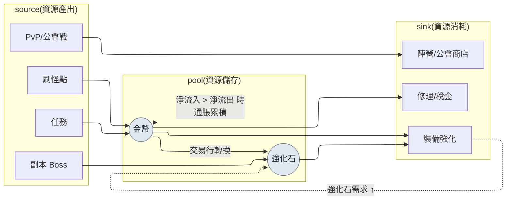

# 8.2 用 Machinations 建模經濟 —— 用模擬而非開會來控住通貨膨脹

> 主要讀者:負責線上經濟的 MMORPG 數值/系統策劃(中等規模(10\~50 人)團隊)
> 面向單人/業餘讀者的精簡版:§8.2.10「一個人的話,只需做到這些」

最早察覺金幣開始洩漏的,不是賬單,而是交易行。上線第二個月,強化石的行情悄悄上漲,一個月後翻了一倍。為了查明原因我召集了一場會議,可會議室裡冒出來的全是"感覺"。有人說新副本的獎勵給多了,有人說是刷怪點的效率變高了,還有人說不過是高等級玩家變多了而已。每種說法都像那麼回事,於是什麼也沒能定下來。一個小時耗在了猜測上,最後以"先等下週再多看看資料"收場。

問題在於資源不止一種。金幣、強化石、聲望、榮譽、靈魂石各自都有 source(流入的路徑)和 sink(流出的路徑),而這些路徑又彼此供養。強化石 Boss 也會掉金幣。用金幣買來的裝備又會消耗強化石。當 5 種資源與數十條流動糾纏在一起時,光靠腦子裡的心算,連一種資源一週的收支都算不出一個誠實的數字。本章講的,是把這種纏繞搬進 **Machinations 節點模型**,並讓經濟變更的決策不再靠會議上的猜測、而是靠 **模擬關卡(simulation gate)** 來通過。經濟設計的一般理論,別的書裡已經講得夠多,本章只聚焦於把那套理論 *放進 AI 工作流去跑的那一環*。

> **筆者實際運營筆記**
> 本章的案例,是把筆者在公司 R&D 資料夾中運營的經濟試點文件(`Economy_Machinations_Pilot`)與經濟調研工作區做了匿名化處理。資源種類、source/sink 結構、Pilot 四個階段都忠實地照搬了實際運營,而公司專有名稱、真實數值則替換為書用版本,或只以比例、方向來表述。AI 輸出正文是對真實會話的重現。

---

## 8.2.1 經濟不是"5 種資源",而是"數十條流動"

把經濟資源列成表,只有五行,看上去很簡單。陷阱不在資源,而在連線資源的 **流動** 的數量上。

| 資源 | source(流入) | sink(流出) |
|---|---|---|
| 金幣 | 刷怪、任務獎勵、交易行出售 | 購買裝備、強化、修理、稅金 |
| 強化石 | 副本 Boss、活動 | 裝備強化、合成 |
| 聲望 | 支線任務 | 陣營商店、轉職 |
| 榮譽 | PvP、公會戰 | PvP 商店、公會設施 |
| 靈魂石 | 擊殺 Boss | 角色復活、學習技能 |

資源雖只有 5 種,但 source 與 sink 加起來有二十幾個,而且資源之間還會相互轉換(用金幣購買強化石的交易行,既是金幣的 sink,又是強化石的 source)。一旦這些流動開始彼此供養,"金幣多投放 5%,強化石行情會怎樣"這類問題,只盯著一種資源就答不出來。這正是角色平衡(8.1)與經濟平衡決定性不同的地方。角色平衡用一行公式就能收口,而經濟是 **隨時間累積的動態系統**,即便一週收支接近 0,累積 26 周也會把交易行壓垮。

所以經濟工作的本質,不是"把數字挑好",而是 **"用模擬去看流動如何隨時間累積"**。而手工搭建、修改這套模擬模型既枯燥,每做一次又都會有遺漏。反覆而容易漏項的初稿工作,可評審又必須牢牢握在人手裡 —— 這種性質的工作,正是 AI 與人的分工線畫得最乾淨的地方。

先用一張圖,放上本章要處理的經濟迴圈的骨架。



虛線才是本章的核心。強化 sink 拉高強化石需求,從而推高強化石行情(`UP -.-> S`);而當金幣淨流入超過淨流出時,那部分超額每週都會堆進池(pool),累積成通貨膨脹。這兩條虛線,靠手算根本無法追蹤,所以才需要模型。

---

## 8.2.2 Machinations —— 把經濟搬進節點圖的工具

Machinations 是一款把經濟流動畫成節點圖、並在其上執行模擬的工具。這一節要做的,是把 §8.2.1 的 mermaid 搬成一個真正能跑的模型。

| 節點 | 作用 | 在上圖中 |
|---|---|---|
| Pool | 資源儲存庫 | 金幣、強化石 |
| Source | 資源產出 | 刷怪、任務、Boss |
| Drain | 資源消耗 | 強化、修理、商店 |
| Converter | 資源轉換 | 交易行(金幣→強化石) |
| Trigger | 條件觸發 | 活動、晉級獎勵 |

用這些節點為經濟建模,再把模擬跑 1,000 次,得到的就不是單一結果,而是一個分佈。形如"26 周後金幣行情中位數 +X%,前 10% 玩家 +Y%"。不過 Machinations 並非萬能,引入它本身就是一種成本。

| 侷限 | 對策 |
|---|---|
| 與遊戲程式碼分開執行,同步會錯位 | 用真實 telemetry 每月/每季校準(§8.2.6) |
| 節點圖一大,可讀性就崩 | 按資源拆成子圖,從單一資源起步(§8.2.4) |
| 模擬用的是簡化的玩家模型 | 用真實行為分佈校準,設定誤差閾值 |
| 結果解讀依賴領域知識 | 把從模擬數值到決策的關卡標準化(§8.2.5) |

所以 Machinations 並不是一款無條件引入的工具。只有當 **5 種以上資源 + 資源轉換流動 + 線上運營** 這三個條件疊加時,它才值得。2\~3 種資源的簡單經濟,用 Excel 就夠了,那種情況下引入 Machinations,收益還沒到,運營負擔先到了。

---

## 8.2.3 [實操記錄] 用 AI 起草金幣單一資源模型

光看工具說明,還是不知道它實際會吐出什麼。這裡把"僅金幣一種資源搬進 Machinations 模型"的一個完整週期,從輸入提示詞一直跟到人的駁回,走到底。輸入提示詞可以原樣複製使用,輸出則是對真實會話的重現。

### 第 1 步 —— 輸入:把金幣流動整理成機器可讀的表

先把金幣的 source·sink 從資料表裡提取出來,做成一張表。這不是新寫,而是提取。

```yaml
# gold_flows.yaml —— 金幣單一資源流動(現行資料表摘錄)
resource: gold
sources:
  - id: hunting        # 刷怪點掉落
    trigger: per_kill
    note: 各等級段的掉落曲線套用 reward_curve 規則
  - id: quest_reward   # 任務獎勵
    trigger: per_complete
  - id: market_sell    # 交易行出售
    trigger: per_trade
sinks:
  - id: gear_buy       # 購買裝備
  - id: enhance        # 強化費用
  - id: repair         # 修理
  - id: tax            # 交易行稅金(既是 sink,也是回收金幣的核心)
# 玩家行為分佈(每小時刷怪次數·任務完成率)目前仍為空 → 讓 AI 若做假設就標示出來
```

### 第 2 步 —— 提示詞:讓它建模,但強制約束假設與格式

```
附件 gold_flows.yaml 是金幣這一單一資源的 3 個 source、4 個 sink。
請據此起草一份可搬進 Machinations 模型的節點規格草案。

規則:
1) 把每條流動按節點型別(Source/Drain/Pool/Converter)分類。
2) 為每個節點提出"以一週為準、每名玩家的期望流量"的算式,
   若需要玩家行為假設(每小時刷怪次數·任務完成率等),
   就把該假設單獨另起一行標為"★假設"。不要把假設藏在正文裡。
3) 把 source 總流入與 sink 總流出分開,計算一週淨收支(net)。
4) 要體現交易行稅金(tax)是唯一把金幣從經濟中永久移除的 sink,
   並區分其他 sink(強化·修理)只是把金幣轉移給 NPC、並非回收。
5) 凡是你"沒有把握"的假設,單獨用 ★ 標出,交給人來決定。

輸出格式:表格(節點 | 型別 | 一週流量算式 | 假設 | 把握度)。除此之外不要有任何說明。
```

這段提示詞裡真正寫得長的,不是"去建模"的指令,而是"把假設寫在哪裡、怎麼寫"的規則。在經濟建模中,若放任 AI 自由發揮,它會把假設藏起來、只吐出一堆看似合理的數字。那樣一來,即便模型錯了,也指不出 *到底哪裡錯*。**把玩家行為假設從正文裡揪出來、單獨立成一行** —— 這項請求的分量全壓在這裡。假設露出來,才能驗證。

### 第 3 步 —— Claude 的輸出(重現,節選)

```
| 節點          | 型別      | 一週流量算式                            | 假設             | 把握度 |
|--------------|-----------|----------------------------------------|------------------|-------|
| hunting      | Source    | 每小時擊殺 × 平均掉落 × 周遊玩時長        | ★每週 15h,擊殺 80/h | 中  |
| quest_reward | Source    | 日常任務數 × 獎勵 × 7 × 完成率           | ★完成率 0.7      | 中    |
| market_sell  | Source    | (玩家間轉移 —— 非淨增)                  | 對淨經濟零貢獻    | 高    |
| gear_buy     | Drain     | 購買頻率 × 平均價                        | ★每週 1.2 次     | 低    |
| enhance      | Drain     | 強化嘗試 × 每次費用                      | ★每週 8 次       | 中    |
| repair       | Drain     | 刷怪時長 × 修理率                        |                  | 高    |
| tax          | Drain     | 交易額 × 稅率(★唯一永久回收的 sink)     | ★稅率 5%         | 高    |
| ── 淨收支    | net       | Σsource − Σsink ≈ +(以中活躍為準為正)   | 彙總以上假設時    | ★低  |

★假設警告:market_sell 是玩家↔玩家的金幣轉移,對經濟總量零貢獻。
把它計入 source 會重複計算通脹。需要在模型中單獨處理。
★沒有把握之處:gear_buy 頻率(每週 1.2 次)是猜測。沒有真實購買 telemetry
就可能把 sink 低估/高估 → 需要人來決定。
```

這份輸出裡最有價值的不是表格,而是 **最下面兩行——"★假設警告"與"★沒有把握之處"**。AI 主動把自己模型的兩處弱點上報了出來。好的提示詞,能讓 AI 說出"這個假設我信不過"。

### 第 4 步 —— 驗證與駁回(人的位置)

這份輸出不能直接塞進模型。AI 上報的兩處 ★ 裡,有一處實際上是會毀掉模型的缺陷。

AI 起初把 `market_sell`(交易行出售)歸為了 Source。可交易行出售,是 **玩家 A 的金幣轉移到玩家 B** 的過程,並不是經濟裡憑空多出了金幣。把它計入 source 流入,就會把通貨膨脹重複計算一遍。AI 雖然用 ★假設警告自己點了出來,但在表格正文裡,它仍舊把這條留在了 Source 一欄 —— 報是報了,卻沒從模型裡剔除,這是一份只對了一半的輸出。這同時也是人這一側的資料缺陷:輸入的 yaml 裡沒有標明 `market_sell` 的性質(玩家間轉移 vs 新增產出)。

於是重新提出請求。

```
market_sell 是玩家↔玩家的金幣轉移,並非經濟總量的 source(修正輸入
遺漏)。請把該節點從 source 彙總中剔除,改為只以"交易行稅金(tax)
永久回收轉移額的一部分"這一 sink 反映到模型裡。請重新計算淨收支,
並用一行展示剔除 market_sell 對 net 的影響。
```

AI 重新給出了一個把 `market_sell` 從 source 中移除、只留稅金作為 sink 的模型。結果淨收支(net)比最初的估計更低了 —— 這暴露出:把交易行出售錯當成 source 時,通貨膨脹是被高估了的。**這一次往返正是關鍵。** 人若從頭手工搭建,要花半天,而且節點分類的失誤自己很難抓出來;可 AI 起草 +"強制標示假設"+ 一次駁回,只需一小時以內,並且靠"AI 上報 ★、人來判定"這一結構,像重複計算這樣的缺陷,在進入模型之前就被攔下了(筆者估計 —— 節省的時間因團隊、資源數而異,與其看絕對值,不如把它當作"從頭手工"與"起草+評審"之間的結構差異來讀)。

---

## 8.2.4 一次一種資源 —— 用 Pilot 四階段引入

金幣模型收口了,並不意味著可以把全部資源一次性建模。筆者的運營也沒有把整體一股腦塞進去,而是走了從單一資源起步、經過驗證·校準再擴充套件的四個階段。

| 階段 | 範圍 | 核心關卡 |
|---|---|---|
| 1. 單一資源(金幣)建模 | source 3·sink 4,§8.2.3 會話 | 節點分類·標示假設 |
| 2. 模擬 vs 實際對比 | 模擬一週 net vs telemetry 一週 | 是否通過誤差閾值 |
| 3. 模型精度校準 | 反映玩家行為分佈(低/中/高活躍) | 按 segment 重新測量誤差 |
| 4. 資源擴充套件(5 種) | 逐步加入強化石·聲望·榮譽·靈魂石 | 驗證轉換流動(交易行) |

第 2 階段的對比驗證,是這四個階段的心臟。模擬與實際若對不上,錯的不是遊戲,而是模型。用一個對不上的模型去做決策,那決策就會在線上以事故的形式回來。所以擴充套件(第 4 階段)永遠只在通過第 2·3 階段的驗證之後才做。這個順序一旦被打破,也就是跳過單一資源驗證、把 5 種資源一次性塞進去,就連"哪種資源的模型錯了"都沒法分離出來指認。

---

## 8.2.5 模擬關卡 —— 給經濟變更決策架起攔截圖障

模型通過驗證後,就要在每一個影響經濟的變更決策前面立起 **模擬關卡**。這是把過去在會議上靠"感覺"放行的決策,改成靠模擬通過來放行的地方。

| 決策型別 | 模擬義務 |
|---|---|
| 新增 source·sink | 必須 |
| 變更資源轉換比率(交易行匯率等) | 必須 |
| 設計新副本·活動獎勵 | 必須 |
| 價格變更(±10% 以上) | 必須 |
| 驗證新職業效率 | 必須 |
| UI 變更等與經濟無關 | 豁免 |

關卡實際如何運作,這裡在 §8.2.3 驗證過的金幣模型之上,把一個決策放上去過一遍。

> **[模擬關卡 —— 活動獎勵決策](真實格式重現)**
>
> ```
> [變更方案] 週末活動:每日登入獎勵 +500 金幣
> [關卡]     新增 source → 必須模擬
> [模擬 1000 次結果]
>   - 一週金幣淨收支:+6,900 → +10,400(+50%)
>   - 累積 26 周時金幣行情中位數 ~+28%(通脹警告:超過 ±10%)
>   - 前 10% 活躍玩家:~+41%(segment 偏差大)
> [判定]     FAIL —— 超出穩定區間(±10%/長期)
> [校正方案] 給活動 source 同時附上 sink:活動限定商店(回收金幣)
>            重新模擬 → 累積 26 周 +9%(PASS)
> ```

關卡的價值在最後兩行。"投放 +500 獎勵"這個決策,若是在會議上靠猜測,大概會以"應該沒問題"放行。模擬關卡則把這決策換算成 26 周 +28% 的通脹擺出來,還進一步強制給出 **要加 source,就把 sink 一起掛上** 的校正。把經濟變更判定為不是靠猜測、而是靠模擬的通過/失敗 —— 這就是關卡的全部。

這裡點一個常掉進去的陷阱:segment 偏差。以中活躍玩家為準是 +28%,而前 10% 則是 +41%。賺金幣最多的那批玩家,累積通貨膨脹也最快,所以模擬不能只看平均,得按 segment 分別去跑。只看平均,就會漏掉由高活躍玩家引發的行情崩塌。

---

## 8.2.6 模型在上線後靠 telemetry 每月進化

要讓模擬關卡被信任,模型就不能與實際遊戲對不上。遊戲每週都在變,模型也得跟著校準。上線後,用真實 telemetry 每月(變更少的時期則每季)去校準模型。

```
模型校準週期(每月)
─────────────────────────────────
1. 提取一個月的真實玩家 telemetry(按資源彙總流動)
2. 按 segment(低/中/高活躍)算出 source·sink 的實測流量
3. 與 Machinations 模擬逐項對比
4. 誤差 >15% 的項 = 調整模型引數(該項的 ★假設錯了)
5. 調整後重新模擬 → 作為下個月關卡的基準模型使用
```

核心是第 4 步。誤差大的項,正是 §8.2.3 中 AI 用 ★ 上報過的"沒有把握的假設"與實際對不上的訊號。比如 AI 猜測的 `gear_buy` 頻率(每週 1.2 次),若實測是每週 2 次,就把那條假設換成 telemetry 的值。一旦停下這項校準,模型就會與遊戲慢慢拉開距離,某個季度的模擬關卡便會闖出"放行了、實際卻來了通脹"的事故。那一刻,模擬本身的信任會在事後崩塌。校準不是運營的附帶工作,而是讓關卡保持存活的常規週期。

---

## 8.2.7 進階式應用 —— 異常模式檢測·變更空間·模擬並行化

到這裡為止,是經濟建模的"保守式應用":人來發起變更,用模型驗證,依結果決策。再往前一步,8.1.6 裡見過的進階式應用的三條軸 —— z-score 檢測 · 定義變更空間 · 模擬並行化 —— 在經濟這套基礎設施之上同樣會開啟。

**第一,異常模式檢測。** 每月校準週期(§8.2.6)裡的誤差對比,不再靠人用眼睛看,而是讓程式碼先把"模型-實測偏差超過閾值"的項挑出來報上來。強化石行情翻倍,不再是看著交易行才知道,而是"強化石 source 流量相對模型偏離 +30%"這樣一條 alert,會在開會之前就送到。

**第二,定義變更空間。** 不是"投放 +500 獎勵,還是不投放"的二選一,而是把獎勵範圍(0\~+1000)與同時掛上的 sink 範圍定義為一個變更空間,那麼就能在這個空間裡搜尋滿足通脹 ±10% 的組合。人來定"從哪到哪",空間內的最優組合搜尋則交給自動化。

**第三,模擬並行化。** 不是把一個變更方案跑 1,000 次,而是把變更空間裡的幾十個候選各跑 1,000 次並行,一次性對比分佈。過去在會議室裡一個方案一個方案討論的場面,變成對候選矩陣的模擬結果做比較。

共同的思想,是把人 *發起* 變更的位置,挪到讓程式碼 *搜尋* 變更空間的位置。但前提是:保守式應用(§8.2.3\~8.2.6)已穩定運轉、模型也經 telemetry 驗證之後,才談得上。若拿沒驗證過的模型去自動搜尋變更空間,錯的模型只會自信地給出錯的最優值。

> **[激進式應用 —— 把經濟壓縮成"維度向量"來搜尋](目前尚為時過早)**
>
> 這是比進階式應用再往前邁一步的領域。請把它當作研究動向來讀,而非定論(若你是初次接觸維度向量·嵌入(embedding),先看一眼附錄 M 的那張"地圖",下面就容易讀了 —— 本書的五個"方向標"全都在那張圖上打轉)。走到這裡的經濟模型,是 5 種資源與數十條流動纏在一起的高複雜度系統,而 §8.2.7 的變更空間搜尋,歸根結底也是把那數十條流動逐一當成引數去跑。激進的想法,是把這份複雜度本身 **壓縮成維度向量**,再在那個壓縮空間之上求解。
>
> 一個看似遙遠的類比可作線索。常被列為定性、難以把握的領域——烹飪食譜,在一項研究(Epicure —— Radzikowski·Chen,2026,arXiv:2605.22391 · 演示 epicure.kaikaku.ai)中,從 11 個來源的 414 萬條食譜裡,提煉出 1,790 種標準食材,把食材之間的關係壓縮成數百維的向量。關鍵在於:即便是"味道"這樣的定性物件,只要把食材間的關係換算成座標,相似的食譜就會在向量空間裡聚到一起,並可在其間做插值來搜尋新的組合 —— Epicure 也展示了在這個壓縮空間裡,把某種食材朝特定菜系方向旋轉、以尋找對應食材的插值搜尋。
>
> 經濟的原理也一樣。把 source·sink·轉換流動各自當作一個維度、用向量來表示經濟狀態,那麼"通脹 ±10% 之內的穩定經濟"就會被圈定為該空間中的一塊區域。於是,不必再把變更方案一個個送去模擬,而是可以直接在那塊穩定區域之內/附近搜尋解。過去逐一去跑、去比的 §8.2.7 的並行模擬,有可能被收窄為壓縮空間之上的一次搜尋。
>
> 為何說"目前尚為時過早"。第一,決定把什麼當作維度(哪些流動是獨立的、哪些是從屬的)這件事本身就是領域難題。第二,壓縮本質上就是丟棄資訊,被丟掉的那個維度上有可能爆出線上事故。第三,這一切只有在保守式應用的 telemetry 驗證(§8.2.6)足夠紮實時才有意義 —— 若壓縮前的模型已與遊戲對不上,壓縮只會把那份誤差也一併乾淨利落地壓進去。所以這一節不是處方,而是 **方向標**。眼下要做的,是把保守式應用誠實地跑起來;維度向量,則留給那些根基積累得足夠厚的團隊,在幾年後再去審視的研究領域。

---

## 8.2.8 度量 —— 會議被模擬替代的地方

對比工具引入前後。下表的時間·頻率,承載的是引入初期運營中體感到的方向,與其當作精確的絕對值來讀,不如讀作它朝哪個方向移動了才對。

| 專案 | 引入前(會議·手算) | 引入後(模擬關卡) |
|---|---|---|
| 經濟變更決策 → 落地 | 2\~4 周(反覆猜測·再討論) | 1\~3 天(模擬驗證 1 次) |
| 通貨膨脹事故 | 每季 1\~2 起(事後發現) | 每季 0\~1 起(關卡事前攔截) |
| 新增 source·sink 頻率 | 每季 1\~2 次(心裡沒底,趨於保守) | 每月 1\~2 次(模擬提供安全保障) |
| 經濟會議頻率 | 每週 3\~4 次 | 每週 1\~2 次 |

比起表裡的數字,最後一行的含義更大。會議頻率下降,是因為模擬替代了討論。"我覺得強化石那邊可能要來通脹"一旦變成"模擬結果 26 周 +28%",過去圍著猜測爭論一小時的場面,就以 5 分鐘的結果共享收場。這與筆者系統的覆盤中固化下來的一個概念(atom `automation_signal_value_over_time_savings` —— 自動化的價值不在於節省時間,而在於暴露訊號)恰好是同一處。模擬關卡真正的產物,不是省下來的時間,而是讓數字佔據了會議上原本由猜測佔據的位置。

不過有一點要誠實說明。表裡的"每季 1\~2 起 → 0\~1 起"不是精確測量值,而是運營體感的方向。通貨膨脹事故的計數會隨定義(把行情 ±百分之幾視為事故)而變,所以與其看絕對起數,不如讀作"從事後發現轉向事前攔截"這一結構變化才對。

---

## 8.2.9 常見的失敗

| 模式 | 為何會失敗 | 對策 |
|---|---|---|
| 把全部資源一次性建模 | 無法分離出哪種資源的模型錯了 | 從單一資源 Pilot 起步(§8.2.4) |
| 不經評審就接受 AI 模型的假設 | 交易行重複計算之類的缺陷會原封不動進入 | 強制標示假設 + 人來駁回(§8.2.3) |
| 不設模擬關卡就變更經濟 | 事後修復通脹的成本極大 | 定義必須模擬的專案(§8.2.5) |
| 只模擬平均、忽視 segment | 漏掉由高活躍玩家引發的行情崩塌 | 按 segment 模擬(§8.2.5) |
| 上線後不做 telemetry 校準 | 模型與遊戲拉開距離,關卡信任崩塌 | 每月/每季校準週期(§8.2.6) |
| 用未驗證的模型自動搜尋變更空間 | 錯的模型會自信地給出錯的最優值 | 保守式應用穩定後再進階(§8.2.7) |

第二種最常被漏掉。就像 §8.2.3 裡看到的交易行重複計算,AI 會自信地吐出一個看似合理的模型,卻只用 ★ 上報自己假設的弱點、把缺陷留在正文裡。那些 ★ 若不由人來判定,錯的模型就會被放行,其上的所有模擬決策也就一起錯了。

---

## 8.2.10 動手試試 —— 今天就能做的一步

> **一個人的話,只需做到這些**:沒有 Machinations、沒有 telemetry 也行。挑出你自己遊戲(或你喜歡的遊戲)裡的一種資源,把它的 source·sink 寫在紙上,再把 §8.2.3 的提示詞原樣貼上去,拿到一份一週淨收支的模型草案。然後挑一條 AI 用 ★ 標出的假設,試著反駁它"這個假設我信不過,重新給出依據",你就會親身體會到:經濟模型是由哪些假設捆在一起的 —— 以及其中一條假設錯了,結論會怎樣被推翻。

如果是團隊,就從下面這一步開始。不要全部資源,而是挑出 **最成問題的那一種資源**(通常是金幣或強化石),先只搭起 §8.2.3 的單一資源模型,再對一種經濟變更決策(例如活動獎勵)套上 §8.2.5 的模擬關卡。哪怕只有一種資源 + 一種決策,也足以把會議上圍著猜測爭論的場面,換成一行數字。

用 setup → prompt → verify 來概括 —— **setup**:把那一種問題資源的 source·sink 提取為 yaml。**prompt**:按 §8.2.3 的格式拿到節點模型草案,並強制讓它用 ★ 標示玩家行為假設。**verify**:由人親自駁回並重新請求 AI 上報的 ★ 假設與節點分類(尤其是玩家間轉移 vs 新增產出)。

---

### 本章要點
- 經濟不是 5 種資源,而是隨時間累積的數十條流動,所以需要模擬。
- AI 的模型草案要強制標示假設,再由人來駁回那些假設。
- 經濟變更不靠會議猜測,而靠模擬關卡的通過/失敗來判定。

### 下一章預告
- 8.3 Damage Simulator(2008\~) —— 一款用了 18 年的模擬工具,在 AI 時代如何被重新利用
