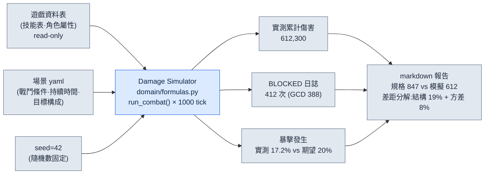

# 8.3 Damage Simulator —— 規格 DPS 與模擬結果分岔的那一天

2008 年的一個凌晨,我對著一張 Excel 表,把同一個數字驗算了三遍。規格書裡寫著某個劍士角色的每秒傷害是 **847**。可那天我第一次跑出來的模擬器,輸入的是同一個角色、同樣的引數,卻吐出了 **612**。相差 27%。兩個數字裡必有一個在說謊,而我還不知道是哪一個。

規格書上的 DPS 是紙面上的承諾。一次技能的傷害乘以發動頻率的算術。模擬器的 DPS 則是把這份承諾實際揮動 1,000 次之後的結果。冷卻時間相互重疊、施法動作吃掉時間、暴擊沒有按期望值那樣打出——這些紙面不知道的摩擦摻了進來。這 27% 的縫隙,正是數值策劃安身立命的地方。信了紙面,上線之後就要哭。

本章講的是這一件工具的故事。2008 年做出來、至今沒有離手的 Damage Simulator。它如何追蹤規格與產出分岔的確切位置,以及 18 年後我又如何給這套追蹤接上了 AI——本章用一段真實的實操記錄(worked transcript,完整保留的真實操作過程記錄)一步步走過。

---

## 8.3.1 規格 DPS 為什麼總是在說謊

先來拆解一下這個 612 對 847 到底是怎麼回事。寫這份規格書的後輩策劃(以下稱團隊成員 A)並沒有做錯什麼。他只是照著技能表上寫的數字相乘。

規格上的 DPS 是這樣算出來的。假設某個角色擁有三個技能。

| 技能 | 單次傷害 | 冷卻時間 | 施法時間 |
|---|---|---|---|
| 橫斬 | 320 | 3.0s | 0.6s |
| 突刺 | 540 | 6.0s | 0.9s |
| 普攻 | 180 | 1.2s | 0.4s |

團隊成員 A 的規格計算,建立在"每個技能一到冷卻就毫不遺漏地釋放"這一理想假設之上。橫斬每 3 秒 320,突刺每 6 秒 540,普攻填滿空檔。用算術算,乾乾淨淨地得出 847。在紙面上,角色彷彿長了好幾隻手,施法動作彼此互不阻擋。

模擬器之所以給出 612,原因只有一個——手只有一隻。在釋放 0.9 秒的突刺期間,即便橫斬的冷卻已經轉好,也沒法使出來。施法動作彼此吞噬的這種**全域性冷卻(GCD)衝突**,在規格里並不存在。紙面是沒有摩擦的真空,模擬則是有摩擦的戰場。做這行 24 年,我學到的第一條真理就是這個——規格 DPS 是上限,而不是實測值。而玩家玩的不是上限,是實測值。

---

## 8.3.2 實操記錄 —— 向 AI 追問 612 的出處

2008 年的我,是用手把這 27% 的縫隙填上的。我一行一行地用眼睛讀模擬日誌,數出技能在哪一幀被擋住。花了半天。18 年後的今天,我把同一份日誌扔給 Claude。下面是實際進行的一次會話全文。我不做刪減,連打偏的第一次嘗試也原樣收錄——因為那次打偏,正是用好這件工具的一半訣竅。

我丟擲的提示詞是這樣的。

> 附件是我們的 Damage Simulator(`damage_sim/`,Python)單個角色 1,000 tick 戰鬥日誌的一部分。規格書上這個角色的 DPS 是 847,而模擬產出是 612。請從日誌中找出這 27% 差距的原因。日誌格式為 `[tick] event skill=SKILL state=STATE`。不要猜測,只拿日誌裡的證據說話。證據不足就說不足。
>
> ```
> [0.0] cast skill=突刺 state=START
> [0.9] cast skill=突刺 state=HIT dmg=540
> [0.9] cast skill=橫斬 state=BLOCKED reason=GCD
> [1.5] cast skill=普攻 state=HIT dmg=180
> [1.9] cast skill=普攻 state=BLOCKED reason=GCD
> [3.0] cast skill=橫斬 state=HIT dmg=320
> [3.6] cast skill=普攻 state=HIT dmg=180
> ... (此處省略 994 行)
> [997.2] cast skill=突刺 state=HIT dmg=540
> ```

Claude 的原始輸出是這樣的(未作潤色)。

> 從日誌中可以確認的事實:
>
> 1. `state=BLOCKED reason=GCD` 事件反覆出現。在 `[0.9]` 處橫斬、在 `[1.9]` 處普攻,都因為 GCD(全域性冷卻)被擋住了。
> 2. 在突刺施法(0.0→0.9,0.9 秒)結束之前,其他技能無法發動。看起來是施法時間佔用了 GCD 的結構。
> 3. 因此,規格上"每個技能一到冷卻就發動"的假設被打破了。實際上施法動作彼此衝突,導致一部分發動被遺漏。
>
> 不過所提供的日誌只有 1,000 行中的 7 行。**這 27% 的確切差距是否僅憑 GCD 衝突就能解釋,單靠這 7 行無法斷定。** 需要統計 BLOCKED 事件的總髮生次數,以及由此遺漏的傷害總量,才能驗證這 27%。如果你能給出整份日誌的 BLOCKED 彙總,我會做定量確認。

在這裡停下,很重要。AI **指出**了原因,卻沒能**證明**這 27%,而且它自己說出了這個侷限。換作一個只看紙面的策劃,可能一句"是 GCD 的緣故"就把會開完了;而這件工具卻堅持"光憑 7 行還不知道"。我判斷它的這個要求是正當的——這就是人的驗證。於是我把整份日誌的 BLOCKED 彙總提取出來,再次拋給它。

> 這是整整 1,000 tick 的彙總。BLOCKED 共 412 次,其中 GCD 原因 388 次,冷卻未就緒原因 24 次。因 BLOCKED 遺漏的估算傷害,按橫斬折算約為 19,800。整場 1,000 tick(=秒)戰鬥中,規格期望傷害為 847,000,模擬實測累計傷害為 612,300。用這些數字重新審視這 27% 的差距。

Claude 的第二次輸出。

> 用匯總來驗證。
>
> - 規格期望累計:847,000
> - 模擬實測累計:612,300
> - 差距:234,700(27.7%)
>
> 這個差距的構成:
> - 因 GCD 衝突直接遺漏(388 次):估算約 19,800 是按橫斬折算的,但還應把"被遺漏的槽位本可以填入更高傷害技能"的機會成本一併計入。若把遺漏槽位按平均傷害折算,遺漏部分會大於 19,800。
> - 不過 234,700 並不能全部只用 BLOCKED 來解釋。**規格 847 究竟是"已把暴擊期望值按平均計入"的值,還是"不含暴擊的基礎值",會決定其餘差距該如何解釋。** 如果你告訴我規格 847 的暴擊假設,我就把剩餘差距分解開。

它又停下了。而且再一次停在了準確的地方。規格 847 是怎麼處理暴擊的——這是日誌裡沒有的資訊,只存在於團隊成員 A 的腦子裡。AI 知道自己所持資料的邊界。我去確認後發現,規格 847 是把暴擊 20% 機率、1.5 倍按期望值平攤進去後的值;而模擬則是 seed 固定之後,實際暴擊發生次數低於期望值的那一局。也就是說,這 27% 的差距,是 **GCD 衝突(結構性、可復現)** 與 **暴擊方差(統計性、這一局的運氣)** 混在一起的值。

這個分解就是結論。GCD 衝突的那部分是必須靠設計去修的真問題,而暴擊方差的那部分,只要換 seed 跑 1,000 局取平均就會消失的噪聲。把兩者混為一談,以"角色太弱"為由給它加強,那麼在 1,000 局平均裡本來正常的角色就會變得過強。紙面不知道、單獨一局的模擬不知道、**連 AI 自己也不知道**的這個區分,是靠日誌彙總與規格中隱藏假設的對照——也就是人的驗證——才做出來的。

---

## 8.3.3 一組輸入變成一組輸出 —— 解剖模擬器

把剛才那次會話所審視的這件工具的輸入輸出,作為一整套攤開來看。模擬器歸根結底是一個誠實的函式。同樣的輸入,同樣的輸出。輸入從三條路匯聚而來。



這張圖的關鍵在於:箭頭是單向的。遊戲資料表只會被模擬器**讀取**,模擬器絕不會去改寫資料。18 年來擋下最多事故的規則,就是這一根箭頭的方向。一旦模擬器開始把資料複製一份存在自己內部,那麼在遊戲資料變更的第二天,模擬器模擬的就是昨天的世界。拿這樣產出的報告去開會,整場會議就會圍繞昨天的世界爭論不休。

一組具體的輸入(場景 yaml)長這樣。

```yaml
# scenarios/single_dps_check.yaml
scenario: single_target_dps
duration_ticks: 1000      # 假設 1 tick = 0.1s,100 秒戰鬥
seed: 42                  # 確定性 —— 同樣的輸入,同樣的輸出
actor:
  char_id: K_004          # 從遊戲資料表 read
  skill_rotation: optimal # GCD 衝突時,優先最高期望傷害
target:
  defense: 1200
  hp: infinite            # 用於測 DPS 的無限血量假人
report:
  compare_to_spec: 847    # 填入規格 DPS,自動分解差距
```

而一組輸出(報告節選)是這樣。

```markdown
# Damage Simulator Report — K_004 single DPS
輸入: scenarios/single_dps_check.yaml | seed=42 | data rev. 2026-06-05

## 規格對比
- 規格 DPS:       847   (含暴擊 20%·1.5x 期望值平攤)
- 模擬實測 DPS:  612   (這一 seed 的單局)
- 差距:            -27.7%

## 差距分解
- 結構性(GCD 衝突,可復現):   -19.2%  ← 設計複查物件
- 統計性(暴擊方差,這一局): -8.5%  ← 預計 1000 局平均時抵消

## 復現驗證
- seed=42 重跑 3 次 → 612,300 / 612,300 / 612,300 (一致)
- seed 0~999 共 1000 局平均 DPS → 731 (暴擊方差抵消後)
```

看最後一行。用 seed 0\~999 跑 1,000 局的平均是 731。規格 847 與 1,000 局平均 731 之間的差距 116(13.7%),正是 GCD 衝突這個**真正的結構問題**的大小。該成為設計會議輸入的,不是單獨一局的 612,而是這個 731。既不是紙面的 847,也不是運氣不好那一局的 612,而是 1,000 局達成共識的 731。把這個數字握在手裡之前的全部功夫,就是數值策劃的工作。

---

## 8.3.4 2008 年的手與 2026 年的手

這件工具活了 18 年,但並不是靠同一份程式碼活下來的。衣架原樣不動,只把衣服換了五次。衣架就是上面那份報告的邏輯——把規格與實測分開看、把差距分解為結構與方差、再用復現來驗證的這套流程。這套流程,無論是在 2008 年的 Excel VBA(Excel 巨集語言)裡,還是在 2026 年的 Python 裡,都一字不差地相同。

| 時期 | 衣服(技術) | 衣架(不變的流程) |
|---|---|---|
| 2008\~2011 | Excel VBA,1:1 | 對比規格做差距分解 |
| 2012\~2016 | C# 控制台,N:N | 〃 |
| 2017\~2020 | Python + Web | 〃 |
| 2021\~2024 | Python + ML | 〃(+ 反映玩家分佈) |
| 2025\~ | Python + LLM 輔助 | 〃(+ 日誌查詢·假設生成) |

撐過五次換衣服的秘訣,刻在資料夾結構裡。

```
damage_sim/
├── domain/          # 衣架 —— 18 年原樣不變
│   ├── formulas.py      # 傷害公式·GCD 衝突判定
│   └── metrics.py       # 差距分解邏輯
├── adapters/        # 遊戲資料 read-only
│   └── excel_reader.py
├── runners/         # 衣服 —— 每次技術變更就替換
│   └── cli_runner.py
└── reporters/       # 衣服 —— 報告輸出格式
    └── markdown_report.py
```

技術一變,只需重寫 `runners/` 和 `reporters/`。`domain/` 裡的差距分解邏輯,作為 18 年的資產原樣存活下來。2008 年用 Excel 單元格寫的 GCD 衝突判定式,如今只換了函式簽名,就在 `formulas.py` 裡執行著。把工具釘死在一種技術上,它就會隨那種技術一起老去、死掉——這是我送走好幾件死掉的工具後才學會的。

2025 年接上的 LLM,不是新衣架,而是新的手。正如前面那次會話所見,AI 是**讀日誌、立假設**的手,原本要花半天的日誌追蹤縮短到了幾分鐘。但它絕不碰衣架——**決定**差距是不是 27%、暴擊到底打出了百分之幾的,依然是 seed 固定的確定性核心。LLM 一旦擠進那個位置,迴歸驗證就變得不可能,工具也就死了。

---

## 8.3.5 確定性核心與它的外部 —— 界線該劃在哪裡

如果在一件數值工具裡只能劃一條線,我會把它劃在確定性核心的邊界上。裡側,必須像鋼鐵一樣保證同樣的輸入得到同樣的輸出;外側,人和 AI 儘可以自由地丟擲假設。

裡側(確定性 —— 禁止 AI):
- 傷害公式、GCD 衝突判定、暴擊發生、累計彙總。
- 用 `seed=42` 跑三次,612,300 必須三次都一模一樣。這一點一旦被破壞,昨天的報告和今天的報告就無法比較。

外側(假設·解釋 —— 歡迎 AI):
- "為什麼這個角色組合的勝率不正常"之類的原因查詢。
- 在日誌裡找 BLOCKED 模式、自然語言報告初稿、場景 yaml 初稿。

前面那段實操記錄,恰好就在這條線上移動。AI 在外側迅速立起了"GCD 衝突是原因"的假設。但 27% 這個數字、612 這個數字,自始至終都是確定性核心算出來的值,AI 只是接過這些值去做解釋。而且它兩次停下,說"憑這些資料無法斷定"——同時要求確定性核心給不了的資訊(規格對暴擊的假設)。這種停下,正是一件好工具的標誌:不把假設錯當成診斷。

關於數字,我要誠實地交代一點。本章裡 847·612·731·412 次這類具體數字,是為了說明而構造的示例值。但"規格 DPS 總是高於模擬實測"這個**方向**、"這個差距會分解為結構性衝突與統計性方差"這個**結構**、以及"seed 固定是迴歸驗證的前提"這條**原則**,都是從 2008 年起 18 年間實際運用中反覆確認過的。比例的大小因專案而異,但方向和結構從未改變。

---

## 動手試試 —— 對比規格做一次差距分解

**setup.** 從遊戲資料中挑一個角色,拿到它的技能表(傷害·冷卻時間·施法時間)和規格 DPS。如果沒有模擬器,就寫一個跑 1,000 tick 單目標戰鬥的最小指令碼。關鍵只有一條:必須能把 `seed` 作為引數傳入並固定下來。

**prompt.** 把模擬日誌(含 BLOCKED 事件)和規格 DPS 一起拋給 AI。

> 附件是 1 名角色的 1,000 tick 戰鬥日誌和 BLOCKED 彙總。規格 DPS 是 [N],而模擬產出是 [M]。請只憑日誌證據分解差距的原因。區分結構性原因(可復現的衝突)與統計性原因(這一局的方差)。證據不足就說不足,並指出還需要什麼。

**verify.** 把 AI 指出的結構性原因,通過換 seed 跑 1,000 局取平均來驗證。如果平均之後差距仍在,那就是真正的結構問題;如果消失了,那就是方差噪聲。AI 若以"無法斷定"停下,那不是失敗,而是正常——停下的地方,由人補上規格里隱藏的假設。

### 單人精簡版

如果你是既沒有模擬器也沒有 ML 的單人開發者,那麼只用一張 Excel 和 AI,也能跑同樣的流程。把技能表填進表格,用 `RAND()` 擲暴擊,在一列裡做一個 1,000 行的模擬。由於無法固定 seed,就用 `F9` 重算 100 次,用手工的方式看平均。把那個平均與規格 DPS 的差距拋給 AI,讓它"分成結構原因和方差原因"。工具雖小,衣架——對比規格做差距分解、結構與方差的分離、復現驗證——照樣立得住。

---

### 本章要點
- 規格 DPS 是沒有摩擦的上限,而玩家實際經歷的實測值,靠模擬跑 1,000 局取平均才能找到。
- 規格與模擬之間的差距,必須拆分成結構性衝突和統計性方差,才能看清真正的設計問題。
- 確定性核心裡側禁止 AI,假設·解釋的外側則把 AI 當作新的手來歡迎。

### 下一章預告
- 8.4 AI 輔助的數值模擬 —— 在守住確定性核心的同時,把周邊自動化的那些位置
