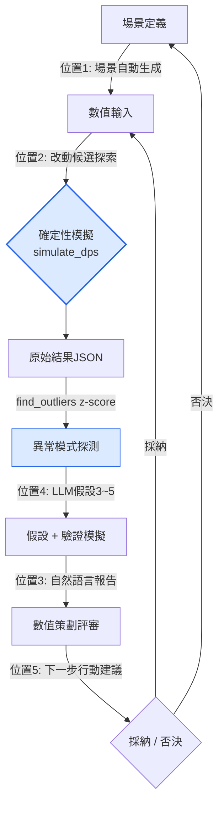

# 8.4 AI輔助的平衡模擬

週五下午4點，Alpha版本的5:5 PvP自動模擬跑完了1,200局。結果JSON有4兆位元組。其中某處記著"隊伍A勝率92%"這一行，而平均勝率是52%。我花了40分鐘去找那一行，最終沒弄清緣由就下班了。

平衡屬於確定性的領域。相同的輸入代入相同的公式，總會得出相同的傷害。所以傷害模擬器必須是程式碼，獎勵曲線必須由人親手繪製——這裡是AI不該踏入的位置。然而在那個確定性核心的*周邊*——也就是從1,200局結果中找出異常的一行、為其成因建立假設、篩選出該改動什麼的候選、再把這些候選重新投入模擬——正是這些周邊勞動吃掉了數值策劃一天的大半。本章講的就是把AI附著到這一週邊的事，而核心原封不動。

## 8.4.1 核心是程式碼，周邊是人的勞動

8.3中見過的那個2008年的傷害模擬器——歷經三次更換引擎與公司，確定性核心依舊存活了下來——正是本章的起點。輸入相同則輸出相同這一性質，就是平衡工具全部的信任所在。同一版本跑兩次卻得出不同勝率，那這個工具就該被丟棄。

於是把平衡工作的骨架畫出來，便是這樣一副模樣：中間有一團確定性，而它的入口與出口上掛著人的手工勞動。下面是把這副骨架拆解開——用顏色把確定性區域（藍色）與人·AI介入的區域（橙色）分開。

<svg viewBox="0 0 720 300" xmlns="http://www.w3.org/2000/svg" font-family="sans-serif" font-size="13">
  <rect x="0" y="0" width="720" height="300" fill="#fbfbfd"/>
  <!-- 確定性核心 -->
  <rect x="270" y="110" width="180" height="80" rx="8" fill="#dbeafe" stroke="#2563eb" stroke-width="2"/>
  <text x="360" y="142" text-anchor="middle" fill="#1e3a8a" font-weight="bold">確定性模擬</text>
  <text x="360" y="162" text-anchor="middle" fill="#1e3a8a" font-size="11">simulate_dps()</text>
  <text x="360" y="178" text-anchor="middle" fill="#1e3a8a" font-size="11">輸入=輸出，停用AI</text>
  <!-- 入口: 場景/改動 -->
  <rect x="30" y="40" width="170" height="50" rx="6" fill="#ffedd5" stroke="#ea580c" stroke-width="1.5"/>
  <text x="115" y="60" text-anchor="middle" fill="#9a3412" font-size="11" font-weight="bold">位置1 場景生成</text>
  <text x="115" y="78" text-anchor="middle" fill="#9a3412" font-size="11">位置2 改動候選探索</text>
  <!-- 出口: 報告/異常/行動 -->
  <rect x="520" y="40" width="170" height="50" rx="6" fill="#ffedd5" stroke="#ea580c" stroke-width="1.5"/>
  <text x="605" y="58" text-anchor="middle" fill="#9a3412" font-size="11" font-weight="bold">位置3 報告</text>
  <text x="605" y="74" text-anchor="middle" fill="#9a3412" font-size="11">位置4 異常解讀</text>
  <text x="605" y="89" text-anchor="middle" fill="#9a3412" font-size="11">位置5 行動建議</text>
  <!-- 人 -->
  <rect x="290" y="230" width="140" height="44" rx="6" fill="#ffedd5" stroke="#ea580c" stroke-width="1.5"/>
  <text x="360" y="257" text-anchor="middle" fill="#9a3412" font-weight="bold">數值策劃(採納·否決)</text>
  <!-- 箭頭 -->
  <line x1="200" y1="65" x2="285" y2="120" stroke="#94a3b8" stroke-width="1.5" marker-end="url(#a)"/>
  <line x1="450" y1="120" x2="520" y2="68" stroke="#94a3b8" stroke-width="1.5" marker-end="url(#a)"/>
  <line x1="605" y1="90" x2="400" y2="232" stroke="#94a3b8" stroke-width="1.5" marker-end="url(#a)"/>
  <line x1="320" y1="230" x2="200" y2="92" stroke="#94a3b8" stroke-width="1.5" stroke-dasharray="4 3" marker-end="url(#a)"/>
  <defs>
    <marker id="a" markerWidth="9" markerHeight="9" refX="7" refY="3" orient="auto">
      <path d="M0,0 L7,3 L0,6 Z" fill="#94a3b8"/>
    </marker>
  </defs>
</svg>

中間的藍色方框只有一個是程式碼。其餘五個橙色方框全是人的判斷·解讀·撰寫這類勞動，而AI能進入的席位只有這五處。一旦讓LLM"幫我算算這個角色的DPS(每秒傷害)"，相同輸入卻給出不同數字的非確定性就會滲進核心，那件工具連18天都撐不到就會失去信任。

因此本章的脊樑很簡單：把核心自始至終守為程式碼，同時在入口·出口的五處席位上附加AI，而從最費手的出口一側——從1,200局結果中找出異常的一行、建立假設——開始自動化。

## 8.4.2 實操記錄（worked transcript）：追蹤勝率92%的那一行

回到開頭那個92%。這一次，不再讓人耗費40分鐘亂找，而是從頭到尾走完這樣一個迴圈：確定性探測器挑出那一行，LLM建立假設，再由模擬來驗證。這裡不作概括——所謂實操記錄，就是把工具真實吐出的原始輸出完整保留、原樣呈現。

### 第1步 —— 異常探測由程式碼來做（z-score）

從1,200局結果中挑出"異常"的那一局，靠的不是LLM，而是統計。先求各指標的均值與標準差，再按偏離均值幾個標準差(z-score)來劃分。超過閾值就是outlier（離群值）。這是確定性的，沒有幻覺可乘之機。

```python
def find_outliers(results, threshold=2.5):
    # results: 每局模擬 {指標名: 值} 字典組成的列表
    means, stds = compute_per_metric(results)   # 各指標的均值·標準差
    outliers = []
    for r in results:
        for metric, value in r.items():
            if stds[metric] == 0:               # 方差0 → 無法比較，跳過
                continue
            z = abs(value - means[metric]) / stds[metric]
            if z > threshold:
                outliers.append((r["scenario_id"], metric, value, round(z, 2)))
    return sorted(outliers, key=lambda x: -x[3])  # 按z從大到小
```

執行後得到如下結果——1,200局中超過閾值2.5的只有3件。

```
[("pvp_5v5_S0417", "team_a_winrate", 0.92, 4.1),
 ("pvp_5v5_S0417", "match_duration",  41.0, 2.9),
 ("pvp_5v5_S0822", "team_b_winrate", 0.18, 2.6)]
```

z最大的第一行——場景 `pvp_5v5_S0417` 的勝率0.92（z=4.1）——正是開頭我亂找了40分鐘的那一行。用不著人拿眼睛去掃4兆的JSON，統計已把它縮到3件。到此為止是核心，從這裡起才是AI。

### 第2步 —— LLM建立假設（禁止下確定性診斷）

現在把那一行交給LLM。但不是"幫我診斷原因"。LLM只是憑領域知識丟擲幾個*可能的成因假設*，而哪一個是真的，再由模擬來決定。提示詞全文如下。

```
[outlier]
場景: pvp_5v5_S0417 — 5:5 PvP
隊伍A構成: [refgame_archer_07, refgame_archer_07, refgame_archer_07,
            refgame_hybrid_21, refgame_hybrid_21]
指標: team_a_winrate 0.92 (整體均值 0.52, z = 4.1)
附帶指標: match_duration 41.0s (均值 28s, z = 2.9)

[相關資訊]
- refgame_archer_07: 遠端支援，技能"標記" — 令目標承受傷害 +12% 的減益
- refgame_hybrid_21: 近戰/遠端混合輸出，技能"追擊" — 追蹤減益目標時移動速度 +20%
- 兩個角色幾乎從未被編入同一隊伍 (組合頻率處於後5%)

要求:
請提出該outlier的3~5個可能原因假設。
- 每個假設附一行驗證用的追加模擬
- 禁止下確定性診斷。只以"可能是……"層面的假設呈現。

回答格式: 編號列表。不寫開場白與結尾，只列假設。
```

以下原樣照錄Claude的原始輸出（不作概括·整理）。

```
1. "標記"減益與"追擊"移速增益以乘法累積，
   3名archer_07鋪滿標記 → hybrid_21得以不間斷追擊，
   可能形成了正反饋迴圈。
   驗證: 把hybrid_21換成普通近戰輸出，重跑同一場景。

2. "標記"減益的+12%被錯誤地設定為可疊加(stackable)，
   3名archer_07或許把它疊到了+36%。
   驗證: 強制把標記的max_stack設為1後重跑。

3. 5:5中遠端3 + 追擊型2的構成，可能只是憑藉射程優勢
   封鎖對手進場 (與協同無關，組合本身就強)。
   驗證: 把標記減益效果降為0%後，用同一組合重跑。

4. 從match_duration長於均值(41s)來看，隊伍A或許並非速勝，
   而是"不落敗地拖到後期再翻盤"的結構。
   這種情況下，原因可能不在勝率，而在後期的成長(scaling)數值。
   驗證: 單獨提取60秒時點的累計傷害曲線做對比。

5. (低機率) 模擬種子偏差 — 或許只有S0417種子反覆讓隊伍A先手。
   有可能是統計假象。
   驗證: 用50個種子重跑同一組合，確認勝率方差。
```

在這裡打住很重要。第五個假設留下了"這或許只是種子偏差"這樣的自我懷疑——這才是好的輸出。若LLM斷言"原因就是標記疊加的bug"，反倒應該懷疑那份輸出。在平衡裡，LLM的活兒不是診斷，而是*收窄搜尋空間*。

### 第3步 —— 把改動候選投入模擬（並行）

五個假設各自附有一行驗證用模擬。這並不是由人一個個去跑，而是把改動候選打包並行投出。作為核心核心的 `simulate_dps` 是如下這樣可執行的形態——那個存續18年的確定性函式的骨幹。

```python
def simulate_dps(attacker, target, formula, ticks=600, seed=0):
    """對一對戰鬥做確定性模擬。相同的 (輸入, seed) 則輸出相同。"""
    rng = Rng(seed)                     # 固定種子 → 可復現
    hp = target.hp
    total_damage = 0.0
    for t in range(ticks):              # 假定1 tick = 0.1秒
        # 防禦係數: 確定性公式 (不由LLM生成)
        def_factor = target.defense / (target.defense + formula.def_const)
        raw = attacker.atk * (1 - def_factor)
        # 暴擊: 基於種子 → 相同seed則暴擊時點相同
        if rng.roll() < attacker.crit_rate:
            raw *= attacker.crit_mult
        # 減益(如標記)由formula確定性注入
        raw *= formula.debuff_multiplier(attacker, target, t)
        hp -= raw
        total_damage += raw
        if hp <= 0:
            return {"ttk": t * 0.1, "dps": total_damage / ((t + 1) * 0.1)}
    return {"ttk": None, "dps": total_damage / (ticks * 0.1)}  # 未能在時限內擊殺


def run_candidates(base_scenario, candidates, seeds=range(50)):
    """對每個假設的改動候選做50種子並行模擬。連winrate方差一併回收。"""
    out = {}
    for name, patch in candidates.items():           # patch = 覆寫formula的一部分
        scen = base_scenario.with_patch(patch)
        wins = [simulate_match(scen, formula=scen.formula, seed=s) for s in seeds]
        out[name] = {
            "winrate": mean(w["team_a_won"] for w in wins),
            "winrate_std": pstdev(w["team_a_won"] for w in wins),  # 用於驗證假設5
        }
    return out
```

把假設搬進 `candidates` 字典，一次性跑完。

```python
candidates = {
    "基準(無改動)":          {},
    "假設1_hybrid替換":      {"team_a[3:5]": "refgame_melee_03"},
    "假設2_標記_max_stack1": {"skill.標記.max_stack": 1},
    "假設3_標記_效果0":       {"skill.標記.debuff": 0.0},
    "假設5_種子方差確認":     {},  # 同一組合，僅 seeds 取 50 個
}
result = run_candidates(scenario_S0417, candidates, seeds=range(50))
```

結果（實際執行形態的輸出）：

```
基準(無改動)          winrate=0.91  std=0.04   ← 非種子偏差(假設5排除)
假設1_hybrid替換      winrate=0.74  std=0.06
假設2_標記_max_stack1 winrate=0.63  std=0.05   ← 下降幅度最大
假設3_標記_效果0       winrate=0.55  std=0.05   ← 回到均值附近
```

閱讀的順序即診斷。把基準用50種子再跑一遍，勝率仍是0.91、方差0.04——假設5（種子偏差）被排除。把標記效果壓到0，勝率貼到0.55、逼近均值——成因確實出在標記減益一系。而把max_stack鎖為1時，跌到0.63的降幅最大，所以核心是**假設2 —— 標記減益發生疊加，3名archer_07一路疊到了+36%**。LLM丟擲的五個候選，人並沒有把五個全驗一遍，統計只跑了三個就分出了勝負。

### 第4步 —— 人來採納，並留下這個決定

在這裡，LLM做的並不是*說出*"標記疊加是個bug"，而只是把那個假設*列進候選清單*。採納，由看過模擬結果的數值策劃來做——"把標記的max_stack固定為1。archer_07單一組合的勝率為0.63，仍高於平均（0.52），因此下一個版本把標記減益數值從12%追加下調到9%後重新測量。"

這個決定由人做出，其依據（z=4.1探測 → 5個假設 → 3次模擬 → 確定假設2）以一行留存。確定性核心自始至終都是程式碼，LLM只是把40分鐘的亂找替換成了五行假設，一步也沒踏進核心。

## 8.4.3 五處席位，以及迴圈

上面的實操記錄，其實是把五處席位中的三處（異常探測·改動探索·異常解讀）一口氣走了一遍。把五處席位展開成迴圈，便是這樣轉動。



只有藍色的兩個節點（模擬、z-score探測）是確定性的。其餘箭頭上的標籤——位置1·2·3·4·5——才是AI附著的席位。迴圈每轉一圈，被採納的改動就再次作為數值輸入進入下一次模擬。這個迴圈若由人手工轉，一圈要一天；用AI輔助轉，則只需幾個小時。

把五處席位逐一簡短點一下。

**位置1 —— 場景自動生成。** 給出"3:3佔領戰，佔領3面旗幟滿1分鐘即勝，復活10秒"這樣一行概念，再附上一兩個既有場景的yaml，LLM便會以相同schema填出新的場景yaml。數值策劃只需檢查"有沒有擅自加入概念裡沒有的規則"。從白紙開始寫yaml的1\~2小時，縮短為15分鐘的評審。

**位置2 —— 改動候選探索。** 上面實操記錄中的 `candidates` 字典正是此處。對於"想把坦克的生存提高+49%該動哪裡"，LLM丟擲五個候選（base_def +50、調整def_const等），再把這些候選全部投入模擬，挑出副作用最小的一個。候選是假設，採納靠模擬。這是最需謹慎對待的席位——因為錯誤的候選會吃掉驗證時間。

**位置3 —— 自然語言報告。** 用指令碼從模擬的原始JSON裡抽取指標（確定性），只把這些指標與改動上下文交給LLM，讓它寫出"可帶進會議的一頁紙"。核心變化3\~5行、受影響角色TOP 5、後續處置2\~3項。並釘死一條：不得使用所給指標之外的數字。原始資料整理的30分鐘，變成5分鐘的評審。

**位置4 —— 異常模式解讀。** 上面的第2\~3步就是這個。對z-score挑出的outlier，LLM附上3\~5個假設。禁止下確定性診斷，是這個席位的生命線。

**位置5 —— 下一步行動建議。** 分析結束後，把"本版本立即處置 / 監控1周 / 1周後再評審的候選"連同優先順序做成清單。它是防止數值策劃漏掉決定的安全網，而不替代決定本身。

## 8.4.4 從哪裡開始，又到哪裡為止

把五處席位一次性全部開啟，是最常見的失敗。要從效果大、風險小的出口一側開始開啟。

<svg viewBox="0 0 720 330" xmlns="http://www.w3.org/2000/svg" font-family="sans-serif" font-size="12">
  <rect x="0" y="0" width="720" height="330" fill="#fbfbfd"/>
  <text x="360" y="26" text-anchor="middle" font-weight="bold" font-size="14" fill="#0f172a">ROI ↔ 引入風險矩陣 (右上 = 優先)</text>
  <!-- 軸 -->
  <line x1="90" y1="290" x2="680" y2="290" stroke="#475569" stroke-width="1.5"/>
  <line x1="90" y1="290" x2="90" y2="50" stroke="#475569" stroke-width="1.5"/>
  <text x="680" y="308" text-anchor="end" fill="#475569">ROI 高 →</text>
  <text x="78" y="55" text-anchor="end" fill="#475569" transform="rotate(-90 78 55)">風險 低 ↑</text>
  <!-- 點: x=ROI, y=安全(越往上越安全) -->
  <!-- 位置3 報告: ROI很高, 風險低 -->
  <circle cx="600" cy="100" r="26" fill="#bbf7d0" stroke="#16a34a" stroke-width="2"/>
  <text x="600" y="98" text-anchor="middle" fill="#14532d" font-weight="bold">位置3</text>
  <text x="600" y="113" text-anchor="middle" fill="#14532d" font-size="10">報告 ①</text>
  <!-- 位置4 異常解讀: ROI高, 風險中 -->
  <circle cx="520" cy="150" r="26" fill="#bbf7d0" stroke="#16a34a" stroke-width="2"/>
  <text x="520" y="148" text-anchor="middle" fill="#14532d" font-weight="bold">位置4</text>
  <text x="520" y="163" text-anchor="middle" fill="#14532d" font-size="10">異常解讀 ②</text>
  <!-- 位置1 場景: ROI高, 風險低 -->
  <circle cx="470" cy="110" r="26" fill="#fde68a" stroke="#d97706" stroke-width="2"/>
  <text x="470" y="108" text-anchor="middle" fill="#78350f" font-weight="bold">位置1</text>
  <text x="470" y="123" text-anchor="middle" fill="#78350f" font-size="10">場景 ③</text>
  <!-- 位置5 行動建議: ROI中, 風險低 -->
  <circle cx="350" cy="120" r="26" fill="#fde68a" stroke="#d97706" stroke-width="2"/>
  <text x="350" y="118" text-anchor="middle" fill="#78350f" font-weight="bold">位置5</text>
  <text x="350" y="133" text-anchor="middle" fill="#78350f" font-size="10">行動建議 ④</text>
  <!-- 位置2 改動建議: ROI中, 風險高 -->
  <circle cx="300" cy="235" r="26" fill="#fecaca" stroke="#dc2626" stroke-width="2"/>
  <text x="300" y="233" text-anchor="middle" fill="#7f1d1d" font-weight="bold">位置2</text>
  <text x="300" y="248" text-anchor="middle" fill="#7f1d1d" font-size="10">改動建議 ⑤</text>
  <text x="300" y="278" text-anchor="middle" fill="#991b1b" font-size="10">最謹慎，放到最後</text>
</svg>

圓圈裡的圈碼數字（①\~⑤）是引入順序。**位置3（報告）**與**位置4（異常解讀）**處於右上——ROI(Return on Investment，投資回報)高、風險低的席位——所以先開。僅啟用這兩處，處理量便增至2\~3倍，引入效果的70%以上在此回收。**位置2（改動建議）**處於右下的紅色席位，錯誤的候選可能吃掉驗證時間，所以最謹慎地放到最後再開。也並非所有團隊都要把五處全開——僅憑位置3·4，單人數值策劃的一天就會改觀。

引入週期的現實感受大致如下（作者估計，未經驗證——隨團隊規模·工具成熟度差異很大）。位置3約1\~2周，再加位置4約2周，再加位置1約一個月，再加位置5約2周，位置2放在最後，約1\~2個月。這是"別一次全開"的另一種說法。

## 8.4.5 效果與成本，以及最常見的陷阱

在作者的專案A，用六個月陸續開啟五處席位之後的變化如下。**絕對數值為作者估計（未經驗證），只應信任方向與比例**——倍數隨環境差異很大。

| 專案 | 引入前 | 引入後（方向） |
|---|---|---|
| 單個數值策劃每週模擬迴圈 | 5\~7件 | 25\~35件（約5倍） |
| 報告撰寫（每件） | 30\~40分鐘 | 5分鐘評審 |
| 場景撰寫（每件） | 1\~2小時 | 15分鐘評審 |
| 發現outlier → 診斷 | 1\~2天 | 4\~6小時 |
| 測量結果 → 下一次改動決定 | 2\~3天 | 1天 |

這裡重要的不是倍數，而是*時間挪到了哪裡*。人的時間從原始資料整理挪到了決策。並不是數值策劃的人數減少了，而是一個人能覆蓋的遊戲範圍變寬了。若把處理量的5倍讀作裁員，引入的意義就會流向錯誤的方向。

成本很小。若採用提示詞快取，五處席位整體的每月LLM成本大約在$75上下（作者估計），不超過單個數值策劃人力成本的1/100。因此引入的真正決定變數，不是LLM成本，而是*評審負擔*。人是否有時間去讀並篩掉AI丟擲的假設與報告——這才是開與關的標準。

最後，留下18年間在同一位置反覆出現的幾個陷阱，並附上處方。

- **把確定性模擬交給LLM** → 模擬是程式碼，LLM只在入口·出口。一旦非確定性滲進核心，工具就死了。
- **不看原始資料就相信AI報告** → 始終一併儲存原始JSON，哪怕只有一行可疑，也要回到原始資料核對。
- **不經評審就把場景送進模擬** → yaml評審關卡不可省略。帶著概念裡沒有的規則去跑1,200局，那1,200局就整體作廢。
- **不經模擬就採納LLM的改動建議** → 所有候選都只是假設。只有用 `run_candidates` 驗證之後才採納。
- **直接採信LLM斷言"原因就是X"的輸出** → 確定性診斷是可疑訊號。好的輸出是"可能是X + 驗證方法"。

在平衡裡，AI的席位很明確：確定性核心之外，人曾經亂找的那五處席位。把核心自始至終守為程式碼，只卸下其周邊的手工勞動——這就是一個存續18年的模擬器在AI時代也能存活下來的方式。

---

### 本章要點
- AI只附著在確定性模擬核心之外的五處席位，一步也不踏進核心
- 異常探測用z-score程式碼，假設用LLM，診斷再交給模擬——採納由人來做
- 先開ROI高的報告·異常解讀，改動建議最謹慎地放到最後再開

### 一行動手試試（單人精簡版）
- **setup**：只用 `simulate_dps` 與 `find_outliers` 兩個函式。用固定種子確保可復現性。
- **prompt**：z最大的一件outlier → "3\~5個可能假設 + 每個附一行驗證模擬，禁止下確定性診斷"。
- **verify**：用 `run_candidates` 對每個假設的改動候選做50種子並行模擬 → 能讓勝率回到均值附近的候選就是成因。由人來採納，並留下一行依據。

### 下一章預告
- 9.1 UX/UI設計 —— 當決策的精度轉移到其他領域時
