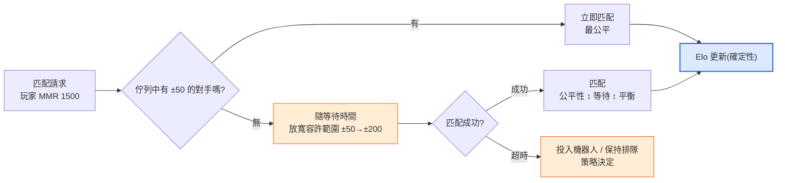
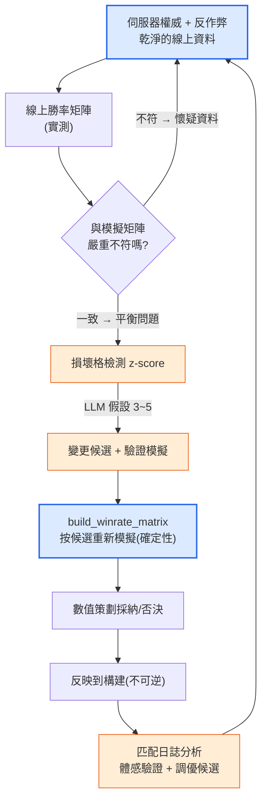

# 8.5 PvP·競技平衡 —— 勝率矩陣·匹配·伺服器權威

到目前為止,本部分的四章都在和同一個對手作戰。一個 Boss 能在幾秒內被擊殺嗎、坦克能有 89% 的存活率嗎、金幣在流失嗎——全都是圍繞**單一目標**的傷害、生存與收支的故事。可是在 PvP 中,對手是人。人不會像 Boss 那樣按固定套路行動,即便是同一個職業,手法也各不相同,而最關鍵的是,他們*會盯著彼此的弱點下手*。PvE 平衡做得再深,PvP 卻整塊空缺,這種情況之所以常見,正是因為如此。單一目標的 DPS 曲線在 8.1\~8.4 已經講透,但"剪刀勝過布"這張相剋之網,卻還一次都沒有畫過。

本章填補這塊空白。要講的有三樣——承載職業與陣容之間相剋關係的**勝率矩陣**、決定讓誰與誰對戰的**匹配/MMR**,以及能讓上述所有數值淪為虛假的**伺服器權威·反作弊**。而貫穿整個本部分的那條界線,在這裡依然不變:戰鬥公式是確定性的,匹配與相剋檢測是 AI 輔助。一步都不會走偏。

---

## 8.5.1 PvP 區別於 PvE 的唯一一點

在 PvE 中,角色的強度是**絕對值**。劍士的 DPS 是 800 就是 800,Boss 就實打實地承受這 800。可是在 PvP 中,強度是**相對的**。劍士的 800 對弓手來說足夠,但對能把自己所受傷害降低 30% 的盾兵而言,會被削減到 560 而顯得不足。同一個角色的強度,會*隨著對手是誰*而變化。僅此一點,就讓 PvP 平衡成為與 PvE 根本不同的問題。

因此,PvP 平衡的單位不是單個角色的數字,而是**一對關係**。"劍士 vs 弓手"的勝率、"劍士 vs 盾兵"的勝率各自獨立存在,把這些關係全部彙總,就成了一張表。橫軸和縱軸都放同一份職業清單,每一格里寫著"行擊敗列的機率"。這就是**勝率矩陣**。如果說 PvE 有 DPS 曲線,那麼 PvP 就有這張矩陣。

<svg viewBox="0 0 660 300" xmlns="http://www.w3.org/2000/svg" font-family="sans-serif" font-size="13">
  <rect x="0" y="0" width="660" height="300" fill="#ffffff"/>
  <text x="330" y="28" text-anchor="middle" font-weight="bold" font-size="14" fill="#0f172a">PvE 是絕對值,PvP 是關係</text>
  <!-- PvE side -->
  <rect x="30" y="60" width="120" height="60" rx="8" fill="#eaf2fb" stroke="#2c6fbb" stroke-width="1.5"/>
  <text x="90" y="86" text-anchor="middle" fill="#2c6fbb" font-weight="bold">劍士</text>
  <text x="90" y="106" text-anchor="middle" fill="#333" font-size="11">DPS 800</text>
  <line x1="150" y1="90" x2="210" y2="90" stroke="#888" stroke-width="1.5" marker-end="url(#ph)"/>
  <rect x="210" y="60" width="120" height="60" rx="8" fill="#f3f4f6" stroke="#6b7280" stroke-width="1.5"/>
  <text x="270" y="86" text-anchor="middle" fill="#374151" font-weight="bold">Boss</text>
  <text x="270" y="106" text-anchor="middle" fill="#333" font-size="11">原樣承受 800</text>
  <text x="180" y="150" text-anchor="middle" fill="#2c6fbb" font-size="11">PvE:強度 = 絕對值</text>
  <!-- PvP side -->
  <rect x="30" y="190" width="120" height="50" rx="8" fill="#fdecea" stroke="#c0392b" stroke-width="1.5"/>
  <text x="90" y="220" text-anchor="middle" fill="#c0392b" font-weight="bold">劍士 800</text>
  <line x1="150" y1="200" x2="210" y2="200" stroke="#16a34a" stroke-width="1.5" marker-end="url(#ph)"/>
  <rect x="210" y="180" width="120" height="34" rx="6" fill="#dcfce7" stroke="#16a34a" stroke-width="1.2"/>
  <text x="270" y="202" text-anchor="middle" fill="#14532d" font-size="11">弓手 → 800(有效)</text>
  <line x1="150" y1="215" x2="210" y2="232" stroke="#dc2626" stroke-width="1.5" marker-end="url(#ph)"/>
  <rect x="210" y="222" width="120" height="34" rx="6" fill="#fee2e2" stroke="#dc2626" stroke-width="1.2"/>
  <text x="270" y="244" text-anchor="middle" fill="#7f1d1d" font-size="11">盾兵 → 560(不足)</text>
  <text x="200" y="284" text-anchor="middle" fill="#c0392b" font-size="11">PvP:強度 = 隨對手而變</text>
  <!-- matrix hint -->
  <rect x="400" y="60" width="230" height="196" rx="8" fill="#fbfbfd" stroke="#94a3b8" stroke-width="1.2"/>
  <text x="515" y="84" text-anchor="middle" fill="#0f172a" font-size="12" font-weight="bold">→ 勝率矩陣</text>
  <text x="515" y="106" text-anchor="middle" fill="#475569" font-size="11">行擊敗列的機率</text>
  <text x="430" y="140" fill="#475569" font-size="11" font-family="monospace">       弓手  盾兵  法師</text>
  <text x="430" y="162" fill="#16a34a" font-size="11" font-family="monospace">劍士   .58  .42  .50</text>
  <text x="430" y="184" fill="#475569" font-size="11" font-family="monospace">弓手   --   .55  .47</text>
  <text x="430" y="206" fill="#475569" font-size="11" font-family="monospace">盾兵   --   --   .61</text>
  <text x="515" y="238" text-anchor="middle" fill="#94a3b8" font-size="10">(數字為示例 —— 非實測)</text>
  <defs>
    <marker id="ph" markerWidth="8" markerHeight="8" refX="6" refY="3" orient="auto">
      <path d="M0,0 L6,3 L0,6 Z" fill="#888"/>
    </marker>
  </defs>
</svg>

讀右表的方法很簡單。若"劍士 vs 盾兵"這一格是 0.42,就表示劍士擊敗盾兵的機率為 42%,也就是盾兵佔優的相剋關係。所有格都接近 0.50 固然是完美的平衡,但這樣的遊戲並不好玩。要像石頭剪刀布那樣存在**迴圈相剋**的關係,職業選擇才有意義。問題出在這個迴圈在某處斷裂、出現某個職業擊敗所有人的格子時。如果說凌晨兩點的坦克是 PvE 的事故,那麼"盾兵 vs 全職業勝率超過 60%"就是 PvP 的事故。

這裡要先釘死一點。填進這些格子的數字(0.58、0.42 等)全都是**示例,而非實測**。每款遊戲的職業數、技能、目標平衡線都不一樣。本章要信賴的不是數字,而是*如何填矩陣、如何檢查、以及在這檢查的哪一環接入 AI*這一結構。

---

## 8.5.2 填矩陣靠模擬,讀矩陣靠 AI

填勝率矩陣的一格,用的正是 8.4 中所見的那套確定性模擬工具。把"劍士 vs 弓手"自動模擬 1,000 局,數一數劍士贏了多少局,那就是這一格的勝率。若職業有 N 個,格子就有 N×N 個,每格各跑 1,000 局,一張表就填滿了。這套模擬自始至終都是程式碼——給相同的種子,就必須一字不差地復現出相同的矩陣。唯有如此,"這一版盾兵變強了"這句話才不是假的。

這裡有一個 PvP 獨有的陷阱。在 PvE 模擬中,對手(Boss)是固定套路,但在 PvP 模擬中,**對手也得選擇行動**。決定劍士如何作戰的機器人(bot policy)兩邊都要有。而這個機器人若是笨的,整張矩陣就都變成假的——讓操作糟糕的機器人互相對戰,得出的會是"隨便什麼時候都亂放技能的職業"獲勝的矩陣,可在真正熟練的玩家手裡結果可能恰恰相反。因此,PvP 矩陣上必須始終附帶一條註腳:"這個機器人模仿的是哪種水平的玩法"。機器人通常用啟發式規則(冷卻好了就放、HP 低於 30% 就撤退等)來編寫,而這套啟發式規則本身是確定性的。

把機器人策略的要點落成可執行的形態,就是下面這樣——輸入相同就選相同行動、沒有任何幻覺可乘之隙的函式。

```python
def bot_decide(me, enemy, cooldowns, t):
    """確定性機器人策略。(狀態)相同就行動相同。不由 LLM 生成。"""
    # 1) 生存優先:HP 低於 30% 就閃避/撤退
    if me.hp_ratio < 0.30 and cooldowns["escape"] <= 0:
        return Action("escape")
    # 2) 剋制技能:敵人若非減益免疫則優先標記
    if cooldowns["mark"] <= 0 and not enemy.has("debuff_immune"):
        return Action("mark", target=enemy)
    # 3) 攻擊距離管理:近戰敵人貼身時拉開距離(遠端職業)
    if me.is_ranged and dist(me, enemy) < me.kite_range:
        return Action("reposition")
    # 4) 其他:選冷卻就緒的最大傷害技能
    return best_ready_damage_skill(me, cooldowns)


def simulate_pvp_match(class_a, class_b, formula, seed=0):
    """確定性地模擬一場 1:1。傷害直接沿用 8.1 的公式。"""
    rng = Rng(seed)
    a, b = spawn(class_a), spawn(class_b)
    for t in range(MAX_TICKS):
        for me, foe in ((a, b), (b, a)):
            act = bot_decide(me, foe, me.cooldowns, t)
            apply_action(act, me, foe, formula, rng)   # formula = 確定性傷害公式
        if a.hp <= 0 or b.hp <= 0:
            break
    return {"winner": "a" if b.hp <= 0 else "b" if a.hp <= 0 else "draw",
            "duration": t * TICK}
```

填滿一整張矩陣的,是把這個函式在每一格各跑 1,000 次的外層迴圈。

```python
def build_winrate_matrix(classes, formula, n=1000):
    matrix = {}
    for ca in classes:
        for cb in classes:
            if ca == cb:
                continue
            wins = sum(
                simulate_pvp_match(ca, cb, formula, seed=s)["winner"] == "a"
                for s in range(n)
            )
            matrix[(ca, cb)] = wins / n          # ca 擊敗 cb 的比例
    return matrix
```

到這裡都是核心,自始至終是程式碼。AI 接入的不是*製作*這張表的環節,而是*讀*這張表的環節。N 若為 8,格子就有 56 個,讓人用肉眼掃過 56 個勝率去找"哪裡壞了",這跟凌晨兩點的 4MB 的 JSON 是同一種苦工。挑出異常格子的,就交給 8.4 的 z-score 檢測原樣完成。

```python
def find_broken_cells(matrix, low=0.40, high=0.60):
    """確定性地篩出大幅偏離平衡線(0.5)的格子。"""
    broken = []
    for (ca, cb), wr in matrix.items():
        if wr > high or wr < low:
            broken.append((ca, cb, round(wr, 2)))
    return sorted(broken, key=lambda x: abs(x[2] - 0.5), reverse=True)
```

檢測把格子縮窄後,就把那一格交給 LLM。但紀律與 8.4 相同——**禁止下確定診斷,只給假設和驗證模擬**。例如,給出"盾兵 vs 法師 0.68(z 值最大)"這一行,然後這樣請求。

```
[損壞的格子]
盾兵 → 法師 勝率 0.68(平衡線 0.50,矩陣內 z 值最大)
附帶:該對局的平均持續時間 38s(整體平均 22s)

[相關資訊]
- 盾兵:所受傷害 -30% 的被動"鐵壁",沉默技能"盾擊"(2 秒)
- 法師:全部傷害的 70% 集中在一個施法 1.5 秒的技能上
- 兩個職業的對戰頻率在實測佇列中居前(熱門組合)

請求:這一相剋崩壞的可能原因假設 3~5 個 + 每條各配一行驗證模擬。
禁止下確定診斷。只用"可能是……"的程度表述。
```

LLM 只是丟擲諸如"鐵壁 -30% 與 2 秒沉默疊加,可能形成法師一次都放不出核心施法技能就陣亡的正反饋 / 驗證:把沉默持續時間減到 1 秒,對同一格重新模擬"這樣縮小搜尋空間的假設而已。什麼才是真的,還得再按候選逐個跑 `build_winrate_matrix` 來判定。就連對局持續時間是平均的 1.7 倍這條線索,也由 LLM 一併編入假設——人用肉眼掃 56 格時容易漏掉的那個關聯,正是 AI 在這一環節替你省下的時間。

---

## 8.5.3 匹配:掩蓋相剋關係的另一重平衡

即便把勝率矩陣調得完美無缺,讓玩家覺得"輸了"的真正原因另有其處:**跟誰對戰**。實力 1500 的玩家遇上 2200 的玩家,即便職業相剋是 5:5,結果也已註定。所以匹配不是單純的伺服器功能,而是**平衡的一部分**。如果說矩陣負責職業之間的公平,那麼匹配負責實力之間的公平。

大多數競技遊戲都設有 MMR(Matchmaking Rating,匹配分)。這是一個贏則升、輸則降的隱藏分數,把分數相近的玩家湊到一起。分數更新用的是確定性公式——Elo 用得最廣,而且因為是公開標準,是本書能夠引用的少數幾個算式之一。

```
# Elo:公開標準更新式(並非編造的值)
expected_a = 1 / (1 + 10 ** ((rating_b - rating_a) / 400))
new_rating_a = rating_a + K * (score_a - expected_a)
#   score_a:贏為 1,輸為 0
#   K:更新強度常數(由遊戲自行決定,通常在 16~40 範圍內選取)
#   400, 10:Elo 定義中固定的常數
```

這個式子本身是確定性的,不是 AI 該介入的地方。然而匹配中有一處僅靠確定性公式解不開的*張力*:**公平性 ↔ 等待時間**的取捨。只匹配分數完全相同的對手,對局固然公平,但佇列裡若沒有這樣的對手,玩家就要等上 10 分鐘。寬鬆地容許分數差,雖然能快速匹配,對局卻變得不公平。越是凌晨時段、冷門職業、高分段,這種張力就越嚴重。



只有藍色節點(Elo 更新)是確定性的。橙色節點——何時把容許範圍放寬多少、超時後做什麼——才是 AI 輔助觸及的地方。但即便在這裡,AI 也不做*即時匹配決策*。那是必須快速且可復現的伺服器邏輯,是規則驅動程式碼的地盤。AI 接入的,是為**調優這套規則而做的分析**:概括"上週匹配日誌中,哪個分段、哪個時段、哪個職業的對局質量(勝率偏差·等待時間)較差",並提出"如何改動容許範圍曲線才能縮短哪個區間的等待時間"的候選。這正是 8.4 的位置 3(報告)、位置 4(異常解讀)、位置 2(變更候選探索)換到匹配日誌這個舞臺上而已。

也點一下匹配與勝率矩陣糾纏的那個環節。匹配演算法若不考慮職業、只對齊分數,損壞的相剋格子就會被原樣暴露。盾兵擊敗法師 68% 的那一格還活著,而匹配又頻繁把這兩者湊到一起,法師玩家體感上的失敗就會比矩陣數值堆積得更多。所以矩陣檢查與匹配日誌分析並非各轉各的,而是*同一迴圈的入口與出口*——在矩陣裡修復損壞的格子,再到匹配日誌裡確認那一格實際被湊了多少次。

---

## 8.5.4 伺服器權威:平衡的前提

到目前為止的所有討論——矩陣、MMR、模擬——都暗中預設了一件事:**玩家上報的結果是真實的**。在 PvE 中,這幾乎不成問題。一個人打 Boss,能騙誰呢?可是在 PvP 中有對手,贏了分數就漲,於是**產生了作弊的動機**。一旦出現篡改傷害、篡改位置、無視冷卻的客戶端,8.1 的確定性公式就只在紙面上是確定性的。在真實伺服器上,某人的劍士正打出比公式高兩倍的傷害。

所以競技遊戲的第一條平衡規則,排在矩陣之前:**別讓客戶端來決定結果**。傷害計算、冷卻判定、命中判定——一切觸及平衡的運算,權威都在伺服器。客戶端只發送輸入(往哪移動、放哪個技能),而這個輸入是否符合公式、冷卻是否轉好、是否在攻擊距離內,全部由伺服器重新校驗。客戶端發來的"傷害 999"被伺服器無視,只有伺服器按公式算出的值才被採用。

<svg viewBox="0 0 680 270" xmlns="http://www.w3.org/2000/svg" font-family="sans-serif" font-size="12">
  <rect x="0" y="0" width="680" height="270" fill="#ffffff"/>
  <text x="340" y="26" text-anchor="middle" font-weight="bold" font-size="14" fill="#0f172a">伺服器權威 = 平衡公式的唯一執行者</text>
  <!-- client -->
  <rect x="40" y="80" width="160" height="110" rx="8" fill="#fdecea" stroke="#c0392b" stroke-width="1.5"/>
  <text x="120" y="106" text-anchor="middle" fill="#c0392b" font-weight="bold">客戶端</text>
  <text x="120" y="128" text-anchor="middle" fill="#333">只發送輸入</text>
  <text x="120" y="148" text-anchor="middle" fill="#666" font-size="11">"使用技能1,座標(x,y)"</text>
  <text x="120" y="170" text-anchor="middle" fill="#991b1b" font-size="11">無法決定結果</text>
  <!-- arrow -->
  <line x1="200" y1="120" x2="290" y2="120" stroke="#888" stroke-width="1.5" marker-end="url(#sh)"/>
  <text x="245" y="112" text-anchor="middle" fill="#666" font-size="10">輸入</text>
  <line x1="290" y1="155" x2="200" y2="155" stroke="#16a34a" stroke-width="1.5" marker-end="url(#sh)"/>
  <text x="245" y="172" text-anchor="middle" fill="#16a34a" font-size="10">校驗後的結果</text>
  <!-- server -->
  <rect x="290" y="70" width="200" height="130" rx="8" fill="#dbeafe" stroke="#2563eb" stroke-width="2"/>
  <text x="390" y="96" text-anchor="middle" fill="#1e3a8a" font-weight="bold">伺服器(權威)</text>
  <text x="390" y="118" text-anchor="middle" fill="#1e3a8a" font-size="11">冷卻/攻擊距離校驗</text>
  <text x="390" y="138" text-anchor="middle" fill="#1e3a8a" font-size="11">傷害 = 公式(8.1)</text>
  <text x="390" y="158" text-anchor="middle" fill="#1e3a8a" font-size="11">確定性 · 執行</text>
  <text x="390" y="184" text-anchor="middle" fill="#1e40af" font-size="11">無視"傷害 999"</text>
  <!-- anticheat / logs -->
  <rect x="540" y="80" width="110" height="110" rx="8" fill="#ffedd5" stroke="#ea580c" stroke-width="1.5"/>
  <text x="595" y="106" text-anchor="middle" fill="#9a3412" font-weight="bold" font-size="12">異常日誌</text>
  <text x="595" y="128" text-anchor="middle" fill="#9a3412" font-size="11">不可能的輸入</text>
  <text x="595" y="146" text-anchor="middle" fill="#9a3412" font-size="11">模式檢測</text>
  <text x="595" y="170" text-anchor="middle" fill="#9a3412" font-size="11">可 AI 輔助</text>
  <line x1="490" y1="135" x2="540" y2="135" stroke="#888" stroke-width="1.5" marker-end="url(#sh)"/>
  <defs>
    <marker id="sh" markerWidth="8" markerHeight="8" refX="6" refY="3" orient="auto">
      <path d="M0,0 L6,3 L0,6 Z" fill="#888"/>
    </marker>
  </defs>
</svg>

伺服器權威一旦崩塌,整個平衡工作都變成假的。勝率矩陣調得再精細,只要線上有一個職業篡改傷害,那張矩陣就只是紙面上的承諾。所以反作弊不是獨立的安全工作,而是**平衡資料的可信度問題**。當線上勝率與模擬矩陣嚴重不符時,第一個該懷疑的不是"公式錯了嗎",而應是"這份資料乾淨嗎"。

這裡 AI 的位置又一次清晰起來。作弊判定本身——"將此輸入判為無效"——是確定性規則的活。0.1 秒內移動 30 米的輸入在物理上不可能,所以用規則攔截。相同的輸入必須給出相同的判定,而且不能造成冤枉的封禁,因此這裡不能放機率性的 LLM。相反,**把異常模式*作為候選*篩出來的活**,是 AI 輔助能觸及的。從伺服器日誌中,彙集諸如"這個賬號的命中率分佈偏離人類分佈 z 值幾何""這一組賬號共享同一種異常模式"之類的候選,提交人工評審。把 8.1 的表搬到 PvP,界線就是這樣。

| 領域 | AI | 理由 |
|---|---|---|
| 伺服器傷害·命中·冷卻判定 | 絕對禁止 | 確定性核心。相同輸入=相同判定一旦被打破,公平性崩塌 |
| Elo/MMR 分數更新 | 絕對禁止 | 公開標準的確定性式子。一旦動搖,排名就變成假的 |
| 作弊攔截(封禁)判定本身 | 絕對禁止 | 不容冤枉的封禁。相同證據=相同判定 |
| 勝率矩陣模擬 | 絕對禁止 | 無法復現時,"職業變強了"就成了假話 |
| 損壞相剋格的檢測·解讀 | 可以 | 用 z-score 篩出格子,由 LLM 提假設(禁止下確定診斷) |
| 匹配日誌質量分析·調優候選 | 可以 | 提出等待/公平取捨的變更候選(經模擬驗證) |
| 作弊嫌疑模式候選提取 | 可以 | 僅提交人工評審的候選。封禁決定歸人與規則 |

這條界線與 8.1 一字不差。**AI 只棲身於確定性核心之外**。負責執行的內側——傷害、分數、封禁——是規則手冊,而檢測、解讀、推候選的外側,才是 AI 的位置。

---

## 8.5.5 串成一個迴圈

三個主題——矩陣、匹配、伺服器權威——不是各轉各的三件事,而是同一個競技平衡迴圈的三個區段。伺服器權威保證資料乾淨,用這份資料檢查矩陣,借匹配日誌確認檢查結果在真實佇列裡如何被體感,再用模擬驗證候選並反映到構建。



藍色節點(伺服器權威、模擬重算)是確定性的,橙色節點(檢測·假設·匹配分析)是 AI 輔助。這個迴圈裡最常見的失敗,是跳過 C 這個分支。線上矩陣與模擬不符時若直接動公式,實際上是追著被作弊汙染的資料去削弱一個本無問題的職業。先懷疑資料是否乾淨的這一個分支,在 PvP 中扮演著與 8.1 的"變更記錄"相同的角色——一旦漏掉,凌晨兩點就會捲土重來。

最後,留下 PvP 平衡中 18 年裡的幾個陷阱,並附上處方。

- **機器人策略很笨卻相信矩陣** → 始終註明機器人水平,可能的話用線上實測勝率來校正。機器人矩陣只給*方向*,絕對值交給實測。
- **匹配只對齊分數、無視職業相剋** → 損壞的格子若還活著,匹配就會把它暴露出來。矩陣檢查與匹配分析要串在同一個迴圈裡。
- **把線上勝率的偏差直接歸咎於公式** → 先懷疑資料是否乾淨(作弊·bug)。用被汙染的資料去削弱,會毀掉本無問題的職業。
- **把作弊檢測交給 LLM** → 封禁判定歸確定性規則。LLM 只做到*候選提取*為止。冤枉的封禁無法挽回。
- **以勝率 0.50 為目標把所有格子拉平** → 完全均衡會扼殺職業選擇的意義。目標是*迴圈相剋*,而非所有格子都是 0.50。

在 PvP 中,AI 的位置與 PvE 相同:確定性核心——傷害、分數、封禁、模擬——之外的檢測·解讀·候選。核心用程式碼與伺服器權威守護,只減去人掃 56 格、在匹配日誌裡摸索的那點手工勞動——本章就是整個本部分以同一副骨架運轉的最後一個證據。

---

## 動手試試 —— 檢查一張勝率矩陣

**setup.** 請編寫把 8.4 的 `simulate_dps` 擴充套件為 1:1 的 `simulate_pvp_match`,以及驅動雙方機器人的 `bot_decide`(啟發式確定性)。先固定種子,確認同一張矩陣能否復現。傷害務必原樣取用 8.1 的公式,並用一行記下機器人所模仿的玩法水平。

**prompt.** 用 `find_broken_cells` 篩出平衡線(0.40\~0.60)之外的格子後,只把 z 值最大的那一格交給 LLM。

```
針對所附的損壞格子(盾兵 vs 法師 0.68,對局持續時間 38s/平均 22s),
請提出 3~5 個可能原因的假設,併為每條各配一行驗證用的重新模擬。
相關技能·被動資訊附於下方。禁止下確定診斷——只用"可能是……"。
不要直接改數值,只提候選。
```

**verify.** 別照單全收 AI 的假設。把每條假設的變更候選放進 `build_winrate_matrix`,用相同的種子重新模擬,同時確認那一格是否在回到 0.50 附近的同時*沒有打壞別的格子*(PvP 的改動很容易修好一格卻弄壞旁邊一格)。只採納滿足這兩個條件的候選,並像 8.1 那樣在決策日誌裡留下理由·被否決的候選·預測值。應用到構建一週後,把線上實測勝率補記進那份日誌。

### 單人精簡版

哪怕是隻有兩個職業、也沒有伺服器的單人原型,骨架也是一樣的。矩陣 2×2 就夠了,模擬只需在 8.1 那個 30 行的迴圈上,再加一行機器人策略(冷卻好了就放最大傷害技能)即可。伺服器權威只要用程式碼結構守住"別讓客戶端決定結果"這條原則就行,正式的反作弊在還沒有玩家之前並不需要。MMR 起初也先省略,只需跑 1,000 局,確認矩陣是否向一邊傾斜超過 60%。AI 只用於讀那結果、概括"哪場對局壞了、又可能是為什麼"。無論規模大小,只有一條線要守住——傷害與勝負由程式碼和伺服器決定,絕不交給 LLM。

---

### 本章要點

- 在 PvP 中,強度不是絕對值,而是關係。單位不是單個角色的數字,而是勝率矩陣的一格;目標不是所有格都 0.50,而是迴圈相剋。
- 填矩陣靠確定性模擬,篩出損壞格並提出假設靠 z-score 與 AI。匹配的公平性↔等待取捨以及作弊模式也遵循同一條界線——執行歸程式碼·伺服器,檢測·候選歸 AI。
- 伺服器權威是平衡的前提。線上勝率與模擬不符時,先懷疑資料是否乾淨,而不是公式。

### 下一章預告
- 9.1 UX/UI 設計 —— 當決策的精度轉移到另一個領域時
