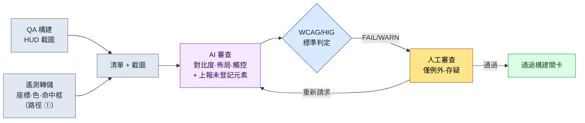

# 9.1 把 HUD 截圖掛到 lint 上 —— 讓 AI 抓出視線偏離與對比度不足的地方

> 首要讀者:負責 HUD·UI 的 UX 策劃（中等規模（10\~50 人）團隊）
> 面向個人/業餘讀者的精簡版:§9.1.8 「一個人的話,做到這些就夠」

在 QA 構建中把新的減益提示疊加到 HUD 上的那天,設計師說"看得很清楚",而第二天使用者論壇上就出現了"減益看不見,結果死了"。提示浮現在螢幕中央,灰底配上淺黃色文字。在設計師的顯示器上看得見,但在戰鬥中爆炸特效鋪滿螢幕的 6 英寸手機上卻看不見。問題在於,這並不是第一次。每一個構建、每一個畫面,同一類事故都以"這次應該沒事吧"反覆上演。

本章聚焦於打斷這種重複的一項工作。**它是一個 lint 關卡:接收一張完成的 HUD 截圖作為輸入,自動檢測 P0 元素是否偏離了視線所及的區域（頂部狀態列、兩側底部操作角）,以及文字對比度是否越過了可讀閾值。**優先順序表、視線流動、平臺分支這類 HUD 設計的通用原則,其他書裡已經講得足夠多,因此本章只把篇幅用在*讓這些原則在每次構建中自動強制生效的審查迴圈*上。關鍵在於,讓 AI 看著畫面,用座標和數字說出"這行字對比度只有 2.0:1,不到 WCAG 4.5:1",從而用程式碼和標準取代"我看著挺清楚啊"這種口舌之爭。

---

## 9.1.1 審查標準不是"感覺",而是公開標準

HUD 審查之所以每次都因人而異得出不同結論,是因為標準停留在"看得見/看不見"這種主觀判斷上。所幸,可讀性與無障礙的相當一部分,標準機構早已用數字釘死了。無需編造。

| 審查項 | 標準依據（出處） | 自動判定 |
|---|---|---|
| 普通文本對比度 | 4.5:1 以上（WCAG 2.1 SC 1.4.3） | 可以 —— 用前景·背景顏色值計算 |
| 大號文本（18pt+）對比度 | 3:1 以上（WCAG 2.1 SC 1.4.3） | 可以 |
| 非文本（圖示·計量條）對比度 | 3:1 以上（WCAG 2.1 SC 1.4.11） | 可以 |
| 觸控目標最小尺寸 | 44×44 pt（Apple HIG） / 48×48 dp（Material） | 可以 —— 按元素尺寸 |
| 拇指可達區域 | **橫握雙手操作**時,左·右底部角落為"易觸"（左拇指=移動,右拇指=技能）。業界通用的 thumb-zone 模型 | 部分 —— 按區域規則 |

只有最後一行（拇指可達區域）不是定量合格線,而是業界通用模型,上面四行則是 W3C·Apple·Google 公開的合格線。對比度尤其明確。WCAG 甚至公開了公式,要求用 `(L1+0.05)/(L2+0.05)` 計算兩種顏色的相對亮度。把灰色（#888）背景配淺黃（#D4C84A）文字的對比度代入這個公式,得出約 2.0:1 —— 不到 4.5:1,即標準上明確的不合格。這是"在設計師顯示器上看得見"這類反駁站不住腳的地方。

這裡先說清一件事。MMORPG·RPG 的手機畫面**以橫屏（landscape）為標準**。原因在於資訊量與操作。同樣的英寸數,橫握時一屏能容納的常駐資訊比豎屏多,而且雙手拇指可以同時操作左（移動）·右（技能）。豎屏單手握持適合休閒消除·放置類,但不適合同時資訊量大、需要雙手操作的 MMORPG。因此本章所有的視線·佈局判定都以橫屏雙手握持為前提。畫面分為:上方的橫向狀態列、左右兩個底部操作角、二者之間的中央遊戲區域,以及遊戲區域下方的中央底部槽位欄（消耗·自動道具·快捷槽）。

這五行,就是本章要交給 AI 的**審查規則手冊**。必須能說出"減益文字對比度 2.0:1,違反 SC 1.4.3",而不是"減益好像有點看不清",無論是人來審查還是 AI 來審查,才能得出相同的判定。

把平臺基準和 PC 並列起來,審查的出發點就清晰了。專案A 是移動優先 + PC 輔助,因此把兩套基準都放進規則手冊。

| 基準 | PC（輔助平臺） | 移動端（優先平臺,橫屏） |
|---|---|---|
| 畫面·輸入 | 27 英寸+ / 滑鼠 1px 精度·懸停·快捷鍵 | 6.x 英寸橫屏 / 雙手拇指,無懸停 |
| 同時常駐資訊 | 可承受 30\~50 種 | 12\~16 種為上限（作者推測,未經驗證） |
| 視線·操作可達 | 全屏（游標隨處可達） | 僅頂部狀態列 + 左·右底部角落 + 中央底部槽位欄為"易觸" |
| 精度 | 1px 點選 | 最小 44pt 觸控目標（HIG） |
| 核心審查風險 | 資訊過密導致的認知負荷 | 螢幕狹小 + 手指遮擋 + 中央被淹沒 |

PC 憑藉滑鼠精度·懸停提示·大螢幕,即使顯示大量資訊,視線與操作也夠得著。移動端因為橫屏比豎屏好一些,但裝不下 PC 那麼多,可點選元素被束縛在兩側拇指角上,又沒有懸停,因此 P0 資訊必須常駐顯示。所以移動端 HUD 審查的本質不是"好不好看",而是**"P0 是否位於視線所及之處（頂部·兩角）,文字是否越過標準對比度"**。讓這一判定不因人而異地用標準釘死,就是本章要做的事。

---

## 9.1.2 [實操記錄] 把一張 HUD 截圖掛到 lint 上

這裡完整演示實際執行的一個週期。下面忠實再現了作者專案（移動優先 MMORPG,下稱"專案A"）的一次戰鬥 HUD 審查會話——這種把真實操作過程完整保留下來的記錄,本書稱為"實操記錄（worked transcript）"。輸入提示詞可以直接複製使用,輸出則是對真實會話的重構。

### 第 1 步 —— 輸入:把截圖 + 元素清單一起丟過去

只丟截圖,AI 就會"猜測"畫面。因此把構建已經掌握的元素座標·顏色·分類,作為清單（manifest）一併放進去。這不是重新寫,而只需從構建產物中提取即可（提取方法的現實在 §9.1.4 中如實比較）。

```yaml
# hud_capture_manifest.yaml —— 隨 QA 構建截圖一併附上
screen: { w_pt: 844, h_pt: 390 }   # 6.x 英寸橫屏,pt 單位（橫握）
elements:
  - id: hp_bar        # 生命條
    class: P0
    rect_pt: [12, 18, 150, 16]      # x, y, w, h —— 頂部左側
    fg: "#FF5A5A"  ; bg: "#1A1A1A"
  - id: skill_slot_1  # 技能槽（右拇指）
    class: P0
    rect_pt: [760, 300, 40, 40]     # ← 右下角,注意尺寸
    fg: "#FFFFFF"  ; bg: "#202830"
  - id: debuff_alert  # 減益提示（昨天新增）
    class: P0
    rect_pt: [400, 180, 70, 24]     # ← 螢幕中央,注意位置
    fg: "#D4C84A"  ; bg: "#888888"   # ← 注意對比度
  - id: minimap
    class: P1
    rect_pt: [744, 20, 80, 80]       # 右上角
    fg: "#A0C0FF"  ; bg: "#101820"
```

### 第 2 步 —— 提示詞:讓它審查,但強制標準與格式

```
附上的截圖是專案A 的戰鬥 HUD（橫握雙手）,yaml 是該畫面各元素的座標·顏色·分類。請對照兩者進行審查。
對比度用 fg/bg 按 WCAG 計算,把數值也寫出來 —— 文本 4.5:1、圖示·大號字 3:1,不達標就判 FAIL。
P0 若偏離頂部狀態列或左·右底部角落、浮現在螢幕中央,就判 WARN（中央會被戰鬥特效淹沒）。
操作元素若小於 44pt,或超出拇指角·中央底部槽位欄,就判 FAIL。
清單裡沒有但畫面上能看到的,單獨上報;拿不準的,歸為"存疑"交給我。
只用表格給我（元素|檢查|測量值|判定|備註）,不要解釋。
// (意圖:P0=必須在 0.5 秒內找到的資訊 / 消耗·自動·快捷槽在中央底部才是正常的)
```

值得注意的是,比起審查規則本身,更多的行數花在了"如何輸出這些規則"上。給 AI 自由,它就會吐出"整體挺清爽的"這類恭維。因此要預先釘死**計算式（WCAG 對比度）、合格線（4.5:1·44pt）、輸出格式（表格）、必須標註測量值的義務,以及"拿不準就交給人"這一齣口**。這五顆釘子把恭維變成了測量值。

### 第 3 步 —— Claude 的輸出（重構,原始）

```
| 元素          | 檢查   | 測量值                    | 判定 | 備註                              |
|--------------|-------|--------------------------|------|----------------------------------|
| hp_bar       | 對比度 | #FF5A5A/#1A1A1A = 5.7:1   | PASS | 非文本計量條,滿足 3:1             |
| hp_bar       | 佈局   | 頂部左側 (12,18)          | PASS | P0 頂部狀態列                     |
| skill_slot_1 | 觸控   | 40×40 pt,右下角          | FAIL | 不到 HIG 44pt,差 4pt（角落 OK）  |
| skill_slot_1 | 佈局   | 右下 (760,300)            | PASS | 右拇指可達角                     |
| debuff_alert | 對比度 | #D4C84A/#888888 = 2.0:1   | FAIL | 普通文本不到 4.5:1（SC 1.4.3）   |
| debuff_alert | 佈局   | 螢幕中央部 (400,180)      | WARN | P0 卻在中央 —— 被戰鬥特效淹沒     |
| minimap      | 對比度 | #A0C0FF/#101820 = 9.8:1   | PASS |                                  |
| minimap      | 佈局   | 右上 (744,20)             | PASS | P1,允許置於頂部狀態列右側         |

追加上報:
- 清單裡是 4 種,但截圖左下角還能看到一個黃色閃爍圖示
  （座標估計 ~70,330）。疑似清單遺漏。（存疑 —— 僅憑畫面
  無法斷定是什麼元素）

小結:FAIL 2 件（skill_slot_1 觸控、debuff_alert 對比度）,WARN 1 件（debuff_alert
佈局）,存疑 1 件（未登記圖示）。
```

輸出中最有價值的部分不是合格/不合格的表格,而是**最下方的"追加上報"與"存疑"**。AI 在畫面上抓出了清單裡沒有的閃爍圖示,又把"它到底是什麼"這件自己無法斷定的事交給了人。好的提示詞,能讓 AI 說出"這個我不知道"。

### 第 4 步 —— 驗證與否決（人的位置）

不能照單全收這份輸出。AI 的審查本身,要由人再審查一遍。實際上在這次會話裡,就有一件被人推翻。

`debuff_alert` 的對比度 FAIL 和佈局 WARN 是對的。灰底淺黃正如 §9.1.1 所見,違反標準;把 P0 提示放在橫屏畫面中央,也是會被戰鬥特效淹沒的典型錯誤。到這裡為止 AI 是對的。

問題出在 `skill_slot_1` 的觸控 FAIL 上。AI 照單信了清單裡的 `40×40 pt`,判定為"不到 44pt";但在實際構建中,這個槽位視覺上是 40pt,而**觸控命中框四周各擴充套件了 6pt**,實際點選區域是 52pt。清單的 `rect_pt` 只裝了*繪製出來的矩形*,沒有裝*命中框* —— 也就是說,這是輸入資料的缺陷,而非 AI 的誤判。AI 在給定的資料範圍內判定得很準確（角落位置的判定是對的）,而人知道程式碼不瞭解的構建實情（命中框擴充套件）。這個 FAIL 由人駁回。

於是同時做兩件事。修改清單提取指令碼,讓它也提取命中框（修復資料缺陷）,並向 AI 重新發起請求。

```
skill_slot_1 視覺尺寸是 40pt,但命中框四周各擴充套件 6pt,實際點選區域是 52pt（已在清單里加了 hit_rect）。請按這個基準重新看觸控。
debuff_alert 的 FAIL/WARN 保持不變,請提出 3 組對比度超過 4.5:1 的配色（保留黃色系,背景調暗）。再給一個把它從中央移到頂部狀態列右側的座標。
```

AI 把 `skill_slot_1` 按命中框 52pt 基準更正為 PASS,併為減益的對比度返回了 3 套配色方案——把背景鋪成較暗的 #2A2A00、做出 7.8:1——以及把提示移到頂部狀態列右側（約 600,18）的座標。一次往返就結束了。**每次構建都靠肉眼掃一遍畫面,同樣的事故就會反覆發生;但把截圖+清單掛到 lint 上,對比度·佈局·觸控的違規就會落成數字,人只需判定程式碼不瞭解的例外（命中框）和存疑（未登記圖示）**（審查一屏,靠手要十幾分鍾,用這個迴圈只要幾分鐘 —— 作者推測,未經驗證的假設。與其看絕對時間,不如從"肉眼掃視"與"用標準測量"的結構差異去理解）。

---

## 9.1.3 橫屏 HUD 的視線·佈局 —— 為什麼中央是危險的

把上面那次會話中 `debuff_alert` 之所以得到 WARN 的原因,以及 P0 資訊應當放在哪裡,用一張圖留存下來,之後所有的佈局判定都會更快。橫握的手機上,畫面分為四處。**上方的橫向狀態列**（視線最先落到、手指不去的只讀區）,**左·右兩個底部角落**（雙手拇指可達的操作位 —— 左拇指=移動,右拇指=技能）,二者之間的**中央遊戲區域**（戰鬥發生的地方）,以及遊戲區域下方的**中央底部槽位欄**（放置消耗·自動道具和快捷槽·技能槽的地方）。下圖中,綠色·琥珀色是 P0 與槽位安全的區域,紅色是 P0 提示會被淹沒的遊戲中央。

<svg viewBox="0 0 660 340" xmlns="http://www.w3.org/2000/svg" role="img" aria-label="移動端橫屏 HUD 的視線區域與 P0/P1 佈局圖">
  <!-- 手機外框（橫向） -->
  <rect x="20" y="30" width="620" height="280" rx="30" ry="30" fill="#0f1117" stroke="#3a3f4b" stroke-width="3"/>
  <rect x="34" y="44" width="592" height="252" rx="14" ry="14" fill="#11151d"/>
  <!-- 頂部狀態 band（綠色 —— 視線第一優先,只讀） -->
  <rect x="34" y="44" width="592" height="56" fill="#14532d" opacity="0.55"/>
  <path d="M44 52 H616" fill="none" stroke="#22c55e" stroke-width="2.5" stroke-dasharray="6 4"/>
  <text x="330" y="92" fill="#bbf7d0" font-family="sans-serif" font-size="12" text-anchor="middle" font-weight="bold">上方橫向狀態列 —— 視線第一優先 (HP · MP · 目標,只讀)</text>
  <!-- 中央危險帶（紅色）:遊戲區域,放 P0 會被特效淹沒 -->
  <rect x="180" y="100" width="300" height="138" fill="#7f1d1d" opacity="0.4"/>
  <text x="330" y="158" fill="#fecaca" font-family="sans-serif" font-size="13" text-anchor="middle">中央 —— 遊戲區域（特效爆發）</text>
  <text x="330" y="178" fill="#fecaca" font-family="sans-serif" font-size="11" text-anchor="middle">放 P0 提示會被淹沒 —— debuff_alert 卡住的地方</text>
  <!-- 中央底部槽位欄（琥珀色 —— 消耗·快捷槽·自動,遊戲區域下方） -->
  <text x="330" y="240" fill="#b45309" font-family="sans-serif" font-size="11" text-anchor="middle" font-weight="bold">中央底部 —— 消耗·快捷槽·自動</text>
  <rect x="248" y="248" width="164" height="42" rx="8" fill="#f59e0b" opacity="0.5" stroke="#f59e0b" stroke-width="2" stroke-dasharray="5 4"/>
  <circle cx="298" cy="270" r="11" fill="#fbbf24"/><text x="298" y="274" fill="#000" font-size="8" text-anchor="middle">藥水</text>
  <circle cx="330" cy="270" r="11" fill="#fbbf24"/><text x="330" y="274" fill="#000" font-size="8" text-anchor="middle">自動</text>
  <circle cx="362" cy="270" r="11" fill="#fbbf24"/><text x="362" y="274" fill="#000" font-size="8" text-anchor="middle">槽位</text>
  <!-- 左下拇指角（綠色） -->
  <path d="M34 296 L34 146 A150 150 0 0 1 184 296 Z" fill="#14532d" opacity="0.7"/>
  <path d="M34 146 A150 150 0 0 1 184 296" fill="none" stroke="#22c55e" stroke-width="2.5" stroke-dasharray="5 4"/>
  <text x="92" y="254" fill="#bbf7d0" font-family="sans-serif" font-size="13" text-anchor="middle" font-weight="bold">左拇指</text>
  <text x="92" y="274" fill="#bbf7d0" font-family="sans-serif" font-size="12" text-anchor="middle">移動</text>
  <!-- 右下拇指角（綠色） -->
  <path d="M626 296 L626 146 A150 150 0 0 0 476 296 Z" fill="#14532d" opacity="0.7"/>
  <path d="M626 146 A150 150 0 0 0 476 296" fill="none" stroke="#22c55e" stroke-width="2.5" stroke-dasharray="5 4"/>
  <text x="568" y="254" fill="#bbf7d0" font-family="sans-serif" font-size="13" text-anchor="middle" font-weight="bold">右拇指</text>
  <text x="568" y="274" fill="#bbf7d0" font-family="sans-serif" font-size="12" text-anchor="middle">技能</text>
  <!-- 實際元素點 -->
  <rect x="60" y="60" width="60" height="10" rx="3" fill="#ef4444"/><text x="90" y="68" fill="#fff" font-size="8" text-anchor="middle">HP</text>
  <rect x="60" y="78" width="60" height="10" rx="3" fill="#3b82f6"/><text x="90" y="86" fill="#fff" font-size="8" text-anchor="middle">MP</text>
  <rect x="300" y="56" width="44" height="20" rx="4" fill="#0ea5e9" opacity="0.8"/><text x="322" y="70" fill="#fff" font-size="8" text-anchor="middle">目標</text>
  <rect x="560" y="54" width="48" height="40" rx="6" fill="#0ea5e9" opacity="0.7"/><text x="584" y="78" fill="#fff" font-size="8" text-anchor="middle">地圖 P1</text>
  <circle cx="330" cy="204" r="13" fill="#facc15" opacity="0.5"/><text x="330" y="208" fill="#000" font-size="6" text-anchor="middle">減益?</text>
  <circle cx="92" cy="220" r="17" fill="#22c55e"/><text x="92" y="224" fill="#000" font-size="9" text-anchor="middle">移動</text>
  <circle cx="556" cy="222" r="14" fill="#22c55e"/><text x="556" y="226" fill="#000" font-size="9" text-anchor="middle">技能</text>
  <circle cx="592" cy="210" r="13" fill="#22c55e"/><text x="592" y="214" fill="#000" font-size="9" text-anchor="middle">技能</text>
  <circle cx="600" cy="272" r="12" fill="#22c55e"/><text x="600" y="276" fill="#000" font-size="8" text-anchor="middle">技能</text>
</svg>

規則很簡單。**P0 資訊（HP·MP·核心提示）要放在綠色區域（上方橫向狀態列或兩側底部角落）之內。**因為那是視線最先落到、或拇指常駐的必經之處。相反,**遊戲中央（紅色）是戰鬥本身發生的地方**,在這裡放 P0 提示,特效鋪滿螢幕的那一刻資訊就會被淹沒。有一點要注意 —— 遊戲中央與**中央底部**是不同的。遊戲中央危險,但其下方的**中央底部槽位欄（琥珀色）是消耗·自動道具和快捷槽·技能槽棲身的地方**。為了一眼看到自己使用或自動消耗的東西,才把它放在兩拇指之間。此外,**只讀的資訊（HP/MP/目標血量）放在頂部**,**可點選元素（移動·技能）放在兩側底部角落**,**消耗·槽位放在中央底部** —— 這三者就是手指·視線的區域。§9.1.2 中減益提示之所以得到 WARN,用這張圖一張就能說明 —— 因為把必須在 0.5 秒內看到的 P0,偏偏放到了最看不見的遊戲中央。更正方案中把它移到頂部狀態列右側,正是把它送回了這張圖裡的綠色區域。

---

## 9.1.4 座標該怎麼提取 —— 實現的誠實

本章的 lint 建立在"各元素的座標·顏色"能幹淨地進來這一前提上。然而,這些座標*從哪裡、怎麼提取*,才是實際中最現實的分岔口。這是書裡常常含糊帶過的地方,所以這裡如實比較三條路徑。正確答案不止一個,會隨團隊情況而不同。

| 路徑 | 做什麼 | 優點 | 缺點 / 現實 |
|---|---|---|---|
| ① 遊戲內遙測（telemetry）日誌 | 由構建直接轉儲 UI 框架所繪製控制元件的座標·尺寸·顏色 | 座標**精確**（非估計）,連命中框·錨點都能拿到 | 需要在 UI 程式碼裡埋入轉儲鉤子。需要程式設計師協作。一旦鋪好,最為可信 |
| ② 現成的 vision API | 把截圖送入 OCR·目標檢測 API,提取文本·框的座標 | 無需修改構建,外部截圖也可以 | 座標是**近似值**,對計量條·圖示這類非文本的分類較弱。外傳 = 未公開構建的洩露風險 |
| ③ 自行實現（畫素分析） | 直接讀取截圖,用啟發式提取色彩邊界·框 | 依賴最少,用於色彩對比度計算已足夠 | 不知道元素的*含義*（它是不是 P0）。必須與清單對照才有用。有維護負擔 |

三條路徑的關係,恰好解釋了本章的實操記錄。§9.1.2 中,**對比度檢查之所以準確,是因為顏色值（fg/bg）通過①·③準確地進來了**;而**觸控 FAIL 之所以被人推翻,是因為命中框在清單裡缺失了**（②·③看不到命中框,只有①看得到）。也就是說,*對比度*僅憑畫素也能抓到,但*觸控命中框*沒有①遙測（telemetry）就抓不到。帶著對這一侷限的認識出發,才能劃清 AI 審查結果可信到什麼程度的那條線。

作者專案的選擇,是**以①遙測為正本,AI 則作為對照截圖+遙測清單的審查者**這樣一種結構。只在畫面上出現、而清單裡沒有的東西（§9.1.2 那個未登記的閃爍圖示）由 AI 抓,清單裡有、而畫面上對不上的東西由人抓。只靠其中之一,兩邊都會留下盲區。



人手觸及的只有兩處。把遙測轉儲乾淨地放進去的位置（最前）,以及判定程式碼·標準抓不住的例外（命中框）·存疑（未登記元素）的位置（最後）。中間那些枯燥的對比度計算與佈局對照,交給 AI 和標準去跑。

---

## 9.1.5 把規則手冊變成程式碼 —— 對比度·觸控·角落的自動關卡

AI 審查每次都重新算一遍,會耗費 token 和時間。像對比度·觸控·角落可達這類**能落到確定性上的專案,由程式碼先處理。**AI 只介入程式碼抓不住的部分（畫面語義解讀、未登記元素）。兩者不是競爭,而是分工。

```python
# hud_lint.py —— HUD 清單標準校驗（骨架）
# 輸入:遙測清單（每個元素的 rect/hit_rect/fg/bg/class/interactive）
# 輸出:WCAG/HIG + 雙手可達違規列表

def _luminance(hex_color):           # WCAG 相對亮度
    r, g, b = (int(hex_color[i:i+2], 16) / 255 for i in (1, 3, 5))
    f = lambda c: c/12.92 if c <= 0.03928 else ((c+0.055)/1.055) ** 2.4
    R, G, B = f(r), f(g), f(b)
    return 0.2126*R + 0.7152*G + 0.0722*B

def contrast_ratio(fg, bg):          # WCAG 明暗對比度
    L1, L2 = sorted((_luminance(fg), _luminance(bg)), reverse=True)
    return (L1 + 0.05) / (L2 + 0.05)

def in_thumb_corner(e, w, h):
    """是否為橫握時雙手拇指可達的左·右底部角落。"""
    x, y = e["hit_rect"][0] / w, e["hit_rect"][1] / h
    bottom = y > 0.55
    left_corner  = bottom and x < 0.30   # 左手拇指 = 移動
    right_corner = bottom and x > 0.70   # 右手拇指 = 技能
    return left_corner or right_corner

def lint(elements, screen_w, screen_h):
    issues = []
    for e in elements:
        # 規則 A:明暗對比度（文本 4.5:1 / 非文本·大號字 3:1）
        need = 4.5 if e["kind"] == "text" else 3.0
        cr = contrast_ratio(e["fg"], e["bg"])
        if cr < need:
            issues.append(f"[A] {e['id']}: 對比度 {cr:.1f}:1 < {need}:1 (WCAG SC 1.4.3)")
        # 規則 B:觸控目標 —— 以命中框為準（不是視覺尺寸）
        if e.get("interactive"):
            tap = min(e["hit_rect"][2], e["hit_rect"][3])   # ← 是 hit_rect 而非 rect
            if tap < 44:
                issues.append(f"[B] {e['id']}: 點選 {tap}pt < 44pt (HIG)")
            # 規則 C:操作元素應位於雙手拇指角（左·右底部）
            if not in_thumb_corner(e, screen_w, screen_h):
                issues.append(f"[C] {e['id']}: 操作元素被放在了雙手拇指角之外 "
                              f"(x={e['hit_rect'][0]}, y={e['hit_rect'][1]})")
    return issues
```

這段程式碼能終結會議上"這行字是不是有點看不清?"的口舌之爭。當代碼輸出 `[A] debuff_alert: 對比度 2.0:1 < 4.5:1 (WCAG SC 1.4.3)`,就沒什麼可爭的了。改就是了。值得注意的兩行:規則 B 看的是 `hit_rect` 而非 `rect`,以及規則 C 只讓操作元素從左·右兩個底部角落通過 —— §9.1.2 中人推翻 AI 的那條教訓（命中框）,和橫屏雙手握持的可達極限,一起進了程式碼。不是單一的"拇指弧"閾值,而是把左拇指（移動）·右拇指（技能）兩個角落分開來看,這才是橫屏判定的核心。人抓過一次的例外,從下次起由程式碼來抓。因此留給 AI 的只是一個狹窄的角色:"除了程式碼判為 PASS 的之外,上報只在畫面上出現的異常（未登記元素·視覺重疊·截斷）"。能靠確定性抓的交給程式碼,需要畫面語義解讀的交給 AI,瞭解構建實情的例外交給人 —— 這個分工才是核心。

---

## 9.1.6 本章數值的出處

本章出現的數值,出處只有三類。對比度 4.5:1·觸控 44pt·48dp 是 WCAG SC 1.4.3·HIG·Material 的官方值,#888 背景配 #D4C84A 文字約為 2.0:1,也是把顏色值代入該公式的計算值（§9.1.1·§9.1.5）。"審查一屏靠手要十幾分鍾、用迴圈只要幾分鐘"·"橫屏常駐資訊 12\~16 種"是未經驗證的作者推測,正文裡已如此註明。其餘的（各構建的對比度 FAIL 數、觸控命中框不達標數、拇指角偏離數、遙測誤觸率）都是能從構建日誌裡直接數出來的值。像使用者投訴數這類無法憑一個 HUD 斷定因果的結果指標,沒有列入 KPI。

---

## 9.1.7 常見的失敗

| 模式 | 為什麼失敗 | 處方 |
|---|---|---|
| 在設計師顯示器上肉眼審查 | 缺了 6 英寸·戰鬥特效的條件,對比度事故反覆 | 把截圖 lint 作為構建關卡（§9.1.2） |
| 只把截圖丟給 AI 說"幫我看看" | 靠猜測座標做近似判定,不可信 | 附上遙測清單（§9.1.4） |
| 用視覺尺寸判定觸控目標 | 漏了命中框擴充套件,把好端端的按鈕判成 FAIL | 以 `hit_rect` 為準檢查（§9.1.5） |
| 把 P0 提示放在螢幕中央 | 被戰鬥特效淹沒,"看不見結果死了" | 移到頂部狀態列·兩角（§9.1.3） |
| 把操作按鈕放在畫面左側中央·頂部 | 橫屏雙手握持時拇指夠不著 | 移到左·右底部角落（§9.1.5 規則 C） |
| 以豎屏單手握持為前提設計 | MMORPG 以橫屏雙手為標準,資訊·操作對不上 | 轉為橫屏雙手（§9.1.1） |
| 用"看得見/看不見"討論對比度 | 結論因人而異 | 改用 WCAG 4.5:1 的計算值（§9.1.1） |

第四個最常反覆出現。急著疊加新提示時,空位只剩畫面中央,就放那兒 —— 而那個中央恰恰是遊戲發生的地方。

---

## 9.1.8 動手試試 —— 今天就能做的一步

> **一個人的話,做到這些就夠**:沒有遙測、沒有清單也可以。給自己的遊戲（或喜歡的遊戲）拍一張橫屏 HUD 截圖,用取色器取出最小的兩三個文字·圖示的前景/背景色並手動記下,再貼上 §9.1.2 的提示詞跑一次。挑一個 AI 算出的對比度數值,用線上 WCAG 對比度計算器親手驗算一遍,你就會切身體會到"看得見/看不見"是如何變成數字的。如果 AI 把某個 P0 放在了畫面中央,不妨反駁它"再看看為什麼中央是危險的"。

如果是團隊,就從下面這一步開始。先和程式設計師就"從 UI 框架轉儲控制元件座標·色·命中框的遙測鉤子（路徑 ①）"達成一致,然後從 §9.1.5 的 `contrast_ratio` 這一個函式開始放進構建。對比度計算是標準公式,不會有異議,哪怕只有一個函式,每次構建的對比度 FAIL 也會落成數字。之後再疊上 `in_thumb_corner`,橫屏雙手操作元素的角落偏離也能由程式碼抓住。佈局·未登記元素這類解讀,在其上疊一層 AI 即可。

---

### 本章要點
- HUD 審查標準不是感覺,而是公開標準（WCAG 4.5:1·HIG 44pt）。
- 把截圖+遙測清單交給 AI,檢出對比度·佈局·未登記元素。
- 橫屏雙手握持時,可點選元素放兩側底部角落,只讀資訊放頂部狀態列 —— 中央會被淹沒。

### 下一章預告
- 9.2 技能槽是 4 列還是 8 列 —— 一個決定同時對認知·戰鬥·平臺·面積產生的影響,用測量來求解的案例
