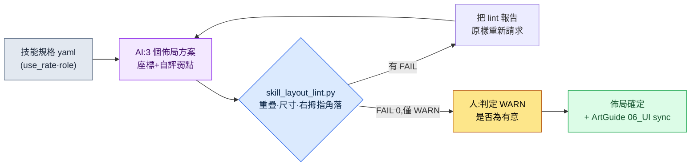

# 9.2 技能按鈕排布 —— AI 生成 3 個佈局方案,lint 負責淘汰

> 主要讀者:移動優先動作·MMORPG 的 UX·戰鬥策劃(中型團隊)
> 面向個人/業餘讀者的精簡版:§9.2.7「一個人的話,做到這一步就夠」

如何把新職業的 6 個技能擺到移動端螢幕的哪個位置、以什麼方式擺放。每當這個問題被擺上會議桌,最初的 30 分鐘總是如出一轍。有人在白板上畫出六個圓圈,另一個人說"那個位置拇指夠不到",又有人接話"那往上挪的話小地圖就被擋住了"。三個人說的都對,可結論一直沒出來。到了下一次會議,同一塊白板又被重畫一遍。

問題在於:畫布局草案這件事,和檢查這份草案是否遵守規則這件事,在同一個人的腦子裡混作一團。畫的人往往難以否決自己畫出來的東西。本章把這兩件事拆開。**畫多個佈局草案這種枯燥的活兒交給 AI,而草案是否違反了重疊·拇指角落·觸控尺寸規則,則由程式碼來淘汰。** 人只站在最後一個位置上——從程式碼放行的方案裡,憑"遊戲手感"挑出一個。如果說 9.1 立起了整個 HUD 的規則手冊,那麼本章就是把這份規則手冊,一直貫徹到技能按鈕——這個手指觸碰最頻繁的部件——上的一個完整迴圈。

---

## 9.2.1 技能按鈕為何棘手 —— 它不是"用來讀的資訊",而是"用來按的資訊"

HUD 上的大多數元素只是用來讀的。沒有人會去按 HP 條。所以在 §9.1 的拇指角落示意圖中,HP·MP·目標血量放在手指夠不到的頂部只讀區域也無妨。技能按鈕恰恰相反。它要以 0.1 秒為單位精準按下,而戰鬥中視線一直盯著敵人,手指是憑*記憶*去找位置的。位置只要稍有偏差,當場就會誤觸。

MMORPG 移動端以橫屏雙手握持為標準,需要按的元素放在左右兩個下角,消耗品/道具槽放在底部中央(為什麼橫屏是標準、這三個區域各是什麼,在 §9.1 中討論)。在這一標準下,技能幾乎全部鋪在**右手拇指夠得到的右下角簇**裡(左手拇指被繫結在左下角的移動上)。這裡做一個區分——以 0.1 秒為單位按下的主動技能落在這個右下角簇裡,而消耗品·自動道具·快捷槽則單獨放在兩個拇指之間的底部中央槽位帶上。本章只討論主動技能按鈕,所有座標判定都以橫屏雙手握持為前提。

因此技能按鈕的佈局同時被三條確定性規則繫結——最小觸控目標(HIG 44pt)、相鄰按鈕間距(Material 8dp)、拇指可達性(技能位於右拇指的右下角)。這三項都已寫在 §9.1.1 立起的規則手冊裡,是可以憑座標和尺寸判定的專案,因此公開標準的數值沿用那份規則手冊(觸控 44pt·間距 8dp 是公認數值,只有右拇指角落是業界通用模型)。這三項就成為本章淘汰 AI 佈局方案的**lint 的第一層輸入**。當代碼說的不是"這個按鈕是不是有點小?",而是"skill_3 是 40pt,不足 HIG 44pt"時,白板前的 30 分鐘就消失了。

把平臺基準與 PC 並排來看,佈局的出發點就清晰了。PC 是精密·大量,移動端橫屏則限於雙手角落(完整對比表見 §9.1 規則手冊)。單看技能輸入,差別很明顯——PC 用快捷鍵,技能無論擺在螢幕哪裡,手指都在鍵盤上,所以可達性不成問題,槽位也可以很多。移動端橫屏既沒有懸停也沒有快捷鍵,所以技能要按頻率鋪在**右拇指夠得到的右下角**(同屏最多 6\~8 個),並把最常用的技能放在角落內側(最容易夠到的位置)。因此移動端技能佈局的本質不是"好看的排布",而是**"在右拇指角落內按頻率做優先順序佈局 + 規則手冊驗收"**。而畫多個草案這件事,若由人手工來做,既枯燥又每次標準都會飄。枯燥又善變的重複勞動——正是 AI 比人更不知疲倦地完成的地方。

---

## 9.2.2 [實操記錄(worked transcript)] 新職業 6 個技能的佈局方案 —— 讓 AI 生成 3 個方案

本節從輸入到廢棄,完整展示把新職業"薩滿"的 6 個主動技能佈局到移動端的一個迴圈。以下內容忠實再現了作者專案(移動優先 MMORPG,下稱"專案A")的新技能 UI 工作會話。輸入與提示詞可以直接複製使用,輸出則是對真實會話的重構。

### 第 1 步 —— 輸入:把技能規格做成機器可讀的表

把 6 個技能的使用頻率與基本性質做成 yaml。使用頻率是從資料表的戰鬥日誌中提取的值,並非新編造出來的。

```yaml
# skill_set_shaman.yaml —— 新職業"薩滿"的 6 種主動技能
screen: { w: 2400, h: 1080, dpr: 3 }   # 以 6.x 英寸橫屏為準,pt = px / dpr
skills:
  - id: s1_quickbolt    # 基礎攻擊,最頻繁
    use_rate: 0.41      # 戰鬥中使用佔比(日誌提取)
    role: spam          # 連點
  - id: s2_hex          # 減益,頻繁
    use_rate: 0.22
    role: core
  - id: s3_totem        # 放置型,一般
    use_rate: 0.14
    role: core
  - id: s4_heal         # 治療,偶爾但緊急
    use_rate: 0.11
    role: panic         # 危急時立即
  - id: s5_curse        # 群體減益,偶爾
    use_rate: 0.08
    role: situational
  - id: s6_ultimate     # 終極技,罕用
    use_rate: 0.04
    role: burst
```

核心欄位是 `use_rate` 和 `role`。最常按的 `s1_quickbolt`(41%),以及危急時須在 0.2 秒內找到的 `s4_heal`(panic),必須放在右拇指最容易夠到的位置(右下角內側)。罕用的 `s6_ultimate`(4%)放在角落邊緣、稍遠一些也無妨。這一優先順序就是下一步 AI 佈局的全部輸入。

### 第 2 步 —— 提示詞:強制生成 3 個方案,並以數字形式接收座標

```
附件 yaml 是新職業的 6 種主動技能。請在橫屏雙手握持的畫面上做出 3 個技能按鈕佈局方案。技能鋪在右手拇指夠得到的右下角(左手被繫結在左下角的移動上)。
三個方案要用不同的理念——例如角落扇形、2 行網格、頻率加權式。每個按鈕給出 x,y,w,h(以 px 為單位,畫面 2400x1080,dpr 3,pt=px/3)。
常用或 role=panic 的技能放在右拇指容易夠到的角落內側,觸控目標不小於 132px(44pt),相鄰間距不小於 24px(8dp)。
每個方案務必一併寫上一行設計意圖和你自己看到的一個弱點——沒有弱點的方案不行。每個方案只給(排布理念|座標表|設計意圖|自評弱點),不要多餘說明。
```

在這段提示詞裡,比佈局指示更下功夫的地方,是強制規定輸出格式和弱點申報。座標不以數字形式接收就無法執行 lint,所以釘死了 px 輸出;同時要求一併給出"這個方案的 1 個弱點",讓 AI 先說出自己的侷限。若是隨意地說"幫我做個好看的 UI",出來的就是普通移動端 RPG 的平均佈局,而且沒有圖、只有文字描述。

### 第 3 步 —— Claude 的輸出(真實會話重構,節選)

```
== 方案 A:右下角扇形 ==
排布理念:以右拇指旋轉軸為中心,把 6 個按鈕排成扇形。按頻率由內向外。
| id          | x    | y   | w   | h   | pt   |
|-------------|------|-----|-----|-----|------|
| s1_quickbolt| 2160 | 912 | 168 | 168 | 56pt |
| s2_hex      | 2016 | 852 | 132 | 132 | 44pt |
| s3_totem    | 2052 | 996 | 132 | 132 | 44pt |
| s4_heal     | 1884 | 924 | 132 | 132 | 44pt |
| s5_curse    | 1920 | 780 | 120 | 120 | 40pt |
| s6_ultimate | 1788 | 840 | 120 | 120 | 40pt |
設計意圖:把常用的 s1 做成最大、最易夠到,放在右下角內側。
自評弱點:s5、s6 為 40pt,可能不足 HIG。扇形外側右拇指可達性模糊。

== 方案 B:2 行網格(2x3)==
排布理念:右下角 2 行 x 3 列網格。優先視覺對齊。
| id          | x    | y   | w   | h   |
|-------------|------|-----|-----|-----|
| s1_quickbolt| 2208 | 912 | 132 | 132 |
| s2_hex      | 2052 | 912 | 132 | 132 |
| s3_totem    | 1896 | 912 | 132 | 132 |
| s4_heal     | 2208 | 756 | 132 | 132 |
| s5_curse    | 2052 | 756 | 132 | 132 |
| s6_ultimate | 1896 | 756 | 132 | 132 |
設計意圖:所有按鈕同一尺寸,對齊整齊。
自評弱點:上排(s4、s5、s6,y=756)處於右拇指角落的上邊界,可達性模糊。
         緊急治療 s4 在上排,危急時可能找得慢。

== 方案 C:頻率加權扇形 ==
排布理念:s1 為中心大圓,其餘按頻率環繞在右拇指旋轉軸周圍。
| id          | x    | y   | w   | h   |
|-------------|------|-----|-----|-----|
| s1_quickbolt| 2184 | 900 | 180 | 180 |
| s2_hex      | 2028 | 852 | 144 | 144 |
| s3_totem    | 2052 | 996 | 132 | 132 |
| s4_heal     | 1908 | 912 | 144 | 144 |
| s5_curse    | 1932 | 792 | 120 | 120 |
| s6_ultimate | 1812 | 972 | 120 | 120 |
設計意圖:手自然落到 s1,把緊急的 s4 放大並放在角落內側。
自評弱點:因為是扇形,按鈕間距不均勻。s2-s5、s4-s6 有臨近衝突之虞。
```

三個方案都申報了自評弱點,這是這份輸出的核心。A 是"擔心不足 40pt",B 是"緊急治療在上排",C 是"擔心臨近衝突"。AI 先指出了自己所畫之圖的薄弱之處。但這只是自我申報,真正的判定由程式碼來做。

### 第 4 步 —— lint:程式碼淘汰三個方案

用眼睛比較三個方案,又會開始"B 看著更整齊吧"這類口味之爭。於是把三個方案原樣餵給 §9.2.3 的 `skill_layout_lint.py`。結果如下。

```
[方案 A] 右下角扇形
  [FAIL] B-size  : s5_curse 40pt < 44pt (不足 HIG)
  [FAIL] B-size  : s6_ultimate 40pt < 44pt (不足 HIG)
  [WARN] C-corner: s6_ultimate x=1788 —— 角落左邊界,右拇指可達"一般"
  → 通過 4/6,致命違規 2

[方案 B] 2 行網格(2x3)
  [FAIL] C-corner: s4_heal     y=756 (0.70h) 未低於 0.55h → 右拇指角落上方
  [FAIL] C-corner: s5_curse    y=756 (0.70h) 未低於 0.55h → 右拇指角落上方
  [WARN] role    : s4_heal(panic) y=756 —— 緊急技能在上排
  → 通過 4/6,致命違規 2

[方案 C] 頻率加權扇形
  [FAIL] A-overlap: s2_hex ∩ s5_curse 間距 18px < 24px (不足 8dp)
  [FAIL] A-overlap: s4_heal ∩ s6_ultimate 間距 12px < 24px (不足 8dp)
  → 通過 4/6,致命違規 2
```

三個方案全部被淘汰。有意思的是,自我申報與 lint 判定幾乎重合。AI 說是"弱點"的地方,實際就出了違規。但自我申報只是"擔心",而 lint 給的是"s2_hex 與 s5_curse 間距 18px"這樣的數字。會議上沒什麼可爭的。

這一步有一個重要決定。不要因為三個方案全被淘汰就回到起點。**把 lint 報告原樣貼進下一條提示詞,重新請求。**

### 第 5 步 —— 重新請求:把 lint 報告原樣喂進去

```
三個方案的 lint 結果原樣貼在這裡(上面的報告)。從中只挑違規最容易修的一個方案,只給出把 FAIL 全部變為 0 的一版修正方案。
所有按鈕都不小於 132px(44pt),間距不小於 24px(8dp),s4_heal(panic) 放在右拇指角落內、僅次於 s1 最容易夠到的位置。
只給座標表,並逐行寫明哪個 FAIL 是如何解決的。
// (意圖:角落內 = x>橫向70%(1680),y>縱向55%(594))
```

AI 選了方案 A(角落扇形)。因為它的違規只是"兩個按鈕尺寸不足",改動量最小。它給出的修正方案是:把因過小而被淘汰的 s5·s6 放大到 132px,並隨著尺寸變大把扇形曲線略微推向角落內側,以確保間距。

```
== 方案 A'(修正)==
| id          | x    | y   | w   | h   | pt   |
|-------------|------|-----|-----|-----|------|
| s1_quickbolt| 2160 | 900 | 168 | 168 | 56pt |
| s2_hex      | 2010 | 846 | 132 | 132 | 44pt |
| s3_totem    | 2046 | 990 | 132 | 132 | 44pt |
| s4_heal     | 1872 | 918 | 144 | 144 | 48pt |
| s5_curse    | 1908 | 774 | 132 | 132 | 44pt |
| s6_ultimate | 1740 | 858 | 132 | 132 | 44pt |
解決:B-size s5 40→44pt / B-size s6 40→44pt /
     C-corner s6 x=1740(0.725w)·y=858(0.79h) 保持在角落內側 →
     role: s4_heal 放大到 144px,強化緊急識別。
```

把方案 A' 再次餵給 `skill_layout_lint.py`。

```
[方案 A'] 右下角扇形(修正)
  [PASS] B-size  : 全部按鈕 ≥ 44pt
  [PASS] A-overlap: 最小間距 30px ≥ 24px
  [PASS] C-corner : 全部操作按鈕在右拇指角落內 (x≥1680, y≥594)
  [WARN] C-corner : s6_ultimate x=1740 —— 角落左端,可達"一般"
  → 通過 6/6,致命違規 0,WARN 1
```

FAIL 變成了 0。剩下的 1 條 WARN(`s6_ultimate` 在角落左端,右拇指可達不是"容易"而是"一般")程式碼不會自動扼殺,而是上交給人。而且這條 WARN 其實是**有意為之的設計**。s6 使用頻率 4%,是最罕用的終極技,所以角落最內側的位置應當讓給常用的 s1,把它放在邊緣才對。人判定"這條 WARN 是有意的"並放行。輸入 → 生成 3 個方案 → lint → 全軍覆沒 → 重新請求 → 通過的一個迴圈,在此閉合。

這一圈就是本章的 Show 標準。若不從頭到尾看清 AI 畫了什麼、lint 淘汰了什麼、人保住了哪條 WARN,"用 AI 生成了 UI 方案"這句話就是空的。

---

## 9.2.3 把 lint 寫成程式碼 —— 重疊·拇指角落·HIG 尺寸

上述迴圈的心臟,是淘汰三條規則的 30 餘行程式碼。§9.2.1 表中的三個專案原樣變成三個函式。

```python
# skill_layout_lint.py —— 技能按鈕排布驗證(骨架)
# 輸入:AI 給出的按鈕座標列表 [{id, x, y, w, h, role, use_rate}]
# 輸出:A-overlap / B-size / C-corner 違規列表
# 前提:橫屏雙手握持。技能鋪在右手拇指夠得到的右下角。

MIN_TAP_PX    = 132    # HIG 44pt * dpr 3 = 132px
MIN_GAP_PX    = 24     # Material 8dp * dpr 3 = 24px
RIGHT_CORNER_X = 0.70  # 螢幕橫向 0.70 右側 = 右拇指角落
BOTTOM_Y       = 0.55  # 螢幕縱向 0.55 下方 = 底部角落

def in_right_thumb_corner(b, w, h):
    """橫屏握持下,是否為右手拇指夠得到的右下角。
    (左手拇指=左下角移動,右手拇指=右下角技能)"""
    rx, ry = b["x"] / w, b["y"] / h
    return rx > RIGHT_CORNER_X and ry > BOTTOM_Y

def lint(buttons, screen_w, screen_h):
    issues = []
    # 規則 B: 觸控目標最小尺寸 (HIG 44pt)
    for b in buttons:
        side = min(b["w"], b["h"])
        if side < MIN_TAP_PX:
            issues.append(f"[FAIL] B-size : {b['id']} {side//3}pt "
                          f"< 44pt (不足 HIG)")
    # 規則 A: 相鄰按鈕重疊/間距 (最近兩條邊的距離)
    for i, a in enumerate(buttons):
        for c in buttons[i+1:]:
            gap = edge_gap(a, c)          # 兩個矩形的最短間距(px)
            if gap < MIN_GAP_PX:
                issues.append(f"[FAIL] A-overlap: {a['id']} ∩ {c['id']} "
                              f"間距 {gap}px < {MIN_GAP_PX}px (不足 8dp)")
    # 規則 C: 操作元素須在右拇指角落內。panic 越靠角落內側越好。
    for b in buttons:
        rx, ry = b["x"] / screen_w, b["y"] / screen_h
        if not in_right_thumb_corner(b, screen_w, screen_h):
            issues.append(f"[FAIL] C-corner: {b['id']} "
                          f"x={b['x']}({rx:.2f}w) y={b['y']}({ry:.2f}h) "
                          f"→ 右拇指角落外")
        elif b.get("role") == "panic" and rx < 0.78:
            issues.append(f"[WARN] role   : {b['id']}(panic) "
                          f"緊急技能靠近角落內側邊界")
    return issues
```

這段程式碼讓會議上"B 方案更好看啊"這種口味發言失效。好看是在 lint 放行之後才談的事。凡是被 lint 吐出 `[FAIL]` 的方案,好看與否都進不了構建。這是把 §9.1.1 立起的 HUD lint 關卡,徹底應用到技能按鈕這個最棘手的部件上——憑座標·尺寸可判定的交給程式碼,"這條 WARN 是不是有意的"這類判斷交給人的分工,在這裡同樣成立。

整個迴圈一目瞭然地看,就是下面這樣。



人經手的地方只有兩處。最前端——把輸入規格乾淨地放進去,以及最末端——判定 lint 殺不掉的 WARN。中間那些枯燥的 3 方案生成與座標檢查,由 AI 和 lint 來跑。

---

## 9.2.4 記錄通過率 —— 用數字看工具的效能

只生成一次佈局方案就收工,便無從知道這個工具運作得好不好。所以每一次都把 lint 結果記入日誌。記錄的值很簡單——**AI 給出的方案在第一次 lint 中通過了幾個(首次通過率),以及經過幾次重新請求達到 FAIL 0(往返次數)。**

下面的數值,是用這個迴圈制作 3 個新職業(薩滿外加 2 種)技能 UI 時親手計數的實測值。樣本僅 3 個職業(共 9 次佈局會話),很小,所以應當把它當作方向值而非精確的總體引數來讀。沒有任何加工過的數字。

| 專案 | 實測 | 備註 |
|---|---|---|
| AI 首個佈局方案中 lint 首次通過 | 9 次中 1 次 | 其餘 8 次有 1 個以上 FAIL |
| 首次通過時的平均 FAIL 數 | 每方案 1.8 件 | 大多是尺寸不足或在右拇指角落外 |
| 達到 FAIL 0 的平均往返 | 1.4 次 | lint 報告再投入方式 |
| 最常見的 FAIL 型別 | B-size(尺寸不足) | 其次是 C-corner(右拇指角落) |

最重要的一行是第一行。**AI 首次給出的方案,9 次裡有 8 次沒能通過 lint。** 這不是這個工具的失敗,而是正常運作的訊號。讓 AI 自由給出座標,它就常常違反 HIG 44pt。lint 每次都把它揪出來,再把報告回喂,1\~2 次往返就歸零。假如首次通過率是 100%,那意味著 lint 太鬆,而不是 AI 完美。

這份通過率日誌,也成為決定 lint 規則該收緊還是放鬆的依據。若某類 FAIL 每次都以"其實是有意的"為由被人放行,那這條規則就太嚴了。反過來,如果上線後收到誤觸投訴、而 lint 卻放行了,那就是規則太鬆。

---

## 9.2.5 把確定方案畫成圖 —— 按鈕排布 SVG

把 §9.2.2 中通過 lint 的方案 A' 按座標原樣畫出來,就是下圖。表裡的數字在真實畫面上是什麼形狀,得看圖才抓得住。橫屏手機雙手握持的姿勢下,左手拇指落在左下角(移動),右手拇指落在右下角(技能簇)。圓的大小與觸控目標(pt)成正比,顏色表示拇指可達難度(綠色容易 / 黃色一般)。

<svg viewBox="0 0 660 340" xmlns="http://www.w3.org/2000/svg" role="img" aria-label="주술사 스킬 6버튼 우하단 코너 클러스터 배치 확정안 SVG (가로 화면)">
  <!-- 폰 외곽 (가로) -->
  <rect x="20" y="30" width="620" height="280" rx="30" ry="30" fill="#0f1117" stroke="#3a3f4b" stroke-width="3"/>
  <rect x="34" y="44" width="592" height="252" rx="14" ry="14" fill="#11151d"/>
  <!-- 상단 상태 band (빨강 — 읽기 전용) -->
  <rect x="34" y="44" width="592" height="56" fill="#7f1d1d" opacity="0.42"/>
  <text x="330" y="92" fill="#fecaca" font-family="sans-serif" font-size="12" text-anchor="middle">頂部 —— 僅狀態顯示(HP · MP · 目標,只讀)</text>
  <!-- 중앙 게임 화면 -->
  <text x="300" y="190" fill="#5b6675" font-family="sans-serif" font-size="13" text-anchor="middle">遊戲畫面(戰鬥發生的地方)</text>
  <!-- 좌하단 엄지 코너 (초록, 이동) -->
  <path d="M34 296 L34 156 A140 140 0 0 1 174 296 Z" fill="#14532d" opacity="0.55"/>
  <path d="M34 156 A140 140 0 0 1 174 296" fill="none" stroke="#22c55e" stroke-width="2" stroke-dasharray="5 4" opacity="0.7"/>
  <circle cx="90" cy="240" r="18" fill="#166534" stroke="#22c55e" stroke-width="2"/>
  <text x="90" y="238" fill="#bbf7d0" font-size="9" text-anchor="middle" font-weight="bold">移動</text>
  <text x="90" y="249" fill="#86efac" font-size="6" text-anchor="middle">左拇指</text>
  <!-- 우하단 엄지 코너 (초록 점선 경계, 스킬 클러스터) -->
  <path d="M626 296 L626 156 A140 140 0 0 0 486 296 Z" fill="#14532d" opacity="0.30"/>
  <path d="M626 156 A140 140 0 0 0 486 296" fill="none" stroke="#22c55e" stroke-width="1.5" stroke-dasharray="5 4" opacity="0.7"/>
  <text x="556" y="138" fill="#86efac" font-family="sans-serif" font-size="10" text-anchor="middle">右拇指"容易"角落 ↘</text>
  <!-- 상단 읽기 정보 점 (참고) -->
  <circle cx="70" cy="72" r="8" fill="#7f1d1d"/><text x="70" y="76" fill="#fecaca" font-size="8" text-anchor="middle">HP</text>
  <circle cx="120" cy="72" r="8" fill="#7f1d1d"/><text x="120" y="76" fill="#fecaca" font-size="8" text-anchor="middle">MP</text>
  <circle cx="330" cy="68" r="8" fill="#7f1d1d"/><text x="330" y="72" fill="#fecaca" font-size="7" text-anchor="middle">目標</text>
  <circle cx="588" cy="72" r="8" fill="#7f1d1d"/><text x="588" y="76" fill="#fecaca" font-size="8" text-anchor="middle">地圖</text>
  <!-- 스킬 6버튼: 우하단 코너 클러스터. 크기=pt 비례, s1 최대 코너 안쪽 -->
  <!-- s1 56pt 최대 초록, 코너 가장 안쪽(우엄지 잘 닿음) -->
  <circle cx="590" cy="248" r="22" fill="#14532d" stroke="#22c55e" stroke-width="2.5"/>
  <text x="590" y="246" fill="#bbf7d0" font-size="10" text-anchor="middle" font-weight="bold">s1</text>
  <text x="590" y="257" fill="#86efac" font-size="7" text-anchor="middle">56pt</text>
  <!-- s2 44pt -->
  <circle cx="552" cy="234" r="17" fill="#166534" stroke="#22c55e" stroke-width="2"/>
  <text x="552" y="232" fill="#bbf7d0" font-size="9" text-anchor="middle">s2</text>
  <text x="552" y="242" fill="#86efac" font-size="6" text-anchor="middle">44</text>
  <!-- s3 44pt -->
  <circle cx="562" cy="276" r="17" fill="#166534" stroke="#22c55e" stroke-width="2"/>
  <text x="562" y="274" fill="#bbf7d0" font-size="9" text-anchor="middle">s3</text>
  <text x="562" y="284" fill="#86efac" font-size="6" text-anchor="middle">44</text>
  <!-- s4 heal 48pt, panic 강조 -->
  <circle cx="516" cy="256" r="19" fill="#166534" stroke="#facc15" stroke-width="3"/>
  <text x="516" y="254" fill="#fef08a" font-size="9" text-anchor="middle" font-weight="bold">s4</text>
  <text x="516" y="264" fill="#fde68a" font-size="6" text-anchor="middle">緊急</text>
  <!-- s5 44pt -->
  <circle cx="524" cy="218" r="17" fill="#166534" stroke="#22c55e" stroke-width="2"/>
  <text x="524" y="216" fill="#bbf7d0" font-size="9" text-anchor="middle">s5</text>
  <text x="524" y="226" fill="#86efac" font-size="6" text-anchor="middle">44</text>
  <!-- s6 44pt, WARN 노랑(보통), 코너 왼쪽 끝 -->
  <circle cx="486" cy="240" r="17" fill="#3f3f1a" stroke="#f59e0b" stroke-width="2.5"/>
  <text x="486" y="238" fill="#fde68a" font-size="9" text-anchor="middle">s6</text>
  <text x="486" y="248" fill="#fbbf24" font-size="6" text-anchor="middle">一般</text>
  <!-- 범례 -->
  <circle cx="70" cy="285" r="5" fill="#166534" stroke="#22c55e"/><text x="80" y="288" fill="#86efac" font-size="8" text-anchor="start">容易</text>
  <circle cx="150" cy="285" r="5" fill="#3f3f1a" stroke="#f59e0b"/><text x="160" y="288" fill="#fbbf24" font-size="8" text-anchor="start">一般(s6=罕用終極技,有意)</text>
</svg>

看圖就能一眼理解 lint 報告中最後那條 WARN。只有 `s6_ultimate`(黃色)位於右下角的左端,是右拇指可達"一般"的位置。但 s6 是使用頻率 4% 的終極技,放在角落邊緣才對。最常用的 s1(綠色,最大 56pt)放在右拇指最容易夠到的角落內側右下,緊急治療 s4(黃色邊框)則放大尺寸,好讓危急時手能快速找到。左手拇指被繫結在左下角的"移動"上,所以技能全部聚在右側角落。一張座標表與一張圖精確一致——這正是把座標以數字形式接收的原因。

---

## 9.2.6 常見失敗

| 模式 | 為何失敗 | 處方 |
|---|---|---|
| 只在白板上畫圓圈開會 | 沒有座標無法 lint,口味之爭反覆 | 以 px 接收座標餵給 lint(§9.2.2) |
| "AI 幫我做個好看的技能 UI"整包外包 | 沒有規則手冊就只是普通 RPG 平均佈局 | 3 方案+座標+自評弱點的強制提示詞 |
| 以豎屏單手握持為前提佈局 | MMORPG 以橫屏雙手為標準,技能在右拇指角落 | 以橫屏 2400x1080、右下角為基準做 lint |
| 只用眼睛比較佈局方案 | 每次都漏掉不足 HIG·重疊 | 用 `skill_layout_lint.py` 自動判定 |
| 首個方案通過 lint → 就安心以為工具做好了 | 可能是 lint 太鬆的訊號 | 用通過率日誌檢查規則收緊(§9.2.4) |
| 連 WARN 都由程式碼自動攔截 | 連有意的佈局(罕用終極技)也被殺掉 | WARN 交由人判定(§9.2.3) |

第五種最常被忽視。AI 首個方案每次都通過,心情固然好,但那通常意味著 lint 規則太鬆。9 次裡有 8 次被淘汰才是健康的狀態。

---

## 9.2.7 動手試試 —— 今天能做的一步

> **一個人的話,做到這一步就夠**:沒有 lint 程式碼也行。挑出你自己遊戲(或喜歡的遊戲)的 4\~6 個技能,按 §9.2.1 的格式手寫一份規格(use_rate 大致按頻率排序即可),把 §9.2.2 的提示詞原樣貼上,拿到 3 個方案。然後不用捲尺,只把"44pt = 132px"記在腦子裡,在 AI 給出的座標表中用手找出小於 132px 的按鈕並圈出來。再假設是橫屏,看看有沒有技能落在右下角(橫向 70% 右側 + 縱向 55% 下方)之外。這一次就會讓你親身體會 lint 在做什麼。

團隊的話,就從下面這一步開始。先把 §9.2.3 的 `skill_layout_lint.py` 三個函式(尺寸·間距·右拇指角落)用程式碼固定下來。三個函式就夠了。有了規則手冊,無論是 AI 佈局方案還是設計師草案,都能用同一條線來量,只有通過 lint 的方案才會流轉到美術團隊的 `96_ArtGuide/06_UI/`,經 `_convert_md_to_html.py` → `_SyncToArtRepo.bat` 路徑自動 sync。在確定座標抵達美術團隊之前,人的最後一件事,只是把某一條 WARN 判定為"有意"。

---

### 本章要點
- 技能按鈕是"用來按的資訊",座標只要錯一位就會誤觸。
- MMORPG 移動端是橫屏雙手握持——技能鋪在右拇指的右下角簇裡。
- AI 生成 3 個方案,lint 淘汰重疊·尺寸·右拇指角落(HIG 44pt)。
- AI 首個方案 9 次裡有 8 次被淘汰,才是健康 lint 的訊號。

### 下一章預告
- 9.3 ArtGuide/06_UI 協作 —— 把已確定的 UI 決策,通過 md→html 自動 sync 交給非策劃的美術團隊的協作標準
