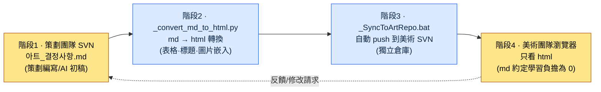

# 9.3 ArtGuide/06_UI 協作 —— 策劃用 md 寫，美術團隊只看 html

> 主要讀者：每天與非策劃職能（美術）協作的 UX·UI 策劃（中等規模團隊）
> 面向單人/業餘讀者的精簡版：§9.3.8「一個人的話，做到這些就夠」

策劃用 Markdown 把 UI 決定事項整理好，事情就會變得利落：能做版本管理，能看到 diff，還能原樣丟給 AI。問題在於美術團隊不讀 Markdown。更準確地說，他們沒有理由去讀。對美術設計師說"請從 SVN 拉取 `아트_결정사항.md` 來看"，一半人根本沒裝 SVN 客戶端，另一半人則對著在記事本里開啟、`##` 標題和表格語法全亂掉的畫面問"這個要怎麼看啊"。

這裡錯誤的處方是"教美術團隊用 Markdown"。美術設計師的時間應該花在推敲畫素上。花在學習 Markdown 約定、SVN 檢出、看 diff 上的時間全是損耗。正確的處方是**在策劃這一側把轉換與傳遞自動化，把美術團隊的學習負擔降到 0**。策劃用 md 寫，指令碼把它轉成 html，另一個指令碼再把它推送到美術倉庫，美術團隊在瀏覽器裡只看 html。本章會把這條流水線實際從頭到尾跑一遍 —— 從用 AI 生成決定事項初稿的環節，到轉換·傳遞的自動化，再到人工究竟拒絕了什麼。

---

## 9.3.1 協作真正崩掉的地方是"格式"

很多書把策劃與美術協作崩掉的原因歸結為"決策權模糊"：誰定顏色、誰定功能。這種分工固然重要，但無論把分工表畫得多好，**只要美術團隊讀不了這張分工表**，就什麼都不會發生。實務中更常出事的地方不是決策權，而是傳遞格式。

在筆者的專案（移動優先 MMORPG，下稱"專案A"）裡，實際反覆出現的事故是這樣的。

| 事故 | 表面原因 | 真正原因 |
|---|---|---|
| 美術拿舊版決定事項在做 | "沒拉到最新的" | 傳遞是手動（郵件附件），導致遺漏 |
| 決定事項表格顯示錯亂 | "這怎麼回事" | 用記事本打開了 md |
| "那個決定寫在哪兒？" | 口頭傳達 | 正本（canonical）散落在聊天裡 |

三起事故都不是決策權的問題。它們的根源在於**正本文件沒有以美術團隊能讀的格式、自動地、始終保持最新地傳遞過去**。所以本章的工具不是分工表，而是傳遞流水線。分工只要達成一次共識就完事，而傳遞在每次決定變化時都會發生。

先看實際的資料夾結構。專案A 的美術指南在 `workspace/96_ArtGuide/` 下分為 7 個領域。

```
96_ArtGuide/
├── 00_Common/      # 通用（風格·配色板·打光基準）
├── 01_Character/
├── 02_Animation/
├── 03_Monster/
├── 04_NPC/
├── 05_VFX/
├── 06_UI/          # ← 本章所講的領域
└── 07_Env/
```

另外，這個資料夾裡還放著兩個運維檔案：`_convert_md_to_html.py` 和 `_SyncToArtRepo.bat`。這兩個檔案就是本章的脊樑。

---

## 9.3.2 四階段同步流水線 —— 從策劃的 md 到美術團隊的瀏覽器

整個流程分為四個階段。關鍵在於**人（策劃）只碰階段1的 md，其餘三個階段全部由指令碼來跑**。美術團隊只看階段4的 html，甚至不需要知道 md 的存在。



下面逐一點明每個階段到底做什麼。

**階段1（策劃，人工）** —— 在 `06_UI/아트_결정사항.md` 裡用 Markdown 寫下決定事項。如何在這個環節嵌入 AI，是 §9.3.4 的脊樑。決定事項就是"按鈕 primary 顏色 #3A7BD5""觸控目標最小 44pt"這類條目。

**階段2（`_convert_md_to_html.py`，自動）** —— 把 md 轉換為 html。不是簡單轉換，而是把表格渲染得便於美術團隊閱讀，把 `` 圖片引用內聯嵌入，並加上目錄。產出的是美術設計師在瀏覽器裡雙擊一次就能開啟的自包含 html。

**階段3（`_SyncToArtRepo.bat`，自動）** —— 把轉換好的 html push 到**美術團隊獨立的 SVN 倉庫**。關鍵在於策劃倉庫和美術倉庫是分開的。美術團隊只看自己的倉庫即可，不需要了解策劃倉庫的許可權和結構。

**階段4（美術團隊，人工）** —— 美術設計師在瀏覽器裡開啟同步到自己倉庫的 html。既不用學 Markdown 語法，也不用學 SVN 命令，更不用學怎麼看 diff。**md 約定的學習負擔為 0**，這正是這條流水線的設計目標，也是它的成功標準。

反饋從階段4 回到階段1。美術說"這個決定怪怪的"，策劃就改 md，階段2\~3 又會自動跑一遍。美術只需要重新開啟更新後的 html 即可。

---

## 9.3.3 為什麼要把轉換·傳遞自動化 —— 學習負擔的不對稱

這裡先停一下，把設計意圖講明白。把 md 轉成 html 這件事本身微不足道。真正的設計在於決定了**誰來承擔誰的學習負擔**。

選項有兩條路。

<svg viewBox="0 0 640 300" xmlns="http://www.w3.org/2000/svg" role="img" aria-label="學習負擔分配的兩種方式對比 —— 美術團隊學 md 的方案 vs 策劃承擔自動化的方案">
  <!-- 左側：錯誤方案 -->
  <rect x="20" y="20" width="280" height="260" rx="10" fill="#1a1014" stroke="#7f1d1d" stroke-width="2"/>
  <text x="160" y="48" fill="#fecaca" font-family="sans-serif" font-size="15" text-anchor="middle" font-weight="bold">方案 A —— 美術團隊學 md</text>
  <rect x="50" y="70" width="100" height="44" rx="6" fill="#3a1518" stroke="#b91c1c"/>
  <text x="100" y="97" fill="#fca5a5" font-family="sans-serif" font-size="12" text-anchor="middle">策劃</text>
  <text x="100" y="135" fill="#fca5a5" font-family="sans-serif" font-size="11" text-anchor="middle">只寫 md</text>
  <line x1="150" y1="92" x2="190" y2="92" stroke="#b91c1c" stroke-width="2" marker-end="url(#arrowR)"/>
  <rect x="190" y="70" width="100" height="44" rx="6" fill="#3a1518" stroke="#b91c1c"/>
  <text x="240" y="91" fill="#fca5a5" font-family="sans-serif" font-size="12" text-anchor="middle">美術 5 人</text>
  <text x="240" y="107" fill="#fca5a5" font-family="sans-serif" font-size="10" text-anchor="middle">×SVN·md 學習</text>
  <text x="160" y="170" fill="#fda4af" font-family="sans-serif" font-size="11" text-anchor="middle">學習成本 = 1 次編寫 ×</text>
  <text x="160" y="188" fill="#fda4af" font-family="sans-serif" font-size="11" text-anchor="middle">乘以美術人數</text>
  <text x="160" y="222" fill="#f87171" font-family="sans-serif" font-size="12" text-anchor="middle" font-weight="bold">負擔蠶食畫素作業時間</text>
  <text x="160" y="240" fill="#f87171" font-family="sans-serif" font-size="12" text-anchor="middle" font-weight="bold">→ 最終被棄用</text>
  <!-- 右側：採納方案 -->
  <rect x="340" y="20" width="280" height="260" rx="10" fill="#0d1512" stroke="#15803d" stroke-width="2"/>
  <text x="480" y="48" fill="#bbf7d0" font-family="sans-serif" font-size="15" text-anchor="middle" font-weight="bold">方案 B —— 策劃做自動化</text>
  <rect x="370" y="70" width="100" height="44" rx="6" fill="#0f2417" stroke="#16a34a"/>
  <text x="420" y="91" fill="#86efac" font-family="sans-serif" font-size="12" text-anchor="middle">策劃</text>
  <text x="420" y="107" fill="#86efac" font-family="sans-serif" font-size="10" text-anchor="middle">md+指令碼 1 次</text>
  <line x1="470" y1="92" x2="510" y2="92" stroke="#16a34a" stroke-width="2" marker-end="url(#arrowG)"/>
  <rect x="510" y="70" width="100" height="44" rx="6" fill="#0f2417" stroke="#16a34a"/>
  <text x="560" y="91" fill="#86efac" font-family="sans-serif" font-size="12" text-anchor="middle">美術 5 人</text>
  <text x="560" y="107" fill="#86efac" font-family="sans-serif" font-size="10" text-anchor="middle">html 雙擊</text>
  <text x="480" y="170" fill="#86efac" font-family="sans-serif" font-size="11" text-anchor="middle">學習成本 = 策劃 1 次</text>
  <text x="480" y="188" fill="#86efac" font-family="sans-serif" font-size="11" text-anchor="middle">(美術負擔為 0)</text>
  <text x="480" y="222" fill="#4ade80" font-family="sans-serif" font-size="12" text-anchor="middle" font-weight="bold">美術只專注於畫素</text>
  <text x="480" y="240" fill="#4ade80" font-family="sans-serif" font-size="12" text-anchor="middle" font-weight="bold">→ 得以持續</text>
  <defs>
    <marker id="arrowR" markerWidth="8" markerHeight="8" refX="6" refY="3" orient="auto"><path d="M0,0 L6,3 L0,6 Z" fill="#b91c1c"/></marker>
    <marker id="arrowG" markerWidth="8" markerHeight="8" refX="6" refY="3" orient="auto"><path d="M0,0 L6,3 L0,6 Z" fill="#16a34a"/></marker>
  </defs>
</svg>

關鍵在於不對稱。方案 A 的學習成本要乘以美術人數，而且每來一名新人就重複發生一次。方案 B 裡策劃只要寫一次指令碼就完事，美術一側的邊際成本為 0。**把負擔壓給能自動化的一側，而不是人多的一側** —— 這就是非策劃職能協作工具的第一原則。一旦這條原則被打破，也就是協作工具強迫對方職能去學新東西，那麼這個工具在一兩個季度內就會"沒人用"。

---

## 9.3.4 [實操記錄（worked transcript）] 用 AI 生成 UI 決定事項的 md 初稿

前面說階段1 由策劃來寫 md，這裡把用 AI 生成這份 md 初稿的環節完整走一個迴圈。決策會議結束後，會留下零散的記錄（聊天·白板照片·口頭共識）。把這些整理成正本的決定事項 md 很枯燥，而且每次格式都會走樣。這正是最適合交給 AI 的活兒。不過，**決定本身由人來做，AI 只負責把決定整理成既定格式** —— 這條邊界是關鍵。

### 第 1 步 —— 輸入：原始會議記錄

```
[UI 決策會議記錄 —— 關於 06_UI 技能槽，原始未整理]
- 說要把技能槽按鈕尺寸調大。因為在移動端太小了。
- 顏色由美術來定。不過 primary 色調保持藍色系。
- 槽位停用（冷卻）狀態的表現，商定為灰色+數字疊加。
- 多語言……技能名變長怎麼辦？暫時擱置。
- 啊，還有長按彈出技能說明（這是功能，策劃已確定）。
```

### 第 2 步 —— 提示詞：強制區分決定/擱置/責任方

```
附件是 UI 決策會議的原始記錄。請整理成要交給美術團隊的決定事項 Markdown。
把每一項分類為 [確定]/[擱置]/[美術決定]（確定=策劃拍板、美術照做；擱置=未決+原因；美術決定=屬於視覺表現由美術定、策劃只給約束），並各附一行依據/約束 —— 如果記錄裡沒有依據，就如實寫成"依據未記載"，不要用猜測來填。
像觸控尺寸這種能用公開標準驗證的，要註明標準；記錄裡沒有的專案，絕對不要新編造。
表格用 |專案|分類|決定/約束|依據|是否可驗證|，幷包含 frontmatter（title、layer: L1），給出完整全文。
```

這段提示詞的重心不在整理本身，而在於強制分類和禁止編造。讓 AI 整理決定事項時，它會熱心地把記錄裡沒有的"最佳實踐"補進來，而這些補充在美術團隊看來就成了"策劃已敲定的決定"。所以要釘下三根釘子：**[確定]/[擱置]/[美術決定] 分類、依據義務，以及"記錄裡沒有就不要編造"**。

### 第 3 步 —— Claude 的原始輸出（真實會話還原）

```markdown
---
title: 06_UI 決定事項 —— 技能槽
layer: L1
---

# 06_UI 決定事項 —— 技能槽

| 專案 | 分類 | 決定/約束 | 依據 | 可驗證 |
|---|---|---|---|---|
| 技能槽按鈕尺寸 | [確定] | 最小 44×44 pt 以上 | 移動端觸控目標，Apple HIG 建議 44pt | ✅ 座標·尺寸 |
| primary 色調 | [美術決定] | 保持藍色系（約束），精確值由美術定 | 記錄："primary 色調保持藍色系" | △ 顏色值 |
| 冷卻狀態表現 | [確定] | 灰色疊加 + 剩餘數字 | 會議商定 | ◯ 視覺評審 |
| 技能名多語言長度 | [擱置] | 後續會議 | 記錄："暫時擱置" —— 長文本語言（德·俄）未做驗證 | — |
| 長按技能說明 | [確定] | 長按 → 顯示工具提示 | 功能確定（策劃領域） | ◯ 行為評審 |
| 槽位間距 | [確定] | 建議最小 8 dp | 依據未記載 —— 記錄裡沒有，參考 Material 建議值 | ✅ |
```

### 第 4 步 —— 驗證與拒絕（人工的環節）

這份輸出不能原樣當作正本上傳。有一行有問題。

就是最後一行 `槽位間距 | 最小 8 dp`。回頭再看記錄，會議裡**根本沒提過**間距。是 AI 自己判斷"既然是移動端 UI，總該有個間距標準吧"，於是熱心地把 Material Design 的建議值加了進來。這違反了規則 5（"禁止編造記錄裡沒有的專案"）。AI 雖然如實標註了 `依據未記載`，但根本就不該造出這個條目本身。這一行一旦到了美術團隊手裡，就會被讀成"策劃已敲定 8dp 間距"。

於是重新提出請求。

```
"槽位間距"在會議記錄裡沒有，是你加上去的。請從表格裡刪掉。
記錄裡沒有但看起來需要決策的，不要放進表格，只作為候選列到最下面的"## 未決 —— 下次會議議題"；決定事項表裡只保留記錄中實際有的專案。
```

AI 把間距條目從表格裡刪掉，並在最下面把"下次會議議題：槽位間距標準（目前未定）、多語言技能名長度處理"單獨分離為候選。現在決定事項表裡只剩下會議上真正定下的內容，而 AI 想到的合理候選則從"確定"降級為"議題"。這一分離之所以重要，是因為美術團隊拿到的文件裡**一旦混淆了什麼是確定、什麼還在討論，美術就會把未定事項當作確定去開工**。

經過這一次往返，階段1（md）就完成了。現在它離開人的手，進入階段2\~3 的自動化。

---

## 9.3.5 階段2\~3 自動化 —— 轉換與傳遞不經人手

完成的 md 現在交給指令碼處理。轉換指令碼的骨架很簡單。

```python
# _convert_md_to_html.py (骨架)
# 輸入：06_UI/*.md (策劃編寫的決定事項)
# 輸出：同名的 .html (美術團隊在瀏覽器中開啟的自包含檔案)

def convert(md_path):
    md_text = read(md_path)
    front, body = split_frontmatter(md_text)          # 提取 title·layer
    html_body = markdown_to_html(body, extensions=[
        "tables",        # 表格渲染 (解決美術在記事本里看到的錯亂表格)
        "fenced_code",
    ])
    html_body = embed_images_inline(html_body, base_dir=md_path.parent)
    # ↑ 將  這類引用內聯嵌入 →
    #   美術無需另外獲取圖片檔案
    toc = build_toc(html_body)                         # 自動生成目錄
    return render_template(title=front["title"], toc=toc, body=html_body)
```

這裡的關鍵是，轉換不是簡單的 md→html，它還多做了三件事：**把表格正確渲染**（美術在記事本里看到的錯亂 `|---|` 消失了）、**把圖片內聯嵌入**（美術不必另外獲取圖片檔案）、**自動加上目錄**（決定事項再長，美術也能跳到想看的條目）。正是這三件事，讓"只看 html 就行"真正成立。

傳遞指令碼則是這樣組織的。

```bat
REM _SyncToArtRepo.bat (骨架)
REM 1) 將 06_UI 的所有 md 轉換為 html
python _convert_md_to_html.py 06_UI\*.md

REM 2) 把轉換好的 html 複製到美術 SVN 工作副本
xcopy 06_UI\*.html %ART_REPO%\UI\ /Y

REM 3) 自動提交·push 到美術 SVN (獨立倉庫)
svn add %ART_REPO%\UI\*.html --force
svn commit %ART_REPO%\UI -m "[auto] 06_UI 決定事項更新"
```

策劃要做的只是雙擊一次 `_SyncToArtRepo.bat`（或者掛一個鉤子，讓它在提交決定事項時自動執行）。這樣，轉換·複製·推送到美術倉庫就會一次跑完。美術團隊更新自己的倉庫，最新的 html 就已經到位了。

> **AI 能介入到哪一步** —— 這段階段2\~3 的自動化程式碼，完全可以讓 AI 來寫。"寫一個指令碼，接收 md 資料夾，轉換成含表格·圖片的 html，再 push 到獨立 SVN"，這是 AI 擅長的領域。然而**哪個決定要定為確定、什麼要交給美術決定**（§9.3.4），不會委託給 AI。程式碼交給 AI，決定交給人 —— 全書反覆出現的這條分工，在這裡同樣適用。

---

## 9.3.6 圖片提示詞也要先寫"設計意圖"

在美術協作中，AI 被用錯的典型例子就是圖片提示詞。策劃給美術團隊提供參考圖、或者想快速把概念視覺化時，會用影像生成 AI。此時常見的失誤，是一上來就寫結果描述（"藍色圓角按鈕、發光效果、4K"）。

筆者的協作原則之一是 `image_prompt_design_intent_first` —— **圖片提示詞也不要先寫結果描述，而要先寫設計意圖**。

| 方式 | 提示詞 | 問題/效果 |
|---|---|---|
| 結果優先（差） | "藍色圓角按鈕、發光、4K、遊戲 UI" | 美術無法追問"為什麼是藍色？"。意圖蒸發 |
| 意圖優先（好） | "直觀傳達技能可用/冷卻狀態的技能按鈕。可用=讓人想立刻按下的視覺吸引力，冷卻=抑制。色調為 primary 藍色系" | 美術看到意圖後，可以反向提出更好的視覺方案 |

區別在於美術團隊拿到提示詞後能做什麼。只拿到結果描述，美術要麼照著畫，要麼無視，二選一。**拿到設計意圖，美術就能提出一個把這個意圖解得更好的自己的視覺方案。**這正是策劃在不侵犯美術決定領域（§9.3.4 的 [美術決定]）的前提下，還能給出方向的方法。策劃給出"為了什麼"，美術決定"看起來怎樣"。

所以，在 §9.3.4 的決定事項 md 裡放圖片參考時，圖注也不寫"藍色按鈕"，而寫"以區分冷卻狀態為目的的槽位 —— 精確表現由美術決定"。轉換指令碼會把這條圖注連同圖片一起嵌入 html，於是美術會同時拿到圖片和意圖。

---

## 9.3.7 度量 —— 什麼是能誠實計數的

有一種誘惑，想把這條流水線的效果寫成"協作事故減少了 70%"之類的數字。這種數值一旦沒經過驗證，就會削弱本書的可信度。誠實地做個區分。

**可用公開標準驗證的** —— 決定事項裡出現的觸控 44pt·間距 8dp·對比度 4.5:1 這類公開標準，遵循 §9.1 的規則手冊。它們不是編造的數值，而是可以原樣引用、並用 lint 自動驗證的值。

**可度量的運營指標** —— 這條流水線實際能計數的是這些：美術拿舊版開工的事故數（傳遞若是自動的則收斂到 0）、美術團隊新人第一次開啟決定事項所花的時間（雙擊 html 的話是分鐘級）、決定變更反映到美術倉庫的延遲（指令碼執行時間）。這三項不是"感覺"，而是能用日誌·觀測來計數的。

**筆者的推測（未經驗證的假設）** —— "比手動郵件傳遞時遺漏更少"這個方向是明確的，但由於沒有另外記錄樣本，精確的下降率不做斷言。與其看絕對值，不如按**方向**來讀：傳遞若掌握在人手裡，忙碌的一週必定會出現遺漏；傳遞若是指令碼，遺漏就會在結構上消失。

---

## 9.3.8 動手試試 —— 今天就能做的一步

> **一個人的話，做到這些就夠**：沒有美術團隊、沒有 SVN 也沒關係。假設你要把 UI 決定傳給你委託的外包美術，或者一起協作的朋友。照搬 §9.3.4 的提示詞，用 AI 生成一張 md —— 把腦子裡零散的 UI 決定分類為 [確定]/[擱置]/[美術決定]。然後從中找出一條 AI"熱心補進來"的專案（記錄裡原本沒有的），反駁它一句"這個我沒定過，刪掉"，你就能親身體會到，在整理決定這件事上，人和 AI 的邊界到底在哪。轉換隻需 `markdown` 包的一行 `python -m markdown decision.md > decision.html` 就足夠。

如果是團隊，就從下面這一步開始。別一上來就寫宏大的雙向同步，而是先放進**一行轉換 + 一行傳遞**：一個把決定事項 md 轉成 html 的轉換指令碼（只做 §9.3.5 裡的表格渲染·圖片嵌入），外加一行把這個 html 複製到美術能看到的位置（無論是共享盤還是獨立倉庫）。哪怕只有這兩行，"美術在記事本里看 md 撞上錯亂表格"這一最常見的事故也會消失。分工表·決策權的梳理，是再往後的事。

用 setup → prompt → verify 概括，就是這樣。

| 步驟 | 要做的事 |
|---|---|
| setup | 先放進 `_convert_md_to_html.py`（轉換）+ 一行傳遞（複製/push） |
| prompt | 用 §9.3.4 的提示詞，把會議記錄整理成 [確定]/[擱置]/[美術決定] 的 md |
| verify | 拒絕 AI 編造的專案（記錄裡沒有的）→ 自動執行轉換·傳遞 → 美術只確認 html |

---

### 本章要點
- 協作真正崩掉的地方不是決策權，而是傳遞格式。
- 策劃用 md 寫，指令碼以 html 傳遞 —— 美術學習負擔為 0。
- 決定整理用 AI 初稿，拒絕編造專案靠人 —— 程式碼交給 AI，決定交給人。

### 下一章預告
- 10.1 integrity_check atom 綜合 —— 把 UI 驗證擴充套件為整個遊戲資料的驗證。
