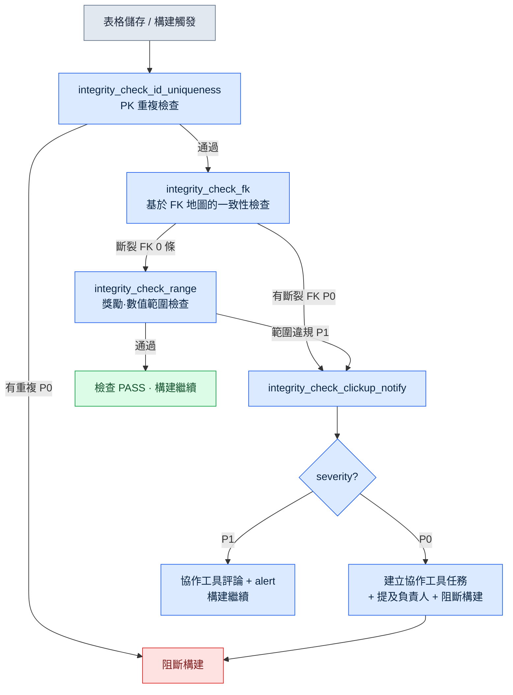

# 10.1 一致性校驗 atom —— 守護 30 張表 FK 的 cascade

週五晚上 6 點 40 分。那天定下要在下週一的公司內部構建裡新加入 12 種任務。我在 `quest_table` 裡追加新行,在獎勵表裡填上對應的行,又在對話表裡把 NPC 臺詞接上。三張表,約 50 行。我用眼睛掃了兩遍,看上去沒有問題。

週一早上,構建掛了。新任務中有一條所引用的 `reward_id` 在獎勵表裡並不存在。週五晚上我把一行獎勵刪掉後又重新加了回來,過程中把 id 敲錯了一個字元——把 `rwd_q318` 敲成了 `rwd_q381`。這是一種人眼絕對抓不住的筆誤。兩張表位於不同的資料夾,由不同的人、在不同的時間去改動。行數只有 50 的時候,眼睛還抓得住。可一旦超過 30 張表開始通過外部索引鍵(FK)互相引用,人的眼睛就不再是一件檢查工具了。

本章要展示的,是一種能在構建掛掉之前抓住這個筆誤的檢查 atom——`integrity_check_fk`——它如何校驗 30 多張表的 FK 一致性,並在出現斷裂時,通過協作工具(一種管理任務與日程的 SaaS——本專案使用 ClickUp,JIRA、Redmine 也是同一類)通知到負責人;我會沿著自己實際跑過的一個會話,把這個流程呈現出來。

我進入這個行業,起點正是從別人做好的東西里找出錯位的那一行。單機遊戲的 QA 與驗收是我的第一份工作,那時手和眼睛是唯一的檢查工具。二十多年過去,如今我把同樣的活兒交給了程式碼——就在人眼不再充當檢查工具的那個位置上。

---

## 10.1.1 檢查該抓住什麼 —— FK 斷裂的結構

先用圖來看清楚檢查的是什麼。遊戲資料表就如同關係型資料庫。一張表的列指向另一張表的主鍵。一旦這根箭頭斷掉,執行時遊戲要麼崩潰,要麼更糟——悄無聲息地顯示一個空值。

<svg viewBox="0 0 640 260" xmlns="http://www.w3.org/2000/svg" font-family="sans-serif" font-size="13">
  <rect x="20" y="30" width="150" height="90" rx="6" fill="#eef4ff" stroke="#3b6fb6" stroke-width="1.5"/>
  <text x="95" y="50" text-anchor="middle" font-weight="bold">quest_table</text>
  <line x1="20" y1="60" x2="170" y2="60" stroke="#3b6fb6"/>
  <text x="32" y="78">quest_id (PK)</text>
  <text x="32" y="98" fill="#c0392b">reward_id (FK)</text>
  <text x="32" y="116" fill="#c0392b">npc_id (FK)</text>

  <rect x="250" y="20" width="150" height="60" rx="6" fill="#eafbe7" stroke="#3a9d3a" stroke-width="1.5"/>
  <text x="325" y="40" text-anchor="middle" font-weight="bold">reward_table</text>
  <line x1="250" y1="50" x2="400" y2="50" stroke="#3a9d3a"/>
  <text x="262" y="68">reward_id (PK)</text>

  <rect x="250" y="150" width="150" height="60" rx="6" fill="#eafbe7" stroke="#3a9d3a" stroke-width="1.5"/>
  <text x="325" y="170" text-anchor="middle" font-weight="bold">npc_table</text>
  <line x1="250" y1="180" x2="400" y2="180" stroke="#3a9d3a"/>
  <text x="262" y="198">npc_id (PK)</text>

  <line x1="170" y1="93" x2="250" y2="55" stroke="#3a9d3a" stroke-width="2" marker-end="url(#ok)"/>
  <line x1="170" y1="111" x2="250" y2="175" stroke="#c0392b" stroke-width="2" stroke-dasharray="6 4" marker-end="url(#bad)"/>
  <text x="430" y="120" fill="#c0392b" font-weight="bold">npc_id 'npc_307' →</text>
  <text x="430" y="140" fill="#c0392b">npc_table 中不存在(斷裂的 FK)</text>

  <defs>
    <marker id="ok" markerWidth="8" markerHeight="8" refX="6" refY="4" orient="auto"><path d="M0,0 L8,4 L0,8 Z" fill="#3a9d3a"/></marker>
    <marker id="bad" markerWidth="8" markerHeight="8" refX="6" refY="4" orient="auto"><path d="M0,0 L8,4 L0,8 Z" fill="#c0392b"/></marker>
  </defs>
</svg>

綠色實線是活著的引用:`quest_table.reward_id` 指向的值在 `reward_table.reward_id` 中確實存在。紅色虛線是死掉的引用——某條任務的 `npc_id` 指向了一個 `npc_table` 中並不存在的 id。`integrity_check_fk` 要抓的正是這根紅色虛線。

專案A的資料表裡,這樣的引用絕不止一兩個。30 多張表彼此指向,若把 FK 箭頭全畫出來,一頁紙都裝不下。讓人每次都用手去逐一追蹤,是不可能的。

---

## 10.1.2 一個會話 —— 檢查抓住斷裂 FK 的全過程

從這裡開始,是我實際跑過的一個會話。我不做概括,而是把提示詞全文、原始輸出,以及我否決並重新要求的部分,都原樣記錄下來。

### 第 1 步 —— 讀取表格,讓它提取 FK 候選

我先讓檢查器做出一張"哪個列指向哪張表"的 FK 地圖。讓人把 30 張表的 FK 逐一登記並不現實,於是我讓它依據規格書表的列命名規則(`*_id` 指向同名的表)自動推斷候選。我輸入的提示詞全文如下。

> 讀取所附的規格書表(`$스키마` 標籤頁),從所有資料表中推斷出看起來像外部索引鍵(FK)的列。規則:(1)列名為 `xxx_id` 形式,且(2)在 `xxx_table` 或 `xxx_list` 表中存在同名的 PK(Primary Key,主鍵)列,則視為 FK 候選。把推斷結果以 `{source_sheet, source_column, target_sheet, target_column, confidence}` 列表形式輸出為 JSON。凡是無法用規則斷定的,把 confidence 標為 low 並寫明理由。

Claude 的原始輸出片段(連同含糊的條目一併原樣照錄):

```json
[
  {"source_sheet":"quest_table","source_column":"reward_id",
   "target_sheet":"reward_table","target_column":"reward_id","confidence":"high"},
  {"source_sheet":"quest_table","source_column":"npc_id",
   "target_sheet":"npc_table","target_column":"npc_id","confidence":"high"},
  {"source_sheet":"quest_table","source_column":"prev_quest_id",
   "target_sheet":"quest_table","target_column":"quest_id","confidence":"medium",
   "note":"名字不是 quest_id 而是 prev_quest_id,因此未命中規則。推測為同表自引用。需人工確認"},
  {"source_sheet":"reward_table","source_column":"item_id",
   "target_sheet":"item_table","target_column":"item_id","confidence":"high"},
  {"source_sheet":"dialogue_table","source_column":"speaker_id",
   "target_sheet":"npc_table","target_column":"npc_id","confidence":"low",
   "note":"無法確定 speaker_id 指向的是 npc_id 還是 player。似乎也存在 speaker 為 'player' 的行。無法斷定"}
]
```

這裡有兩個條目我沒有直接放行。`prev_quest_id`(自引用)我採納為檢查物件,但親手加上了"空值(第一個任務)不算違規"這條例外。`dialogue_table.speaker_id` 我否決了——因為確實存在 `speaker` 為 `'player'` 的行,若把它當作 FK 來檢查,所有玩家臺詞都會被判成假違規。

這次否決很重要。若把自動推斷出的 FK 地圖不經評審就直接使用,首次執行就會湧出數百條假違規。必須由人過濾一遍,檢查才能贏得信任。

### 第 2 步 —— 用評審過的 FK 地圖定義檢查 atom

我把過濾後的 FK 地圖固定為 `integrity_check_fk` atom 的輸入。atom 的格式如下。這是專案A中實際使用的一個檢查 atom 的全文。

```yaml
---
name: integrity_check_fk
description: 依據登記的 FK 地圖,校驗所有 source 列的值都存在於 target 表的 PK 中
type: integrity_check
category: data
priority: P0          # 斷裂的 FK 阻斷構建
execution_time:
  - on_save           # 表格儲存時僅檢查該表
  - on_build          # 構建時檢查全部 FK
  - nightly           # 每天午夜全量 + 報告
input:
  fk_map: fk_map.reviewed.json   # 第 1~2 步中由人評審過的地圖
output_format: violation_list
on_violation:
  - notify: clickup           # 失敗時通知 ClickUp
related_atoms:
  - integrity_check_clickup_notify
  - integrity_check_id_uniqueness
---
```

檢查邏輯本身並不長。它是一個集合成員檢查:確認 source 表的每個值是否在 target 表的 PK 集合中。

```python
def check_fk(fk_map, sheets):
    violations = []
    for fk in fk_map:
        pk_set = {r[fk["target_column"]] for r in sheets[fk["target_sheet"]]}
        for i, row in enumerate(sheets[fk["source_sheet"]]):
            val = row[fk["source_column"]]
            if val in ("", None):          # 空 FK 為例外(第 1 步定下的規則)
                continue
            if val not in pk_set:
                violations.append({
                    "fk": f'{fk["source_sheet"]}.{fk["source_column"]}',
                    "row": i + 2,          # 表頭 1 行 + 1-index
                    "value": val,
                    "target": fk["target_sheet"],
                    "severity": fk.get("severity", "P0"),
                })
    return violations
```

### 第 3 步 —— 跑檢查,抓住真正斷裂的 FK

我用評審過的地圖對全部 30 張表跑了檢查。輸出是標準的 `violation_list`。以下是那天實際得到的結果(id 與表名做了匿名化處理,違規條數與結構均為真實)。

```json
{
  "check": "integrity_check_fk",
  "executed_at": "2026-05-18 09:14:02",
  "input_files": 31,
  "violations": [
    {"fk": "quest_table.reward_id", "row": 318, "value": "rwd_q381",
     "target": "reward_table", "severity": "P0",
     "message": "reward_id 'rwd_q381' 在 reward_table 中不存在。推測為 'rwd_q318' 的筆誤"},
    {"fk": "quest_table.prev_quest_id", "row": 502, "value": "q_0500",
     "target": "quest_table", "severity": "P0",
     "message": "prev_quest_id 'q_0500' 在 quest_table 中不存在。推測為 'q_500' 的寫法不一致(0 填充)"}
  ],
  "summary": {"fk_checked": 23, "rows_scanned": 4117, "violations": 2, "passed": 4115}
}
```

週五晚上那個筆誤(`rwd_q381`)在第一行就被抓到了。第二條則是我此前並不知道的另一個問題。某條任務的 `prev_quest_id` 是 `q_0500`,而實際的任務 id 是 `q_500`。這是加了 0 填充導致的寫法不一致。在人眼裡兩者看著一樣,但作為字串卻是不同的值,於是遊戲找不到前置任務,便把這條任務一直留在鎖定狀態。這是一類若上線就會有玩家來諮詢的缺陷。

`message` 欄位裡的"推測為筆誤""推測為 0 填充",是我讓檢查器在單純的成員匹配失敗之外,一併給出最接近的 PK 值(以編輯距離為準)的那部分。它能縮短人去追查"這為什麼會斷"的時間。不過這些推測終究只是提示,真正的修正值由人來定。

---

## 10.1.3 斷裂發生時 —— 直到協作工具通知的 cascade

到這裡,是單個檢查的動作。但檢查即便抓住了違規,沒人看見也就沒有意義。關鍵在於讓違規徑直抵達負責人的那條流程。在專案A中,這條流程由一個名為 `integrity_check_clickup_notify` 的獨立 atom 負責(在 JIT 後設資料中其影響力評分為 294.93,是驗證 atom 組裡評分最高的 atom 之一——這意味著,讓一致性失敗抵達人,與檢查本身同等重要)。

完整的 cascade 如下。各檢查 atom 依次執行,某一環節一旦出現 P0 違規,便流向通知 atom。



這個 cascade 裡包含兩個設計決策。

第一,**PK 重複檢查排在 FK 檢查之前。** FK 檢查以 target 表的 PK 唯一為前提。若 PK 有重複,"這個值是否在 PK 集合中"這一問題本身就失去了意義。因此我在 `integrity_check_fk` 的 atom 裡顯式寫入 `related_atoms: integrity_check_id_uniqueness`,並在 cascade 中固定了順序。一旦所依賴的檢查失敗,FK 檢查就跳過——因為跑了也只會得到假結果。

第二,**通知的強度按 severity 分級。** P0(斷裂的 FK)會在協作工具裡建立任務,提及 FK 地圖中登記的負責人(若是 `reward_table` 就是獎勵負責人),並阻斷構建。P1(獎勵數值超出建議範圍——與其說是錯,不如說是需要複核的情形)只留下評論和 alert,構建照常通過。若把所有違規都設成阻斷構建,人們很快就會學會無視構建阻斷。阻斷只用於真正必須攔下的地方。

協作工具中實際生成的任務正文,就是 `violation_list` 中一個條目原樣轉換後的形態。

```
[P0] integrity_check_fk 違規 —— 構建已阻斷
表:quest_table  |  列:reward_id  |  行:318
值 'rwd_q381' 在 reward_table 中不存在。
最接近的候選:'rwd_q318'(編輯距離 1)
負責人:@獎勵_負責人  |  檢出:2026-05-18 09:14  |  構建:nightly-0042
```

從檢查結果到抵達人的收件箱,全程無需一次人工介入。檢查 → 分類 → 建立任務 → 提及,是一條流水線。之所以能做到,是因為 `violation_list` 是標準的輸出格式。無論由哪個檢查 atom 抓到,輸出結構都一樣,所以一個通知 atom 就能接收並處理所有檢查的結果。

---

## 10.1.4 減少假違規的運營 —— 留下評審證據

第一次開啟檢查,必定會冒出假違規。第 1 步的 `speaker_id` 就是一例。若放任不管,人們就會把違規報告學成"反正大多是假的,不看也罷"——這是檢查器信任崩塌最常見的路徑。

在專案A中,我們用 `human_review_attestation_evidence_mandatory` 這一原則來防止它。當判定為假違規並做例外處理時,**必須把是誰、在何時、為何這樣判斷作為證據留存下來**。FK 地圖檔案(`fk_map.reviewed.json`)的每個例外條目都會附上以下內容。

```json
{
  "source_sheet": "dialogue_table", "source_column": "speaker_id",
  "excluded": true,
  "review": {
    "by": "李旼洙", "at": "2026-05-18",
    "reason": "speaker_id 取 npc_id 或 'player' 字面量。不適合單一 FK 檢查。",
    "follow_up": "新增 speaker_type 列後,考慮以分支檢查方式重新引入"
  }
}
```

沒有這份證據,等到很久以後"這一列為什麼不檢查?"的疑問再次浮現時,便沒有依據可答。於是又把它加回檢查,又看到數百條假違規。評審證據能讓同樣的爭論不再重複。

---

## 動手試試 —— 首次搭建 FK 一致性檢查

這是為想在自己的資料表中引入 FK 檢查的讀者準備的最小步驟。

**setup.** 把資料表文件夾,以及列的規格說明(哪一列是 PK、哪一列是 FK)集中到一處。如果沒有規格說明,只憑列名規則(`*_id`)也能開始。

**prompt.** 把下面的內容輸入給檢查器。

> 從這些資料表中推斷 FK 候選。若 `xxx_id` 列指向 `xxx_table` 中同名的 PK,則視為 FK。把結果輸出為 `{source_sheet, source_column, target_sheet, target_column, confidence}` JSON,凡是無法用規則斷定的,把 confidence 標為 low 並寫明理由。

**verify.** 對輸出的 FK 地圖,**務必由人逐行評審。** 自引用(`prev_*`)、字面量混雜(如 `'player'`)、多型引用(視情況指向不同表的列),自動推斷經常出錯。用過濾後的地圖跑檢查,把首次執行得到的違規逐條分類為"真斷裂 / 假違規"。假違規做例外處理,但要把理由留存在檔案裡。

走完這三步,週五晚上一個字元的筆誤在週一弄垮構建這種事就不會再發生。檢查會在週六凌晨的 nightly 裡抓住那個筆誤,而在週一上班之前,一條協作工具任務已在等著負責人。

**單人精簡版.** 即便獨自工作、沒有協作工具,這項檢查依然有意義。手寫十來行 FK 地圖,只跑上面那個 Python 函式,就能抓到斷裂的引用。通知用控制台輸出或文本檔案就夠了。關鍵不在通知渠道,而在於"讓機器抓住人眼抓不住的引用錯誤,並送達到人"這一流程本身。

---

### 本章要點
- FK 一致性在表格超過 30 張時,人眼已無法把控,而一個集合成員檢查便可代勞。
- 自動推斷出的 FK 地圖必須經人評審,過濾假違規並把理由作為證據留存,是檢查器可信度的核心。
- 檢查的價值不止於抓住違規,而在通過協作工具通知 cascade 抵達負責人時才算完整。

### 下一章預告
- 10.2 決策一致性 3-layer 感測器 —— 越過資料完整性,進入更復雜的驗證:抓住決策與決策、決策與資料、決策與使用者之間的錯位。
