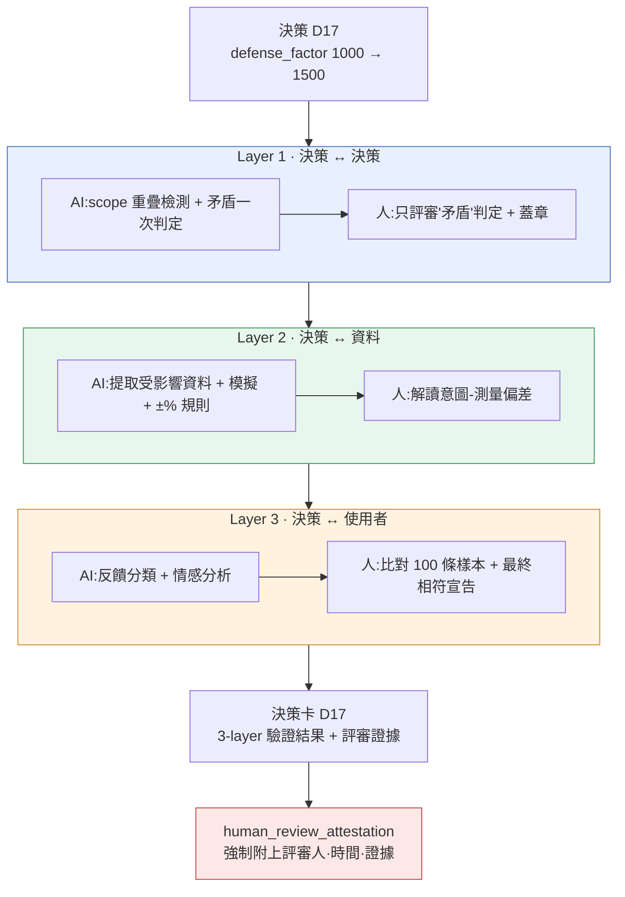

# 10.2 決策驗證 3-layer 感測器 —— 人工評審證據的位置

晚上 11 點,nightly 任務往協作工具裡插入了一張卡片。標題是 `[integrity] D17 相符度測量未執行 已過 7 天`。這條告警的意思是:一條應用了一週的決策,在"是否真的按意圖生效"這一點上還沒有任何人確認,卻一直留在構建裡。資料本身沒問題。表格格式、外部索引鍵(FK)、enum 都通過了。但決策沒有得到驗證。

這道落差正是本章的起點。即便資料完整無缺,決策仍可能出錯,而捕捉這種錯誤的位置,與資料檢查處在不同的地方。把這個位置分成三個層,並明確每一層中 AI 輔助到哪裡、人在哪裡蓋章 —— 這就是決策驗證 3-layer 感測器。

---

## 10.2.1 資料通過了,決策也可能是錯的

`check` cascade 會一次性執行四類檢查 —— doc-audit(文件一致性)、data-qa(資料質量)、integrity(完整性)、link(交叉引用斷鏈)。這四項都通過,意味著"資料沒問題"。但在沒問題的資料之上,仍可能疊加著一條錯誤的決策。

獎勵表格在格式上再完美,只要它的數值會引發通貨膨脹;外部索引鍵(FK)再唯一,只要兩個任務在同一時刻佔用同一個 NPC;voice 再一致,只要兩個角色的關係設定相互矛盾 —— 資料檢查全部通過,而決策卻全部錯誤。資料檢檢視的是"格子是否填好了",決策檢檢視的是"這個值與其他決策、其他資料、真實使用者是否相符"。用會計來打比方,前者是記賬憑證的格式檢查,後者是財務報表的一致性審計。

因此,決策驗證要設定一個與資料驗證**相互分離的感測器**。一旦捆在同一個檢查裡,就會被壓成"通過/失敗"一行,失敗時到底是資料問題還是決策問題,解讀起來就變得含糊。分離開來,責任才清晰。

---

## 10.2.2 三個層、三個時點、三類評審人

3-layer 感測器的核心,在於把驗證的**維度**拆成三個。每一層所看的物件、執行的時點、AI 與人的分工都各不相同。



三個層的最後一道章都由人來蓋 —— 這道章正是 `human_review_attestation_evidence_mandatory` atom 強制要求的證據。每一層看的是什麼、由誰在哪裡蓋章,下面依次來看。

---

## 10.2.3 Layer 1 —— AI 篩選,人只評審"矛盾"

這一層檢查新決策是否與既有決策相沖突。決策對的數量隨決策數的平方增長,200 條決策就約有 2 萬對。人無法用手全部看完。於是先由 AI 跑一遍初篩過濾。

```python
# decision_conflict_check.py —— Layer 1 感測器
def check_new_decision(new_decision, existing_decisions):
    conflicts = []
    for existing in existing_decisions:
        if has_overlap(new_decision.scope, existing.scope):   # 機械初篩:scope 交集
            verdict = llm_judge(new_decision, existing)        # AI 二次判定:矛盾/補充/無關
            if verdict.label == "矛盾":
                conflicts.append({
                    "with": existing.id,
                    "label": verdict.label,
                    "reason": verdict.reason,
                    "needs_human_review": True,                # 人工評審標誌
                })
    return conflicts
```

`has_overlap` 是機械式的初篩過濾器。scope 是 atom 的領域(`combat`·`narrative`·`economy` 等),因此交集計算很精確。不重疊的對立即丟棄。2 萬對通常會縮減到幾十對。只有這幾十對交給 AI 來看。

### 完整實操記錄(worked transcript)—— Layer 1 矛盾判定

這裡把實際往返的內容完整展示到底。不做摘要,含糊的輸出也原樣保留。

**① 人發出的提示詞(全文)**

```
請判斷下面兩條決策是否相互矛盾。

[決策 A](2026-03-XX)戰鬥全域性冷卻統一為 0.5 秒,適用於所有技能
[決策 B](2026-04-XX)治療類技能不適用全域性冷卻

判定格式(只用這個格式,禁止多餘的話):
- label: 矛盾 | 補充 | 無關
- reason: 一行
- confidence: 0.0~1.0

不要猜測。依據薄弱時請調低 confidence。
```

**② Claude 的原始輸出(未加工)**

```
- label: 補充
- reason: 決策 B 是在決策 A 所定的 0.5 秒統一規則上,追加"治療類"這一明確例外的結構,並未推翻規則,而是將其收窄。
- confidence: 0.74
```

**③ 人的驗證 / 否決**

判定是"補充",confidence 0.74。按規則,"補充·無關"是自動通過,但只要 confidence 低於 0.8,就要求人至少確認一行。負責評審的團隊成員 A 重新讀了決策 B 的原文,發現了一點 —— 決策 B 上附有一條但書:"但治療類技能也有 1.2 秒的自身冷卻"。AI 只收到了摘要後的一行,沒能把這條但書作為輸入拿到。團隊成員 A 將 AI 的判定作**接受但補強**處理,並把"AI 所看到的輸入不完整"記錄了下來。

**④ 重新請求(補強輸入後)**

```
[追加但書] 決策 B 上附有一個條件:"治療技能免除全域性冷卻,但擁有 1.2 秒的
自身冷卻"。請把這條但書納入,重新判定。
```

```
- label: 補充
- reason: 自身冷卻 1.2 秒比全域性的 0.5 秒更長,因此治療技能儘管被免除,
  反而擁有更長的間隔。與 A 的意圖(防止亂放技能)不衝突,故補充關係得到加強。
- confidence: 0.91
```

判定依舊是"補充",但依據變得紮實,confidence 從 0.74→0.91。團隊成員 A 在此蓋了章。關鍵不在結果,而在**過程的記錄** —— AI 一次判定、人發現的輸入缺漏、補強後的重新請求、最終評審。這四個步驟原樣錄入決策卡的 Layer 1 證據欄。

這段實操記錄的原則只有一條。**即便是 AI 的"補充·無關"判定,也不會無條件放行。**不是 AI 錯了,而是 AI 拿到的資訊不完整,而發現這一點的,是瞭解決策原文的人。

檢查的時點有三處。新增決策時即時檢查 + 告警,pending atom 晉升時先檢查再晉升,nightly 對全部決策對重新檢查。

---

## 10.2.4 Layer 2 —— AI 幾乎全包,人負責解讀偏差

這一層測量決策如何反映到資料上、又是否與意圖相符。它最容易自動化,也最精確。只要模擬器和資料表已經就位,加上驗證規則即可。

以決策 `D17`(defense_factor 1000→1500)為例,感測器會自動拉取 `CombatBalance` 表格、自動模擬結果以及受影響的角色資料,把意圖(坦克生存 +49%)與測量(模擬 +52%)進行比較。相符判定的規則是定量的。

| 測量相對意圖的偏差 | 處理 | 由誰 |
|---|---|---|
| ±10% 以內 | 相符(自動通過) | AI |
| ±10\~25% | 告警 · 複查 | 人來解讀 |
| 超過 ±25% | 違規 · 必須重新審議決策 | 人來決定 |

這裡人的角色不是"AI 說相符了,那就通過"。**解讀告警區間與違規區間**才是人的工作。D17 的模擬為 +52%,落在 ±10% 之內,屬於自動相符;但同一次模擬還吐出了一個附帶效果 —— 混合型角色 `K_021` 在意圖之外變強了 +28%。這並非 D17 的直接意圖,因此不觸發相符判定規則。規則上是通過的,在人眼裡卻是事故 —— 抓住這個區間,正是 Layer 2 中人存在的理由。

這一層的自動化率約 95%,是三層裡最高的。之所以仍剩下 5%,正是因為這種解讀。數字通過規則,與那個數字對遊戲而言是否正確,是兩個不同的問題。

---

## 10.2.5 Layer 3 —— AI 分類,人做最終相符宣告

三層裡最難的一層。它看的是決策是否按意圖作用到了真實使用者身上。它以構建釋出後 1\~2 周的實測指標(坦克平均生存時間、含坦克的 5:5 PvP 勝率)和自然語言反饋(論壇·社交媒體)作為輸入。

自然語言反饋成為驗證的輸入,是這一層的特點。約 200 條論壇帖、約 1,500 條社交媒體內容,由 AI 分門別類並標註情感。

```
[AI 反饋分類 —— 坦克相關 1 周收集]
   正面 62%   負面 23%("坦克太強了"佔多數)   無關 15%
```

在這裡停下就是陷阱。AI 的情感分類一旦混入韓語和英語,準確度就會下降("坦克變強了哈哈"到底是正面還是諷刺,判定會搖擺)。因此運營規則規定:**每季度由人親自分類 100 條樣本,與 AI 的結果做比對。**若比對中的誤差超過閾值,該季度的分類就不予採信,由人全量重新分類。

最終的相符宣告由人來做。就 D17 而言,實測 +44%(模擬預測 +52%,誤差 8% —— 正常範圍),反饋以正面為主。AI 整理並提交了"正面為主 + 落在意圖範圍內"這一輸入,而**蓋章判定為"相符"的是人**。自動化率約 70%,人佔 30%。唯獨這一層,完全自動在根本上不可能。因為使用者的含義,機器無法一路判定到底。

---

## 10.2.6 人工評審證據不是可選項,而是強制項

如果三層的最後一道章都由人來蓋,那麼一旦缺少**這道章確實蓋過的證據**,整個系統就會崩塌。有人只是嘴上說評審過、實際卻沒做,這種情況如何防範?在專案A中,atom `human_review_attestation_evidence_mandatory` 強制解決這一點。

這個 atom 的規則簡單且不容妥協。**只要決策卡的任何一層發生了"AI 判定 → 人工評審",就必須在卡片上附上評審人標識、評審時間、評審證據(補強備註、否決理由、樣本比對結果三者中至少一項)。證據一旦為空,該卡片就無法晉升為"驗證完成"。**

證據為空時,`integrity_check_clickup_notify` atom 便會啟動。它一旦檢測到一致性失敗 —— 這裡指"評審章蓋了,證據卻沒有" —— 就立即在協作工具裡建立一張卡片。本章開頭那張晚上 11 點的卡片,正是這套機制。

這兩個 atom 結成一對,構成"對驗證的驗證"。3-layer 感測器驗證決策,attestation atom 驗證這道驗證是否真由人做過,notify atom 抓出證據缺漏並予以通報。AI 的輔助再廣泛,**責任的最後一格,也要由留下證據的那個人的名字**來填。

---

## 10.2.7 決策卡 —— 驗證與證據彙集於一頁之處

彙集三層結果與評審證據的單位,就是決策卡。一張卡片是一條決策的完結單元,並流向季度覆盤的輸入。下面是 D17 卡片的結構。

<svg viewBox="0 0 720 430" xmlns="http://www.w3.org/2000/svg" font-family="sans-serif" font-size="13">
  <rect x="10" y="10" width="700" height="410" rx="10" fill="#fafbfc" stroke="#888"/>
  <text x="30" y="40" font-size="16" font-weight="bold">決策卡 D17</text>
  <text x="30" y="62" fill="#555">變更:defense_factor 1000 → 1500   ·   應用 2026-03-XX</text>
  <line x1="30" y1="74" x2="690" y2="74" stroke="#ccc"/>

  <rect x="30" y="86" width="660" height="86" rx="6" fill="#e8f0ff" stroke="#4a72c0"/>
  <text x="42" y="106" font-weight="bold" fill="#2a4a90">Layer 1 · 決策一致</text>
  <text x="42" y="126">✓ 無矛盾決策   ·   與 7 條相鄰決策為補充關係</text>
  <text x="42" y="146" fill="#b03a3a">證據:團隊成員 A,2026-03-XX 14:20,輸入缺漏補強備註 1 條</text>
  <text x="42" y="164" fill="#777" font-size="11">AI 一次判定 → 人工評審(confidence 0.74 → 補強後 0.91)</text>

  <rect x="30" y="180" width="660" height="78" rx="6" fill="#e8f7ed" stroke="#3a9a5a"/>
  <text x="42" y="200" font-weight="bold" fill="#1f6a3a">Layer 2 · 資料相符</text>
  <text x="42" y="220">✓ 模擬 +52% vs 意圖 +49%(相符,±10% 內)</text>
  <text x="42" y="240" fill="#c07a1a">⚠ K_021 混合型意圖之外 +28% —— 人工解讀:需要後續決策</text>

  <rect x="30" y="266" width="660" height="78" rx="6" fill="#fff3e0" stroke="#d08a2a"/>
  <text x="42" y="286" font-weight="bold" fill="#9a5a10">Layer 3 · 使用者相符</text>
  <text x="42" y="306">✓ 實測 +44% vs 模擬 +52%(誤差 8%,正常)   ·   反饋以正面為主</text>
  <text x="42" y="326" fill="#b03a3a">證據:季度樣本 100 條人工比對完成,AI 分類一致率 88%</text>

  <rect x="30" y="352" width="660" height="52" rx="6" fill="#fde8e8" stroke="#c04a4a"/>
  <text x="42" y="374" font-weight="bold" fill="#a02020">整體:✓ 相符(K_021 副作用後續決策已登記到協作工具)</text>
  <text x="42" y="394" fill="#777" font-size="11">attestation 驗證:三個層均確認已附評審證據 → 允許卡片晉升</text>
</svg>

紅色那幾行是關鍵。每一層的"證據:"一行若為空,attestation atom 就會阻止卡片晉升,notify atom 則通知協作工具。半年後若有人問"當初為什麼把 defense_factor 定為 1500",這一張卡片就能把意圖、測量、實測乃至評審人一併答清楚。決策卡執行在與第18部分決策追蹤 atom 相同的後設資料流之上。

---

## 10.2.8 自動化率與引入順序

三個層的自動化程度各不相同(分別約為 80%·95%·70%,如前幾節所見)。三者都是部分自動、最後一道章也都由人來蓋,但人的工作量整體上減少了 80% 以上。

引入從 Layer 2 開始。只要模擬和資料表已經就位,加上驗證規則即可,1\~2 個月就能見效。接著是 Layer 1(基礎設施投入少而效果大,再加 1 個月),最後是 Layer 3(基礎設施投入最大,效果也最大,再加 2\~3 個月)。想從一開始就裝上 Layer 3 而擱淺,是常見的失敗。

> **關於數字標註**:上面的自動化率與下面的效果比例,是基於作者專案運營觀察的**作者估計(未經驗證)**。它們不是精密測量值,應當作方向與大致比例來讀。相符判定規則的 ±10%/±25% 閾值是實際的運營規則,atom 名稱(`integrity_check_clickup_notify`、`human_review_attestation_evidence_mandatory`)是真實存在的 atom。

引入前後的變化,按方向來概括是這樣的。每季度的決策矛盾事故從若干件降到近乎 0 件;決策後 1 周的相符度測量執行率從少數升到大多數;事故發生前的副作用發現率從不足一半升到大多數。最有意義的變化是可追溯性 —— 事隔許久之後仍能回溯決策背景的比例,從少數變成了幾乎全部。因為決策卡儲存了遊戲的決策歷史。

---

## 10.2.9 常見失敗

| 模式 | 處方 |
|---|---|
| 只執行 Layer 1(僅做矛盾檢查) | 增設 Layer 2·3 來補齊維度 |
| 一開始就引入 Layer 3 | 從 Layer 2 起,按基礎設施由小到大的順序 |
| 不加批判地接受 AI 的"補充·無關"判定 | confidence 閾值 + 人工樣本評審 |
| 只蓋評審章卻不附證據 | attestation atom 阻斷晉升 |
| 無視證據缺漏的告警 | 把 notify atom 的協作工具卡片視為未完成 |
| 盲信使用者反饋的 AI 分類 | 每季度人工比對 100 條樣本 |

---

### 本章要點

- 資料完整與決策一致是不同的感測器。捆在同一個檢查裡,失敗的解讀就會含糊。
- 三個層都由 AI 輔助,但最後一道章由人來蓋。只是維度不同,原則相同。
- 評審證據一旦為空,卡片就無法晉升。attestation atom 做的是"對驗證的驗證"。

---

### 動手試試 —— 單人精簡版

**setup.** 把決策日誌彙總到一個檔案裡(決策 id·scope·意圖·應用日期)。scope 像 `combat`·`narrative`·`economy` 那樣固定為 enum。若沒有模擬器,Layer 2 也可以先從"相關資料表的手動比較"開始。

**prompt.** 每當出現新決策,就把它與既有決策逐對拿去問 AI。請固定格式。
```
請判斷下面兩條決策是否相互矛盾。
[決策 A] ...
[決策 B] ...
只輸出格式:label(矛盾|補充|無關) / reason 一行 / confidence 0.0~1.0
禁止猜測。依據薄弱則調低 confidence。
```

**verify.** 對"矛盾"判定以及 confidence 低於 0.8 的判定,請由人重新讀一遍決策原文加以確認。確認後,必須在決策卡上留下**評審人姓名·時間·備註(補強/否決/比對三者之一)**。證據欄一旦為空,就不要把那張卡片提升為"驗證完成" —— 這一行就是 attestation atom 的單人版。哪怕是單人運營,也要為半年後的自己留下證據。
