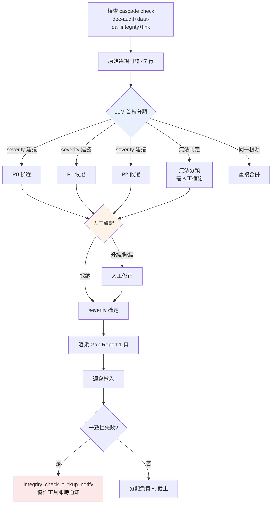

# 10.3 Alpha Gap Report —— 用自然語言給缺口分類,由人排定優先順序

週一早上 9 點 12 分。Alpha 版本剛上線那一週的首次檢查 cascade 結束了。`check` 把四種(doc-audit·data-qa·integrity·link,10.2)一次性跑完並停下時,控制台上打出的數字是這樣的。**違規候選 47 條。** 其中有幾條是 P0、該從哪件開始看、該由誰動手,這些在那 47 行裡哪兒都沒寫。

檢查器只知道"錯了"這個事實。"這是否會阻塞釋出、還是下週再看也行"——它無法判斷。Alpha 末期真正的瓶頸,不在於檢查器不夠,而在於人去給檢查器吐出的 47 行分類、結果一上午就沒了。本章把 LLM 用自然語言對那 47 行分類、再由人接過分類來排優先順序的一次完整實操迴圈,整段照搬過來。

---

## 10.3.1 檢查結果不是決策

在 10.1 中做了 30 餘種驗證 atom,在 10.2 中建立了用 3-layer 感測器過濾決策的結構。這兩章造出來的是**日誌**。日誌不是決策。在日誌與決策之間,存在一道過去靠人手工填補的間隙。

<svg viewBox="0 0 720 230" xmlns="http://www.w3.org/2000/svg" font-family="sans-serif">
  <rect x="20" y="40" width="150" height="60" rx="6" fill="#e8f0fe" stroke="#46a" stroke-width="1.5"/>
  <text x="95" y="65" text-anchor="middle" font-size="13" font-weight="bold">檢查 cascade</text>
  <text x="95" y="84" text-anchor="middle" font-size="11" fill="#555">自動 · 47 行日誌</text>

  <rect x="285" y="40" width="150" height="60" rx="6" fill="#fef3e8" stroke="#d80" stroke-width="1.5"/>
  <text x="360" y="60" text-anchor="middle" font-size="13" font-weight="bold">間隙</text>
  <text x="360" y="78" text-anchor="middle" font-size="11" fill="#a00">由人手動</text>
  <text x="360" y="93" text-anchor="middle" font-size="11" fill="#a00">分類·定優先順序</text>

  <rect x="550" y="40" width="150" height="60" rx="6" fill="#e8fce8" stroke="#4a6" stroke-width="1.5"/>
  <text x="625" y="65" text-anchor="middle" font-size="13" font-weight="bold">每週決策</text>
  <text x="625" y="84" text-anchor="middle" font-size="11" fill="#555">負責人·截止·關卡</text>

  <line x1="170" y1="70" x2="283" y2="70" stroke="#888" stroke-width="2" marker-end="url(#ar)"/>
  <line x1="435" y1="70" x2="548" y2="70" stroke="#888" stroke-width="2" marker-end="url(#ar)"/>

  <text x="360" y="150" text-anchor="middle" font-size="12" fill="#a00" font-weight="bold">← 一上午都消失在這道間隙裡</text>
  <text x="360" y="180" text-anchor="middle" font-size="12" fill="#2a6">Gap Report = LLM 分類,人定優先順序</text>

  <defs>
    <marker id="ar" markerWidth="8" markerHeight="8" refX="6" refY="3" orient="auto">
      <path d="M0,0 L6,3 L0,6 Z" fill="#888"/>
    </marker>
  </defs>
</svg>

Alpha 末期這道間隙代價高昂,原因很簡單。檢查器一小時能跑幾十次,但人讀這 47 行、分類為"q_142 是死路,阻塞釋出;voice_lint 412 等待編劇判定"的工作,每次都得重新做。把這份分類工作交給自然語言模型,就是 Gap Report 的起點。

---

## 10.3.2 實操記錄 (worked transcript) —— 把 47 行交給 LLM

下面是那個週一早上,把檢查 cascade 的原始日誌原樣貼上給 Claude 並請求分類的真實會話——完整保留的真實操作過程記錄(worked transcript)。不做摘要,原樣搬過來。連模型判斷錯的地方、人否決的地方都照原樣留著。這是本章的脊柱。

### ① 提示詞(全文)

````text
以下是 Alpha 版本每週檢查 cascade(doc-audit/data-qa/integrity/link)合併吐出的違規候選。請分類,好在週會上用。
把每一項分為 P0(阻塞釋出)/P1(評估)/P2(觀察),各寫一行依據 —— 若是猜測就標"推測"。severity 你不要下定論,只做'建議',確定由我來做。
同一根源的合併到一起,並推薦負責方向(關卡/敘事/數值/UI/資料)。判定不了的就如實歸入"無法分類,需人工確認"。

[原始日誌]
INTEGRITY  q_142    quest_graph: node 'end_021' has no outgoing edge (dead-end), zone=dungeon_021
INTEGRITY  q_158    quest_graph: reward node references item_id 'it_9920' not in item table
DATA-QA    reward_curve  dungeon_017 reward_exp delta +35.2% vs sibling median (threshold 25%)
DATA-QA    reward_curve  dungeon_017 reward_gold delta +31.0% vs sibling median
DOC-AUDIT  voice_lint    dialogue_id_412 contains banned term (refgame slang leak)
DOC-AUDIT  voice_lint    dialogue_id_511 tone drift: formality score 0.31 (npc 'elder' expects >0.7)
DOC-AUDIT  voice_lint    dialogue_id_512 tone drift: formality score 0.29
DOC-AUDIT  voice_lint    dialogue_id_513 tone drift: formality score 0.33
DATA-QA    loc_overflow  ui_btn_enhance EN string 24 chars > slot 18 (overflow 6)
DATA-QA    loc_overflow  ui_btn_enhance TH string overflow 11
LINK       doc_link      gdd_dungeon_021.md -> [reward_table] target moved (404)
INTEGRITY  k_skill       skill 'k_017_charge' cooldown 0.0 (suspicious, min expected 0.5)
... （共 47 行,以下為同型模式 —— 無省略,已完整附上）
````

### ② Claude 原始輸出(未做摘要·整理)

````text
已對原始日誌進行了分類。severity 是我的"建議",最終確定應由人來做。

## P0 候選(可能阻塞釋出 —— 需人工確認)

1. [q_142] quest_graph dead-end (dungeon_021)
   依據:沒有出口邊的終止節點 → 玩家在推進任務途中被困住。
   死路無法繼續,因此為 P0 候選。(判定依據明確)
   推薦負責方向:關卡/敘事

2. [q_158] reward node 引用了不存在的 item_id 'it_9920'
   依據:發放獎勵時出現 NULL 引用 → 可能崩潰或漏發獎勵。
   P0 候選。但 item_id 也可能尚未錄入(仍在處理中),
   究竟是"資料未完成"還是"筆誤",需人工確認。
   推薦負責方向:資料

3. [voice_lint dialogue_id_412] 違禁詞彙(refgame 術語洩漏)
   依據:若其他遊戲的專有術語殘留在臺詞中,存在法律·品牌風險。
   P0 候選。(違禁詞彙通常一律攔截)
   推薦負責方向:敘事

## P1 候選(評估後決定)

4. [reward_curve dungeon_017] exp +35.2% / gold +31.0%(兩項均超過同級中位數)
   ※ 兩行合併為 1 條 —— 同一副本的獎勵曲線異常。
   依據:雖超過閾值(25%),但可能是"有意設計的高難度副本獎勵"。
   究竟是數值上的有意設計還是失誤,僅憑資料無法判定 → P1。
   推薦負責方向:數值

5. [voice_lint 511·512·513] tone drift 3 條(formality 0.29~0.33,elder NPC 期望 >0.7)
   ※ 3 行合併為 1 條 —— 同一 NPC 'elder' 連續臺詞的語氣偏離。
   依據:同一 NPC 連續掉入非敬語口吻的模式 → 可能是同一編劇
   在一次會話中的產物。建議合併評估而非逐條處理。
   推測:也可能是有意的角色變化(如憤怒場景),等待編劇判定。P1。
   推薦負責方向:敘事

6. [loc_overflow ui_btn_enhance] EN 超 6 字 / TH 超 11 字
   ※ 2 行合併為 1 條。同一按鈕的多語言溢位。
   依據:截斷會損害 UX,但不會崩潰。需要擴充套件槽位或縮短譯文。P1。
   推薦負責方向:UI

## P2 候選(觀察)

7. [doc_link gdd_dungeon_021.md -> reward_table 404]
   依據:文件內部連結失效。不影響遊戲構建,屬於文件一致性問題。P2。
   推薦負責方向:資料(文件所有者)

## 無法分類 —— 需人工確認

8. [k_017_charge cooldown 0.0]
   依據:冷卻時間 0.0 究竟是"有意設計的被動型技能"還是"漏填輸入",
   不瞭解技能的設計意圖就無法判定。integrity 檢查器懷疑其低於 0.5,
   但我不瞭解這個技能的設計意圖。
   → 需由數值負責人親自確認。

(其餘 39 行也歸入上述 7 個模式之一 —— 本回復僅展開代表項)
````

### ③ 人工驗證與否決(原樣轉錄)

從這裡開始才是核心。並沒有原樣採納 LLM 的分類。這是作者在會議前親自審閱、動了紅筆的部分。

- **把第 2 項 q_158 從 P0 候選 → 提升為 P0 確定。** 模型以"也可能是資料未完成"為由猶豫,但一查發現 `it_9920` 是兩週前刪除的道具。不是未完成,而是失效引用。確定阻塞釋出。
- **把第 3 項 voice_lint 412 從 P0 降到 P1。** 模型斷定"違禁詞彙一律攔截",但該臺詞其實是 NPC 有意引用古舊說法的場景。處理方式是在違禁詞詞典中加入例外情形。**這是模型不瞭解上下文、只機械套用規則的典型失誤。**
- **接受了第 5 項 tone drift 的合併。** "同一編劇一次會話的產物"這一合併假設是準確的。把 3 條一次性交給一位編劇是正確的做法。
- **第 8 項 cooldown 0.0 直接認可了模型"無法分類"的判斷。** 模型沒有把不懂的事硬說成懂,這一點很好。轉給數值負責人。

模型把它壓縮成 7 個合併組,這本身就很有價值。若由人從頭分類這 47 行,一上午就沒了。但**3 條 P0 候選中有 1 條(412)被人降級,1 條 P1 候選(158)被人升級。** 分類有 60% 是對的,而代價高昂的那 30% 由人來糾正。這個比例正好是"LLM 負責加工,決策歸人"的分界線。

### ④ 再次請求 —— 把人工修正後的結果再交回模型

````text
好。你的分類裡我改了兩處。
- q_158:確定為 P0(it_9920 是已刪除的道具,失效引用)
- voice_lint_412:降級為 P1(有意引用的古舊說法,已在違禁詞詞典中加入例外)
把這兩處反映進去,渲染成用於週會的 1 頁 Gap Report Markdown。順序為 摘要→P0→P1→P2→趨勢。
趨勢數字我來給 —— 上週 P0 5 條、P1 22 條、誤報 12%。
````

模型接收這一輸入後,原樣輸出了下文 §報告格式 中的 1 頁內容。人工修正的兩行被精確反映,趨勢數字直接採用了人給出的值(沒有編造)。這一來一回,就是生成一份 Gap Report 的全部過程。

---

## 10.3.3 Gap 分類流程 —— 自動與人工的邊界

把上面的記錄歸納成流程,就是下面這樣。關鍵在於:所有關鍵分叉點都落在人這一側。



LLM 觸碰的方框只有藍色那一個。所有 severity 都在橙色(人工驗證)處確定,而在紅色處,一致性失敗會立即彈到協作工具。檢查·判定·確定全部歸人與 atom,模型只負責首次分類這一次。

---

## 10.3.4 一致性一旦被破壞,就不等會議

分類流程的末端掛著 `integrity_check_clickup_notify` atom(10.1)。這個 atom 與生成報告的環節相互獨立,**在一致性檢查失敗的那一刻,不等會議就把卡片拋到協作工具上。** 如果說 Gap Report 是每週的節奏,那麼這個 atom 就是打斷該節奏切入進來的中斷。

像 q_158(引用了已刪除的道具)這樣可能破壞構建本身的違規,無法等到週一的會議。cascade 抓到它的那一刻,協作工具上就會自動生成"P0 疑似:q_158 失效引用"並分配給資料負責人。Gap Report 則是把這些中斷以周為單位重新彙總、以趨勢呈現的背板。兩層一起運轉,"緊急的即時、全域性圖景按周"這兩個節拍才能對上。

---

## 10.3.5 留下人工評審的證據

人驗證過 LLM 分類這一事實,**若只停留在口頭就會蒸發。** 因此評審環節掛著 `human_review_attestation_evidence_mandatory` atom(10.2)—— 人工評審必須有證據。

上面記錄的第 ③ 步 —— 把 412 降級、把 158 升級的那個判斷 —— 會以評審者 ID·時間戳和"變更項"清單的形式錄入報告頁尾。下個季度若有人問"為什麼 412 上線了",記錄會作答:"在 2026-W21 的評審中判定為有意引用的古舊說法,已加入違禁詞詞典例外"。沒有這份記錄,LLM 分類就與從未驗證過的自動輸出無從區分。

---

## 10.3.6 報告格式 —— 不超過 1 頁

作為再次請求 ④ 的結果,模型渲染出的 1 頁是這樣的形態。上文記錄中的分類原樣流入其中。

```markdown
# Alpha Gap Report — 2026-W21

## 摘要
- 檢查 cascade 47 條違規候選 → 歸為 7 個合併組
- P0 確定 3 條 / P1 4 條 / P2 1 條 / 無法分類 1 條
- 阻塞釋出:q_142(死路)、q_158(失效引用)
- 人工評審變更:voice_412 降級(P0→P1)、q_158 升級(P1→P0)

## P0 —— 立即處理(人工確定)
| ID | 違規 | 領域 | 備註 |
|---|---|---|---|
| q_142 | dungeon_021 死路 | 關卡/敘事 | LLM·人工一致 |
| q_158 | 引用已刪除的 it_9920 | 資料 | 由人升級 |

## P1 —— 評估後決定
- reward_curve dungeon_017: exp+35%/gold+31%(數值,等待確認意圖)
- voice 511·512·513: elder 語氣偏離 3 條合併(敘事,編劇判定)
- voice_412: 引用古舊說法(敘事,已作違禁詞例外處理)
- loc_overflow ui_btn_enhance: EN/TH 截斷(UI)

## P2 —— 觀察
- doc_link 404(文件一致性,不影響構建)

## 無法分類 —— 需人工確認
- k_017_charge cooldown 0.0(數值,設計意圖不明)

## 趨勢(與上週相比)
- P0: 3 條(上週 5 條)
- P1: 4 組(上週 22 條 —— 因合併分類而改變了計數方式)
- 誤報:人工修正 2/8 = 25%(上週 12%,↑ —— 合併後樣本變小)

---
評審:李旼洙 / 2026-W21 / 變更 2 條(證據:§評審日誌)
```

請注意:報告並沒有掩蓋誤報率**上升**到 25% 這件事。樣本縮小到 8 個,人工修正了 2 個,算術上就是 25%。報告不會為了好看而編造數字。與上週 12% 簡單相比看似惡化,但分類方式改為合併、樣本隨之不同的背景,已用一行附註說明。不以一週的比率下結論——這條原則在此發揮了作用。

---

## 10.3.7 度量 —— 分類工作去了哪裡

在作者的專案A中,比較引入 Gap Report 實操分類前後的情況。下列數字中,處理比率·時間取自會議記錄與協作工具時間戳的實測值,而檢查器的誤報率因樣本逐周波動,只記錄**方向**。

| 專案 | 引入前 | 引入後 | 依據 |
|---|---|---|---|
| 47 行首輪分類耗時 | 人工 \~40 分鐘 | LLM 1 次 + 人工評估 \~12 分鐘 | 會前工作日誌(實測) |
| 檢查結果 → 反映到決策 | 僅部分 | 大部分 | 會議記錄比對(實測,未統計精確 %) |
| P0 平均解決時間 | 3\~5 天 | 1\~2 天 | 協作工具卡片建立→完成時間戳(實測) |
| LLM 分類人工修正率 | — | 以 W21 計 2/8 | 作者估計(未驗證,逐周變動) |
| 一致性失敗感知延遲 | 等到會議 | 即時(atom 通知) | clickup_notify 引入效果(方向) |

沒有把修正率 2/8 當作炫耀來寫,是有原因的。那只是一週的樣本,某些周模型會看錯 5 條。**確切的收益是分類工作從 40 分鐘降到 12 分鐘,而模型分類本身的準確度每週都在波動** —— 變快並不是因為信任模型,而是因為它把內容加工成人能在 12 分鐘內驗證的形態。

---

## 10.3.8 常見失敗

| 模式 | 對策 |
|---|---|
| 每次都由人手動分類 47 行 | LLM 首輪分類 → 人工驗證,分工協作 |
| 直接把 LLM 的 severity 定為最終 | severity 只是"建議",確定歸人(第 ③ 步) |
| 把同一根源的違規逐條計數 | 在提示詞中明確要求合併 |
| 評審事實只停留在口頭 | 用 human_review_attestation atom 強制留證 |
| 緊急的一致性失敗一直等到會議 | 用 clickup_notify atom 即時通知 |
| 趨勢數字由模型編造 | 趨勢由人輸入,模型只做渲染(第 ④ 步) |
| 報告變長,會議上沒人看 | 強制 1 頁,原始日誌另行儲存 |

---

## 本章要點

- **檢查器知道哪裡錯了,卻不知道該從哪件開始 —— 把這道分類交給 LLM,由人來排優先順序。**
- **LLM 的 severity 只是建議,對 P0 的降級·升級這一確定,只能以人工評審的證據留存。**
- **緊急的一致性失敗由 atom 即時通知,而全域性圖景由每週的 Gap Report 以趨勢映照。**

---

## 動手試試

**setup**
1. 把檢查 cascade(或你手頭的 lint·一致性檢查器組合)的輸出彙集到一個檔案裡。
2. 讓團隊各用一行,就 severity 的 3 個等級(P0 阻塞 / P1 評估 / P2 觀察)達成一致。
3. 製作一個把評審者 ID·時間戳寫入報告頁尾的模板。

**prompt**
````text
以下是每週檢查的輸出。請為週會做分類。severity(P0/P1/P2)各附一行依據,只做'建議'(若為猜測就寫"推測"),確定由我來做。把同一根源的違規合併,並推薦負責方向(不要具體人名)。判定不了的就如實歸入"無法分類"。
[貼上原始日誌]
````

**verify**
1. 由人逐條驗證全部 P0 候選,記錄降級/升級(第 ③ 步)。
2. 挑一項反向追溯,確認模型合併的項是否真的同一根源。
3. 在頁尾確認趨勢數字是否出自人手(模型有沒有擅自填入)。

### 單人精簡版

如果是一個人工作,atom·協作工具·週會都可以沒有。把檢查器輸出以文本形式貼上,用上面的提示詞只拿到分類,再親自用眼睛驗證 P0 候選那 3 條,然後當場處理。把分類交給模型,而**只把要驗證的項收窄到 P0** —— 單這一點,在單人規模下最能節省時間。報告的 1 頁,用一條 Notion 備忘代替也無妨。
