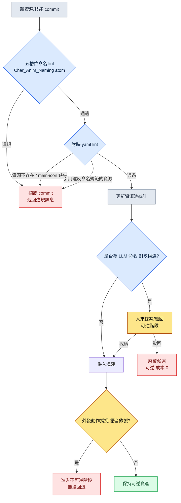

# 11.1 命名規範與技能-美術對映

衝刺(sprint)結束前兩天,戰鬥美術師通過團隊即時通訊工具發來一段短影片。新武士職業的三段連招。第一段和第二段都有刀風聲,第三段卻一點聲音都沒有。無聲。他本人說聲音都加好了,音效負責人說檔案都交付了。兩人都不是在說謊。聲音檔案確實在倉庫裡,名為 `combo3_swing_final_real.wav`。而遊戲程式碼要找的名字是 `sfx_K012_combo3_swing.wav`。兩者沒有一個字元重合。

追查這起無聲事故,花掉了那天整個下午。這不是某一個片段、某一個聲音的問題。只要名字由人隨意來起,這類事故每個季度都會重新冒出幾十起。本章講的就是把這種自由變成規則的故事。

> **本章要回答的問題**
> - 在 1萬個資源的規模下,名字為什麼不是自由而是規則
> - 把命名規範以 atom(最小知識單元)強制固化、並用 lint 自動校驗後,能封住什麼
> - 一個技能所掛的動畫、VFX、音效、圖示對映,由 AI 起草、由人採納的實操記錄

> **給非專業讀者的一句話。** 1萬個資源、fbx 檔名格式,看上去像是遊戲行業特有的事情。但你要帶走的那一點,並不挑領域——**"一旦名字可以隨意起,檢索、自動化、連線就會一起被鎖死。"** 規模一大,命名就必須從個人偏好變成規則,而只有成為規則的名字,程式碼才能自動找到並使用——這個原則,適用於任何處理文件、資產、客戶記錄的工作。

---

## 11.1.1 1萬個資源這個規模

筆者所主導的專案A是一款移動優先的 MMORPG。角色動畫資源的大致規模如下。玩家職業數量、敵方 NPC 種類是實際運營數值,片段數量與總量估計為筆者估算(未經驗證)。

| 資源 | 數量 |
|---|---|
| 玩家角色職業 | 6 |
| 敵方 NPC 種類 | 80\~100 |
| 單個角色平均片段 | 100\~150(筆者估算) |
| 片段總量估計 | 約 10,000\~15,000(筆者估算) |

1萬個。這相當於 1萬個抽屜。站在 1萬個沒有貼標籤的抽屜前找"攻擊動作放哪兒了",等於把賭注押在人的記憶力上。而這個賭注一定會輸。找不到,結果只有兩種。要麼工作時間翻倍,要麼因為沒找到而把同一個動作重新做一遍。後者更糟。因為資源會變得臃腫,而且日後同一個動作會以兩個略有差異的版本到處流動。

名字若處於自由地帶,被鎖死的不只是檢索。"由程式碼憑技能 ID 自動取到動畫檔案"的自動路由也會一起被鎖死。如果無法從名字裡讀出規則,程式碼就必須為每一個技能都握著一張手寫的對映表,記錄該用哪個檔案。每進來一個新角色,這張表就得靠人手動加長。

---

## 11.1.2 五槽位命名格式 —— 固化為 atom

專案A的動畫檔名固定為五個槽位。

```
<role>_<id>_<category>_<action>_<variant>.fbx

char_K001_idle_default_v1.fbx
char_K001_locomotion_walk_forward.fbx
char_K001_combat_attack_combo1_v2.fbx
char_K001_react_hit_heavy.fbx
enemy_E021_combat_skill_aoe_v1.fbx
```

五個槽位都遵循既定的 enum。允許自由輸入的槽位只有 `id` 一個,而且這個槽位也被約束為 `[A-Z]\d{3}` 格式。

| 槽位 | enum 數量 | 示例 |
|---|---|---|
| role | 4 | char, enemy, pet, mount |
| id | 格式固定 | K001, E021, P003, M005 |
| category | 8 | idle, locomotion, combat, react, death, social, cinematic, system |
| action | 每個類別 10\~30 | walk, run, attack, skill_aoe, hit_heavy |
| variant | 格式固定 | default, v1, v2, _short, _long |

這裡的關鍵不是格式本身,而是把格式輸入(存放)在哪裡。如果把命名規範寫在一頁 wiki 文件裡,那就是一張沒人讀的標籤。筆者把這套規範做成了名為 `Char_Anim_Naming_Convention` 的單一事實源(single source of truth)atom,讓人、lint、LLM 全都只盯著這一個 atom。當格式不再是文件、而是被固化為 atom 的那一刻,命名的性質就從"建議事項"變成了"必須通過的關卡"。

`action` 槽位的 enum 可能無限膨脹,這是它的弱點。因此要按類別用一部字典來管理標準 action。

```yaml
combat:
  - attack_basic
  - attack_combo1
  - attack_combo2
  - skill_<skill_id>
  - parry
  - dodge_forward
  - dodge_back
react:
  - hit_light
  - hit_heavy
  - knockback
  - stagger
  - stun
locomotion:
  - idle
  - walk_forward
  - run_forward
  - sprint
  - jump_start
  - jump_loop
  - jump_land
```

是否把新 action 加入字典,由一套流程來判斷。每個季度是否有 3 個以上角色會用到,用現有 action 是否真的表達不出來,類別是否明確,以及最重要的一點——是否可以用 variant 吸收掉。只要能用 variant 處理,就不新增 action。action 字典保持在 100 個以內,是運營健康的訊號。不過這並不當作絕對上限。新型別或新職業進來時,一次可能就增加 30\~40 個。要攔住的不是數字,而是無節制的增殖。

---

## 11.1.3 lint 攔下提交

把格式輸入為 atom 之後,就需要一個自動強制執行該 atom 的校驗器。人不可能每次都用肉眼去檢查五個槽位。下面就是這個 lint 的骨幹。

```python
# anim_naming_lint.py
import re, yaml

NAMING_PATTERN = re.compile(
    r"^(?P<role>char|enemy|pet|mount)_"
    r"(?P<id>[A-Z]\d{3})_"
    r"(?P<category>idle|locomotion|combat|react|death|social|cinematic|system)_"
    r"(?P<action>[a-z_]+?)"
    r"(?:_(?P<variant>v\d+|short|long|light|heavy|left|right|forward|back))?"
    r"\.fbx$"
)

ACTION_DICT = yaml.safe_load(open("char_anim_naming_convention.yaml"))

def check(filename):
    m = NAMING_PATTERN.match(filename)
    if not m:
        return f"命名規則違規(5槽位格式不匹配): {filename}"

    category, action = m.group("category"), m.group("action")
    # skill_<id> 形式是動態 action,因此只檢查 prefix
    base = "skill" if action.startswith("skill_") else action
    if base not in ACTION_DICT.get(category, []):
        return f"不在 action enum 內({category}): {action}"

    return None
```

新的 fbx 一進入倉庫,這個檢查就會執行。若違規,提交(commit)就會被攔下。這裡重要的一點是,不把違規歸咎於人。與其責怪造成無聲事故的美術師,不如把責任推給工具——"那個名字本就不該被提交進來"。人會犯錯,工具去攔住這個錯誤。這就是命名系統的基本姿態。

命名一旦被強制,作為回報,自動路由就被打通了。

```python
def play_skill_animation(character, skill_id):
    anim_path = f"char_{character.id}_combat_skill_{skill_id}.fbx"
    if not exists(anim_path):
        anim_path = f"char_{character.id}_combat_skill_default.fbx"  # fallback
    play(anim_path)
```

手寫的對映表消失了。即便進來新角色、新技能,只要按規範新增動畫檔案,程式碼一行都不用改。回到那起無聲事故——如果那個聲音檔案只能以 `sfx_K012_combo3_swing.wav` 這個規範名字進來,那麼 `combo3_swing_final_real.wav` 一開始就會在提交階段被彈回,那天整個下午也就保住了。

variant 槽位是守住 action enum 的安全閥。同一動作的版本(v1、v2)、長度(_short、_long)、強度(_light、_heavy)、方向(_forward、_back)全部由 variant 吸收,從而不必讓 action 細分,而是把它們接住。而遊戲程式碼可以根據上下文來選用這個 variant。

```python
def select_variant(base_action, context):
    if context.distance < 3:
        return f"{base_action}_short"
    if context.distance > 10:
        return f"{base_action}_long"
    return base_action
```

這等於說,命名規範成了程式碼的分支點。

---

## 11.1.4 一個技能十個資源 —— 對映 yaml

如果說命名是 L1,那麼連線技能與資源的對映就是 L2。一個技能通常會牽著 2\~3 個動畫、1\~3 個 VFX、2\~5 個音效、1 個 UI 圖示。平均下來是 10 個資源。200 個技能就是約 2,000 個對映物件。靠人腦管理這個規模是不可能的。因此為每個技能設一份 yaml,把該技能的資源繫結為只從這一份裡讀取。

```yaml
---
skill_id: skill_K001_combo1
description: K001 連招1(三段連續)
type: melee_combo
animations:
  - clip: char_K001_combat_attack_combo1_v2.fbx
    role: main
    bone_alignment: spine_03
vfx:
  - asset: vfx_K001_combo1_slash.vfx
    socket: weapon_tip
    timing_ms: [0, 150, 300]
  - asset: vfx_hit_blood_light.vfx
    socket: target
    timing_ms: [150]
sound:
  - asset: sfx_K001_combo1_swing.wav
    volume: 0.8
    timing_ms: 0
  - asset: sfx_hit_metal_light.wav
    volume: 0.6
    timing_ms: 150
ui_icon: icon_skill_K001_combo1.png
ui_tooltip_key: skill_K001_combo1_tooltip
verified: true
---
```

這一份就是一個技能的全部資源。而這份 yaml 裡所有的資源路徑都遵循 11.1 的五槽位規範。命名 lint 一垮,這套對映也跟著垮。兩層作為一對協同運作。

對映一旦集中到一處,影響追蹤就自動被打通。當你想徹底替換某一個 VFX 時,不必再靠人手翻查它會影響到哪些技能。

```python
def find_skills_using(asset):
    affected = []
    for path in glob("skills/*.yaml"):
        skill = yaml.safe_load(open(path))
        for cat in ("vfx", "sound", "animations"):
            for entry in skill.get(cat, []):
                if entry.get("asset") == asset or entry.get("clip") == asset:
                    affected.append(skill["skill_id"])
    return affected

# find_skills_using("vfx_hit_blood_light.vfx")
# → ["skill_K001_combo1", "skill_K005_combo2", "skill_E021_attack_basic", ...]
```

在資源替換會議上,受影響的技能清單會自動附上。在"改了這個會影響到哪兒?"這個問題被問出來之前,答案就已經擺在會議記錄旁邊了。

對映也配有 lint。所有資原始檔是否真實存在,animations.main 與 ui_icon 是否各有一個,timing_ms 是否落在動畫時長之內,以及——所有資源路徑是否都通過 11.1 的命名規範。最後一項就是把兩層釘在一起的那根釘子。構建時自動執行。

---

## 11.1.5 命名·對映的校驗流程

把到目前為止的命名 lint 與對映 lint 如何匯成一道關卡,用流程圖梳理一下。



請注意,這條流程的末端有一道可逆/不可逆的邊界。yaml 修改、LLM 候選、關鍵幀,這些全都是可逆的。不滿意就廢棄即可,成本幾乎為 0。然而一旦進入動作捕捉拍攝、配音演員錄音、標誌性嗓音選角,就變成不可逆了。這牽涉到演員與錄音棚的預約、錄音間、合同、市場認知。因此,所有命名、對映、人格設定(persona)的決策,都必須在不可逆階段之前——也就是在 yaml、LLM 候選、關鍵幀這一可逆區域之內完成。

---

## 11.1.6 實操記錄 —— 把新技能對映初稿交給 AI

到這裡為止講的是系統,現在原封不動地展示一段真實會話,看 AI 究竟在哪裡介入——這就是實操記錄(worked transcript,完整保留下來的真實操作過程記錄)。這一幕,是讓 LLM 為新火焰技能 `skill_K012_flame_burst` 起草資源對映初稿。

**提示詞(全文):**

```
以下是我們專案的角色動畫命名規範(atom)、現有資源池統計,
以及一份相似技能的 yaml。

[命名規範]
<role>_<id>_<category>_<action>_<variant>.fbx
role: char|enemy|pet|mount / category: idle|locomotion|combat|react|death|social|cinematic|system

[資源池 TOP 使用資源]
sfx_hit_metal_light.wav (47 個技能), vfx_dust_kickup.vfx (38 個技能),
vfx_fire_burst_med.vfx (22 個技能), sfx_fire_whoosh.wav (19 個技能)

[相似技能 yaml]
skill_id: skill_K005_fire_slash / type: melee_fire
animations: [char_K005_combat_attack_fire_v1.fbx]
vfx: [vfx_K005_fire_slash.vfx, vfx_fire_burst_med.vfx]
sound: [sfx_K005_fire_swing.wav, sfx_fire_whoosh.wav]

新技能: skill_K012_flame_burst (K012 武士, 範圍火焰爆發, 單段)
請編寫這個技能的對映 yaml 初稿。儘量複用現有資源池,
對需要新制作的資源用 [NEW] 標籤標註。
```

**Claude 原始輸出(未作摘要·整理):**

```yaml
skill_id: skill_K012_flame_burst
description: K012 武士 範圍火焰爆發 (單段)
type: aoe_fire
animations:
  - clip: char_K012_combat_skill_flame_burst_v1.fbx   # [NEW] 需要新建動作
    role: main
    bone_alignment: spine_03
vfx:
  - asset: vfx_fire_burst_med.vfx     # 複用 (資源池 22 個技能)
    socket: ground
    timing_ms: [200]
  - asset: vfx_K012_flame_ring.vfx    # [NEW] 表現範圍用的新建資源
    socket: ground
    timing_ms: [200, 350]
sound:
  - asset: sfx_fire_whoosh.wav        # 複用 (資源池 19 個技能)
    volume: 0.8
    timing_ms: 0
  - asset: sfx_explosion_low.wav      # [NEW] 推測為新建爆炸音
    volume: 0.9
    timing_ms: 200
ui_icon: icon_skill_K012_flame_burst.png   # [NEW]
ui_tooltip_key: skill_K012_flame_burst_tooltip
verified: false
```

> 備註:在 `char_K012_combat_skill_flame_burst_v1.fbx` 中,action 是
> `skill_flame_burst`,但按命名規範,skill action 應為 `skill_<skill_id>`
> 格式,是否正確需確認。規範裡沒有明確說明該用 `skill_K012` 還是
> `skill_flame_burst`,因此這裡做了推測。

**人工驗證/駁回:**

最後那條備註精準地點出了弱點。並不是 LLM 不懂,而是規範 atom 裡那個槽位的格式寫得含糊。實際上,專案A 的規範用的是 `skill_<skill_id>` 格式。因此正確的檔名是 `char_K012_combat_skill_K012_v1.fbx`。LLM 生成的 `skill_flame_burst` 被駁回。而 `sfx_explosion_low.wav` 雖被標為 [NEW],但重新檢視資源池後發現,`sfx_impact_heavy.wav` 已經在 47 個技能裡被當作爆炸音使用。因為給 LLM 的資源池統計只到 TOP 4,所以漏掉了。於是把新制作改為複用。

**再次請求:**

```
按以下兩點修改後重新編寫。
1. skill action 的格式是 skill_<skill_id>。K012 技能對應的 action 就是 skill_K012。
2. 資源池裡有 sfx_impact_heavy.wav (47 個技能, 爆炸/衝擊音)。
   請複用它,而不是新制作 sfx_explosion_low.wav。
完整的資源池統計如下。[附全部 38 種]
```

在這一輪迴圈裡,LLM 做的是"像模像樣的初稿",人做的是"發現規範的含糊之處、發現資源池遺漏、做出複用決策"。LLM 有一種傾向,太容易把資源候選標成 [NEW],所以複用判斷始終握在人手裡。不過,從空白頁面從頭寫 yaml,和拿到一份可採納/可駁回的初稿再修改,兩者的工作負擔並不一樣。

---

## 11.1.7 從保守到進步 —— 人只負責採納的階段

上面這段記錄,正是進步式應用的一個場景。命名·對映的運營分為兩個階段。

在保守階段,由人來賦予命名、編排對映,自動化只負責校驗(lint)與追蹤(`find_skills_using`)。目前大多數 MMORPG 的角色·資源運營都停在這裡。在進步階段,命名初稿、對映初稿,乃至 NPC 人格設定的生成,都由 LLM 給出候選,留在人手裡的決策收窄為"採納哪個候選"這一件。

進步階段要站穩腳跟,需要具備三樣東西。第一是命名規範的 lint 引擎。LLM 給出的命名候選,也要和人寫的一樣通過五槽位 lint,才會被採納。上面記錄中 LLM 的 `skill_flame_burst` 被駁回,靠的就是這道關卡。第二是 NPC 人格設定的自動生成器。只要把角色 yaml 拆解為 voice_profile·anim_set·skill_set 三條軸,LLM 就能接收"五十多歲武士、沉穩、低嗓音"這樣的描述,分別為三條軸各自給出候選。為 100 個 NPC 從零編排三條軸,和在每個人格的幾個候選裡挑選,負擔並不相同。第三是對映候選的生成器。它是 `find_skills_using` 的反方向——把"適合這個新技能的現有資源"檢索與資源池統計綁在一起,按槽位給出複用候選。這是既降低新制作成本、又提高複用率的雙向效果。

三個要素都跑在同一套基礎設施(yaml·lint·資源池統計)之上。只有當命名規範與對映 yaml 對齊為單一事實源時它們才運轉,一旦對齊崩壞,連給 LLM 的輸入本身都不存在了。

值得一提的是,這三個要素在 2010 年代理論上也是可行的。卡住的有三處。無法用自然語言理解一個動作是什麼,因而給不出五槽位候選;把 voice·anim·skill 分開再組合,當時屬於人的直覺領域;想用文字描述去找"感覺相似的 VFX"也很困難。2023 年以後,隨著 LLM 的發展,這三處都進入了可以輔助的範圍。原本只停留在紙面上的進步式角色資源化願景,相當一部分已經移到了可以實務應用的階段。

---

## 11.1.8 度量 —— 引入前後

這是專案A 命名·對映引入前後的對比。檢索時間與新人上手週期是筆者實際體感·記錄到的走向,比例類專案是季度覆盤中彙總的實測值。需要說明,部分絕對數值為筆者估算(未經驗證)。

| 專案 | 引入前 | 引入後 |
|---|---|---|
| 動作檢索時間(動畫師) | 5\~10 分鐘 | 30 秒 |
| 重複製作比例 | 12\~15% | 1\~2% |
| 新角色路由程式碼改動 | 50\~100 行 | 0 行 |
| 新技能資源缺失事故 | 每季度 5\~8 起 | 0\~1 起 |
| 未使用資源積壓(庫中佔比) | 約 30% | 約 8% |
| 新動畫師上手 | 2 周 | 3 天 |

最後一項最不起眼,卻是效果最大的。一個命名規範 atom,本身就成了上手指南。對新動畫師只要一句"名字就按這五個槽位來起,lint 攔你就聽 lint 的",第一天就能開始幹活。

---

## 11.1.9 常見的失敗

| 模式 | 處方 |
|---|---|
| 命名規範只放在 wiki 文件裡 | 固化為單一 atom + lint 強制 |
| action enum 無限增殖 | 字典 + 新增流程 |
| 未經命名校驗就提交 | 用自動 lint 攔截提交 |
| 在程式碼裡硬編碼對映表 | 基於命名的自動路由 |
| 不用 variant 而讓 action 細分 | 用 variant 槽位吸收 |
| 資源對映分散在程式碼·表格·文件中 | 統一到一份 yaml 檔案 |
| 未經校驗就採納 LLM 對映候選 | 命名 lint + 人工複用判斷 |
| 把命名違規歸為人的責任 | 加強 lint,把責任交給工具 |

---

### 本章要點
- 在 1萬個資源的規模下,名字不是創作者的自由,而是必須通過的關卡
- 把命名規範輸入為 atom 並用 lint 強制,自動路由與對映就被打通
- LLM 給出命名·對映初稿,人只判斷採納與複用

### 動手試試

**setup** —— 把動畫檔名定義為 `<role>_<id>_<category>_<action>_<variant>.fbx` 五個槽位,並把各類別的 action 字典彙集到一份 yaml 檔案裡。把這份 yaml 宣告為團隊的單一事實源。

**prompt** —— 給 LLM "[命名規範 yaml] + [資源池統計] + [相似技能 yaml 1 份]",請它給出新技能的對映 yaml 初稿。明確要求它區分複用資源與新制作資源([NEW] 標籤)。

**verify** —— 讓 LLM 輸出的所有資源路徑都通過命名 lint(即上文的 `anim_naming_lint.py`)。通不過就駁回。通過的候選中帶 [NEW] 標籤的,由人重新翻查資源池,判斷是否可以複用。

### 單人精簡版
- 不用 atom,在一頁 README 裡寫下五槽位規範與 action 字典。
- lint 就用 `anim_naming_lint.py` 一個檔案掛到 git pre-commit hook 上。
- 技能數量少時,不用對映 yaml,先用一張電子表格(技能為行 × 資源為列)開始,等超過 200 個時再遷移到 yaml。
- LLM 對映初稿用免費/低價模型也足夠。關鍵在於人握住 lint 與複用判斷。

### 下一章預告
- 11.2 寵物·坐騎系統 —— 在照搬角色模式就會過度的領域裡,用模板+例項 90% 共享的結構,讓 AI 批次生產例項、由 lint 校驗的變奏
