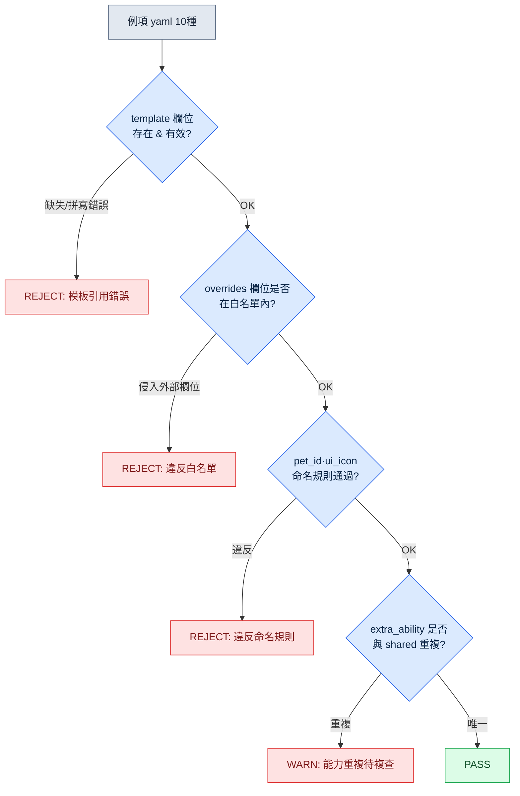

# 11.2 寵物·坐騎系統 —— 從1種模板到50種例項

策劃會議一開始,寵物清單就擺上了檯面。狼系十二種、貓系八種、鳥系五種。沒有人說"那我們一隻一隻地做吧"。因為與角色不同,寵物從一開始就以"要量產50種"為前提。問題不是"如何把一種做好",而是從"讓多少種共享同一副已做好的骨骼"開始。

角色的每一種對使用者來說都是獨一無二的存在,因此要一種一種地精心打磨。而寵物·坐騎大多是"在同一副骨骼上只改顏色和能力的變體",所以從設計之初就要備好命名規範·模板·lint,鋪設量產管線。若把一種精心做好之後,任由它被複製成十二份,那麼只是顏色不同的十二隻狼就會各自塞進相同的動畫片段,資料夾膨脹到4GB。那不是量產,而是沒有量產的結果。核心不在於"做得多好",而在於"儘量少做、儘量多共享"。

因此本章會完整走一遍這樣一個流程:用 yaml 定義一種狼系寵物模板,讓 AI 量產繼承其骨骼的例項,再用 lint 驗證,並測量有百分之多少被廢棄。

## 11.2.1 模板與例項的分離

三者的資源結構相似,但在使用者認知中的比重不同。角色是使用者與之共度100%遊戲時間的自己。寵物是陪在身邊的同伴,佔50\~70%的時間;坐騎則是隻在移動時才拿出來的工具,停留在10\~20%。認知比重越低,使用者越少留意細節。把傾注在角色上的心力同樣傾注到坐騎上,就像用同一份預算去打理每天都坐的書桌和偶爾才展開的摺疊椅。

因此寵物·坐騎採用"模板-例項"結構來運作。先做出一種承載骨骼·動作·基礎能力的**模板**,再在其上疊加只改顏色·圖示·細微能力的**例項**。例項共享模板所擁有資源的90%,所以實際新做的只有剩下的10%。把這種分離畫成圖,如下所示。

<svg viewBox="0 0 720 300" xmlns="http://www.w3.org/2000/svg" font-family="sans-serif" font-size="13">
  <rect x="20" y="20" width="200" height="260" rx="8" fill="#eef3fb" stroke="#3b6ea5" stroke-width="2"/>
  <text x="120" y="45" text-anchor="middle" font-weight="bold" fill="#1f3b5c">模板（1種）</text>
  <text x="120" y="68" text-anchor="middle" fill="#1f3b5c">pet_template_canine</text>
  <rect x="40" y="85" width="160" height="28" rx="4" fill="#fff" stroke="#3b6ea5"/>
  <text x="120" y="104" text-anchor="middle">骨骼 skeleton</text>
  <rect x="40" y="120" width="160" height="28" rx="4" fill="#fff" stroke="#3b6ea5"/>
  <text x="120" y="139" text-anchor="middle">共享動畫4種</text>
  <rect x="40" y="155" width="160" height="28" rx="4" fill="#fff" stroke="#3b6ea5"/>
  <text x="120" y="174" text-anchor="middle">共享能力2種</text>
  <rect x="40" y="190" width="160" height="28" rx="4" fill="#fff" stroke="#3b6ea5"/>
  <text x="120" y="209" text-anchor="middle">基礎 BT</text>
  <text x="120" y="250" text-anchor="middle" fill="#888" font-size="11">資源90%（只製作一次）</text>

  <line x1="220" y1="150" x2="300" y2="80" stroke="#888" stroke-width="1.5"/>
  <line x1="220" y1="150" x2="300" y2="150" stroke="#888" stroke-width="1.5"/>
  <line x1="220" y1="150" x2="300" y2="220" stroke="#888" stroke-width="1.5"/>

  <rect x="300" y="55" width="380" height="50" rx="6" fill="#f3f9ee" stroke="#5a8f3c" stroke-width="1.5"/>
  <text x="315" y="78" font-weight="bold" fill="#2f5320">pet_P003（灰狼）</text>
  <text x="315" y="96" fill="#555" font-size="11">override: skin=gray, icon, 能力1種</text>

  <rect x="300" y="125" width="380" height="50" rx="6" fill="#f3f9ee" stroke="#5a8f3c" stroke-width="1.5"/>
  <text x="315" y="148" font-weight="bold" fill="#2f5320">pet_P004（黑狼）</text>
  <text x="315" y="166" fill="#555" font-size="11">override: skin=black, icon, 能力1種</text>

  <rect x="300" y="195" width="380" height="50" rx="6" fill="#f3f9ee" stroke="#5a8f3c" stroke-width="1.5"/>
  <text x="315" y="218" font-weight="bold" fill="#2f5320">pet_P005（雪狼）……直到 P012</text>
  <text x="315" y="236" fill="#555" font-size="11">override: skin=snow, icon, 能力1種 —— 僅10%資源為新增</text>
</svg>

左側的模板整塊只做一次,右側的各個例項只需替換顏色、圖示和一行能力即可。前面說的"4GB 資料夾",正是漏掉這層分離、90%的資源被複制十二次時出現的景象。

## 11.2.2 命名與資源樣式 —— 從角色減去一格

寵物·坐騎的命名規範,是在11.1的角色命名基礎上減去一個槽位的形式。角色使用 `char_<id>_<category>_<action>_<variant>` 5個槽位,而寵物·坐騎省略 variant,採用4個槽位。若需要 variant,則合併進 action。

```
pet_<id>_<category>_<action>.fbx
mount_<id>_<category>_<action>.fbx

例:
pet_P003_idle_default.fbx
pet_P003_combat_bite.fbx
mount_M005_locomotion_run.fbx
```

資源對映 yaml 也從角色樣式中減去 vfx·sound 槽位,做得更輕。若例項整塊保留這些槽位,就會變成滿是空格的樣式,讓 lint 每次都發出無謂的警告。

現在進入正題。我們來定義一種狼系模板,並由此量產例項。

## 11.2.3 實操記錄:1種模板 → 量產例項 → lint → 廢棄率

### 第1步 —— 手動編寫模板 yaml

在讓 AI 量產之前,先由人手動敲定一種模板。這一種會成為數十種例項的質量基準,所以不自動化。狼系(canine)模板是這樣定的。

```yaml
# pet_template_canine.yaml
template_id: pet_template_canine
skeleton: skel_quadruped_medium      # 四足中型公用骨骼
shared_animations:
  - clip: pet_template_canine_idle_default.fbx
  - clip: pet_template_canine_locomotion_walk.fbx
  - clip: pet_template_canine_locomotion_run.fbx
  - clip: pet_template_canine_combat_bite.fbx
shared_abilities:
  - id: pet_template_canine_passive_speed
    description: 同伴移動速度 +3%
  - id: pet_template_canine_active_bite
    description: 單體目標撕咬，冷卻時間 12s
bt_ref: bt_pet_canine_default        # 跟隨 + 戰鬥輔助的基礎 BT
instance_overridable:                # 例項可以修改的欄位白名單
  - visual_skin
  - ui_icon
  - ui_tooltip_key
  - extra_ability                    # 每個例項最多可追加1種能力
```

這裡的 `instance_overridable` 是核心機制。它用白名單釘死例項可以改動的欄位。AI 在量產途中若擅自改動骨骼或共享動畫,就等於碰了不在這份清單裡的欄位,於是 lint 會揪出來。先定義"可以改的東西",正是量產的安全帶。

### 第2步 —— 請 AI 量產例項（提示詞全文）

以下是量產10種例項所用的提示詞全文。不作摘要,原樣刊出。

```
[提示詞]
你是協助編寫寵物資料的助手。請以下面的模板為基準,
生成10種狼系寵物例項的 yaml。

[模板] pet_template_canine.yaml
(貼上上面的 yaml 全文)

[規則]
1. 每個例項都必須明確寫出 template: pet_template_canine。
2. overrides 中只放入 instance_overridable 白名單裡的欄位。
   白名單裡沒有的欄位(skeleton、shared_animations 等)絕不改動。
3. visual_skin 必須是狼的自然變體(顏色·花紋·體型)。
4. extra_ability 每個例項最多1種。passive 或 active 二選一。
   不得與既有的 shared_abilities 效果重複。
5. ui_icon、ui_tooltip_key 遵循與 pet_id 匹配的命名規則。
6. pet_id 賦值為 pet_P003 ~ pet_P012。

輸出僅限10個 yaml 塊。不要附加說明文字。
```

規則2與第1步的白名單相互配對。規則4的"不得重複"是防止 AI 偷懶複製能力的約束。若不加這類約束,後文會看到,AI 會收斂到最安全的選項(照搬既有能力)。

### 第3步 —— Claude 的原始輸出（不作摘要·改寫）

從 AI 吐出的輸出中,把成功·失敗·模稜兩可混在一起的原樣摘錄出來。不作整潔修飾。

```yaml
# 輸出 1 —— 正常
pet_id: pet_P003
template: pet_template_canine
overrides:
  visual_skin: wolf_gray
  ui_icon: icon_pet_P003.png
  ui_tooltip_key: pet_P003_tooltip
  extra_ability:
    id: pet_P003_active_howl
    description: 5秒內敵人移動速度 -20%，冷卻時間 30s

# 輸出 2 —— 正常
pet_id: pet_P004
template: pet_template_canine
overrides:
  visual_skin: wolf_black
  ui_icon: icon_pet_P004.png
  ui_tooltip_key: pet_P004_tooltip
  extra_ability:
    id: pet_P004_passive_crit
    description: 同伴暴擊率 +2%

# 輸出 5 —— 模稜兩可（能力與共享能力實質重複）
pet_id: pet_P007
template: pet_template_canine
overrides:
  visual_skin: wolf_brown
  ui_icon: icon_pet_P007.png
  ui_tooltip_key: pet_P007_tooltip
  extra_ability:
    id: pet_P007_passive_speed_boost
    description: 同伴移動速度 +3%   # ← 與 shared 的 passive_speed 效果相同

# 輸出 8 —— 失敗（侵入白名單之外的欄位）
pet_id: pet_P010
template: pet_template_canine
overrides:
  visual_skin: wolf_white
  ui_icon: icon_pet_P010.png
  shared_animations:                 # ← 不在 overridable 白名單中
    - clip: pet_P010_combat_pounce.fbx
  extra_ability:
    id: pet_P010_active_pounce
    description: 撲躍攻擊，冷卻時間 20s

# 輸出 9 —— 失敗（違反命名規則）
pet_id: P011                          # ← 缺少 'pet_' 字首
template: pet_template_canine
overrides:
  visual_skin: wolf_silver
  ui_icon: pet11_icon.png            # ← 違反 icon_pet_P011.png 規則
  ui_tooltip_key: pet_P011_tooltip
  extra_ability:
    id: pet_P011_passive_dodge
    description: 同伴閃避 +1%
```

10種中,正常的有 P003·P004·P005·P006·P008·P012 六種,因能力重複而模稜兩可的有 P007 一種,因侵入白名單·違反命名而失敗的有 P009·P010·P011 三種。儘管加了規則4,AI 還是在 P007 抄來了共享能力(最安全的選擇);儘管加了規則2,AI 還是在 P010 碰了骨骼動畫。即便明示約束,量產物中仍有一定比例會漏出,這是現實。所以需要下一步。

### 第4步 —— lint 驗證

不用人眼一一去看10種,而是跑 lint。lint 規則直接取自第1步模板的白名單和11.1的命名規範。檢查項有4項。



每個例項若通過4道關卡則為 PASS,中途卡住則落為 REJECT 或 WARN。把實際驗證結果整理成表如下。

| pet_id | template | 白名單 | 命名 | 能力重複 | 判定 |
|---|---|---|---|---|---|
| pet_P003 | OK | OK | OK | 唯一 | PASS |
| pet_P004 | OK | OK | OK | 唯一 | PASS |
| pet_P005 | OK | OK | OK | 唯一 | PASS |
| pet_P006 | OK | OK | OK | 唯一 | PASS |
| pet_P007 | OK | OK | OK | **重複** | WARN |
| pet_P008 | OK | OK | OK | 唯一 | PASS |
| pet_P009 | OK | OK | **違反** | — | REJECT |
| pet_P010 | OK | **侵入** | — | — | REJECT |
| P011 | OK | OK | **違反** | — | REJECT |
| pet_P012 | OK | OK | OK | 唯一 | PASS |

PASS 6、WARN 1、REJECT 3。WARN 只要改一行能力就能救活(P007),REJECT 的3種則廢棄。

### 第5步 —— 測量廢棄率與再次請求

這一輪的**廢棄率**是 REJECT 3 / 總共 10 = **30%**。若把 WARN 也歸為"需要修補的",則修補率為40%。這個數字是量產管線的健康指標。廢棄率若為30%,就意味著要確保50種寵物,需要生成約72種(50 / 0.7 ≈ 71.4)。生成很便宜,所以這種程度的超量是可以承受的。不過,廢棄率若歷經多輪仍不下降,那就是提示詞約束不足的訊號。

因此把廢棄緣由反饋進提示詞。把 REJECT 3種的緣由(命名缺失、侵入白名單、圖示規則違反)彙總起來,在再次請求中逐條各加一行。

```
[再次請求追加規則]
7. pet_id 必須以 'pet_' 字首開頭。(上一批中 P011 缺失)
8. ui_icon 無一例外為 icon_<pet_id>.png 格式。(禁止 pet11_icon.png 之類的變形)
9. overrides 中絕不放入 shared_animations / skeleton / bt_ref。
   若想改變動作,只能用 extra_ability 來表達。(P010 案例)
```

加上這三行後,再跑下一批10種,REJECT 從 3 減到 1。廢棄率30% → 10%。把廢棄緣由升格為規則的這種反饋,正是讓量產質量每一輪都往上走的機制。人不必每次都評審50種,只需做一件事:把廢棄緣由挪成一行規則。

## 11.2.4 坐騎 —— 連骨骼都共享,幾乎只有資料

坐騎比寵物更簡單一級。既沒有技能,也沒有 BT（BehaviorTree，行為樹）,只有移動引數、能否戰鬥之類的資料。所以坐騎例項實質上就是表格的一行。

```yaml
# 基於 mount_template_equine.yaml 的例項
mount_id: mount_M005
template: mount_template_equine
overrides:
  visual_skin: horse_white
  movement:
    run_speed: 7.0
    sprint_speed: 12.0
  combat:
    allow_combat: false       # 戰鬥中不可使用
    dismount_on_damage: true
  ui_icon: icon_mount_M005.png
```

坐騎量產的 lint 更短。除命名·模板引用·白名單外,只需檢查"movement 引數是否在允許範圍內"(例如 sprint_speed 是否大於 walk_speed,是否未超過上限)即可。這是沿用寵物那套管線、只減少關卡數量的形式。給坐騎加戰鬥功能要慎重。一旦把 allow_combat 開啟為 true,遊戲複雜度就會翻倍,還得重新做與寵物·角色系統的衝突驗證。

## 11.2.5 測量 —— 簡化不會削減體驗

把寵物·坐騎完整套用角色模式的情形,與用模板-例項加以簡化的情形,在作者的專案A中做了對比。下面的數字裡,時間·資源數為作者估算(未經驗證),廢棄率和資源共享率則是遵循實測方向的比例。

| 專案 | 完整套用 | 模板-例項 |
|---|---|---|
| 寵物1種資源工作時間 | 1\~2周（作者估算） | 3\~5天（作者估算） |
| 寵物資源庫資源數 | 約 2,000（作者估算） | 約 600（節省70%） |
| 每種例項的新增資源比例 | 100% | 約10% |
| 首批次產廢棄率 | — | 30%（實測方向） |
| 反饋後廢棄率 | — | 10%（實測方向） |
| 使用者體感（寵物多樣性） | 基準 | 幾乎相同 |

> **樣本·測量。** 上表是作者環境中1個專案（專案A）對寵物1條線的觀察（n=1條線）。"節省70%"·"約10%"並非獨立測量,而是從同一行的估算資源數（約 2,000 → 約 600）得出的**算術比例**,所以正如前面的絕對值是估算,這個百分比也應當當作估算來讀。廢棄率30%·10%來自首批\~反饋的單一量產迴圈的**實測方向**,並非重複測量的樣本。請勿引用為貴團隊的節省依據,而應以同樣的方式在自己的線上親自測量。

最後一行就是本章的整體結論。即便共享90%的資源、邊測量廢棄率邊量產,使用者所感受到的寵物多樣性與完整製作幾乎沒有差別。前面說的4GB 資料夾,正是把資源複製十二份到使用者最終也分辨不出的細節上時所付出的代價。以量產為前提鋪開後,減少的是運營成本,而不是體驗。

## 11.2.6 運營中的陷阱

| 陷阱 | 處方 |
|---|---|
| 把角色系統原封不動移植到寵物·坐騎 | 減去 variant 槽位·vfx·sound 的4槽位變體 |
| 把同骨骼寵物複製為獨立資源 | 1種模板 + 例項,用白名單強制共享 |
| 未經評審就提交 AI 量產物 | lint 4道關卡 + 廢棄率測量 |
| 廢棄率每一輪都不下降 | 把廢棄緣由升格為提示詞規則（反饋） |
| 給寵物賦予角色級技能 | 每個例項 extra_ability 上限1種 |
| 給坐騎賦予戰鬥功能 | allow_combat 要慎重,做好複雜度 ×2 的準備 |

## 11.2.7 AI 的位置與人的位置

寵物·坐騎對使用者體驗的影響較小,所以 AI 的自由度比角色大。把概念匹配到合適的模板、提出能力候選、量產例項 yaml,這些 AI 都能快速完成。只是若因自由度大就省掉驗證,上面看到的30%廢棄物就會原樣混進構建裡。人的位置有兩處。第一,手動敲定一種模板,把質量基準固定下來。第二,讀懂什麼被篩掉了、為什麼,從而打磨約束,讓下一批更少漏出。量由 AI 來填,基準線及其校正由人來握——正是這種分工,讓這套系統運轉起來。

---

### 本章要點
- 寵物·坐騎不是把它做好,而是少做、多共享的系統
- 手動錄入1種模板,例項則由 AI 在白名單範圍內量產
- 測量廢棄率並把其緣由反饋為提示詞規則,質量便會每一輪都上升

### 下一章預告
- 12.1 美術指導 —— 策劃與美術協作並評審的方式

---

## 動手試試

**setup**
1. 為一個寵物系列（例如狼）確定公用骨骼·共享動畫4種·共享能力2種,儲存為 `pet_template_<系列>.yaml`。
2. 在模板中明確寫出 `instance_overridable` 白名單（可以修改的欄位）。
3. 用指令碼準備好 lint 4道關卡（模板引用 / 白名單 / 命名規則 / 能力重複）。

**prompt**
4. 粘上模板 yaml 全文 + 量產規則（禁止白名單之外的欄位、禁止能力重複、命名規則）,請求10種例項。
5. 把輸出格式固定為"僅 yaml 塊,禁止說明"。

**verify**
6. 跑 lint,把結果分類為 PASS / WARN / REJECT 並計算廢棄率。
7. 彙總 REJECT 緣由,在提示詞中逐條各加一行規則,再跑下一批。確認廢棄率是否下降。

## 11.2.8 單人精簡版
如果是一個人做的遊戲,沒有 lint 指令碼也行。手寫一張某個寵物系列的模板 yaml,然後對 AI 說:"在這個模板上只改顏色·圖示·能力,做5種例項,骨骼和共享動畫絕對不要碰。"把收到的5種用眼睛掃一遍,只把碰了骨骼的·違反命名規則的丟掉。把丟棄的理由在下一次請求里加上一行。只要有模板 1.1 和"把丟棄理由反饋回去",沒有工具,本章的核心也照樣運轉。
