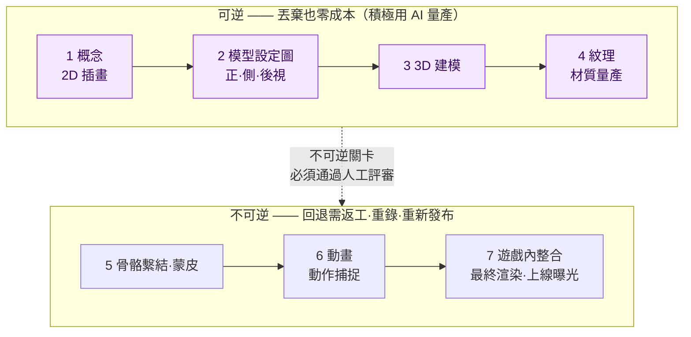
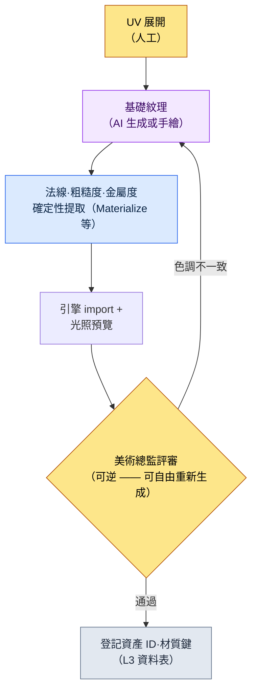

# 12.1 AI 美術資產管線 —— 在可逆階段量產，在不可逆關卡前停下

> 主要讀者：與美術團隊協作的遊戲策劃·美術總監（中等規模（10\~50 人）團隊）
> 面向個人/業餘讀者的精簡版：§12.1.8「一個人的話，做到這些就夠」

我記得把 AI 生成的 100 張概念圖貼在會議室牆上的那一天。30 秒內打印出的 100 張裡，美術總監選中的只有 3 張，其餘 97 張當場被丟棄。有人把這叫作“97% 的浪費”。可如果是手繪，畫師為了抵達那 3 張，大概要花上兩週。什麼才是浪費，在這裡被顛倒了過來。

本章討論的，是把這種顛倒轉化為運營的方法。核心只有一句話。**AI 美術在可逆階段（概念·紋理探索）可以盡情量產，而在不可逆階段（最終渲染·動作捕捉·併入構建）之前，設一道由人把守的關卡。** 在可以丟棄的地方就丟掉 99 張，在無法回退的地方則一張也不隨意放行。美術工具的用法在別的書裡已足夠多，本章只專注於*把這些工具安全地嵌入策劃管線的那個位置*。

---

## 12.1.1 美術管線上存在一條可回退的界線

美術資產從概念走到遊戲內，一共 7 個階段。把作者專案（以下稱“專案A”）的角色資產流程原樣搬過來就是這樣。重要的不是階段數量，而是穿過其正中央的**可逆/不可逆分界線**。



左側四個階段（概念\~紋理）是**可逆**的。抽出 100 張概念圖丟掉 97 張，損失的只是 token 成本；紋理重新生成五次，覆蓋掉檔案就結束了。所以這一段是 AI 量產能帶來最大 ROI（Return on Investment，投資回報）的位置。量產工具以自託管的 Stable Diffusion（SDXL）/ComfyUI 為主軸。原因是 IP 保護 —— 不把資產上傳到外部的封閉服務，而在本地執行，並用以角色微調過的 LoRA 與 ControlNet，在每次反覆生成時控制同一人物的一致性。封閉式工具（Midjourney 等）只在快速鋪開初期情緒板時有限使用，而需要一致性·反覆控制的正式量產則交回 SD/ComfyUI。

右側三個階段（骨骼繫結之後）是**不可逆**的。動作捕捉會繫結錄製棚·演員的檔期，最終渲染併入構建、上線曝光後，就會伴隨玩家的記憶與社群的反應。一旦跨過去，回退的成本會大於製作的成本。所以在分界線上立起一道**由人把守的關卡**。無論 AI 在可逆區間量產多少，能跨入不可逆的資產，只有通過人工評審的那些。

這一張圖就是本章的骨架。“AI 在美術上用到什麼程度”這個問題，其實是“這項工作在分界線的哪一側”的問題。

---

## 12.1.2 [實操記錄] 一個概念，從量產到廢棄·再請求的全過程

這裡把可逆區間的第一步——概念量產，完整展示一個週期。若只是抽象地寫“AI 生成概念”，就無法知道真正產出了什麼、又廢棄了什麼。下面是對專案A中量產學者公會資深 NPC 概念的一次會話的忠實再現——一份實操記錄（worked transcript，即完整保留的真實操作過程記錄）。提示詞可以直接複製使用，輸出則由真實會話重構而來。

### 第 1 步 —— 輸入：先明確策劃意圖

這裡有一個最常出錯的地方。就是把提示詞以“視覺描述”開頭。公司的反饋 atom `image_prompt_design_intent_first` 所固化的原則恰恰相反 —— **影像提示詞也是設計意圖優先**。不是羅列外形形容詞，而是把這個角色在遊戲中承擔什麼功能·敘事放在前面。

```yaml
# concept_brief_scholar_senior.yaml —— 概念量產輸入
asset_id: npc_scholar_senior_01
role: 學者公會資深成員 —— 最先觀測到封印減弱的人物
function: 主線任務釋出 NPC（玩家必須信任的資訊源）
narrative_seed:
  - 30 年間在鐘塔記錄封印脈絡的人
  - 把情感藏在數字背後（scholarly_strict 基調）
style_anchor: semi-realistic, painted, 東亞奇幻   # 在 L0 願景中固定
forbidden: anime 風格 · 現代服飾 · 普通奇幻法師長袍
```

`function` 與 `narrative_seed` 在外形之前。只有當輸入本身握著“為什麼這個角色必須長成這樣”，才能在量產結果中判斷“為什麼這個更好”。

### 第 2 步 —— 提示詞：量產，但強制格式與禁忌

```
基於附上的 concept_brief，生成 6 個角色概念方向提案。
這是用於探索的量產 —— 不是最終稿，而是供美術總監挑選的候選。

規則：
1) 把 function 與 narrative_seed 翻譯為視覺。禁止單純的美型。
   （例：“把情感藏在數字背後” → 用表情·道具·姿態如何體現）
2) 不要偏離 style_anchor。forbidden 項絕對禁止。
3) 6 個方案彼此須有足夠差異。細微變體的 6 張沒有探索價值。
4) 為每個方案附上一行意圖依據（為什麼這個方向契合 function）。
5) 你懷疑‘可能與 style_anchor 衝突’的方案，單獨標註出來。

輸出格式：（方案編號 | 核心視覺 | 意圖依據 | 疑似衝突）。除此之外不要任何說明。
```

在這段提示詞裡，視覺描述所佔的篇幅幾乎沒有。大部分都用在鎖定輸出格式、釘死禁忌上。因為一旦給 AI 自由，它就會迴歸到訓練資料的平均值——普通奇幻法師。**意圖翻譯義務、固定 style_anchor、強制 6 個方案的多樣性，以及“若有衝突就上報”這條退路**，是阻止迴歸的四道門閂。

### 第 3 步 —— Claude 的輸出（重構，節選）

```
| 方案 | 核心視覺                             | 意圖依據                          | 衝突 |
|------|--------------------------------------|-----------------------------------|------|
| 1    | 黃銅放大鏡永久佩戴，墨漬手指          | 觀測即身份 —— 工具被身體化        |      |
| 2    | 面無表情的老學者，手持帶刻度盤的卷軸   | 把情感藏在數字背後 = 無表情+記錄物 |      |
| 3    | 鐘塔背景，身後冷卻中的封印脈絡之光      | 職務空間說明人物                  |      |
| 4    | 華麗的星紋刺繡長袍，手持魔力球體        | 強調威嚴                          | ★    |
| 5    | 一隻眼為義眼，畢生觀測的痕跡           | 30 年職務的身體代價               |      |
| 6    | 年輕端正的學者，強調美型               | 好感度優先                        | ★    |
```

輸出中最有價值的不是表格，而是**標了 ★ 的兩行**。AI 自己在 4 號方案（華麗法師長袍、魔力球體）與 6 號方案（美型優先）上上報了“可能與 style_anchor·forbidden 衝突”。若沒有第 5 條規則那條退路，這兩個方案就會以與其餘四個方案一模一樣的面孔混進表裡。讓 AI 自己舉手標出可疑之處 —— 這正是自由量產與受控量產的分野。

### 第 4 步 —— 驗證與否決（人的位置）

不會原樣接收這份輸出。美術總監會拿 brief 把 6 個方案過一遍。實際上在這次會話裡，判定是這樣分開的。

- **廢棄 4 號方案。** 正如 AI 所上報的。“手持魔力球體的星紋刺繡長袍”正面違反了 `forbidden: 普通奇幻法師長袍`。這個角色不是使用魔法的人，而是*觀測·記錄*魔力的人。function 誤譯。
- **廢棄 6 號方案。** 美型優先與 `narrative_seed: 30 年職務的身體代價` 相悖。這個 NPC 的說服力來自“做了很久的人”的磨損。年輕乾淨的臉會削弱敘事。
- **採用 1·5 號方案，擱置 2·3 號方案。** 1 號方案（放大鏡身體化）與 5 號方案（義眼）精確契合了“工具·職務塑造人物”的意圖。

這裡廢棄的 2 件不是損失。若是手繪，要弄清這兩個方向是錯的得花上好幾天，而量產把 6 個方案同時鋪開，在一小時之內就篩掉了它們。

### 第 5 步 —— 再請求

```
將 1 號方案（放大鏡身體化）與 5 號方案（義眼）的方向合併。
- 把黃銅放大鏡 + 一隻義眼整合到同一人物
- 情感剋制（scholarly_strict）：表情為無，僅用道具訴說職務
- 再次確認 forbidden：法師長袍·魔力球體·強調美型全部禁止
這是要生成‘最終候選 1 案’、交給美術總監手工精修的階段。
```

AI 再次給出了把放大鏡與義眼整合到一位老學者身上的單一方向，那一張圖交到概念美術師的桌上，由手工收尾。**量產（6 案） → 廢棄（2 案） → 收斂（1 案） → 人工收尾**的一個週期在這裡閉合。AI 做出的不是最終資產，而是供美術總監挑選的候選範圍。

這一整圈就是本書全書的 Show 標準。若沒有哪怕一次從頭看到尾——AI 吐出了什麼、什麼被廢棄、人又收尾了什麼——那麼“用 AI 量產了概念”這句話就是空洞的。

---

## 12.1.3 廢棄率高，是探索深入的訊號

在上面這次會話裡，6 個方案中有 2 個被廢棄。若從整條概念線來看，廢棄會堆得多得多。貼在會議室牆上的 100 張裡，採用的只有 3 張。

要誠實地對待這個比例。這是親自數了匯入初期幾次概念會話得到的方向值，而不是精確的總體比例（作者估算，未經驗證——會隨角色性格·brief 質量大幅波動）。因此，應當把它當作**“比起手工時期，廢棄變得自由得多”這個方向**來讀，而不是“精確的百分之幾”。

重要的是，廢棄率 0% 並不是目標。一張紙很貴，就會把一張紙打磨到底。100 張紙在 30 秒內印出，丟掉 99 張也沒有負擔，探索的幅度也隨之變寬。**廢棄率上升，是探索深度加深的訊號**。試圖壓低廢棄率本身的運營——比如“AI 生成的東西差不多就用吧”這種壓力——會把探索的價值一起削掉。§12.1.2 中之所以能毫不猶豫地丟棄 4·6 號方案，正是因為丟棄的成本為 0。

---

## 12.1.4 紋理量產 —— 可逆區間的第二個位置

與概念一併，在可逆區間裡 ROI 很大的另一個位置就是紋理。這是為 3D 模型生成材質的階段，而這裡 AI 介入的格子與確定性負責的格子也劃分得很清楚。



AI 介入的只有**基礎紋理**一格。法線·粗糙度·金屬度這類 PBR 貼圖不會讓 AI 每次生成得都不一樣，而是交給確定性提取工具。因為只有從同一基礎生成同一貼圖，材質才會一致。這與 §6.2 城市生成器中不把獎勵曲線交給 AI、而由規則手冊把控是同樣的分工 —— **能用確定性保證的交給程式碼，需要探索的交給 AI。**

即便是基礎紋理，也並非對所有資產都適合用 AI。像角色面部這種細微細節左右遊戲辨識度的地方，依然以人手為先。所以當評審關卡抓到“色調不一致”時，不是自動廢棄，而是退回去重新生成。到這裡為止全都在分界線左側 —— 無論重跑多少次都不會有損失的可逆區間。

---

## 12.1.5 不可逆關卡 —— 一致性驗證與視覺迴歸

在跨過分界線之前，檢查可逆區間量產的資產是否與整個遊戲的調性相違。這是一處僅憑人眼會漏看的地方，所以先由程式碼打第一遍。

```python
# visual_regression.py —— 資產替換時檢測意圖之外的變化（骨架）
# 輸入: 資產 ID + 替換前/後相同條件的渲染截圖
# 輸出: 變化等級（向人工評審關卡發出 alert）

def compare_renders(asset_id, before_png, after_png, threshold=(1.0, 5.0)):
    diff = pixel_diff(before_png, after_png)   # 歸一化到 0~100
    if diff > threshold[1]:
        return ("BLOCK", f"{asset_id}: 變化較大 {diff:.1f}% —— 評審前禁止進入不可逆")
    elif diff > threshold[0]:
        return ("WARN",  f"{asset_id}: 輕微變化 {diff:.1f}% —— 需確認是否為有意變更")
    else:
        return ("PASS",  f"{asset_id}: 無變化")
```

這 30 行，會在進入不可逆*之前*就抓住“換了一張紋理，結果另一個角色的陰影就崩了”這類事故。關鍵的設計在於，`BLOCK` 不是自動廢棄，而是**只向評審關卡發出 alert** —— 如果連有意的變更（重新設計）都被程式碼扼殺，畫師們在一兩個季度內就會說“關掉吧”。可疑的候選由機器挑出，但是否放行到不可逆，由人來決定。

評審要抓的另一件事是**風格一致性**。AI 的輸出每次都會有細微差異，所以量產出的概念·紋理是否維持遊戲的質感，由人來做最後的把關。只有通過這道關卡的，才會進入骨骼繫結·動作捕捉·最終渲染這些不可逆階段。因為一旦捕捉了動作並併入構建，一致性事故就只能靠返工·重錄·重新發布來修復。

---

## 12.1.6 交給美術團隊的只有決定 —— md→html→sync

即便策劃用 AI 量產了概念·紋理，真正畫圖的美術團隊仍是另一個組織。這裡協作的核心，是**讓美術團隊不必學習策劃團隊的工具·約定**。專案A的美術指南（`96_ArtGuide/`）用自動化來解決這一點。

美術決定由策劃團隊用 md 寫，`_convert_md_to_html.py` 轉換成 html，再由 `_SyncToArtRepo.bat` push 到獨立的美術倉庫。美術團隊在那個倉庫裡只看 html —— 既不用懂 md 約定，也不用懂策劃團隊的 SVN（管線示意圖見 §12.2.4）。

而且這份決定文件被分成 7 個域（`00_Common`·`01_Character`\~`07_Env`），各自握著自己的風格規則，在統一關卡處匯合。這就是下一章（12.2）要講的 ArtGuide 7 個領域，先只說核心就是 —— **把風格規則手冊不放進一格、而是分成 7 格抽屜，AI 量產提示詞就不必每次在畫師腦中重新組裝，而是從抽屜裡取出。** §12.1.2 的 `style_anchor`·`forbidden` 正是從那些抽屜裡取出的輸入。只有規則手冊被分開，量產結果才不會迴歸到普通奇幻的平均值。

但這並不意味著每款遊戲都得湊齊 7 個領域。若是休閒品類，角色·環境兩格也就夠了。分離要循序漸進，介面要保持狹窄。

---

## 12.1.7 誠實對待數值與風險的方法

本章的數值只有三類。(1) **方向·比例** —— “量產 100 張採用 3 張”是基於作者經驗的方向值（未經驗證），因此不當作絕對值，而是讀作“在可逆區間廢棄成本收斂於 0”這個方向。(2) **測量值** —— 視覺迴歸變化率（`diff %`）、一致性事故件數、BLOCK 處理件數由 `visual_regression.py` 以數字吐出，因此在會議上可以用數字而非“感覺”來說話。反過來，“留存率上升了”並不由單一美術左右，所以不對因果下定論。

(3) **把風險放進運營成本之內**。AI 美術的三重風險——訓練資料版權、風格一致性受損、美術師的崗位——不在 ROI 計算之外，而在其內。作者的方針是：可逆區間積極用 AI，跨入不可逆的最終資產為手工精修，而直接進入構建的資產其 AI 輸出比例以 0 為原則。不過這只是一種政策 —— 也有團隊只用許可明確的模型，連最終資產也用 AI。法務政策因公司而異，本書給出的不是標準答案，而是劃分界線的方法。

三重風險中最常被忽略的是第三個。如果不把 AI 定位為“拓寬探索幅度、增大美術師決定權的輔助”，而是當成“取代美術師的量產機”，那麼這個工具即便在 KPI 上成功，也會被組織拒絕。這也是 feedback atom `design_intent_vs_automation_boundary`（設計意圖 vs 自動化邊界）所固化的地方。

---

## 12.1.8 常見的失敗

| 模式 | 為何失敗 | 處方 |
|---|---|---|
| 把 AI 概念直接作為最終資產投入構建 | 未經人工評審就通過不可逆階段 | 分界線前設關卡（§12.1.1） |
| 提示詞以外形描述開頭 | function 誤譯 —— 迴歸為美型法師 | 設計意圖優先（§12.1.2，`image_prompt_design_intent_first`） |
| 量產的 6 個方案是細微變體 | 無探索價值，沒有可廢棄的 | 強制多樣性（§12.1.2） |
| 試圖壓低廢棄率 | 把探索深度一起削掉 | 把可逆區間的廢棄視為訊號（§12.1.3） |
| 連紋理 PBR 貼圖也用 AI 生成 | 材質一致性每次呼叫都晃動 | 分離出確定性提取（§12.1.4） |
| 不做視覺迴歸就替換資產 | 意圖之外的變化漏進不可逆 | `visual_regression.py` 關卡（§12.1.5） |

---

## 12.1.9 動手試試 —— 今天就能做的一步

> **一個人的話，做到這些就夠**：沒有美術團隊、也沒有資料表也無妨。挑選你自己遊戲（或你喜歡的遊戲）裡的一個 NPC，按 §12.1.2 的 `concept_brief` 格式，*先於外形*寫下 `function` 與 `narrative_seed`，再把 6 案量產提示詞原樣貼上去跑一次。從跑出的 6 個方案裡挑一個與意圖相悖的，試著反駁“這是 function 誤譯，廢棄重來”，你就會親身體會到：可逆區間的廢棄不是損失，而是探索。

如果是團隊，就從下面這一步開始。在管線上**明確地畫一條可逆/不可逆分界線**（§12.1.1）。就“到哪個階段為止是‘丟棄也為 0’、從哪裡起是‘回退很貴’”達成一致，並在那條界線上設一道人工評審關卡。界線一旦畫好，“AI 用到哪裡”這場每次都從頭打起的爭論，就會變成“這項工作在界線哪一側”的一次性判定。

用 setup → prompt → verify 概括就是 —— **setup**：在管線上定義可逆/不可逆分界線與評審關卡。**prompt**：按 §12.1.2 的格式先輸入設計意圖，量產 6 案，同時強制禁忌·多樣性·上報。**verify**：在可逆區間親自挑出 1 件意圖誤譯，用廢棄·再請求閉合一個週期，並在進入不可逆之前用 `visual_regression.py` 打一遍意圖之外的變化。

---

### 本章要點
- 在可逆區間（概念·紋理）量產，在不可逆關卡前做人工評審。
- 廢棄率上升是探索加深的訊號，而不是工具失敗。
- 影像提示詞也應先輸入設計意圖，而不是外形。

### 下一章預告
- 12.2 ArtGuide 7 個領域 —— 把風格規則手冊分成 7 格抽屜，守住量產的一致性

---
