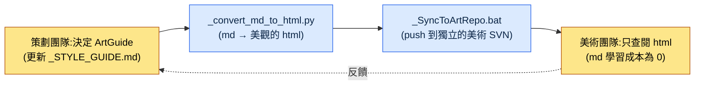

# 12.2 ArtGuide 七大領域(角色·動畫·怪物·NPC·VFX·UI·環境)

週四的整合評審。當我們把七個新資產貼在同一螢幕上一看,所有人同時笑了。學者角色是灰色調、沉穩的剪影,而在它旁邊炸開的技能 VFX 卻是熒光粉。兩者在各自的領域裡都是完美的決定。角色總監嚴格遵守了自己的 `_STYLE_GUIDE.md`,VFX 美術也忠實執行了我"要顯眼"的規格要求。誰都沒有錯,可放在同一螢幕上,兩款遊戲卻在互相打架。

這一幕既是把 ArtGuide 拆成七大領域的理由,也是必須把七大領域重新捆在一起的理由。ArtGuide 是遊戲的視覺憲法。按領域劃分,各領域總監就擁有了自治權,決策隨之加快;而若不通過整合評審重新捆合,上面那種熒光粉式的事故就會一個季度一個季度地累積。策劃在這一平衡的哪個點上落手,便是本章的全部內容。

---

## 12.2.1 一張資產:七大領域的真實結構

在筆者擔任總監的專案A(東方奇幻基調、移動優先的 MMORPG)的設計倉庫裡,有一個名為 `96_ArtGuide/` 的資料夾。編號 `96` 是為了讓美術指南在倉庫排序規則下排到幾乎最後而加上的,其下則分成七個領域。這不是抽象的"專案美術資料夾",下面就是該資料夾的真實子結構。

<svg viewBox="0 0 760 360" xmlns="http://www.w3.org/2000/svg" font-family="sans-serif" font-size="13">
  <rect x="300" y="10" width="160" height="40" rx="6" fill="#2c3e50"/>
  <text x="380" y="35" fill="#fff" text-anchor="middle" font-size="14">96_ArtGuide/</text>
  <line x1="380" y1="50" x2="380" y2="70" stroke="#888" stroke-width="1.5"/>
  <line x1="70" y1="70" x2="690" y2="70" stroke="#888" stroke-width="1.5"/>
  <!-- 7 domain boxes -->
  <g>
    <rect x="20" y="70" width="100" height="70" rx="5" fill="#e8f0fe" stroke="#4285f4"/>
    <text x="70" y="92" text-anchor="middle" font-weight="bold">00_Common</text>
    <text x="70" y="112" text-anchor="middle" font-size="11">通用規約</text>
    <text x="70" y="128" text-anchor="middle" font-size="11">調色盤·規則</text>
  </g>
  <g>
    <rect x="130" y="70" width="100" height="70" rx="5" fill="#fce8e6" stroke="#ea4335"/>
    <text x="180" y="92" text-anchor="middle" font-weight="bold">01_Character</text>
    <text x="180" y="112" text-anchor="middle" font-size="11">玩家</text>
    <text x="180" y="128" text-anchor="middle" font-size="11">角色</text>
  </g>
  <g>
    <rect x="240" y="70" width="100" height="70" rx="5" fill="#e6f4ea" stroke="#34a853"/>
    <text x="290" y="92" text-anchor="middle" font-weight="bold">02_Animation</text>
    <text x="290" y="112" text-anchor="middle" font-size="11">所有</text>
    <text x="290" y="128" text-anchor="middle" font-size="11">動畫</text>
  </g>
  <g>
    <rect x="350" y="70" width="100" height="70" rx="5" fill="#fef7e0" stroke="#fbbc04"/>
    <text x="400" y="92" text-anchor="middle" font-weight="bold">03_Monster</text>
    <text x="400" y="112" text-anchor="middle" font-size="11">敵方NPC</text>
    <text x="400" y="128" text-anchor="middle" font-size="11">視覺</text>
  </g>
  <g>
    <rect x="460" y="70" width="100" height="70" rx="5" fill="#e8f0fe" stroke="#4285f4"/>
    <text x="510" y="92" text-anchor="middle" font-weight="bold">04_NPC</text>
    <text x="510" y="112" text-anchor="middle" font-size="11">友好NPC</text>
    <text x="510" y="128" text-anchor="middle" font-size="11">關係·voice</text>
  </g>
  <g>
    <rect x="570" y="70" width="100" height="70" rx="5" fill="#fce8e6" stroke="#ea4335"/>
    <text x="620" y="92" text-anchor="middle" font-weight="bold">05_VFX</text>
    <text x="620" y="112" text-anchor="middle" font-size="11">視覺效果</text>
    <text x="620" y="128" text-anchor="middle" font-size="11">技能·演出</text>
  </g>
  <g>
    <rect x="680" y="70" width="70" height="70" rx="5" fill="#e6f4ea" stroke="#34a853"/>
    <text x="715" y="92" text-anchor="middle" font-weight="bold" font-size="11">06_UI</text>
    <text x="715" y="112" text-anchor="middle" font-size="10">畫面·HUD</text>
    <text x="715" y="128" text-anchor="middle" font-size="10">(9.3)</text>
  </g>
  <!-- 07 on second row -->
  <line x1="380" y1="140" x2="380" y2="170" stroke="#888" stroke-width="1"/>
  <g>
    <rect x="300" y="170" width="160" height="60" rx="5" fill="#fef7e0" stroke="#fbbc04"/>
    <text x="380" y="195" text-anchor="middle" font-weight="bold">07_Environment</text>
    <text x="380" y="216" text-anchor="middle" font-size="11">背景·道具·地標</text>
  </g>
  <!-- footer note -->
  <text x="380" y="280" text-anchor="middle" font-size="12" fill="#555">每個領域 = 總監/資深1人自治 + 各領域 _STYLE_GUIDE.md(憲法)</text>
  <text x="380" y="305" text-anchor="middle" font-size="12" fill="#555">00_Common = 橫跨七個領域之上的通用上位規約(色彩·材質·時代基調)</text>
</svg>

圖示的要點有兩個。第一,七個領域並排、平等地擁有自治權。可以想象一間辦公室裡,同一層排開七間工作室。每個房間的負責人握有本房間的決定權,但在走廊相遇時,不能失去"同屬一款遊戲"的感覺。第二,其上疊著 `00_Common`。七個房間都必須遵守的通用規約——即整體色彩調色盤、材質基準與時代基調——都住在這裡。`06_UI` 與 9.1.3 討論過的 UI 協作標準屬於同一領域,因此本章只劃出邊界便略過。

## 12.2.2 每個領域策劃介入的深度各不相同

策劃並不會以相同強度介入七個領域。"策劃決定意圖與敘事、美術決定視覺"這一原則對所有領域都一致,但意圖把視覺牽引到哪一步,則因領域而異。

| 領域 | 策劃介入 | 策劃不該越過的界線 |
|---|---|---|
| 01_Character | 強 | 到概念·性格·勢力·角色定位為止。臉部比例·筆觸則不屬於 |
| 02_Animation | 中 | 到技能動作的"種類·反應"為止。幀時序則不屬於 |
| 03_Monster | 強 | 到敵人概念·勢力·生態為止。鱗片紋樣細節則不屬於 |
| 04_NPC | 強 | 到角色定位·關係·voice_profile 為止。服飾刺繡則不屬於 |
| 05_VFX | 弱 | 到"緩慢發射、大爆炸、紫色"為止。粒子數量則不屬於 |
| 06_UI | 強 | 到資訊結構·優先順序為止(9.3)。畫素間距則不屬於 |
| 07_Environment | 中 | 到氛圍·地標意圖為止。樹木多邊形則不屬於 |

右側那一欄才是本表的真正內容。即便在標註介入為"強"的領域,策劃也有不能越過的界線。角色概念可以強力牽引,但一旦連臉部比例都動手,角色總監的自治就在那一刻崩塌。而且強與弱的邊界本身會隨品類而搖擺。若是恐怖遊戲,VFX 是恐懼的核心,策劃介入隨之增強;若是休閒解謎,角色介入反而會減弱。上表是專案A的品類基準,並非普遍法則。

## 12.2.3 領域的憲法:_STYLE_GUIDE.md

每個領域都以一組標準文件來運營。來看 `01_Character/` 領域的真實檔案構成。

```
01_Character/
├── _STYLE_GUIDE.md          — 角色整體風格(憲法)
├── _COLOR_PALETTE.md        — 色彩·材質指南
├── _PROPORTION_REFERENCE.md — 比例·剪影規則
├── _DO_AND_DONT.md          — 允許·禁止
├── individual/              — 各角色卡
│   ├── K_001_director.md
│   ├── K_007_scholar.md
│   └── ...
└── _REVIEW_LOG.md           — 評審記錄
```

`_STYLE_GUIDE.md` 是領域的憲法。各個角色卡(`individual/`)都在這部憲法之上變奏。憲法一旦動搖,其下所有角色都會動搖,因此這一份檔案是領域中被最頻繁審閱的文件。骨架如下。

```markdown
---
title: 01_Character Style Guide
layer: L1
---

## 1. 基調
- 19世紀工業革命以前的韓國奇幻氛圍
- 寫實比例(7~7.5 頭身,禁止 Q 版變形)

## 2. 色彩
- 飽和度:中等(約實拍的 60~70%)
- 主調色盤:繼承 00_Common
- 各角色的強調色(1~2 個)

## 3. 服飾規則
- 按勢力區分服飾(學者 → 灰色 + 紫色強調)
- 依職業·階級而定的服飾細節

## 4. DO
- 在 5m 距離僅憑剪影即可辨認是誰
- 以視覺表現勢力身份

## 5. DON'T
- 日式動漫風格
- 非古裝元素(現代服飾·道具)
- 飽和度過高
```

這裡有一行很關鍵。`## 2. 色彩` 中的"主調色盤:繼承 00_Common"。這是明文規定:角色領域不自行決定色彩,而是繼承上位的通用規約。這一行正是從結構上堵住開篇那起熒光粉事故的裝置。只要所有領域的 `_STYLE_GUIDE.md` 在色彩上都繼承 `00_Common`,至少色彩衝突在憲法層面就被阻斷了。

## 12.2.4 如何把非策劃人員拉進協作

這裡出現了專案A實際撞上的、最現實的問題。美術團隊不讀 Markdown。更準確地說,不該強迫他們去讀。讓美術人員學習 git diff、frontmatter 與 Markdown 標題層級的成本,幾乎總是大於由此學習換來的協作效率。把策劃團隊的工具原封不動地塞給美術團隊的那一刻,協作反而會變慢。

所以專案A的流水線可以用一句話概括:"策劃團隊用 md 做決定,美術團隊只看 html"。



關鍵在於兩項自動化資產。`_convert_md_to_html.py` 把領域的 Markdown 指南轉換成美術人員可以在瀏覽器裡舒適閱讀的 html。色彩調色盤會渲染成實際的色塊,DO/DON'T 會渲染成視覺對比。`_SyncToArtRepo.bat` 則把那份 html 推送到**獨立的美術專用倉庫**,而非策劃倉庫。分離倉庫的理由很簡單。美術人員只拉取自己的倉庫,就不會接觸到策劃團隊內部的 md 歷史、正在編寫的草稿、其他領域的決策過程。美術人員看到的,只有已確定決策的、易讀的成品。Markdown 學習成本降為 0。

在這一結構中,策劃多了一項責任。一旦更新 md,就必須跑一遍轉換·同步步驟。只更新而漏掉同步,美術團隊就會拿著昨天的決定畫今天的圖。決策與傳達之間的這一格若是空著,自治也好、整合也好,都失去了意義。

## 12.2.5 影像提示詞也是決策:設計意圖優先

作為非策劃協作的延伸,在概念階段使用生成式 AI 時,策劃要守住一條原則。以專案A內部規約的名稱來說,它叫 `image_prompt_design_intent_first`,展開來講就是"影像提示詞也要先寫設計意圖"。

用生成影像探索概念時,常見的失敗是提示詞只被結果物的外觀描述填滿。比如"身著灰色道袍的 50 多歲東方男性,神情沉靜,寫實風"。這樣的提示詞能出圖,卻裝不下**為什麼要這樣**,於是美術總監在變奏這張圖時會迷失方向。設計意圖優先原則強制在提示詞之前加上一個意圖塊。

```
[設計意圖]
- 角色定位:學者勢力的精神支柱,玩家的第一位導師
- 必須被讀到的:即便在 5m 距離也能讀出"知識分子·非戰鬥"的剪影
- 勢力訊號:學者 = 灰色 + 紫色強調(繼承 00_Common)
- 禁止:攜帶武器、華麗甲冑(會被誤讀為戰鬥職業)

[提示詞]
身著灰色道袍的 50 多歲東方男性學者,紫色衣帶強調,
無武器,神情沉靜而好學,19世紀以前的韓國奇幻,
寫實比例 7.5 頭身,飽和度中等,……
```

意圖塊位於提示詞之上時,那張圖就成了決策的一部分。下一個人生成同一角色的另一個姿勢時,不是照抄外觀,而是再次滿足意圖。當影像不滿意需要廢棄時,也能圍繞"意圖中哪一點沒被讀出來"來討論。只寫外觀的提示詞止於"我的口味覺得這個更好",不留下可供驗證的依據;而意圖在前的提示詞,則留下了可以推敲何者已滿足、何者被遺漏的記錄。

這裡,工具選擇與意圖優先原則咬合在一起。要按意圖反覆生成"同一角色的另一個姿勢",光靠提示詞是不夠的。專案A的工具分工與 §12.1.1 相同——正式量產在自託管 SD(SDXL)/ComfyUI 上掛載角色 LoRA(固定臉部·服飾)與 ControlNet(固定姿勢·剪影),讓意圖塊所要求的"5m 距離辨識度"即便姿勢改變也得以保持,同時也守住 IP。封閉式工具(Midjourney 等)則只用於早期情緒板一類的用途。

## 12.2.6 實操記錄(worked transcript):角色概念規格的一個週期

為了看清領域自治與策劃介入實際如何運轉,我們把 `01_Character` 的一個週期從頭到尾跟一遍。以下是筆者把學者角色(`K_007_scholar`)的概念規格初稿交給 AI 處理的真實工作的還原——所謂實操記錄,即完整保留的真實操作過程記錄。不做概括,連彆扭的輸出與筆者的駁回也原樣呈現。

**① 筆者拋給 AI 的提示詞(全文)**

```
你是我們專案的角色概念助理寫手。請遵守以下規約,用 Markdown 寫出
K_007_scholar 的概念規格書初稿。

規約:
- 遵守 01_Character/_STYLE_GUIDE.md:19世紀以前的韓國奇幻,7~7.5 頭身,
  飽和度中等,禁止日式動漫風格。
- 色彩繼承 00_Common 調色盤,學者勢力的強調色為紫色。
- 必須包含 voice_profile 的 5 個條目(語氣/口頭禪/停用語/情緒預設值/關係稱呼)。
- 只決定到概念·性格·勢力·角色定位為止,臉部比例或筆觸之類的視覺細節
  請留空(屬於角色總監的自治領域)。
- 輸出採用 individual/ 角色卡格式。
```

**② Claude 的原始輸出(含敗筆,未作改動)**

```markdown
# K_007 學者(Scholar)

## 角色定位
學者勢力的精神支柱,也是玩家的第一位導師。

## 外形
- 身高 180cm,7.5 頭身,清瘦體型
- 白鬚,深刻的皺紋,炯炯的目光
- 灰色道袍配紫色衣帶
- ★ 推薦:以微微發光的金色瞳孔強調神秘感

## 性格
博學而不傲慢,對弟子嚴格卻不失溫和。

## voice_profile
- 語氣:緩慢而沉靜
- 口頭禪:"……正是如此",句尾拖長
- 情緒預設值:平靜
- 關係稱呼:稱玩家為"年輕的朋友"
```

**③ 筆者的驗證·駁回(何處、為何有誤)**

輸出裡有兩處缺陷。第一,`## 外形` 中的"★ 推薦:金色瞳孔"。這是明顯的越權。瞳孔顏色之類的視覺細節屬於角色總監的自治領域,AI 卻在概念階段把它釘死了。若原樣保留,總監要麼以"策劃已經定了"為由收起自己的判斷,要麼無視它而產生衝突,二者必居其一。第二,`voice_profile` 不是 5 個條目,而是 4 個。"停用語"整個漏掉了。導師角色絕對不會說哪些話,這與性格同樣重要,AI 卻遺漏了。

**④ 再次請求(只精確修正兩處)**

```
只改兩點。
1. 在 ## 外形中刪除"金色瞳孔"那一行推薦。瞳孔顏色屬於角色
   總監的決定領域。外形條目只寫到剪影·體型·勢力色為止,
   細部色彩·材質則以"(總監決定)"留空。
2. 在 voice_profile 中補上遺漏的"停用語"條目。明確指出作為學者導師
   不會說的話(髒話、粗俗玩笑、現代用語)。
```

這個週期的教訓不是工具,而是邊界。AI 很快給出了像模像樣的初稿,卻替策劃越過了不該越的線(視覺細節),又漏掉了必須寫進去的東西(停用語)。驗證的標準不是"寫得好不好",而是"是否守住了領域自治的邊界"。只要還在把 AI 用於角色概念,這道邊界的審校就必須由人牢牢握到最後。

## 12.2.7 如何把各領域之間的一致性重新捆合

七個領域一旦擁有自治權,就會像開篇的熒光粉那樣,在領域之間產生不一致。常見的型別是固定的幾種。

| 不一致型別 | 實際示例 |
|---|---|
| 角色—環境基調差異 | 角色沉穩,背景卻華麗,二者各說各話 |
| 角色—VFX 色彩衝突 | 角色為灰色調,技能 VFX 卻是熒光粉 |
| NPC—Monster 邊界模糊 | 明明是友好 NPC,卻被讀成怪物般具有威脅 |
| UI—角色色調不一致 | UI 是冷色調,角色是暖色調 |

捕捉這種不一致的裝置,是每週一次的整合評審。流程很簡單。

```
每週一次 ArtGuide 整合評審(週四)
─────────────────────────────────
1. 隨機抽取當週新資產 5~10 個
2. 一起排布到同一螢幕(遊戲內模擬)
3. 七個領域總監 + 遊戲總監同時評審
4. 發現不一致 → 補強對應領域的 _STYLE_GUIDE
   或補強 00_Common 上位規約
```

關鍵在第 3 步和第 4 步。評審由各領域總監**同時**進行,以及把發現的不一致不是靠修改單個資產了事,而是迴歸到指南文件。開篇那起熒光粉事故,如果只把那一個資產改成灰色就收手,下週會一模一樣地復發。反之,若在 `00_Common` 中加上"技能 VFX 的飽和度須在角色調色盤飽和度 +20% 以內"這條規約,同樣的事故就從結構上被關閉。每月累積 4 次的這一週期,是阻止自治固化為孤島的唯一護欄。

## 12.2.8 自治不是責任的分散,而是決策時間的再分配

把七大領域分離帶來的變化,從專案A的運營經驗中梳理如下。下表數值中,週期天數與時間基於筆者的運營經驗,屬於**筆者估算(未經驗證)**,並非精確測量值,只應作為分離前後的方向與大致比例來讀。

| 專案 | 分離前 | 分離後 | 性質 |
|---|---|---|---|
| 美術決策週期 | 1\~2 周 | 3\~5 天 | 筆者估算(未經驗證) |
| 領域間一致性事故 | 每季度多起 | 顯著減少 | 僅方向 |
| 遊戲總監美術評審時間 | 每週多個小時 | 大幅減少 | 僅方向 |
| 新領域總監上手 | 數月 | 約 1 個月 | 筆者估算(未經驗證) |
| 美術資產廢棄率 | 高 | 下降 | 僅方向 |

誠實地讀這張表,能夠斷言的只有一點:所有專案都朝同一方向移動了。最明確的效果是,遊戲總監的時間被收回了。在沒有自治的結構裡,所有美術決策都必須經過遊戲總監一個人的桌子。這是紙張堆在一張桌子上的結構。分成七大領域後,紙張分散到了七張桌子。紙張的總量不變,但沒有任何一張桌子會被壓垮。

這裡必須斬斷最常見的誤解。自治不是責任的分散,而是時間的再分配。領域總監決定自己的領域,並不意味著整款遊戲的視覺責任被打散成七塊。在整合評審上,那七塊又重新聚到一處,最終的視覺責任依然收斂於一個人。一旦把自治當作逃避責任的藉口——一旦"那不在我的領域內"成了口頭禪——開篇那抹熒光粉就會在無人認領的狀態下進入構建。

還有一個附帶條件。七大領域自治是規模的函式。在小規模(\~10 人)團隊裡,它反而是過度工程。若還處在一名總監身兼五頂帽子的階段,那麼需要的不是七份領域指南,而是一份整合指南就夠了。自治只有在桌子開始不夠用時,才真正體現價值。

## 12.2.9 常見的失敗與處方

| 模式 | 處方 |
|---|---|
| 不做領域分離,所有決策都集中到遊戲總監 | 引入七大領域自治(但從中等規模(10\~50 人)起) |
| 缺少領域 _STYLE_GUIDE | 將各領域憲法的編寫設為強制門禁(gate) |
| 缺少領域間的整合驗證 | 每週一次整合評審 + 迴歸指南 |
| 策劃連視覺細節都決定 | 只規格到意圖·敘事為止,細節交給總監 |
| 自治固化為孤島 | 在整合評審上回歸到 00_Common |
| 更新 md 後漏掉同步 | 養成 `_convert_md_to_html.py` → `_SyncToArtRepo.bat` 的習慣 |
| 影像提示詞只有外觀描述 | 先行設計意圖塊(`image_prompt_design_intent_first`) |

---

### 本章要點
- 七大領域自治與每週一次整合評審之間的平衡,才是 ArtGuide 的本體。
- 策劃管到意圖·敘事為止,視覺細節是領域總監的自治領域。
- 自治不是責任的分散,而是決策時間的再分配。

### 下一章預告
- 12.3 策劃案 → 概念 → 遊戲內資產的流程

---

## 動手試試

**setup** —— 從最費功夫的一個領域(通常是 `01_Character`)開始。在領域資料夾裡建立 `_STYLE_GUIDE.md`(憲法)、`_COLOR_PALETTE.md`、`_DO_AND_DONT.md`、`individual/`。在色彩條目中,務必寫上"主調色盤:繼承 00_Common"這一行。

**prompt** —— 用 AI 起草單個資產卡時,在提示詞中寫明:(1) 對應領域 `_STYLE_GUIDE.md` 的規約,(2)"只決定到概念·敘事為止,視覺細節以'(總監決定)'留空",(3) 不可遺漏的必需條目(例如 voice_profile 的 5 個條目)。若是影像提示詞,則在外觀描述之上先寫 `[設計意圖]` 塊。

**verify** —— 拿到輸出後,不以"寫得好不好"、而以"是否守住了領域自治的邊界"來審校。只看兩點:① AI 有沒有替策劃決定了不該越界的視覺細節,② 必需條目有沒有遺漏。只把出錯的地方精確點出來再次請求。每週四,把 5\~10 個新資產聚到同一螢幕上,與各領域總監同時檢視。不一致迴歸到指南文件(`00_Common` 或領域 `_STYLE_GUIDE`),而不是迴歸到資產。

**單人精簡版** —— 如果是一個人做的遊戲,就別建七個領域。把色彩調色盤·時代基調·DO/DON'T 彙總到 `00_Common` 一張裡,在其中只用標題把角色·環境·VFX 分成若干小節。把資產交給 AI 時,把這一張整個貼進提示詞,並一併要求它"若有違反本指南之處,請標出來"。整合評審只需一個人每週一次、把當週做的東西擺到同一螢幕上看的 5 分鐘儀式就夠了。只是沒有可以分擔自治的人而已,憲法一張 + 每週一次對齊這一骨架,在單人團隊裡同樣能體現價值。
