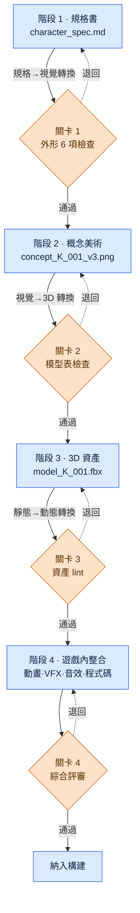

# 12.3 規格書 → 概念 → 遊戲內資產的流轉

衝刺末期,概念美術師在團隊即時通訊工具(IM)裡丟來一張角色草圖。"這是學者公會的資深成員吧?"畫面裡的人物是一名 30 多歲的男性,穿著皮甲。而規格書上寫的是 40 多歲女性、灰色學者長袍。追查究竟哪裡出了偏差後發現,概念美術師拿到的資料是兩個月前版本的規格書,而在這期間外形指南已經改過兩次。知道這一變更的,只有策劃本人。

這起事故不是技術問題,而是流程問題。規格書的一頁要變成遊戲內的資產,平均需要 4\~8 周,在這期間,一個角色的資訊會從策劃的腦海裡,經手到概念美術師、模型師、動畫師,一手接一手地傳遞下去。每一次交接,格式都可能出現偏差;若在有偏差的情況下被接收,接手者就會用猜測去填補空白。而這份猜測,會在兩個月後化作團隊 IM 裡的一句話回到你面前。

本章討論的,就是如何把這種一手接一手的流轉,從一個人的記憶搬到系統之上。

---

## 12.3.1 一手接一手 —— 4 個階段與轉換點

在專案A中,角色資產流轉的路徑分為四個階段。重要的不是階段本身,而是階段與階段之間的轉換點。事故不是在階段內部發生,而是在把資產從一個階段交給下一個階段的那一刻爆發。

與其用文字說明這一流轉,不如畫成圖示。而貫穿全書的 24 個部分裡,我一直不靠手繪方框,而是讓 Claude 生成 mermaid 程式碼再渲染。本章正是把這一手法應用後得到的結果放進正文,相當於用自己的正文來印證自己的手法。下面就是我請 Claude"用 mermaid 把 spec→asset 的 4 階段流轉畫出來,並讓轉換點關卡清晰可見"後得到的輸出,原樣渲染的結果。



三個轉換點(規格→視覺、視覺→3D、靜態→動態)各自都立著一道關卡。關卡就像是在把審批檔案交給下一個部門之前檢查格式的視窗。格式不符就會被退回(虛線),回到上一個階段。若接收了格式不符的檔案,下一個部門就會用猜測填補空白。這起 IM 事故,正是在沒有關卡 1 時發生的。

mermaid 的優勢在這張圖裡顯現出來。想要再加一道關卡,或調整階段順序時,不必重畫方框,只需改動一行文本。因為圖示就是文本,它便成了版本管理的物件,和規格書一起被提交(commit)。

---

## 12.3.2 階段 1 —— 規格書是一切輸入的根

流轉的起點,是一份 Markdown 規格書。這份文件是隨後三個階段的全部輸入。這裡若有空白,空白不會消失,而是被甩給下一個階段,變成猜測。

下面是實際使用的 `character_spec` 格式。`related_atoms` 欄位把這份規格書連線到 JIT atom 系統(參見第 11 部分)。

```markdown
---
title: 學者公會資深成員 K_001 角色規格書
type: character_spec
layer: L2
related_atoms: [character_K_001, voice_profile_K_001]
status: draft
---

## 1. 身份
- 名稱:(TBD)
- 職責:學者公會資深成員、主要 NPC、可結為同伴
- 勢力:scholar_guild
- 性格:學者_嚴格,威嚴但公正

## 2. 外形指南
- 年齡:40 多歲
- 性別:女性
- 體格:略高於平均(約 170cm)
- 服裝:灰色 + 紫色點綴,學者長袍,眼鏡

## 3. 表情·姿態
- 平時:沉著,嘴角下垂
- 憤怒時:沉默 + 迴避視線
- 悲傷時:轉移話題,表情變化細微

## 4. 遊戲內職責
- 主線任務第 1·5·12 章登場
- 釋出 8 個支線任務
- 第 7 章加入同伴

## 5. 語音·臺詞
- voice_profile: scholar_K_001
- 代表性臺詞 3 句:
  - "那是沒有記載的故事嗎?"
  - "不要憑感情做決定。資料優先。"
  - "……是你的選擇啊。我知道了。"

## 6. 參考資料
- 5 位真實學者的圖片(法務審查完畢)
- 參考 refgame 的角色基調
```

外形 6 項(第 2 節的年齡·性別·體格·服裝,以及第 3 節的表情·姿態)構成了關卡 1 的檢查清單。造成這起 IM 事故的"40 多歲女性 / 灰色長袍"那兩行,正出自這一節。倘若關卡 1 起了作用,概念美術師所拿到資料的外形 6 項是否與當前規格書一致,本會在交接之前得到檢查。

### 實操記錄(worked transcript) —— 填補規格書空白的一次往返

與其從零手動填滿整份規格書,不如只定好身份與職責,把外形·表情的初稿交給 Claude 來給出。下面是一次真實往返的全文,未作概括。

**提示詞(全文):**

> 以下角色的身份·職責已確定。請據此填寫 character_spec 的"2. 外形指南"與"3. 表情·姿態"初稿。
> - 職責:學者公會資深成員、主要 NPC、可結為同伴
> - 性格:學者_嚴格,威嚴但公正
> - 勢力:scholar_guild
> 約束:refgame 基調(東方奇幻,低飽和度)。外形須僅憑剪影就能與其他主要 NPC 區分開。表情採用不直接流露憤怒·悲傷的剋制型。

**Claude 原始輸出(原樣,未加修飾):**

> ## 2. 外形指南
> - 年齡:40 多歲後半段
> - 性別:女性
> - 體格:偏瘦,165cm 上下(※"威嚴"是用身高來表現還是用姿態來表現,需要確定 —— 我推薦用姿態)
> - 服裝:深藏青色學者服,銀線刺繡(※我不清楚勢力的配色方案。scholar_guild 是否另有代表色?)
>
> ## 3. 表情·姿態
> - 平時:微微抬起下巴的端正姿態,視線略高於對方
> - 憤怒時:話變少,只有語氣轉冷
> - 悲傷時:以望向窗外的動作代替,面部幾乎沒有變化
>
> 還有一點:既然"可結為同伴",戰鬥中的表情大概也會需要,那是否在這份規格書的範圍之外?

**人工驗證·駁回:**

這份輸出只採納了一半。表情·姿態一節幾乎原樣採用 —— 它準確把握了"剋制型"這一約束,而"以望向窗外的動作代替悲傷"是規格書裡原本沒有的好細節。外形則被否決,理由有兩點。其一,它把體格定為"偏瘦,165cm",而已確定的規格書寫的是"略高於平均,170cm"。Claude 只拿到了身份·職責,無從得知體格,於是做了猜測 —— 這正是關卡該攔下的猜測。其二,服裝的藏青色雖符合 refgame 基調,卻與我們遊戲中 scholar_guild 的代表色(灰色+紫色)相沖突。Claude 丟擲的問題("是否另有勢力代表色?")恰恰提前點出了這一衝突。

**重新請求:**

> 很好。表情·姿態採納。外形按以下固定後重新整理:體格 = 略高於平均的 170cm,服裝 = 灰色學者長袍 + 紫色點綴(scholar_guild 代表色),佩戴眼鏡。戰鬥表情在這份規格書範圍之外,去掉。

這一次往返值得學習的一點是:Claude 用猜測填補空白的那個位置,恰恰就是規格書裡的空白。遇到未知值時,Claude 分成了兩種做法。勢力配色和戰鬥表情,它以"這一點我不知道"為由用提問的方式挑了出來,而這些提問比關卡檢查清單更早點出了缺漏。相反,體格卻沒有任何"不知道"的標示,直接用一個看似合理的數字填了進去。只要後一種情況存在,人工逐行對照已確定規格書的驗證就無法省略。

---

## 12.3.3 階段 2 —— 概念美術,以及關卡 1

已確定的規格書交到概念美術師手上。流程與 §12.1.2 的概念工作流相同:用 AI 量產數十到數百張,篩選到寥寥幾張,再手工打磨出 1\~3 個方案,然後製作模型表(正面·側面·背面)。

關鍵在於立於這一階段末尾的關卡 1。在模型表進入階段 3(3D)之前,檢查以下五項。

| 專案 | 確認標準 |
|---|---|
| 符合規格書外形 6 項 | 服裝·體格·年齡·性別·表情·姿態與當前規格書一致 |
| 主要 NPC 之間剪影可區分 | 僅憑 silhouette 就能與其他角色區分 |
| 遵守 ArtGuide `01_Character/_STYLE_GUIDE` | 無違反領域風格指南之處 |
| 與 voice_profile 無矛盾 | 視覺印象不與語音印象衝突 |
| 縮小識別性 | 縮到 UI·小地圖大小仍能辨認出是誰 |

這裡,`image_prompt_design_intent_first` atom 發揮作用。概念美術師寫提示詞時,也不是先羅列"灰袍女性學者"這類外形詞,而是先放入規格書的設計意圖("威嚴但公正""剋制情感的學者")。只攥著外形關鍵詞量產數百張,就會得出一大堆衣服顏色對、眼神卻不像學者的圖 —— 把意圖擺在最前面,正是為了預先減少這類"外形對、印象錯"的一堆廢圖。量產工具與 §12.1.1·§12.2.5 相同 —— 在自託管的 SD(SDXL)/ComfyUI 上,同時掛載角色 LoRA(鎖定臉部·服裝)與 ControlNet(鎖定姿勢·剪影),使同一人物即便以不同姿勢抽出數百張,臉部也不會崩。

關卡 1 的首項 —— "符合規格書外形 6 項" —— 正是攔住這起 IM 事故的直接門閂。由於在概念草案定型為模型表之前就與當前規格書作了對照,拿著兩個月前版本作業造成的偏差,便會在這裡被卡住。

---

## 12.3.4 與非策劃的協作 —— md 只給策劃團隊,美術團隊只看 html

這裡要指出一個運營上的不對稱。目前所看到的規格書全是 Markdown,而概念美術師和 3D 模型師並不是為了讀 Markdown 才進遊戲公司的。因此,專案A 把 §12.2.4 裡看到的單向轉換管線("策劃團隊用 md 做決策,美術團隊只看 html")原封不動地用在 spec→asset 流轉上。策劃團隊做出的 md 決策被轉換成 html,推送到獨立的美術 SVN,美術團隊只看 html —— md 的學習成本為 0。


`_convert_md_to_html.py` 把 md 轉成便於閱讀的 html,`_SyncToArtRepo.bat` 再把結果 push 到美術 SVN 而非策劃 SVN。分開兩個倉庫的理由,與 PC 分離原則相同 —— 是為了保護一方的工作流不覆蓋另一方。轉換始終是策劃 → 美術的單向流動,即便美術團隊改動了 html,也不會倒流回策劃的 md。

這一轉換的終點 `96_ArtGuide` 分為 7 個域(`00_Common`·`01_Character`\~`07_Env`)。各域以各自的 `_STYLE_GUIDE` 自治,但 `00_Common` 統管所有域的公共約定(飽和度範圍·命名·解析度)(結構圖示見 §12.2.1)。關卡 1 的第三個檢查項,正是是否遵守這個 `01_Character/_STYLE_GUIDE`。

---

## 12.3.5 階段 3 —— 3D 資產與自動 lint

模型表進入 3D 階段後,要經過 8 道工序:高模建模 → 拓撲重建(遊戲用低模) → UV 展開 → 貼圖 → 繫結·蒙皮 → 測試姿勢 → 檢查。這一階段是 AI 最薄弱的環節。由於 3D 生成模型尚無法給出遊戲品質的拓撲重建·UV,人與傳統工具才是主角。

作為替代,這一階段附帶關卡 3,即自動資產 lint。不是每次由人去數多邊形數量,而是在資產被提交(commit)的那一刻自動檢查。

| 檢查項 | 通過條件 |
|---|---|
| 多邊形數量 | 每個角色的標準範圍(作者運營基準 40,000\~80,000) |
| 貼圖解析度 | 2048×2048 標準 |
| UV unwrap 效率 | 利用面積 80% 以上 |
| 骨骼(bone)數量 | 遵守標準骨骼集 |
| 資產命名規則 | 遵守第 11 部分命名規範 |

一旦查出違規,通知就會發給對應的 3D 美術師。這是把原本依賴人眼力的檢查移到了確定性之上。多邊形數量·解析度這類專案對錯分明,所以既不歸 AI 也不歸人,而是 lint 指令碼的活兒。

這裡出現一個不可逆的階段:烘焙貼圖的渲染工序。一旦烘焙(bake)過的貼圖無法還原,因此在渲染前關卡 3 會再運作一次。階段 4 的動作捕捉同樣不可逆 —— 捕捉環節在重新召集演員與裝置之前,是無法重來的。不可逆階段之前的關卡,要比其他關卡運作得更嚴格。

---

## 12.3.6 階段 4 —— 遊戲內整合與綜合評審

3D 資產與動畫·VFX·音效·程式碼合到一起,首次出現在遊戲中。這是所有工種齊聚一堂的階段,關卡 4(綜合評審)是最後一道門閂。

| 評審項 | 負責 |
|---|---|
| 符合規格書意圖 | 策劃 |
| 視覺基調·一致性 | 美術總監 |
| 動畫自然度 | 動畫總監 |
| 遊戲內辨識度 | 遊戲總監 |
| 效能(frame 負擔) | 技術美術 |

每個角色由 5 人花 30 分鐘\~1 小時來審。這一階段的 lint 由資產-資源對映(`Skill_Art_Resource_Mapping`)自動執行,檢查遊戲內實際掛上的資源與規格書所指的資源是否一致。在整合階段,AI 的作用僅限於視覺迴歸測試與 lint 自動化 —— 它不是決定要展示什麼,而是逐畫素對照昨天與今天的幀是否在無意間發生了變化的確定性工作。

---

## 12.3.7 變更一旦觸及某一階段,下游便全部動搖

本章開頭的這起 IM 事故,其實是兩起事故的疊加。一是關卡 1 缺失(有偏差的資料通過了),二是變更追蹤缺失(外形指南改過兩次的事實沒有傳播到下游)。阻止第二起事故的,是變更影響追蹤。

一個角色任何階段的資料一旦改動,其下游的所有資料都會受影響。這件事若每次由人手工推算,必然會遺漏。因此,設定一個根據鏈條位置自動扒取下游資料的工具。

```python
# spec_change_impact.py
# 鏈條的任一環節發生改動,就把其下游(downstream)資產全部收集起來。

CHAIN = ["spec", "concept", "model", "texture", "rig", "anim", "vfx", "ingame"]

def find_downstream_artifacts(spec_id, changed_field):
    artifacts = []
    chain_position = get_chain_position(changed_field)   # 例:"外形.服裝" → "spec"(0)
    for stage in CHAIN[chain_position + 1:]:              # spec 下游全部
        artifacts.extend(get_artifacts(spec_id, stage))
    return artifacts

# 用法:K_001 的服裝改動時?
changed = find_downstream_artifacts("K_001", "外形.服裝")
# → ["concept_K_001_v3.png", "model_K_001.fbx",
#     "texture_K_001_diffuse.png", "rig_K_001.fbx", ...]
```

當 `changed_field` 為 `"外形.服裝"` 時,鏈條位置為第 0 位(spec),其下游的 concept·model·texture·rig 便全部被納入影響列表。這份列表會以自動通知的形式發給各負責人。用桌上審批夾的比喻來看,修改 1 號審批夾的那一刻,2\~8 號審批夾上會自動插上紅旗,插了旗的審批夾便重新進入審閱佇列。這起 IM 事故,恰恰是因為沒有這面旗才發生的 —— 1 號(規格書外形)改過兩次,2 號(概念)上卻沒插旗。

---

## 12.3.8 度量 —— 4 階段標準化的效果

下面是作者所運營的專案A標準化前後的對比。絕對時間·件數為作者估算(未經驗證),可信的是方向和大致的比例。

| 專案 | 標準化前 | 標準化後 | 方向 |
|---|---|---|---|
| 單個角色(規格書→遊戲內) | 8\~12 周 | 4\~6 周 | 約減半 |
| 階段間猜測事故 | 每季度 10\~15 起 | 每季度 2\~3 起 | 大幅減少 |
| 變更遺漏事故 | 每季度 8\~10 起 | 每季度 1\~2 起 | 大幅減少 |
| 綜合評審時間(每個角色) | 分散·重複(共 4\~6 小時) | 30 分鐘\~1 小時集中 | 集中化 |
| 新角色設計師上手 | 約 2 個月 | 約 1 個月 | 約減半 |

角色週期大致減半。但不能誤解這個數字。標準化不是把所有角色以同一速度批次印出的傳送帶。主要角色仍要投入近 8 周,配角則 4 周完工。標準化所做的,不是讓速度變得均一,而是讓各階段的時間差等能穩定地維持下去。標準一旦滑向管控,就會化作削減創作者創意時間的事故回到你面前 —— 標準化的目的是消除猜測與遺漏,而不是壓縮時間。

---

## 12.3.9 各階段中 AI 的位置

| 階段 | AI 的作用 | 強度 |
|---|---|---|
| 1. 規格書 | 起草輔助、缺漏提問(策劃評審) | 強 |
| 2. 概念 | Stable Diffusion(SDXL)·ComfyUI 量產(LoRA·ControlNet)、LLM 提示詞 | 強 |
| 3. 3D | 生成模型尚不成熟,人·傳統工具為主 | 弱 |
| 4. 整合 | 視覺迴歸·lint 自動化 | 確定性 |

階段 1·2 中 AI 強,階段 3 由人負責,階段 4 交給確定性工具。這種分工一旦確立,各階段的責任就變得清晰 —— 哪些屬於 AI 的初稿、從哪裡開始是人的決定,在關卡面前不會含糊。

---

## 12.3.10 常見失敗與對策

| 模式 | 對策 |
|---|---|
| 規格書缺失外形·表情 6 項 | 階段 1 必查,讓 AI 提出缺漏問題 |
| 略過概念階段的關卡 | 強制在模型表定型前對照外形 6 項 |
| 手工推算變更影響 | 用 spec_change_impact 自動追蹤 |
| 綜合評審全堆到最後 | 每個階段分散設定關卡 |
| 無資產 lint 就構建 | 關卡 3 自動攔截 |
| 強制把所有角色壓進 4 周 | 維持各階段的時間差等 |

第一行與第三行,正是本章開頭 IM 事故的直接對策。

---

### 本章要點
- 事故不在階段內部,而在階段之間的轉換點爆發 —— 關卡守住的正是那個位置。
- 規格書的空白不會消失,而是被甩給下游,變成猜測。
- 變更影響的自動追蹤,是阻止遺漏事故最大的護欄。

### 下一章預告
- 13.1 FAQ·元遊戲分析 —— 資料·KPI 的起點

---

## 動手試試 —— spec→asset 流轉的最小搭建

**setup**
1. 建立一份 `character_spec.md` 格式(身份·外形 6 項·表情·職責·語音·參考 6 個小節,含 `related_atoms` 欄位)。
2. 備好 md→html 轉換指令碼(`_convert_md_to_html.py` 之類),只向美術團隊共享 html。
3. 在 4 個轉換點掛上關卡檢查清單(外形 6 項 / 模型表 / 資產 lint / 綜合評審)。

**prompt**
> 以下 character_spec 的身份·職責已確定。請填寫"外形指南"與"表情·姿態"初稿,但對不知道的值不要猜測,而要以提問的方式標出。約束:refgame 基調,僅憑剪影即可區分,剋制型表情。

**verify**
1. 把 AI 猜測的值(尤其是體格·顏色)與已確定的規格書逐行對照 —— 若有偏差就先駁回,再以固定值重新請求。
2. 在交給模型表之前,讓關卡 1 檢查清單的 5 項全部通過。
3. 故意改動一行外形,確認 `spec_change_impact` 是否準確吐出下游資產列表。

### 單人精簡版
如果是一個人作業,轉換管線·美術 SVN·5 人評審就太重了。只保留最少的兩樣。(1) 一份 `character_spec.md` 格式 —— 外形 6 項必填,禁止留空。(2) 每次改動外形時,養成把"這次變更所觸及的下游檔案"用一行手寫在規格書最底部的習慣。即便沒有工具,那一行也能阻止變更遺漏事故。
