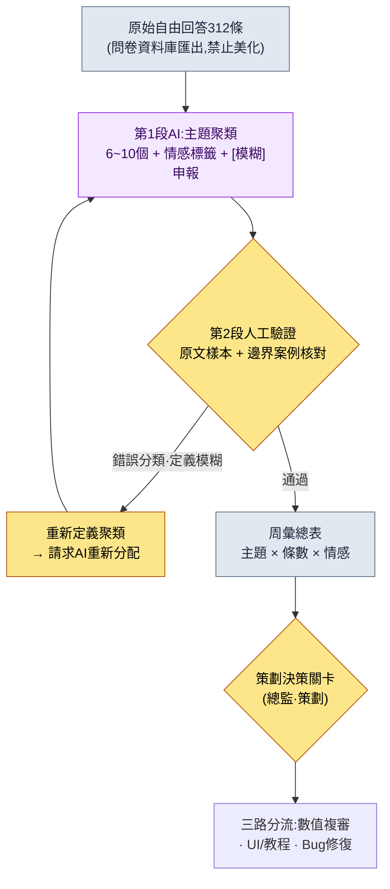
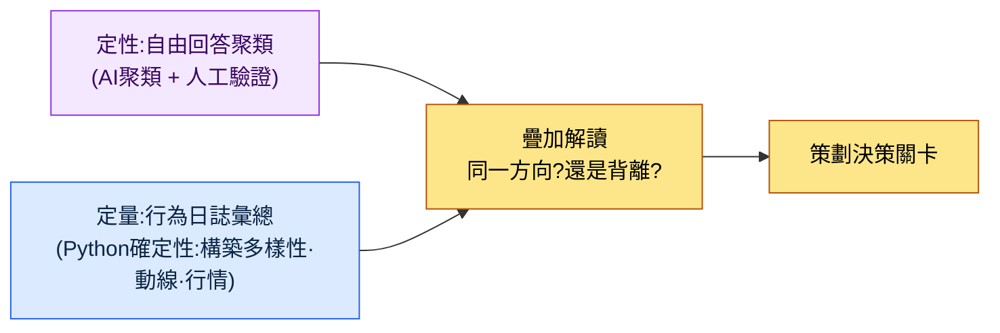

# 13.1 將數百條自由回答歸為主題——聚類交給AI,診斷交給人

> 第一讀者:需要解讀使用者反饋與元遊戲的MMORPG策劃(中等規模(10\~50人)團隊)
> 面向個人/愛好者讀者的精簡版:§13.1.8「一個人的話,做到這些就夠了」

上線更新的第二天早上,我還記得遊戲內問卷的自由回答欄裡堆了312條的那個畫面。從只有一句話的短評到寫滿五行的怒火,什麼都有。策劃團隊沒有一個人把那312條全部讀完。準確地說,是讀不完。就算讀了,也只是帶著"強化大概太肝了的抱怨很多"這種印象走進會議,而這個印象不過是嗓門最大的那5條製造的錯覺。那312條到底在說什麼,沒有人知道。

本章講的是:如何在人不必讀完那312條的前提下,依然能說清"什麼話題有多少條"。核心有兩點。第一,把數百條自由回答**歸為主題並標註情感**這種枯燥的分類工作交給AI。第二,不照單全收AI的聚類,而是由人**抓出一條錯誤分類,予以駁回並重新請求**。FAQ與元遊戲分析的通論在別的書裡也有,本章只聚焦於把這類分析*放進AI工作流裡運轉的環節*。

---

## 13.1.1 自由回答不是"用來讀的材料",而是"用來分類的材料"

FAQ與自由回答是一面鏡子,照出策劃設想的遊戲與使用者實際體驗的遊戲之間的差距。同一個問題一天在服務檯被問30次,該做的不是增加接待人手,而是重新設計指示牌。問題在於如何數出這個"30次"。自由回答不是結構化日誌,套不上 `GROUP BY`。"強化太貴了"和"資源不夠養不起"是同一個主題,字串卻不同。靠人用眼睛歸類,312條要花兩三個小時,而且歸類標準因人而異。

這正是AI該上場的地方。自由回答分類是一項(1)量大、(2)枯燥、(3)需要自然語言語義判斷的工作——也就是說,確定性程式碼做不了,讓人來做又很貴。不過有一點要在開工前釘死。**AI產出的是主題聚類(假設),而不是確定的診斷。**"強化不滿38%"只是AI打標籤的結果,不能直接導向"把強化削弱"的決定。貫穿整個第13部分的原則在這裡同樣成立——KPI定義與最終診斷交給人,自然語言歸類與初步打標籤交給AI。

自動化真正的價值也在這一點上。把分類自動化,與其說讓分析本身變快,不如說關鍵在於**312條這個訊號每週早上以分好類的形態送到你的辦公桌上**。自動化的價值不是節省時間,而是暴露訊號(團隊運營概念 `automation_signal_value_over_time_savings`)。這就好比原本只是在信箱裡堆積的信件,如今每天被分好類、投遞到對應的部門。

---

## 13.1.2 [實操記錄] 自由回答312條 → 主題聚類

下面完整地走一遍一個週期,展示實際是怎麼運轉的。以下是把作者專案(移動優先的MMORPG,下稱"專案A")遊戲內問卷的自由回答做主題聚類的一次會話的忠實再現——所謂實操記錄(worked transcript),即完整保留的真實操作過程記錄。輸入提示詞可以照原樣複製使用,輸出則是對真實會話的重現。

### 第1步——輸入:原樣丟進自由回答(不加工)

先把原始自由回答提取成機器可讀的形態。這隻需從問卷資料庫裡匯出即可,並不是重新寫。關鍵是**不美化、不摘要,連錯別字、髒話、單個詞的回答都原封不動地**放進去。原文越是原始,分類的準確度就越高。

```jsonl
# survey_freetext_2026-W21.jsonl (摘錄,312條中的6條)
{"id": 0041, "text": "強化費用瘋了 = = 衝10強資源根本攢不夠"}
{"id": 0088, "text": "Boss招式挺好玩但獎勵太摳了"}
{"id": 0102, "text": "公會戰匹配太久了 等了5分鐘多"}
{"id": 0156, "text": "不氪金就沒法強化 這也叫遊戲?"}
{"id": 0203, "text": "新副本氛圍很好 音樂也不錯"}
{"id": 0274, "text": "郵件裡的獎勵怎麼沒到?好像是bug"}
```

### 第2步——提示詞:讓它聚類,但強制給出類別、依據、模糊項申報

```
把附件 survey_freetext_2026-W21.jsonl(問卷自由回答312條)歸為6~10個
主題,並給每條回答打上負面/中立/正面標籤。不要拆得太細,一條回答
只歸入一個聚類。歸不進去的放到"其他"。按聚類給出條數、比例、主要情感、代表原文1條,
以表格呈現;分配沒把握的不要硬塞,拿到[模糊]清單裡,每條寫一句理由。
去掉講解,只要(甲)聚類定義 (乙)彙總表 (丙)[模糊]清單。
```

這條提示詞裡真正讓它分類的話只有頭兩行,其餘全是把輸出形狀框死的約束。給AI自由,它要麼把聚類拆成20個,要麼把所有回答硬塞進某個類別。擋住這一點的,是**聚類數上限(6\~10)、單一歸類、情感三分類,以及"沒把握就丟進[模糊]"這個出口**四條約束。分類的準確度就出自這道圍欄。

### 第3步——Claude的輸出(重現,摘錄)

```
(甲)聚類定義
C1 強化/成長成本   —— 抱怨強化、資源獲取過於繁重
C2 付費壓力        —— 認為零氪/微氪被排除在成長之外
C3 內容獎勵不足    —— 認為Boss、副本等付出與獎勵不成正比、獎勵太摳
C4 匹配/等待時間   —— 抱怨公會戰、匹配等待過長
C5 內容好評        —— 對新副本、演出、音樂等的正面反饋
C6 Bug/發放遺漏    —— 獎勵未發放、報錯
其他               —— 不屬於以上6類的零散項

(乙)彙總表
| 聚類 | 條數 | 比例 | 主要情感 | 代表原文                                  |
|------|------|------|----------|-------------------------------------------|
| C1 強化成本 | 71 | 23% | 負面 | "強化費用瘋了 = = 衝10強資源根本攢不夠" |
| C2 付費壓力 | 58 | 19% | 負面 | "不氪金就沒法強化 這也叫遊戲?"          |
| C3 獎勵不足 | 49 | 16% | 負面 | "Boss招式挺好玩但獎勵太摳了"             |
| C4 匹配等待 | 34 | 11% | 負面 | "公會戰匹配太久了 等了5分鐘多"           |
| C5 內容好評 | 41 | 13% | 正面 | "新副本氛圍很好 音樂也不錯"              |
| C6 Bug發放 | 28 | 9%  | 負面 | "郵件裡的獎勵怎麼沒到?好像是bug"         |
| 其他       | 31 | 10% | 混合 | (零散項居多)                            |

(丙)[模糊]清單(4條)
- id 0088 "Boss招式挺好玩但獎勵太摳了"
  → 歸入了C3(獎勵不足),但前半句也與C5(好評)重疊。複合回答。
- id 0156 "不氪金就沒法強化" → C1與C2的邊界。歸到了C2。
- (另外2條)
```

輸出中最有價值的部分不是彙總表,而是**最底下的[模糊]清單**。這是AI申報自己分配的不確定性、交給人來處理的地方。好的提示詞能讓AI說出"這條我沒把握"。

### 第4步——驗證與駁回(人的位置)

這份輸出不能原樣報上去。人要親自核對原文樣本。實際上,這次會話裡就逮到了一條。

翻開C2(付費壓力)的58條、逐條掃讀原文時,`id 0156 "不氪金就沒法強化 這也叫遊戲?"` 這一條扎眼。AI把它歸到了C2(付費壓力)。可這句話的第一痛點不是"付費",而是**"沒法強化"**——也就是C1(強化成本)。使用者是被強化的牆擋住了,把這堵牆的成因指向了付費,而付費本身並不是不滿的核心。C1與C2相鄰、容易混淆確實如此,但把這條算作C2,"強化成本"這個訊號就會顯得比23%更小,真正該動手調整的強化曲線就會在優先順序上被擠後。一條錯誤分類,就是能改變決策方向的邊界案例。

於是駁回並重新請求。

```
C1(強化成本)和C2(付費壓力)的邊界有點混。第一痛點若是"成長牆本身"就歸C1,
若是"不付費就被排除的公平性"就歸C2,重新劃一遍。id 0156的核心是"沒法強化",
所以歸C1。按這個標準把卡在邊界上的重新分配,只告訴我改動了多少條。
```

AI重新劃定邊界,把原在C2的9條移到了C1。結果C1從71→80條(26%),C2從58→49條(16%)。**"強化成本是單一最大主題"這個圖景沒變,但它的大小從23%變得更清晰為26%。**一次往返,訊號的輪廓就更清晰了。這個重新分配的條數(9條)與比例變化,是這次會話裡實際數出來的值(樣本312條,單一週次)。

這裡要講清一點。人之所以駁回,並不是因為"AI錯了"。歸到C2在解釋上也說得通。人所做的,是**把聚類定義(即KPI定義)打磨得更鋒利,再反饋給AI**。定義由人來定,而用這個定義把312條重新過一遍的勞動,由AI來幹。

---

## 13.1.3 流水線——從自由回答到決策關卡

把上面這次會話每週自動跑一遍,就成了流水線。人手要碰的只有兩處。把聚類定義打磨鋒利的環節(前),以及把分類結果連向決策的關卡(後)。這中間的312條歸類與打標籤,由AI來跑。



決定性的設計在於:第2段(人工驗證)不會讓AI的輸出自動通過。做成自動通過型,AI一旦劃錯一次邊界,就會每週朝同一個方向扭曲訊號。可疑候選(模糊清單)由AI挑出,但要不要改聚類定義,由人來定。而且彙總表本身並不是決策,只不過是**決策關卡的輸入**。"C1強化成本26%"是讓總監去審視強化曲線的訊號,而不是自動削弱的觸發器。

---

## 13.1.4 元遊戲——把自由回答與行為日誌疊在一起看

如果說自由回答是"使用者說了什麼",那麼元遊戲(meta-game)就是"使用者實際做了什麼"。遊戲上線後,會沉澱下策劃並未設想的玩法,這就是元遊戲。比如構築meta(特定技能組合的扎堆)、動線meta(偏好的刷怪路線)、交易meta(與官方行情不同的玩家共識價)之類。這與自由回答不同,是**用行為日誌做定量測量**的,由確定性程式碼(Python)來彙總。這不是AI該插手的地方。

關鍵是把兩者**疊在一起看**。上面那次會話裡,C1(強化成本)的不滿以26%居首。此時若行為日誌中的構築多樣性指數(頭部技能組合的集中度)在同一周下降,那麼"無論嘴上還是行動上,都在向單一構築、單一成長路線收斂"這兩個訊號就指向同一個方向。當定量與定性一致時,決策才有把握。反過來,若自由回答風平浪靜,行為日誌卻單單向一種構築扎堆,那可能是使用者感到不適卻不說出口(即靜默流失前夕)的風險訊號。



這裡的分工同樣清晰。行為日誌的彙總由**程式碼而非AI**來做。因為構築佔比或交易行情是不能每次呼叫都變的確定性數值。AI只用來歸類自由回答這種非結構化文本,而定量KPI由程式碼釘死。

---

## 13.1.5 本章數值的出處

本章的比例遵循序言〈一個承諾〉的原則。§13.1.2中的"C1 23%→26%、重新分配9條"是從樣本312條(單一週次)實際數出來的值,因此不作為絕對值,而是當作"強化成本是單一最大主題"這個*方向*來讀。因果不下斷言——不存在"做了FAQ分析,留存率就上去了"這類表格。取而代之,這套工作流真正可測量的有三項:聚類驗證中被人推翻的錯誤分類條數(為0則是驗證流於形式的訊號)、算出周彙總所花的時間、定量與定性訊號是否一致。

---

## 13.1.6 廢棄·重新請求不是工具的失敗,而是關卡的訊號

在§13.1.2裡,人推翻了C2的9條分配。每週跑驗證,這種推翻每次都會出現0到幾條。重要的是**推翻0條並不是目標**。若驗證中一條都沒被推翻,那只有兩種可能——AI完美(罕見),或者驗證者沒看原文、只是蓋了個章。後者佔壓倒性多數。

每週逮到一兩條邊界案例,並以此為契機讓聚類定義一點點變得鋒利,這時驗證關卡才算真正在運轉。這是"人必須定期對AI分類的準確度做抽樣評審"這一通用原則的具體形態。同一類使用者被分散到不同主題的錯誤分類,若不做評審、只信任自動分類,就會每週累積。

---

## 13.1.7 常見的失敗

| 模式 | 為何失敗 | 處方 |
|---|---|---|
| 只靠人用眼睛掃讀自由回答 | 嗓門大的5條代表312條的錯覺 | 用AI聚類做全量分類(§13.1.2) |
| "AI幫我分析下使用者反饋"整個甩給它 | 聚類被拆成20個,或強行分配 | 強制聚類數上限·單一歸類·[模糊] |
| 不加驗證就上報AI的彙總表 | 邊界錯誤分類改變決策方向 | 原文樣本 + 親自核對邊界案例 |
| 把彙總比例直接等同於決策 | "不滿26%所以削弱"式的自動觸發 | 彙總表只是決策關卡的輸入 |
| 只看定性、無視行為日誌 | 錯過無聲的靜默流失 | 把定量(程式碼)·定性(AI)疊在一起讀(§13.1.4) |
| 讓AI去彙總定量KPI | 每次呼叫數值都變,平衡隨之動搖 | 構築·行情的彙總用確定性程式碼 |

第三條最常被忽略。彙總表很乾淨,讓人忍不住原樣相信。但正如id 0156那一條,邊界上的一個錯誤分類,就能把優先順序整個改寫。驗證不是把312條重讀一遍,而是**只把最大的兩三個聚類的邊界案例**拿原文核對。

---

## 13.1.8 動手試試——今天就能做的一步

> **一個人的話,做到這些就夠了**:沒有問卷資料庫也行。把你自己的遊戲(或喜歡的遊戲)的商店評論、社群帖子只收集30\~50條文本,原樣貼上§13.1.2的提示詞跑一次。從跑出的聚類裡挑一條"這歸得有點怪"的分配,試著反駁"這條回答的第一痛點是別的主題,請重新確定定義並重新分配",你就會切身體會到,聚類原來是一堆判斷的集合。

如果是團隊,就從下面這一步開始。把一週的自由回答不加美化地匯出為 `survey_freetext_YYYY-Www.jsonl`,用§13.1.2的提示詞跑一次。然後只把最大的兩個聚類的邊界案例拿原文核對。聚類定義一旦打磨鋒利,之後每週用同一條提示詞就能自動積累起可復現的周彙總。

---

### 本章要點
- 自由回答不是用來讀的材料,而是用AI全量分類的材料。
- 聚類定義(即KPI定義)由人來定,312條的歸類交給AI。
- 驗證中推翻0條,是隻蓋章不看的訊號。

### 下一章預告
- 13.2 KPI定義·追蹤——精簡到5\~7個的診斷表與測量陷阱
