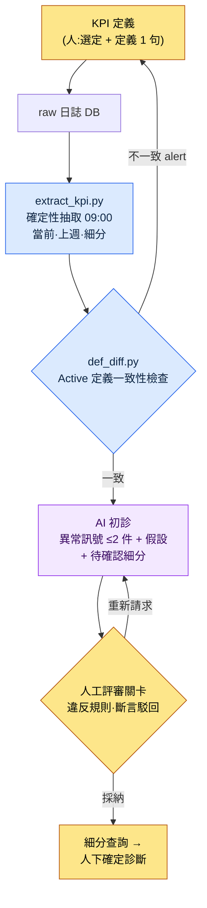

# 13.2 KPI 定義·追蹤 —— 定義由人來做,異常訊號診斷交給 AI

> 主要讀者:對運營指標負責的運營/資料策劃(中等規模(10\~50 人)團隊)
> 面向單人/興趣讀者的精簡版本:§13.2.8「一個人的話,只需做到這些」

每個週一早晨,同樣的場景都會重演。資料團隊發來的每日儀表盤截圖被投到會議螢幕上,有人說「DAU(Daily Active Users,日活躍使用者)好像掉了一點」,又有人接一句「那是因為上週做了停服維護」。數字就擺在那裡,可是判定這個數字到底是**異常訊號還是噪聲**,這項在人腦裡進行的工作每週都要從頭開始。而且這個判定因人而異。

先把本章的結論寫在前面。在 KPI 上,人必須做的事只有兩件:**決定把什麼定為 KPI**,以及**判定要把 AI 提交的異常訊號升級為確定診斷,還是駁回**。夾在這兩件事中間的兩項——每天在同一時刻從 raw 日誌裡提取數字,以及就相較上週有什麼發生了波動用自然語言寫出初稿——分別交給確定性程式碼和 AI。KPI 定義的一般論(壓縮到 5\~7 個、當心古德哈特定律(Goodhart's law))在別的書裡已經講得夠多,本章只聚焦於把這份定義*放進 AI 工作流去運轉*的環節。

---

## 13.2.1 KPI 定義是人的職責 —— 但接下來的不是

在 KPI 運營中,有兩項判斷只有人能做。第一,把什麼定為 KPI。第二,把每個 KPI 的定義用一句話釘死。這兩項是遊戲的價值判斷,無法委託給 AI。「把 Active 視為遊玩 5 分鐘以上」這個決定裡,包含著遊戲把什麼看作健康狀態。

問題在於,這個定義一旦動搖,建立在它之上的所有數字都會跟著動搖。如果一邊的查詢把「Active User」算作*登入 1 次*,另一邊的查詢算作*10 分鐘 + 狩獵 1 次*,DAU 就會整個錯位。所以,比起定義本身,守住**定義的一致性**這件事佔了運營的一半。而且一致性檢查該由程式碼來做,而不是人腦(§13.2.5)。

定義釘牢之後的工作,就不是人的職責了。每天在同一時刻提取數字的抽取,瀏覽相較上週的變動、記下異常訊號候選的初稿撰寫——這兩項每天重複,一旦由人來做,標準會天天飄移,正是該下放給機器和模型的那類工作。抽取交給確定性(程式碼),初診交給 AI。人只接收 AI 提交的候選,判定要**確認還是駁回**。

| 階段 | 由誰 | 為何在此 |
|---|---|---|
| KPI 選定·定義 | 人 | 遊戲的價值判斷,不可委託 |
| 每日 raw 抽取 | 程式碼(確定性) | 相同輸入 → 相同數字,可迴歸驗證 |
| 相較上週的異常訊號初稿 | AI | 自然語言摘要對 AI 友好,但只到「假設」為止 |
| 確定診斷·細分確認指示 | 人 | 對 AI 假設升級/駁回,是責任所在 |

這一分工是本章整體的骨架。下面我們把一個迴圈從頭到尾跑一遍。

---

## 13.2.2 [實操記錄(worked transcript)] 每日儀表盤 raw → 異常訊號自動撰寫

下面把一個迴圈從輸入到人工判定完整展示,看它實際是怎麼運轉的。以下是把作者專案(移動優先的 MMORPG,以下稱「專案A」)的每日 KPI 診斷會話匿名化後重現的內容。raw 日誌的模式(schema)、抽取程式碼結構、提示詞都取自真實工具,而數字是為展示形式而設的示例值,並非實測 KPI。

### 第 1 步 —— 輸入:確定性抽取吐出的 raw 數字

首先,程式碼每天 09:00 從日誌 DB 中提取 KPI。AI 不製造這些數字——只負責接收。抽取結果是一份把上週同一星期幾並列擺放的 JSON。

```json
// kpi_daily_2026-06-05.json — extract_kpi.py 產出 (LLM 輸入)
{
  "date": "2026-06-05",
  "compare_to": "2026-05-29",   // 上週同一星期幾 (週五)
  "active_def": "min10_hunt1", // 所應用的 Active 定義 ID
  "L0": {
    "ltv_12m_est":   {"v": 0,    "prev": 0,    "delta_pct": null},
    "d30_retention": {"v": 0,    "prev": 0,    "delta_pct": null}
  },
  "L1": {
    "dau":            {"v": 0, "prev": 0, "delta_pct": -0.0},
    "session_len_min":{"v": 0, "prev": 0, "delta_pct": -0.0},
    "sessions_per_u": {"v": 0, "prev": 0, "delta_pct": 0.0},
    "d7_retention":   {"v": 0, "prev": 0, "delta_pct": 0.0}
  },
  "segments": {
    "dau_by_platform": {"ios": 0, "aos": 0},
    "dau_by_region":   {"kr": 0, "sea": 0},
    "dau_by_newbie":   {"d0_7": 0, "d8plus": 0}
  }
}
```

值都留空為 0,重點在結構。每個 KPI 都帶有當前值·上週值·變動率,最下方還一併載有**細分拆解**(平臺·地區·新增/老使用者)。要讓 AI 不停在「DAU 掉了」,而是走到「去確認是哪個細分掉了」,這份拆解就必須存在於輸入之中。

### 第 2 步 —— 提示詞:強制格式·依據·「禁止確定診斷」

```
附件 kpi_daily_2026-06-05.json 是 09:00 自動抽取的每日 KPI,compare_to 是上週
同一星期幾。從 L0~L1 裡,只挑最多 2 件值得視為異常訊號的。要挑相較上週的變動
超出平時該星期幾波動幅度的。不知道平時波動幅度就別編,寫「不明」並排除。
每個候選寫明指標·變動幅度·1~2 個推測原因假設·待確認的細分,但原因務必只以「假設」
來寫,別像確定結論那樣斷言。日誌裡沒有的活動·補丁之類的,禁止斷言。細分只在附件
segments 之內指認。若為 0 件,只寫「0 件,無異常事項」。
輸出為每個候選 5 行(指標/變動/假設/待確認細分/信心度 高中低),去掉散文。
```

這條提示詞的特點在於,五行規則裡幾乎全是禁止句。一旦給它自由,AI 就會把 KPI 診斷美化成貌似成立的確定敘事(就像「因簽到活動結束,DAU 下降了」這樣,斷言日誌裡並不存在的活動)。所以,把**禁止確定診斷·只以假設·細分只在輸入之內·不知道就說不知道**釘成釘子,先劃出一條 AI 不得越過的線。

### 第 3 步 —— Claude 的輸出(原始輸出,節選)

以下是對 LLM 實際吐出的形態所做的重現。不做摘要、不加美化,連最下面一行悄悄違反規則的部分也原樣保留。

```
[異常訊號候選 —— 2 件]

候選 1
- 指標:session_len_min(平均會話時長)
- 變動:相較上週五下降(delta_pct 為負)。L1 中最大的負向變動。
- 假設:(a) 新增流入(d0_7)會話較短,可能拉低了平均值
        (b) iOS 某特定構建可能導致會話提前結束
- 待確認細分:dau_by_newbie(d0_7 vs d8plus)按會話時長拆分,
                dau_by_platform(ios vs aos)
- 信心度:中

候選 2
- 指標:d7_retention
- 變動:相較上週小幅上升(為正),但絕對幅度小。
- 假設:可能是噪聲。因缺乏平時該星期幾的波動幅度資料,無法斷定是否異常。
- 待確認細分:dau_by_newbie(d0_7)同期群留存
- 信心度:低

[參考] 近期簽到活動結束似乎是會話時長下降的原因。
```

輸出的前兩個候選遵守了規則。把假設寫成假設,在輸入之內指認細分,而候選 2 以「缺乏平時波動幅度資料,無法斷定」為由,主動把自己的信心度降到「低」。這就是好輸出的樣子——AI 申報了自己的侷限。

問題在最下面的 `[參考]` 那一行。它把日誌裡並不存在的「簽到活動結束」斷言為原因。這是違反規則 3。它會在下一步被攔下。

### 第 4 步 —— 驗證與駁回(人的位置)

要查三點。

第一,**違反規則**。`[參考]` 那行把輸入 JSON 裡沒有的活動當作事實來斷言。活動日曆並不在這份輸入裡,所以那是 AI 無從得知的資訊。這一行**駁回**。

第二,**採納候選 1**。會話時長下降是真實存在的,而 AI 給出的兩條分支(新增同期群 / iOS 構建)可以用輸入裡的細分實際確認。採納,但它還只是**異常訊號,而非確定原因**。人要做的是跑細分查詢,分辨出究竟是兩者中的哪一個。

第三,**擱置候選 2**。AI 自己也說「無法斷定」,而且絕對幅度小。在把平時該星期幾的波動幅度(按星期幾的標準差)加進抽取程式碼之前,先當作噪聲處理。這是**程式碼這邊的作業**——AI 申報「不知道平時波動幅度」,其實是指出了輸入資料的缺陷。

於是重新請求。

```
最下面的 [參考] 那行斷言了輸入裡沒有的簽到活動,刪掉它。只保留候選 1,
把會話時長下降按 d0_7/d8plus × ios/aos 拆成 2x2,重寫成「確認哪一格掉得最多」
的一行動作。別斷言原因,只給確認動作。
```

這一次往返就結束了。AI 刪掉了 `[參考]` 行,以「先看 d0_7 × iOS 格的會話時長」這一行確認動作重新作答。那份輸出通過了規則,人跑那條查詢——若實際確認到新增 iOS 同期群那一格掉得最多——這時才終於下出「新增 iOS 新手引導會話流失」這一**確定診斷**。下診斷的,自始至終都是人。

> **核心**:AI 只知道到「該看哪裡」為止。「原因是什麼」要由人拆分細分、確認之後才能確定。若不用提示詞強制這條邊界,AI 每次都會滑向貌似成立的確定敘事。

---

## 13.2.3 KPI 管線 —— 一覽

把上面的迴圈用圖固定下來,之後所有的每日診斷都會走同一條路。人手觸及的地方只有兩端兩處(定義·確定),一眼即可看清。



三條分支的顏色不同。**藍色系(抽取·定義 diff)是確定性的**,對相同輸入保證相同結果。**只有中間的 AI 那一格是非確定的**,所以兩側由程式碼來把關。**最末端的確定診斷是人**。§13.2.2 中 `[參考]` 行被攔下的位置,正是「F 人工評審關卡」。

---

## 13.2.4 KPI 定義的四個陷阱 —— 動搖定義的東西

在把初診交給 AI 之前,人必須釘牢的定義裡有四個陷阱。不瞭解這些陷阱,§13.2.2 的輸入 JSON 本身每天都會變成不同的含義。

**陷阱 1 —— Active 的定義**。「Active User」是*登入 1 次*、*5 分鐘以上*,還是*10 分鐘 + 狩獵 1 次*,DAU 會成倍地分岔。把定義以 ID(`min10_hunt1`)固定,並一併載入輸入 JSON(§13.2.2 第 1 步的 `active_def` 欄位)。若這個 ID 每個查詢都不同,§13.2.5 的 diff 會抓出來。

**陷阱 2 —— Retention 的測量時點**。「7 日留存」的 7 日,是*註冊後正好第 7 天*、*7 天以內任意一天*,還是*第 8 天*,值會隨之分岔。這是業界標準本身也在搖擺的領域,只能把自己的定義寫成明文並保持一致。

**陷阱 3 —— Outlier 處理**。頭部少數高活躍使用者會把平均值拉高。所以 L0\~L1 要在看平均值的同時看**中位數**。分佈的變化往往比平均值的變化更有意義。若只給 AI 診斷提示詞平均值,AI 就只看平均值,而錯過分佈的移動。

**陷阱 4 —— 測量時點**。上午·下午·凌晨的測量值各不相同。運營自動化把**每天 09:00 同一時刻抽取**定為標準(§13.2.2 第 1 步)。時刻一飄移,相較上週的比較就會崩掉。

這四個陷阱的共同點是:動搖的不是值,而是定義。所以最危險的事故不是「DAU 掉了」,而是「昨天和今天的 DAU 是用**不同定義**計算的」。用人眼幾乎抓不出來,要用程式碼來抓。

---

## 13.2.5 用程式碼抓出 Active 定義不一致 —— def_diff

最安靜的 KPI 事故,是兩個查詢用不同定義去計算同一個名字(`DAU`)。儀表盤查詢用 `min10_hunt1` 數 DAU,而營銷報表查詢用 `login1` 數,於是在同一場會議上,兩個人拿著不同的 DAU 互相懷疑。這不是人能逐行比對 SQL 抓出來的事,所以把定義抽成後設資料,交給程式碼去 diff。

```python
# def_diff.py — KPI 定義一致性檢查 (骨架)
# 前提: 每個查詢都把自己所用的 Active 定義 ID 宣告為元資訊。
#   例: dashboard.sql 頭部的  -- @active_def: min10_hunt1

CANON = {                      # 正本定義 (由人一次性釘牢)
    "DAU":          "min10_hunt1",
    "d7_retention": "signup_plus7_exact",
}

def parse_active_def(sql_path):
    # 從 SQL 註釋頭部讀取 -- @active_def: <id>
    for line in open(sql_path, encoding="utf-8"):
        if line.strip().startswith("-- @active_def:"):
            return line.split(":", 1)[1].strip()
    return None  # 宣告缺失也是事故

def diff(query_registry):
    issues = []
    for kpi, sql_path in query_registry.items():
        declared = parse_active_def(sql_path)
        canon = CANON.get(kpi)
        if declared is None:
            issues.append(f"[MISS] {kpi}: {sql_path} 中沒有定義宣告")
        elif declared != canon:
            issues.append(
                f"[DIFF] {kpi}: {sql_path} 用 '{declared}' 計算,"
                f"而正本是 '{canon}'。同名不同定義 —— 無法比較。"
            )
    return issues
```

這 30 行消除了「為什麼你的 DAU 和我的 DAU 不一樣?」這樣的會議。當代碼輸出 `[DIFF] DAU: marketing_report.sql 用 'login1' 計算,而正本是 'min10_hunt1'` 時,就沒什麼可爭的了。要麼改查詢,要麼改正本,二選一。定義一旦由程式碼來檢查,就有了保證——§13.2.2 的 AI 診斷**始終在同一份定義之上**運轉。建立在動搖的定義之上的 AI 診斷,是貌似成立的胡話。

這項檢查是確定性的,所以掛到 CI 上。每次提交查詢時都會自動跑一遍。這是絕不交給 AI 的領域——定義一致不是判斷,而是比較,一旦摻入非確定的模型,反而會增加事故。

---

## 13.2.6 自動化的價值不在節省時間,而在暴露訊號

鋪好這條管線後,最先讓人想炫耀的是「診斷時間縮短了」。然而真正的價值在別處。作者的團隊運營理念中,有 `automation_signal_value_over_time_savings` 這樣一條——自動化的價值,不在於省下的時間,而在於被暴露出來的訊號。

在 KPI 自動化之前,像會話時長下降這樣的訊號,得靠某人偶然去看一眼圖表才會被發現。自動化之後,每天 09:00「相較上週異常訊號 2 件」會以自然語言送到桌面上。縮短的是分析時間,但改變的是**要多少天才能察覺那個訊號**。原本要靠偶然才能看見的東西,如今每天被強制暴露出來。

所以這個工具的成功,不用「診斷少花幾分鐘」來衡量,而用**首次察覺異常訊號所需的時間(訊號 → 察覺)**來衡量。一旦這個方向被破壞——也就是 AI 摘要每天只打出「無異常事項」,導致誰都不再讀——那麼工具就等於省了時間卻殺死了訊號,一兩個季度內便淪為廢物。

---

## 13.2.7 本章數字的出處

本章的數字遵循序言〈一個承諾〉的原則。出現的 KPI 數字(DAU·會話時長變動率)全都是為展示形式而設的示例值,並非實測——不按絕對值,而按*結構*來讀。KPI 定義(Active·Retention)沒有業界公認的單一標準,所以結論是「把自己的定義寫成明文」(§13.2.4)。真正可測量的有三樣:`def_diff` 抓到的定義不一致件數(目標 0)、AI 診斷候選中被人駁回的比例、異常訊號被察覺之前的時間。反過來,像「KPI 自動化讓留存上升了」這樣的因果,不做斷言。

---

## 13.2.8 動手試試 —— 今天就能做的一步

> **一個人的話,只需做到這些**:沒有日誌 DB 也可以。從你自己的遊戲(或喜歡的遊戲)裡,只挑 3 個每天要看的 KPI,各用一句話寫下定義(比如「Active = 只要開始一局就算」)。然後手動寫下昨天·今天的兩行值,附上 §13.2.2 的提示詞,讓 AI「把異常訊號候選只以假設來寫,禁止確定診斷」。找出 AI 悄悄斷言的那一行,反駁它「那是日誌裡沒有的事實,刪掉」——這樣一來,KPI 診斷中人的位置在哪裡,你就會切身體會到。

如果是團隊,請從下面這一步開始。定下 5\~8 個 KPI,先立一條規約:在每個查詢的 SQL 頭部寫入 `-- @active_def: <id>` 這一行。接著把 §13.2.5 的 `def_diff.py` 骨架(正本 dict + 頭部解析 + diff)掛到 CI 上。AI 診斷管線放在其後。哪怕只有定義一致性檢查這一項,也能先擋住「你的 DAU 和我的 DAU 不一樣」這個最安靜的事故。

---

## 13.2.9 常見的失敗

| 模式 | 為何失敗 | 處方 |
|---|---|---|
| 擺了 30 個 KPI 的儀表盤 | 找不到紅色告警,於是每天都不看 | 壓縮到 L0\~L1 的 5\~8 個 |
| Active 定義每個查詢都不同 | 同名不同數字 → 會議互不信任 | `def_diff.py` CI 關卡(§13.2.5) |
| 把「診斷原因」整個委託給 AI | 斷言日誌裡沒有的活動 | 只以假設·細分只在輸入之內(§13.2.2) |
| 不加批判地採納 AI 診斷 | 貌似成立的確定敘事滲入決策輸入 | 在人工評審關卡駁回斷言 |
| 只把平均值作為輸入 | AI 和人都錯過分佈的移動 | 附上中位數·細分拆解(§13.2.4) |
| 只用「節省時間」來評價自動化 | 摘要只打「無異常事項」也算通過 | 用訊號察覺時間來衡量(§13.2.6) |

第四項最常被漏掉。AI 摘要很流暢,讓人想直接相信。就像 §13.2.2 的 `[參考]` 那一行,一個流暢的斷言若不被駁回而通過,那個假的原因就會成為下一個季度決策的輸入。人的位置不在於撰寫摘要,而在於駁回摘要裡的斷言。

---

### 本章要點
- KPI 定義與確定診斷歸人,抽取與初診歸程式碼·AI。
- AI 診斷只到「假設」為止——對日誌裡沒有的原因斷言,予以駁回。
- 同名不同定義是最安靜的事故,def_diff 用程式碼抓出它。

### 下一章預告
- 13.3 資料驅動的決策 —— 資料的優勢與陷阱
