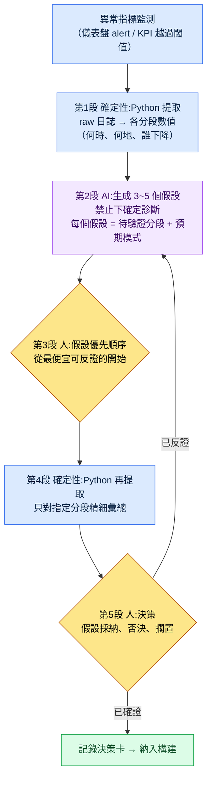

# 13.3 從異常指標到決策 —— AI 提出假設,人做決策

> 主要讀者:依據 KPI 做季度決策的資料負責人、總監（中等規模的 10\~50 人團隊）
> 面向個人/業餘讀者的精簡版:§13.3.9〈一個人的話,做到這些就夠〉

我曾在某個週一早晨的儀表盤上看到一條紅線。30 日留存率相比上週明顯下滑。會議室裡的人各自給出一個原因。有人說是上週更新的新獵場,有人說是競品的新賽季,有人只說是"季節性因素"。聽起來都有道理。問題在於,直到那天下午過去,我們連該驗證什麼都沒能達成一致。假設有五個,可待驗證的分段一個都沒定下來。

本章講的是如何結束那樣的早晨。核心只有一句。**看到異常指標時,不讓 AI 下確定診斷,而讓它給出 3\~5 個可驗證的假設。** AI 不會斷言"留存下降的原因是 X"。它給出的是"若為 X,則這個分段會呈現這樣的模樣"這類驗證設計,而決策由人來做。資料驅動的一般論在別的書裡已經足夠,本章只聚焦於把那套一般論*落到 AI 工作流上的那個環節*。

---

## 13.3.1 KPI 定義由人,解釋輔助交給 AI

先把邊界釘死。整章都立在一句話之上。**把 KPI 定義成什麼由人來定,而當那個 KPI 出現波動時,只有快速鋪開"它為何波動"的假設這一件事由 AI 來協助。**

這條邊界一旦崩塌,資料驅動本身就會崩塌。把 KPI 定義交給 AI,"容易測量的東西"就會變成 KPI;把診斷也交給 AI,一句貌似成立的確定判斷就會跳過人的驗證,直接變成決策。所以只給 AI 開一個區間 —— 在異常被捕捉之後、人做出決策之前,鋪開"該懷疑什麼、該確認什麼"的那個區間。

這種分工與第 13 部分前幾章共享同一條脊椎。raw 日誌由 Python 以確定性方式提取（13.1）,KPI 定義與層級由人固定（13.2）,而本章是在此之上,只讓 AI 承擔異常被捕捉時的*解釋輔助*。提取靠確定性,定義靠人,解釋輔助靠 AI。三者互不混淆,正是這一部分整體的安全裝置。

筆者的專案（移動優先的 MMORPG,以下稱"專案A"）鋪設了支撐這種輔助的真實日誌。團隊記憶資料夾下的 `_economy_log/`（token、時間經濟性日誌）、`_scores_latest.json`（指標分數快取）、`_roi_report.md`（ROI(Return on Investment,投入產出比)報告）就是它們。本章的實操記錄（worked transcript）以從這些日誌中提取的異常訊號為輸入。

---

## 13.3.2 決策迴圈 —— AI 介入的位置只有一格

先用一張圖把從單個異常指標通向決策的整個迴圈固定下來。在這張圖裡,AI 介入的格子只有一個,即"生成假設"。它之前（提取）和之後（驗證、決策）都是人和程式碼的位置。



人經手的地方有三處。定義什麼算異常的位置（最前端,已在 13.2 結束）、挑選先驗證哪個假設的位置（第3段）、做出最終決策的位置（第5段）。其間枯燥的日誌彙總由 Python 完成,快速鋪開假設由 AI 完成。**AI 下確定診斷的格子在這個迴圈裡並不存在。** 假設為被反證而存在,一旦被反證,就回到第2段。

---

## 13.3.3 [實操記錄] 留存下降 —— 收取 3\~5 個假設

完整展示實際如何跑完一個迴圈。下面是對上文那個週一早晨留存下降所做的重現會話。輸入的提示詞可以照原樣複製使用,輸出則忠實重現了真實會話。

### 第 1 步 —— 輸入:把 Python 提取的異常訊號原樣拋過去

首先,人不丟擲"留存下降了"這種感覺。而是丟擲 Python 以確定性方式提取的各分段數值表。這不是新寫的,只是從 `_economy_log`/事件日誌中提取而已。

```python
# retention_break_extract.py (骨架) —— 異常區間的分段拆解
# 輸入:按日的佇列留存日誌
# 輸出:哪個分段下降了多少（供 LLM 輸入的表）
def extract_break(rows, kpi="d30_retention", baseline_weeks=4):
    base = mean([r[kpi] for r in rows if r.week < target_week][-baseline_weeks:])
    cur  = [r for r in rows if r.week == target_week]
    return [
        {"segment": s.name,
         "baseline": round(base_by_seg[s.name], 3),
         "current":  round(s.value, 3),
         "delta_pct": round((s.value/base_by_seg[s.name]-1)*100, 1),
         "n": s.sample_size}          # 樣本數 —— 太小則可信度低,一併傳入
        for s in cur
    ]
```

這段指令碼吐出的表,就是給 AI 的第一手輸入。關鍵在於把樣本數（`n`）一併傳入。要讓 AI 不把樣本小的分段的波動誤當成原因,拿著那份警告的就必須是資料,而不是人。

```
# retention_break_2026Q2W3.txt （提取結果,節選）
segment              baseline  current  delta_pct      n
新使用者(註冊7日內)      0.41     0.31      -24.4%     8,200
迴流(休眠30日以上)     0.28     0.27       -3.6%     1,100
付費(收費)            0.62     0.60       -3.2%     2,400
零氪                 0.34     0.25      -26.5%    14,900
新獵場_遊玩           0.39     0.22      -43.6%     3,050
新獵場_未遊玩         0.40     0.38       -5.0%    11,200
```

### 第 2 步 —— 提示詞:禁止診斷,強制給出假設與驗證設計

```
附上的 retention_break_2026Q2W3.txt 是 Python 提取的 d30 留存按分段的變化
（baseline=前 4 周平均,current=本週,n=樣本數）。零氪、新獵場_遊玩這兩個分段
下降很大。不要診斷原因,只需建立 3~5 個可驗證的假設。每個假設用
假設一句話 / 待驗證的分段（如何進一步拆分） / 若成立會出現的模式 / 證偽的
反證條件,就這四行。樣本小的分段（n<2000）不要作為核心依據,若要用則
標註其侷限。假設按最便宜就能反證的順序排列,資料無法判別的,
另行標註"需人工判斷"。輸出只要假設卡片列表,不要敘述。
```

這段提示詞裡沒有一句"去找原因"。取而代之的,只寫明瞭假設該具備的骨架和不可逾越的界線。給 AI 自由,它就會吐出"大概是新獵場難度的緣故"這類貌似成立的確定判斷,而這句話一旦記入會議紀要,就會未經驗證地變成決策。擋住它的裝置有四個:**禁止斷言;每個假設必須給出驗證分段、預期模式、反證條件;按反證成本排序;"無法判別的交給人"。** 這是把輸出從診斷改造成驗證設計的裝置。

### 第 3 步 —— Claude 的輸出（原始,重現）

```
[假設 1]（反證成本最低）
假設:新獵場的難度成為零氪新使用者的進入門檻,推高了 7 日內的流失。
驗證分段:將新獵場_遊玩分段按"首次死亡次數"區間（0~2 / 3~5 / 6+）重新拆解。
預期模式:若假設成立,首次死亡 6+ 區間的 d7→d30 流失率應急劇上升。
反證條件:若死亡次數與流失率之間不存在單調關係,則否決。

[假設 2]
假設:原因不在新獵場本身,而在同一補丁中捆綁的其他改動（獎勵曲線、UI）。
驗證分段:未遊玩新獵場但在補丁後登入的使用者的留存。
預期模式:若未遊玩分段也一同下降,則獵場不是元兇。
反證條件:若未遊玩分段維持 baseline（約 -5% 水平）,則否決本假設,轉向假設 1。

[假設 3]
假設:因外部因素（競品新賽季）導致零氪整體流失,與獵場無關。
驗證分段:付費/零氪 × 是否遊玩新獵場 的 2×2 交叉表。
預期模式:若為外部因素,則無論是否遊玩獵場,零氪整體都均勻下降。
反證條件:若下降集中於新獵場_遊玩,則外部因素說被削弱。

[假設 4]（需人工判斷）
假設:測量本身的問題 —— 本週佇列定義/日誌採集發生了變動。
驗證分段:（資料無法判別）需人工確認補丁是否伴隨 telemetry 模式(schema)變更。
預期模式:若發生了 schema 變更,則下降可能並非真實,而是測量偽影(artifact)。
反證條件:若確認日誌管線無變更,則否決。

注意:"迴流"（n=1,100）分段樣本太小,未將 -3.6% 視為訊號。
```

這段輸出中最有價值的部分是假設 4。這是 AI 申報自身侷限的地方 —— "這一點資料無法判別,請人來確認 telemetry 模式(schema)是否變更"。好的提示詞會讓 AI 能夠說出"我不知道"。而最後一行 —— 它自行把樣本僅 1,100 的分段排除在訊號之外 —— 正是規則 3 生效的痕跡。

### 第 4 步 —— 驗證與決策（人和 Python 的位置）

不能把這些假設卡片直接搬成決策。由人確定優先順序,再由 Python 重新彙總。

假設 2 的反證成本最低。新獵場_未遊玩分段在第 1 步的表裡已經有了 —— `-5.0%`。它維持了 baseline。也就是說,沒玩獵場的使用者安然無恙。**假設 2 當場被否決,同時假設 3（外部因素導致整體下降）也隨之削弱。** 因為若是外部因素,未遊玩的使用者本也該一同下降。下降集中在*遊玩過*新獵場的使用者身上。

於是收窄到假設 1,再跑一次 Python。把新獵場_遊玩按首次死亡次數重新拆解後,死亡 6 次以上的區間裡 d30 流失格外突出（方向:死亡越多、流失越陡的單調關係 —— 精確數值由構建的 telemetry 測量,這裡只看方向）。與假設 1 的預期模式一致。

剩下的是假設 4。人確認了補丁說明 —— telemetry 模式無變更。測量偽影的可能性被否決。至此,決策的材料齊備了。

> **[第5段 人做決策 —— 決策卡]**
>
> - **採納**:新獵場初期難度（首次死亡頻率）是零氪新使用者流失的首要動因。下一個構建中對 1\~5 級區間的敵人密度、血量做下調 A/B。
> - **否決**:外部因素說（假設 3）、測量偽影說（假設 4）。
> - **擱置**:獎勵曲線（假設 2 的殘留）—— 若在調整獵場難度後下降仍未消失,則重新點燃。
> - **AI 的角色記錄**:診斷 0 件,提供假設 4 件 + 驗證設計。決策由人做。

輸入（異常訊號）→ 提取 → 假設 → 驗證 → 決策,這一個迴圈在此閉合。AI 一次都沒說過"原因就是這個"。它只鋪好了驗證的路。這就是本章的"展示(Show)"標準 —— "AI 分析了資料"這句話,若不曾把假設了什麼、什麼被反證、人決定了什麼完整看過哪怕一次,就是空洞的。

---

## 13.3.4 為何禁止"確定診斷"

生成假設與確定診斷之間的差別看似微不足道,卻劃分了決策的安全。把兩者並置,差別就一目瞭然。

| | 確定診斷（禁止） | 生成假設（本章的做法） |
|---|---|---|
| AI 輸出 | "留存下降的原因是新獵場難度" | "難度假設 —— 去看首次死亡 6+ 區間,這樣就對、那樣就錯" |
| 人的下一步行動 | 照單全收並決策 | 從最便宜的假設開始嘗試反證 |
| 出錯時 | 錯誤決策直接進入構建 | 在驗證階段被否決,成本為 0 |
| 責任歸屬 | "是 AI 說的"（責任蒸發） | 人挑選假設並決策（責任明確） |

確定診斷真正的危險不在準確度,而在於**它會讓人跳過驗證**。一句貌似成立的話能平息會議室裡的懷疑。反之,假設卡片本身就是一份"去確認這個"的作業,是一種未經驗證便無法邁入決策的結構。把 AI 當作假設發生器而非診斷器,原因就在這裡。

---

## 13.3.5 Goodhart 預警 —— 讓 AI 先點出 KPI 扭曲

資料驅動最深的陷阱是 Goodhart 定律。*"當測量指標成為目標的那一刻,它便不再是好的指標。"* 若把 DAU 設為目標,就會靠人為的推送把 DAU 吹大,而長期留存被削減。問題在於,這種扭曲通常要**在決策做出很久之後**才會以副作用的形式暴露出來。

所以把 AI 提前一格投入。在把決策方案納入構建之前,先讓 AI 回答"若把這個 KPI 設為目標,它會被如何鑽空子(game)"。這不是診斷,而是*紅隊(red team)* —— 故意讓它去找我們決策的漏洞。

> **[Goodhart 預警提示詞]**
>
> 本季度的目標 KPI 是 d7 留存 +5%p,達成手段的初稿是大幅強化連續 7 日的
> 簽到獎勵。請你擔任這個決策的紅隊,把"若將該 KPI 設為目標"可能出現的
> Goodhart 扭曲情景 3 個、每個情景中會一同崩壞的護欄指標,以及
> 能及早捕捉扭曲的監控分段,用表格列出來。不要斷言,用"可能會這樣"的形式。

AI 給出的不是確定的預言,而是一份該懷疑之處的清單。只摘錄核心的話,如下。

| Goodhart 扭曲情景（假設） | 會一同崩壞的護欄指標 | 早期監控 |
|---|---|---|
| 只打卡簽到,核心內容不遊玩 | 每次會話的戰鬥次數、獵場進入率 | d7 留存 ↑ 與戰鬥次數 ↓ 同時出現時告警 |
| 獎勵通脹導致經濟崩潰 | 貨幣回收/產出比、道具行情 | 追蹤 `_economy_log` 回收-產出缺口的擴大 |
| 簽到結束後隨即斷崖式流失 | d8\~d14 留存（獎勵剛結束） | 不要只看 d7,把 d14 作為一對來看 |

這張表的價值不在於標準答案,而在於**決策之前就把護欄指標預先成對繫結**。若要把 d7 留存設為目標,就把 AI 點出的"戰鬥次數"和"d14 留存"放在同一屏上一起看。這樣一來,即便 d7 上升,一旦戰鬥次數隨之下降的那一刻 —— Goodhart 扭曲開始的那一刻 —— 就能在副作用累積到季度末之前將其捕捉。用護欄指標繫結,而非把單個 KPI 設為目標,這個習慣正是讓 13.2 中定下的"5\~7 個 KPI 的平衡"在決策階段真正運作起來的方法。

這裡要點明一件事。AI 在這次紅隊中創造的價值並不是"節省時間"。人想出這三個情景所花的時間並不長。真正的價值在於**在做決策的當場就把扭曲訊號暴露出來** —— 把平時不看的護欄指標提到決策桌面上來的這種訊號效應。自動化的價值不在於節省時間,而在於讓平時看不見的訊號變得可見（專案A 團隊記憶概念 `automation_signal_value_over_time_savings`）。

---

## 13.3.6 不同決策,AI 假設的分量各不相同

生成假設並非對所有決策都同樣有用。隨著決策的時間跨度與資料密度不同,對 AI 假設該信任多少也會改變。

| 決策型別 | 資料密度 | AI 假設的位置 |
|---|---|---|
| 技能數值平衡改動 | 高（模擬、日誌充足） | 假設→驗證→決策迴圈照舊,AI 輔助力強 |
| UI 元件改動 | 高（可做 A/B） | 相同,AI 假設有效 |
| 新內容是否上線 | 中（僅有同類內容可參照） | 假設僅供參考,決策權重偏向人 |
| 長期願景、新領域 | 低（無先例） | 迴圈本身跑不起來 —— 由人決策,AI 只做風險羅列 |

規則很簡單。**資料越厚的決策,越是照原樣跑 §13.3.2 的迴圈;資料越薄的決策,AI 的角色就從假設發生器下降為風險清單編寫器。** 試圖用資料去解長期願景之所以危險,是因為在沒有未來資料的地方,AI 若用過去的資料編出貌似成立的假設,那假設就會把願景往過去拉。沒有資料的領域的決策,不是迴避或甩給 AI,而是留作由人負責做出的位置。

> **[方向路標 —— 若用嵌入(embedding)把話題、佇列座標化（目前尚為時過早）]**
>
> 請把它當作研究動向而非處方來讀。第 13 部分的兩個位置上,同一個嵌入構想被開啟。一是 §13.1 的自由作答 —— 把非結構化的自然語言用句子嵌入聚類,就能把 §13.1.2 的[模糊]邊界案例以"兩個話題中心之間的距離"來座標化,並把離任何中心都遠的作答標記為"新話題出現"。另一是 §13.1.4 的行為日誌 —— 把遊玩日誌嵌入,就能把沒有人預先定義過的"湧現佇列"以向量空間（附錄 M 的"地圖"）聚類的方式顯現出來,從而開闢一條把它投入 §13.3 假設迴圈的"待驗證分段"候選的路（這正是穿透 §13.3.3 所預設的"人預先定義的分段"這一侷限一格的位置）。不過,聚類不是原因,而只是假設;小的聚類不是訊號（與 §13.3.3 的樣本警告同處一地）;給聚類命名的標註,依然是人的分內事（§13.1.1）。尤為重要的是,在壓縮所丟棄的維度上,線上事故可能爆發。所以把這個構想放在與經濟篇 §8.2.7 的"維度向量"線索完全相同的位置（概念直覺見附錄 M）—— 在同一片 telemetry 土壤之上,以同樣的剋制。它只是 telemetry 紮實鋪就的團隊幾年後才會審視的方向路標,而當下要做的,是誠實地跑好 §13.3.2 的迴圈。

---

## 13.3.7 本章數字的出處

本章的數字遵循序言〈一個約定〉的原則。Goodhart 定律是 1975 年查爾斯·古德哈特（Charles Goodhart）正式提出的公開命題,專案A 的 `_economy_log`、`_roi_report.md`、`_scores_latest.json` 是真實存在的團隊記憶產物,而在一致性校驗失敗時通知 ClickUp 的規則 `integrity_check_clickup_notify` 是分數為 294.93 的實運營 atom（附錄 A.3.6、A.3.1）。§13.3.3 中"首次死亡 6+ 區間流失變陡"只以*方向*通過假設驗證得到確認,絕對值則交給了構建的 telemetry。分段表（baseline 0.41 等）是為展示工作流形態的*示例構造*,而非某個特定季度的實測公開值 —— 需要記住的不是數字,而是結構。

---

## 13.3.8 常見的失敗

| 模式 | 為何失敗 | 處方 |
|---|---|---|
| 向 AI 問"原因是什麼" | 貌似成立的確定判斷未經驗證就被拍板 | 禁止診斷,強制 3\~5 個假設 + 反證條件（§13.3.3） |
| 把樣本小的分段的波動當訊號 | 把噪聲誤當成原因 | 在提取階段一併傳入 `n` 並標明閾值 |
| 直奔單個 KPI 作為目標 | Goodhart 扭曲在季度末爆發 | 決策前做 AI 紅隊 + 護欄指標成對（§13.3.5） |
| 用資料去做沒有資料的長期決策 | 過去的假設把未來願景往下拽 | 按資料密度對 AI 角色分級（§13.3.6） |
| 收到假設未經驗證就採納 | 假設搖身變成結論 | 從最便宜的假設開始反證,善用未遊玩分段 |

第三種爆發得最晚。d7 留存上升,決策看起來像是成功,可兩個月後 d14 斷崖與戰鬥次數下降一同到來。在決策*之前*把 AI 紅隊跑一次的那 30 分鐘,買下的是那兩個月。

---

## 13.3.9 動手試試 —— 今天就能做的一步

> **一個人的話,做到這些就夠**:沒有日誌管線也沒關係。從你自己的遊戲（或你愛看的遊戲的公開指標）裡,挑一個最近下滑的數字。把這個數字拋給 AI,但不要說"告訴我原因",而請求"禁止確定診斷,給出 3 個可驗證的假設,並附上反證條件"。從中挑一個最便宜就能確認的假設,親手把資料拆一次,你就會切身體會到"接受診斷"和"驗證假設"在決策安全上差別有多大。

如果是團隊,就從下面這一步開始。在異常指標提取指令碼抽取各分段數值時,加一行,讓它**必須一併輸出樣本數（`n`）**（§13.3.3 的 `retention_break_extract.py`）。然後在確定下一個 KPI 目標時,把 §13.3.5 的 Goodhart 紅隊提示詞跑一次,把一對護欄指標錄入決策卡。僅憑這兩點,"AI 診斷了原因"就會變成"AI 鋪開假設、人驗證後做出決策"。

---

### 本章要點
- 讓 AI 做的不是確定診斷,而是 3\~5 個可驗證的假設。
- 每個假設都強制給出驗證分段、預期模式、反證條件。
- 決策前用 Goodhart 紅隊把護欄指標預先成對繫結。

### 下一章預告
- 14.1 把 PC 的 30 種 HUD 收斂為移動端的 10 種 —— 平臺差異化決策的開端
