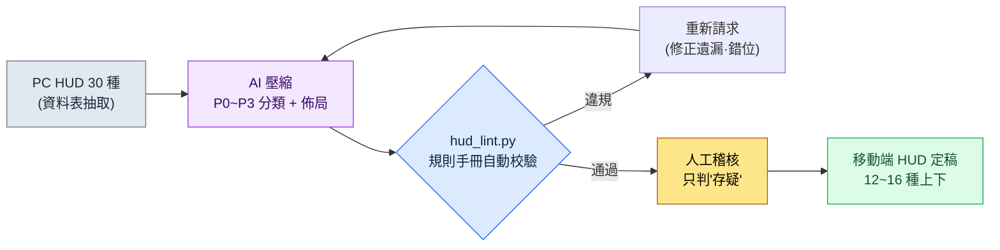

# 14.1 PC HUD 30 種壓縮為移動端 10 種 —— 把約束變成規則手冊,把壓縮交給 AI

> 首要讀者:移動優先專案的 UX·系統策劃(中等規模(10\~50 人)團隊)
> 面向個人/業餘讀者的精簡版:§14.1.7「一個人的話,做到這一步就夠了」

我還記得,第一次把在 PC 構建上執行良好的戰鬥 HUD 放到移動端解析度上顯示的那天。螢幕有一半被各種狀態條、圖示、小地圖和任務追蹤器佔滿,真正的角色反倒看不見了。每一個元素看上去都是必需的。問題在於,"該拿掉哪一個"每次開會都要從頭重新吵一遍。有人想保住小地圖,有人想保住聊天框。因為依據是"感覺",所以每次得出的結論都不一樣。

本章講的就是終結這場爭吵的方法。核心有兩點。第一,把移動端約束從"感覺"變成**可驗證的規則手冊**。第二,把"將 PC 30 種縮減為移動端 10 種"這種枯燥而重複的壓縮工作交給 AI,人只做**抓規則手冊違規項的稽核**。移動端 UX 的通用知識,別的書裡已經講得夠多了,所以本章只聚焦於把這些知識*放進 AI 工作流去運轉的那個環節*。

---

## 14.1.1 移動端約束不是"注意事項",而是"規則手冊"

用表格羅列移動端約束的書有很多。無非是說螢幕小、手指粗、會話短、耗電快。這些都沒錯,但把表格背下來,到了會上還是答不上"那這個按鈕到底行不行"這個問題。只有當約束變成**用數字表示的合格/不合格標準**,AI 和人才能劃在同一條線上。

好在,移動端輸入約束中的相當一部分,平臺公司早已用公開指南釘死了。觸控 44pt(HIG)、48dp(Material)、對比度 4.5:1(WCAG)、間距 8dp 這類公開標準遵循 §9.1 的規則手冊,這裡只把本章 lint 直接用到的**最小觸控目標 44pt(HIG)**保留為行內說明。這些都是無需編造的數字。要能說出"這個按鈕 38pt,不到 HIG 的 44pt",而不是"這個按鈕好像有點小",那麼無論是人來判還是 AI 來判,都會得出一樣的判定。

這裡再加一條 —— MMORPG 手遊以橫屏雙手握持為標準,可按壓的元素放在兩側底部角落、消耗/槽位放在底部中央(為什麼橫屏是標準、三區域模型是什麼,在 §9.1 中講解)。本章所有的佈局判定都以這種橫屏雙手握持為前提。

把平臺標準和 PC 並排放在一起,壓縮的起點就清晰了。PC 精密且能容納大量(可承載 30\~50 種),移動端橫屏受限於雙手能夠到的角落,12\~16 種就是上限(完整對照表見 §9.1 規則手冊 —— 作者估計,未經驗證)。因此,移動端工作的本質不是"設計",而是**"把 PC 的 30\~50 種,按優先順序壓縮為移動端橫屏的 12\~16 種"**。而這項壓縮若用手工來做,既枯燥,又每做一次基準線就晃動一次 —— 它是把同一套規則不知疲倦地反覆套用的活兒,恰好契合 AI 起草、人來稽核的分工。

---

## 14.1.2 [實操記錄] PC HUD 30 種 → 移動端優先順序壓縮

下面把實際怎麼運轉的一個完整週期從頭演示到尾。以下內容忠實再現了作者專案(移動優先 MMORPG,以下簡稱"專案 A")的戰鬥 HUD 壓縮會話,是一份實操記錄(worked transcript,即完整保留的真實操作過程的記錄)。輸入的提示詞可以照原樣複製使用,輸出則是對真實會話的重現。

### 第 1 步 —— 輸入:把 PC HUD 規格原樣丟進去

先把 PC HUD 元素清單做成機器可讀的表。這些內容已經在資料表裡了,所以不是重新寫,而是抽取出來即可。

```yaml
# hud_pc_inventory.yaml —— PC 構建當前 HUD(節選,30 種中的 12 種)
- id: hp_bar          # 血條
  當前位置: 左上
  常駐顯示: true
  可操作: false
- id: mp_bar          # 藍條
  當前位置: 左上
  常駐顯示: true
  可操作: false
- id: skill_slots     # 技能 12 格
  當前位置: 底部中央
  常駐顯示: true
  可操作: true
- id: minimap         # 小地圖
  當前位置: 右上
  常駐顯示: true
  可操作: true
- id: quest_tracker   # 任務追蹤
  當前位置: 右側
  常駐顯示: true
  可操作: false
- id: chat            # 聊天框
  當前位置: 左下
  常駐顯示: true
  可操作: true
# ... buff_bar, party_frame, target_frame, exp_bar, currency, mail_alert ...
```

### 第 2 步 —— 提示詞:釘死分類格式和一行依據

```
把附上的 hud_pc_inventory.yaml(PC 構建當前 HUD 30 種)按移動端橫屏握持、雙手操作
為標準做優先順序壓縮。把每個元素分類為 P0(戰鬥中始終必需)~P3(移除或按情況顯示),
常駐顯示(P0~P1)合計不要超過 16 種。可操作元素(可操作:true)請建議放到
雙手拇指夠得著的角落(左下=移動,右下=技能)。每個分類都必須附上一行依據,
存疑的不要硬性判定,單獨標出來交給人處理。
輸出只要表(元素 | 分類 | 佈局區域 | 依據 | 是否存疑),不要說明。
```

值得注意的是,這段提示詞裡"要求壓縮"的指令本身只有一句,其餘篇幅全都是把輸出圈住的圍欄。給 AI 自由,它就會吐出一般 RPG 的平均值。所以要預先輸入好**分類標準(P0\~P1 ≤ 16 種)、輸出格式(表)、依據義務,以及"存疑就交給人"這條退路**。壓縮的質量由這四道圍欄決定。

### 第 3 步 —— Claude 的輸出(重現,節選)

```
| 元素         | 分類 | 佈局區域        | 依據                                   | 存疑 |
|-------------|------|----------------|----------------------------------------|------|
| hp_bar      | P0   | 頂部固定        | 直接關乎死亡,需每 0.5 秒確認            |      |
| skill_slots | P0   | 右下(右拇指)   | 操作核心,必須置於右拇指可達的角落        |      |
| mp_bar      | P0   | 頂部固定        | 判斷能否釋放技能,需常駐                 |      |
| target_frame| P0   | 頂部中央        | 確認目標血量,戰鬥判斷核心               |      |
| minimap     | P1   | 右上縮小        | 用於確認方向,戰鬥中可縮小/半透明        |      |
| buff_bar    | P1   | hp_bar 下方     | 確認增益到期,圖示可縮小                 |      |
| quest_tracker| P2  | 選單切換        | 戰鬥中不需要,平時以切換方式顯示          |      |
| chat        | P2   | 左下標籤頁      | 戰鬥中自動隱藏,點標籤頁展開             | ★    |
| party_frame | P1   | 左側縮小        | 組隊時提升為 P0(有條件)               | ★    |
| mail_alert  | P3   | 上下文          | 僅在收到時短暫顯示                      |      |
| exp_bar     | P3   | 螢幕最底部 1px  | 資訊價值低,一條細線足矣                 |      |
| currency    | P2   | 選單內          | 戰鬥中不需要                            |      |

常駐顯示(P0+P1)合計:7 種(規則 2 通過:≤16)
存疑 2 項(chat、party_frame)需人工決定:
- chat:若為社交比重高的遊戲,可考慮提升為 P1
- party_frame:分類會因單人/組隊上下文而不同
```

輸出中最有價值的部分不是那張表,而是**最底下兩行的"存疑 2 項"**。這是 AI 申報自身侷限、把判斷交還給人的地方。只要在提示詞裡留好退路,AI 就不會硬編造答案,而是在自己不確定的地方插上旗子。

### 第 4 步 —— 驗證與否決(人的位置)

這份輸出不能照單全收。要用規則手冊過一遍。實際上,這次會話裡就抓到了一處。

AI 把 `party_frame` 放到了"左側縮小",可橫屏握持時,螢幕左側中央是兩隻拇指哪一側都夠不到的區域(左手被綁在左下移動、右手被綁在右下技能)。而組隊框是需要點選(選中隊友)的**可操作元素**。這違反了規則 3("可操作元素放在雙手拇指容易夠到的角落")。AI 在 party_frame 上漏掉了 `可操作` 標誌。這是因為輸入 yaml 裡 party_frame 的 `可操作` 是空的 —— 也就是說,這是人這一側的資料缺陷。

於是重新提出請求。

```
party_frame 是需要點選選中隊友的可操作元素(剛才輸入裡漏掉了)。
按照"可操作元素要放在拇指夠得著的角落"這條規則重新安排它的佈局。請把單人時
和組隊時分開來給建議。
```

一個來回就結束了。AI 重新答覆:單人時"隱藏",組隊時"提升到底部右側(容易夠到)",這個決定通過了規則手冊。**壓縮 30 種,人從頭做要半天,而 AI 起草 + 規則手冊稽核 + 一次來回則在一小時以內**(作者估計 —— 具體省下的時間因團隊和元素數量而異,所以與其看絕對值,不如把它理解為"從頭手工做"和"起草 + 稽核"之間的結構差異)。

---

## 14.1.3 手指區域 —— 兩側角落與底部中央

把上面會話裡反覆出現的"手指區域"用一張圖固定下來,之後所有的佈局判定都會更快。橫向握持的手機上,手指夠得到、視線也常落到的底部,分成三個位置。左手拇指夠到左下(移動)、右手拇指夠到右下(技能)角落,而**兩隻拇指之間的底部中央**,是放消耗品、自動道具和技能槽位的地方。這裡雖然不是需要極速反應(twitch)的操作,卻是一個重要的掃視(glance)區域 —— 能一眼看到自己在用或自動消耗的東西,偶爾也會去按。P0 操作與槽位是綠色,手指夠不到、只用來讀的頂部與中央上方是紅色。

<svg viewBox="0 0 660 340" xmlns="http://www.w3.org/2000/svg" role="img" aria-label="移動端橫屏畫面雙手拇指可達區域圖">
  <!-- 手機外框(橫向) -->
  <rect x="20" y="30" width="620" height="280" rx="30" ry="30" fill="#0f1117" stroke="#3a3f4b" stroke-width="3"/>
  <rect x="34" y="44" width="592" height="252" rx="14" ry="14" fill="#11151d"/>
  <!-- 頂部狀態 band(紅色 —— 難以夠到) -->
  <rect x="34" y="44" width="592" height="62" fill="#7f1d1d" opacity="0.42"/>
  <text x="330" y="80" fill="#fecaca" font-family="sans-serif" font-size="13" text-anchor="middle">難以夠到 —— 頂部·中央(僅狀態顯示:HP · MP · 目標,只讀)</text>
  <!-- 中央遊戲畫面 -->
  <text x="330" y="205" fill="#5b6675" font-family="sans-serif" font-size="14" text-anchor="middle">遊戲畫面(戰鬥發生的地方)</text>
  <!-- 左下拇指角落(綠色) -->
  <path d="M34 296 L34 146 A150 150 0 0 1 184 296 Z" fill="#14532d" opacity="0.7"/>
  <path d="M34 146 A150 150 0 0 1 184 296" fill="none" stroke="#22c55e" stroke-width="2.5" stroke-dasharray="5 4"/>
  <text x="92" y="250" fill="#bbf7d0" font-family="sans-serif" font-size="13" text-anchor="middle" font-weight="bold">左拇指</text>
  <text x="92" y="270" fill="#bbf7d0" font-family="sans-serif" font-size="12" text-anchor="middle">移動</text>
  <!-- 右下拇指角落(綠色) -->
  <path d="M626 296 L626 146 A150 150 0 0 0 476 296 Z" fill="#14532d" opacity="0.7"/>
  <path d="M626 146 A150 150 0 0 0 476 296" fill="none" stroke="#22c55e" stroke-width="2.5" stroke-dasharray="5 4"/>
  <text x="568" y="250" fill="#bbf7d0" font-family="sans-serif" font-size="13" text-anchor="middle" font-weight="bold">右拇指</text>
  <text x="568" y="270" fill="#bbf7d0" font-family="sans-serif" font-size="12" text-anchor="middle">技能</text>
  <!-- 底部中央槽位帶(琥珀色 —— 消耗·快捷槽·自動道具) -->
  <text x="330" y="238" fill="#b45309" font-family="sans-serif" font-size="12" text-anchor="middle" font-weight="bold">底部中央 —— 消耗·快捷槽·自動</text>
  <rect x="256" y="248" width="148" height="44" rx="8" fill="#f59e0b" opacity="0.45" stroke="#f59e0b" stroke-width="2" stroke-dasharray="5 4"/>
  <circle cx="295" cy="270" r="12" fill="#fbbf24"/><text x="295" y="274" fill="#000" font-size="8" text-anchor="middle">藥水</text>
  <circle cx="330" cy="270" r="12" fill="#fbbf24"/><text x="330" y="274" fill="#000" font-size="8" text-anchor="middle">自動</text>
  <circle cx="365" cy="270" r="12" fill="#fbbf24"/><text x="365" y="274" fill="#000" font-size="8" text-anchor="middle">槽位</text>
  <!-- HUD 圓點示例 -->
  <circle cx="70" cy="72" r="9" fill="#ef4444"/><text x="70" y="76" fill="#fff" font-size="9" text-anchor="middle">HP</text>
  <circle cx="125" cy="72" r="9" fill="#ef4444"/><text x="125" y="76" fill="#fff" font-size="9" text-anchor="middle">MP</text>
  <circle cx="330" cy="60" r="9" fill="#ef4444"/><text x="330" y="64" fill="#fff" font-size="8" text-anchor="middle">目標</text>
  <circle cx="588" cy="72" r="10" fill="#ef4444"/><text x="588" y="76" fill="#fff" font-size="8" text-anchor="middle">地圖</text>
  <circle cx="92" cy="232" r="17" fill="#22c55e"/><text x="92" y="236" fill="#000" font-size="9" text-anchor="middle">移動</text>
  <circle cx="556" cy="240" r="14" fill="#22c55e"/><text x="556" y="244" fill="#000" font-size="9" text-anchor="middle">技能</text>
  <circle cx="592" cy="210" r="13" fill="#22c55e"/><text x="592" y="214" fill="#000" font-size="9" text-anchor="middle">技能</text>
  <circle cx="582" cy="272" r="12" fill="#22c55e"/><text x="582" y="276" fill="#000" font-size="8" text-anchor="middle">技能</text>
</svg>

規則很簡單。**只用來讀的資訊(HP/MP/目標血量)放在紅色(頂部·中央上方)也沒關係,因為手指根本不會去夠它。**反過來,**要按的元素必須落在手指區域(綠色·琥珀色)之內** —— 移動、技能放在兩側底部角落,消耗品、自動道具和快捷槽、技能槽位放在底部中央。這三處都是手指夠得到、視線也常去的地方。§14.1.2 裡 party_frame 被抓出來的原因,用這一張圖就能解釋清楚 —— 因為它把要按的元素放在了手指區域之外的左側中央(閱讀區域)。

---

## 14.1.4 把規則手冊變成程式碼 —— 佈局方案的自動 lint

壓縮方案有沒有守住規則手冊,每次都靠肉眼看,還是會漏。§14.1.1 的五條規則中,凡是能用座標和尺寸判定的,就交給程式碼來稽核。人只把時間花在程式碼抓不到的"存疑"判定上。

```python
# hud_lint.py —— 移動端 HUD 佈局方案校驗(骨架)
# 輸入: AI 提議的佈局方案(每個元素的座標·尺寸·可操作·分類)
# 輸出: 規則手冊違規清單

MIN_TAP_PT = 44       # Apple HIG 最小觸控目標(pt)

def in_action_zone(e, w, h):
    """橫屏握持時手指夠得到的區域: 左·右下角 + 底部中央槽位帶。"""
    x, y = e["x"] / w, e["y"] / h
    bottom = y > 0.55
    left_corner  = bottom and x < 0.30                 # 左手拇指 = 移動
    right_corner = bottom and x > 0.70                 # 右手拇指 = 技能
    center_slot  = (y > 0.72) and (0.35 <= x <= 0.65)  # 底部中央 = 消耗·快捷槽
    return left_corner or right_corner or center_slot

def lint(elements, screen_w, screen_h):
    issues = []
    for e in elements:
        # 規則 A: 操作/槽位元素必須位於手指區域(兩角 + 底部中央)
        if e["可操作"] and not in_action_zone(e, screen_w, screen_h):
            issues.append(f"[A] {e['id']}: 操作·槽位元素被放到了手指區域之外 "
                          f"(x={e['x']}, y={e['y']})")
        # 規則 B: 觸控目標最小尺寸(HIG 44pt)
        if e["可操作"] and min(e["w"], e["h"]) < MIN_TAP_PT:
            issues.append(f"[B] {e['id']}: 觸控目標 {min(e['w'], e['h'])}pt "
                          f"< {MIN_TAP_PT}pt(不到 HIG)")
    # 規則 C: P0/P1 常駐顯示總量
    onscreen = [e for e in elements if e["分類"] in ("P0", "P1")]
    if len(onscreen) > 16:
        issues.append(f"[C] 常駐顯示 {len(onscreen)}種 > 16 種(過密)")
    return issues
```

有了這 30 行,會上"這個按鈕是不是有點小?"就不再是討論話題,而是判定物件。當代碼輸出 `[B] skill_slots: 觸控目標 40pt < 44pt(不到 HIG)` 時,就不需要湊意見了,改掉就好。這是把 9.1(HUD)裡講過的 lint 關卡搬到了移動端維度 —— 能用確定性抓到的交給程式碼,需要非確定判斷的交給人,這套分工在移動端同樣成立。

整個週期一眼看下來是這樣的。



人手接觸的地方只有兩處。把輸入資料乾淨地放進去的位置(最前),以及做出規則手冊抓不到的存疑判斷的位置(最後)。夾在中間那段枯燥的 30 種壓縮,由 AI 和 lint 來跑。

---

## 14.1.5 本章數字的出處

這裡只簡短記錄本章出現的數字的出處(全書的數字原則見序言「一個承諾」)。觸控 44pt(HIG)、48dp(Material)、對比度 4.5:1(WCAG)是平臺官方標準,而"常駐資訊 8\~12 種"和"壓縮從半天到一小時"是作者基於經驗的估計(未經驗證),所以要看*方向*而非絕對值。移動端 HUD 上真正可測量的指標是規則手冊違規數(lint 為 0)、常駐顯示元素數(目標 ≤12)、誤觸率(telemetry),而留存率這類結果指標不會由一個 HUD 決定,因此不對因果下斷言。

---

## 14.1.6 常見的失敗

| 模式 | 為什麼會失敗 | 處方 |
|---|---|---|
| 把 PC HUD 原樣縮小移植 | 30 種蓋滿 6 英寸,遊戲看不見 | §14.1.2 壓縮會話 |
| "AI 幫我把移動端 UI 做出來"式整體外包 | 沒有規則手冊就只會得到一般 RPG 的平均值 | 先把規則手冊(§14.1.1)輸入到提示詞裡 |
| 壓縮方案只靠肉眼稽核 | 每次都漏掉觸控尺寸·拇指區違規 | 用 `hud_lint.py` 自動校驗 |
| 無依據地"這個拿掉吧"式開會 | 結論每次都在變 | 強制 P0\~P3 + 一行依據 |

---

## 14.1.7 動手試試 —— 今天就能做的一步

> **一個人的話,做到這一步就夠了**:沒有資料表也沒關係。把你自己的遊戲(或你喜歡的遊戲)的 PC HUD 元素,手寫 10\~15 個做成 yaml,再把 §14.1.2 的提示詞原樣貼上進去,跑一次看看。找出一個你不同意 AI 分類的項,反駁它"重新給出依據",你就會親身體會到,壓縮其實是一堆判斷的集合。

如果是團隊,就從下面這一步開始。把現行 HUD 元素清單抽取成 `hud_pc_inventory.yaml`(它已經在資料表裡了),再把 §14.1.4 的 `hud_lint.py` 規則手冊三條(觸控尺寸·拇指區·總量)先用程式碼固定下來。有了規則手冊,無論是 AI 的壓縮方案還是人的初稿,都能用同一條線來量。

---

### 本章要點
- 把移動端約束從要背的表,變成可 lint 的規則手冊(HIG 44pt·WCAG 4.5:1)。
- 30 種 → 10 種的壓縮交給 AI,規則手冊違規稽核交給程式碼,只有存疑的判斷交給人。
- 要按的元素放在兩側底部角落之內,要讀的資訊放在頂部 —— 這一句話決定佈局。

### 下一章預告
- 14.2 用 AI 分支管理各平臺差異(iOS/Android/PC)
