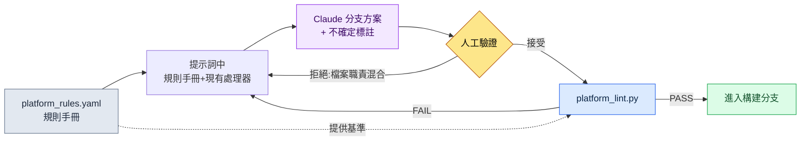

# 14.2 平臺差異(iOS / Android / PC)

第一次把 Alpha 版本放到 PC 上的那天,策劃團隊的即時通訊頻道里貼出了一張截圖。在移動端佔滿螢幕底部的虛擬搖桿,此刻在 27 英寸顯示器正中央只有巴掌大小地懸著。有人跟了一句:「這個用滑鼠怎麼操作?」核心邏輯並沒有問題。戰鬥、背包、任務都照常執行。崩掉的只有一處——把輸入和畫面按移動端前提寫死的那塊地方。

把同一款遊戲釋出到 iOS、Android、PC 三處,運營單位看似會變成 ×3,實際上並非如此。核心邏輯只有 1 個,在其上以 ×3 掛載平臺適配層。問題在於,「哪裡為止是核心、從哪裡開始是適配層」這一點很難由人逐一判斷。只在 iOS 上正常而唯獨在 Android 上出錯的分支、只在 PC 上才有意義的按鍵對映——這類差異無法全部裝進腦子裡。因此本章的核心是這樣一套工作流:把平臺約束以規則手冊(rulebook)明文化,以該規則手冊為依據讓 AI 生成分支方案,最後由 lint 抓出違反規則之處。

---

## 14.2.1 三個平臺有何不同

先看差異的地形。下面是在專案A(筆者作為設計總監正在參與的移動優先 MMORPG)中評估 PC 輔助釋出時整理的平臺約束表。其中依據公開標準的數值一併註明了出處,其餘為專案內部約定值。

| 領域 | iOS | Android | PC |
|---|---|---|---|
| 輸入 | 觸控 | 觸控(+部分鍵盤) | 鍵盤·滑鼠·手柄 |
| 最小觸控目標 | 44pt (Apple HIG) | 48dp (Material) | 點選——不適用 |
| 螢幕 | 4.7\~6.7 英寸 | 4.5\~7 英寸(差異大) | 21\~32 英寸 |
| 支付 | App Store | Google Play | 自建·Steam |
| 通知 | APNs | FCM | OS·自建 |
| 儲存 | iCloud | Google Drive·自建 | Steam Cloud·自建 |
| OS 更換週期 | 1\~2 年 | 1 年(碎片化嚴重) | 5\~10 年 |

iOS 與 Android 在支付、儲存、通知的 *API* 上不同,但使用者看到的畫面與操作幾乎一致。PC 則在輸入、畫面、視覺效果上整體不同。因此運營負擔與直覺相反,不是 ×3 而是接近 ×2——因為 iOS 與 Android 之間的距離很短。

這裡重要的不是表格本身,而是把這張表從供人閱讀的文件變成供機器讀取的規則手冊。唯有如此,AI 生成分支方案時才能以它為依據,lint 才能抓出違規。

---

## 14.2.2 劃分核心與平臺層的那條線

專案A的資料夾結構,是在 1 個核心上掛載 3 個平臺適配層的形態。

```
game/
├── core/                  — 遊戲邏輯(與平臺無關)
│   ├── combat/  inventory/  narrative/  ...
├── platform/              — 平臺適配層
│   ├── ios/      → input/  payment/  notification/
│   ├── android/  → input/  payment/  notification/
│   └── pc/       → input/  payment/  ui/
└── shared/                — 兩側共用(工具·渲染)
```

規則只有一條。**core 不以名字呼叫 platform。**一旦 core 出現 `if platform == "ios"` 這樣的語句,層的分離就崩塌了。以輸入為例,core 只知道「使用技能1」這一意圖(`InputIntent.SKILL_1`),而這一意圖是從觸控座標中提取、還是從鍵盤 `1` 中提取,則由各 platform 層負責。

劃出這條線後,下一步就成為可能。新增新平臺時,無需觸碰 core,只需在 `platform/` 下填入一個資料夾即可。下面這張圖,一覽這條線在實際中如何分岔。

<svg viewBox="0 0 720 360" xmlns="http://www.w3.org/2000/svg" font-family="sans-serif" font-size="13">
  <rect x="0" y="0" width="720" height="360" fill="#fbfbfd"/>
  <!-- core -->
  <rect x="270" y="20" width="180" height="70" rx="8" fill="#1d3557" />
  <text x="360" y="50" fill="#fff" text-anchor="middle" font-weight="bold">core/</text>
  <text x="360" y="70" fill="#cdd9e8" text-anchor="middle" font-size="11">遊戲邏輯 · 與平臺無關</text>
  <text x="360" y="84" fill="#cdd9e8" text-anchor="middle" font-size="11">InputIntent · PaymentInterface</text>
  <!-- arrows down -->
  <line x1="360" y1="90" x2="130" y2="150" stroke="#888" stroke-width="1.5" marker-end="url(#a)"/>
  <line x1="360" y1="90" x2="360" y2="150" stroke="#888" stroke-width="1.5" marker-end="url(#a)"/>
  <line x1="360" y1="90" x2="590" y2="150" stroke="#888" stroke-width="1.5" marker-end="url(#a)"/>
  <defs>
    <marker id="a" markerWidth="8" markerHeight="8" refX="6" refY="3" orient="auto">
      <path d="M0,0 L6,3 L0,6 Z" fill="#888"/>
    </marker>
  </defs>
  <!-- platform boxes -->
  <g>
    <rect x="40" y="150" width="180" height="120" rx="8" fill="#e8f0f8" stroke="#1d3557"/>
    <text x="130" y="173" text-anchor="middle" font-weight="bold" fill="#1d3557">platform/ios</text>
    <text x="130" y="196" text-anchor="middle" font-size="11">touch → intent</text>
    <text x="130" y="214" text-anchor="middle" font-size="11">StoreKit · APNs</text>
    <text x="130" y="232" text-anchor="middle" font-size="11">目標 ≥ 44pt</text>
    <text x="130" y="256" text-anchor="middle" font-size="10" fill="#777">iCloud 儲存</text>
  </g>
  <g>
    <rect x="270" y="150" width="180" height="120" rx="8" fill="#e8f0f8" stroke="#1d3557"/>
    <text x="360" y="173" text-anchor="middle" font-weight="bold" fill="#1d3557">platform/android</text>
    <text x="360" y="196" text-anchor="middle" font-size="11">touch → intent</text>
    <text x="360" y="214" text-anchor="middle" font-size="11">Play Billing · FCM</text>
    <text x="360" y="232" text-anchor="middle" font-size="11">目標 ≥ 48dp</text>
    <text x="360" y="256" text-anchor="middle" font-size="10" fill="#777">碎片化應對</text>
  </g>
  <g>
    <rect x="500" y="150" width="180" height="120" rx="8" fill="#f8efe8" stroke="#9a4f1d"/>
    <text x="590" y="173" text-anchor="middle" font-weight="bold" fill="#9a4f1d">platform/pc</text>
    <text x="590" y="196" text-anchor="middle" font-size="11">key/mouse → intent</text>
    <text x="590" y="214" text-anchor="middle" font-size="11">Steam · OS 通知</text>
    <text x="590" y="232" text-anchor="middle" font-size="11">手柄 · 按鍵對映 UI</text>
    <text x="590" y="256" text-anchor="middle" font-size="10" fill="#777">解析度多樣</text>
  </g>
  <!-- shared -->
  <rect x="270" y="300" width="180" height="44" rx="8" fill="#ddd" />
  <text x="360" y="327" text-anchor="middle" fill="#333">shared/ — 工具·渲染</text>
  <text x="360" y="290" text-anchor="middle" font-size="10" fill="#9a4f1d">PC 的輸入·畫面·視覺整體不同(橙色)</text>
</svg>

iOS 與 Android 的方框是同一藍色系,唯獨 PC 是橙色——用顏色標示了差異的大小。運營負擔的不對稱在此一目瞭然。

---

## 14.2.3 規則手冊:讓機器讀取差異

核心轉折點在這裡。把平臺約束寫進散文式文件,人會忘記。取而代之,把它們彙集到一個宣告式的規則手冊檔案裡。下面是專案A中所用 `platform_rules.yaml` 的節選(從實際檔案中,為本章只摘取了核心規則)。

```yaml
# platform/platform_rules.yaml
targets:
  ios:
    min_touch_pt: 44          # Apple HIG
    contrast_ratio: 4.5       # WCAG SC1.4.3
    gamepad: optional         # iOS 17+ 標準
    forbidden_in_core: ["import platform.ios", "StoreKit", "APNs"]
  android:
    min_touch_dp: 48          # Material
    contrast_ratio: 4.5
    forbidden_in_core: ["import platform.android", "BillingClient", "FCM"]
  pc:
    min_target_px: 24         # WCAG SC2.5.8 (指標)
    input: ["keyboard", "mouse", "gamepad"]
    forbidden_in_core: ["import platform.pc", "SteamAPI"]
required_intents: ["MOVE_FORWARD", "ATTACK", "SKILL_1", "SKILL_2"]
```

這個檔案同時做三件事。(1) AI 生成分支方案時讀取的**規格**,(2) lint 校驗所依據的**基準**,(3) 人記錄共識的**單一齣處**。`forbidden_in_core` 尤為重要——它是絕不允許在 core 資料夾內出現的 token 列表,因而成為機械地抓出層越界的依據。

---

## 14.2.4 實操記錄(worked transcript):規則手冊 → AI 分支方案 → 驗證

現在從頭到尾跟一遍實際操作。情況是這樣的。在準備 PC 輔助釋出的過程中,需要把原本只存在於移動端的輸入處理器分支出 PC 版本。以規則手冊為依據,向 Claude 索取 PC 輸入介面卡的初稿,用 lint 驗證,直到拒絕·再請求,走完一個迴圈。

### 1) 提示詞(全文)

> 下面是我們專案的平臺規則手冊節選和現有的 iOS 輸入處理器。
>
> [貼上上面 platform_rules.yaml 的節選]
>
> ```python
> # platform/ios/input/touch_handler.py
> from core.input.input_intent import InputIntent
>
> def map_touch_to_intent(touch_event):
>     if touch_event.location in skill_button_1_area:
>         return InputIntent.SKILL_1
>     if touch_event.is_drag_up:
>         return InputIntent.MOVE_FORWARD
>     return None
> ```
>
> 請參考它,做一份 `platform/pc/input/keyboard_handler.py` 的初稿。約束:(1) 可以 import core,但絕不要 import platform.ios/android,(2) 把 `required_intents` 的 4 個全部對映,(3) 按鍵對映要能讓使用者修改,拆分為 dict。沒有把握的部分請標出來。

### 2) Claude 的原始輸出(未經摘要·整理)

> 這是初稿。我把按鍵對映抽取到模組頂部的 dict,使使用者可以自定義。
>
> ```python
> # platform/pc/input/keyboard_handler.py
> from core.input.input_intent import InputIntent
>
> DEFAULT_KEYMAP = {
>     "w": InputIntent.MOVE_FORWARD,
>     "1": InputIntent.SKILL_1,
>     "2": InputIntent.SKILL_2,
>     # ATTACK 假定為滑鼠左鍵——鍵盤預設不指定
> }
>
> def map_keyboard_to_intent(key_event, keymap=DEFAULT_KEYMAP):
>     return keymap.get(key_event.key.lower())
>
> def map_mouse_to_intent(mouse_event):
>     if mouse_event.button == "left":
>         return InputIntent.ATTACK
>     return None
> ```
>
> ⚠️ 沒有把握的部分:`required_intents` 中含有 ATTACK,但我把它對映到了滑鼠而非鍵盤。規則手冊的 `required_intents` 究竟是「只要與輸入裝置無關地完成對映即可」,還是「要在單一處理器內全部處理」,沒有明確規格,因此我假定為前者。若為後者,lint 可能會因 ATTACK 缺失而抓出。

### 3) 人工驗證 / 拒絕

這裡 Claude 指出的 ⚠️ 之處,恰恰是陷阱所在。我們的 lint(`platform_lint.py`)不是以處理器**檔案為單位**,而是以**平臺為單位**檢查 `required_intents` 是否滿足。即便 ATTACK 不在 `keyboard_handler.py` 中,只要在 `mouse_handler` 一側存在,就能通過。然而 Claude 給出的輸出,把滑鼠對映一併塞進了 `keyboard_handler.py` 檔案裡——檔案職責混在了一起。結構上雖能通過,卻違反了我們的資料夾規則(按輸入裝置分離檔案)。**拒絕。**

拒絕理由用兩行說清。(1) 把滑鼠對映分離到獨立的 `mouse_handler.py`。(2) 為使 ATTACK 在鍵盤上也能使用,把 `Space` 設為 fallback。

### 4) 再請求 → lint 通過

把再請求後得到的分離版本交給 `platform_lint.py`。lint 讀取規則手冊,檢查以下各項。

```
$ python platform_lint.py platform/pc/
[core-leak]    PASS  — core/ 內 forbidden token 0 處
[intent-cover] PASS  — pc: MOVE_FORWARD, ATTACK, SKILL_1, SKILL_2 (4/4)
[touch-target] SKIP  — pc 為 min_target_px=24 (在 UI 層單獨檢查)
[no-cross-import] PASS — platform.pc 未引用 platform.ios/android
```

關鍵在於 `intent-cover` 落到 4/4。AI 生成的初稿是否滿足規則手冊的基準,不再由人眼、而是由指令碼來確定。這一行,替代了在多平臺運營中人每次都要在腦中核算的工作。

把這個迴圈壓縮成一張圖,如下所示。



規則手冊向提示詞與 lint **兩側**供給基準,正是這一結構的核心。AI 生成、人判斷、lint 確定——三種角色看的是同一份規則手冊。

---

## 14.2.5 構建分支:相同的核心,不同的組裝

處理器齊備後,構建就是簡單的組裝。core 與 shared 固定,只替換 platform 資料夾一個。

```
[core/ + shared/ + platform/ios/]      → iOS 構建
[core/ + shared/ + platform/android/]  → Android 構建
[core/ + shared/ + platform/pc/]       → PC 構建
```

在 CI 中,這三者不是**序列**而是**並行**執行,每次構建後立即自動執行 `platform_lint.py`。若序列執行,構建時間會變成 3 倍;若省去 lint,違反規則之處會一直存活到部署階段。並行構建 + 自動 lint,這兩點是多平臺 CI 的最低要件。

釋出週期因平臺而異,因此不會因為構建通過就同時部署。iOS 稽核通常為 1\~3 天,對頻繁釋出較為保守;Android 在數小時內即可生效,可以更頻繁地釋出;Steam 則在 1\~2 天上下。即便是同一處改動,iOS 也是最晚上線的一方,因此熱修復的排期始終以 iOS 為基準倒推。

---

## 14.2.6 UI 變體:通用 80 · 變體 15 · 專用 5

在程式碼之下,畫面也會分岔。以經驗來看,推薦的分佈是通用元件 80%、平臺變體(僅大小·位置不同)15%、平臺專用 5%。不過這一比例會因品類而波動——若是休閒益智類,通用可升至 90%,而 MMORPG 因輸入差異,變體會更多。

專用元件是發揮平臺魅力的地方,並非一味通用化就是答案。移動端的虛擬搖桿·振動、PC 的按鍵對映 UI·手柄設定這類只在該平臺上才有意義的東西,都歸入此處。不過專用一旦超過 30%,那就不是魅力,而是運營負擔的訊號——在 lint 中掛上 `platform-specific-ratio` 警告,即便人忘了,構建也會替你指出。

這裡也是 AI 輔助的界線所在。平臺差異大多屬於確定性規則的領域,因此 AI 與其自由地探索候選,不如用於**生成**滿足規則手冊的分支方案。輸入對映推薦、Figma 設計稿的平臺變體轉換、多語言×多平臺的文本適配,大致就是 AI 實質上添力的地方,而其輸出始終必須通過 lint。在進步式自動化之前,先要做的是介面卡標準化。

---

## 14.2.7 分離的價值——以及常見陷阱

層分離最大的效果是**新增平臺的速度**。在單一程式碼庫上堆疊 if 語句來貼合 PC,實際上接近於做一款新遊戲的成本;而不觸碰 core、只填充 `platform/pc/`,那段時間就會大幅縮短。新增平臺加快的比例因專案而異,所以不斷言具體倍數——不過在我們內部評估中,推算 PC 輔助新增的排期相比單一程式碼假設可縮減到一半以下(筆者估算,未經驗證)。作為附帶效果,各平臺的事故被隔離,core 改動的可信度也隨之提升(只改一處即可一致地反映到三個構建中)。

常踩的陷阱與對策如下。

| 陷阱 | 對策 |
|---|---|
| core 中 `if platform == ...` 分支激增 | 用 `forbidden_in_core` lint 攔截,拆分為介面卡 |
| 僅憑人眼評審 AI 分支方案 | 用 `platform_lint.py` 確定 intent-cover |
| 把輸入裝置對映全塞進一個檔案 | 按裝置分離處理器(keyboard/mouse) |
| 專用元件 30%+ | `platform-specific-ratio` 警告,評估通用化 |
| 構建一通過就三平臺同時部署 | 按釋出週期差異,以 iOS 為基準倒推 |

這些陷阱的共同點在於「試圖靠人的記憶來防堵」。寫進規則手冊、掛到 lint 上,即便人忘了,構建也會記得。

---

### 本章要點
- 平臺約束必須以規則手冊檔案而非散文來明文化,AI 與 lint 才能看同一份基準
- AI 基於規則手冊生成分支方案,人做判斷,lint 確定是否滿足
- 運營負擔不是 ×3 而是 ×2——因為 iOS·Android 的距離很短,唯獨 PC 遙遠

### 下一章預告
- 14.3 觸控 / 滑鼠輸入設計——兩種輸入的本質差異

---

## 動手試試

**setup.** 在專案中建立 `platform/platform_rules.yaml`,像上面的節選那樣,按平臺寫下 `min_touch`、`contrast_ratio`、`forbidden_in_core`、`required_intents`。數值不要編造,而要取自公開標準(觸控 44pt·48dp·對比度 4.5:1 等公開標準遵循 §9.1 規則手冊;PC 指標目標 24px 為 WCAG SC2.5.8)。

**prompt.** 把規則手冊節選 + 現有某一平臺的處理器一併貼上,並這樣請求。「請遵守這份規則手冊,做一份 `platform/<新平臺>/input/` 處理器的初稿。絕不要放入 `forbidden_in_core` token,把 `required_intents` 全部對映,沒有把握的部分用 ⚠️ 標出。」

**verify.** 執行 `platform_lint.py`(40 行左右的指令碼就夠),它讀取規則手冊並檢查以下各項。(1) core 資料夾內 `forbidden_in_core` token 0 處,(2) 各平臺的 `required_intents` 全部對映,(3) platform 資料夾之間無 cross-import。只要有一項 FAIL,就回到提示詞,寫下拒絕理由並再請求。

### 單人精簡版
如果你獨自工作、也沒有構建 CI,就把規則手冊從 YAML 縮減為一張 Markdown 檢查清單。「目標 ≥44pt,禁止在 core 中 import 平臺,對映 4 個意圖」三行就夠。不用 lint 指令碼,把成果交給 AI,讓它「把這份檢查清單的 3 項逐一判定為通過/失敗」,就能代替人的核算。關鍵不在工具的規模——而在於把基準寫在腦袋之外,並把生成與驗證分開。
