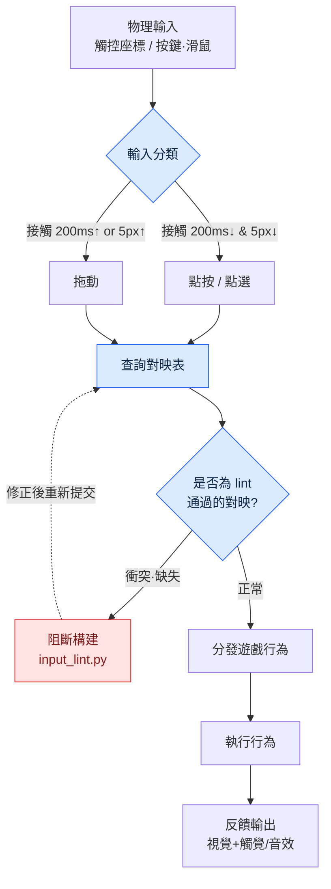

# 14.3 觸控 / 滑鼠輸入設計

拿到 QA 構建的組員 B 單手握著手機，皺起了眉頭。"技能按了三次，只放出來兩次。"我湊近螢幕一看，拇指按下技能按鈕的那一瞬間，同一根手指正好蓋住了按鈕旁邊約三分之一的區域。用滑鼠測試時從未出現過這個問題——因為滑鼠沒有手指。

這個場景用一句話概括了觸控與滑鼠的本質。兩者都是"指向某一點"的輸入，但一種的指向工具會遮住螢幕，另一種不會。為什麼同一個行為要在兩種輸入上用不同方式來實現，原因就從這裡開始。本章先梳理兩種輸入的差異，隨後完整跟隨一條實操記錄（worked transcript，完整保留的真實操作過程記錄）的主幹——先讓 AI 提出輸入對映方案，再親自驗證衝突與可達性。

---

## 14.3.1 兩種輸入的本質差異

手指的粗細、視野遮擋、多點觸控上限、精度全都不同。在用表格把它固化下來之前，先用一個畫面來建立直觀感受。滑鼠游標是一支 1 畫素的筆尖，手指則是一枚直徑將近 1 釐米的印章。筆尖能寫字，但一次只寫一個字。印章蓋得快卻寫不了字，而且蓋下去的那一刻就看不見紙了。

| 屬性 | 觸控 | 滑鼠 |
|---|---|---|
| 精度 | 約 7\~10mm（手指接觸面） | 1px 級 |
| 視野遮擋 | 手指遮住接觸點周圍 | 無 |
| 可否懸停 | 幾乎不可能（接觸 = 輸入） | 自由（移動 ≠ 輸入） |
| 同時輸入 | 2\~10 點多點觸控 | 左·右·中·滾輪 |
| 拖動/點按區分 | 需靠時間·距離推斷 | 點選/拖動明確 |
| 觸覺反饋 | 可以 | 幾乎沒有 |

這裡對設計影響最大的兩行是"視野遮擋"和"懸停"。視野遮擋強制決定了結果顯示在哪裡，而懸停的缺失意味著在移動端，工具提示（tooltip）這一整個資訊通道被徹底抹去。其餘四行更接近由這兩行派生出來的細節。

公開標準把這些差異用數值釘死了——觸控 44pt（HIG）·48dp（Material）·對比度 4.5:1·觸控目標 24 CSS 畫素（WCAG SC2.5.8）這類公開標準遵循 §9.1 規則手冊。這些數字不是憑喜好，而是人體與測量的產物，所以驗證對映時用來衡量的尺子最終也是這套標準。

## 14.3.2 按遊戲行為的對映

移動·攻擊·技能這三種行為，用兩種輸入來實現時會如下分岔。一個行為有三種方式，並不意味著沒有正確答案，而是意味著遊戲定位會強制做出選擇。

- 移動 —— 觸控：ⓐ虛擬搖桿（左側）ⓑ點按螢幕→自動移動 ⓒ拖動→鏡頭旋轉 / 滑鼠：ⓐWASD ⓑ點選→自動移動 ⓒ移動滑鼠→視角
- 攻擊 —— 觸控：ⓐ點按攻擊按鈕 ⓑ點按敵人→自動攻擊 ⓒ滑動→連招 / 滑鼠：ⓐ左鍵 ⓑ點選敵人→自動攻擊 ⓒ連點→連招
- 技能 —— 觸控：ⓐ點按技能槽 ⓑ長按技能槽瞄準 ⓒ手勢 / 滑鼠：ⓐ按鍵 1\~8 ⓑ按鍵+滑鼠瞄準 ⓒ宏

我所在的專案A（移動優先的 MMORPG）在移動這一行為上：移動端採用 ⓐ+ⓑ 混合方案（搖桿與自動移動並行），PC 端採用 WASD+自動移動。攻擊方面，移動端為 ⓑ+ⓐ（點按敵人後再按按鈕），PC 端可在 ⓐ·ⓑ 之間自由選擇。技能方面，移動端為 ⓐ，或在鎖定目標時用 ⓑ，PC 端在按鍵 1\~8 之上疊加滑鼠瞄準。同一款遊戲、同一個行為，對映表卻出現了兩張——這正是本章的全部要點。

問題在於，對映表越長，衝突就藏得越深。長按技能槽（技能瞄準）與拖動螢幕（鏡頭旋轉）在同一區域重疊時會怎樣？按鍵 1\~8 已經被技能佔用，若有人把背包快捷鍵也提議設為 1，又會如何？靠人眼掃一遍表格是會漏掉的。因此需要這樣一套工作流：讓 AI 提出對映方案，而把驗證交給工具。

## 14.3.3 實操記錄 —— AI 對映方案與 lint 驗證

從這裡開始就是本章的主幹。讓 Claude 提出 PC 鍵盤/滑鼠對映的初稿，由人來驗證其輸出，執行衝突·可達性 lint 加以駁回，再重新請求——我把這一整個迴圈原樣搬過來。不做概括。原始輸出裡也含有錯誤，而我們正是要看清抓出這些錯誤的過程。

### 提示詞（全文）

> 你要設計一款 PC MMORPG 的輸入對映。請針對下面的行為列表，提出一份將其對映到鍵盤/滑鼠的 JSON 方案。
>
> 行為：移動（前後左右）、奔跑、跳躍、普通攻擊、技能1\~8、背包、地圖、角色面板、選單、視角鎖定切換、放大/縮小、上下文選單（輔助行為）、自動移動切換。
>
> 約束：
> - 遵循業界慣例（WASD 移動、ESC 選單等）。
> - 不要在同一個物理按鍵/按鈕上重疊兩個行為。
> - 每一項包含 `action`、`input`、`note` 欄位。
> 輸出僅為 JSON 陣列。

### Claude 原始輸出（原樣，未做改動）

```json
[
  {"action": "move_forward",  "input": "W",      "note": "標準移動"},
  {"action": "move_back",     "input": "S",      "note": "標準移動"},
  {"action": "move_left",     "input": "A",      "note": "標準移動"},
  {"action": "move_right",    "input": "D",      "note": "標準移動"},
  {"action": "run",           "input": "Shift",  "note": "按住時奔跑"},
  {"action": "jump",          "input": "Space",  "note": "標準"},
  {"action": "attack_basic",  "input": "Mouse1", "note": "左鍵主行為"},
  {"action": "skill_1",       "input": "1",      "note": ""},
  {"action": "skill_2",       "input": "2",      "note": ""},
  {"action": "skill_3",       "input": "3",      "note": ""},
  {"action": "skill_4",       "input": "4",      "note": ""},
  {"action": "skill_5",       "input": "5",      "note": ""},
  {"action": "skill_6",       "input": "6",      "note": ""},
  {"action": "skill_7",       "input": "7",      "note": ""},
  {"action": "skill_8",       "input": "8",      "note": ""},
  {"action": "inventory",     "input": "I",      "note": "Tab 讓給目標切換"},
  {"action": "map",           "input": "M",      "note": ""},
  {"action": "character",     "input": "C",      "note": ""},
  {"action": "menu",          "input": "Escape", "note": "標準"},
  {"action": "cam_lock",      "input": "Mouse3", "note": "滾輪點選切換視角鎖定"},
  {"action": "zoom_in",       "input": "WheelUp",   "note": ""},
  {"action": "zoom_out",      "input": "WheelDown", "note": ""},
  {"action": "context_menu",  "input": "Mouse2", "note": "右鍵輔助行為"},
  {"action": "auto_move",     "input": "Mouse2", "note": "右鍵雙擊自動移動"}
]
```

輸出看上去很整潔。正因如此才危險。看最後兩行。`context_menu` 和 `auto_move` 都被繫結到了 `Mouse2`（右鍵）。儘管約束裡明確寫了"不要在同一個鍵上重疊兩個行為"，模型卻在 `note` 裡附上"用雙擊加以區分"的託詞，硬是讓它們重疊了。這正是不能把 AI 輸出原樣放進構建的理由。人掃一遍表格，很容易漏掉 23 行中第 22 行與第 23 行的衝突，而模型會為自己的衝突找合理化的藉口。

因此把驗證交給程式碼，而不是眼睛。執行一個小巧的 lint，檢查衝突（同一輸入重複）與可達性（缺失必需行為、雙手拇指夠不到的角落）。

```python
# input_lint.py — 輸入對映的衝突·可達性檢查
import json, sys
from collections import defaultdict

REQUIRED = {"move_forward","move_back","move_left","move_right",
            "attack_basic","menu","inventory","map"}

def lint(mapping):
    errors, warns = [], []
    seen = defaultdict(list)
    for m in mapping:
        seen[m["input"]].append(m["action"])
    # 1) 衝突：同一輸入繫結 2 個以上行為
    for inp, acts in seen.items():
        if len(acts) > 1:
            errors.append(f"CONFLICT  {inp} <- {', '.join(acts)}")
    # 2) 可達性：缺失必需行為
    actions = {m["action"] for m in mapping}
    for r in sorted(REQUIRED - actions):
        errors.append(f"MISSING   required action '{r}'")
    # 3) 空 note 警告（未記錄設計意圖）
    for m in mapping:
        if not m["note"].strip():
            warns.append(f"NO_NOTE   {m['action']} ({m['input']})")
    return errors, warns

data = json.load(open(sys.argv[1], encoding="utf-8"))
errs, warns = lint(data)
for e in errs:  print("[ERROR]", e)
for w in warns: print("[WARN] ", w)
print(f"\n=> {len(errs)} error(s), {len(warns)} warning(s)")
sys.exit(1 if errs else 0)
```

把上面的 JSON 儲存為 `claude_map.json` 並執行 lint，實際輸出如下。

```
[ERROR] CONFLICT  Mouse2 <- context_menu, auto_move
[WARN]  NO_NOTE   skill_1 (1)
[WARN]  NO_NOTE   skill_2 (2)
[WARN]  NO_NOTE   skill_3 (3)
... (skill_4~8 相同)

=> 1 error(s), 8 warning(s)
```

lint 精確地揪出了人眼漏掉的唯一一處衝突。可達性檢查通過了（8 個必需行為全部存在）。8 處空 `note` 只是警告，並不阻斷構建，但它暴露出未記錄設計意圖這筆債。現在帶著駁回理由把它退回給模型。

### 人工駁回 + 重新請求

> lint 結果顯示 `Mouse2` 上 context_menu 與 auto_move 重疊，予以駁回。用雙擊來區分會帶來右鍵延遲，在戰鬥中導致誤操作。請把 auto_move 分離為獨立輸入。另外 skill_1\~8 的 note 是空的——請為每個槽逐行填上它屬於哪一類技能。

### Claude 重新輸出（僅摘錄解決衝突的部分）

```json
  {"action": "context_menu", "input": "Mouse2",      "note": "右鍵 = 僅輔助/上下文行為"},
  {"action": "auto_move",    "input": "Numpad0",     "note": "自動移動切換，與戰鬥鍵物理分離"},
  ...
  {"action": "skill_1", "input": "1", "note": "近戰主力技能"},
  {"action": "skill_8", "input": "8", "note": "緊急閃避/生存技能 —— 小指可達受限，考慮重新繫結到 Q"}
```

重新輸出的最後一行很有意思。模型主動申報了可達性問題，說"8 號鍵是小指的可達極限"。這與我們下一節要討論的可達性驗證正是同一個主題。再跑一次 lint，會以 `0 error(s)` 通過。要點在於：AI 能快速生成一份 23 行的初稿，但這份初稿是否合規，由人定義的規則（REQUIRED 集合、衝突的定義）和程式碼來保證。提案由模型出，判定由工具做，決定由人拍板。

## 14.3.4 輸入流 —— 從對映到抵達螢幕

把一次物理輸入被轉換為遊戲行為的路徑畫出來，就能看清上面的 lint 卡在哪個環節。



從左上方進入的物理輸入，首先被分類為點按還是拖動（依下一節的 200ms/5px 標準）。分類後的輸入會去查詢對映表，而這張表在進入構建之前必須通過 `input_lint.py`——這正是圖的核心。一旦存在衝突或缺失，就到不了分發環節，會被阻斷。對映驗證必須在執行時之前、在構建關卡（build gate）處結束。

## 14.3.5 觸控設計的 5 條原則

現在假設對映已經通過，接下來設計這套對映與手指相遇的那個表面。

**原則 1 —— 最小觸控面積。** Apple HIG 的 44pt、Material 的 48dp 是下限。在 HD 螢幕上取大約 100px（Retina 2 倍環境為 200px）上下，就能同時滿足兩項標準。低於這個值，開頭那句"按三次出兩次"就會以統計資料的形式顯現出來。

**原則 2 —— 拇指可達區域。** MMORPG 移動端以橫屏雙手握持為標準，需要按壓的元素放在下方左右兩角、消耗品/技能槽放在中央下方（三區域模型的依據見 §9.1）。P0 行為（左=移動，右=攻擊·技能）放在左右下方兩角之內，不常看的資訊放在可達極限之外的上方。兩角相加也不到螢幕的一半，這一點是輸入設計的核心。下面的 SVG 展示了橫屏模式下雙手拇指的可達區域與中央下方的槽位欄。

<svg viewBox="0 0 420 240" xmlns="http://www.w3.org/2000/svg" role="img" aria-label="橫屏模式下雙手拇指的可達區域">
  <rect x="10" y="10" width="400" height="220" rx="14" fill="#f7f7fa" stroke="#333" stroke-width="2"/>
  <!-- 左側拇指扇形 -->
  <path d="M 30 230 A 150 150 0 0 1 180 80 L 30 80 Z" fill="#3a7bd5" opacity="0.20"/>
  <path d="M 30 230 A 95 95 0 0 1 125 135 L 30 135 Z" fill="#3a7bd5" opacity="0.40"/>
  <!-- 右側拇指扇形 -->
  <path d="M 390 230 A 150 150 0 0 0 240 80 L 390 80 Z" fill="#d5533a" opacity="0.20"/>
  <path d="M 390 230 A 95 95 0 0 0 295 135 L 390 135 Z" fill="#d5533a" opacity="0.40"/>
  <!-- 中央上方矩形區域 -->
  <rect x="150" y="22" width="120" height="50" rx="6" fill="#999" opacity="0.18"/>
  <text x="210" y="52" font-size="12" text-anchor="middle" fill="#444">上方 = 可達之外（資訊顯示）</text>
  <!-- 中央下方槽位欄（琥珀色 — 消耗品·快捷槽）-->
  <rect x="160" y="178" width="100" height="36" rx="6" fill="#f59e0b" opacity="0.35" stroke="#f59e0b" stroke-width="1.5" stroke-dasharray="4 3"/>
  <text x="210" y="200" font-size="10" text-anchor="middle" fill="#92400e">中央下方 = 消耗品·快捷槽</text>
  <text x="78" y="205" font-size="12" text-anchor="middle" fill="#1c4a8a">左拇指</text>
  <text x="342" y="205" font-size="12" text-anchor="middle" fill="#8a2a1c">右拇指</text>
  <text x="78" y="160" font-size="10" text-anchor="middle" fill="#1c4a8a">舒適</text>
  <text x="342" y="160" font-size="10" text-anchor="middle" fill="#8a2a1c">舒適</text>
  <text x="210" y="225" font-size="11" text-anchor="middle" fill="#555">深色區域 = P0 按鈕佈置 / 淺色區域 = 可達極限</text>
</svg>

深色扇形是拇指能輕鬆夠到的地方，淺色扇形則是必須伸手才夠得著的極限。若說 14.3.3 重新輸出中模型申報的"8 號鍵小指極限"是 PC 版的情形，那麼移動版對應的失誤，正是把 P0 按鈕放進這塊淺色區域。

**原則 3 —— 規避視野遮擋。** 手指不只遮住接觸點，其上方還有整隻手覆蓋螢幕。點按右下角的技能時，右下角約四分之一會看不見。因此把行為的結果（傷害數字、狀態變化）顯示在手指夠不到的區域。握著左側搖桿的手會侵佔角色與小地圖的位置，所以把小地圖移到右上角。

**原則 4 —— 拖動/點按的區分。** 與滑鼠不同，觸控必須靠時間和距離來推斷使用者的意圖。在整個遊戲裡統一為一個標準——例如接觸在 200ms 以內且移動在 5px 以內為點按，超過則為拖動。這兩個數字若忽大忽小，"本想點按結果角色翻滾了"這類意圖失敗就會累積。上面 mermaid 的分岔點正是這一判定。

**原則 5 —— 觸覺。** 振動是無需看螢幕也能傳達的唯一通道。不過若對每一次輸入都施加振動，就會變成噪音。普通點按不振動，使用技能短促振動，支付確認這類高風險行為強烈振動，擊殺敵人則輕微振動——控制在 4\~5 種以內。

## 14.3.6 滑鼠設計的 5 條原則

滑鼠享有觸控所沒有的三種奢侈：懸停、多按鈕、游標精度。

**原則 1 —— 懸停。** 滑鼠不按下也能指向。把滑鼠懸在技能槽上，會彈出名稱·冷卻時間·說明的工具提示，點選則會釋放。觸控沒有這個中間狀態，所以懸停是 PC 得以疊加更多資訊的通道。但要在 14.3.3 的對映階段就預先意識到：只依賴懸停的資訊，到了移動版會無處安放。

**原則 2 —— 多按鈕。** 左鍵是主行為，右鍵是輔助/上下文，滾輪點選是視角重置，滾輪是縮放。上面 lint 抓出的衝突，正是在這個右鍵上重疊了兩個行為的例子。因按鈕多就想把它們全填滿，於是製造出衝突。

**原則 3 —— 鍵盤標準。** ESC=選單，M=地圖，1\~8=技能，WASD=移動，Shift=奔跑，Space=跳躍。使用者不用學也應該能猜到。偏離標準的鍵，要把相應的理由寫進 `note` 裡——14.3.3 中把 Tab 讓給目標切換而非背包的決定就是一例。

**原則 4 —— 視角控制。** 用滑鼠拖動來旋轉視角，同時明確切換：把游標鎖定在螢幕上的遊戲模式，與釋放游標的 UI 模式。這個切換若含糊，就會出現"關掉選單後游標卻消失了"的混亂。

**原則 5 —— 宏·自動化的允許範圍。** 自動攻擊·自動移動允許到什麼程度，是遊戲定位的問題。放得太開，PC 就變成一片宏的畫面；一味禁止，從移動端過來的使用者門檻就會變高。正確答案是按遊戲調性在這條譜系上選取某一個點，而不是兩個極端。

## 14.3.7 兩端通用 —— 統一輸入反饋

原則因平臺而異，但使用者對同一個行為所獲得的"感覺"，即便換了平臺也應當一致。不能讓從移動端轉到 PC 的使用者重新學習按鈕高亮的含義。

| 情形 | 觸控 | 滑鼠 |
|---|---|---|
| 輸入識別 | 按鈕高亮 + 短促觸覺 | 按鈕高亮 + 點選音 |
| 輸入失敗 | 按鈕抖動 + 觸覺 | 按鈕抖動 + 警告音 |
| 冷卻進行中 | 環形進度條 | 環形進度條 |
| 恢復可用 | 高亮 + 觸覺 | 高亮 + 音效 |

視覺通道（高亮·抖動·進度條）兩端相同，只有輔助通道按平臺在觸覺↔音效之間分岔。這種一致性把多平臺使用者的學習成本減半。

## 14.3.8 常見失敗與處方

| 模式 | 處方 |
|---|---|
| 按鈕低於標準下限（44pt/48dp） | 強制取 100px 上下 |
| 在手指遮擋區域顯示結果 | 移到非遮擋區域 |
| 濫用觸覺 | 控制在 4\~5 種以內 |
| 右鍵重疊兩個行為 | 用 lint 阻斷衝突後分離 |
| 把僅懸停的資訊原樣搬到移動端 | 移動端用點按/長按替代通道 |
| 鍵位對映寫死 | 允許使用者自定義 |
| 強制兩端相同對映 | 各平臺採用自然的對映 |

這張表的第四行就是 14.3.3 實操記錄的結論。右鍵衝突靠人眼掃表幾乎每次都會漏掉，而把 lint 掛在構建關卡上則幾乎每次都能抓到。

---

### 本章要點
- 觸控是手指遮住螢幕的印章，滑鼠是不遮擋的筆尖——把一端的 UX 原樣搬過去，就會與手錯位。
- 輸入對映由 AI 提出，但衝突·可達性由 lint 判定——人眼會漏掉 23 行中那一行衝突。
- 反饋的視覺通道兩端統一，只有輔助通道在觸覺↔音效之間分開。

### 下一章預告
- 15.1 運營（LiveOps）—— 上線後遊戲得以持續運轉的週期

---

### 動手試試（setup → prompt → verify）

1. **setup** —— 把行為列表和約束整理到一個檔案裡（移動·攻擊·技能·UI·視角）。把上面的 `input_lint.py` 放進專案。將 `REQUIRED` 集合替換為你自己遊戲的必需行為。
2. **prompt** —— 直接使用 14.3.3 的提示詞全文，只替換行為列表。把輸出固定為僅接收 JSON 陣列。
3. **verify** —— 用 `python input_lint.py claude_map.json` 執行收到的 JSON。在 ERROR 歸零之前，明確寫出駁回理由（衝突輸入·缺失行為）並重新請求。WARN（空 note）作為未記錄設計意圖的債務另行記錄。

### 單人精簡版
如果是獨自開發的小遊戲，就精簡工具。行為在 10 個以內時，只保留 `REQUIRED` 集合與"同一輸入重複"兩項檢查的 20 行 lint 就足夠了。讓 AI 給出對映，用這個迷你 lint 只篩掉衝突，然後在真機上按一按，看看拇指（或小指）能否夠到。提案由模型出，衝突判定由程式碼做，可達判定靠你自己的手——只要守住這三點，無論規模大小都行得通。
