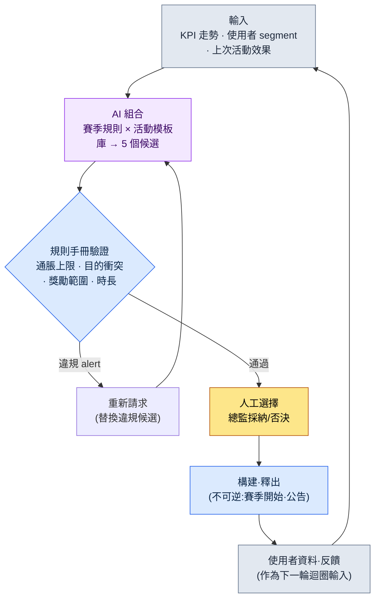

# 15.1 運營(LiveOps)總覽 —— 活動候選由 AI 組合,規則手冊篩除,人來選定

> 主要讀者:首次負責上線後運營(LiveOps)的策劃(中等規模(10\~50 人)團隊)
> 面向單人/業餘讀者的精簡版:§15.1.7「一個人的話,只做這些」
>
> **前提**:筆者親歷過一款全球上線的移動端 MMORPG 的運營,連同 P2E(Play To Earn,邊玩邊賺)經濟一併經歷過,並在此之上疊加了當前專案上線前的 AI 工作流來寫作本章。實操記錄(worked transcript,即完整保留的真實操作過程記錄)是把"輸入→AI 組合→規則手冊驗證→人工選擇"的模式,以運營樣式實際跑一遍的結果。凡屬推測與觀察,都明確標註為推測·觀察;編造的 KPI 表一概不放。

上線次日清晨的辦公室,與上線前不一樣了。里程碑結束了,活兒卻沒有減少,反而只是單位變得更小。原本以季度為單位排布的日程,被切成周·日·小時為單位。而每週都有同一個問題回到會議室:"這個週末上什麼活動?"

如果這個問題每週都從一張白紙重新開始,運營團隊很快就會疲憊。本章要講的,就是把這個問題從白紙中解放出來的方法。核心有兩點。第一,與其每次都從頭絞盡腦汁想活動和賽季,不如把它們沉澱為**由已驗證樣式構成的庫**。第二,把"組合這些樣式、生成下週 5 個候選"這種枯燥的初稿工作交給 AI,人只決定**在通過規則手冊驗證的候選中採納哪一個**。從 0 開始做,和從 5 個裡挑,工作負擔是不同的。

---

## 15.1.1 運營不是"感覺",而是"迴圈"

把運營的標準週期做成表讓人背誦的書有很多。無非是週一彙報、週二三準備、週五釋出。這些都沒錯,但只背表格,看不出"本週活動"這個每週都要回來的決策究竟是怎麼做出來的。運營的本質不是日程表,而是**閉合的迴圈**——候選產生、通過驗證、由人選定、進入構建釋出、使用者資料又成為下一批候選的輸入,如此一圈。

在這個迴圈之上,運營的四條軸(內容·活動·數值平衡·CS(客服))各以各自的速度運轉。內容是月\~季度,活動是周\~月,數值平衡是周\~雙週,CS 是日·小時為單位。四條軸各轉各的,那麼看著同一份使用者資料,每週也會得出不同的決策。因此,把四條軸擰成一個迴圈,並把這個迴圈中的一格(活動候選生成)做成 AI 能夠運轉的形態,就是本章的目標。



需要人動手的地方只有兩處。最上面把輸入(KPI·segment·過往效果)乾淨地喂進去的那一處,以及在通過驗證的候選中決定上哪一個的那一處。夾在中間那些枯燥的"絞出 5 個組合"和"篩掉規則違反",由 AI 和規則手冊來跑。而最下面那一行——已釋出的活動所產生的使用者資料又迴流為輸入——正是它讓這個迴圈成其為運營。上線前的設計一旦發出去就結束了,而在運營中,結果會成為下一次的輸入。

進入這個迴圈的兩個庫(賽季規則·活動模板)的具體內容將在 §15.2 展開,最後一格(使用者反饋自動分類)在 §15.3 來看。本章專注於把迴圈完整地走完一圈。

---

## 15.1.2 [實操記錄] 組合 5 個活動候選 → 規則手冊驗證 → 人工選擇

下面把實際怎麼跑的完整地展示一整個迴圈。以下是把筆者在上線前的內容工具中驗證過的"庫組合 → 規則手冊驗證 → 人工選擇"模式,搬到運營樣式(賽季規則 + 活動模板)上實際跑一遍的會話的還原。輸入提示詞可以直接複製使用,輸出則是對那次會話的還原。

### 第 1 步 —— 輸入:把庫和當前狀況原樣丟進去

先把組合所需的兩樣材料,放成機器能讀的形態。活動模板庫(已驗證的樣式)和賽季規則庫,以及本週的當前狀況(KPI·segment)。庫一旦建好,每週都可複用。

```yaml
# event_templates.yaml —— 已驗證的活動模板庫(節選,9 種中的 4 種)
- id: tpl_attendance      # 簽到獎勵
  目的: [拉新, 迴流]
  建議時長: 7~14天
  獎勵等級: 低~中
- id: tpl_coop_raid       # 協作團本
  目的: [存量啟用, 社群]
  建議時長: 3~7天
  獎勵等級: 中~高
- id: tpl_pvp_season      # 競技賽季
  目的: [社群, 存量啟用]
  建議時長: 14~28天
  獎勵等級: 高
- id: tpl_limited_package # 限定禮包
  目的: [營收]
  建議時長: 3~7天
  獎勵等級: 高 (付費聯動)

# season_rules.yaml —— 賽季規則片段(節選)
season_inflation_cap: 每季度'高'等級獎勵活動 ≤ 3 次
purpose_conflict_rule: 同一周內禁止同時安排 2 個 [營收] 目的活動
overlap_rule: '高'獎勵活動禁止同時 2 個(疲勞·通脹)

# current_state.yaml —— 本週狀況
周次: 2026-W23
前兩週營收活動: 1 次(本季度累計'高'等級 2 次)
DAU走勢: 緩慢下降(過去 4 周 -6%,據行業觀察處於'警戒'區間)
主要segment: 可迴流的休眠使用者佔比上升
臨近的外部日程: 無
```

### 第 2 步 —— 提示詞:讓它組合,但強制規定格式和規則

```
用附上的模板·賽季規則·本週狀況 yaml,只組合出下周的 5 個活動候選。
不要創造新機制,只用所附模板的組合;是否違反賽季規則由你自己標註,
併為每個候選補上一行:它為何契合當前訊號(DAU 下降·休眠迴流)。
讓目的不要只偏向營收,要分散開;含糊的就標出來交給我。
只用表格,列為:候選·模板組合·主要目的·時長·規則違反·依據·含糊。
```

請注意,這五行規則中沒有任何一行在說"要做什麼"。它們全是"在什麼框架內、以什麼為依據來回答"的約束。因為一旦給 AI 自由,它就會吐出一般 RPG 的平均活動。**把材料限制在庫以內(規則 1)、賽季規則自查義務(規則 2)、對當前訊號作出應對的依據義務(規則 3)、目的分散(規則 4),以及"含糊就交給人"這個出口(規則 5)**——五行合起來,規定的不是候選的樣子,而是候選的資格。

### 第 3 步 —— Claude 的輸出(還原,節選)

下面是未經摘要的原始輸出。其中混著規則違反與含糊的自報。

```
| 候選 | 模板組合                      | 主要目的        | 時長  | 規則違反 | 依據                                       | 含糊 |
|-----|------------------------------|----------------|-------|---------|--------------------------------------------|------|
| C1  | tpl_attendance               | 迴流           | 10天  | 無      | 直接應對可迴流休眠層佔比上升,獎勵'中'      | -    |
| C2  | tpl_coop_raid                | 存量啟用       | 5天   | 無      | DAU 下降期提供上線動機,刺激社群            | -    |
| C3  | tpl_attendance+tpl_coop_raid | 迴流+啟用      | 7天   | 無      | 用簽到吸引迴流 + 用團本留存,組合協同        | -    |
| C4  | tpl_pvp_season               | 社群           | 21天  | 無      | 用長期賽季直接抬升留存曲線本身              | ★    |
| C5  | tpl_limited_package          | 營收           | 5天   | ★違反   | 本季度'高'等級累計 2 次 → 再加則逼近/超出上限 | -    |

規則檢查結果:
- C5: 有違反 season_inflation_cap 的風險。本季度'高'等級獎勵活動
  已有 2 次。再加上 C5 就到 3 次,逼近上限。DAU 下降期推營收
  可能加重使用者疲勞,與訊號也方向相反。
- C4: 雖無規則違反,但 21 天的 PvP 賽季佔用的不是這一週,而是 3 周。
  它作為'本週候選'是否合適,需要運營策略判斷 → 標為含糊。
- C1·C2·C3 通過規則,與當前訊號(休眠·DAU)相符。
```

輸出中最有價值的部分不是表格,而是**最下面那三行規則檢查**。AI 自己抓出並標記了 C5 的通脹違反,又把 C4 以"不算違反,但判斷有分歧"為由交給了人。好的提示詞,能讓 AI 主動申報自身的侷限、把球傳給人。

### 第 4 步 —— 驗證與選擇(人的位置)

不能把這份輸出照單全收。要用規則手冊再過一遍,然後才由人來挑。在這次會話中,實際上有兩處出現了分歧。

首先,**C5 拒絕**。AI 已經標出了通脹違反,規則手冊程式碼(§15.1.3)也給出了同樣的判定。它撞上了季度'高'等級上限,而 DAU 下降期推營收與當前訊號方向相反。沒什麼可討論的。拿掉。

接下來是 **C4(21 天的 PvP 賽季)**。這是 AI 以"含糊"交出來的那一項。雖無規則違反,但這不是"本週活動",而是"本賽季的決策"。它不該在一週一圈的迴圈裡當場拍板,而應上升到賽季統合會議。因此本週候選中先擱置,單獨抽出作為賽季日曆的議題。

在剩下的 C1·C2·C3 中由總監來選。與當前訊號(可迴流休眠層上升 + DAU 緩慢下降)最契合的,是 **C3(簽到+協作團本 組合)**。用簽到把休眠層引進來,再用團本把引來的使用者留住,這種組合協同與本週訊號相符。C1·C2 留在下週的候選池裡。

這裡還有一個沒有就此收尾的候選。定下采納 C3 之後,發現 7 天的週期與臨近的例行維護日重疊了一天。於是又跑了一次重新請求。

```
採納 C3。不過 7 天週期中的最後一天與例行維護日重疊。
請調整時長後重新提案,別讓維護把活動末尾的參與切斷。
獎勵總量保持不變,只把日程提前。
```

AI 把開始日提前了一天,讓活動在維護前結束,重新作答;這一調整通過了規則手冊。輸入 → AI 組合 → 規則手冊驗證 → 人工選擇 → 日程再調整的一個迴圈,到這裡閉合。

這一圈,就是本書全書的 Show 標準。若不曾把 AI 組合了什麼、規則手冊篩掉了什麼、人選了什麼又拒絕了什麼完整地看到底一次,那麼"用 AI 來產出活動候選"這句話就是空的。

---

## 15.1.3 把規則手冊寫成程式碼 —— 候選自動驗證

候選是否守住了賽季規則,若每週都靠肉眼看,又會漏。§15.1.2 的三條規則裡,凡能用數字判定的,就讓程式碼來把關。人只把時間花在程式碼抓不住的"含糊"與"選擇"上。

```python
# event_lint.py —— 下週活動候選驗證(骨架)
# 輸入: AI 組合出的候選列表 + 賽季規則 + 季度累計狀態
# 輸出: 規則違反列表(不是自動拒絕,而是 alert)

def lint(candidates, season, quarter_state):
    issues = []
    high_used = quarter_state["high_reward_count"]  # 季度累計'高'等級次數
    for c in candidates:
        # 規則 A: 通脹上限(每季度'高'等級 ≤ 3)
        if c["獎勵等級"] == "高" and high_used + 1 > season["inflation_cap"]:
            issues.append(f"[A] {c['id']}: 追加'高'等級將超出本季度上限 "
                          f"{season['inflation_cap']} 次(當前 {high_used})")
        # 規則 B: 禁止同一周內 2 個 [營收] 目的
    sales = [c for c in candidates if "營收" in c["目的"]]
    if len(sales) > 1:
        issues.append(f"[B] [營收] 目的候選 {len(sales)} 個同時 → 限制為 1 個")
        # 規則 C: 目的扎堆(5 箇中若某一目的過半則分散不足)
    from collections import Counter
    top = Counter(c["主要目的"] for c in candidates).most_common(1)[0]
    if top[1] > len(candidates) // 2:
        issues.append(f"[C] 目的 '{top[0]}' {top[1]} 個扎堆(分散不足)")
    return issues
```

這段程式碼,把會議上"這個獎勵是不是太強了?"的爭來爭去,用一行數字了結。當代碼輸出 `[A] tpl_limited_package: 追加'高'等級將超出本季度上限 3 次(當前 2)` 時,沒什麼可討論的。拿掉就行。這是把 §14.1(移動端 HUD)中講過的 lint 關卡搬到運營層面——能用確定性抓的交給程式碼,需要判斷的交給人,這種分工在運營中同樣成立。

只是有一點不同。這個 lint 即便發現了違反,也**不會自動廢棄候選**。它只上報 alert。這與 §6.2(城市生成器)中見到的是同一種設計。一旦裝上自動拒絕式的驗證,連有意為之的變體(例如:明知季度上限,仍刻意把營收活動排進去的推廣活動決策)也會被機器一併殺掉。可疑的候選由機器挑出,但殺還是留,由總監來定。§15.1.2 中拒絕 C5,也不是 lint 殺掉的,而是人看了 lint 的 alert 之後作出的決定。

---

## 15.1.4 上線前與上線後 —— 什麼變了

上面這個迴圈,與上線前的設計迴圈有兩處決定性的不同。與其列成表格,不如把這兩點精確點出來。

第一,**結果會成為下一次的輸入**。上線前,寫好策劃案後一路單向流到構建。而在運營中,本週活動所產生的使用者資料(參與率·流失·營收·反饋)會作為下週候選組合的輸入(`current_state.yaml`)迴流。§15.1.1 迴圈最下面那根箭頭就是這個迴歸。所以運營的 KPI 不是"一次就猜準",而是"每週對著訊號做調整"。

第二,**實驗成本變小了,但不可逆的點更加尖銳**。上線前是一次決策左右整個季度,而在線上,先跑一個一週的活動,不合適下週就改。可回滾的實驗多了起來。然而,**賽季開始與活動公告是不可逆的**。§5.4.5 中講過的"錄音·配音選角 = 不可逆步驟"原則在此照樣起作用。使用者已經看到的賽季規則·獎勵,即便"取消"也會在社群認知裡留下痕跡。因此 §15.1.1 迴圈中的所有驗證(AI 組合·規則手冊·人工選擇),都必須在進入構建·公告這個不可逆格子**之前**、在可逆階段就結束。把 C4(21 天賽季)從本週當場拍板中抽出、上升到賽季會議,也是這個原則——不可逆的點越是重大的決策,越要經過更長的可逆審議。

這兩點,讓運營成為一件不同於上線前設計的事。其餘的(時間單位從季度→周,反饋從 Beta→即時)都是這兩條軸的派生。

---

## 15.1.5 從保守應用到進取應用

§15.1.2 的實操記錄是進取應用的一個場景。AI 組合候選,人決定採納。但並非所有團隊一開始就能走到這一步。這裡有階段之分。

在**保守應用**中,由人來提出候選。運營團隊在週一會議上親手策劃活動、手寫賽季規則、手動分類使用者反饋。自動化只負責測量(KPI 儀表盤)和迴歸檢查(構建驗收)。據行業觀察,目前大多數線上 MMORPG 的運營都接近這一階段。

在**進取應用**中,連"活動候選的提出"和"反饋分類"也由 AI 出初稿。§15.1.2 是前者的場景,後者(反饋自動聚類)在 §15.3 來看。人的決策收窄為"採納哪個候選""如何對待 AI 分類出的反饋"這類元決策。

進取應用要立得住,需要具備三樣東西。把活動模板·賽季規則拆分·積累為可重新組合單位的**庫**(§15.1.2 的 `event_templates.yaml` 就是它的種子),接收當前訊號並把候選以初稿形態產出的**候選生成器**(§15.1.2 的提示詞),以及把進來的反饋自動分類的**聚類**(§15.3)。這三樣與 §5.3.12(世界 BT(BehaviorTree,行為樹)·任務雲)·§8.1.8(進取式數值平衡)是同一副骨架——這正是本書一以貫之的資訊:領域不同,但"把已驗證的碎片沉澱為庫,由 AI 產出組合候選,由人採納"這個結構是相同的。

這裡先說清一點。庫·候選生成器·聚類這類構想,在 2010 年代理論上也是可行的。被卡住,是因為 AI 那時寫不出活動公告文·規則說明這類**給使用者讀的自然語言**,也無法把每天數百\~數千條反饋用自然語言來概括·分類。LLM 發展(2023\~)之後,這兩道牆降了下來,原本只停留在紙面上的進取式運營,相當一部分進入了可實現的領域。

---

## 15.1.6 常見的失敗

| 模式 | 為何失敗 | 處方 |
|---|---|---|
| 每週從白紙策劃活動 | 運營團隊很快耗竭,候選質量隨狀態起伏 | 用活動模板庫來積累(§15.1.2) |
| "AI 幫我做個活動"整個甩給它 | 沒有庫·規則,只會得到一般 RPG 的平均水平 | 限制材料 + 強制賽季規則自查(§15.1.2) |
| 候選只靠肉眼驗收 | 每週都漏掉通脹·目的扎堆 | 用 `event_lint.py` 自動驗證(§15.1.3) |
| 把 lint 做成自動拒絕式 | 連有意為之的推廣決策也被機器殺掉 | 只上報 alert,採納由總監(§15.1.3) |
| 把不可逆決策在周迴圈裡當場拍板 | 賽季公告後回滾會在社群留下痕跡 | 重大決策分離到賽季會議(§15.1.4) |
| 只追求單一 KPI(DAU·營收) | 使用者疲勞累積,採納與訊號方向相反的候選 | 向 current_state 輸入多軸訊號(§15.1.2) |

---

## 15.1.7 動手試試 —— 今天就能做的一步

請按 **setup → prompt → verify** 的順序,只做一步試試。

- **setup**:把你自己遊戲(或你運營過的遊戲)中已驗證的活動樣式挑 4\~5 個,用 `event_templates.yaml` 的格式手寫下來(只寫目的·時長·獎勵等級)。賽季規則有三條一行式的就夠了——通脹上限、禁止目的衝突、禁止重複。
- **prompt**:把 §15.1.2 的提示詞原樣貼上進去,把本週狀況(KPI 方向·主要 segment)填進 `current_state.yaml`,跑一次。
- **verify**:從產出的 5 個候選裡,自己挑出違反規則的 1 個,反駁它:"這個撞上了通脹上限,拿掉重來。"看 AI 如何替換,你就會切身體會到,活動組合原來是一束怎樣的判斷。

> **一個人的話,只做這些**:庫 yaml 也好,lint 程式碼也好,都不需要。只要回想你喜歡的遊戲上個季度的 5\~6 個活動,用"目的·時長·獎勵"三欄記下來。僅憑這一點,你就能看出:那款遊戲並不是每週從白紙絞出來的,而是在反覆套用樣式。這張表,就是你的第一個模板庫。

如果是團隊,就從下面這一步開始。把過去 1\~2 個季度的活動收集起來,規整成 `event_templates.yaml`(只留已驗證的樣式),把三條賽季規則先用 `event_lint.py` 放進程式碼裡。有了庫和規則,無論是 AI 組合的候選還是人的初稿,都能用同一把尺子來量。

---

### 本章要點
- 運營不是日程表,而是閉合的迴圈——結果會成為下一次的輸入。
- 活動候選的組合交給 AI,規則違反交給 lint,採納交給總監。
- 賽季開始·公告不可逆——所有驗證都在此之前的可逆階段完成。

### 下一章預告
- 15.2 活動·賽季運營 —— 如何搭建模板庫與賽季規則
