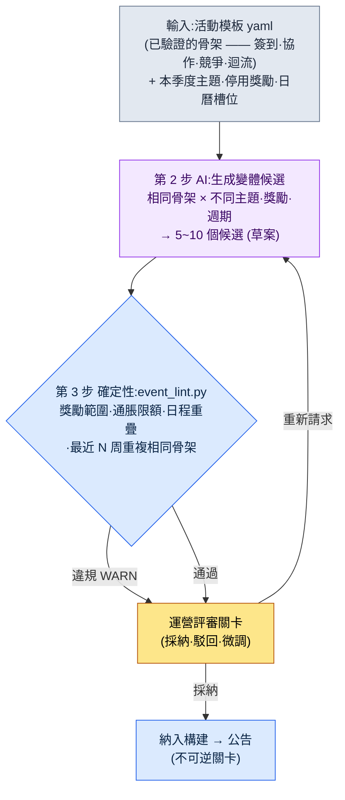
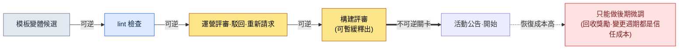

# 15.2 活動·賽季運營 —— 一張模板生成 10 個變體候選,評審只由人來做

> 第一讀者:負責運營(LiveOps)的 MMORPG 策劃(中等規模、10\~50 人的團隊)
> 面向單人/業餘讀者的精簡版:§15.2.9「一個人的話,做到這些就夠了」

回想一款上線運營到第 4 年的遊戲的週一例會。下週的活動要用什麼,每週都從一張白紙開始。有人說"上次的簽到活動獎勵調高一點再來一次?",就有人回"那是兩個月前做過的",而獎勵要調高多少,又是憑感覺定。會議一結束,一名運營策劃就要花上半天,從頭把活動表單填滿。每週,從白紙開始,半天。

問題不在於缺想法。運營團隊腦子裡其實已經有幾套經過驗證的活動骨架 —— 簽到·協作·競爭·迴流。往這些骨架裡換上主題和獎勵,一個為期一週的活動就出來了。只是這個"換裝"每次都靠手工、靠感覺,所以又慢,結果又飄忽。

本章要講的,就是把這個"換裝"交給 AI 的方法。核心有兩點。第一,把已驗證的活動骨架作為**可變體的模板 yaml**錄入。第二,把從模板中抽出下週多個候選這件枯燥事交給 AI,而人則**用程式碼卡住獎勵範圍·重複之後,只評審調性**。活動策劃的一般理論(簽到利於拉新、協作利於活躍之類)其他書裡已經講得夠多,本章只專注於把那些知識*放進 AI 工作流的那個位置*。

> **作者運營經驗備註(坦白說)**
> 上線後以 1\~2 年為單位親自負責運營的經驗,只佔作者職業生涯的一部分。本章的工作流是作者把正在運營的量產·評審工具(內容·HUD)搬到活動領域的產物,而效果數值是*業界觀察 + 作者推測*,這一點會在正文中隨處標明。工具結構(模板 yaml·lint·評審關卡)與作者實際運營的內容量產工具是同一套骨架。

---

## 15.2.1 人只做模板編寫和最後的評審

活動量產的整體流程分四步。核心在於:第 1 步(模板)和第 3 步(lint)是確定性的,只有第 2 步是 AI。這與內容量產(§6.2)·HUD 壓縮(§14.1)裡看到的是同一種分工。規則手冊從輸入和驗證兩頭把關,那麼夾在中間的 AI 每次給出略有不同的變體,獎勵平衡和日程也不會亂。



在這張圖裡,人的手只碰兩個地方。最上面,把模板和本季度的約束乾淨地放進去的位置;最下面,判斷 lint 抓不到的"這個主題合不合當下我們遊戲的氛圍"的位置。而這中間枯燥的候選量產和獎勵算術,由模板、AI 和 lint 來跑。

決定性的設計在於:即便 lint(第 3 步)發現了違規,也不會自動丟棄候選,而只是把 WARN 上報給運營關卡(第 4 步)。理由見 §15.2.5。還有,最後那條箭頭(公告)是**不可逆**的,這一點把運營和其他量產區分開來。城市 NPC 不滿意的話,構建前廢棄即可;但已向用戶公告的活動,想收回時要付出社群信任的代價(§15.2.7)。

---

## 15.2.2 輸入 —— 活動模板 yaml

把運營團隊手裡已驗證的骨架固化為表單。若放任為自由格式的策劃案,AI 就不知道該變體什麼。槽位分開了,"只換這個槽位"才成立。

```yaml
# event_templates/coop_raid.yaml —— 協作團本骨架 (已驗證,運營 4 次)
template_id: coop_raid
purpose: [現有活躍, 社群]             # 只 1~2 個。禁止同時追求 4 個
core_loop: 活動期間全服累計貢獻 → 按階段解鎖全服獎勵
duration_range: [5, 10]              # 天。超過 10 天會累積疲勞
slots:                               # ← AI 變體的槽位。骨架固定
  theme: { type: 自由, 約束: 遵守季度主題 }
  boss_or_target: { type: 自由, 約束: 優先複用現有Boss素材 }
  reward_tiers: { type: 獎勵列表, count: 3~5, 約束: 參照 reward_policy }
reward_policy:                       # ← lint 讀取的槽位。禁止變體
  強化石_per_event_max: 30           # 單次活動發放上限
  金幣_per_event_max: 50000
  限定時裝: 允許 (永久擁有, 經濟影響 0)
  現金類資源_直接發放: 禁止
inflation_guard:
  強化石_季度_累計上限: 90           # 季度內所有活動合計
post_event_kpi:                      # ← 事後自動測量槽位
  - 參與率 (相對活動曝光,參與 1 次以上)
  - 強化石價格變動 (事後 30 天,目標 ±10%)
  - 活動後工作日遊戲時長 (依賴度訊號)
```

最重要的分離是 `slots`(AI 變體)和 `reward_policy`(lint 讀取,AI 不得觸碰)。主題和 Boss 每次都可以不同,但強化石發放上限是遊戲經濟定下的紅線。這條紅線若被 AI 每次呼叫都抽出不同的數字,通脹就當場開始。所以獎勵*專案*由 AI 提議,但獎勵*數量*只能在策略範圍內浮動,這由 lint 來卡。

同一個資料夾裡,`daily_attendance.yaml`(簽到)、`pvp_ladder.yaml`(競爭)、`comeback.yaml`(迴流)以相同格式放著。這四張,就是本季度候選生成的全部輸入池。

---

## 15.2.3 [實操記錄] 一張模板 → 生成變體候選

把實際怎麼跑的一個完整週期從頭到尾展示一遍。輸入提示詞可以直接複製使用,輸出則還原了真實的量產會話。

### 第 1 步 —— 提示詞:讓它做變體,但強制骨架和策略

```
用附上的 coop_raid.yaml(經 4 次驗證的協作團本骨架),只給出下週(W2)的 5 個變體候選。
本季度主題是"夏日 —— 水·祭典·炎熱"。
絕對不要動 core_loop,只改 slots(主題·Boss·獎勵),
獎勵只能在 reward_policy 上限之內,每個候選都附一行說明為何是這個主題·這個獎勵。
最近 3 周是 簽到·PvP排位·協作團本,所以對又跑協作團本的候選打 [重複注意],
拿不準就打 [存疑] 交給我。只用表格,列為 候選名·主題·獎勵tier摘要·依據·標記。
```

六行規則裡,*指定*主題或獎勵的那種行,一行也沒有。全都是"只能改到哪裡、不許越過什麼、拿不準就上報"的圍欄。因為像"幫我做個夏日活動"這樣放開,出來的就是普通手遊 RPG 的平均水平。**變體範圍(只 slots)、獎勵上限(reward_policy)、重複注意(最近 3 周的歷史),以及"拿不準就交給人"** —— 這道圍欄讓骨架被守住、讓變體被放開。

### 第 2 步 —— Claude 的輸出(還原真實會話,節選)

```
| 候選名        | 主題            | 獎勵tier 摘要                  | 依據                              | 標記         |
|---------------|----------------|-------------------------------|----------------------------------|-------------|
| 攔洪之堤      | 阻擋河流泛濫    | 強化石 25 / 金幣 4萬 / 時裝     | 協作=築堤的隱喻,與累計貢獻直連     |             |
| 放河燈        | 夏日水祭        | 強化石 20 / 金幣 3萬 / 稱號     | 節日氛圍,比起競爭更重烘托氣氛      |             |
| 酷暑Boss戰    | 討伐酷暑化身    | 強化石 30 / 金幣 5萬 / 時裝     | 複用現有Boss素材,獎勵達上限        | [重複注意]   |
| 洋流競速      | 乘潮流競爭      | 強化石 28 / 金幣 4.5萬 / 坐騎   | 協作+競爭混合                     | [存疑]       |
| 錦鯉收集      | 收集型協作      | 強化石 22 / 金幣 3.5萬 / 稱號   | 輕度玩家進入門檻低                 |             |

[重複注意] 酷暑Boss戰:core_loop 與 W-3 的協作團本實質相同。
  間隔 3 周重複相同骨架 → 恐引發使用者疲勞。建議改用其他骨架(簽到/收集)。
[存疑] 洋流競速:把協作累計 + 個人競爭混進了同一個活動。
  purpose 槽位擴充套件為 [活躍+競爭]。可能與 1~2 個目的的原則衝突。
```

輸出裡最有價值的部分不是表格,而是**最下面那兩行**。AI 報告了自己的侷限並交給人 —— "酷暑Boss戰和 3 周前的骨架相同""洋流競速的目的增加到了兩個"。好的提示詞,能讓 AI 說得出"這個我沒把握"。

現在把這一批候選交給 lint 來卡。

---

## 15.2.4 第 3 步 lint —— 用程式碼卡住獎勵範圍·重複

候選是否守住了獎勵策略和日程重疊,每次都用眼睛看,又會漏。凡是靠 `reward_policy`·`inflation_guard`·日曆就能判定的,交給程式碼來評審。人只把時間花在程式碼抓不到的調性·趣味判斷上。

```python
# event_lint.py —— 活動變體候選驗證 (骨架)
# 輸入: AI 提出的候選列表 + 模板策略 + 季度日曆
# 輸出: WARN 列表 (不自動廢棄 —— 上報到運營關卡)

def lint(candidates, policy, quarter_ledger, recent_weeks):
    warns = []
    stone_used = sum(quarter_ledger.強化石)   # 本季度已發放的累計
    for c in candidates:
        # A: 單次活動獎勵上限 (策略)
        if c.強化石 > policy["強化石_per_event_max"]:
            warns.append(f"[A] {c.name}: 強化石 {c.強化石} > 上限 "
                         f"{policy['強化石_per_event_max']} (單次活動超出)")
        # B: 季度通脹累計上限
        if stone_used + c.強化石 > policy["強化石_季度_累計上限"]:
            warns.append(f"[B] {c.name}: 季度累計 {stone_used + c.強化石} > "
                         f"{policy['強化石_季度_累計上限']} (通脹限額)")
        # C: 最近 N 周重複相同骨架
        if c.template_id in recent_weeks[-2:]:
            warns.append(f"[C] {c.name}: {c.template_id} 骨架在最近 2 周出現過 (重複)")
        # D: 日曆槽位衝突 (同一周有其他大型活動)
        if quarter_ledger.slot_taken(c.week):
            warns.append(f"[D] {c.name}: W{c.week} 槽位已排入大型活動")
    return warns
```

把上面實操記錄裡的五個候選放進這段程式碼,結果如下。

```
[PASS] 攔洪之堤: 強化石 25 ≤ 30, 季度累計 65+25=90 ≤ 90 (觸及邊界)
[WARN] [C] 酷暑Boss戰: coop_raid 骨架在最近 2 周(W-3)出現過 (重複)
[WARN] [B] 洋流競速: 季度累計 65+28=93 > 90 (超出通脹限額)
[PASS] 放河燈: 強化石 20 ≤ 30, 季度累計 65+20=85 ≤ 90
[PASS] 錦鯉收集: 強化石 22 ≤ 30, 季度累計 65+22=87 ≤ 90
```

這裡有意思的是 `洋流競速`。AI 因為目的衝突打了 [存疑],而 lint 卻因為完全不同的理由 —— **超出季度通脹累計上限** —— 把它攔下。加上強化石 28,季度累計變成 93,超過策略規定的 90。AI 沒看到的算術,被程式碼抓住了。反過來,`酷暑Boss戰`則是 AI 的 [重複注意] 和 lint 的 [C] 指向了同一件事。人·AI·程式碼三者各用不同的網來篩。

多虧這 30 行,"這次獎勵是不是有點重?"不再以感覺對感覺收場。只要程式碼打出 `[B] 季度累計 93 > 90`,就沒什麼可爭的。要麼下調獎勵,要麼換候選。

---

## 15.2.5 把一個週期走到底 —— 評審·駁回·重新請求

若只抽象地寫"運營團隊來評審",就看不出這道關卡實際篩掉了什麼。這裡把通過 lint 之後人殺掉什麼、留下什麼,完整地跟到底一次。

> **[第 4 步 運營評審 —— 判定]**
>
> 運營策劃這樣處理了 5 個候選。
>
> - **酷暑Boss戰** → **駁回。** lint [C]·AI [重複注意] 同時指向它。3 周內又跑一次相同的協作團本骨架,"又是累計貢獻啊"的疲勞就來了。備註順延到下季度槽位。
> - **洋流競速** → **駁回。** lint [B] 超出通脹限額。把獎勵降到 25 就能通過,但 AI [存疑] 點出的目的衝突(活躍+競爭)才是更根本的問題。在協作活動裡摻進個人排名,輕度玩家會覺得"到頭來還是老玩家的狂歡"。不靠只砍獎勵來救,而是整個擱置。
> - **攔洪之堤** → **採納候選第 1 位。** 只是,lint 雖把 `季度累計 90 觸及邊界` 判為 PASS,但*邊界*這一點讓人不放心。用了這個活動,本季度強化石餘量就歸零。6 月最後一週賽季收尾衝刺就沒有獎勵餘力了。
> - **放河燈 / 錦鯉收集** → **留下。** 兩者獎勵都輕(20·22),給季度留下餘量。

這裡,人把通過了 lint 的 `攔洪之堤` 從第 1 位上動搖,正是這道關卡的核心。程式碼把 `90 ≤ 90` 判為 PASS。按策略不算違規。然而運營策劃看的是*整個季度的獎勵節奏*。lint 看的是單個活動的合法性,而人看的是季度末的賽季收尾。所以要走一次重新請求。

```
重新生成"攔洪之堤"的變體,把獎勵從強化石 25 → 18 下調。
理由:6 月最後一週的賽季收尾衝刺需要留出 12 點強化石餘量。
獎勵吸引力下降的部分,改用限定時裝·稱號來
補強體感價值,據此重構 reward_tiers。
```

AI 把強化石降到 18,並把限定時裝增加到 2 種(經濟影響為 0 的永久擁有獎勵),重新給出了候選。再跑一次 lint,`季度累計 65+18=83 ≤ 90`,賽季收尾還剩餘量 7。輸入 → 候選量產 → lint → 評審 → 駁回 → 重新請求的一個週期,在這裡閉合。

這一圈,是本書全書的 Show 標準。工具吐出什麼、什麼被攔、人殺掉什麼,若不哪怕一次地從頭看到尾,"用 AI 量產了活動"這句話就是空的。

沒有裝自動廢棄型 lint 的理由也在這個週期裡。假如 lint 把 [B] 違規自動丟棄,運營團隊就失去了學習 `洋流競速` 真正問題(目的衝突)的機會,也失去了動搖 `攔洪之堤` 這種*合法但按季度節奏有風險*的候選的位置。可疑的候選由機器來挑,而採納和駁回由人來定。

---

## 15.2.6 賽季 —— 更大的節奏,相同的分離

如果說活動是周\~月的節奏,那賽季就是季度的節奏。運營方式相同。賽季也一樣,把已驗證的要素分離成槽位,每季度就只換主題。

| 賽季槽位 | 變體(AI·人) | 固定(策略·lint) |
|---|---|---|
| 賽季主題 | 夏季·冬季·新年 (自由) | — |
| 賽季通行證獎勵軌道 | 各階段獎勵項 | 階段數·完成難度·獎勵上限 |
| 賽季 PvP 排行 | 排行獎勵項 | 獎勵通脹限額 |
| Meta 洗牌 | 新角色·數值平衡 | 變更幅度護欄(§8.1) |

賽季通行證裡,人以策略固定的核心數值是**完成率目標**。把難度定到讓大約 70% 的活躍使用者能到達最終階段,這是業界常被引用的基準(作者推測 —— 各遊戲不同,所以應當讀作*方向*而非絕對值:低於 30% 會挫敗,超過 90% 則缺乏挑戰感)。這個目標一旦錄入槽位,AI 提議賽季通行證變體時,也能被強制一併算出"預期完成率"。

季度日曆要一眼看清,活動和賽季才不會衝突。這更接近運營團隊公用的檯曆。誰看都看到同一張圖,衝突才會減少。

<svg viewBox="0 0 720 300" xmlns="http://www.w3.org/2000/svg" role="img" aria-label="第2季度(4~6月)活動·賽季整合日曆">
  <rect x="0" y="0" width="720" height="300" fill="#0f1117"/>
  <text x="16" y="26" fill="#e5e7eb" font-family="sans-serif" font-size="15" font-weight="bold">第2季度整合日曆 —— 賽季 1 個(季度)，活動以周為單位</text>
  <!-- 賽季條 -->
  <rect x="16" y="42" width="688" height="30" rx="5" fill="#1e3a5f" stroke="#3b82f6" stroke-width="1.5"/>
  <text x="360" y="62" fill="#bfdbfe" font-family="sans-serif" font-size="13" text-anchor="middle">賽季"夏日祭"(賽季通行證 50 階 · PvP 排行) —— 4 月~6 月常駐</text>
  <!-- 月份分隔 -->
  <text x="130" y="96" fill="#9ca3af" font-family="sans-serif" font-size="12" text-anchor="middle">4月</text>
  <text x="360" y="96" fill="#9ca3af" font-family="sans-serif" font-size="12" text-anchor="middle">5月</text>
  <text x="590" y="96" fill="#9ca3af" font-family="sans-serif" font-size="12" text-anchor="middle">6月</text>
  <line x1="245" y1="84" x2="245" y2="270" stroke="#374151" stroke-width="1" stroke-dasharray="4 4"/>
  <line x1="475" y1="84" x2="475" y2="270" stroke="#374151" stroke-width="1" stroke-dasharray="4 4"/>
  <!-- 活動塊:顏色 = 骨架種類 -->
  <!-- 4月 -->
  <rect x="20" y="110" width="100" height="34" rx="4" fill="#14532d"/><text x="70" y="131" fill="#bbf7d0" font-size="11" text-anchor="middle">W1 簽到</text>
  <rect x="128" y="110" width="100" height="34" rx="4" fill="#7c2d12"/><text x="178" y="131" fill="#fed7aa" font-size="11" text-anchor="middle">W2 協作(堤壩)</text>
  <!-- 5月 -->
  <rect x="250" y="110" width="100" height="34" rx="4" fill="#581c87"/><text x="300" y="131" fill="#e9d5ff" font-size="11" text-anchor="middle">W3 PvP排位</text>
  <rect x="358" y="110" width="100" height="34" rx="4" fill="#14532d"/><text x="408" y="131" fill="#bbf7d0" font-size="11" text-anchor="middle">W4 收集協作</text>
  <!-- 6月 -->
  <rect x="480" y="110" width="100" height="34" rx="4" fill="#7c2d12"/><text x="530" y="131" fill="#fed7aa" font-size="11" text-anchor="middle">W5 迴流</text>
  <rect x="590" y="110" width="110" height="34" rx="4" fill="#854d0e"/><text x="645" y="131" fill="#fde68a" font-size="11" text-anchor="middle">W6 賽季收尾</text>
  <!-- 通脹量表 -->
  <text x="16" y="180" fill="#9ca3af" font-family="sans-serif" font-size="12">季度強化石通脹累計 (上限 90)</text>
  <rect x="16" y="190" width="688" height="22" rx="4" fill="#1f2937"/>
  <rect x="16" y="190" width="635" height="22" rx="4" fill="#b45309"/>
  <line x1="651" y1="184" x2="651" y2="218" stroke="#ef4444" stroke-width="2"/>
  <text x="640" y="232" fill="#fca5a5" font-size="11" text-anchor="end">當前累計 83 / 限額 90 (餘量 7 = 賽季收尾衝刺的份額)</text>
  <!-- 圖例 -->
  <rect x="16" y="252" width="14" height="14" fill="#14532d"/><text x="36" y="264" fill="#9ca3af" font-size="11">簽到·收集</text>
  <rect x="120" y="252" width="14" height="14" fill="#7c2d12"/><text x="140" y="264" fill="#9ca3af" font-size="11">協作·迴流</text>
  <rect x="240" y="252" width="14" height="14" fill="#581c87"/><text x="260" y="264" fill="#9ca3af" font-size="11">競爭(PvP)</text>
  <rect x="360" y="252" width="14" height="14" fill="#854d0e"/><text x="380" y="264" fill="#9ca3af" font-size="11">賽季活動</text>
</svg>

這一張圖,把 §15.2.5 的判斷用視覺解釋了。顏色就是骨架種類。**同一種顏色在 2\~3 周內出現兩次,§15.2.4 的 lint [C] 就會響。** 而下方的通脹量表已逼近紅線(上限 90),6 月賽季收尾(W6)能用的餘量只勉強剩 7 —— 正是把 `攔洪之堤` 獎勵降到 18 才保住的那個 7。

---

## 15.2.7 不可逆關卡 —— 在公告前結束所有評審

城市 NPC(§6.2)或 HUD(§14.1)與運營有一點決定性的不同。**公告無法收回。** NPC 調性不合,構建前廢棄即可,使用者根本不知道那個 NPC 存在過。然而已向用戶公告的活動,其獎勵·週期·規則都留在了社群裡。開始之後再說"活動獎勵太重了,要收回",就伴隨著不可逆的代價。



本書全書的原則(§5.4.5 配音錄製、§8.1 線上構建、第 12 部分最終渲染都是同一條訊息),在運營中同樣成立。所有評審 —— 獎勵範圍、通脹限額、日程衝突、調性 —— 都必須在公告前的可逆階段結束。§15.2.3\~5 的量產·lint·評審·重新請求整個週期,之所以都在這道不可逆關卡的*左側*轉,原因就在這裡。越過關卡之後能做的,頂多是 §15.2.8 的後期微調,而那也在一點點消耗使用者信任。

---

## 15.2.8 運營中的訊號與處方

公告之後 KPI 照看。只是,與公告前的評審不同,這裡能做的只有後期微調。把自動測量的訊號和人的處方分開。

| 訊號 (自動測量) | 處方 (人來決定) |
|---|---|
| 參與率低於 50% | 後期小幅增強獎勵,或延長週期 +2 天 (在公告可信範圍內) |
| 參與率 95% 以上 | 太簡單 —— 記下一週期的難度備忘,當前活動保持不變 |
| 強化石價格事後 30 天跌幅超過 -10% | 強化 sink(限定商店),下季度下調通脹限額 |
| 活動後工作日遊戲時長下降 | 活動依賴訊號 —— 增強工作日內容吸引力,調節活動頻率 |

最後一行(工作日遊戲時長下降)是最常被漏掉的訊號。只看活動期間的 DAU(Daily Active Users,日活躍使用者),活動總像是成功。然而活動結束後,若使用者在工作日不回來,就意味著活動在吸食平日遊戲本身的吸引力。所以在 §15.2.2 模板的 `post_event_kpi` 裡,從一開始就把"活動後工作日遊戲時長"作為槽位錄入。不測量,就無法處方。

---

## 15.2.9 效果能誠實地說到哪一步

活動這一章,很容易起想放一張"跑了協作活動,留存率就從 30% 漲到 50%"這樣的表的念頭。這類數字如果未經驗證,會削掉本書的信任。本章能說的只有三點。

第一,**方向可以用業界觀察來說。** 簽到獎勵強化型活動會拉高短期活躍使用者數,協作活動會提升社群凝聚,限定禮包會拉高活動期間的營收 —— 這是觀察線上運營遊戲而來的業界通識。只是*多少*會因遊戲·使用者構成而偏差很大,把別家公司的數字照搬過來很危險。

第二,**作者的推測就寫成推測。** "賽季通行證完成率目標 70%""活動週期超過 10 天會累積疲勞""活動量產半天→一小時"都是作者基於經驗的推測,是未經驗證的假設。別去背絕對值,讀作*結構*(模板+lint 取代白紙策劃)就行。

第三,**只把可測量的東西作為 KPI 來承諾。** 留存率這類結果指標不會由單個活動左右,所以不去斷定因果。相對地,這套工作流真正能讓其變得可測量的,是這些東西 —— lint WARN 件數(直到獎勵違規變為 0)、季度通脹累計(相對上限)、相同骨架重複間隔(周)、各活動的參與率與事後強化石價格變動。這四項,在會議上就能用數字而非"感覺"來說。

---

## 15.2.10 常見的失敗

| 模式 | 為何失敗 | 處方 |
|---|---|---|
| 每週從白紙開始策劃活動 | 慢且結果不穩定 | 把已驗證的骨架錄入模板 yaml (§15.2.2) |
| "AI 幫我做個夏日活動"整包外包 | 出來的是普通 RPG 平均水平的活動 | 固定骨架 + 只變體槽位 (§15.2.3) |
| 獎勵數量讓 AI 自由提議 | 通脹當場開始 | 用 lint 強制 reward_policy (§15.2.4) |
| 只用眼睛評審候選 | 每次都漏掉季度累計·重複間隔 | 用 event_lint.py 自動驗證 (§15.2.4) |
| lint 通過 = 直接採納 | 看不見季度節奏·目的衝突 | 人工關卡要看整個季度 (§15.2.5) |
| 公告後試圖回收獎勵 | 不可逆的信任成本 | 所有評審都在公告前完成 (§15.2.7) |
| 只測量活動期間的 DAU | 看不見對工作日吸引力的侵蝕 | 事後工作日遊戲時長槽位 (§15.2.8) |

第五個最常被漏掉。一 lint PASS 就直接送去公告,那麼像 `攔洪之堤` 那樣*合法但會把季度末獎勵餘力變為 0*的候選,就沒了被動搖的位置。程式碼看單個活動的合法性,人看整個季度的節奏。

---

## 15.2.11 動手試試 —— 今天就能做的一步

> **一個人的話,做到這些就夠了**:不用 lint 程式碼也行。從你自己的遊戲(或你喜歡的線上運營遊戲)裡,挑一個常見的活動骨架,按 §15.2.2 的格式手寫一份模板 yaml(`core_loop`·`slots`·`reward_policy` 這三欄是核心)。然後貼上 §15.2.3 的提示詞抽出 5 個變體候選,再從中挑一個你覺得"獎勵太重"的,反駁它"這個超出了本月的獎勵餘力,調低了重來"。採納和駁回究竟是怎樣一組判斷,會親身體會到。

如果是團隊,就從下面這一步開始。把常跑的 3\~4 個活動骨架錄入為模板 yaml,先把 `event_lint.py` 的三行(獎勵上限·季度通脹累計·重複間隔)做成程式碼。哪怕只有模板和這三行,也能先擋住"每週白紙策劃"和"獎勵憑感覺定"這兩種常見失敗。這套工作流,是 §15.1.5 的漸進式應用骨架三要素 —— 活動模板·賽季規則庫、AI 活動候選生成器、事後自動測量 —— 的第一個實務實現。

---

### 本章要點
- 把已驗證的活動骨架錄入為模板 yaml,AI 就只變體槽位來量產候選。
- 獎勵數量·通脹限額·重複間隔由 lint 來卡,調性·季度節奏由人來卡。
- 公告是不可逆的,所以所有評審都在公告前的可逆階段結束。

### 下一章預告
- 15.3 使用者反饋迴圈 —— 使用者意見與總監願景的平衡,以及反饋的自動聚類
