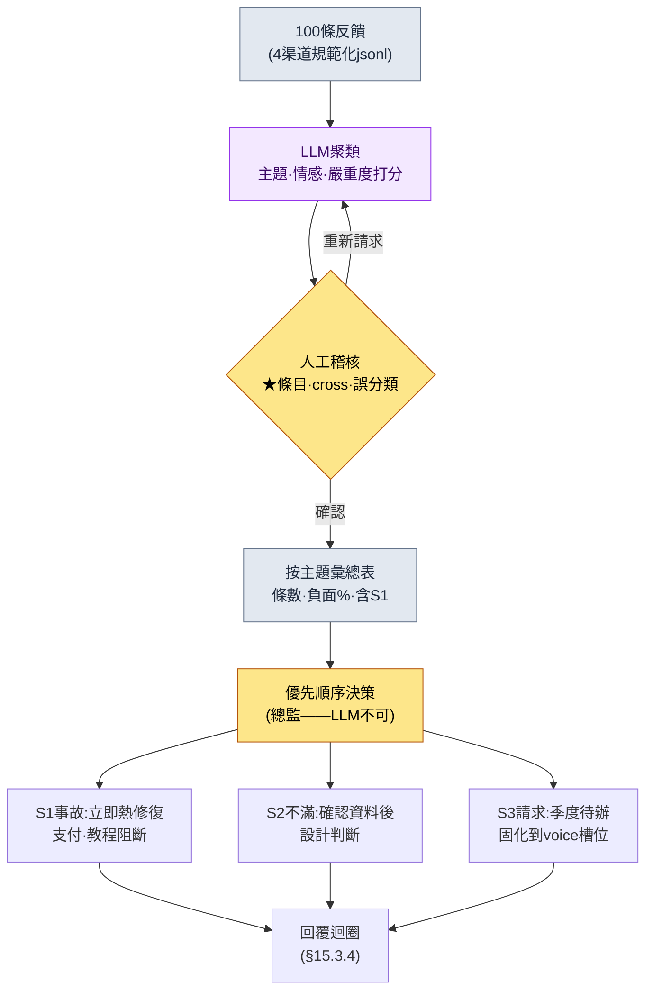

# 15.3 把100條反饋歸為主題——聚類交給LLM,優先順序交給人

> 主要讀者:負責運營（LiveOps）中使用者應對的策劃、總監（中等規模（10\~50人）團隊）
> 面向個人/業餘讀者的精簡版:§15.3.7「一個人的話,只做這些」

先坦白一點。筆者在產品上線後以1\~2年為週期親自負責運營的經驗並不算長。本章的相當一部分,是建立在24年從業經歷之上的**業界觀察與相鄰經驗**。所以本章不會斷言"運營就該這麼做"。相反,筆者把上線前量產內容時驗證過的*輸入 → AI → 驗證 → 人工決策*這一迴圈,原樣套到**使用者反饋**這個輸入上,完整地跑一遍,看會得出什麼。工具的骨架與§6.2的city_hunting_generator相同,只是輸入從"城市後設資料"換成了"100條使用者反饋"。

運營第一週的景象大都相似。論壇、Discord、客服工單、商店評論每天堆積成百上千條。人不可能全部讀完,而不讀的話,同一個bug會有50條報告被埋掉。本章講的方法是:先讓**LLM把這堆反饋按主題歸類、並按情感打分**,然後人只投入到"那麼這周該修什麼"這一**優先順序決策**上。

---

## 15.3.1 反饋不是'讀物',而是'分類輸入'

把反饋分成4個渠道（遊戲內問卷、論壇/Discord、商店評論、客服工單）、再歸為4種類型（bug、請求、不滿、表揚）的表格,哪本運營教科書裡都有。這些說的都對。問題在於,就算背下這張表,也答不出"今天湧進來的412條該怎麼處理"。只要還把反饋看成*供人閱讀和分類的物件*,反饋量就永遠會壓過運營團隊的人手。

換個視角。一條反饋就是一份**結構化輸入**,是一條擁有 `{來源, 原文, 主題, 情感, 嚴重度}` 五個槽位的記錄。這樣一看,工作的本質就變了:不是"全部讀完",而是"按主題歸類、排出優先順序"。而且,主題聚類和情感打分,人來做既枯燥、每次的標準還會飄移,但機器會用同一把尺子同樣地量這100條。這正是LLM比人更擅長的那類工作。§6.2中量產30座城市時的那套分工（規則手冊=確定性,正文=AI,稽核=人）,在這裡同樣成立。唯一的不同是:最後人做的事不再是"正文稽核",而是"優先順序決策"。

這裡點明反饋型別的一個分佈特徵。會主動發言的使用者,往往不是滿意的使用者,而是心懷不滿的使用者。滿意的客人會悄悄離開,不滿的客人才會重新走回櫃檯。所以論壇、評論裡的情感分佈,往往會比實際全體使用者的滿意度更偏向負面（筆者的觀察——具體偏差幅度因遊戲、渠道、時期而異,所以不該當成絕對數字,而應作為*方向*來讀）。只有把這種偏差放在心裡,當你在聚類結果裡看到"負面60%"時,才不會誤讀成遊戲正在走向失敗。

---

## 15.3.2 [實操記錄] 100條反饋 → 主題聚類 + 情感

下面實際把一個迴圈完整跑一遍。輸入是某一週從4個渠道彙集的100條反饋,輸出是主題聚類、情感、優先順序。輸入提示詞可以原樣複製使用,下面的輸出是按真實分類會話的格式重現的。

### 第1步——輸入:把反饋做成機器能讀的表

把從各渠道抓取來的原文,規範化成一行一條記錄。這不是重新寫,只需要抽取、整理即可。

```jsonl
{"id": "fb_0001", "src": "discord",     "text": "強化12級失敗了50次。這機率正常嗎?請退款"}
{"id": "fb_0002", "src": "store_review","text": "畫面很漂亮,但太卡了,每次公會戰都閃退"}
{"id": "fb_0003", "src": "cs_ticket",   "text": "已經付款了但鑽石沒到賬,附上訂單號"}
{"id": "fb_0004", "src": "forum",       "text": "新職業弓箭手什麼時候出啊 嗚嗚 預約的時候不是承諾過了嗎"}
{"id": "fb_0005", "src": "discord",     "text": "開服第一週,運營團隊溝通得不錯,公告也快。以後也拜託了"}
{"id": "fb_0006", "src": "store_review","text": "某個Boss(黑狼)的傷害太離譜了。滿裝備也被一下秒殺。要求做平衡性補丁"}
{"id": "fb_0007", "src": "cs_ticket",   "text": "教程第5步無法繼續,按鈕點不動(裝置:Galaxy A系列)"}
// ... fb_0008 ~ fb_0100 (省略)
```

記錄在輸入階段先把 `主題·情感·嚴重度` 留空。填上這些空格,就是第2步LLM的工作。

### 第2步——提示詞:讓它聚類,但強制約束標籤、格式與退出口

```
把附件feedback_100.jsonl(一週的100條反饋)按主題歸類,並同時給情感打分。
主題只能從這個列表裡選(禁止自由生成):強化/機率、平衡、伺服器/效能、支付/退款、
新內容請求、教程/新手引導、UI/操作、表揚/支援、其他。「其他」超過8條,就再提出新主題候選。
情感分為負面、中立、正面,嚴重度用S1、S2、S3、S4。
// (意圖:S1僅限具體、可復現、功能阻斷的情況。單純的強烈不滿歸為S2)
沒把握的條目就放進「其他」,並在id末尾加★交給我,不要硬湊。
只給兩張表 —— 表A(逐條):id、主題、情感、嚴重度 / 表B(按主題):主題、條數、負面%、代表原文1條、是否含S1。
```

在這條提示詞裡,真正左右分類結果的,既不是主題列表,也不是情感刻度,而是*固定*標籤、*釘死*格式、*留出*退出口這三道控制裝置。如果放任LLM自由生成主題,它就會造出"整體不滿意""希望改善遊戲性"這類無法用於排優先順序的籠統標籤。允許的標籤列表（規則1）、嚴重度定義（規則3——S1的狹窄定義是關鍵）、輸出格式（兩張表）,以及"沒把握就加★交給人"（規則5）。這四點一旦缺失,表格就會從優先順序工具淪為又一份讀物。這份標籤列表本身,就是§15.1.5裡說的*反饋L4層的分類體系*——標籤固定下來,才能每個季度都用同一根軸來比較走勢。

### 第3步——Claude的輸出（重現,節選）

```
[表A] 逐條分類(節選)
id       | 主題           | 情感 | 嚴重度
fb_0001  | 強化/機率       | 負面 | S2
fb_0002  | 伺服器/效能      | 負面 | S2
fb_0003  | 支付/退款       | 負面 | S1
fb_0004  | 新內容請求       | 中立 | S3
fb_0005  | 表揚/支援       | 正面 | S4
fb_0006  | 平衡           | 負面 | S1
fb_0007  | 教程/新手引導    | 負面 | S1
fb_0042★ | 其他           | 中立 | S3
...

[表B] 按主題彙總(全部100條)
主題           | 條數 | 負面% | 代表原文                        | 含S1
伺服器/效能     | 24  | 92%  | "每次公會戰都閃退"                | 是(部分可復現)
強化/機率       | 21  | 95%  | "12級失敗了50次"                 | 否
平衡           | 14  | 86%  | "黑狼滿裝備也被秒"                | 是
新內容請求      | 12  | 8%   | "弓箭手什麼時候出"                | 否
教程/新手引導   | 9   | 78%  | "第5步按鈕點不動(Galaxy A)"       | 是
支付/退款       | 8   | 100% | "鑽石沒到賬"                    | 是
UI/操作        | 6   | 67%  | "技能按鈕太小誤觸"                | 否
表揚/支援       | 4   | 0%   | "運營團隊溝通得不錯"              | 否
其他           | 2   | -    | (fb_0042★、fb_0067★ 待人工判定)   | -

整體情感:負面71 / 中立18 / 正面11
「其他」2條(不足8條)→ 無需提出新主題
未達把握★標記2條:fb_0042、fb_0067(請求人工判定)
```

這段輸出裡最有價值的部分不是表格,而是**最下面兩行,那"★標記2條"**。這是LLM主動申報自己歸不了類、並把它交給人的地方。這與§6.2中AI給NPC'格雷姆'自行打上"存疑標記"是同一套設計。好的提示詞,會讓AI能夠說出"這個我沒把握"。

### 第4步——驗證與否決（人的位置）

這份輸出不能照單全收。有一處確實卡住了。

`強化/機率` 主題的21條全部被歸為S2（不滿）。可其中fb_0001帶了一句"請退款"。LLM只把它看作"強烈不滿（S2）"。這裡就需要人介入。對強化機率的不滿——只要資料顯示機率是按規格運作的——就不是S1事故。因為對按規格運轉的機率的不滿,是*設計、體感問題*,而不是*bug*。LLM的S2判定沒錯。只是"要求退款"這個訊號,應當cross-link到支付主題,讓客服另行處理。LLM只給主題打了單一標籤,漏掉了一條同時橫跨兩個主題的情況。

於是重新請求。

```
新增規則:如果一條同時橫跨兩個主題(例如:強化不滿+退款要求),在主主題之外,
在「cross」列寫上次要主題。給表A增加cross列後重新輸出。
但強化機率的不滿本身,只要資料上機率符合規格,就不算S1,而保持為S2。
```

這一次往返就結束了。LLM對fb_0001重新給出了 `主題=強化/機率, cross=支付/退款, 嚴重度=S2`,而那★標記的2條則由人親自閱讀,把fb_0042重新歸入 `UI/操作`、fb_0067歸入 `教程/新手引導`。**100條若由人從頭讀、從頭分類要耗上大半天,而LLM初稿 + 人工稽核 + 一次往返則在一小時以內**（筆者估計,未經驗證的假設——具體能省多少,會隨反饋條數、渠道數量而變,所以與其記絕對時間,不如把它當作"從頭手工"和"初稿+稽核"之間的結構差異來讀）。

---

## 15.3.3 優先順序LLM給不了——人的位置

這裡劃出一條決定性的界線。上面的表B只說到"哪個主題有多少條、有多負面"為止。**"那麼這周該先修什麼",LLM是給不出的。** 那是牽涉成本、日程、遊戲願景的決策,而這個決策的責任在總監身上。

面對同一張表,兩個運營團隊可能做出截然相反的決定。只看條數,`伺服器/效能`（24條）和`強化/機率`（21條）排在第1、2位。可優先順序並不按條數順序走。原因在於**嚴重度與可逆性**。



在這個流程裡,人手真正觸及的只有兩處:中間的稽核關卡（判定★、cross、誤分類）,以及最下方的優先順序決策。中間那枯燥的100條分類,交給LLM去跑。而優先順序決策真正的邏輯,不是條數,而是下面三根軸。

| 主題 | 條數 | 優先順序判斷（總監的職責） |
|---|---|---|
| 支付/退款 (S1) | 8 | **第1優先。** 條數雖少,但功能阻斷 + 不可逆（涉及錢）。24h熱修復 |
| 教程/新手引導 (S1) | 9 | **第2優先。** 直接關係到新使用者流失。特定裝置可復現 → 打補丁 |
| 伺服器/效能 | 24 | **第3優先。** 條數最多,但屬於基礎設施改動 = 週期長。無法熱修復,放到下週 |
| 強化/機率 (S2) | 21 | **維持。** 資料上符合規格就不是bug。作為設計決策另行研究 |
| 新內容請求 | 12 | **待辦。** 負面8%（=正面期待）。固化到季度voice槽位 |

條數第1的`伺服器/效能`之所以降到優先順序第3,是因為它是熱修復修不了的基礎設施工作；條數第6的`支付/退款`之所以升到第1,是因為它是牽涉金錢的不可逆事故。**這種重新排序,LLM做不到。** LLM只能給出"支付8條、負面100%"這樣的事實。至於"它是第1優先"這個判斷,則屬於懂得成本、法律風險、遊戲願景的人。這正是§15.1.5裡所說"AI負責分類、生成候選,人則專注於採納與願景決策"在反饋領域的真實樣貌。

---

## 15.3.4 回覆——不可逆階段,稽核關卡更重

優先順序定下來後,就要回複用戶。在運營中,回覆缺位是對信任傷害最大的地方。哪怕沒有可答的內容,一句"正在處理"也勝過毫無回應。回覆草案同樣可以讓LLM按主題生成。

> **[回覆草案——LLM輸出,按主題]**
>
> - **支付/退款（S1）**:"鑽石未發放的問題已確認。將按訂單號在24小時內補發,並逐一單獨回覆。"
> - **伺服器/效能**:"公會戰時出現的閃退正在復現確認中。計劃在下週維護中優先處理,並會通過公告同步進展。"
> - **強化/機率**:"強化機率完全按規格標註生效,這一點我們已通過資料確認。不過對於體感難度方面的意見,我們正在另行研究。"
> - **新內容請求（弓箭手）**:"新職業已在路線圖上,一旦日程確定,會第一時間釋出公告。"

這裡與§6.2有一處決定性的不同。**回覆的傳送是不可逆階段。** 城市NPC廢棄後重做即可,但使用者一旦看過的公告、回覆文本,是收不回來的。若自動發出"24小時內發放",實際卻花了三天,那個承諾就會以不可逆的痕跡留在社群裡。所以§15.1.4的不可逆階段原則,在反饋領域比在其他領域運作得**更重**。自動回覆草案交給LLM生成,但**在通過客服稽核關卡之前,一個字也不自動傳送。** 稽核者只看:日程承諾（24h、下週）是否與實際工作日程相符,以及敏感個案（法律糾紛、退款糾紛）有沒有混進自動傳送池。這是讓人來承擔lint抓不到的判斷的位置。

| 階段 | 可逆性 | 由誰 |
|---|---|---|
| 反饋聚類、情感打分 | 可逆（可自由重跑） | LLM |
| 主題稽核、優先順序決策 | 可逆（確定前） | 人（總監） |
| 回覆草案生成 | 可逆（可廢棄、重寫） | LLM |
| **回覆傳送、公告發布** | **不可逆（使用者已感知）** | **人（客服稽核後）** |

---

## 15.3.5 把使用者voice固化進季度覆盤

要讓同樣的反饋不至於每個季度被搖擺成不同的決定,就得把聚類結果**固化為季度覆盤的固定輸入槽位**。不是憑一時印象說"最近強化的不滿好像挺多",而是每個季度用同一根標籤軸彙總出的表,進入覆盤表格之中。§15.3.2裡禁止自由生成標籤、用允許列表把它固定下來的理由,在這裡得到回收。

> **2026 Q2 使用者voice（LLM自動彙總,季度累計）**
> ```
> 4類渠道累計約5,000條聚類(條數為季度實際統計——並非加工)
>
> 負面靠前主題:   強化/機率 > 伺服器/效能 > 平衡 > 支付/退款
> 請求靠前主題:   新職業 > 新狩獵場 > 公會系統 > UI改進
> 季度情感走勢:   Q1負面68% → Q2負面71%(小幅惡化——強化主題拉動)
> ```

這張表成為季度決策的*輸入*。決策本身歸總監,輸入歸使用者。季度走勢（"Q1 68% → Q2 71%"）只作為*方向*來讀。訊號不是單個季度的絕對值,而是同一根標籤軸上的變化方向。如果負面%升高了,就回溯"是哪個主題把它拉上去的",並連線到下一季度的優先順序。這份季度報告的草案本身,也由LLM用自然語言生成,人只在上面加決策批註——這正是§15.1.5裡所說季度報告自動初稿的真實位置。

---

## 15.3.6 誠實對待數字的方法

運營這一章,很容易忍不住想放上"引入反饋迴圈後,NPS從20升到了45"這樣的表格。筆者從未測量過那種因果,所以不寫。本書的原則是以下三條之一。

第一,**實測統計的條數照原樣使用。** §15.3.2裡按主題的條數（伺服器24、強化21、支付8）和§15.3.5的季度累計,都是把分類結果一條條數出來的值,而不是為了好看而湊出的比例。

第二,**估計就寫明是估計。** "100條分類從大半天→一小時"（§15.3.2）、"論壇情感偏向負面"（§15.3.1）是基於筆者經驗、觀察的估計,是未經驗證的假設。不必去記絕對值,只要作為*方向*（反饋量永遠壓過人手；主動發的帖子往往偏向不滿）來讀就好。

第三,**只把可測量的東西作為指標來承諾。** 反饋迴圈真正可測量的,不是結果滿意度（NPS）,而是過程指標——未分類反饋的存量（目標0）、S1事故發現→熱修復的前置時間（lead time）、回覆響應時間、"其他"主題的佔比（允許標籤裝不下現即時,"其他"就會膨脹）。這四項,在會議上都能用數字而非"感覺"來說。

---

## 15.3.7 動手試試——今天就能做的一步

> **一個人的話,只做這些**:不需要客服系統,也不需要資料集。把你自己遊戲（或你喜歡的遊戲）的商店評論、社群帖子,手動複製20\~30條做成jsonl(`{"id":..., "src":..., "text":...}`),把§15.3.2的提示詞原樣貼上去跑一遍。在得到的表B裡,找出"條數第1的主題"和"你最想先修的主題"不一致的那一處,用一行字寫下為什麼不同——你就會切身體會到,優先順序為什麼不是LLM的活,而是人的活。

如果是團隊,就從下面這一步開始。先把"將4渠道反饋彙集成一行一條記錄jsonl的抽取指令碼",以及§15.3.2的**允許主題標籤列表**固定下來。標籤固定了,無論是LLM分類還是人工分類,才能用同一根軸來衡量、比較季度走勢。自動回覆是再往後的事——回覆不可逆,沒有客服稽核關卡,就絕不接入自動傳送。

---

### 本章要點
- 反饋不是讀物,而是分類輸入——聚類、情感交給LLM,優先順序交給人。
- 優先順序不由條數、而由嚴重度與可逆性決定（支付8條 > 伺服器24條）。
- 回覆不可逆,所以客服稽核關卡比其他領域更重。

### 下一章預告
- 16.1 TaskForce運作——促成跨領域共識的工具
